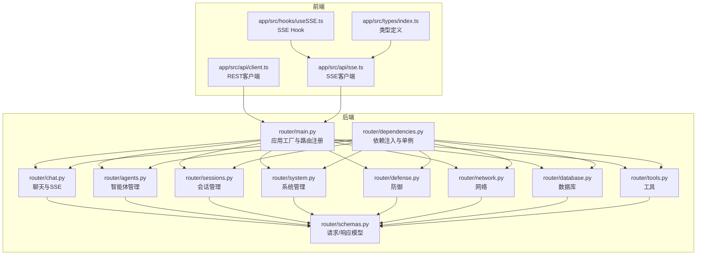
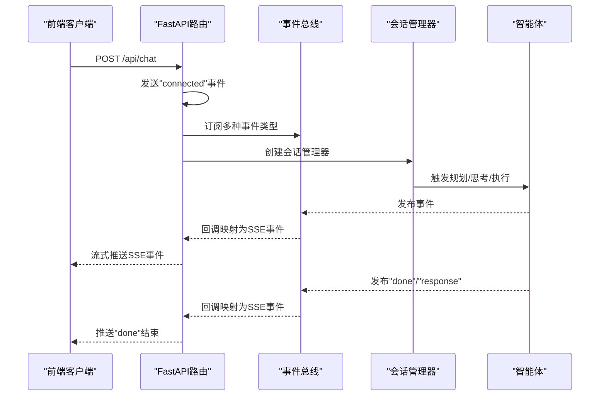
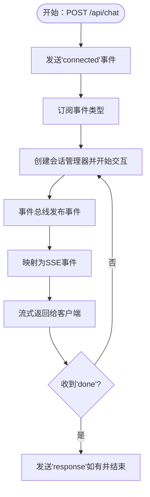
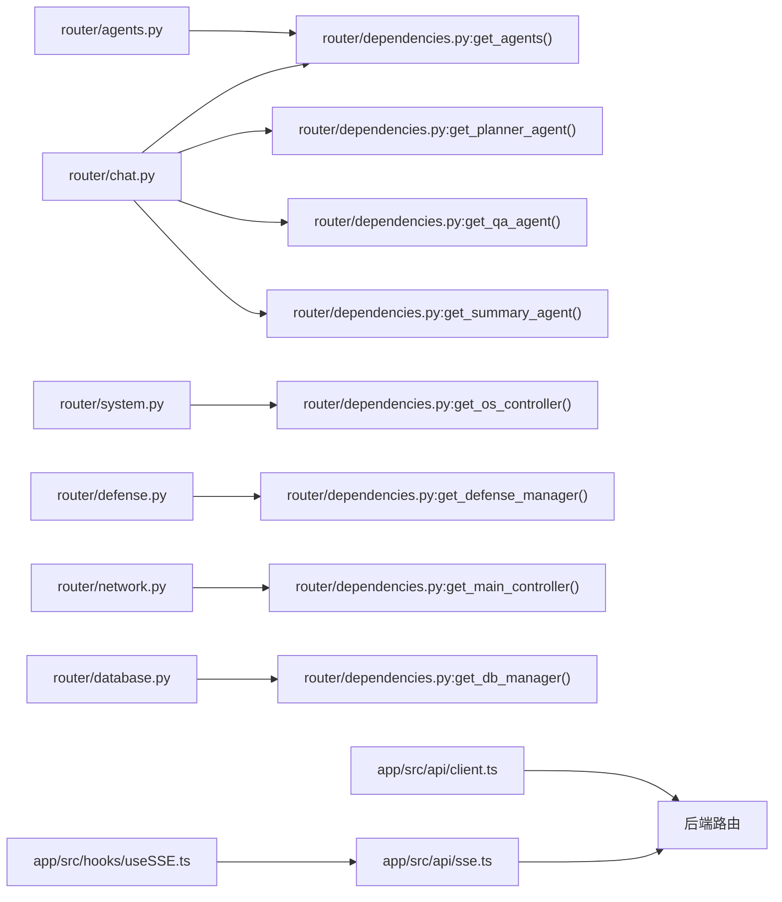

# API接口文档

<cite>
**本文档引用的文件**
- [router/main.py](file://router/main.py)
- [router/chat.py](file://router/chat.py)
- [router/agents.py](file://router/agents.py)
- [router/sessions.py](file://router/sessions.py)
- [router/system.py](file://router/system.py)
- [router/defense.py](file://router/defense.py)
- [router/network.py](file://router/network.py)
- [router/database.py](file://router/database.py)
- [router/tools.py](file://router/tools.py)
- [router/schemas.py](file://router/schemas.py)
- [router/dependencies.py](file://router/dependencies.py)
- [app/src/api/client.ts](file://app/src/api/client.ts)
- [app/src/api/sse.ts](file://app/src/api/sse.ts)
- [app/src/hooks/useSSE.ts](file://app/src/hooks/useSSE.ts)
- [app/src/types/index.ts](file://app/src/types/index.ts)
</cite>

## 目录
1. [简介](#简介)
2. [项目结构](#项目结构)
3. [核心组件](#核心组件)
4. [架构总览](#架构总览)
5. [详细组件分析](#详细组件分析)
6. [依赖关系分析](#依赖关系分析)
7. [性能考虑](#性能考虑)
8. [故障排除指南](#故障排除指南)
9. [结论](#结论)
10. [附录](#附录)

## 简介
本文件为Secbot的API接口系统提供完整的REST API文档，覆盖健康检查、聊天接口（SSE流式通信）、智能体管理、会话管理、系统管理、防御、网络、数据库、工具等全部公共API端点。文档包含：
- 每个端点的HTTP方法、URL模式、请求/响应模型、参数说明与返回值定义
- SSE事件类型与实现机制说明
- 认证方式、错误处理策略、速率限制与版本控制
- 常见使用场景的调用示例与客户端实现指南
- 性能优化建议与调试工具使用指导

## 项目结构
后端基于FastAPI，采用模块化路由组织，统一在应用工厂中注册路由，并在启动时完成数据库初始化。前端React Native应用通过fetch进行REST调用，SSE通过自研客户端解析。

**图表来源**
- [router/main.py](file://router/main.py#L19-L71)
- [router/chat.py](file://router/chat.py#L27-L271)
- [router/agents.py](file://router/agents.py#L15-L57)
- [router/sessions.py](file://router/sessions.py#L9-L21)
- [router/system.py](file://router/system.py#L25-L243)
- [router/defense.py](file://router/defense.py#L19-L96)
- [router/network.py](file://router/network.py#L22-L149)
- [router/database.py](file://router/database.py#L17-L91)
- [router/tools.py](file://router/tools.py#L24-L75)
- [router/schemas.py](file://router/schemas.py#L1-L290)
- [router/dependencies.py](file://router/dependencies.py#L34-L194)
- [app/src/api/client.ts](file://app/src/api/client.ts#L9-L46)
- [app/src/api/sse.ts](file://app/src/api/sse.ts#L50-L163)
- [app/src/hooks/useSSE.ts](file://app/src/hooks/useSSE.ts#L9-L50)
- [app/src/types/index.ts](file://app/src/types/index.ts#L5-L200)

**章节来源**
- [router/main.py](file://router/main.py#L19-L71)
- [router/schemas.py](file://router/schemas.py#L1-L290)

## 核心组件
- 应用工厂与路由注册：集中注册聊天、智能体、会话、系统、防御、网络、数据库、工具等路由，并在启动时初始化数据库。
- 依赖注入与单例：通过依赖函数提供数据库、智能体、控制器等服务实例，避免重复初始化。
- SSE事件映射：将内部事件类型转换为SSE事件名称与数据结构，供前端渲染不同UI块。
- 前端REST/SSE客户端：统一fetch封装与SSE解析，支持流式读取与断线重连策略。

**章节来源**
- [router/main.py](file://router/main.py#L19-L71)
- [router/dependencies.py](file://router/dependencies.py#L34-L194)
- [router/chat.py](file://router/chat.py#L33-L131)
- [app/src/api/client.ts](file://app/src/api/client.ts#L9-L46)
- [app/src/api/sse.ts](file://app/src/api/sse.ts#L50-L163)

## 架构总览
后端采用FastAPI + SSE，前端通过REST与SSE与后端交互。SSE事件从后端事件总线映射到前端可渲染的块类型，实现“规划/思考/执行/观察/报告/响应/错误”等可视化流程。

**图表来源**
- [router/chat.py](file://router/chat.py#L134-L263)
- [router/chat.py](file://router/chat.py#L33-L131)

**章节来源**
- [router/chat.py](file://router/chat.py#L134-L263)

## 详细组件分析

### 健康检查接口
- 方法与路径
  - GET /health
- 功能说明
  - 返回服务健康状态，用于探活与部署验证。
- 成功响应
  - 字段：status（字符串，正常为"ok"）
- 失败响应
  - HTTP 500：服务异常
- 示例
  - curl -i http://127.0.0.1:8000/health

**章节来源**
- [router/main.py](file://router/main.py#L63-L65)

### 聊天接口（SSE流式通信）
- 方法与路径
  - POST /api/chat
  - POST /api/chat/root-response
  - POST /api/chat/sync
- 请求模型
  - ChatRequest（字段：message, mode, agent, prompt, model）
  - RootResponseRequest（字段：request_id, action, password）
  - ChatResponse（字段：response, agent）
- SSE事件类型
  - connected：连接建立通知
  - planning：规划开始（字段：content, todos, agent）
  - thought_start：推理开始（字段：iteration, agent）
  - thought_chunk：推理片段（字段：chunk, iteration, agent）
  - thought：推理完成（字段：content, iteration, agent）
  - action_start：执行开始（字段：tool, params, iteration, agent）
  - action_result：执行结果（字段：tool, success, result, error, iteration, agent）
  - content：观察/内容（字段：content, agent）
  - report：报告（字段：content, agent）
  - phase：任务阶段（字段：phase, detail, agent）
  - root_required：需要root权限（字段：request_id, command）
  - error：错误（字段：error, agent）
  - done：流结束
  - response：最终响应（字段：content, agent）
- 行为说明
  - SSE事件从内部事件总线映射而来，前端根据事件类型渲染不同UI块。
  - root_required事件触发后，前端弹窗收集用户选择，通过/root-response提交以继续执行。
  - 同步接口按模式直接调用智能体，不经过会话编排。
- 成功响应
  - SSE流式返回多个事件，最后以done结束；同步接口返回ChatResponse。
- 失败响应
  - HTTP 400/500：参数错误或内部异常
- 示例
  - curl -N -X POST http://127.0.0.1:8000/api/chat -H "Content-Type: application/json" -d '{"message":"扫描192.168.1.1","mode":"agent","agent":"hackbot"}'
  - curl -i http://127.0.0.1:8000/api/chat/root-response -H "Content-Type: application/json" -d '{"request_id":"...","action":"run_once","password":"..."}'

**图表来源**
- [router/chat.py](file://router/chat.py#L134-L263)
- [router/chat.py](file://router/chat.py#L33-L131)

**章节来源**
- [router/chat.py](file://router/chat.py#L265-L271)
- [router/chat.py](file://router/chat.py#L274-L294)
- [router/chat.py](file://router/chat.py#L302-L329)
- [router/schemas.py](file://router/schemas.py#L18-L39)
- [router/schemas.py](file://router/schemas.py#L26-L28)

### 智能体管理接口
- 方法与路径
  - GET /api/agents
  - POST /api/agents/clear
- 请求模型
  - ClearMemoryRequest（字段：agent，可选）
- 成功响应
  - AgentListResponse（字段：agents）
  - ClearMemoryResponse（字段：success, message）
- 失败响应
  - HTTP 400：未知智能体类型
  - HTTP 500：内部异常
- 示例
  - curl http://127.0.0.1:8000/api/agents
  - curl -X POST http://127.0.0.1:8000/api/agents/clear -H "Content-Type: application/json" -d '{"agent":"hackbot"}'

**章节来源**
- [router/agents.py](file://router/agents.py#L18-L31)
- [router/agents.py](file://router/agents.py#L34-L57)
- [router/schemas.py](file://router/schemas.py#L45-L62)

### 会话管理接口
- 方法与路径
  - GET /api/sessions
- 成功响应
  - 返回空会话列表与说明（当前后端为无状态）
- 示例
  - curl http://127.0.0.1:8000/api/sessions

**章节来源**
- [router/sessions.py](file://router/sessions.py#L12-L21)

### 系统管理接口
- 方法与路径
  - GET /api/system/info
  - GET /api/system/config
  - GET /api/system/ollama-models
  - GET /api/system/config/providers
  - POST /api/system/config/api-key
  - GET /api/system/status
- 请求参数/模型
  - GET /api/system/ollama-models?base_url=...
  - SetApiKeyRequest（字段：provider, api_key, base_url）
- 成功响应
  - SystemInfoResponse（系统信息）
  - SystemConfigResponse（推理/模型配置）
  - OllamaModelsResponse（模型列表、错误信息、拉取状态）
  - ProviderListResponse（厂商API Key配置状态）
  - SetApiKeyResponse（成功/消息）
  - SystemStatusResponse（CPU/内存/磁盘状态）
- 失败响应
  - HTTP 500：内部异常
- 示例
  - curl http://127.0.0.1:8000/api/system/info
  - curl http://127.0.0.1:8000/api/system/ollama-models
  - curl -X POST http://127.0.0.1:8000/api/system/config/api-key -H "Content-Type: application/json" -d '{"provider":"deepseek","api_key":"sk-..."}'

**章节来源**
- [router/system.py](file://router/system.py#L29-L47)
- [router/system.py](file://router/system.py#L50-L63)
- [router/system.py](file://router/system.py#L66-L122)
- [router/system.py](file://router/system.py#L125-L152)
- [router/system.py](file://router/system.py#L155-L192)
- [router/system.py](file://router/system.py#L195-L242)
- [router/schemas.py](file://router/schemas.py#L68-L87)
- [router/schemas.py](file://router/schemas.py#L89-L104)
- [router/schemas.py](file://router/schemas.py#L106-L133)
- [router/schemas.py](file://router/schemas.py#L135-L160)

### 防御接口
- 方法与路径
  - POST /api/defense/scan
  - GET /api/defense/status
  - GET /api/defense/blocked
  - POST /api/defense/unblock
  - GET /api/defense/report?type={full|vulnerability|attack}
- 请求模型
  - UnblockRequest（字段：ip）
- 成功响应
  - DefenseScanResponse（success, report）
  - DefenseStatusResponse（监控/自动响应/封禁IP数等）
  - BlockedIpsResponse（blocked_ips）
  - UnblockResponse（success, message）
  - DefenseReportResponse（success, report）
- 失败响应
  - HTTP 500：内部异常
- 示例
  - curl -X POST http://127.0.0.1:8000/api/defense/scan
  - curl http://127.0.0.1:8000/api/defense/status
  - curl -X POST http://127.0.0.1:8000/api/defense/unblock -H "Content-Type: application/json" -d '{"ip":"1.2.3.4"}'

**章节来源**
- [router/defense.py](file://router/defense.py#L22-L30)
- [router/defense.py](file://router/defense.py#L33-L49)
- [router/defense.py](file://router/defense.py#L52-L60)
- [router/defense.py](file://router/defense.py#L63-L74)
- [router/defense.py](file://router/defense.py#L77-L95)
- [router/schemas.py](file://router/schemas.py#L166-L196)
- [router/schemas.py](file://router/schemas.py#L171-L178)
- [router/schemas.py](file://router/schemas.py#L181-L191)

### 网络接口
- 方法与路径
  - POST /api/network/discover
  - GET /api/network/targets?authorized_only={true|false}
  - POST /api/network/authorize
  - GET /api/network/authorizations
  - DELETE /api/network/authorize/{target_ip}
- 请求模型
  - DiscoverRequest（字段：network）
  - AuthorizeRequest（字段：target_ip, username, password, key_file, auth_type, description）
- 成功响应
  - DiscoverResponse（success, hosts）
  - TargetListResponse（targets）
  - AuthorizeResponse（success, message）
  - AuthorizationListResponse（authorizations）
  - RevokeResponse（success, message）
- 失败响应
  - HTTP 500：内部异常
- 示例
  - curl -X POST http://127.0.0.1:8000/api/network/discover -H "Content-Type: application/json" -d '{"network":"192.168.1.0/24"}'
  - curl http://127.0.0.1:8000/api/network/targets?authorized_only=true
  - curl -X POST http://127.0.0.1:8000/api/network/authorize -H "Content-Type: application/json" -d '{"target_ip":"192.168.1.10","username":"user","auth_type":"full"}'

**章节来源**
- [router/network.py](file://router/network.py#L25-L47)
- [router/network.py](file://router/network.py#L50-L74)
- [router/network.py](file://router/network.py#L77-L102)
- [router/network.py](file://router/network.py#L105-L132)
- [router/network.py](file://router/network.py#L135-L148)
- [router/schemas.py](file://router/schemas.py#L203-L217)
- [router/schemas.py](file://router/schemas.py#L224-L235)
- [router/schemas.py](file://router/schemas.py#L238-L252)

### 数据库接口
- 方法与路径
  - GET /api/db/stats
  - GET /api/db/history?agent={...}&limit={1..100}&session_id={...}
  - DELETE /api/db/history?agent={...}&session_id={...}
- 成功响应
  - DbStatsResponse（conversations, prompt_chains, user_configs, crawler_tasks, crawler_tasks_by_status）
  - DbHistoryResponse（conversations）
  - DbClearResponse（success, deleted_count, message）
- 失败响应
  - HTTP 500：内部异常
- 示例
  - curl http://127.0.0.1:8000/api/db/stats
  - curl "http://127.0.0.1:8000/api/db/history?limit=10&agent=hackbot"
  - curl -X DELETE "http://127.0.0.1:8000/api/db/history?agent=hackbot"

**章节来源**
- [router/database.py](file://router/database.py#L20-L35)
- [router/database.py](file://router/database.py#L38-L71)
- [router/database.py](file://router/database.py#L74-L90)
- [router/schemas.py](file://router/schemas.py#L259-L282)

### 工具接口
- 方法与路径
  - GET /api/tools
- 成功响应
  - 返回工具总数、基础/高级工具数量、分类统计与工具清单
- 示例
  - curl http://127.0.0.1:8000/api/tools

**章节来源**
- [router/tools.py](file://router/tools.py#L43-L74)

## 依赖关系分析
- 路由到依赖
  - 各路由通过依赖函数获取数据库、智能体、控制器等单例实例，避免重复初始化。
- SSE事件到前端块
  - 内部事件类型映射到SSE事件，前端根据事件类型渲染不同块（规划/思考/执行/观察/报告/响应/错误）。
- 前端到后端
  - REST通过client.ts封装fetch，SSE通过sse.ts解析事件流，useSSE.ts提供Hook简化使用。

**图表来源**
- [router/chat.py](file://router/chat.py#L15-L25)
- [router/dependencies.py](file://router/dependencies.py#L150-L194)
- [router/agents.py](file://router/agents.py#L7-L13)
- [router/system.py](file://router/system.py#L9-L23)
- [router/defense.py](file://router/defense.py#L9-L17)
- [router/network.py](file://router/network.py#L9-L20)
- [router/database.py](file://router/database.py#L9-L15)
- [app/src/api/client.ts](file://app/src/api/client.ts#L9-L46)
- [app/src/api/sse.ts](file://app/src/api/sse.ts#L50-L163)
- [app/src/hooks/useSSE.ts](file://app/src/hooks/useSSE.ts#L9-L50)

**章节来源**
- [router/dependencies.py](file://router/dependencies.py#L34-L194)
- [router/chat.py](file://router/chat.py#L15-L25)

## 性能考虑
- SSE连接超时与取消
  - 前端在15秒内未收到事件会主动中断，避免长时间挂起。
  - 使用AbortController取消上一个流，防止资源泄漏。
- 事件流解析
  - 支持分块到达与多行data拼接，减少解析开销。
- 并发与锁
  - 某些智能体支持并发锁，保证同一Agent的任务串行执行，避免资源竞争。
- 数据库与缓存
  - 通过依赖单例复用数据库连接，减少初始化成本。
- 模型拉取
  - Ollama模型拉取采用异步后台任务，避免阻塞请求。

**章节来源**
- [app/src/api/sse.ts](file://app/src/api/sse.ts#L42-L48)
- [app/src/api/sse.ts](file://app/src/api/sse.ts#L115-L119)
- [app/src/hooks/useSSE.ts](file://app/src/hooks/useSSE.ts#L21-L42)
- [router/chat.py](file://router/chat.py#L318-L324)
- [router/system.py](file://router/system.py#L94-L101)

## 故障排除指南
- 健康检查失败
  - 确认服务已启动且端口未被占用；检查日志输出。
- SSE连接超时
  - 检查BASE_URL配置（真机需使用本机局域网IP）；确认后端已启动。
- 未知智能体类型
  - 使用GET /api/agents获取可用智能体列表，确保agent参数正确。
- Ollama不可达
  - 确认Ollama服务已启动；检查base_url参数或默认地址。
- 授权失败
  - 检查凭据与授权类型；确认目标IP合法。
- 数据库异常
  - 查看数据库初始化日志；确认数据库文件与表存在。

**章节来源**
- [router/main.py](file://router/main.py#L83-L97)
- [app/src/api/sse.ts](file://app/src/api/sse.ts#L115-L119)
- [router/agents.py](file://router/agents.py#L40-L44)
- [router/system.py](file://router/system.py#L77-L83)
- [router/network.py](file://router/network.py#L89-L99)

## 结论
本API文档系统性地梳理了Secbot后端的REST与SSE接口，明确了各模块职责、事件映射机制与前端集成方式。通过依赖注入与单例模式，后端实现了高效稳定的运行；通过SSE事件流，前端能够实时渲染复杂的自动化安全测试流程。建议在生产环境中启用更严格的CORS与鉴权策略，并结合速率限制与缓存策略进一步提升性能与安全性。

## 附录
- 版本控制
  - 应用版本：1.0.0（可在应用工厂中查看）
- 认证与安全
  - 当前实现未包含鉴权中间件；开发阶段允许全部来源的CORS，生产环境需限制来源。
- 常用调用示例
  - 健康检查：curl http://127.0.0.1:8000/health
  - 流式聊天：curl -N -X POST http://127.0.0.1:8000/api/chat -H "Content-Type: application/json" -d '{"message":"扫描192.168.1.1","mode":"agent","agent":"hackbot"}'
  - 同步聊天：curl -X POST http://127.0.0.1:8000/api/chat/sync -H "Content-Type: application/json" -d '{"message":"什么是SQL注入","mode":"ask"}'
  - 获取系统信息：curl http://127.0.0.1:8000/api/system/info
  - 内网发现：curl -X POST http://127.0.0.1:8000/api/network/discover -H "Content-Type: application/json" -d '{"network":"192.168.1.0/24"}'
  - 列出工具：curl http://127.0.0.1:8000/api/tools

**章节来源**
- [router/main.py](file://router/main.py#L22-L28)
- [router/main.py](file://router/main.py#L33-L39)