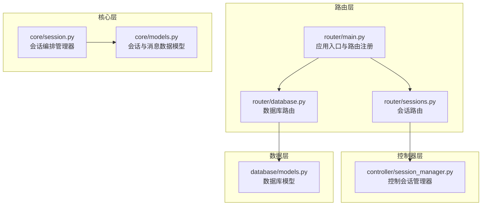
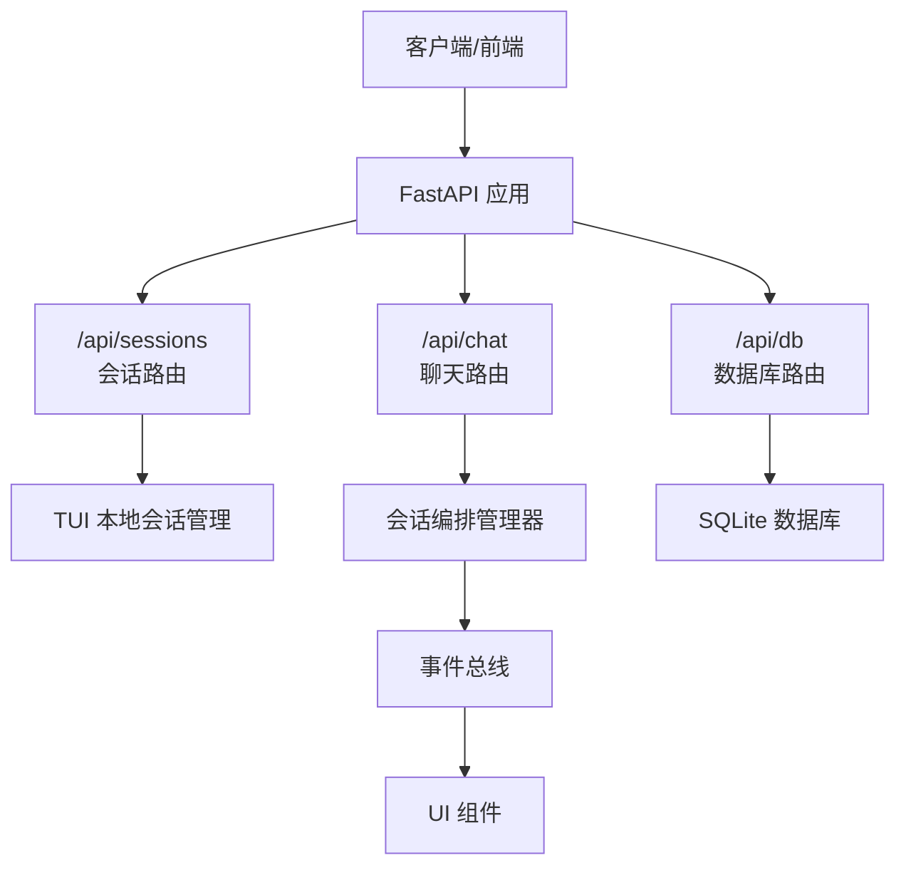
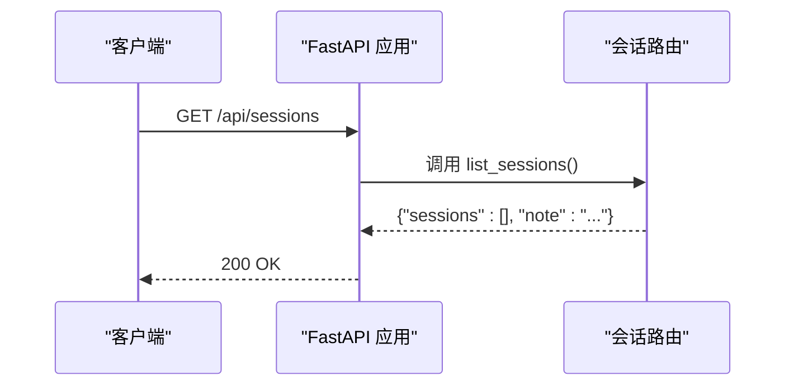
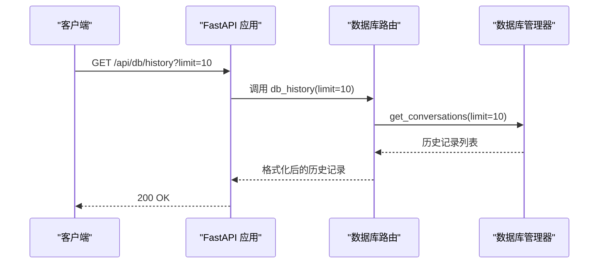
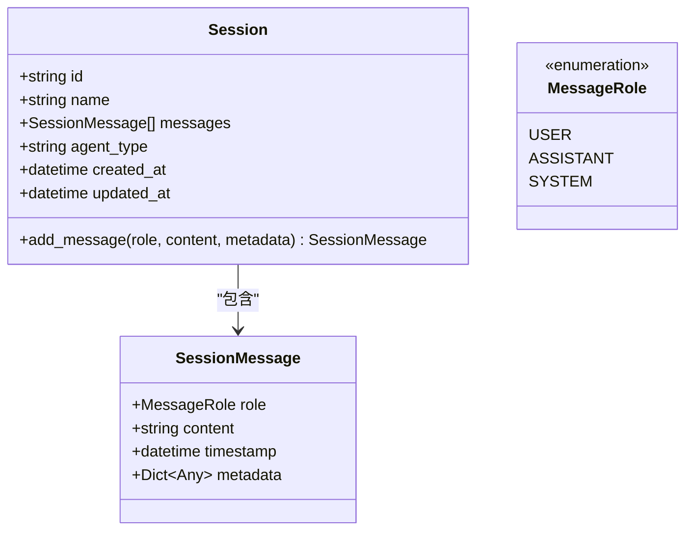
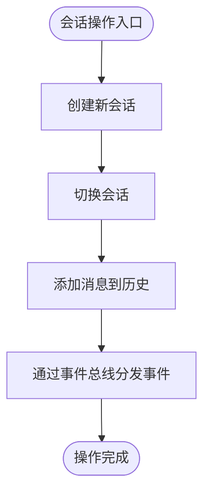
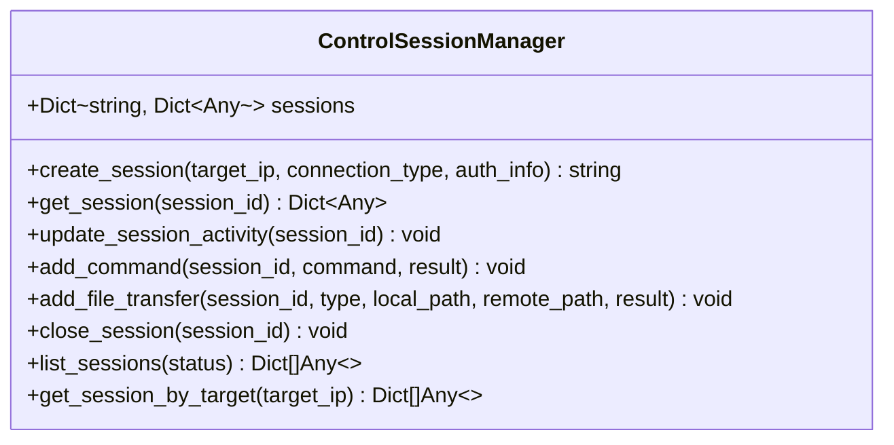
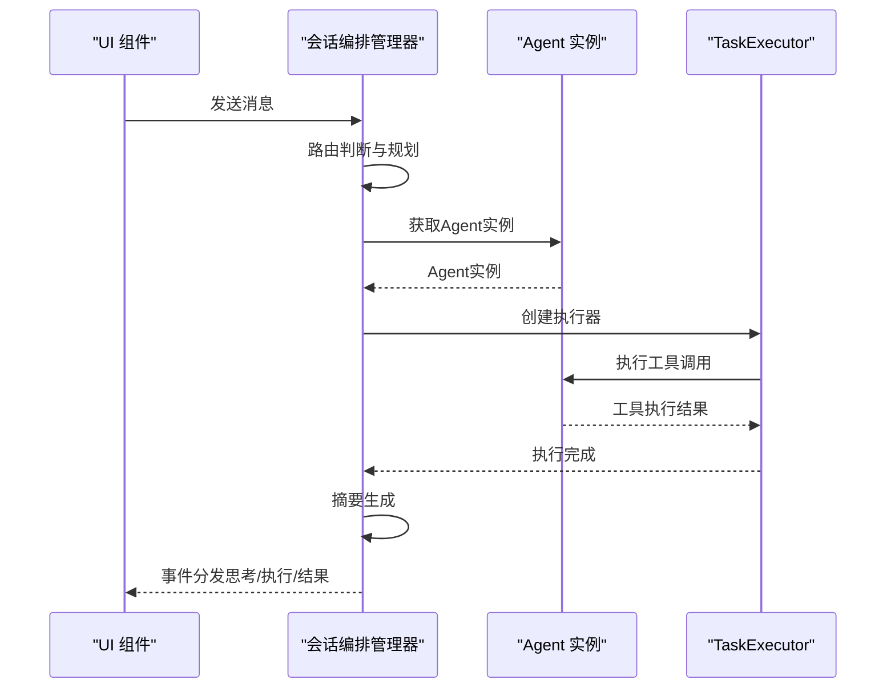
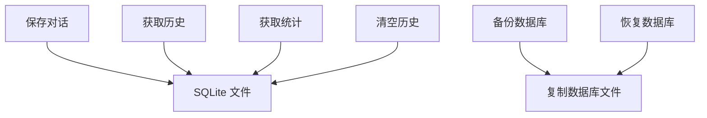
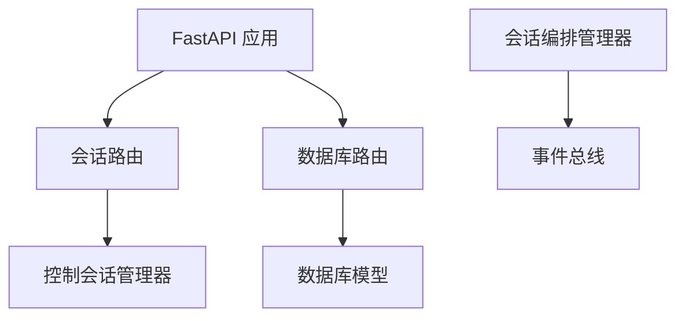

# 会话管理接口

<cite>
**本文档引用的文件**
- [router/sessions.py](file://router/sessions.py)
- [controller/session_manager.py](file://controller/session_manager.py)
- [core/session.py](file://core/session.py)
- [core/models.py](file://core/models.py)
- [router/main.py](file://router/main.py)
- [router/database.py](file://router/database.py)
- [database/models.py](file://database/models.py)
- [docs/API.md](file://docs/API.md)
- [docs/SQLITE_SETUP.md](file://docs/SQLITE_SETUP.md)
- [docs/DATABASE_GUIDE.md](file://docs/DATABASE_GUIDE.md)
- [docs/design-paradigms/session-and-events.md](file://docs/design-paradigms/session-and-events.md)
</cite>

## 目录
1. [简介](#简介)
2. [项目结构](#项目结构)
3. [核心组件](#核心组件)
4. [架构概览](#架构概览)
5. [详细组件分析](#详细组件分析)
6. [依赖分析](#依赖分析)
7. [性能考虑](#性能考虑)
8. [故障排除指南](#故障排除指南)
9. [结论](#结论)
10. [附录](#附录)

## 简介
本文件为Secbot的会话管理接口提供完整的API文档。根据仓库现有实现，后端当前为无状态设计，会话由TUI本地管理，因此会话列表接口返回空列表并注明说明。本文档将详细记录/sessions、/sessions/{session_id}、/sessions/{session_id}/messages等端点的HTTP方法、URL参数、请求/响应格式，并解释会话生命周期管理、消息历史管理、状态字段与并发处理机制。同时涵盖会话数据结构、消息格式、持久化策略与数据恢复方案。

## 项目结构
Secbot的会话管理涉及以下关键模块：
- 路由层：提供REST API端点，当前会话列表端点为无状态占位
- 控制器层：提供控制会话管理器，记录命令执行与文件传输
- 核心层：提供会话编排管理器，负责消息历史与事件分发
- 数据层：提供数据库模型与持久化接口，支持对话历史存储与查询

**图表来源**
- [router/main.py](file://router/main.py#L19-L71)
- [router/sessions.py](file://router/sessions.py#L1-L21)
- [router/database.py](file://router/database.py#L1-L91)
- [controller/session_manager.py](file://controller/session_manager.py#L1-L91)
- [core/session.py](file://core/session.py#L32-L136)
- [core/models.py](file://core/models.py#L113-L136)
- [database/models.py](file://database/models.py#L9-L89)

**章节来源**
- [router/main.py](file://router/main.py#L19-L71)
- [router/sessions.py](file://router/sessions.py#L1-L21)
- [router/database.py](file://router/database.py#L1-L91)
- [controller/session_manager.py](file://controller/session_manager.py#L1-L91)
- [core/session.py](file://core/session.py#L32-L136)
- [core/models.py](file://core/models.py#L113-L136)
- [database/models.py](file://database/models.py#L9-L89)

## 核心组件
- 会话编排管理器：负责会话生命周期、消息历史维护与事件分发
- 控制会话管理器：记录命令执行与文件传输，维护会话状态
- 数据模型：定义会话、消息与消息角色的数据结构
- 数据库模型：定义对话记录、提示词链、用户配置等持久化实体

**章节来源**
- [core/session.py](file://core/session.py#L32-L136)
- [controller/session_manager.py](file://controller/session_manager.py#L9-L91)
- [core/models.py](file://core/models.py#L113-L136)
- [database/models.py](file://database/models.py#L9-L89)

## 架构概览
会话管理的整体架构遵循无状态设计，会话由TUI本地管理，后端提供占位接口与数据库持久化能力。会话编排管理器通过事件总线将流程事件分发给UI组件，实现核心逻辑与UI的解耦。

**图表来源**
- [router/main.py](file://router/main.py#L19-L71)
- [docs/design-paradigms/session-and-events.md](file://docs/design-paradigms/session-and-events.md#L1-L36)

**章节来源**
- [router/main.py](file://router/main.py#L19-L71)
- [docs/design-paradigms/session-and-events.md](file://docs/design-paradigms/session-and-events.md#L1-L36)

## 详细组件分析

### 会话列表接口
- 端点：GET /api/sessions
- 功能：返回会话列表。当前实现为无状态，会话由TUI本地管理，此处返回空列表。
- 响应格式：
  - sessions: 空数组
  - note: 说明当前后端为无状态，会话由TUI本地管理

**图表来源**
- [router/sessions.py](file://router/sessions.py#L12-L20)

**章节来源**
- [router/sessions.py](file://router/sessions.py#L12-L20)

### 会话消息历史接口
- 端点：GET /api/db/history
- 功能：获取对话历史记录
- 查询参数：
  - agent: 智能体类型（可选）
  - limit: 返回数量，默认10，最大100
  - session_id: 会话ID（可选）
- 响应格式：
  - conversations: 历史记录数组，每条记录包含时间戳、智能体类型、用户消息、助手消息

**图表来源**
- [router/database.py](file://router/database.py#L38-L71)
- [docs/API.md](file://docs/API.md#L427-L451)

**章节来源**
- [router/database.py](file://router/database.py#L38-L71)
- [docs/API.md](file://docs/API.md#L427-L451)

### 会话数据结构与消息格式
会话与消息的数据结构定义如下：

**图表来源**
- [core/models.py](file://core/models.py#L113-L136)

**章节来源**
- [core/models.py](file://core/models.py#L113-L136)

### 会话生命周期管理
会话编排管理器负责会话的创建、切换、恢复与消息历史维护。其核心职责包括：
- 创建新会话并设置当前会话
- 切换到指定会话
- 维护消息历史并在消息添加时更新时间戳
- 通过事件总线分发任务阶段、思考、执行结果等事件

**图表来源**
- [core/session.py](file://core/session.py#L81-L136)
- [docs/design-paradigms/session-and-events.md](file://docs/design-paradigms/session-and-events.md#L1-L36)

**章节来源**
- [core/session.py](file://core/session.py#L81-L136)
- [docs/design-paradigms/session-and-events.md](file://docs/design-paradigms/session-and-events.md#L1-L36)

### 控制会话管理器
控制会话管理器用于记录命令执行与文件传输，维护会话状态：
- 创建会话：生成会话ID，记录目标IP、连接类型、认证信息、创建时间、最后活动时间、状态等
- 更新活动时间：每次记录命令或文件传输时更新最后活动时间
- 记录命令执行：保存命令、结果与时间戳
- 记录文件传输：保存上传/下载类型、本地路径、远程路径、结果与时间戳
- 关闭会话：设置状态为closed并记录关闭时间
- 列出会话：支持按状态过滤
- 按目标IP获取活跃会话

**图表来源**
- [controller/session_manager.py](file://controller/session_manager.py#L9-L91)

**章节来源**
- [controller/session_manager.py](file://controller/session_manager.py#L9-L91)

### 并发会话处理与状态同步
- 会话编排器通过事件总线实现核心逻辑与UI解耦，UI订阅感兴趣事件并更新界面
- 会话编排器维护当前轮次工具结果，供摘要阶段使用
- 会话编排器支持并发锁，避免多个请求并发打在同一个Agent上
- 会话编排器通过TaskExecutor支持分层执行，支持并行/串行

**图表来源**
- [core/session.py](file://core/session.py#L328-L422)
- [docs/design-paradigms/session-and-events.md](file://docs/design-paradigms/session-and-events.md#L1-L36)

**章节来源**
- [core/session.py](file://core/session.py#L328-L422)
- [docs/design-paradigms/session-and-events.md](file://docs/design-paradigms/session-and-events.md#L1-L36)

### 会话持久化策略与数据恢复
- 数据库模型：提供对话记录、提示词链、用户配置、爬虫任务、攻击任务、扫描结果、审计记录等模型
- 数据库操作：支持保存对话、获取历史、获取统计、清空历史等功能
- 备份与恢复：SQLite数据库文件可通过简单复制实现备份与恢复
- 数据清理：支持按日期清理旧对话或按会话ID清理特定会话的历史记录

**图表来源**
- [database/models.py](file://database/models.py#L9-L89)
- [router/database.py](file://router/database.py#L20-L91)
- [docs/SQLITE_SETUP.md](file://docs/SQLITE_SETUP.md#L120-L147)
- [docs/DATABASE_GUIDE.md](file://docs/DATABASE_GUIDE.md#L163-L198)

**章节来源**
- [database/models.py](file://database/models.py#L9-L89)
- [router/database.py](file://router/database.py#L20-L91)
- [docs/SQLITE_SETUP.md](file://docs/SQLITE_SETUP.md#L120-L147)
- [docs/DATABASE_GUIDE.md](file://docs/DATABASE_GUIDE.md#L163-L198)

## 依赖分析
- 路由层依赖FastAPI，注册会话与数据库路由
- 会话路由为无状态占位，返回空列表
- 数据库路由依赖数据库管理器，提供统计、历史查询与清空功能
- 会话编排管理器依赖事件总线与Agent实例，维护消息历史
- 控制会话管理器为内存级会话管理，记录命令与文件传输

**图表来源**
- [router/main.py](file://router/main.py#L19-L71)
- [router/sessions.py](file://router/sessions.py#L1-L21)
- [router/database.py](file://router/database.py#L1-L91)
- [controller/session_manager.py](file://controller/session_manager.py#L1-L91)
- [core/session.py](file://core/session.py#L32-L136)

**章节来源**
- [router/main.py](file://router/main.py#L19-L71)
- [router/sessions.py](file://router/sessions.py#L1-L21)
- [router/database.py](file://router/database.py#L1-L91)
- [controller/session_manager.py](file://controller/session_manager.py#L1-L91)
- [core/session.py](file://core/session.py#L32-L136)

## 性能考虑
- 会话编排器支持并发锁，避免多个请求并发打在同一个Agent上，减少资源竞争
- 会话编排器通过TaskExecutor支持分层执行，提高执行效率
- 事件总线采用异步emit，避免阻塞主流程
- 数据库操作基于SQLite，支持多读单写，适合单机应用

## 故障排除指南
- 健康检查：通过GET /health验证服务状态
- 数据库异常：检查数据库文件是否存在，确认权限与路径配置
- 会话无状态：确认TUI本地会话管理配置，后端会话列表接口为占位返回
- 事件分发异常：检查事件总线配置与订阅者状态

**章节来源**
- [docs/API.md](file://docs/API.md#L45-L56)
- [router/main.py](file://router/main.py#L63-L65)

## 结论
Secbot的会话管理接口当前采用无状态设计，会话由TUI本地管理，后端提供占位的会话列表接口与数据库持久化能力。会话编排管理器通过事件总线实现核心逻辑与UI解耦，支持消息历史维护与并发控制。数据库模型与操作提供了完善的持久化与恢复方案。整体架构清晰，易于扩展与维护。

## 附录
- API快速开发与调试：参考API文档中的快速开发指南
- 数据库备份与恢复：参考SQLite设置与数据库指南文档
- 会话与事件总线范式：参考设计范式文档

**章节来源**
- [docs/API.md](file://docs/API.md#L1-L512)
- [docs/SQLITE_SETUP.md](file://docs/SQLITE_SETUP.md#L1-L147)
- [docs/DATABASE_GUIDE.md](file://docs/DATABASE_GUIDE.md#L120-L198)
- [docs/design-paradigms/session-and-events.md](file://docs/design-paradigms/session-and-events.md#L1-L36)