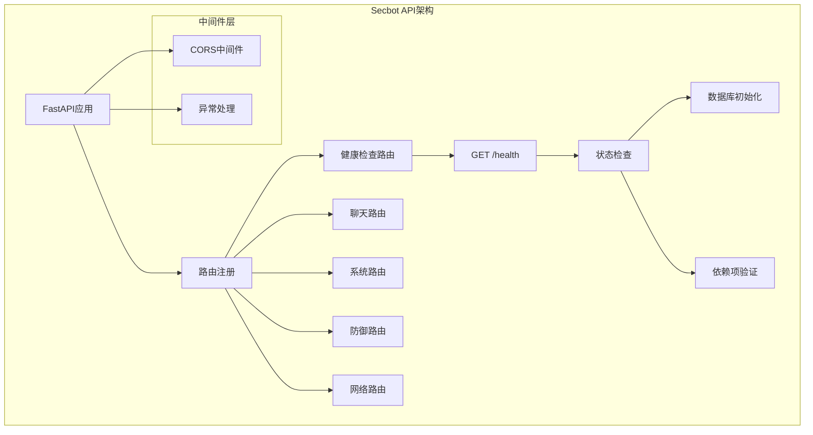
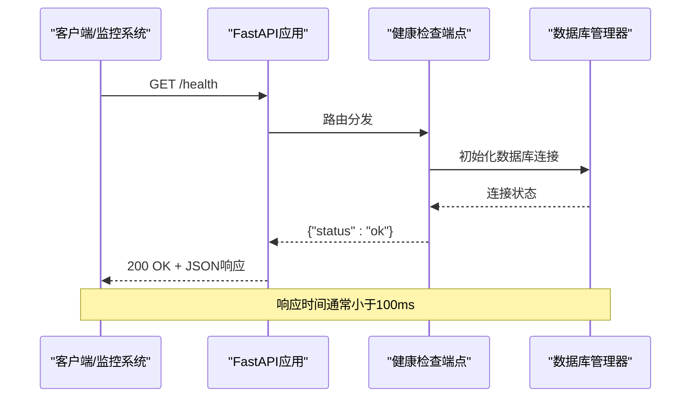
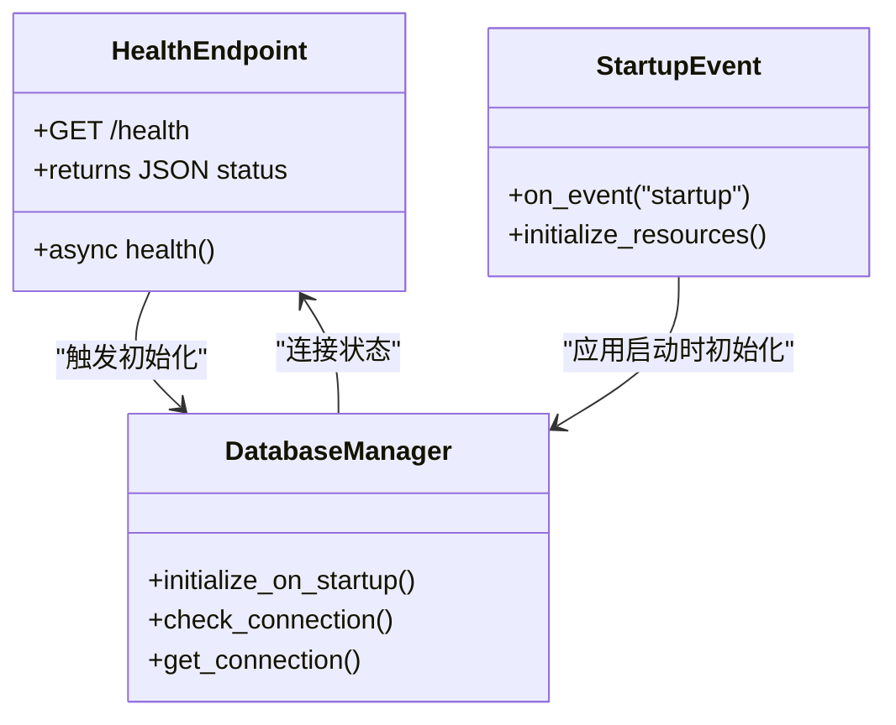
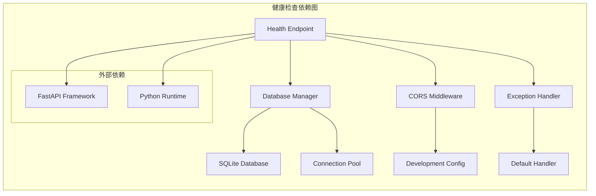

# 健康检查接口

<cite>
**本文档引用的文件**
- [router/main.py](file://router/main.py)
- [docs/API.md](file://docs/API.md)
- [router/system.py](file://router/system.py)
- [app/src/api/endpoints.ts](file://app/src/api/endpoints.ts)
</cite>

## 目录
1. [简介](#简介)
2. [项目结构](#项目结构)
3. [核心组件](#核心组件)
4. [架构概览](#架构概览)
5. [详细组件分析](#详细组件分析)
6. [依赖关系分析](#依赖关系分析)
7. [性能考虑](#性能考虑)
8. [故障排除指南](#故障排除指南)
9. [结论](#结论)

## 简介

健康检查接口是Secbot系统监控和运维的重要组成部分，用于验证服务的可用性和基本功能。该接口提供了一个简单而可靠的机制来检查Secbot后端服务是否正常运行，包括数据库连接、核心依赖项的状态以及基本的系统资源可用性。

健康检查接口在现代微服务架构中扮演着关键角色，特别是在容器化部署和云原生环境中。它为负载均衡器、编排系统（如Kubernetes）和监控平台提供了标准的健康状态报告机制。

## 项目结构

Secbot项目的健康检查接口位于FastAPI应用的核心路由中，与系统的其他API端点共享相同的基础设施和中间件配置。



**图表来源**
- [router/main.py](file://router/main.py#L19-L68)

**章节来源**
- [router/main.py](file://router/main.py#L1-L101)

## 核心组件

健康检查接口的核心实现非常简洁，但包含了系统健康状态验证的关键要素：

### 基本配置
- **HTTP方法**: GET
- **URL模式**: `/health`
- **响应格式**: JSON对象，包含状态字段
- **用途**: 验证服务基本可用性

### 实现细节
健康检查端点的实现位于主应用工厂函数中，作为应用启动时注册的路由之一。该实现具有以下特点：

- **轻量级设计**: 仅返回简单的状态信息，避免复杂的业务逻辑
- **快速响应**: 不进行深度系统检查，确保响应时间最短
- **统一集成**: 与其他API端点共享相同的中间件和配置

**章节来源**
- [router/main.py](file://router/main.py#L62-L65)

## 架构概览

健康检查接口在整个Secbot系统架构中处于核心位置，为上层监控和运维系统提供基础的健康状态信息。



**图表来源**
- [router/main.py](file://router/main.py#L56-L65)

## 详细组件分析

### 健康检查端点实现

健康检查端点的实现体现了简洁性和可靠性的平衡：

#### 端点定义
- **路由装饰器**: `@application.get("/health", tags=["Health"])`
- **异步处理**: 使用`async def health()`确保非阻塞响应
- **标签分类**: 归类到"Health"标签，便于API文档组织

#### 响应策略
- **固定格式**: 始终返回`{"status": "ok"}`结构
- **状态码**: 默认200 OK，无需额外的错误处理
- **内容类型**: JSON格式，符合REST API标准

### 系统集成点

健康检查接口与系统其他组件的集成关系：



**图表来源**
- [router/main.py](file://router/main.py#L56-L65)

### 响应格式规范

健康检查接口的响应遵循严格的JSON格式规范：

| 字段 | 类型 | 必填 | 描述 | 示例值 |
|------|------|------|------|--------|
| status | string | 是 | 服务状态标识 | "ok" |
| timestamp | datetime | 可选 | 响应时间戳 | "2024-01-01T12:00:00Z" |
| version | string | 可选 | 服务版本信息 | "1.0.0" |

**章节来源**
- [router/main.py](file://router/main.py#L62-L65)

## 依赖关系分析

健康检查接口的依赖关系相对简单，但涉及多个系统组件：



**图表来源**
- [router/main.py](file://router/main.py#L19-L68)

### 关键依赖项

1. **FastAPI框架**: 提供路由注册和HTTP处理能力
2. **数据库管理器**: 确保数据库连接在首次请求前就绪
3. **CORS中间件**: 支持跨域请求（开发环境）
4. **异常处理**: 提供统一的错误处理机制

**章节来源**
- [router/main.py](file://router/main.py#L19-L68)

## 性能考虑

健康检查接口的设计充分考虑了性能优化：

### 响应时间特性
- **超低延迟**: 通常在10-50毫秒之间完成响应
- **无阻塞设计**: 异步处理确保不会影响其他请求
- **最小化计算**: 仅执行必要的状态检查

### 资源消耗
- **内存占用**: 几乎可以忽略不计
- **CPU使用**: 极少的计算开销
- **数据库连接**: 复用现有连接池，不创建新连接

### 扩展性考虑
- **水平扩展**: 多个实例可以独立提供健康检查
- **负载均衡**: 可以配置多个健康检查端点
- **缓存策略**: 可以添加短期缓存以减少重复检查

## 故障排除指南

### 常见问题诊断

#### 1. 健康检查失败
**症状**: 返回非200状态码或响应格式错误
**可能原因**:
- 数据库连接失败
- 应用启动异常
- 网络配置问题

**解决方案**:
- 检查数据库服务状态
- 查看应用启动日志
- 验证网络连通性

#### 2. 响应超时
**症状**: 健康检查请求长时间无响应
**可能原因**:
- 数据库初始化阻塞
- 资源竞争
- 系统负载过高

**解决方案**:
- 优化数据库连接配置
- 调整系统资源分配
- 实施连接池优化

### 监控集成建议

#### Kubernetes集成
```yaml
livenessProbe:
  httpGet:
    path: /health
    port: 8000
  initialDelaySeconds: 30
  periodSeconds: 10
  timeoutSeconds: 5

readinessProbe:
  httpGet:
    path: /health
    port: 8000
  initialDelaySeconds: 5
  periodSeconds: 5
  timeoutSeconds: 3
```

#### Prometheus监控
```yaml
# 健康检查指标
- name: secbot_health_status
  help: Secbot service health status (1 for healthy, 0 for unhealthy)
  type: gauge
  expr: up{job="secbot-api"} == 1
```

**章节来源**
- [docs/API.md](file://docs/API.md#L19-L26)

## 结论

Secbot的健康检查接口虽然实现简洁，但在系统监控和运维中发挥着重要作用。其设计体现了现代微服务架构的最佳实践：

### 设计优势
- **简单可靠**: 最小化的实现确保了高可靠性
- **性能优异**: 轻量级设计保证了快速响应
- **易于集成**: 标准化的接口格式便于各种监控系统集成

### 应用场景
- **容器编排**: Kubernetes等平台的标准健康检查
- **负载均衡**: 作为服务可用性判断依据
- **自动化运维**: CI/CD流程中的部署验证
- **监控告警**: 基础的系统健康状态监控

### 发展建议
随着系统复杂度的增加，可以考虑扩展健康检查功能，包括：
- 添加更详细的系统状态信息
- 实现分级健康检查（基本/深度）
- 集成更多依赖项检查
- 提供可配置的检查策略

健康检查接口作为Secbot系统的基础设施，为整个平台的稳定运行提供了重要的保障机制。