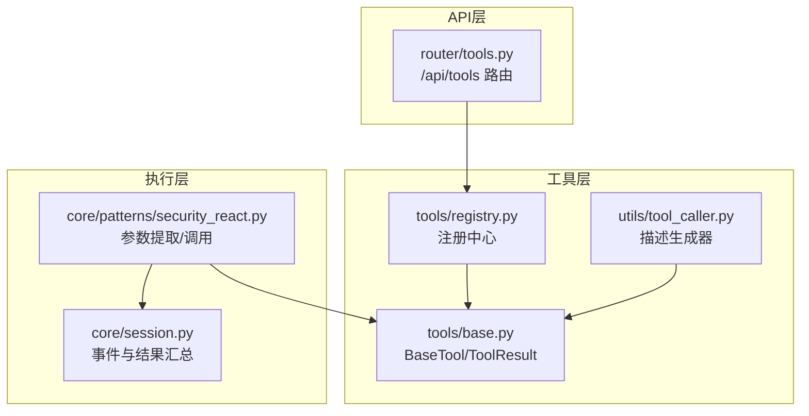
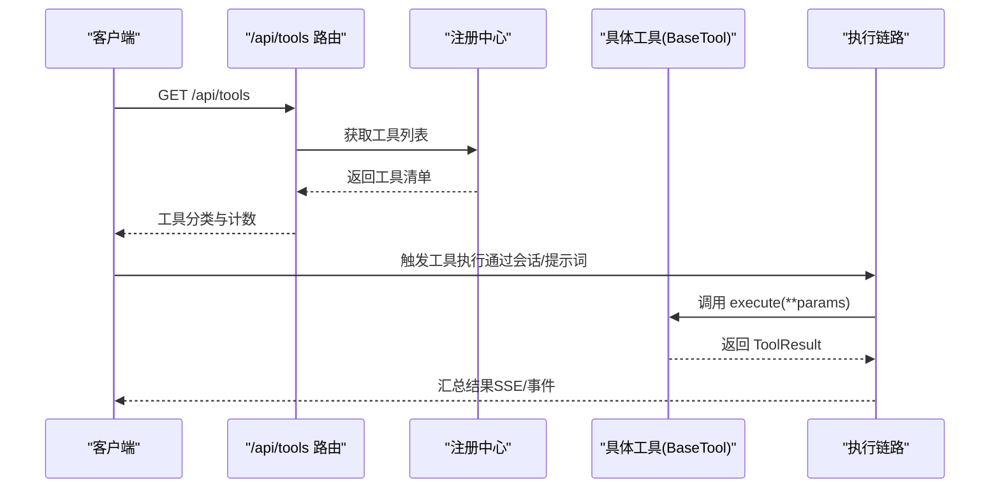
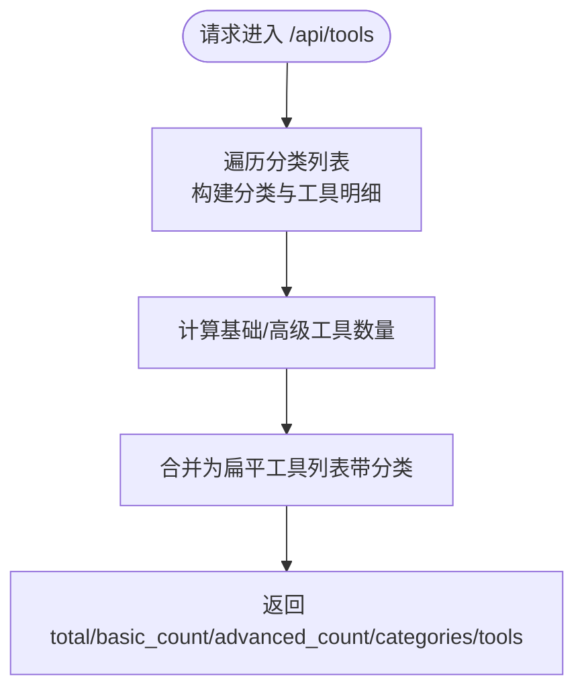
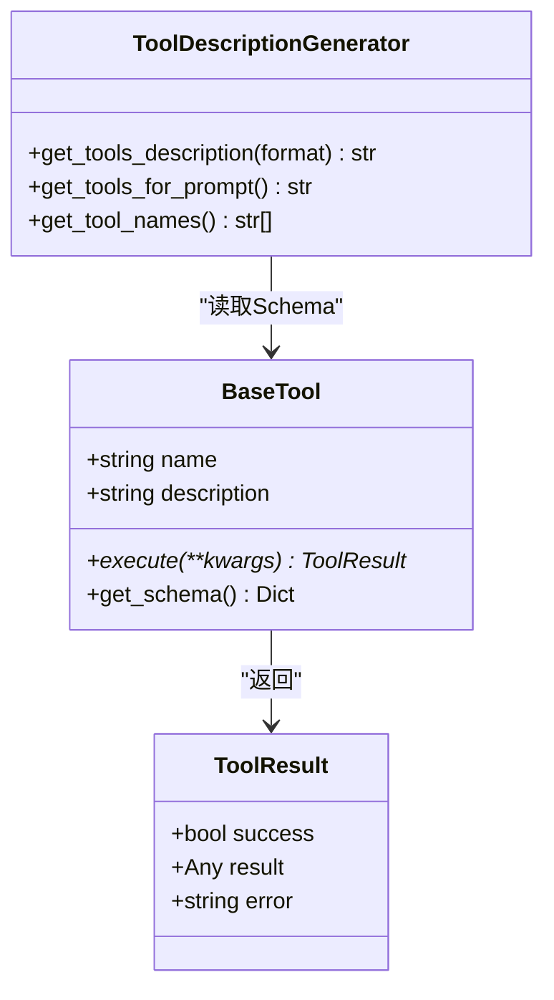
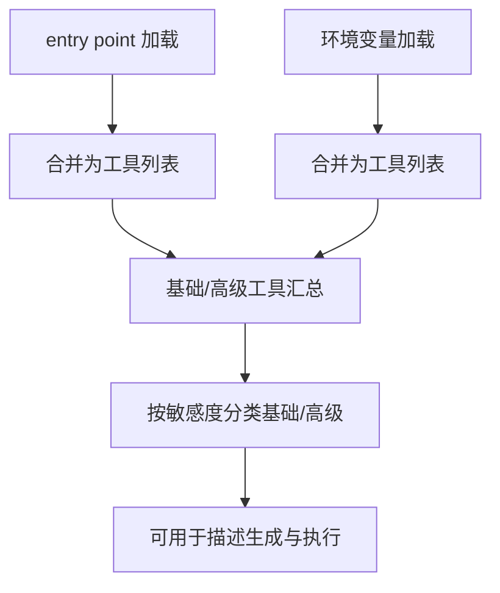
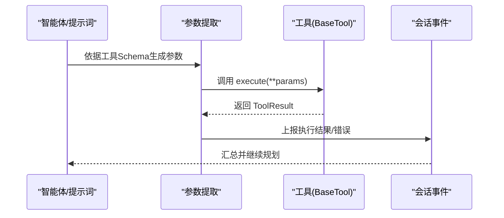
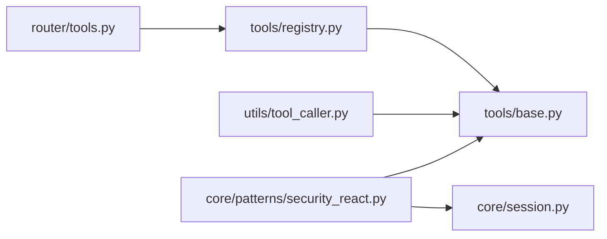

# 工具接口

<cite>
**本文引用的文件**
- [router/tools.py](file://router/tools.py)
- [tools/base.py](file://tools/base.py)
- [tools/registry.py](file://tools/registry.py)
- [utils/tool_caller.py](file://utils/tool_caller.py)
- [docs/API.md](file://docs/API.md)
- [router/schemas.py](file://router/schemas.py)
- [tools/pentest/security/exploit_tool.py](file://tools/pentest/security/exploit_tool.py)
- [tools/pentest/network/http_request_tool.py](file://tools/pentest/network/http_request_tool.py)
- [tools/osint/shodan_query_tool.py](file://tools/osint/shodan_query_tool.py)
- [tools/web_research/api_client_tool.py](file://tools/web_research/api_client_tool.py)
- [core/patterns/security_react.py](file://core/patterns/security_react.py)
- [core/session.py](file://core/session.py)
- [tests/test_all_tools.py](file://tests/test_all_tools.py)
</cite>

## 目录
1. [简介](#简介)
2. [项目结构](#项目结构)
3. [核心组件](#核心组件)
4. [架构总览](#架构总览)
5. [详细组件分析](#详细组件分析)
6. [依赖分析](#依赖分析)
7. [性能考虑](#性能考虑)
8. [故障排查指南](#故障排查指南)
9. [结论](#结论)
10. [附录](#附录)

## 简介
本文件面向Secbot的“工具接口”子系统，聚焦于/tools/list、/tools/run、/tools/schema三个端点的HTTP方法、URL参数、请求/响应格式，以及工具注册与管理机制（工具发现、参数验证、执行控制）。文档同时覆盖工具调用流程、参数传递与结果处理，并提供工具组合、批量执行与错误处理的实际示例，最后给出工具扩展与自定义工具开发指南。

## 项目结构
- 工具接口路由位于router/tools.py，提供/tools/list端点；/tools/run与/tools/schema在现有仓库中未直接暴露为独立路由，但通过工具注册中心与工具基类、描述生成器、会话执行链路共同构成完整的工具调用体系。
- 工具注册中心位于tools/registry.py，支持entry point与环境变量两种方式自动发现工具。
- 工具基类与结果模型位于tools/base.py，统一了工具的执行契约与返回格式。
- 工具描述生成器位于utils/tool_caller.py，负责将工具Schema转换为提示词可用的描述文本。
- 会话与工具执行流程在core/patterns/security_react.py与core/session.py中体现，展示了工具参数提取、执行与结果汇总的完整链路。

图表来源
- [router/tools.py](file://router/tools.py#L1-L75)
- [tools/registry.py](file://tools/registry.py#L1-L142)
- [tools/base.py](file://tools/base.py#L1-L36)
- [utils/tool_caller.py](file://utils/tool_caller.py#L1-L119)
- [core/patterns/security_react.py](file://core/patterns/security_react.py#L577-L1443)
- [core/session.py](file://core/session.py#L595-L634)

章节来源
- [router/tools.py](file://router/tools.py#L1-L75)
- [tools/registry.py](file://tools/registry.py#L1-L142)
- [tools/base.py](file://tools/base.py#L1-L36)
- [utils/tool_caller.py](file://utils/tool_caller.py#L1-L119)
- [core/patterns/security_react.py](file://core/patterns/security_react.py#L577-L1443)
- [core/session.py](file://core/session.py#L595-L634)

## 核心组件
- 工具基类与结果模型
  - BaseTool：定义工具名称、描述、异步execute方法与get_schema方法。
  - ToolResult：统一的执行结果载体，包含success、result、error字段。
- 工具注册中心
  - 支持entry point与环境变量两种发现方式，自动加载模块中的工具集合或类实例。
- 工具描述生成器
  - 将工具Schema转换为文本或Markdown格式，便于提示词注入与展示。
- 会话与执行链路
  - 在安全ReAct模式下，根据工具Schema提取参数，调用工具并汇总结果。

章节来源
- [tools/base.py](file://tools/base.py#L1-L36)
- [tools/registry.py](file://tools/registry.py#L1-L142)
- [utils/tool_caller.py](file://utils/tool_caller.py#L1-L119)
- [core/patterns/security_react.py](file://core/patterns/security_react.py#L577-L1443)

## 架构总览
工具接口的总体流程如下：
- 工具发现：通过注册中心从entry point与环境变量加载工具，形成基础与高级工具清单。
- 工具列举：/tools/list返回工具分类、计数与明细。
- 工具调用：/tools/run与/tools/schema在当前仓库中未作为独立路由暴露，但可通过会话执行链路与工具Schema生成器实现相同能力。
- 结果处理：工具执行结果经会话事件汇总，最终在前端或SSE流中呈现。

图表来源
- [router/tools.py](file://router/tools.py#L43-L74)
- [tools/registry.py](file://tools/registry.py#L106-L134)
- [tools/base.py](file://tools/base.py#L16-L36)
- [core/patterns/security_react.py](file://core/patterns/security_react.py#L1410-L1443)

## 详细组件分析

### /tools/list 端点
- HTTP方法：GET
- URL参数：无
- 请求体：无
- 响应格式：
  - total：工具总数
  - basic_count：基础工具数量（非高级）
  - advanced_count：高级工具数量（需确认）
  - categories：分类数组，每项包含id、name、count、tools
  - tools：扁平化的工具列表，包含category字段
- 示例响应要点（字段结构）：
  - categories[*].tools[*]: 包含name与description
  - tools[*]: 包含name、description与category

图表来源
- [router/tools.py](file://router/tools.py#L43-L74)

章节来源
- [router/tools.py](file://router/tools.py#L43-L74)

### /tools/run 与 /tools/schema 端点（当前仓库未直接暴露为独立路由）
- 当前仓库未在router/tools.py中直接定义/tools/run与/tools/schema的路由实现。但通过以下机制可实现相同能力：
  - 工具Schema：工具基类提供get_schema方法，返回name、description与parameters等结构；高级工具可附加sensitivity字段。
  - 工具执行：会话执行链路在安全ReAct模式下，依据工具Schema提取参数并调用工具execute方法，最终汇总结果。
  - 描述生成：工具描述生成器可将工具Schema转换为提示词可用的文本，辅助参数提取与调用。

图表来源
- [tools/base.py](file://tools/base.py#L16-L36)
- [utils/tool_caller.py](file://utils/tool_caller.py#L10-L119)

章节来源
- [tools/base.py](file://tools/base.py#L16-L36)
- [utils/tool_caller.py](file://utils/tool_caller.py#L10-L119)
- [core/patterns/security_react.py](file://core/patterns/security_react.py#L1410-L1443)

### 工具注册与管理机制
- 工具发现
  - entry point：支持两组入口点组，分别用于基础工具与高级工具。
  - 环境变量：通过SECBOT_TOOL_MODULES与SECBOT_TOOL_MODULES_ADVANCED指定模块路径，模块需导出TOOLS、*_TOOLS或BaseTool子类。
- 工具加载策略
  - 优先查找模块属性（TOOLS或*_TOOLS）；
  - 其次查找get_tools函数；
  - 最后扫描BaseTool子类并实例化。
- 工具分类与敏感度
  - 基础工具与高级工具分别加载，高级工具在会话执行时需用户确认。
  - 高敏感度工具可在Schema中携带sensitivity字段，用于提示与拦截。

图表来源
- [tools/registry.py](file://tools/registry.py#L67-L134)

章节来源
- [tools/registry.py](file://tools/registry.py#L1-L142)

### 工具调用流程、参数传递与结果处理
- 参数提取与校验
  - 依据工具Schema中的parameters定义，提取必要参数与默认值；
  - 若缺失必需参数，返回明确错误提示。
- 执行控制
  - 高敏感度工具在执行前需用户确认；
  - 执行过程中捕获异常并增强错误信息，便于审计与排障。
- 结果处理
  - 工具返回ToolResult；
  - 会话事件中记录工具执行结果，支持成功/失败分支与后续动作。

图表来源
- [core/patterns/security_react.py](file://core/patterns/security_react.py#L1410-L1443)
- [tools/base.py](file://tools/base.py#L23-L36)
- [core/session.py](file://core/session.py#L595-L634)

章节来源
- [core/patterns/security_react.py](file://core/patterns/security_react.py#L577-L1443)
- [tools/base.py](file://tools/base.py#L16-L36)
- [core/session.py](file://core/session.py#L595-L634)

### 实际使用示例（基于现有工具Schema）
- Web安全：HTTP请求工具
  - Schema包含url（必需）、method（默认GET）、headers、data、follow_redirects（默认true）等参数。
  - 执行后返回状态码、头部与响应体预览等。
- OSINT：Shodan查询工具
  - Schema包含target与query（二者二选一）。
- Web研究：通用API客户端
  - 支持preset模板与自定义请求两种模式，参数包括url、method、headers、params、body、auth_type、auth_value等。
- 高敏感度：漏洞利用工具
  - Schema包含exploit_type（web/network/post，必需）、target（必需）、payload（可选）。
  - 执行前需用户确认。

章节来源
- [tools/pentest/network/http_request_tool.py](file://tools/pentest/network/http_request_tool.py#L110-L122)
- [tools/osint/shodan_query_tool.py](file://tools/osint/shodan_query_tool.py#L95-L104)
- [tools/web_research/api_client_tool.py](file://tools/web_research/api_client_tool.py#L141-L172)
- [tools/pentest/security/exploit_tool.py](file://tools/pentest/security/exploit_tool.py#L38-L53)

## 依赖分析
- 组件耦合
  - /api/tools依赖注册中心与各工具模块；
  - 工具描述生成器依赖BaseTool的Schema；
  - 执行链路依赖BaseTool的execute与ToolResult。
- 外部依赖
  - 注册中心使用importlib.metadata与importlib.import_module动态加载模块；
  - 工具执行可能依赖外部系统或第三方服务（如Shodan、API客户端等）。

图表来源
- [router/tools.py](file://router/tools.py#L1-L75)
- [tools/registry.py](file://tools/registry.py#L1-L142)
- [tools/base.py](file://tools/base.py#L1-L36)
- [utils/tool_caller.py](file://utils/tool_caller.py#L1-L119)
- [core/patterns/security_react.py](file://core/patterns/security_react.py#L577-L1443)
- [core/session.py](file://core/session.py#L595-L634)

章节来源
- [router/tools.py](file://router/tools.py#L1-L75)
- [tools/registry.py](file://tools/registry.py#L1-L142)
- [tools/base.py](file://tools/base.py#L1-L36)
- [utils/tool_caller.py](file://utils/tool_caller.py#L1-L119)
- [core/patterns/security_react.py](file://core/patterns/security_react.py#L577-L1443)
- [core/session.py](file://core/session.py#L595-L634)

## 性能考虑
- 工具加载
  - 动态导入模块存在开销，建议在启动阶段完成工具注册与缓存；
  - 对entry point与环境变量的加载应避免重复扫描。
- 工具执行
  - 对高耗时工具（如网络扫描、API查询）应设置超时与并发限制；
  - 结果聚合与事件上报应尽量轻量化，避免阻塞主线程。
- 描述生成
  - 工具描述生成器在大工具集下可能产生较多文本，建议按需生成或缓存。

## 故障排查指南
- 工具未被发现
  - 检查entry point组名与环境变量SECBOT_TOOL_MODULES/SECBOT_TOOL_MODULES_ADVANCED是否正确；
  - 确认模块导出的属性或函数符合规范（TOOLS、*_TOOLS、get_tools、BaseTool子类）。
- 工具执行失败
  - 查看ToolResult.error字段，结合会话事件日志定位问题；
  - 对高敏感度工具，确认用户确认流程是否完成。
- 参数提取错误
  - 检查工具Schema中的parameters定义与提示词中的参数映射；
  - 确保必需参数齐全、类型匹配。

章节来源
- [tools/registry.py](file://tools/registry.py#L28-L104)
- [core/patterns/security_react.py](file://core/patterns/security_react.py#L1184-L1204)
- [core/session.py](file://core/session.py#L595-L634)

## 结论
Secbot的工具接口通过注册中心与工具基类实现了灵活的工具发现与统一的执行契约；/tools/list提供了工具分类与计数能力；/tools/run与/tools/schema在当前仓库中未作为独立路由暴露，但通过会话执行链路与工具Schema生成器可实现相同功能。整体设计支持工具扩展、参数验证与执行控制，并具备良好的可维护性与可扩展性。

## 附录

### API端点定义与示例（基于现有仓库）
- /api/tools（GET）
  - 用途：列出安全测试工具
  - 响应：包含total、basic_count、advanced_count、categories、tools
- /api/chat（POST）
  - 用途：流式聊天（SSE）
  - 响应：SSE事件流，包含planning、thought_*、action_*、content、report、phase、response、done、error等
- /api/chat/sync（POST）
  - 用途：同步聊天
  - 响应：包含response与agent

章节来源
- [router/tools.py](file://router/tools.py#L43-L74)
- [docs/API.md](file://docs/API.md#L60-L116)

### 工具Schema示例（字段说明）
- HTTP请求工具
  - parameters：url（string，必需）、method（string，默认GET）、headers（object）、data（string）、follow_redirects（boolean，默认true）
- Shodan查询工具
  - parameters：target（string，与query二选一）、query（string，与target二选一）
- 通用API客户端
  - parameters：preset（string，模板名）、query（string，模板查询参数）、url（string，自定义URL）、method（string）、headers（object）、params（object）、body（string）、auth_type（none/bearer/api_key）、auth_value（string）
- 漏洞利用工具
  - parameters：exploit_type（string，必需，web/network/post）、target（string，必需）、payload（object，可选）

章节来源
- [tools/pentest/network/http_request_tool.py](file://tools/pentest/network/http_request_tool.py#L110-L122)
- [tools/osint/shodan_query_tool.py](file://tools/osint/shodan_query_tool.py#L95-L104)
- [tools/web_research/api_client_tool.py](file://tools/web_research/api_client_tool.py#L141-L172)
- [tools/pentest/security/exploit_tool.py](file://tools/pentest/security/exploit_tool.py#L38-L53)

### 工具扩展与自定义工具开发指南
- 开发步骤
  - 新建工具类，继承BaseTool，实现execute方法与get_schema方法；
  - 在模块中导出工具实例或类，确保注册中心可发现。
- 注册方式
  - 方式一：entry point（推荐）
    - 在pyproject.toml中声明入口点组（基础或高级），指向模块中的工具集合或函数。
  - 方式二：环境变量
    - 设置SECBOT_TOOL_MODULES或SECBOT_TOOL_MODULES_ADVANCED，逗号分隔多个模块路径。
- 参数Schema设计
  - 在get_schema中定义parameters，明确type、description、required、default等；
  - 对高敏感度操作，添加sensitivity字段并在执行前进行用户确认。
- 测试与验证
  - 使用tests/test_all_tools.py对工具进行集成测试，确保执行链路与结果格式一致。

章节来源
- [tools/registry.py](file://tools/registry.py#L5-L12)
- [tools/base.py](file://tools/base.py#L16-L36)
- [tests/test_all_tools.py](file://tests/test_all_tools.py)