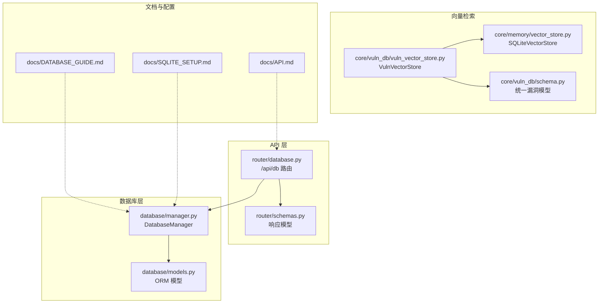
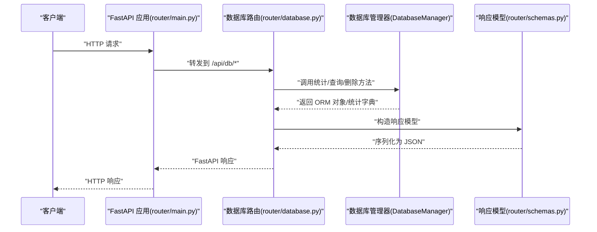
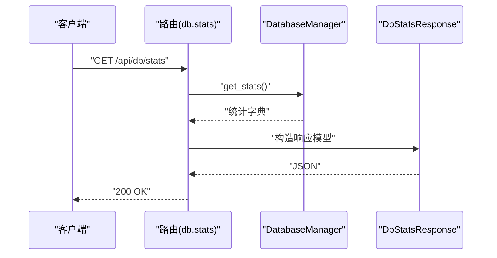
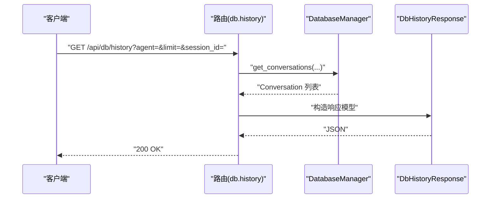
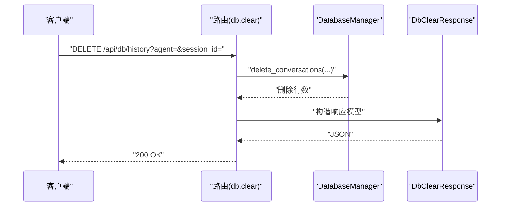
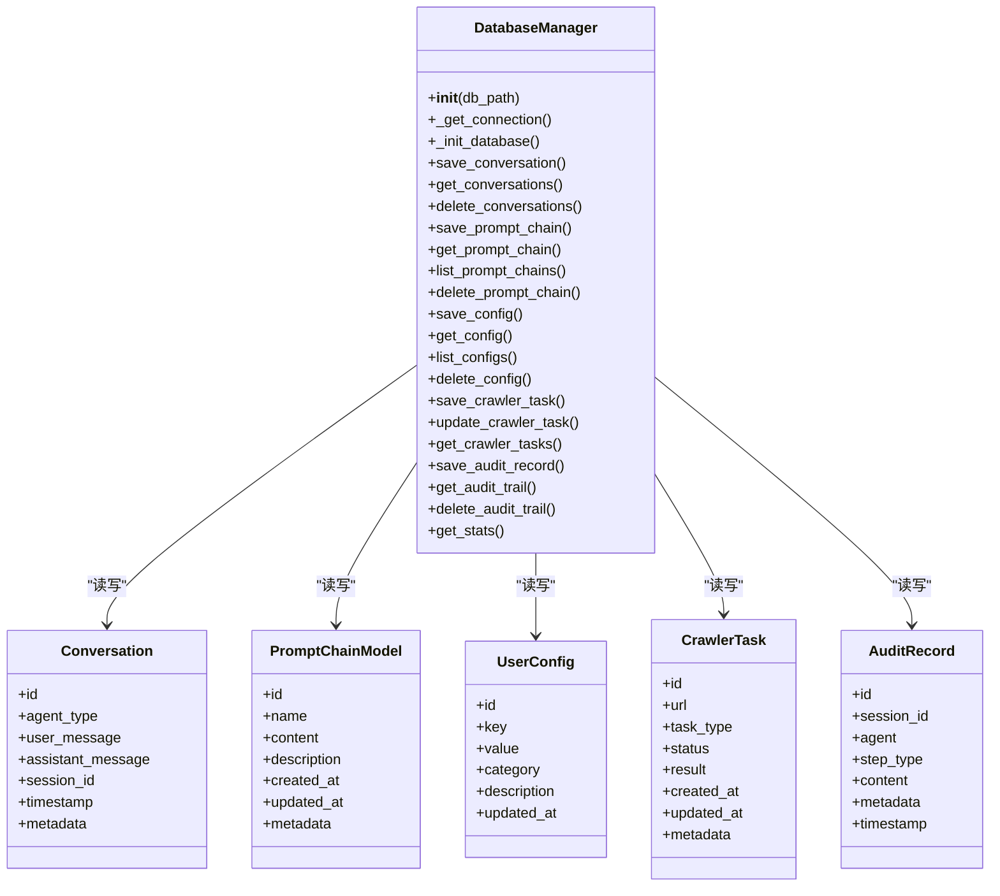
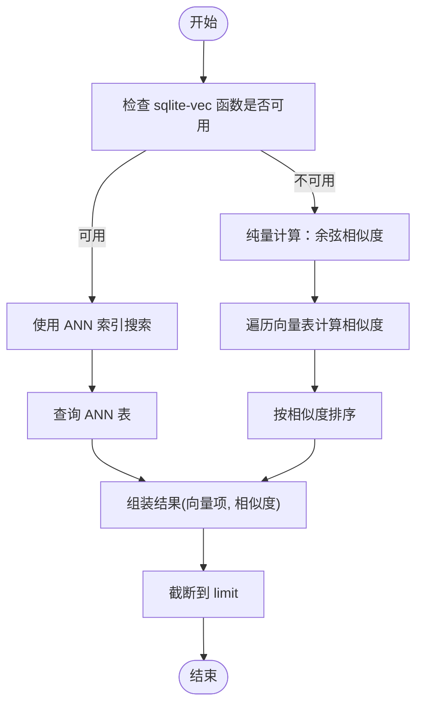
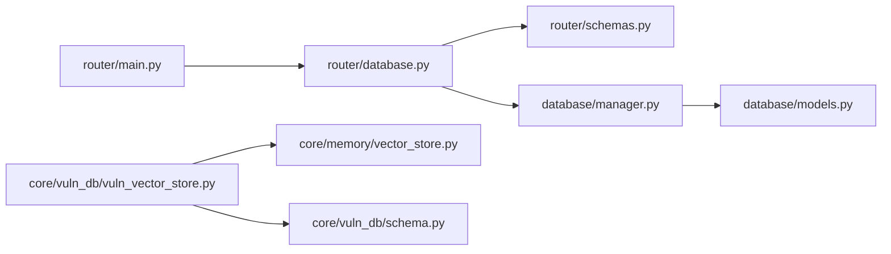

# 数据库接口

<cite>
**本文档引用的文件**
- [router/database.py](file://router/database.py)
- [router/schemas.py](file://router/schemas.py)
- [database/manager.py](file://database/manager.py)
- [database/models.py](file://database/models.py)
- [core/memory/vector_store.py](file://core/memory/vector_store.py)
- [core/vuln_db/vuln_vector_store.py](file://core/vuln_db/vuln_vector_store.py)
- [core/vuln_db/schema.py](file://core/vuln_db/schema.py)
- [docs/API.md](file://docs/API.md)
- [docs/DATABASE_GUIDE.md](file://docs/DATABASE_GUIDE.md)
- [docs/SQLITE_SETUP.md](file://docs/SQLITE_SETUP.md)
- [router/main.py](file://router/main.py)
</cite>

## 目录
1. [简介](#简介)
2. [项目结构](#项目结构)
3. [核心组件](#核心组件)
4. [架构总览](#架构总览)
5. [详细组件分析](#详细组件分析)
6. [依赖分析](#依赖分析)
7. [性能考量](#性能考量)
8. [故障排查指南](#故障排查指南)
9. [结论](#结论)
10. [附录](#附录)

## 简介
本文件为 Secbot 的数据库接口完整 API 文档，覆盖以下端点与能力：
- /api/db/stats：数据库统计
- /api/db/history：对话历史查询
- /api/db/history（DELETE）：清空对话历史

并扩展说明数据库操作功能，包括数据查询、模式管理、备份恢复与迁移工具现状；重点文档化 SQLite 数据库的特殊能力，包括向量存储、嵌入查询与相似度搜索；提供实际示例与最佳实践，涵盖复杂查询构建、事务处理与性能优化；最后给出数据库维护与故障恢复指南。

## 项目结构
数据库接口由 FastAPI 路由模块提供，配合数据库管理器与 Pydantic 模型实现数据存取与响应格式化。向量检索能力独立于主数据库，但共享 SQLite 文件系统。

图表来源
- [router/database.py](file://router/database.py#L17-L91)
- [router/schemas.py](file://router/schemas.py#L255-L290)
- [database/manager.py](file://database/manager.py#L26-L203)
- [database/models.py](file://database/models.py#L9-L90)
- [core/memory/vector_store.py](file://core/memory/vector_store.py#L30-L297)
- [core/vuln_db/vuln_vector_store.py](file://core/vuln_db/vuln_vector_store.py#L18-L107)
- [core/vuln_db/schema.py](file://core/vuln_db/schema.py#L68-L140)
- [docs/API.md](file://docs/API.md#L406-L488)
- [docs/DATABASE_GUIDE.md](file://docs/DATABASE_GUIDE.md#L1-L213)
- [docs/SQLITE_SETUP.md](file://docs/SQLITE_SETUP.md#L1-L170)

章节来源
- [router/database.py](file://router/database.py#L17-L91)
- [router/schemas.py](file://router/schemas.py#L255-L290)
- [database/manager.py](file://database/manager.py#L26-L203)
- [database/models.py](file://database/models.py#L9-L90)
- [docs/API.md](file://docs/API.md#L406-L488)
- [docs/DATABASE_GUIDE.md](file://docs/DATABASE_GUIDE.md#L1-L213)
- [docs/SQLITE_SETUP.md](file://docs/SQLITE_SETUP.md#L1-L170)

## 核心组件
- 路由与端点
  - /api/db/stats：GET，返回数据库统计信息
  - /api/db/history：GET，返回对话历史；DELETE，清空对话历史
- 数据库管理器
  - DatabaseManager：负责 SQLite 连接、表初始化、增删改查、统计与审计留痕
- Pydantic 响应模型
  - DbStatsResponse、DbHistoryResponse、DbClearResponse、ConversationRecord
- ORM 模型
  - Conversation、PromptChainModel、UserConfig、CrawlerTask、AttackTask、ScanResult、AuditRecord
- 向量存储
  - SQLiteVectorStore：基于 sqlite-vec/sqlite-vss 的向量检索
  - VulnVectorStore：面向漏洞库的向量检索封装
  - UnifiedVuln：统一漏洞数据模型，支持构建向量化文本

章节来源
- [router/database.py](file://router/database.py#L20-L91)
- [router/schemas.py](file://router/schemas.py#L259-L282)
- [database/manager.py](file://database/manager.py#L26-L719)
- [database/models.py](file://database/models.py#L9-L90)
- [core/memory/vector_store.py](file://core/memory/vector_store.py#L30-L297)
- [core/vuln_db/vuln_vector_store.py](file://core/vuln_db/vuln_vector_store.py#L18-L107)
- [core/vuln_db/schema.py](file://core/vuln_db/schema.py#L68-L140)

## 架构总览
下图展示数据库接口的端到端流程：客户端请求经路由进入，调用数据库管理器执行 SQL 操作，最终返回 Pydantic 序列化后的响应对象。

图表来源
- [router/main.py](file://router/main.py#L19-L71)
- [router/database.py](file://router/database.py#L20-L91)
- [database/manager.py](file://database/manager.py#L687-L719)
- [router/schemas.py](file://router/schemas.py#L259-L282)

## 详细组件分析

### 数据库统计 /api/db/stats
- 方法与路径
  - GET /api/db/stats
- 查询参数
  - 无
- 响应模型
  - DbStatsResponse：包含 conversations、prompt_chains、user_configs、crawler_tasks、crawler_tasks_by_status
- 处理逻辑
  - 调用 DatabaseManager.get_stats()，聚合各表计数与按状态统计
- 错误处理
  - 500：内部异常包装为 HTTPException

图表来源
- [router/database.py](file://router/database.py#L20-L36)
- [database/manager.py](file://database/manager.py#L687-L719)
- [router/schemas.py](file://router/schemas.py#L259-L265)

章节来源
- [router/database.py](file://router/database.py#L20-L36)
- [database/manager.py](file://database/manager.py#L687-L719)
- [router/schemas.py](file://router/schemas.py#L259-L265)
- [docs/API.md](file://docs/API.md#L408-L425)

### 对话历史查询 /api/db/history
- 方法与路径
  - GET /api/db/history
- 查询参数
  - agent: 可选，智能体类型
  - limit: 可选，默认 10，范围 1..100
  - session_id: 可选，会话 ID
- 响应模型
  - DbHistoryResponse：包含 ConversationRecord 列表
  - ConversationRecord：timestamp、agent_type、user_message、assistant_message
- 处理逻辑
  - 调用 DatabaseManager.get_conversations(agent_type, session_id, limit, offset)
  - 将 Row 转换为 Conversation 并序列化
- 错误处理
  - 500：内部异常包装为 HTTPException

图表来源
- [router/database.py](file://router/database.py#L38-L72)
- [database/manager.py](file://database/manager.py#L230-L279)
- [router/schemas.py](file://router/schemas.py#L267-L276)

章节来源
- [router/database.py](file://router/database.py#L38-L72)
- [database/manager.py](file://database/manager.py#L230-L279)
- [router/schemas.py](file://router/schemas.py#L267-L276)
- [docs/API.md](file://docs/API.md#L427-L451)

### 清空对话历史 /api/db/history（DELETE）
- 方法与路径
  - DELETE /api/db/history
- 查询参数
  - agent: 可选，智能体类型
  - session_id: 可选，会话 ID
- 响应模型
  - DbClearResponse：success、deleted_count、message
- 处理逻辑
  - 调用 DatabaseManager.delete_conversations(agent_type, session_id, before_date=None)
  - 返回删除计数与成功标记
- 错误处理
  - 500：内部异常包装为 HTTPException

图表来源
- [router/database.py](file://router/database.py#L74-L91)
- [database/manager.py](file://database/manager.py#L280-L306)
- [router/schemas.py](file://router/schemas.py#L278-L282)

章节来源
- [router/database.py](file://router/database.py#L74-L91)
- [database/manager.py](file://database/manager.py#L280-L306)
- [router/schemas.py](file://router/schemas.py#L278-L282)
- [docs/API.md](file://docs/API.md#L453-L466)

### 数据库管理器与表结构
- 初始化与连接
  - 自动解析 DATABASE_URL，支持相对/绝对路径
  - 上下文管理器保证事务提交/回滚与连接关闭
- 表与索引
  - conversations、prompt_chains、user_configs、crawler_tasks、attack_tasks、scan_results、audit_trail
  - 为常用查询字段建立索引
- 关键方法
  - 会话：save_conversation、get_conversations、delete_conversations
  - 提示词链：save_prompt_chain、get_prompt_chain、list_prompt_chains、delete_prompt_chain
  - 用户配置：save_config、get_config、list_configs、delete_config
  - 爬虫任务：save_crawler_task、update_crawler_task、get_crawler_tasks
  - 审计留痕：save_audit_record、get_audit_trail、delete_audit_trail
  - 统计：get_stats

图表来源
- [database/manager.py](file://database/manager.py#L26-L719)
- [database/models.py](file://database/models.py#L9-L90)

章节来源
- [database/manager.py](file://database/manager.py#L26-L203)
- [database/manager.py](file://database/manager.py#L205-L719)
- [database/models.py](file://database/models.py#L9-L90)
- [docs/DATABASE_GUIDE.md](file://docs/DATABASE_GUIDE.md#L18-L67)
- [docs/SQLITE_SETUP.md](file://docs/SQLITE_SETUP.md#L44-L148)

### 向量存储与相似度搜索
- SQLiteVectorStore
  - 支持 sqlite-vec/sqlite-vss：使用 ANN 索引进行近似最近邻搜索
  - 不支持时回退为纯量计算（余弦相似度）
  - 提供 add/search/get/delete/clear/count/list_collections 等方法
- VulnVectorStore
  - 面向漏洞库的封装，将 UnifiedVuln 构建为向量文本并写入
  - 提供 upsert_vulns 与 search_similar，返回元数据+相似度
- UnifiedVuln
  - 统一漏洞数据模型，build_embedding_text 拼接用于向量化的内容

图表来源
- [core/memory/vector_store.py](file://core/memory/vector_store.py#L124-L176)

章节来源
- [core/memory/vector_store.py](file://core/memory/vector_store.py#L30-L297)
- [core/vuln_db/vuln_vector_store.py](file://core/vuln_db/vuln_vector_store.py#L18-L107)
- [core/vuln_db/schema.py](file://core/vuln_db/schema.py#L68-L140)

## 依赖分析
- 路由依赖
  - router/database.py 依赖 router/schemas 中的响应模型与依赖注入 get_db_manager
  - router/main.py 注册 database_router 并在 startup 时初始化数据库
- 数据层依赖
  - database/manager.py 依赖 database/models.py 的 ORM 模型与 hackbot_config.settings
- 向量层依赖
  - core/vuln_db/vuln_vector_store.py 依赖 core/memory/vector_store.py 与 core/vuln_db/schema.py

图表来源
- [router/database.py](file://router/database.py#L1-L17)
- [router/schemas.py](file://router/schemas.py#L1-L10)
- [database/manager.py](file://database/manager.py#L1-L25)
- [core/vuln_db/vuln_vector_store.py](file://core/vuln_db/vuln_vector_store.py#L1-L16)
- [router/main.py](file://router/main.py#L14-L51)

章节来源
- [router/database.py](file://router/database.py#L1-L17)
- [router/schemas.py](file://router/schemas.py#L1-L10)
- [database/manager.py](file://database/manager.py#L1-L25)
- [core/vuln_db/vuln_vector_store.py](file://core/vuln_db/vuln_vector_store.py#L1-L16)
- [router/main.py](file://router/main.py#L14-L51)

## 性能考量
- 索引策略
  - conversations(session_id, timestamp)、crawler_tasks(status)、user_configs(key)、attack_tasks(status)、scan_results(target)、audit_trail(session_id, timestamp)
- 查询优化
  - 使用 limit/offset 控制结果集规模
  - 通过 where 条件精确过滤
- 事务与连接
  - 使用上下文管理器确保事务提交/回滚与连接释放
- 向量检索
  - sqlite-vec 可用时优先使用 ANN 索引；否则采用纯量计算，注意阈值与 limit 控制

章节来源
- [database/manager.py](file://database/manager.py#L176-L201)
- [docs/DATABASE_GUIDE.md](file://docs/DATABASE_GUIDE.md#L200-L213)
- [docs/SQLITE_SETUP.md](file://docs/SQLITE_SETUP.md#L149-L170)
- [core/memory/vector_store.py](file://core/memory/vector_store.py#L124-L176)

## 故障排查指南
- 数据库文件锁定
  - 现象："database is locked"
  - 排查：检查是否有其他进程占用；确保所有连接已关闭
- 权限问题
  - 现象：权限错误
  - 排查：确保数据库文件所在目录具有写权限
- 数据库损坏
  - 现象：数据库文件损坏
  - 处理：使用备份恢复；或删除数据库文件，系统将在下次启动时重建
- 备份与恢复
  - SQLite 单文件备份：复制数据库文件
  - 恢复：用备份文件覆盖原文件

章节来源
- [docs/SQLITE_SETUP.md](file://docs/SQLITE_SETUP.md#L149-L170)
- [docs/DATABASE_GUIDE.md](file://docs/DATABASE_GUIDE.md#L163-L173)

## 结论
本数据库接口围绕 SQLite 提供了稳定的数据存取能力，结合向量检索实现语义相似度搜索。通过清晰的路由与响应模型设计，满足统计、查询与清理等常见需求；借助索引与上下文事务管理，兼顾性能与可靠性。对于大规模数据与高并发场景，建议结合 limit 控制、定期清理与向量索引优化。

## 附录

### API 端点一览与规范
- /api/db/stats
  - 方法：GET
  - 查询参数：无
  - 响应：DbStatsResponse
- /api/db/history
  - 方法：GET
  - 查询参数：agent、limit、session_id
  - 响应：DbHistoryResponse
- /api/db/history（删除）
  - 方法：DELETE
  - 查询参数：agent、session_id
  - 响应：DbClearResponse

章节来源
- [docs/API.md](file://docs/API.md#L406-L488)
- [router/database.py](file://router/database.py#L20-L91)
- [router/schemas.py](file://router/schemas.py#L259-L282)

### 数据库操作示例（路径指引）
- 保存对话并获取历史
  - 参考：[database/manager.py](file://database/manager.py#L207-L279)
- 获取统计信息
  - 参考：[database/manager.py](file://database/manager.py#L687-L719)
- 清理旧对话/特定会话
  - 参考：[database/manager.py](file://database/manager.py#L280-L306)
- 向量写入与相似度检索
  - 参考：[core/vuln_db/vuln_vector_store.py](file://core/vuln_db/vuln_vector_store.py#L35-L93)
  - 参考：[core/memory/vector_store.py](file://core/memory/vector_store.py#L98-L176)

### SQLite 特殊功能说明
- 向量存储
  - 支持 sqlite-vec/sqlite-vss：ANN 近似最近邻
  - 不支持时回退纯量计算（余弦相似度）
- 漏洞库向量检索
  - 统一漏洞模型构建向量化文本
  - upsert 与 search_similar 返回元数据+相似度

章节来源
- [core/memory/vector_store.py](file://core/memory/vector_store.py#L30-L297)
- [core/vuln_db/vuln_vector_store.py](file://core/vuln_db/vuln_vector_store.py#L18-L107)
- [core/vuln_db/schema.py](file://core/vuln_db/schema.py#L68-L140)