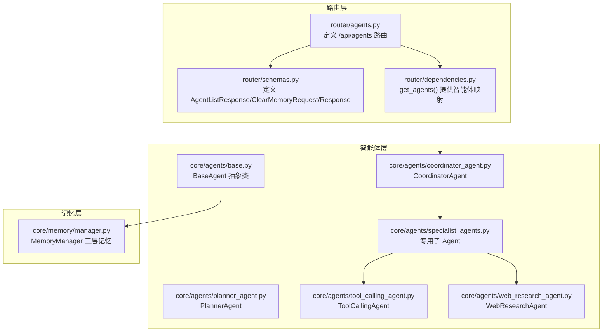
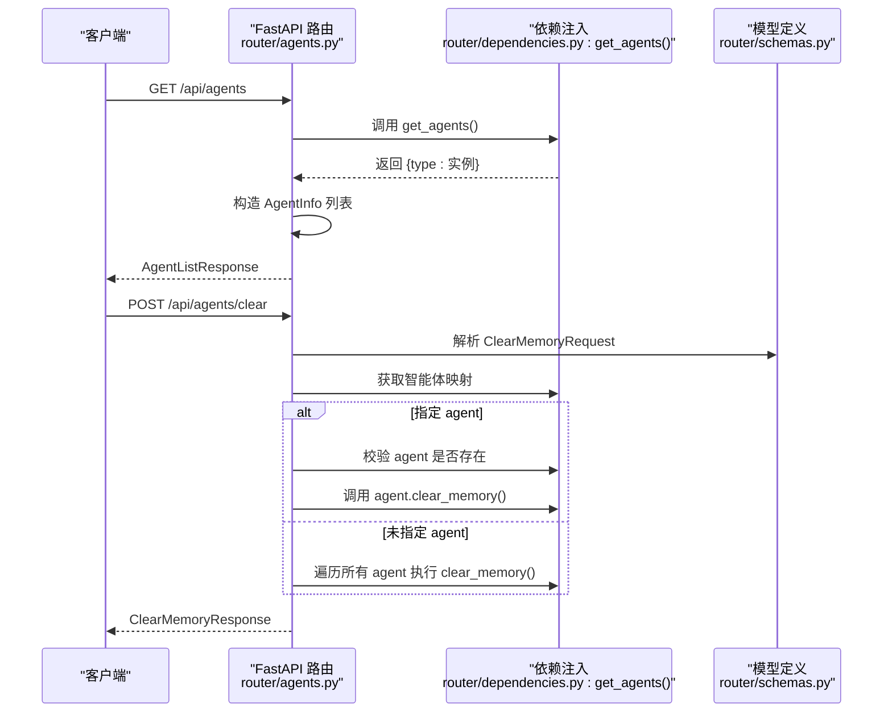
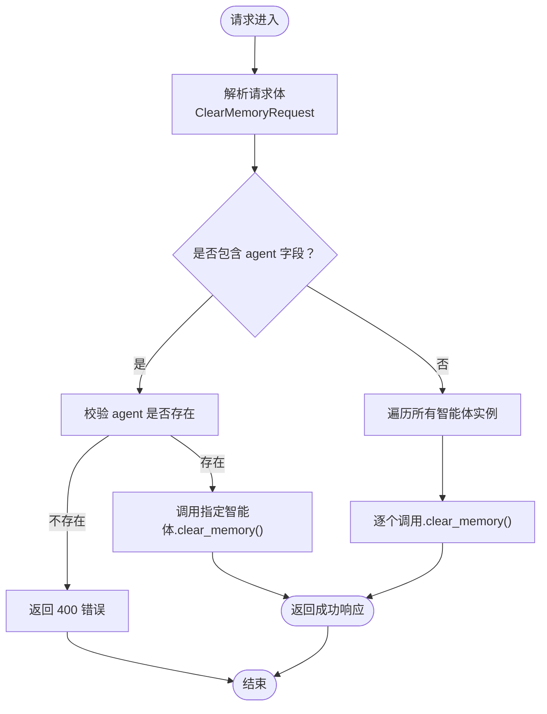
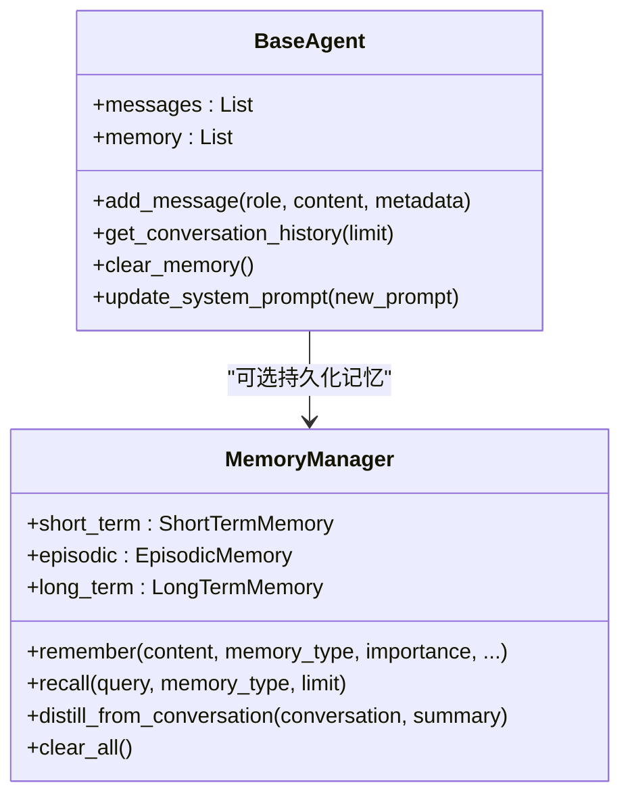
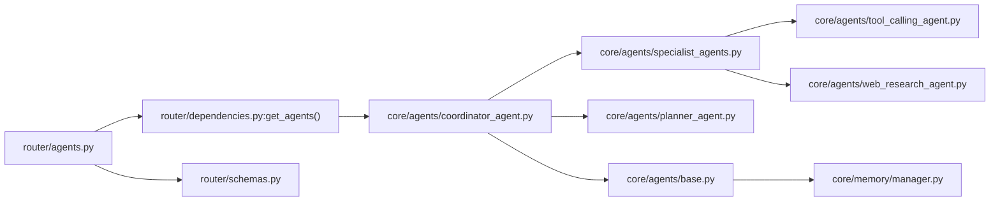

# 智能体管理接口

<cite>
**本文档引用的文件**
- [router/agents.py](file://router/agents.py)
- [router/schemas.py](file://router/schemas.py)
- [router/dependencies.py](file://router/dependencies.py)
- [core/agents/base.py](file://core/agents/base.py)
- [core/memory/manager.py](file://core/memory/manager.py)
- [core/agents/coordinator_agent.py](file://core/agents/coordinator_agent.py)
- [core/agents/planner_agent.py](file://core/agents/planner_agent.py)
- [core/agents/specialist_agents.py](file://core/agents/specialist_agents.py)
- [core/agents/tool_calling_agent.py](file://core/agents/tool_calling_agent.py)
- [core/agents/web_research_agent.py](file://core/agents/web_research_agent.py)
- [docs/API.md](file://docs/API.md)
</cite>

## 目录
1. [简介](#简介)
2. [项目结构](#项目结构)
3. [核心组件](#核心组件)
4. [架构总览](#架构总览)
5. [详细组件分析](#详细组件分析)
6. [依赖关系分析](#依赖关系分析)
7. [性能考量](#性能考量)
8. [故障排查指南](#故障排查指南)
9. [结论](#结论)
10. [附录](#附录)

## 简介
本文件为 Secbot 的智能体管理接口提供权威、可操作的 API 文档，覆盖以下端点：
- GET /api/agents：列出所有可用智能体及其说明
- POST /api/agents/clear：清空指定智能体或全部智能体的对话记忆

同时，文档解释智能体类型（hackbot、superhackbot）的职责与使用场景，说明记忆清理机制与技能（工具）集成方式，并提供参数调优与性能优化建议。

## 项目结构
智能体管理接口位于后端路由层，请求/响应模型由统一的 Pydantic 模型定义，依赖注入容器提供智能体实例映射。

图表来源
- [router/agents.py](file://router/agents.py#L1-L57)
- [router/schemas.py](file://router/schemas.py#L45-L62)
- [router/dependencies.py](file://router/dependencies.py#L149-L160)
- [core/agents/base.py](file://core/agents/base.py#L17-L125)
- [core/agents/coordinator_agent.py](file://core/agents/coordinator_agent.py#L40-L98)
- [core/agents/planner_agent.py](file://core/agents/planner_agent.py#L20-L80)
- [core/agents/specialist_agents.py](file://core/agents/specialist_agents.py#L32-L60)
- [core/agents/tool_calling_agent.py](file://core/agents/tool_calling_agent.py#L75-L141)
- [core/agents/web_research_agent.py](file://core/agents/web_research_agent.py#L52-L83)
- [core/memory/manager.py](file://core/memory/manager.py#L223-L325)

章节来源
- [router/agents.py](file://router/agents.py#L1-L57)
- [router/schemas.py](file://router/schemas.py#L45-L62)
- [router/dependencies.py](file://router/dependencies.py#L149-L160)

## 核心组件
- 智能体路由：提供 /api/agents（GET）与 /api/agents/clear（POST）两个端点。
- 请求/响应模型：AgentListResponse、ClearMemoryRequest、ClearMemoryResponse。
- 依赖注入：get_agents() 返回智能体名称到实例的映射，供路由使用。
- 基础智能体：BaseAgent 提供消息历史、对话记忆、系统提示词更新等通用能力。
- 记忆管理：BaseAgent.clear_memory() 清空对话历史；MemoryManager 提供三层记忆（短期/情节/长期）。

章节来源
- [router/agents.py](file://router/agents.py#L18-L56)
- [router/schemas.py](file://router/schemas.py#L45-L62)
- [router/dependencies.py](file://router/dependencies.py#L149-L160)
- [core/agents/base.py](file://core/agents/base.py#L17-L125)
- [core/memory/manager.py](file://core/memory/manager.py#L223-L325)

## 架构总览
智能体管理接口的调用链如下：

图表来源
- [router/agents.py](file://router/agents.py#L18-L56)
- [router/schemas.py](file://router/schemas.py#L55-L62)
- [router/dependencies.py](file://router/dependencies.py#L149-L160)

## 详细组件分析

### 端点：GET /api/agents
- 方法：GET
- 路径：/api/agents
- 功能：返回所有可用智能体的类型、名称与描述。
- 响应模型：AgentListResponse（包含 agents 列表，每个元素为 AgentInfo）

请求/响应格式
- 请求：无
- 响应：包含 agents 数组，每个元素包含 type、name、description

行为说明
- 路由层从依赖注入容器获取智能体映射，遍历键集合构造 AgentInfo 列表。
- 对于某些类型（如 hackbot、superhackbot），使用预定义名称与描述；其他类型使用其自身类型名与空描述。

章节来源
- [router/agents.py](file://router/agents.py#L18-L31)
- [router/schemas.py](file://router/schemas.py#L45-L53)
- [docs/API.md](file://docs/API.md#L121-L141)

### 端点：POST /api/agents/clear
- 方法：POST
- 路径：/api/agents/clear
- 功能：清空指定智能体或全部智能体的对话记忆。
- 请求模型：ClearMemoryRequest（可选字段 agent：智能体类型）
- 响应模型：ClearMemoryResponse（success、message）

行为说明
- 若请求体包含 agent：
  - 校验 agent 是否存在于智能体映射中；否则抛出 400 错误。
  - 调用该智能体实例的 clear_memory()。
- 若未包含 agent：
  - 遍历所有智能体实例，逐一调用 clear_memory()。

图表来源
- [router/agents.py](file://router/agents.py#L34-L56)
- [router/schemas.py](file://router/schemas.py#L55-L62)

章节来源
- [router/agents.py](file://router/agents.py#L34-L56)
- [router/schemas.py](file://router/schemas.py#L55-L62)

### 智能体类型与职责
Secbot 提供两类核心智能体类型，均由依赖注入容器统一管理并返回给路由层：

- hackbot
  - 职责：自动模式，执行 ReAct 循环，自动执行工具（无需用户确认）。
  - 使用场景：日常自动化安全测试、基础扫描与执行。
  - 路由层描述：自动模式（ReAct，基础扫描，全自动）。

- superhackbot
  - 职责：专家模式，执行 ReAct 循环，对高敏感操作需要用户确认。
  - 使用场景：需要人工审核的高风险操作、复杂任务编排。
  - 路由层描述：专家模式（ReAct，全工具，敏感操作需确认）。

此外，系统内还存在多子 Agent 架构（由 CoordinatorAgent 协调），包括：
- network_recon：网络资产枚举与基础探测
- web_pentest：Web 站点与 API 安全测试
- osint：外部情报与资产信息收集
- terminal_ops：授权主机上的终端操作
- defense_monitor：本机/网络防御与巡检

这些子 Agent 通过 SecurityReAct 引擎实现 ReAct 循环，并挂载专用工具集，事件流中以 agent_type 标记来源。

章节来源
- [router/agents.py](file://router/agents.py#L21-L29)
- [docs/API.md](file://docs/API.md#L127-L139)
- [core/agents/coordinator_agent.py](file://core/agents/coordinator_agent.py#L40-L98)
- [core/agents/specialist_agents.py](file://core/agents/specialist_agents.py#L80-L236)

### 记忆清理机制
- 对话级记忆（短期）：BaseAgent 内部维护 messages 与 _conversation 列表，clear_memory() 会清空这两个列表。
- 持久化记忆（长期/情节）：MemoryManager 提供三层记忆，支持 clear_all() 清空全部；但路由层的 /api/agents/clear 仅清空对话历史，不主动调用 MemoryManager.clear_all()。
- 适用场景：清理会话上下文、避免历史信息干扰当前任务；对需要彻底清理长期记忆的场景，需另行调用数据库或记忆管理接口。

图表来源
- [core/agents/base.py](file://core/agents/base.py#L17-L125)
- [core/memory/manager.py](file://core/memory/manager.py#L223-L325)

章节来源
- [core/agents/base.py](file://core/agents/base.py#L103-L109)
- [core/memory/manager.py](file://core/memory/manager.py#L311-L316)

### 技能（工具）集成机制
- 工具绑定：ToolCallingAgent 将 Secbot 工具包装为 LangChain 工具并绑定到 LLM，支持工具调用与提示词方式回退。
- 专用 Agent 工具集：specialist_agents.py 中的各类子 Agent 挂载专用工具集（如网络扫描、Web 漏洞检测、OSINT、终端会话、防御扫描等）。
- PlannerAgent：负责任务规划，生成结构化 Todo 列表，并根据 tool_hint/agent_hint 推断资源与风险等级，驱动多 Agent 协作。

章节来源
- [core/agents/tool_calling_agent.py](file://core/agents/tool_calling_agent.py#L75-L141)
- [core/agents/specialist_agents.py](file://core/agents/specialist_agents.py#L32-L60)
- [core/agents/planner_agent.py](file://core/agents/planner_agent.py#L444-L538)

## 依赖关系分析
- 路由层依赖：
  - 依赖注入容器提供智能体映射（get_agents()）。
  - Pydantic 模型定义请求/响应结构。
- 智能体层依赖：
  - BaseAgent 为所有智能体提供统一的消息与记忆接口。
  - CoordinatorAgent 聚合子 Agent 的工具集，实现多 Agent 协同。
  - PlannerAgent 生成结构化任务计划，驱动执行。
- 记忆层：
  - MemoryManager 提供三层记忆，可与智能体结合使用。

图表来源
- [router/agents.py](file://router/agents.py#L7-L13)
- [router/dependencies.py](file://router/dependencies.py#L149-L160)
- [router/schemas.py](file://router/schemas.py#L45-L62)
- [core/agents/coordinator_agent.py](file://core/agents/coordinator_agent.py#L40-L98)
- [core/agents/specialist_agents.py](file://core/agents/specialist_agents.py#L32-L60)
- [core/agents/tool_calling_agent.py](file://core/agents/tool_calling_agent.py#L75-L141)
- [core/agents/web_research_agent.py](file://core/agents/web_research_agent.py#L52-L83)
- [core/agents/planner_agent.py](file://core/agents/planner_agent.py#L20-L80)
- [core/agents/base.py](file://core/agents/base.py#L17-L125)
- [core/memory/manager.py](file://core/memory/manager.py#L223-L325)

章节来源
- [router/agents.py](file://router/agents.py#L1-L57)
- [router/dependencies.py](file://router/dependencies.py#L149-L160)
- [router/schemas.py](file://router/schemas.py#L45-L62)

## 性能考量
- 智能体并发控制：SecurityReActAgent 使用 asyncio.Lock 保证同一智能体同一时间只处理一个核心任务，避免竞争与状态混乱。
- 记忆容量控制：BaseAgent.clear_memory() 清空对话历史，减少消息列表长度；MemoryManager 的短期记忆使用固定长度队列，避免无限增长。
- 工具调用稳定性：ToolCallingAgent 在模型不支持工具调用时自动回退为提示词方式，确保流程连续性。
- PlannerAgent 的执行顺序：通过拓扑分层与资源/风险约束控制并发，避免高风险操作在同一资源上并行。

章节来源
- [core/agents/base.py](file://core/agents/base.py#L103-L109)
- [core/agents/coordinator_agent.py](file://core/agents/coordinator_agent.py#L215-L237)
- [core/agents/planner_agent.py](file://core/agents/planner_agent.py#L180-L248)
- [core/agents/tool_calling_agent.py](file://core/agents/tool_calling_agent.py#L295-L312)

## 故障排查指南
- 400 错误：指定的 agent 类型不存在
  - 现象：POST /api/agents/clear 返回 400，message 包含可选列表。
  - 处理：检查 agent 名称是否在 get_agents() 返回的键集合中。
- 记忆未完全清空
  - 现象：调用 /api/agents/clear 后仍保留部分上下文。
  - 说明：该端点仅清空对话历史；如需清空长期/情节记忆，需使用数据库或记忆管理接口。
- 工具调用失败
  - 现象：ToolCallingAgent 执行工具返回错误。
  - 处理：检查工具名称是否在 tools_dict 中，确认模型是否支持工具调用，必要时切换模型或启用提示词方式。

章节来源
- [router/agents.py](file://router/agents.py#L39-L44)
- [core/agents/base.py](file://core/agents/base.py#L103-L109)
- [core/agents/tool_calling_agent.py](file://core/agents/tool_calling_agent.py#L395-L434)

## 结论
- /api/agents 与 /api/agents/clear 为智能体生命周期管理提供了基础能力：列举可用智能体与清理对话记忆。
- hackbot 与 superhackbot 两类智能体分别适用于自动化与专家级场景；多子 Agent 架构通过 CoordinatorAgent 实现专业化分工与协同。
- 记忆管理采用三层架构，路由层的清空接口专注于对话历史，持久化记忆需另行处理。
- 工具集成通过 ToolCallingAgent 与专用 Agent 工具集实现，PlannerAgent 负责任务规划与资源/风险控制。

## 附录

### API 端点一览与参数
- GET /api/agents
  - 请求：无
  - 响应：AgentListResponse，agents 为 AgentInfo 数组
- POST /api/agents/clear
  - 请求体：ClearMemoryRequest（可选字段 agent）
  - 响应：ClearMemoryResponse（success、message）

章节来源
- [docs/API.md](file://docs/API.md#L121-L159)
- [router/schemas.py](file://router/schemas.py#L45-L62)