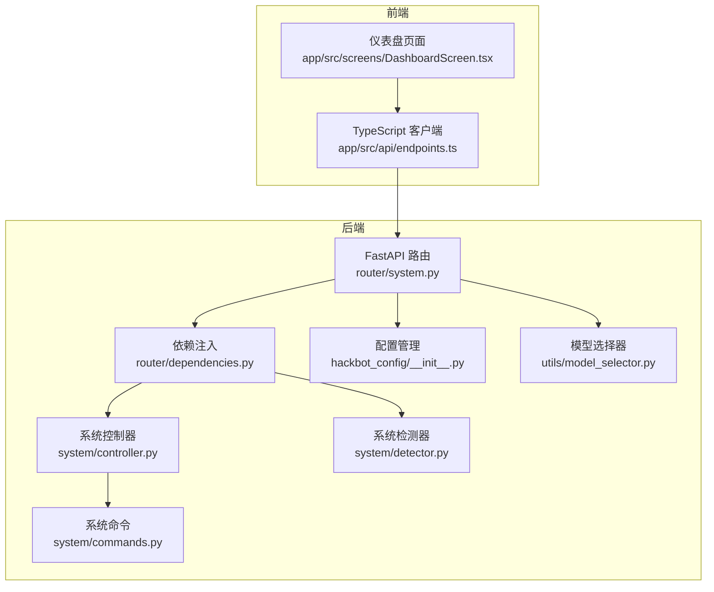
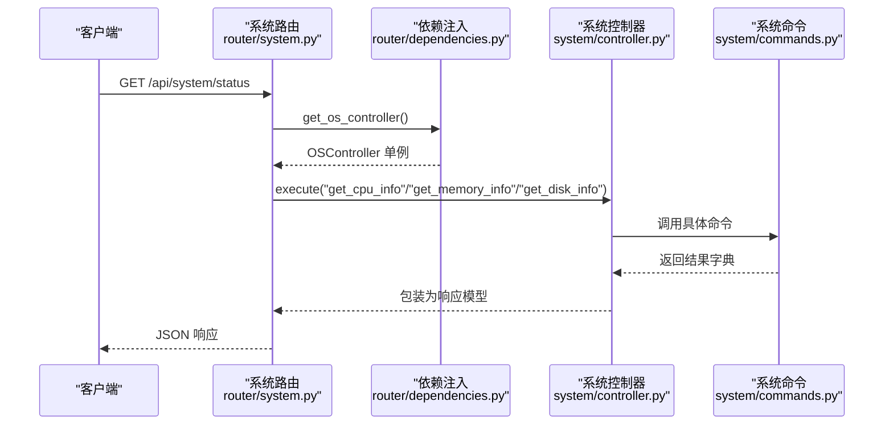
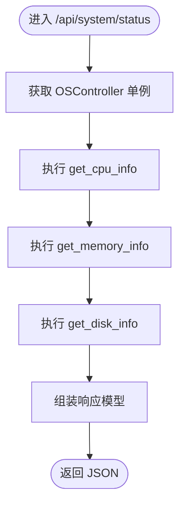
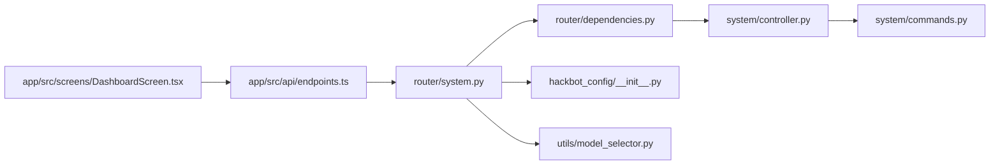

# 系统管理接口

<cite>
**本文引用的文件**
- [router/system.py](file://router/system.py)
- [router/schemas.py](file://router/schemas.py)
- [router/dependencies.py](file://router/dependencies.py)
- [system/controller.py](file://system/controller.py)
- [system/commands.py](file://system/commands.py)
- [system/detector.py](file://system/detector.py)
- [hackbot_config/__init__.py](file://hackbot_config/__init__.py)
- [utils/model_selector.py](file://utils/model_selector.py)
- [app/src/api/endpoints.ts](file://app/src/api/endpoints.ts)
- [app/src/screens/DashboardScreen.tsx](file://app/src/screens/DashboardScreen.tsx)
- [docs/API.md](file://docs/API.md)
- [docs/RELEASE.md](file://docs/RELEASE.md)
</cite>

## 目录
1. [简介](#简介)
2. [项目结构](#项目结构)
3. [核心组件](#核心组件)
4. [架构总览](#架构总览)
5. [详细组件分析](#详细组件分析)
6. [依赖分析](#依赖分析)
7. [性能考虑](#性能考虑)
8. [故障排查指南](#故障排查指南)
9. [结论](#结论)
10. [附录](#附录)

## 简介
本文件为 Secbot 系统管理接口的详细 API 文档，覆盖以下端点：
- GET /api/system/info：系统信息查询
- GET /api/system/config：推理/模型配置查询
- GET /api/system/status：系统运行状态监控
- GET /api/system/ollama-models：Ollama 模型列表与拉取状态
- GET /api/system/config/providers：列出需 API Key 的厂商及配置状态
- POST /api/system/config/api-key：设置或删除厂商 API Key（可选同时设置 Base URL）

文档同时提供系统信息查询、配置管理、监控诊断与维护升级的操作指南，帮助开发者与运维人员高效使用与维护系统。

## 项目结构
系统管理接口位于后端 FastAPI 路由模块中，通过依赖注入获取系统控制器与检测器，最终调用底层系统命令模块采集信息与状态。前端通过 TypeScript 客户端封装调用，仪表盘页面定时刷新并展示系统信息与状态卡片。

图表来源
- [router/system.py](file://router/system.py#L25-L243)
- [router/dependencies.py](file://router/dependencies.py#L137-L194)
- [system/controller.py](file://system/controller.py#L10-L127)
- [system/commands.py](file://system/commands.py#L16-L386)
- [system/detector.py](file://system/detector.py#L40-L124)
- [hackbot_config/__init__.py](file://hackbot_config/__init__.py#L162-L246)
- [utils/model_selector.py](file://utils/model_selector.py#L171-L254)
- [app/src/api/endpoints.ts](file://app/src/api/endpoints.ts#L34-L40)
- [app/src/screens/DashboardScreen.tsx](file://app/src/screens/DashboardScreen.tsx#L20-L32)

章节来源
- [router/system.py](file://router/system.py#L25-L243)
- [router/dependencies.py](file://router/dependencies.py#L137-L194)
- [system/controller.py](file://system/controller.py#L10-L127)
- [system/commands.py](file://system/commands.py#L16-L386)
- [system/detector.py](file://system/detector.py#L40-L124)
- [hackbot_config/__init__.py](file://hackbot_config/__init__.py#L162-L246)
- [utils/model_selector.py](file://utils/model_selector.py#L171-L254)
- [app/src/api/endpoints.ts](file://app/src/api/endpoints.ts#L34-L40)
- [app/src/screens/DashboardScreen.tsx](file://app/src/screens/DashboardScreen.tsx#L20-L32)

## 核心组件
- 系统路由（FastAPI）：提供 /api/system 前缀下的系统信息、配置与状态查询端点。
- 依赖注入：通过单例容器提供 OSController、OSDetector 实例，避免重复初始化。
- 系统控制器：统一调度系统命令，封装执行结果与错误。
- 系统命令：基于 psutil 与平台命令获取 CPU、内存、磁盘、网络等实时状态。
- 配置管理：集中管理 LLM 提供商、模型、Base URL、API Key 等配置，支持 SQLite 存储与 .env 环境变量。
- 模型选择器：支持多厂商 LLM，提供 Ollama 模型列表、可用性检查与拉取流程。

章节来源
- [router/system.py](file://router/system.py#L25-L243)
- [router/dependencies.py](file://router/dependencies.py#L137-L194)
- [system/controller.py](file://system/controller.py#L24-L108)
- [system/commands.py](file://system/commands.py#L195-L244)
- [hackbot_config/__init__.py](file://hackbot_config/__init__.py#L162-L246)
- [utils/model_selector.py](file://utils/model_selector.py#L171-L254)

## 架构总览
系统管理接口遵循“路由层—依赖层—控制器层—命令层”的分层设计，路由层负责 HTTP 协议与响应模型，依赖层提供单例服务，控制器层抽象系统操作，命令层对接底层系统能力。

图表来源
- [router/system.py](file://router/system.py#L195-L242)
- [router/dependencies.py](file://router/dependencies.py#L184-L189)
- [system/controller.py](file://system/controller.py#L24-L108)
- [system/commands.py](file://system/commands.py#L195-L244)

## 详细组件分析

### 系统信息查询 /api/system/info
- 方法与路径
  - GET /api/system/info
- 功能说明
  - 返回操作系统类型、名称、版本、架构、处理器、Python 版本、主机名、用户名等基础系统信息。
- 请求参数
  - 无
- 响应模型
  - SystemInfoResponse：包含 os_type、os_name、os_version、os_release、architecture、processor、python_version、hostname、username。
- 实现要点
  - 通过依赖注入获取 OSDetector，调用 detect() 生成 SystemInfo，再映射到响应模型。
- 使用示例（前端）
  - 仪表盘页面通过 getSystemInfo() 定时拉取并在界面上展示。

章节来源
- [router/system.py](file://router/system.py#L29-L47)
- [router/schemas.py](file://router/schemas.py#L68-L78)
- [router/dependencies.py](file://router/dependencies.py#L188-L189)
- [system/detector.py](file://system/detector.py#L40-L98)
- [app/src/api/endpoints.ts](file://app/src/api/endpoints.ts#L35-L36)
- [app/src/screens/DashboardScreen.tsx](file://app/src/screens/DashboardScreen.tsx#L21-L27)

### 系统配置查询 /api/system/config
- 方法与路径
  - GET /api/system/config
- 功能说明
  - 返回当前推理后端（如 ollama / deepseek）、默认模型、服务地址、温度等配置，供 TUI /model 等使用。
- 请求参数
  - 无
- 响应模型
  - SystemConfigResponse：llm_provider、ollama_model、ollama_base_url、deepseek_model、deepseek_base_url。
- 实现要点
  - 从 hackbot_config.settings 读取配置，兼容不同提供商字段。
- 使用示例（前端）
  - 仪表盘页面通过 getSystemStatus() 获取 CPU/内存/磁盘状态，结合配置信息进行展示。

章节来源
- [router/system.py](file://router/system.py#L50-L63)
- [router/schemas.py](file://router/schemas.py#L80-L87)
- [hackbot_config/__init__.py](file://hackbot_config/__init__.py#L162-L246)
- [app/src/api/endpoints.ts](file://app/src/api/endpoints.ts#L38-L39)
- [app/src/screens/DashboardScreen.tsx](file://app/src/screens/DashboardScreen.tsx#L21-L27)

### 系统状态查询 /api/system/status
- 方法与路径
  - GET /api/system/status
- 功能说明
  - 返回 CPU、内存、磁盘的实时状态，用于系统监控与健康检查。
- 请求参数
  - 无
- 响应模型
  - SystemStatusResponse：包含 cpu（CpuInfo）、memory（MemoryInfo）、disks（DiskInfo 列表）。
- 实现要点
  - 通过 OSController.execute 分别调用 get_cpu_info、get_memory_info、get_disk_info，封装为响应模型。
- 使用示例（前端）
  - 仪表盘页面展示 CPU 百分比、内存使用率与磁盘占用率，超过阈值时高亮颜色提示。

图表来源
- [router/system.py](file://router/system.py#L195-L242)
- [router/schemas.py](file://router/schemas.py#L135-L160)
- [system/controller.py](file://system/controller.py#L24-L108)
- [system/commands.py](file://system/commands.py#L195-L244)

章节来源
- [router/system.py](file://router/system.py#L195-L242)
- [router/schemas.py](file://router/schemas.py#L135-L160)
- [system/controller.py](file://system/controller.py#L24-L108)
- [system/commands.py](file://system/commands.py#L195-L244)
- [app/src/screens/DashboardScreen.tsx](file://app/src/screens/DashboardScreen.tsx#L78-L124)

### Ollama 模型列表 /api/system/ollama-models
- 方法与路径
  - GET /api/system/ollama-models
- 查询参数
  - base_url：可选，覆盖默认 Ollama 服务地址；为空则使用配置中的 ollama_base_url 或默认 http://localhost:11434。
- 功能说明
  - 列出本地（及在线）可用模型；若默认模型不在本地且未在拉取中，将异步触发拉取并在响应中标注 pulling_model。
- 响应模型
  - OllamaModelsResponse：models（模型项列表）、base_url、error（连接失败时的错误信息）、pulling_model（后台拉取中的模型名）。
- 实现要点
  - 通过 check_ollama_running 检查服务可达性；使用 get_ollama_models_detail 获取模型详情；利用全局集合避免重复触发拉取。
- 使用示例（前端）
  - 在 /model 选择器中展示可用模型，若提示 pulling_model，等待后台拉取完成后再选择使用。

章节来源
- [router/system.py](file://router/system.py#L66-L122)
- [router/schemas.py](file://router/schemas.py#L89-L104)
- [utils/model_selector.py](file://utils/model_selector.py#L171-L254)

### 厂商 API Key 状态 /api/system/config/providers
- 方法与路径
  - GET /api/system/config/providers
- 功能说明
  - 列出所有受支持的 LLM 厂商及其是否需要 API Key、是否已配置、是否需要 Base URL 等状态。
- 响应模型
  - ProviderListResponse：providers（ProviderApiKeyStatus 列表）。
- 实现要点
  - 遍历 PROVIDER_REGISTRY，结合 has_provider_api_key 与 get_provider_base_url 判断配置状态。
- 使用示例（前端）
  - 在设置面板中展示各厂商配置状态，引导用户补全 API Key 或 Base URL。

章节来源
- [router/system.py](file://router/system.py#L125-L152)
- [router/schemas.py](file://router/schemas.py#L106-L118)
- [utils/model_selector.py](file://utils/model_selector.py#L29-L148)

### 设置/删除 API Key /api/system/config/api-key
- 方法与路径
  - POST /api/system/config/api-key
- 请求体
  - SetApiKeyRequest：provider（厂商 id）、api_key（为空则删除）、base_url（可选，为空则清除自定义 Base URL）。
- 响应模型
  - SetApiKeyResponse：success、message。
- 实现要点
  - 通过 save_config_to_sqlite 或 delete_provider_api_key 写入/删除配置；同时处理 base_url 的保存或清除。
- 使用示例（前端）
  - 在设置面板中输入 API Key 与 Base URL，提交后返回成功/失败信息。

章节来源
- [router/system.py](file://router/system.py#L155-L192)
- [router/schemas.py](file://router/schemas.py#L120-L133)
- [hackbot_config/__init__.py](file://hackbot_config/__init__.py#L65-L121)

## 依赖分析
- 路由层依赖
  - 通过 router/dependencies.py 的 get_os_controller、get_os_detector 获取单例控制器与检测器，避免重复初始化。
- 控制器与命令
  - OSController.execute 统一分发动作，SystemCommands 基于 psutil 与平台命令采集系统信息。
- 配置与模型
  - hackbot_config.settings 提供全局配置；utils/model_selector 提供多厂商模型列表与可用性检查。
- 前端集成
  - app/src/api/endpoints.ts 封装 /api/system/* 端点调用；DashboardScreen.tsx 定时刷新并渲染状态卡片。

图表来源
- [router/system.py](file://router/system.py#L9-L23)
- [router/dependencies.py](file://router/dependencies.py#L184-L189)
- [system/controller.py](file://system/controller.py#L24-L108)
- [system/commands.py](file://system/commands.py#L195-L244)
- [hackbot_config/__init__.py](file://hackbot_config/__init__.py#L162-L246)
- [utils/model_selector.py](file://utils/model_selector.py#L171-L254)
- [app/src/api/endpoints.ts](file://app/src/api/endpoints.ts#L34-L40)
- [app/src/screens/DashboardScreen.tsx](file://app/src/screens/DashboardScreen.tsx#L20-L32)

章节来源
- [router/system.py](file://router/system.py#L9-L23)
- [router/dependencies.py](file://router/dependencies.py#L184-L189)
- [system/controller.py](file://system/controller.py#L24-L108)
- [system/commands.py](file://system/commands.py#L195-L244)
- [hackbot_config/__init__.py](file://hackbot_config/__init__.py#L162-L246)
- [utils/model_selector.py](file://utils/model_selector.py#L171-L254)
- [app/src/api/endpoints.ts](file://app/src/api/endpoints.ts#L34-L40)
- [app/src/screens/DashboardScreen.tsx](file://app/src/screens/DashboardScreen.tsx#L20-L32)

## 性能考虑
- 状态查询
  - CPU/内存/磁盘查询为轻量级系统调用，建议前端以 5–10 秒间隔轮询，避免频繁采集造成资源浪费。
- Ollama 模型列表
  - 拉取模型为异步后台任务，避免阻塞接口；默认模型缺失时仅触发一次拉取，使用全局集合去重。
- 响应模型
  - 使用 Pydantic 模型序列化，保证字段类型与默认值一致性，减少前端解析成本。

[本节为通用指导，无需引用具体文件]

## 故障排查指南
- 无法连接 Ollama
  - 现象：/api/system/ollama-models 返回 error，提示无法连接 Ollama 服务。
  - 排查：确认 Ollama 服务已启动（ollama serve 或打开 Ollama 应用），或在 base_url 参数中指定正确地址。
  - 参考：check_ollama_running 与 get_ollama_models_detail。
- API Key 认证失败
  - 现象：调用外部 LLM 时返回 401/403 或连接被拒绝。
  - 排查：使用 /api/system/config/providers 检查厂商配置状态；通过 /api/system/config/api-key 删除并重新设置 API Key；必要时清除无效 Key。
  - 参考：get_provider_api_key、delete_provider_api_key、get_llm_connection_hint。
- 系统状态异常
  - 现象：/api/system/status 返回空字段或数值异常。
  - 排查：确认 psutil 可用；检查系统权限；查看后端日志定位具体命令执行错误。
  - 参考：SystemCommands 的 get_cpu_info、get_memory_info、get_disk_info。
- 前端无法获取系统信息
  - 现象：仪表盘页面空白或加载失败。
  - 排查：确认后端服务已启动；检查 /api/system/info 与 /api/system/status 能否返回 200；查看浏览器网络面板与控制台错误。
  - 参考：app/src/api/endpoints.ts 与 DashboardScreen.tsx 的调用与刷新逻辑。

章节来源
- [utils/model_selector.py](file://utils/model_selector.py#L171-L254)
- [hackbot_config/__init__.py](file://hackbot_config/__init__.py#L127-L149)
- [system/commands.py](file://system/commands.py#L195-L244)
- [app/src/api/endpoints.ts](file://app/src/api/endpoints.ts#L35-L39)
- [app/src/screens/DashboardScreen.tsx](file://app/src/screens/DashboardScreen.tsx#L20-L32)

## 结论
系统管理接口提供了全面的系统信息查询、配置管理与运行状态监控能力，配合多厂商 LLM 支持与 Ollama 模型管理，能够满足日常运维与安全测试场景的需求。通过合理的轮询策略与错误处理机制，可确保系统稳定运行与快速故障定位。

[本节为总结，无需引用具体文件]

## 附录

### API 端点一览与使用示例
- GET /api/system/info
  - 用途：获取系统基础信息（操作系统、架构、Python 版本、主机名、用户名等）。
  - 示例：见 docs/API.md 中“系统信息”章节。
- GET /api/system/config
  - 用途：获取当前推理后端与模型配置（如 ollama/deepseek）。
  - 示例：见 docs/API.md 中“系统信息”章节。
- GET /api/system/status
  - 用途：获取 CPU、内存、磁盘实时状态。
  - 示例：见 docs/API.md 中“系统信息”章节。
- GET /api/system/ollama-models
  - 用途：列出本地/在线可用模型，支持 base_url 覆盖与后台拉取提示。
  - 示例：见 docs/API.md 中“系统信息”章节。
- GET /api/system/config/providers
  - 用途：列出厂商列表与配置状态（是否需要 API Key/Base URL）。
  - 示例：见 docs/API.md 中“系统信息”章节。
- POST /api/system/config/api-key
  - 用途：设置或删除厂商 API Key，可同时设置/清除 Base URL。
  - 示例：见 docs/API.md 中“系统信息”章节。

章节来源
- [docs/API.md](file://docs/API.md#L163-L218)

### 部署与维护指南
- 发布版使用
  - 通过 GitHub Release 下载对应平台压缩包，解压后在终端运行；首次运行需配置 API Key。
- 运行与调试
  - 开发环境可通过 uvicorn 启动 API 服务，Swagger UI 与 ReDoc 提供交互式文档。
- 自行打包
  - 使用脚本构建发布包，产物包含可执行文件与依赖库，进入 dist/hackbot 目录后直接运行。

章节来源
- [docs/RELEASE.md](file://docs/RELEASE.md#L1-L86)
- [docs/API.md](file://docs/API.md#L3-L26)