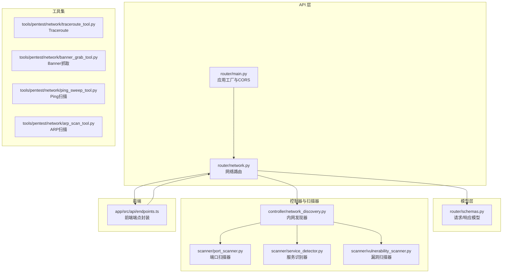
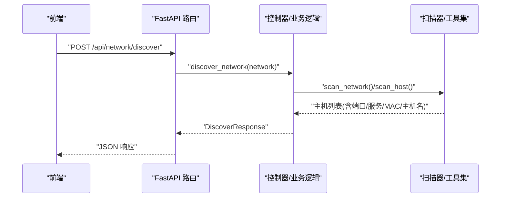
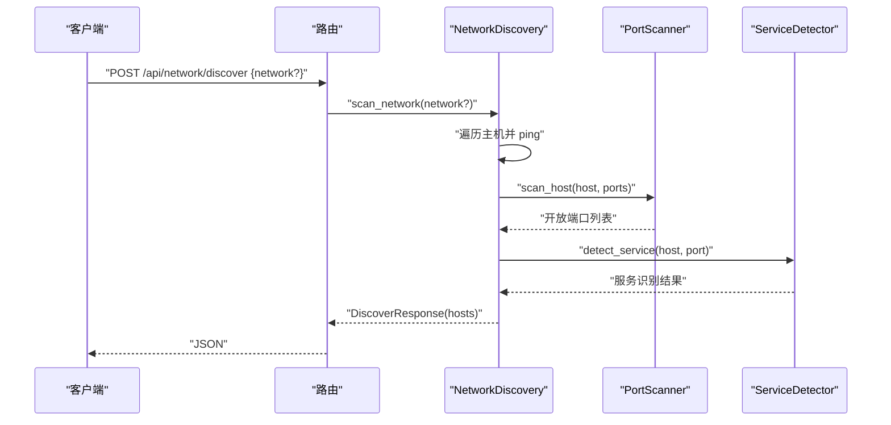
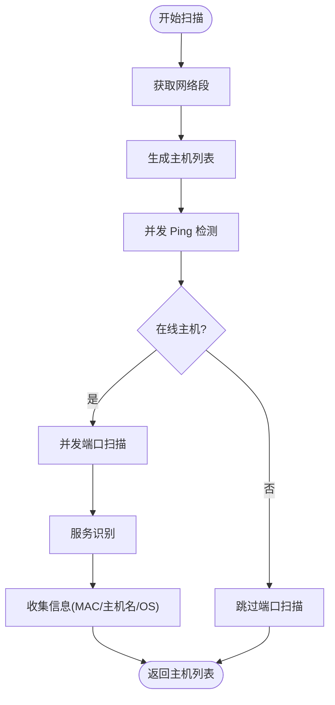
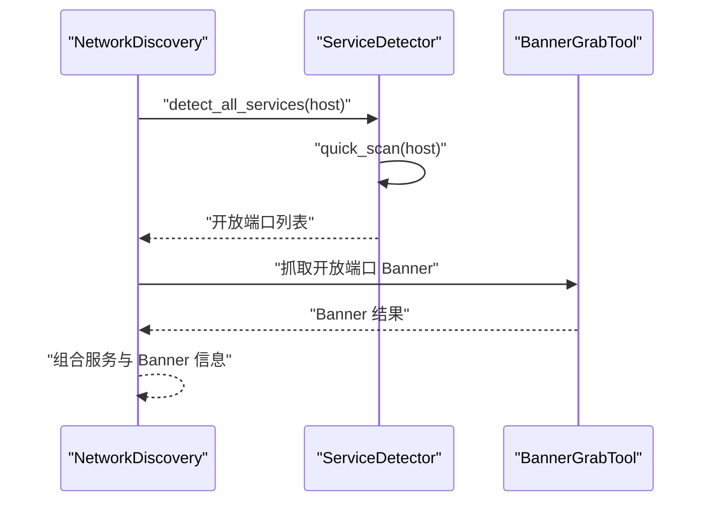
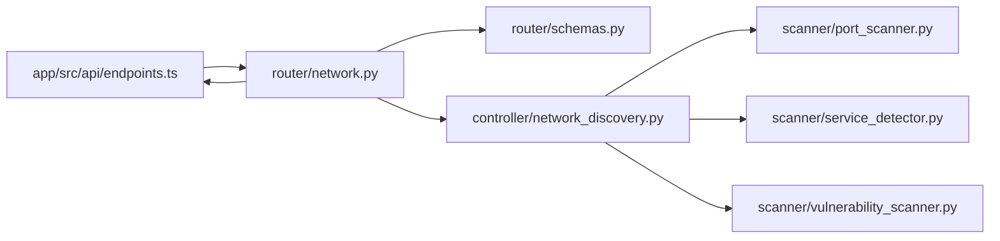

# 网络接口

<cite>
**本文档引用的文件**
- [router/network.py](file://router/network.py)
- [router/schemas.py](file://router/schemas.py)
- [router/main.py](file://router/main.py)
- [controller/network_discovery.py](file://controller/network_discovery.py)
- [scanner/port_scanner.py](file://scanner/port_scanner.py)
- [scanner/service_detector.py](file://scanner/service_detector.py)
- [scanner/vulnerability_scanner.py](file://scanner/vulnerability_scanner.py)
- [tools/pentest/network/traceroute_tool.py](file://tools/pentest/network/traceroute_tool.py)
- [tools/pentest/network/banner_grab_tool.py](file://tools/pentest/network/banner_grab_tool.py)
- [tools/pentest/network/ping_sweep_tool.py](file://tools/pentest/network/ping_sweep_tool.py)
- [tools/pentest/network/arp_scan_tool.py](file://tools/pentest/network/arp_scan_tool.py)
- [app/src/api/endpoints.ts](file://app/src/api/endpoints.ts)
- [docs/API.md](file://docs/API.md)
</cite>

## 目录
1. [简介](#简介)
2. [项目结构](#项目结构)
3. [核心组件](#核心组件)
4. [架构概览](#架构概览)
5. [详细组件分析](#详细组件分析)
6. [依赖分析](#依赖分析)
7. [性能考量](#性能考量)
8. [故障排查指南](#故障排查指南)
9. [结论](#结论)
10. [附录](#附录)

## 简介
本文件为 Secbot 网络接口的详细 API 文档，覆盖以下端点与能力：
- /api/network/discover：内网发现（主机存活、端口扫描、服务识别、MAC/主机名获取）
- /api/network/targets：列出目标（可筛选“仅授权”）
- /api/network/authorize：授权目标（支持凭据与授权类型）
- /api/network/authorizations：列出活跃授权
- /api/network/authorize/{target_ip}：撤销授权

同时，文档化了网络扫描功能的实现要点：端口扫描、服务检测、Banner 抓取、Traceroute 追踪、网络发现机制、服务识别算法与网络拓扑分析思路，并提供扫描策略配置、结果解析与报告生成的实践建议，以及性能优化与并发控制建议。

## 项目结构
网络接口由 FastAPI 路由模块统一管理，请求/响应模型集中定义，控制器与扫描器分别承担业务逻辑与底层扫描能力，前端通过封装好的 endpoints.ts 调用这些接口。

**图表来源**
- [router/network.py](file://router/network.py#L22-L149)
- [router/schemas.py](file://router/schemas.py#L203-L253)
- [router/main.py](file://router/main.py#L19-L71)
- [controller/network_discovery.py](file://controller/network_discovery.py#L15-L233)
- [scanner/port_scanner.py](file://scanner/port_scanner.py#L14-L63)
- [scanner/service_detector.py](file://scanner/service_detector.py#L29-L56)
- [scanner/vulnerability_scanner.py](file://scanner/vulnerability_scanner.py#L254-L289)
- [tools/pentest/network/traceroute_tool.py](file://tools/pentest/network/traceroute_tool.py#L8-L88)
- [tools/pentest/network/banner_grab_tool.py](file://tools/pentest/network/banner_grab_tool.py#L8-L108)
- [tools/pentest/network/ping_sweep_tool.py](file://tools/pentest/network/ping_sweep_tool.py#L9-L90)
- [tools/pentest/network/arp_scan_tool.py](file://tools/pentest/network/arp_scan_tool.py#L10-L167)
- [app/src/api/endpoints.ts](file://app/src/api/endpoints.ts#L57-L83)

**章节来源**
- [router/network.py](file://router/network.py#L22-L149)
- [router/schemas.py](file://router/schemas.py#L203-L253)
- [router/main.py](file://router/main.py#L19-L71)

## 核心组件
- 网络路由模块：提供内网发现、目标列表、授权管理等端点，统一处理请求与响应模型。
- 请求/响应模型：集中定义 DiscoverRequest、HostInfo、DiscoverResponse、TargetListResponse、AuthorizeRequest、AuthorizeResponse、AuthorizationInfo、AuthorizationListResponse、RevokeResponse 等。
- 控制器与扫描器：NetworkDiscovery 负责网络扫描与发现；PortScanner、ServiceDetector、VulnerabilityScanner 提供端口扫描、服务识别与漏洞检测能力。
- 工具集：TracerouteTool、BannerGrabTool、PingSweepTool、ArpScanTool 提供额外的网络探测与拓扑分析能力。
- 前端封装：endpoints.ts 提供类型化的调用封装，便于前端集成。

**章节来源**
- [router/network.py](file://router/network.py#L25-L149)
- [router/schemas.py](file://router/schemas.py#L203-L253)
- [controller/network_discovery.py](file://controller/network_discovery.py#L15-L233)
- [scanner/port_scanner.py](file://scanner/port_scanner.py#L14-L63)
- [scanner/service_detector.py](file://scanner/service_detector.py#L29-L56)
- [scanner/vulnerability_scanner.py](file://scanner/vulnerability_scanner.py#L254-L289)
- [tools/pentest/network/traceroute_tool.py](file://tools/pentest/network/traceroute_tool.py#L8-L88)
- [tools/pentest/network/banner_grab_tool.py](file://tools/pentest/network/banner_grab_tool.py#L8-L108)
- [tools/pentest/network/ping_sweep_tool.py](file://tools/pentest/network/ping_sweep_tool.py#L9-L90)
- [tools/pentest/network/arp_scan_tool.py](file://tools/pentest/network/arp_scan_tool.py#L10-L167)
- [app/src/api/endpoints.ts](file://app/src/api/endpoints.ts#L57-L83)

## 架构概览
网络接口采用分层设计：
- 路由层：接收 HTTP 请求，校验参数，调用控制器。
- 控制器层：编排扫描器与工具集，组织扫描流程。
- 扫描器层：提供端口扫描、服务识别、漏洞检测等原子能力。
- 工具层：提供 Traceroute、Banner 抓取、Ping/Sweep、ARP 等探测工具。
- 模型层：统一请求/响应结构，保证前后端契约一致。
- 前端层：通过封装的 endpoints.ts 调用后端接口。

**图表来源**
- [router/network.py](file://router/network.py#L25-L47)
- [controller/network_discovery.py](file://controller/network_discovery.py#L121-L156)
- [scanner/port_scanner.py](file://scanner/port_scanner.py#L33-L54)

**章节来源**
- [router/network.py](file://router/network.py#L25-L47)
- [controller/network_discovery.py](file://controller/network_discovery.py#L121-L156)

## 详细组件分析

### 端点：/api/network/discover（内网发现）
- 方法与路径：POST /api/network/discover
- URL 参数：无
- 请求体字段（DiscoverRequest）：
  - network: 可选，网络段（如 192.168.1.0/24），默认自动检测
- 响应体字段（DiscoverResponse）：
  - success: 布尔值
  - hosts: HostInfo 数组
- HostInfo 字段：
  - ip、hostname、mac_address、open_ports、authorized
- 处理流程：
  - 调用控制器的 discover_network(network)
  - 对每个主机执行 ping、端口扫描、服务识别、MAC/主机名解析
  - 返回发现的主机列表

**图表来源**
- [router/network.py](file://router/network.py#L25-L47)
- [controller/network_discovery.py](file://controller/network_discovery.py#L121-L156)
- [scanner/port_scanner.py](file://scanner/port_scanner.py#L33-L54)
- [scanner/service_detector.py](file://scanner/service_detector.py#L32-L40)

**章节来源**
- [router/network.py](file://router/network.py#L25-L47)
- [router/schemas.py](file://router/schemas.py#L203-L218)
- [controller/network_discovery.py](file://controller/network_discovery.py#L121-L156)
- [scanner/port_scanner.py](file://scanner/port_scanner.py#L33-L54)
- [scanner/service_detector.py](file://scanner/service_detector.py#L32-L40)

### 端点：/api/network/targets（列出目标）
- 方法与路径：GET /api/network/targets
- 查询参数：
  - authorized_only: 布尔值，默认 false，仅显示已授权的目标
- 响应体字段（TargetListResponse）：
  - targets: HostInfo 数组
- 处理流程：
  - 调用控制器的 get_targets(authorized_only)
  - 将内部目标结构转换为 HostInfo 列表返回

**章节来源**
- [router/network.py](file://router/network.py#L50-L74)
- [router/schemas.py](file://router/schemas.py#L220-L222)

### 端点：/api/network/authorize（授权目标）
- 方法与路径：POST /api/network/authorize
- 请求体字段（AuthorizeRequest）：
  - target_ip、username、password（可选）、key_file（可选）、auth_type（默认 full）、description（可选）
- 响应体字段（AuthorizeResponse）：
  - success、message
- 处理流程：
  - 组装凭据字典（username/password/key_file）
  - 调用控制器 authorize_target(...)
  - 返回授权结果

**章节来源**
- [router/network.py](file://router/network.py#L77-L102)
- [router/schemas.py](file://router/schemas.py#L224-L236)

### 端点：/api/network/authorizations（列出所有授权）
- 方法与路径：GET /api/network/authorizations
- 查询参数：无
- 响应体字段（AuthorizationListResponse）：
  - authorizations: AuthorizationInfo 数组
- AuthorizationInfo 字段：
  - target_ip、auth_type、username、created_at、description（截断）
- 处理流程：
  - 调用控制器的 auth_manager.list_authorizations(status="active")
  - 转换为 AuthorizationInfo 列表返回

**章节来源**
- [router/network.py](file://router/network.py#L105-L132)
- [router/schemas.py](file://router/schemas.py#L238-L247)

### 端点：/api/network/authorize/{target_ip}（撤销授权）
- 方法与路径：DELETE /api/network/authorize/{target_ip}
- 路径参数：
  - target_ip: 目标 IP
- 响应体字段（RevokeResponse）：
  - success、message
- 处理流程：
  - 调用 auth_manager.revoke_authorization(target_ip)
  - 返回撤销结果

**章节来源**
- [router/network.py](file://router/network.py#L135-L149)
- [router/schemas.py](file://router/schemas.py#L250-L253)

### 网络扫描功能与算法

#### 端口扫描
- 端口扫描器 PortScanner：
  - 支持快速扫描（常见端口集合）与完整扫描（扩展端口范围）
  - 异步并发检查端口，聚合开放端口统计
- 网络发现器 NetworkDiscovery：
  - 自动获取本地网络段
  - 并发扫描主机，先 ping 再端口扫描，识别服务与操作系统特征（简化）

**图表来源**
- [controller/network_discovery.py](file://controller/network_discovery.py#L121-L156)
- [scanner/port_scanner.py](file://scanner/port_scanner.py#L33-L54)
- [scanner/service_detector.py](file://scanner/service_detector.py#L42-L55)

**章节来源**
- [scanner/port_scanner.py](file://scanner/port_scanner.py#L14-L63)
- [controller/network_discovery.py](file://controller/network_discovery.py#L121-L156)
- [scanner/service_detector.py](file://scanner/service_detector.py#L29-L56)

#### 服务检测与 Banner 抓取
- 服务识别 ServiceDetector：
  - 基于端口映射识别服务类型（如 http/https、ssh、ftp、mysql、redis 等）
  - 依赖 PortScanner 的快速扫描结果
- Banner 抓取 BannerGrabTool：
  - 连接目标端口获取首行 Banner，支持探测性发送探测报文
  - 返回开放端口的 Banner 信息

**图表来源**
- [scanner/service_detector.py](file://scanner/service_detector.py#L42-L55)
- [tools/pentest/network/banner_grab_tool.py](file://tools/pentest/network/banner_grab_tool.py#L19-L68)

**章节来源**
- [scanner/service_detector.py](file://scanner/service_detector.py#L29-L56)
- [tools/pentest/network/banner_grab_tool.py](file://tools/pentest/network/banner_grab_tool.py#L8-L108)

#### Traceroute 追踪
- TracerouteTool：
  - 跨平台执行 tracert/traceroute，解析跳数与路径
  - 返回每跳 IP 与耗时信息，用于网络拓扑分析

**章节来源**
- [tools/pentest/network/traceroute_tool.py](file://tools/pentest/network/traceroute_tool.py#L8-L88)

#### 网络发现机制与授权管理
- 网络发现：自动获取本地网络段，批量并发扫描，聚合结果
- 授权管理：支持凭据与授权类型配置，提供授权列表与撤销能力

**章节来源**
- [controller/network_discovery.py](file://controller/network_discovery.py#L24-L41)
- [router/network.py](file://router/network.py#L77-L149)

## 依赖分析
- 路由依赖模型层（schemas）与控制器
- 控制器依赖扫描器与工具集
- 前端通过 endpoints.ts 依赖路由层

**图表来源**
- [app/src/api/endpoints.ts](file://app/src/api/endpoints.ts#L57-L83)
- [router/network.py](file://router/network.py#L25-L149)
- [router/schemas.py](file://router/schemas.py#L203-L253)
- [controller/network_discovery.py](file://controller/network_discovery.py#L15-L233)
- [scanner/port_scanner.py](file://scanner/port_scanner.py#L14-L63)
- [scanner/service_detector.py](file://scanner/service_detector.py#L29-L56)
- [scanner/vulnerability_scanner.py](file://scanner/vulnerability_scanner.py#L254-L289)

**章节来源**
- [router/network.py](file://router/network.py#L25-L149)
- [router/schemas.py](file://router/schemas.py#L203-L253)
- [controller/network_discovery.py](file://controller/network_discovery.py#L15-L233)
- [scanner/port_scanner.py](file://scanner/port_scanner.py#L14-L63)
- [scanner/service_detector.py](file://scanner/service_detector.py#L29-L56)
- [scanner/vulnerability_scanner.py](file://scanner/vulnerability_scanner.py#L254-L289)
- [app/src/api/endpoints.ts](file://app/src/api/endpoints.ts#L57-L83)

## 性能考量
- 并发控制
  - 端口扫描：PortScanner 使用 asyncio.gather 并发检查端口，建议根据网络状况与目标数量调整超时与并发度，避免阻塞与资源耗尽
  - 网络发现：NetworkDiscovery 对主机列表并发扫描，建议限制并发上限（max_workers），并结合超时参数平衡速度与稳定性
- 超时与重试
  - 设置合理的超时（timeout），避免长时间等待导致线程池阻塞
  - 对不稳定网络可增加有限重试，但需注意总耗时与资源占用
- 资源隔离
  - 使用独立线程池或事件循环，避免与主业务线程争抢资源
- 扫描策略
  - 快速扫描适用于初步侦察，完整扫描适用于深度评估
  - 服务识别与 Banner 抓取可按需开启，减少不必要的网络交互
- 前端调用
  - 前端通过 endpoints.ts 并发调用多个端点时，建议加入节流与去抖，避免对后端造成瞬时压力

[本节为通用性能建议，无需特定文件引用]

## 故障排查指南
- 常见错误与处理
  - 网络段无效：当 network 参数格式不正确或无法解析时，控制器会记录错误并返回空结果
  - 主机不可达：ping 失败或端口扫描超时会导致主机未被纳入结果
  - 授权失败：凭据错误或权限不足会导致授权失败，需检查凭据与授权类型
  - Traceroute 失败：目标不可达或系统命令不可用会导致追踪失败
- 日志与可观测性
  - 控制器与工具均记录关键日志，便于定位问题
  - 建议在生产环境开启文件日志，保留详细审计信息
- 前端调用
  - 使用 endpoints.ts 封装的函数，确保请求参数与响应结构一致

**章节来源**
- [controller/network_discovery.py](file://controller/network_discovery.py#L133-L135)
- [router/network.py](file://router/network.py#L46-L47)
- [tools/pentest/network/traceroute_tool.py](file://tools/pentest/network/traceroute_tool.py#L74-L77)

## 结论
Secbot 的网络接口以清晰的分层架构实现了内网发现、目标管理与授权控制，并提供了端口扫描、服务识别、Banner 抓取与 Traceroute 等核心能力。通过合理的并发控制与扫描策略，可在保证性能的同时提升安全性评估效率。建议在生产环境中结合日志与监控，持续优化扫描参数与并发度，确保稳定与合规。

[本节为总结性内容，无需特定文件引用]

## 附录

### API 端点一览与使用示例

- /api/network/discover（内网发现）
  - 示例：POST /api/network/discover
  - 请求体：{ "network": "192.168.1.0/24" }
  - 响应：包含 hosts 数组，每个元素为 HostInfo
  - 结果解析：提取 open_ports、services、mac_address、hostname 等字段
  - 报告生成：将 hosts 转换为表格或可视化拓扑图

- /api/network/targets（列出目标）
  - 示例：GET /api/network/targets?authorized_only=true
  - 响应：targets 数组，每个元素为 HostInfo

- /api/network/authorize（授权目标）
  - 示例：POST /api/network/authorize
  - 请求体：包含 target_ip、username、password/key_file、auth_type、description
  - 响应：success 与 message

- /api/network/authorizations（列出授权）
  - 示例：GET /api/network/authorizations
  - 响应：authorizations 数组，包含授权信息

- /api/network/authorize/{target_ip}（撤销授权）
  - 示例：DELETE /api/network/authorize/{target_ip}
  - 响应：success 与 message

**章节来源**
- [router/network.py](file://router/network.py#L25-L149)
- [router/schemas.py](file://router/schemas.py#L203-L253)
- [app/src/api/endpoints.ts](file://app/src/api/endpoints.ts#L57-L83)
- [docs/API.md](file://docs/API.md#L310-L320)