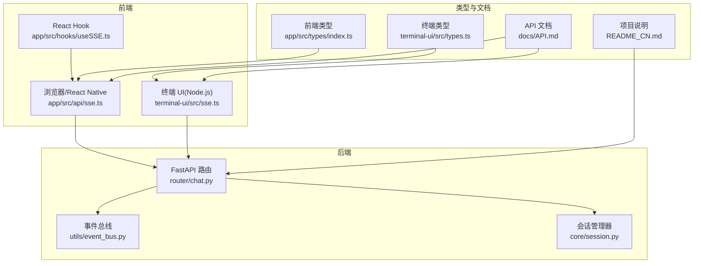
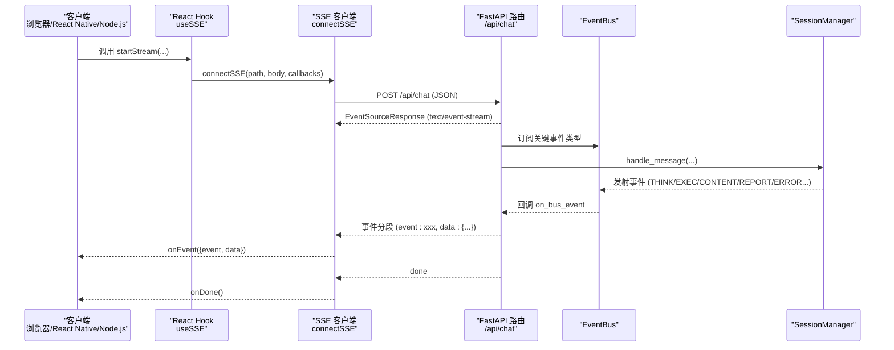
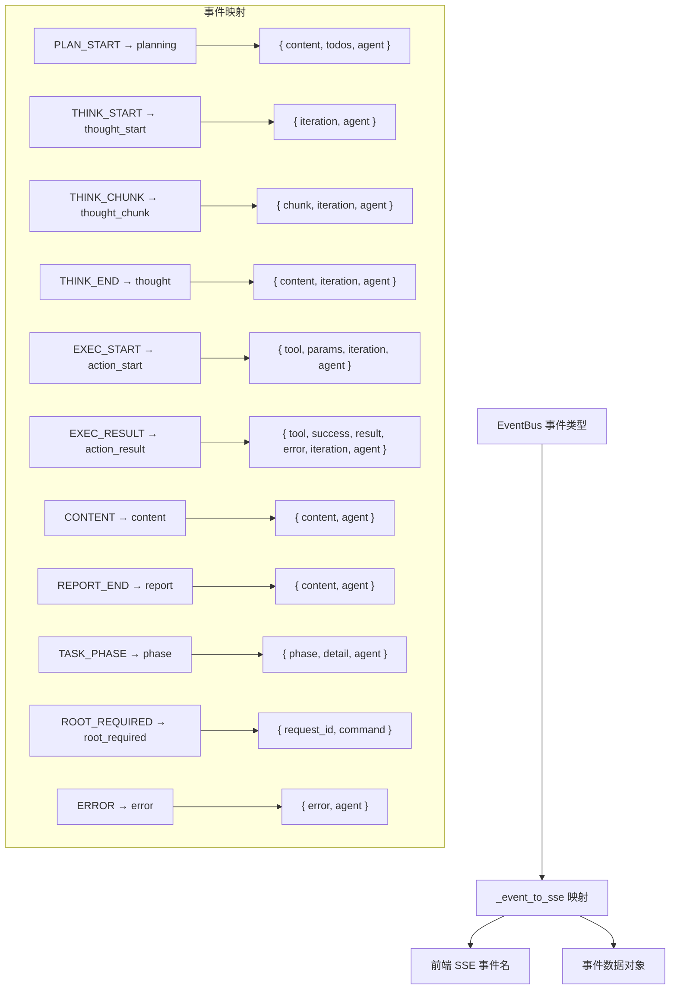
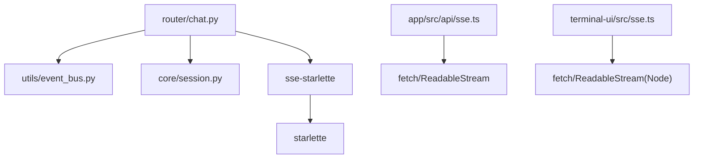

# 聊天接口（SSE流式通信）

<cite>
**本文档引用的文件**
- [router/chat.py](file://router/chat.py)
- [router/schemas.py](file://router/schemas.py)
- [utils/event_bus.py](file://utils/event_bus.py)
- [app/src/api/sse.ts](file://app/src/api/sse.ts)
- [terminal-ui/src/sse.ts](file://terminal-ui/src/sse.ts)
- [app/src/hooks/useSSE.ts](file://app/src/hooks/useSSE.ts)
- [app/src/types/index.ts](file://app/src/types/index.ts)
- [terminal-ui/src/types.ts](file://terminal-ui/src/types.ts)
- [docs/API.md](file://docs/API.md)
- [README_CN.md](file://README_CN.md)
- [terminal-ui/scripts/check-connection.mts](file://terminal-ui/scripts/check-connection.mts)
</cite>

## 目录
1. [简介](#简介)
2. [项目结构](#项目结构)
3. [核心组件](#核心组件)
4. [架构概览](#架构概览)
5. [详细组件分析](#详细组件分析)
6. [依赖关系分析](#依赖关系分析)
7. [性能考量](#性能考量)
8. [故障排除指南](#故障排除指南)
9. [结论](#结论)

## 简介
本文件为 Secbot 聊天接口（SSE 流式通信）的完整技术文档，聚焦于 /api/chat 端点的 Server-Sent Events 实现。文档涵盖：
- HTTP 方法与请求/响应格式
- SSE 事件类型与数据结构
- 流式通信机制（事件流建立、数据传输协议、连接管理）
- 前端 JavaScript 与 Node.js 客户端实现要点
- 错误处理、重连机制与性能优化建议

## 项目结构
围绕聊天 SSE 的关键文件与职责如下：
- 后端路由与事件桥接：router/chat.py
- 请求/响应模型：router/schemas.py
- 事件总线：utils/event_bus.py
- 前端 SSE 客户端（浏览器/React Native）：app/src/api/sse.ts
- 终端 UI SSE 客户端（Node.js）：terminal-ui/src/sse.ts
- React Hook 封装：app/src/hooks/useSSE.ts
- 类型定义：app/src/types/index.ts、terminal-ui/src/types.ts
- API 文档：docs/API.md
- 项目说明与架构：README_CN.md
- 连通性检查脚本：terminal-ui/scripts/check-connection.mts

**图表来源**
- [router/chat.py](file://router/chat.py#L27-L271)
- [utils/event_bus.py](file://utils/event_bus.py#L68-L187)
- [app/src/api/sse.ts](file://app/src/api/sse.ts#L50-L163)
- [terminal-ui/src/sse.ts](file://terminal-ui/src/sse.ts#L33-L133)
- [app/src/hooks/useSSE.ts](file://app/src/hooks/useSSE.ts#L9-L50)
- [app/src/types/index.ts](file://app/src/types/index.ts#L6-L20)
- [terminal-ui/src/types.ts](file://terminal-ui/src/types.ts#L4-L17)
- [docs/API.md](file://docs/API.md#L60-L116)
- [README_CN.md](file://README_CN.md#L77-L152)

**章节来源**
- [router/chat.py](file://router/chat.py#L27-L271)
- [router/schemas.py](file://router/schemas.py#L18-L39)
- [utils/event_bus.py](file://utils/event_bus.py#L68-L187)
- [app/src/api/sse.ts](file://app/src/api/sse.ts#L50-L163)
- [terminal-ui/src/sse.ts](file://terminal-ui/src/sse.ts#L33-L133)
- [app/src/hooks/useSSE.ts](file://app/src/hooks/useSSE.ts#L9-L50)
- [app/src/types/index.ts](file://app/src/types/index.ts#L6-L20)
- [terminal-ui/src/types.ts](file://terminal-ui/src/types.ts#L4-L17)
- [docs/API.md](file://docs/API.md#L60-L116)
- [README_CN.md](file://README_CN.md#L77-L152)

## 核心组件
- 路由与事件生成器
  - /api/chat（POST）：返回 EventSourceResponse，内部通过 _interaction_event_generator 驱动事件流。
  - 事件映射：_event_to_sse 将 EventBus 事件类型转换为前端 SSE 事件名与数据。
- 事件总线
  - EventBus 订阅/发布机制，支持同步与异步处理器，承载 Agent 层与 UI 层解耦。
- SSE 客户端
  - 浏览器/React Native：app/src/api/sse.ts，支持 ReadableStream 流式读取与分段解析。
  - Node.js（终端 UI）：terminal-ui/src/sse.ts，契约一致，适配 Node 环境。
- React Hook
  - app/src/hooks/useSSE.ts：封装 connectSSE，提供 startStream/stopStream 与状态管理。

**章节来源**
- [router/chat.py](file://router/chat.py#L33-L131)
- [router/chat.py](file://router/chat.py#L134-L263)
- [utils/event_bus.py](file://utils/event_bus.py#L68-L187)
- [app/src/api/sse.ts](file://app/src/api/sse.ts#L50-L163)
- [terminal-ui/src/sse.ts](file://terminal-ui/src/sse.ts#L33-L133)
- [app/src/hooks/useSSE.ts](file://app/src/hooks/useSSE.ts#L9-L50)

## 架构概览
SSE 事件流从后端到前端的关键路径如下：

**图表来源**
- [router/chat.py](file://router/chat.py#L134-L263)
- [utils/event_bus.py](file://utils/event_bus.py#L68-L187)
- [app/src/hooks/useSSE.ts](file://app/src/hooks/useSSE.ts#L13-L42)
- [app/src/api/sse.ts](file://app/src/api/sse.ts#L66-L163)
- [terminal-ui/src/sse.ts](file://terminal-ui/src/sse.ts#L49-L133)

## 详细组件分析

### /api/chat（POST）端点
- HTTP 方法：POST
- URL：/api/chat
- 请求体：ChatRequest（message、mode、agent、prompt、model）
- 响应：EventSourceResponse（text/event-stream）
- 行为：
  - 立即发送 connected 事件，确保前端尽快脱离“连接中”状态
  - 订阅 EventBus 的关键事件类型（PLAN_START/THINK_*/EXEC_*/CONTENT/REPORT_END/TASK_PHASE/ROOT_REQUIRED/ERROR）
  - 通过 SessionManager.handle_message 驱动交互流程
  - 异常时发送 error 事件，最终发送 done 事件

**章节来源**
- [router/chat.py](file://router/chat.py#L265-L271)
- [router/chat.py](file://router/chat.py#L134-L263)
- [router/schemas.py](file://router/schemas.py#L18-L24)

### SSE 事件类型与数据结构
后端 EventBus 事件到前端 SSE 事件的映射如下：

- 事件名与数据字段
  - connected：用于确认连接建立
  - planning：规划摘要与待办列表
  - thought_start/thought_chunk/thought：推理开始/流式片段/结束
  - action_start/action_result：工具执行开始/结果
  - content：观察/内容输出
  - report：报告生成
  - phase：任务阶段状态
  - root_required：需要 root 权限时的请求 ID 与命令
  - error：错误信息
  - done：流结束
  - response：最终完整响应（后端在 finally 中发送）

- 事件数据字段说明
  - content：文本内容
  - todos：待办项数组（含 content/status）
  - iteration：推理迭代次数
  - tool/params：工具名称与参数
  - success/result/error：执行结果与错误
  - agent：事件来源的智能体类型
  - phase/detail：阶段名称与详情
  - request_id/command：root 权限请求的标识与命令
  - error：错误描述

**图表来源**
- [router/chat.py](file://router/chat.py#L33-L131)
- [utils/event_bus.py](file://utils/event_bus.py#L15-L53)

**章节来源**
- [router/chat.py](file://router/chat.py#L33-L131)
- [router/schemas.py](file://router/schemas.py#L18-L24)
- [docs/API.md](file://docs/API.md#L78-L95)

### 事件流建立与数据传输协议
- 连接建立
  - 客户端通过 POST /api/chat 发起连接
  - 后端立即发送 connected 事件，前端据此更新 UI 状态
- 数据传输协议
  - 事件分段格式：event: 事件名\n\ndata: JSON 数据\n\n
  - 客户端解析分段，提取 event 与 data，JSON 反序列化后传递给回调
  - 支持多行 data（按换行连接）
- 连接管理
  - 浏览器/React Native 环境：使用 ReadableStream 流式读取，边到边解析
  - Node.js 环境：若无 response.body，则一次性读取再解析
  - 超时控制：15 秒内未收到任何事件则中断连接并触发 onError
  - done 事件：流结束标志，onDone 回调触发

**章节来源**
- [router/chat.py](file://router/chat.py#L141-L145)
- [app/src/api/sse.ts](file://app/src/api/sse.ts#L19-L35)
- [app/src/api/sse.ts](file://app/src/api/sse.ts#L115-L119)
- [terminal-ui/src/sse.ts](file://terminal-ui/src/sse.ts#L14-L27)
- [terminal-ui/src/sse.ts](file://terminal-ui/src/sse.ts#L84-L88)

### 前端 JavaScript 客户端实现要点
- 浏览器/React Native 客户端
  - connectSSE(path, body, callbacks)：返回 AbortController，支持取消
  - callbacks.onEvent/onError/onDone：分别处理事件、错误与完成
  - 解析 SSE 分段，支持多行 data
- React Hook
  - useSSE：封装连接生命周期，提供 streaming 状态与 stopStream 控制
- 终端 UI（Node.js）
  - 与浏览器客户端契约一致，适配 Node 环境的 fetch 与 ReadableStream

**章节来源**
- [app/src/api/sse.ts](file://app/src/api/sse.ts#L50-L163)
- [app/src/hooks/useSSE.ts](file://app/src/hooks/useSSE.ts#L9-L50)
- [terminal-ui/src/sse.ts](file://terminal-ui/src/sse.ts#L33-L133)

### Python 客户端实现要点（基于现有契约）
- 基于现有契约（与浏览器/Node 客户端一致），可使用 requests 或 httpx（含 httpx-sse）实现
- 关键点
  - 使用 POST /api/chat，Content-Type: application/json
  - 流式读取响应，按 event/data 分段解析
  - 超时控制与错误处理
  - done 事件后停止监听

[本小节为概念性实现指导，不直接分析具体文件]

### 错误处理、重连机制与性能优化
- 错误处理
  - HTTP 非 OK：抛出包含状态码与响应体的错误
  - SSE 解析异常：降级为 raw 字段传递原始数据
  - 异常事件：后端发送 error 事件，前端 onError 回调
- 重连机制
  - 建议在前端实现指数退避重试，结合 done 与 error 事件判定
  - 使用 AbortController 管理连接生命周期
- 性能优化
  - 合理设置超时阈值（当前 15 秒）
  - 前端按事件类型增量渲染，避免全量重绘
  - 后端按需订阅事件，减少无关事件广播

**章节来源**
- [app/src/api/sse.ts](file://app/src/api/sse.ts#L75-L78)
- [app/src/api/sse.ts](file://app/src/api/sse.ts#L84-L89)
- [app/src/api/sse.ts](file://app/src/api/sse.ts#L154-L159)
- [terminal-ui/src/sse.ts](file://terminal-ui/src/sse.ts#L58-L61)
- [terminal-ui/src/sse.ts](file://terminal-ui/src/sse.ts#L66-L72)
- [terminal-ui/src/sse.ts](file://terminal-ui/src/sse.ts#L124-L129)

## 依赖关系分析
- 组件耦合
  - 路由层与 EventBus：通过订阅/回调解耦
  - 路由层与 SessionManager：通过交互编排驱动事件流
  - 客户端与后端：通过 SSE 协议契约解耦
- 外部依赖
  - sse-starlette：提供 EventSourceResponse
  - Starlette：底层 ASGI 支持
  - 前端 fetch 与 ReadableStream：浏览器/React Native 环境
  - Node.js fetch：终端 UI 环境

**图表来源**
- [router/chat.py](file://router/chat.py#L13-L24)
- [uv.lock](file://uv.lock#L3652-L3675)

**章节来源**
- [router/chat.py](file://router/chat.py#L13-L24)
- [uv.lock](file://uv.lock#L3652-L3675)

## 性能考量
- 事件粒度
  - THINK_CHUNK 提供细粒度流式输出，建议前端按需渲染，避免过度重绘
- 并发控制
  - 后端按层并发执行，前端按事件顺序渲染，保证一致性
- 连接稳定性
  - 超时与断线重试策略，结合 done/error 事件判定
- 资源占用
  - 合理清理队列与任务，避免内存泄漏

[本节为通用性能建议，不直接分析具体文件]

## 故障排除指南
- 连接超时
  - 现象：15 秒内未收到事件，触发 onError
  - 排查：确认后端已启动、BASE_URL/SECBOT_API_URL 配置正确、网络可达
- 事件解析异常
  - 现象：JSON 解析失败，回调收到 raw 字段
  - 排查：检查后端事件数据格式是否符合预期
- done 事件缺失
  - 现象：onDone 未触发
  - 排查：确认后端 finally 分支是否发送 done；检查客户端是否提前中断
- 连通性验证
  - 使用终端脚本检查 SSE 事件：connected/done/error 事件出现即为连通

**章节来源**
- [app/src/api/sse.ts](file://app/src/api/sse.ts#L115-L119)
- [terminal-ui/src/sse.ts](file://terminal-ui/src/sse.ts#L84-L88)
- [terminal-ui/scripts/check-connection.mts](file://terminal-ui/scripts/check-connection.mts#L46-L49)

## 结论
Secbot 的 /api/chat SSE 实现通过 EventBus 与 SessionManager 的解耦设计，实现了从规划、推理、执行到报告的完整事件流。前端通过统一的 SSE 客户端契约，可在浏览器、React Native 与 Node.js 环境中稳定消费事件。建议在生产环境中完善重连与错误处理策略，并根据业务场景调整事件粒度与渲染策略，以获得更佳的用户体验与性能表现。