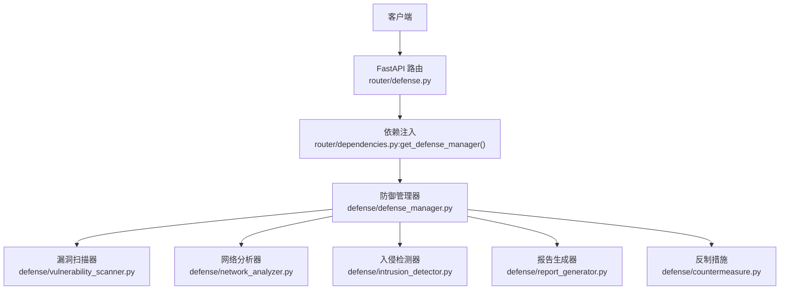
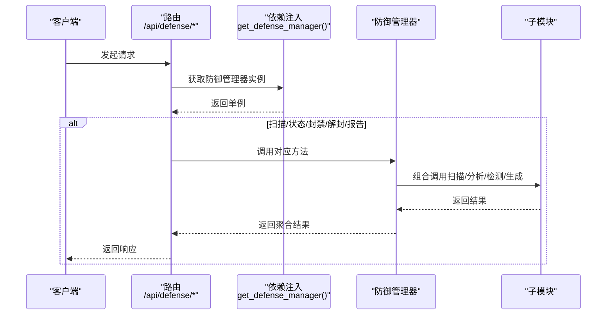
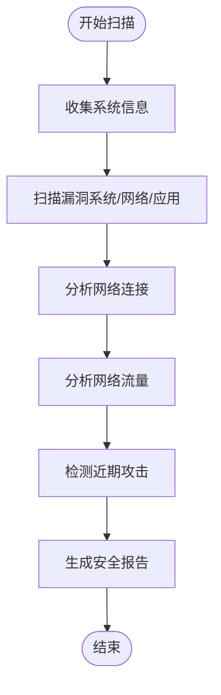
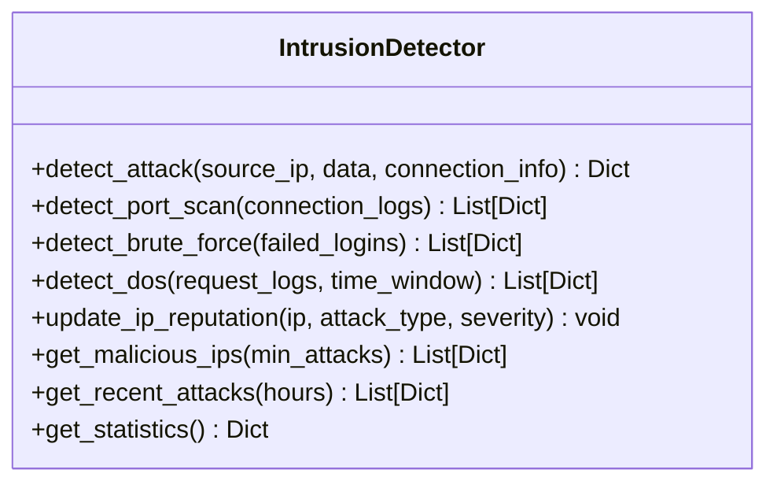
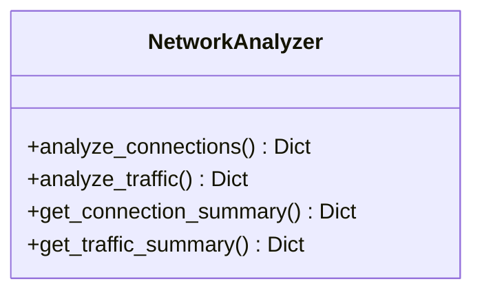
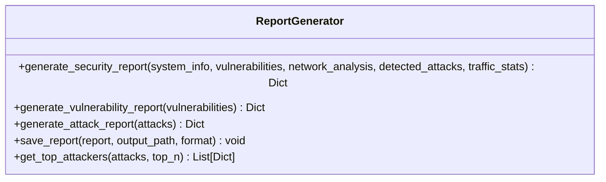
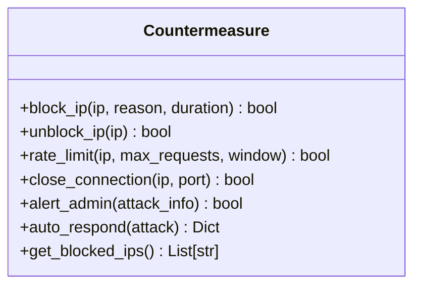
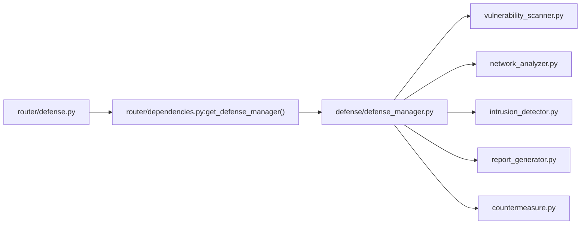

# 防御接口

<cite>
**本文引用的文件**
- [router/defense.py](file://router/defense.py)
- [router/schemas.py](file://router/schemas.py)
- [router/dependencies.py](file://router/dependencies.py)
- [defense/defense_manager.py](file://defense/defense_manager.py)
- [defense/vulnerability_scanner.py](file://defense/vulnerability_scanner.py)
- [defense/network_analyzer.py](file://defense/network_analyzer.py)
- [defense/intrusion_detector.py](file://defense/intrusion_detector.py)
- [defense/report_generator.py](file://defense/report_generator.py)
- [defense/countermeasure.py](file://defense/countermeasure.py)
- [tools/defense/defense_scan_tool.py](file://tools/defense/defense_scan_tool.py)
- [tools/defense/intrusion_detect_tool.py](file://tools/defense/intrusion_detect_tool.py)
- [tools/defense/network_analyze_tool.py](file://tools/defense/network_analyze_tool.py)
- [tools/defense/self_vuln_scan_tool.py](file://tools/defense/self_vuln_scan_tool.py)
- [tools/defense/system_info_tool.py](file://tools/defense/system_info_tool.py)
</cite>

## 目录
1. [简介](#简介)
2. [项目结构](#项目结构)
3. [核心组件](#核心组件)
4. [架构总览](#架构总览)
5. [详细组件分析](#详细组件分析)
6. [依赖分析](#依赖分析)
7. [性能考虑](#性能考虑)
8. [故障排查指南](#故障排查指南)
9. [结论](#结论)
10. [附录](#附录)

## 简介
本文件为 Secbot 防御接口的完整 API 文档，覆盖以下端点：
- GET /api/defense/status：获取防御系统状态
- POST /api/defense/scan：执行安全扫描并生成报告
- GET /api/defense/blocked：获取被封禁 IP 列表
- POST /api/defense/unblock：解封指定 IP
- GET /api/defense/report：生成各类防御报告（漏洞/攻击/完整）

文档同时阐述防御扫描功能（系统状态检查、安全漏洞扫描、威胁检测）、入侵检测机制、网络分析能力与报告生成流程，并提供实际使用示例、最佳实践与安全策略建议。

## 项目结构
防御接口位于后端路由层，通过依赖注入获取防御管理器，统一调度各防御子模块（漏洞扫描、网络分析、入侵检测、报告生成、反制措施）。

图表来源
- [router/defense.py](file://router/defense.py#L19-L96)
- [router/dependencies.py](file://router/dependencies.py#L109-L114)
- [defense/defense_manager.py](file://defense/defense_manager.py#L17-L32)

章节来源
- [router/defense.py](file://router/defense.py#L1-L96)
- [router/dependencies.py](file://router/dependencies.py#L109-L114)

## 核心组件
- 路由层：定义 /api/defense 前缀下的各端点，负责请求解析与响应封装。
- 依赖注入：提供单例化的防御管理器实例，确保全局一致性与资源复用。
- 防御管理器：编排漏洞扫描、网络分析、入侵检测、报告生成与反制响应。
- 子模块：
  - SelfVulnerabilityScanner：自检漏洞扫描（系统/网络/应用）
  - NetworkAnalyzer：连接与流量分析、可疑连接检测
  - IntrusionDetector：攻击模式识别与统计
  - ReportGenerator：生成综合/漏洞/攻击报告
  - Countermeasure：自动封禁、速率限制、连接关闭、告警

章节来源
- [router/defense.py](file://router/defense.py#L22-L96)
- [router/schemas.py](file://router/schemas.py#L166-L197)
- [defense/defense_manager.py](file://defense/defense_manager.py#L17-L160)
- [defense/vulnerability_scanner.py](file://defense/vulnerability_scanner.py#L12-L314)
- [defense/network_analyzer.py](file://defense/network_analyzer.py#L12-L226)
- [defense/intrusion_detector.py](file://defense/intrusion_detector.py#L11-L235)
- [defense/report_generator.py](file://defense/report_generator.py#L11-L290)
- [defense/countermeasure.py](file://defense/countermeasure.py#L11-L235)

## 架构总览
防御接口采用“路由 → 依赖注入 → 防御管理器 → 子模块”的分层设计，保证职责清晰与扩展性。

图表来源
- [router/defense.py](file://router/defense.py#L22-L96)
- [router/dependencies.py](file://router/dependencies.py#L109-L114)
- [defense/defense_manager.py](file://defense/defense_manager.py#L34-L160)

## 详细组件分析

### 端点定义与请求/响应规范

- GET /api/defense/status
  - 功能：获取防御系统状态（监控开关、自动响应、封禁 IP 数、漏洞数、检测到的攻击数、恶意 IP 数、统计信息）
  - 响应模型：DefenseStatusResponse
  - 响应字段：
    - monitoring: bool
    - auto_response: bool
    - blocked_ips: int
    - vulnerabilities: int
    - detected_attacks: int
    - malicious_ips: int
    - statistics: dict

- POST /api/defense/scan
  - 功能：执行完整安全扫描，返回扫描报告
  - 响应模型：DefenseScanResponse
  - 响应字段：
    - success: bool
    - report: dict（包含报告 ID、摘要、系统信息、漏洞、网络分析、攻击检测、流量统计、建议等）

- GET /api/defense/blocked
  - 功能：列出当前被封禁的 IP 地址
  - 响应模型：BlockedIpsResponse
  - 响应字段：
    - blocked_ips: list[str]

- POST /api/defense/unblock
  - 功能：解封指定 IP
  - 请求体模型：UnblockRequest
    - ip: string（要解封的 IP 地址）
  - 响应模型：UnblockResponse
    - success: bool
    - message: string

- GET /api/defense/report
  - 功能：生成防御报告；当 type=full 时需先执行扫描
  - 查询参数：
    - type: string，默认 vulnerability；可选 full/vulnerability/attack
  - 响应模型：DefenseReportResponse
  - 响应字段：
    - success: bool
    - report: dict（根据类型返回不同结构）

章节来源
- [router/defense.py](file://router/defense.py#L22-L96)
- [router/schemas.py](file://router/schemas.py#L166-L197)

### 防御扫描流程（POST /api/defense/scan）
完整扫描流程包括：系统信息收集、漏洞扫描、网络连接与流量分析、攻击检测、报告生成。

图表来源
- [defense/defense_manager.py](file://defense/defense_manager.py#L34-L61)
- [defense/vulnerability_scanner.py](file://defense/vulnerability_scanner.py#L296-L306)
- [defense/network_analyzer.py](file://defense/network_analyzer.py#L20-L65)
- [defense/intrusion_detector.py](file://defense/intrusion_detector.py#L200-L209)
- [defense/report_generator.py](file://defense/report_generator.py#L17-L56)

章节来源
- [defense/defense_manager.py](file://defense/defense_manager.py#L34-L61)

### 入侵检测机制
- 攻击模式识别：端口扫描、暴力破解、SQL 注入、XSS、DoS、恶意软件等
- 实时检测：基于正则匹配与阈值统计
- 统计与信誉：按来源 IP 计数、攻击类型统计、IP 信誉更新
- 近期攻击：支持按时间窗口筛选

图表来源
- [defense/intrusion_detector.py](file://defense/intrusion_detector.py#L11-L235)

章节来源
- [defense/intrusion_detector.py](file://defense/intrusion_detector.py#L56-L235)

### 网络分析功能
- 连接分析：统计连接总数、按状态/远端 IP/端口分布，识别已建立/监听/可疑连接
- 流量分析：按网卡统计收发字节数、丢包/错误包，检测异常流量
- 可疑连接检测：多连接到同一 IP、连接到可疑端口、疑似恶意 IP

图表来源
- [defense/network_analyzer.py](file://defense/network_analyzer.py#L12-L226)

章节来源
- [defense/network_analyzer.py](file://defense/network_analyzer.py#L20-L226)

### 报告生成功能
- 安全报告：汇总漏洞、网络分析、攻击检测、流量统计与建议
- 漏洞报告：按严重程度统计与建议
- 攻击报告：攻击类型与来源统计、Top 攻击者
- 风险等级：综合漏洞与攻击数量计算风险级别

图表来源
- [defense/report_generator.py](file://defense/report_generator.py#L11-L290)

章节来源
- [defense/report_generator.py](file://defense/report_generator.py#L17-L244)

### 反制响应策略
- 自动封禁：针对高危/严重攻击来源 IP
- 速率限制：对 DoS 攻击来源实施限流
- 关闭连接：对端口扫描来源尝试终止连接
- 告警通知：记录并上报攻击事件

图表来源
- [defense/countermeasure.py](file://defense/countermeasure.py#L11-L235)

章节来源
- [defense/countermeasure.py](file://defense/countermeasure.py#L185-L223)

### 工具层映射（便于理解端点背后能力）
- 防御扫描工具：整合系统信息、漏洞扫描、网络分析、入侵检测与报告生成
- 入侵检测工具：实时检测与近期攻击统计
- 网络分析工具：连接与流量统计、可疑连接检测
- 自检漏洞工具：系统/网络/应用漏洞扫描
- 系统信息工具：系统/网络/进程/用户信息收集

章节来源
- [tools/defense/defense_scan_tool.py](file://tools/defense/defense_scan_tool.py#L17-L43)
- [tools/defense/intrusion_detect_tool.py](file://tools/defense/intrusion_detect_tool.py#L17-L52)
- [tools/defense/network_analyze_tool.py](file://tools/defense/network_analyze_tool.py#L17-L74)
- [tools/defense/self_vuln_scan_tool.py](file://tools/defense/self_vuln_scan_tool.py#L17-L48)
- [tools/defense/system_info_tool.py](file://tools/defense/system_info_tool.py#L17-L52)

## 依赖分析
- 路由依赖防御管理器单例，确保线程安全与资源复用
- 防御管理器组合多个子模块，形成“扫描-分析-检测-报告-反制”的闭环
- 工具层与路由层共享相同的数据结构与业务逻辑，便于统一维护

图表来源
- [router/defense.py](file://router/defense.py#L19-L96)
- [router/dependencies.py](file://router/dependencies.py#L109-L114)
- [defense/defense_manager.py](file://defense/defense_manager.py#L17-L32)

章节来源
- [router/dependencies.py](file://router/dependencies.py#L109-L114)
- [defense/defense_manager.py](file://defense/defense_manager.py#L17-L32)

## 性能考虑
- 异步扫描：完整扫描涉及多模块并行与串行组合，建议在高负载场景下合理设置并发与超时
- 监控循环：实时监控采用异步任务轮询，注意间隔与异常恢复，避免阻塞
- 日志与统计：高频统计与日志输出可能带来 IO 压力，建议按需裁剪与周期性落盘
- 外部命令调用：系统更新检查、防火墙状态查询等依赖外部命令，需设置超时与降级策略

## 故障排查指南
- 状态查询失败：检查防御管理器初始化与依赖注入是否正常
- 扫描无结果：确认各子模块（漏洞扫描、网络分析、入侵检测）是否具备足够权限与可用数据
- 报告生成异常：当 type=full 时需先执行扫描；否则返回提示需先执行扫描
- 解封失败：确认 IP 是否在封禁列表中，以及平台命令执行权限

章节来源
- [router/defense.py](file://router/defense.py#L48-L95)
- [router/schemas.py](file://router/schemas.py#L194-L197)

## 结论
防御接口通过统一的路由与依赖注入，将漏洞扫描、网络分析、入侵检测、报告生成与反制响应整合为可扩展的防御体系。建议在生产环境中结合自动响应策略与持续监控，配合最佳实践与安全策略，提升整体安全防护水平。

## 附录

### API 使用示例（不含代码片段）
- 获取系统状态
  - 方法：GET
  - URL：/api/defense/status
  - 响应：包含监控状态、自动响应、封禁 IP 数、漏洞数、攻击数、恶意 IP 数与统计信息

- 执行安全扫描
  - 方法：POST
  - URL：/api/defense/scan
  - 响应：包含报告 ID、摘要、系统信息、漏洞详情、网络分析、攻击检测、流量统计与建议

- 查看封禁 IP 列表
  - 方法：GET
  - URL：/api/defense/blocked
  - 响应：被封禁的 IP 地址数组

- 解封指定 IP
  - 方法：POST
  - URL：/api/defense/unblock
  - 请求体：{ "ip": "目标IP" }
  - 响应：操作成功与否与提示信息

- 生成报告
  - 方法：GET
  - URL：/api/defense/report?type=vulnerability|attack|full
  - 响应：对应类型的报告内容；当 type=full 时需先执行扫描

### 最佳实践与安全策略建议
- 自动响应策略
  - 高危/严重攻击：立即封禁来源 IP 并记录告警
  - 暴力破解：封禁来源 IP 并触发账户锁定策略
  - DoS 攻击：实施速率限制并联动上游防护
  - 端口扫描：关闭可疑连接并记录
- 报告与审计
  - 定期生成漏洞与攻击报告，跟踪风险趋势
  - 保留反制历史与统计信息，用于溯源与优化策略
- 网络与系统加固
  - 启用并正确配置防火墙
  - 及时安装系统与应用更新
  - 限制不必要的服务与弱口令
  - 对关键文件与目录设置严格权限
- 监控与告警
  - 启动实时监控，设置合理的检查间隔
  - 对异常流量与可疑连接进行告警与处置
  - 结合威胁情报数据库提升可疑 IP 检测精度