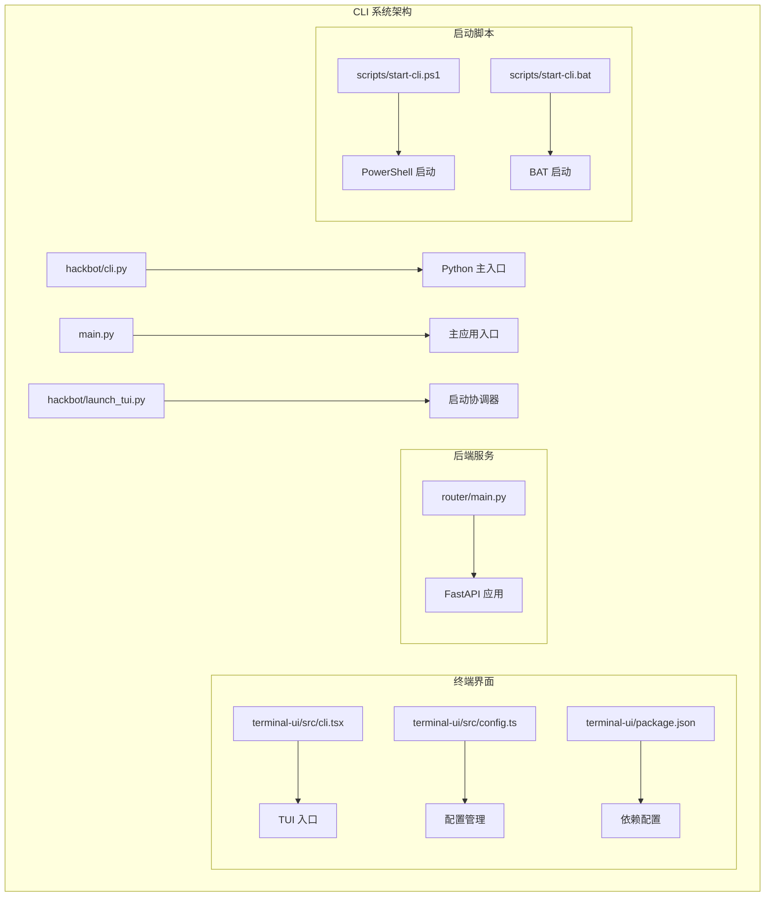
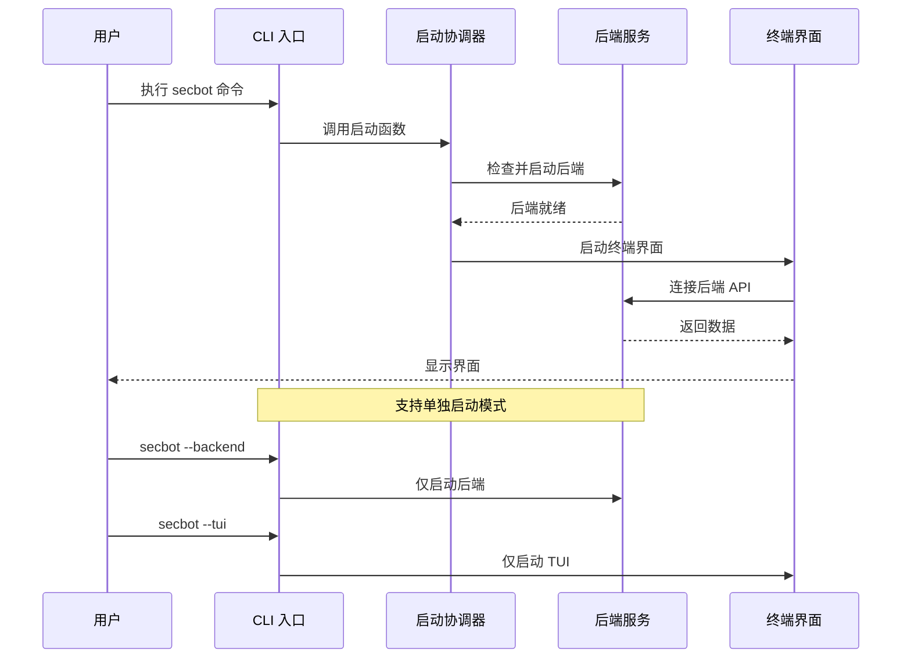
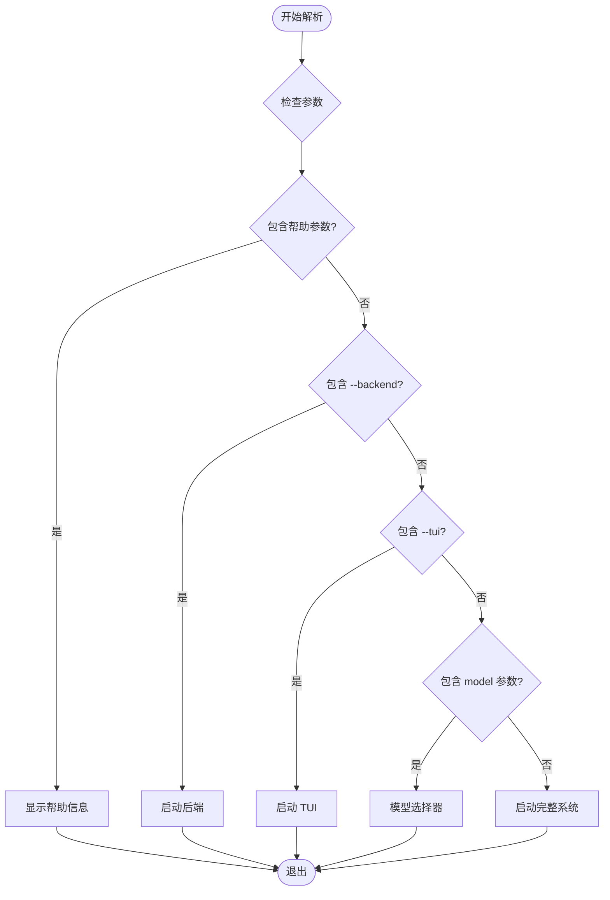
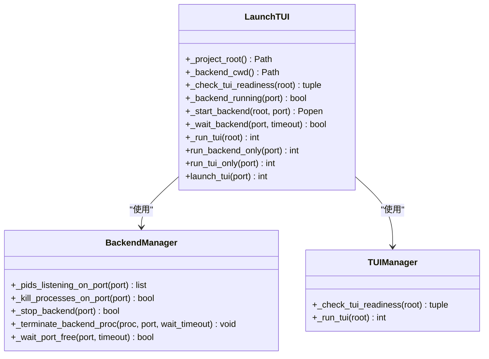
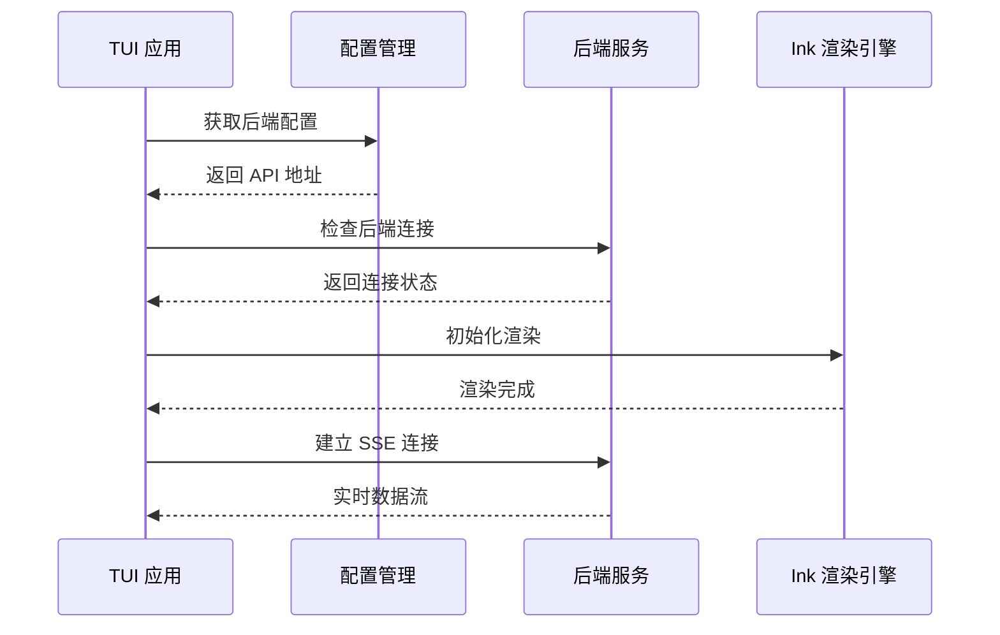
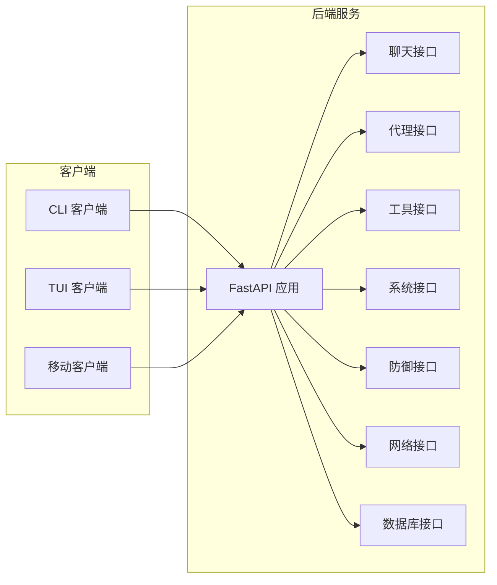
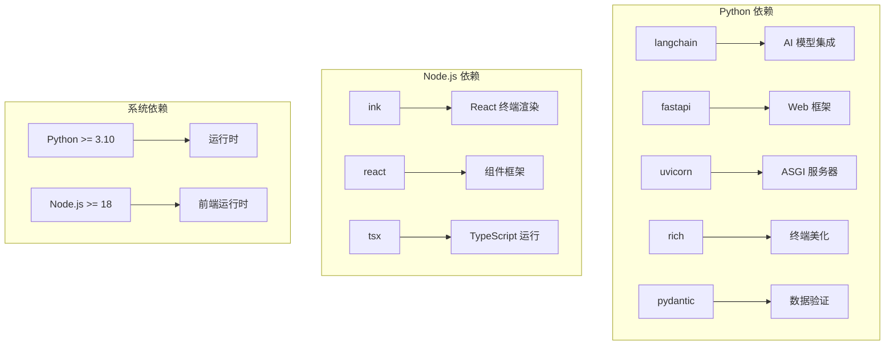
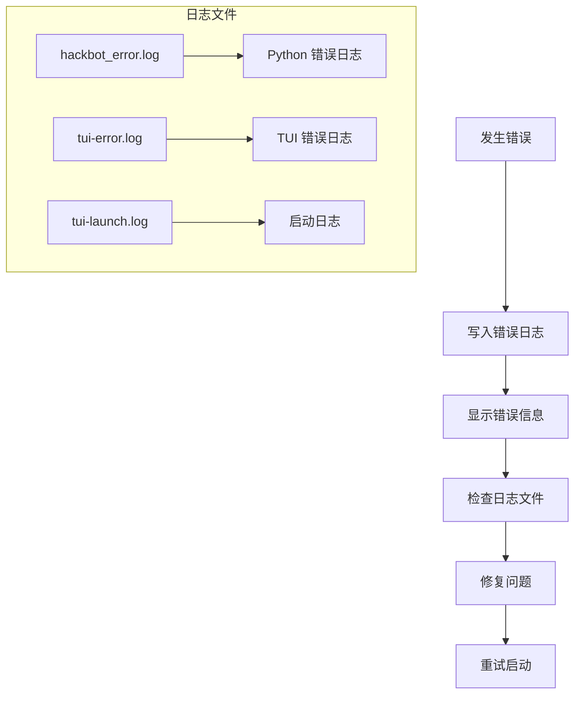

# CLI 系统

<cite>
**本文档引用的文件**
- [hackbot/cli.py](file://hackbot/cli.py)
- [main.py](file://main.py)
- [hackbot/launch_tui.py](file://hackbot/launch_tui.py)
- [terminal-ui/src/cli.tsx](file://terminal-ui/src/cli.tsx)
- [terminal-ui/src/config.ts](file://terminal-ui/src/config.ts)
- [terminal-ui/package.json](file://terminal-ui/package.json)
- [pyproject.toml](file://pyproject.toml)
- [scripts/start-cli.ps1](file://scripts/start-cli.ps1)
- [scripts/start-cli.bat](file://scripts/start-cli.bat)
- [router/main.py](file://router/main.py)
</cite>

## 目录
1. [简介](#简介)
2. [项目结构](#项目结构)
3. [核心组件](#核心组件)
4. [架构概览](#架构概览)
5. [详细组件分析](#详细组件分析)
6. [依赖关系分析](#依赖关系分析)
7. [性能考虑](#性能考虑)
8. [故障排除指南](#故障排除指南)
9. [结论](#结论)

## 简介

Secbot CLI 系统是一个集成了 Python 后端和 TypeScript 终端用户界面的完整安全测试自动化平台。该系统提供了多种启动方式，包括一键启动全屏 TUI、单独启动后端或单独启动前端界面。

系统的核心特点包括：
- 支持多种启动模式：全屏 TUI、后端单独启动、前端单独启动
- 自动化的后端进程管理和端口冲突处理
- 跨平台兼容性（Windows、macOS、Linux）
- 完整的错误处理和日志记录机制
- 丰富的命令行选项和帮助信息

## 项目结构

CLI 系统采用模块化架构，主要分为以下几个核心部分：

**图表来源**
- [hackbot/cli.py:1-100](file://hackbot/cli.py#L1-L100)
- [main.py:1-62](file://main.py#L1-L62)
- [hackbot/launch_tui.py:1-343](file://hackbot/launch_tui.py#L1-L343)

**章节来源**
- [hackbot/cli.py:1-100](file://hackbot/cli.py#L1-L100)
- [main.py:1-62](file://main.py#L1-L62)
- [hackbot/launch_tui.py:1-343](file://hackbot/launch_tui.py#L1-L343)

## 核心组件

### CLI 入口组件

CLI 系统提供了两个主要入口点，分别针对不同的使用场景：

#### Python CLI 入口
- 文件路径：`hackbot/cli.py`
- 功能：提供命令行界面入口，支持多种启动模式
- 特性：错误处理、日志记录、帮助信息显示

#### 主应用入口
- 文件路径：`main.py`
- 功能：Python 主程序入口，提供统一的启动接口
- 特性：环境变量设置、错误处理、进程管理

**章节来源**
- [hackbot/cli.py:34-100](file://hackbot/cli.py#L34-L100)
- [main.py:44-62](file://main.py#L44-L62)

### 启动协调器

#### 启动协调器组件
- 文件路径：`hackbot/launch_tui.py`
- 功能：协调后端和前端的启动过程
- 特性：进程管理、端口检测、跨平台支持

**章节来源**
- [hackbot/launch_tui.py:291-343](file://hackbot/launch_tui.py#L291-L343)

### 终端用户界面

#### TUI 入口组件
- 文件路径：`terminal-ui/src/cli.tsx`
- 功能：TypeScript 终端用户界面入口
- 特性：TTY 检测、全屏模式、错误处理

#### 配置管理组件
- 文件路径：`terminal-ui/src/config.ts`
- 功能：API 配置和后端连接管理
- 特性：环境变量支持、连接超时处理

**章节来源**
- [terminal-ui/src/cli.tsx:1-143](file://terminal-ui/src/cli.tsx#L1-L143)
- [terminal-ui/src/config.ts:1-28](file://terminal-ui/src/config.ts#L1-L28)

## 架构概览

CLI 系统采用分层架构设计，实现了清晰的职责分离：

**图表来源**
- [hackbot/cli.py:34-95](file://hackbot/cli.py#L34-L95)
- [hackbot/launch_tui.py:291-343](file://hackbot/launch_tui.py#L291-L343)

系统架构的关键特性包括：

1. **多入口支持**：同时支持 `secbot` 和 `hackbot` 命令
2. **灵活启动模式**：支持一键启动、单独启动后端或前端
3. **进程隔离**：后端和前端作为独立进程运行
4. **错误恢复**：自动检测和处理各种启动错误

## 详细组件分析

### CLI 命令解析器

CLI 命令解析器负责处理用户输入的各种命令选项：

**图表来源**
- [hackbot/cli.py:34-95](file://hackbot/cli.py#L34-L95)

#### 命令行参数处理

系统支持以下主要命令行参数：

| 参数 | 描述 | 默认行为 |
|------|------|----------|
| 无参数 | 启动完整系统（后端 + TUI） | 推荐使用 |
| `--backend` | 仅启动后端服务 | 端口 8000 |
| `--tui` | 仅启动终端界面 | 需要后端运行 |
| `model` 或 `--model` | 交互式模型选择 | 切换推理后端 |

**章节来源**
- [hackbot/cli.py:39-95](file://hackbot/cli.py#L39-L95)

### 启动协调器详细分析

启动协调器是整个 CLI 系统的核心组件，负责管理后端和前端的启动过程：

**图表来源**
- [hackbot/launch_tui.py:14-343](file://hackbot/launch_tui.py#L14-L343)

#### 后端管理功能

启动协调器提供了完整的后端管理功能：

1. **进程检测**：自动检测端口占用情况
2. **进程管理**：启动、停止和监控后端进程
3. **端口冲突处理**：自动清理占用端口的进程
4. **超时处理**：合理的启动超时和等待机制

**章节来源**
- [hackbot/launch_tui.py:47-211](file://hackbot/launch_tui.py#L47-L211)

### 终端用户界面分析

TUI 组件提供了现代化的终端界面体验：

**图表来源**
- [terminal-ui/src/cli.tsx:67-126](file://terminal-ui/src/cli.tsx#L67-L126)
- [terminal-ui/src/config.ts:13-27](file://terminal-ui/src/config.ts#L13-L27)

#### TTY 支持和兼容性

TUI 组件特别注重终端兼容性：

1. **TTY 检测**：自动检测真实终端环境
2. **Windows 特殊处理**：在新控制台窗口启动
3. **错误恢复**：自动重启机制
4. **全屏模式**：使用 alternate screen 协议

**章节来源**
- [terminal-ui/src/cli.tsx:48-80](file://terminal-ui/src/cli.tsx#L48-L80)

### 后端服务集成

后端服务通过 FastAPI 提供 REST 和 SSE 接口：

**图表来源**
- [router/main.py:8-51](file://router/main.py#L8-L51)

**章节来源**
- [router/main.py:19-71](file://router/main.py#L19-L71)

## 依赖关系分析

CLI 系统的依赖关系相对简洁，主要依赖于核心的 Python 包和 Node.js 生态系统：

**图表来源**
- [pyproject.toml:29-69](file://pyproject.toml#L29-L69)
- [terminal-ui/package.json:17-33](file://terminal-ui/package.json#L17-L33)

### Python 依赖配置

主要 Python 依赖包括：
- **AI 框架**：LangChain 生态系统
- **Web 框架**：FastAPI + Uvicorn
- **终端界面**：Rich 库
- **数据处理**：Pydantic 数据验证

### Node.js 依赖配置

前端依赖主要包括：
- **渲染引擎**：Ink + React
- **开发工具**：TSX + TypeScript
- **辅助库**：Fuzzy search 等

**章节来源**
- [pyproject.toml:90-95](file://pyproject.toml#L90-L95)
- [terminal-ui/package.json:11-16](file://terminal-ui/package.json#L11-L16)

## 性能考虑

CLI 系统在设计时充分考虑了性能优化：

### 启动性能优化

1. **延迟启动**：后端和前端按需启动，避免不必要的资源消耗
2. **进程复用**：合理管理进程生命周期，避免僵尸进程
3. **缓存策略**：禁用 Python 字节码缓存以确保代码更新及时生效

### 内存管理

1. **进程隔离**：后端和前端独立进程运行，避免内存泄漏相互影响
2. **资源清理**：优雅地终止进程和清理资源
3. **端口管理**：自动检测和清理占用端口的进程

### 网络性能

1. **连接池**：后端服务使用连接池优化数据库连接
2. **超时设置**：合理的网络请求超时配置
3. **错误重试**：智能的错误重试机制

## 故障排除指南

### 常见启动问题

#### 后端启动失败

**症状**：执行 `secbot` 后端启动超时或失败

**解决方案**：
1. 检查端口 8000 是否被其他程序占用
2. 确认 Python 环境配置正确
3. 查看错误日志文件 `hackbot_error.log`

#### TUI 启动失败

**症状**：终端界面无法启动或显示错误

**解决方案**：
1. 确认 Node.js 18+ 已正确安装
2. 检查 `terminal-ui` 目录的依赖完整性
3. 验证 TTY 环境支持

#### 跨平台兼容性问题

**Windows 特定问题**：
- TTY 支持：系统自带的 CMD 或 PowerShell
- 新控制台窗口：自动创建新的终端窗口

**macOS/Linux 特定问题**：
- 权限问题：确保脚本具有执行权限
- 终端兼容性：使用支持 TTY 的终端模拟器

### 日志和调试

系统提供了完善的日志记录机制：

**图表来源**
- [hackbot/cli.py:14-31](file://hackbot/cli.py#L14-L31)
- [terminal-ui/src/cli.tsx:28-46](file://terminal-ui/src/cli.tsx#L28-L46)

**章节来源**
- [hackbot/cli.py:14-31](file://hackbot/cli.py#L14-L31)
- [terminal-ui/src/cli.tsx:28-46](file://terminal-ui/src/cli.tsx#L28-L46)

## 结论

Secbot CLI 系统是一个设计精良的现代化安全测试工具，具有以下显著优势：

### 技术优势

1. **架构清晰**：模块化设计，职责分离明确
2. **跨平台支持**：Windows、macOS、Linux 完美兼容
3. **用户体验**：全屏 TUI 提供优秀的终端体验
4. **错误处理**：完善的错误检测和恢复机制

### 功能特性

1. **灵活启动**：支持多种启动模式满足不同需求
2. **进程管理**：自动化的进程生命周期管理
3. **环境适配**：智能的环境检测和配置
4. **开发友好**：便于开发者调试和扩展

### 发展前景

该 CLI 系统为 Secbot 项目奠定了坚实的基础，未来可以在以下方面进一步发展：
- 增强模型选择器功能
- 扩展工具集成生态
- 优化性能和资源使用
- 增加更多自定义选项

总体而言，这是一个高质量的 CLI 系统实现，为安全测试自动化提供了强大的工具基础。