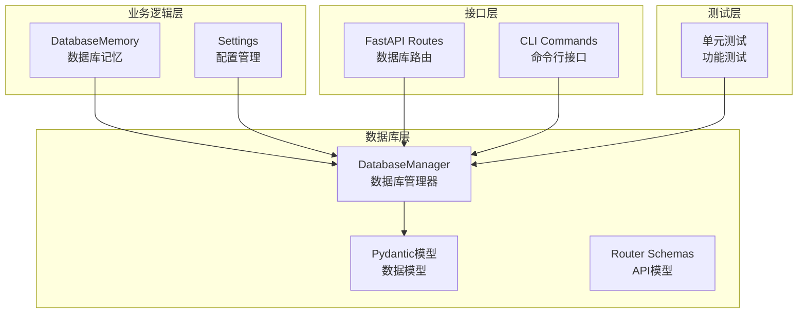
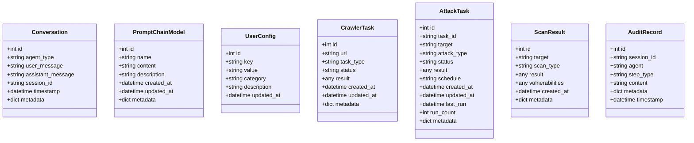
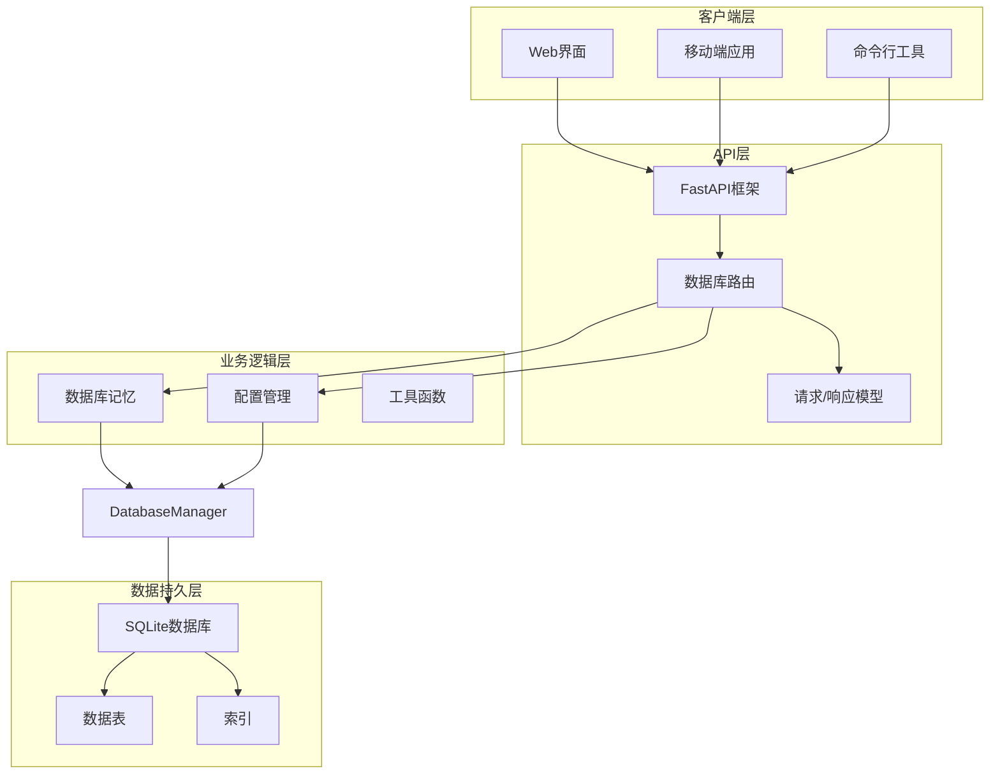
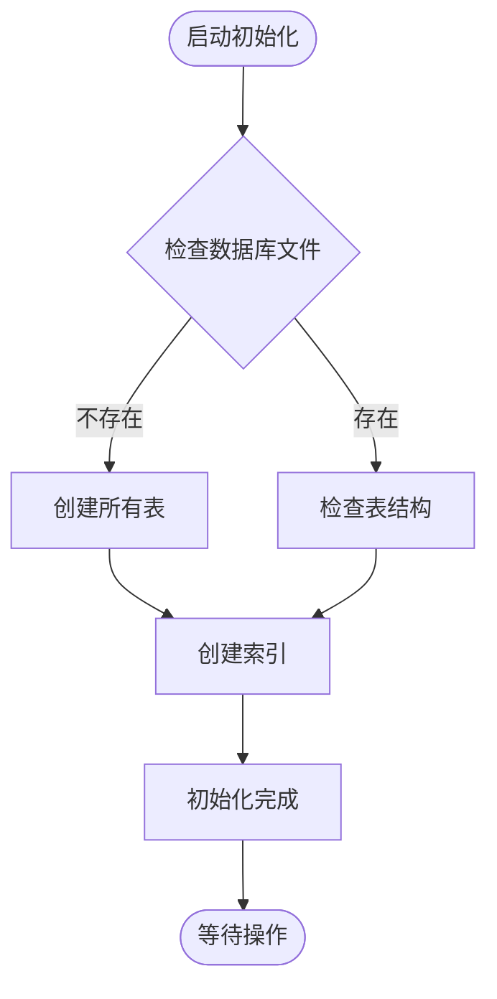
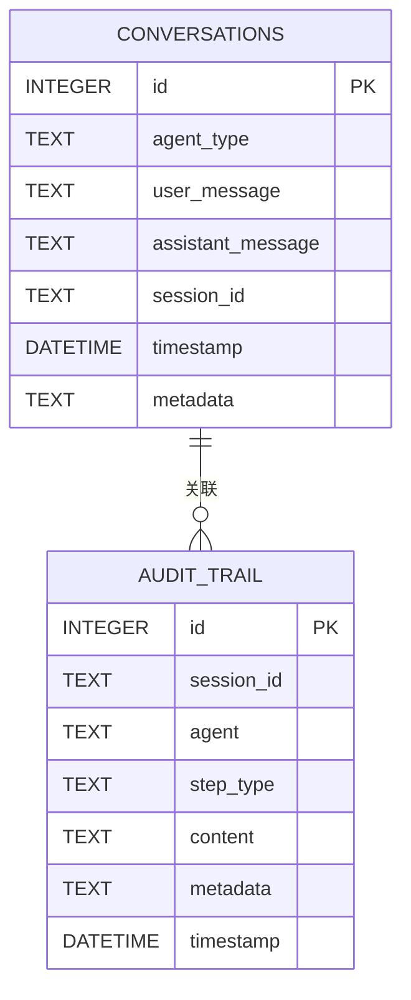
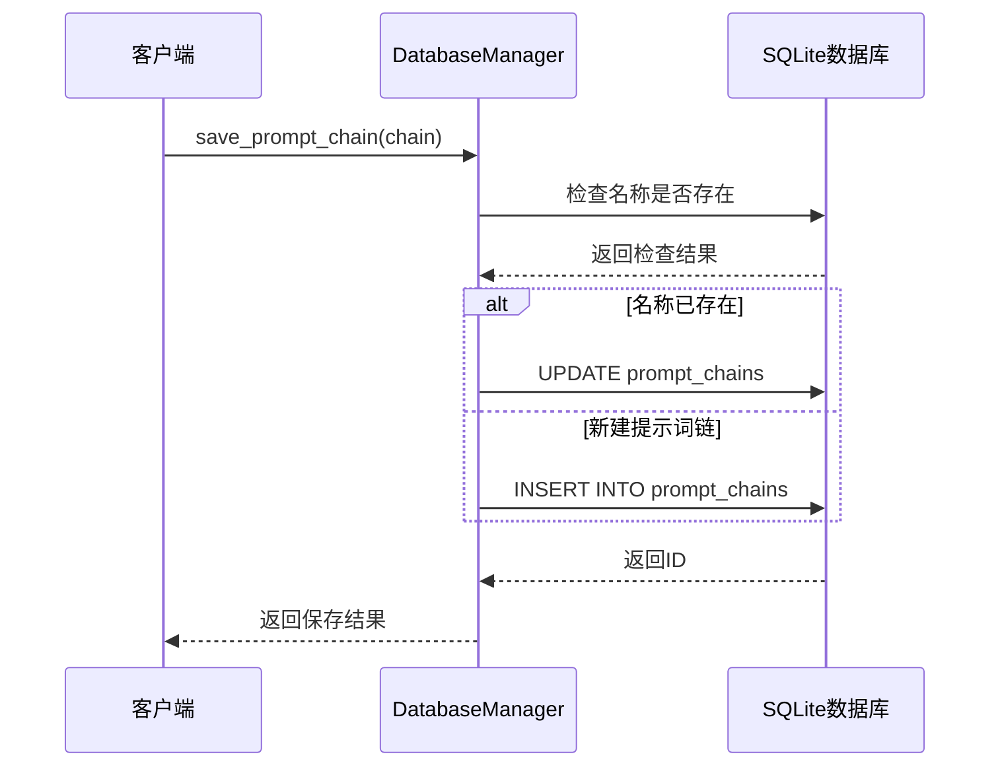
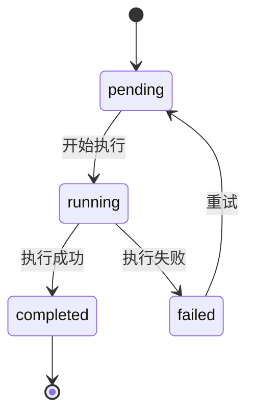
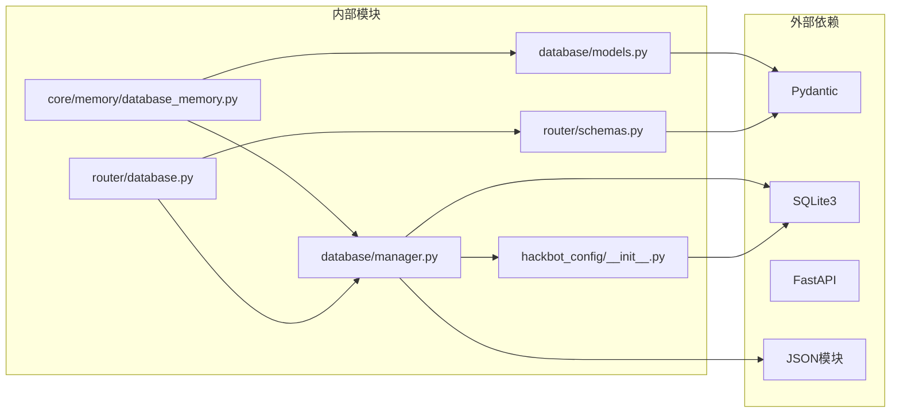
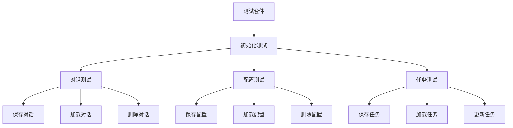

# 数据库模型

<cite>
**本文档引用的文件**
- [database/models.py](file://database/models.py)
- [database/manager.py](file://database/manager.py)
- [core/models.py](file://core/models.py)
- [router/schemas.py](file://router/schemas.py)
- [docs/DATABASE_GUIDE.md](file://docs/DATABASE_GUIDE.md)
- [hackbot_config/__init__.py](file://hackbot_config/__init__.py)
- [core/memory/database_memory.py](file://core/memory/database_memory.py)
- [router/database.py](file://router/database.py)
- [tests/database/test_manager.py](file://tests/database/test_manager.py)
</cite>

## 目录
1. [简介](#简介)
2. [项目结构](#项目结构)
3. [核心组件](#核心组件)
4. [架构概览](#架构概览)
5. [详细组件分析](#详细组件分析)
6. [依赖关系分析](#依赖关系分析)
7. [性能考虑](#性能考虑)
8. [故障排除指南](#故障排除指南)
9. [结论](#结论)

## 简介

Secbot项目采用SQLite作为轻量级数据库，用于持久化存储安全测试过程中的关键数据。该项目实现了完整的数据库模型体系，包括对话历史、提示词链、用户配置、爬虫任务等核心数据结构，并提供了完整的CRUD操作接口。

数据库设计遵循以下原则：
- 使用Pydantic模型确保数据验证和序列化
- 采用SQLite作为单一文件数据库，便于部署和维护
- 实现完整的索引策略以优化查询性能
- 提供RESTful API接口和CLI命令行工具

## 项目结构

**图表来源**
- [database/manager.py](file://database/manager.py#L26-L74)
- [database/models.py](file://database/models.py#L9-L90)
- [router/database.py](file://router/database.py#L1-L91)

**章节来源**
- [database/manager.py](file://database/manager.py#L1-L719)
- [database/models.py](file://database/models.py#L1-L90)
- [router/database.py](file://router/database.py#L1-L91)

## 核心组件

### 数据模型架构

项目实现了七种核心数据模型，每种模型都对应一个独立的数据库表：

**图表来源**
- [database/models.py](file://database/models.py#L9-L90)

### 数据库管理器

DatabaseManager是数据库操作的核心类，负责：
- 数据库连接管理和事务处理
- 表结构初始化和索引创建
- CRUD操作的实现
- 统计信息查询

**章节来源**
- [database/manager.py](file://database/manager.py#L26-L74)
- [database/manager.py](file://database/manager.py#L75-L203)

## 架构概览

**图表来源**
- [router/database.py](file://router/database.py#L1-L91)
- [core/memory/database_memory.py](file://core/memory/database_memory.py#L1-L38)
- [hackbot_config/__init__.py](file://hackbot_config/__init__.py#L35-L120)

## 详细组件分析

### 数据库管理器详解

DatabaseManager类提供了完整的数据库操作能力：

#### 连接管理
- 使用上下文管理器确保连接正确关闭
- 支持事务自动提交和回滚
- 提供连接池级别的错误处理

#### 表初始化流程

**图表来源**
- [database/manager.py](file://database/manager.py#L75-L203)

#### 查询优化策略
- 为常用查询字段创建索引
- 支持条件查询和分页
- 提供统计信息聚合查询

**章节来源**
- [database/manager.py](file://database/manager.py#L176-L203)

### 对话历史管理系统

对话历史是Secbot的核心功能之一，实现了完整的对话生命周期管理：

#### 存储结构

**图表来源**
- [database/manager.py](file://database/manager.py#L82-L174)

#### 查询接口
- 支持按智能体类型过滤
- 支持按会话ID过滤
- 支持时间范围查询
- 支持分页和排序

**章节来源**
- [database/manager.py](file://database/manager.py#L230-L278)

### 提示词链管理系统

提示词链是Secbot的重要功能特性，支持复杂的提示词模板管理：

#### 数据结构设计
- 唯一性约束确保名称不重复
- JSON格式存储复杂的数据结构
- 支持元数据扩展

#### 操作流程

**图表来源**
- [database/manager.py](file://database/manager.py#L310-L352)

**章节来源**
- [database/manager.py](file://database/manager.py#L309-L411)

### 用户配置管理系统

用户配置系统支持多种类型的配置项管理：

#### 配置分类
- API密钥管理
- 模型配置
- 系统设置
- 个人偏好

#### 存储策略
- 使用UPSER算法避免重复
- 支持分类组织
- 实时更新时间戳

**章节来源**
- [database/manager.py](file://database/manager.py#L414-L513)

### 爬虫任务管理系统

爬虫任务系统支持异步任务队列管理：

#### 任务状态流转

**图表来源**
- [database/models.py](file://database/models.py#L41-L51)

#### 结果存储
- JSON格式存储复杂结果结构
- 支持元数据扩展
- 时间戳自动管理

**章节来源**
- [database/manager.py](file://database/manager.py#L517-L616)

### 审计追踪系统

审计系统提供完整的操作留痕功能：

#### 审计类型
- 思考过程记录
- 执行动作跟踪
- 观察结果保存
- 确认和拒绝操作
- 最终结果记录

#### 数据完整性
- 会话ID关联确保数据一致性
- 时间戳保证顺序性
- 元数据支持扩展分析

**章节来源**
- [database/manager.py](file://database/manager.py#L620-L683)

## 依赖关系分析

**图表来源**
- [database/models.py](file://database/models.py#L1-L10)
- [database/manager.py](file://database/manager.py#L1-L25)
- [core/memory/database_memory.py](file://core/memory/database_memory.py#L1-L12)

### 关键依赖关系

1. **数据验证依赖**：所有模型依赖Pydantic进行数据验证
2. **数据库连接依赖**：DatabaseManager依赖SQLite3进行数据库操作
3. **配置管理依赖**：配置系统依赖hackbot_config模块
4. **API接口依赖**：路由层依赖Pydantic模型进行请求/响应验证

**章节来源**
- [database/manager.py](file://database/manager.py#L13-L23)
- [core/memory/database_memory.py](file://core/memory/database_memory.py#L8-L11)

## 性能考虑

### 索引优化策略

数据库系统实现了以下索引策略：

| 表名 | 索引字段 | 查询场景 | 性能收益 |
|------|----------|----------|----------|
| conversations | session_id | 会话查询 | O(log n) |
| conversations | timestamp | 时间排序 | O(log n) |
| crawler_tasks | status | 状态筛选 | O(log n) |
| user_configs | key | 键值查询 | O(log n) |
| attack_tasks | status | 任务状态查询 | O(log n) |
| scan_results | target | 目标查询 | O(log n) |
| audit_trail | session_id | 审计查询 | O(log n) |
| audit_trail | timestamp | 时间排序 | O(log n) |

### 查询优化建议

1. **批量操作**：大量数据操作时使用事务包装
2. **分页查询**：对大数据集使用LIMIT和OFFSET
3. **索引利用**：确保WHERE条件字段有适当索引
4. **JSON查询**：对于频繁查询的JSON字段考虑规范化

### 存储优化策略

1. **数据压缩**：对大文本字段考虑压缩存储
2. **归档机制**：实现历史数据归档策略
3. **清理策略**：定期清理过期数据
4. **备份策略**：实现增量备份机制

## 故障排除指南

### 常见问题诊断

#### 数据库连接问题
- 检查DATABASE_URL环境变量配置
- 验证数据库文件权限
- 确认SQLite3库版本兼容性

#### 数据验证错误
- 检查Pydantic模型字段类型
- 验证JSON数据格式
- 确认必填字段完整性

#### 性能问题
- 分析慢查询日志
- 检查索引使用情况
- 优化查询条件

### 调试工具

#### 单元测试
项目提供了完整的单元测试覆盖：

**图表来源**
- [tests/database/test_manager.py](file://tests/database/test_manager.py#L10-L58)

**章节来源**
- [tests/database/test_manager.py](file://tests/database/test_manager.py#L1-L58)

### 错误处理机制

数据库操作实现了完善的错误处理：
- 连接异常捕获和重试
- 事务自动回滚
- 详细错误日志记录
- 友好的错误信息反馈

## 结论

Secbot项目的数据库模型设计体现了以下特点：

### 设计优势
1. **模块化设计**：清晰的职责分离和接口定义
2. **数据完整性**：严格的类型验证和约束检查
3. **性能优化**：合理的索引策略和查询优化
4. **可扩展性**：灵活的模型设计支持功能扩展
5. **易维护性**：完整的测试覆盖和文档支持

### 技术亮点
- 使用Pydantic实现强类型数据模型
- SQLite单文件数据库简化部署
- 完整的CRUD操作接口
- RESTful API设计规范
- 丰富的查询和统计功能

### 改进建议
1. **监控指标**：增加数据库性能监控
2. **备份策略**：实现自动备份机制
3. **迁移工具**：提供数据库结构升级工具
4. **缓存机制**：对热点数据实现缓存优化

该项目的数据库模型为Secbot的安全测试功能提供了坚实的数据基础，支持从简单的对话记录到复杂的渗透测试任务的全方位数据管理需求。