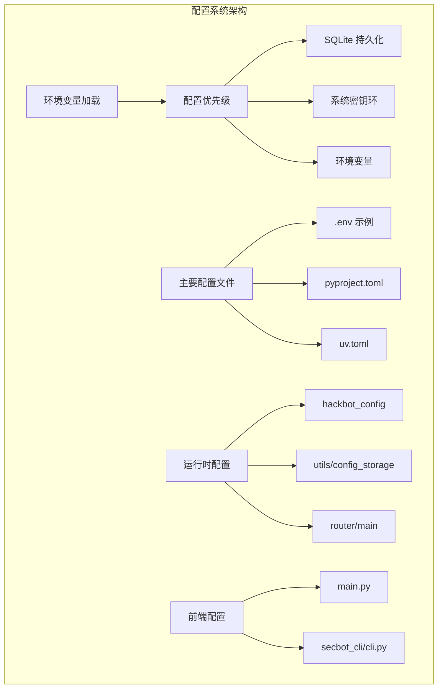
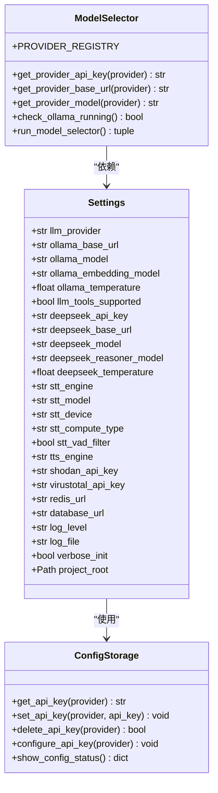
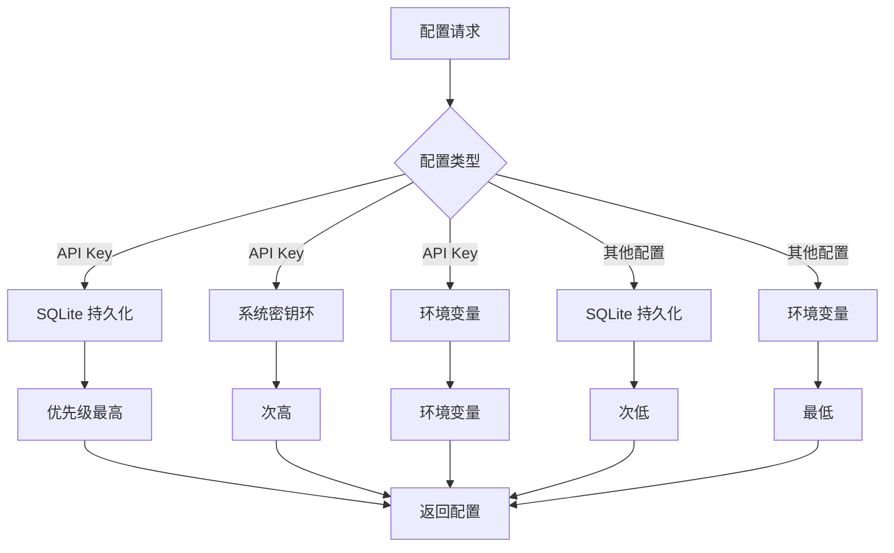
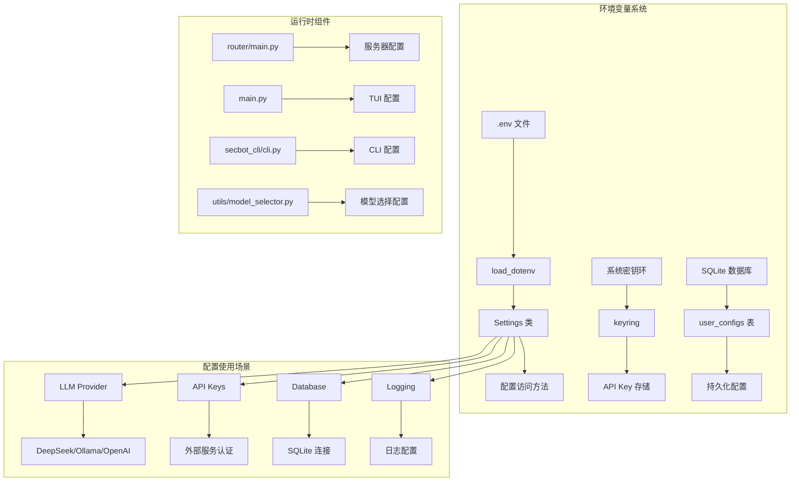
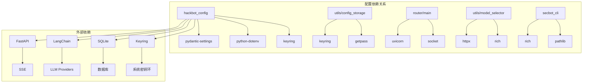
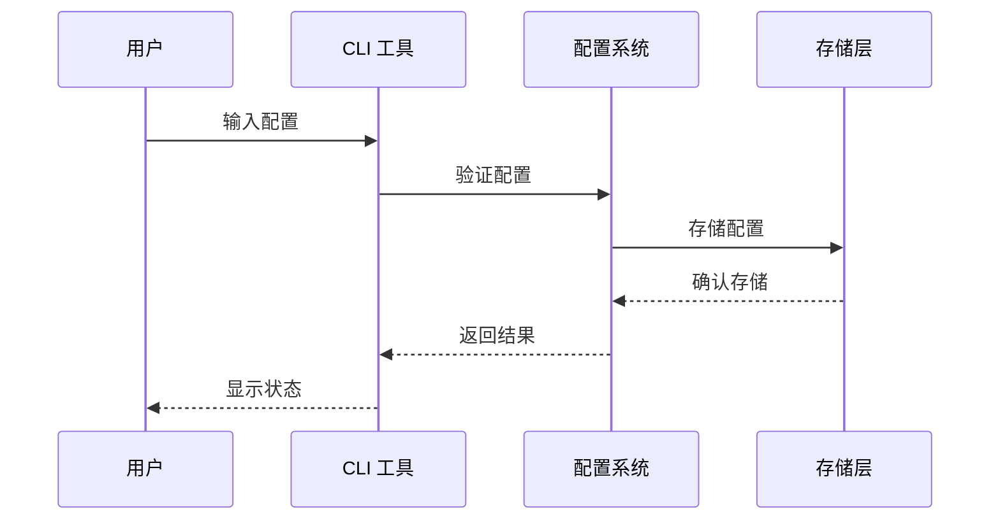

# 环境变量

<cite>
**本文档引用的文件**
- [README.md](file://README.md)
- [pyproject.toml](file://pyproject.toml)
- [uv.toml](file://uv.toml)
- [hackbot_config/__init__.py](file://hackbot_config/__init__.py)
- [utils/config_storage.py](file://utils/config_storage.py)
- [router/main.py](file://router/main.py)
- [main.py](file://main.py)
- [secbot_cli/cli.py](file://secbot_cli/cli.py)
- [utils/model_selector.py](file://utils/model_selector.py)
</cite>

## 目录
1. [简介](#简介)
2. [项目结构](#项目结构)
3. [核心组件](#核心组件)
4. [架构概览](#架构概览)
5. [详细组件分析](#详细组件分析)
6. [依赖关系分析](#依赖关系分析)
7. [性能考虑](#性能考虑)
8. [故障排除指南](#故障排除指南)
9. [结论](#结论)

## 简介

本文档全面介绍了 Secbot 项目中的环境变量配置系统。Secbot 是一个基于 AI 的自动化渗透测试智能体，支持多种 LLM 提供商和本地推理选项。环境变量配置系统是整个应用的核心基础设施，负责管理 API 密钥、数据库连接、日志配置、服务器设置等多个方面。

该项目采用了多层次的配置策略，结合了环境变量、SQLite 持久化配置、系统密钥环存储等多种机制，为不同使用场景提供了灵活的配置选项。

## 项目结构

**图表来源**
- [hackbot_config/__init__.py:17-22](file://hackbot_config/__init__.py#L17-L22)
- [pyproject.toml:166-168](file://pyproject.toml#L166-L168)
- [router/main.py:79-100](file://router/main.py#L79-L100)

**章节来源**
- [README.md:289-318](file://README.md#L289-L318)
- [pyproject.toml:166-168](file://pyproject.toml#L166-L168)

## 核心组件

### 配置管理核心

配置管理系统的核心是 `hackbot_config` 包，它提供了统一的配置访问接口：

**图表来源**
- [hackbot_config/__init__.py:183-271](file://hackbot_config/__init__.py#L183-L271)
- [utils/config_storage.py:12-61](file://utils/config_storage.py#L12-L61)
- [utils/model_selector.py:29-289](file://utils/model_selector.py#L29-L289)

### 配置优先级策略

系统实现了多层配置优先级机制：

**图表来源**
- [hackbot_config/__init__.py:128-160](file://hackbot_config/__init__.py#L128-L160)
- [hackbot_config/__init__.py:234-247](file://hackbot_config/__init__.py#L234-L247)

**章节来源**
- [hackbot_config/__init__.py:128-160](file://hackbot_config/__init__.py#L128-L160)
- [utils/config_storage.py:12-61](file://utils/config_storage.py#L12-L61)

## 架构概览

**图表来源**
- [router/main.py:79-100](file://router/main.py#L79-L100)
- [main.py:8-14](file://main.py#L8-L14)
- [secbot_cli/cli.py:74-95](file://secbot_cli/cli.py#L74-L95)

## 详细组件分析

### LLM 提供商配置

系统支持多种 LLM 提供商，每种都有特定的配置要求：

#### DeepSeek 配置
- `DEEPSEEK_API_KEY`: DeepSeek API 密钥
- `DEEPSEEK_BASE_URL`: DeepSeek API 基础 URL
- `DEEPSEEK_MODEL`: 默认模型名称
- `DEEPSEEK_REASONER_MODEL`: 推理模型
- `DEEPSEEK_TEMPERATURE`: 生成温度参数

#### Ollama 配置
- `OLLAMA_BASE_URL`: Ollama 服务地址
- `OLLAMA_MODEL`: 默认本地模型
- `OLLAMA_EMBEDDING_MODEL`: 嵌入模型
- `OLLAMA_TEMPERATURE`: 生成温度
- `LLM_TOOLS_SUPPORTED`: 是否支持工具调用

#### 通用配置
- `LLM_PROVIDER`: 当前推理后端提供商
- `DATABASE_URL`: 数据库连接字符串
- `REDIS_URL`: Redis 连接字符串（可选）

**章节来源**
- [hackbot_config/__init__.py:183-271](file://hackbot_config/__init__.py#L183-L271)

### 语音配置

系统支持语音输入输出功能：

#### 语音识别 (STT) 配置
- `STT_ENGINE`: STT 引擎类型（默认: fast_whisper）
- `STT_MODEL`: STT 模型名称（默认: base）
- `STT_DEVICE`: 推理设备（默认: cpu）
- `STT_COMPUTE_TYPE`: 计算精度（默认: int8）
- `STT_VAD_FILTER`: 语音活动检测过滤器

#### 语音合成 (TTS) 配置
- `TTS_ENGINE`: TTS 引擎类型（默认: gtts）

**章节来源**
- [hackbot_config/__init__.py:219-232](file://hackbot_config/__init__.py#L219-L232)

### 外部 API 配置

系统集成了多个外部服务：

#### Shodan 配置
- `SHODAN_API_KEY`: Shodan API 密钥（存储在系统密钥环中）

#### VirusTotal 配置
- `VIRUSTOTAL_API_KEY`: VirusTotal API 密钥（存储在系统密钥环中）

**章节来源**
- [hackbot_config/__init__.py:234-247](file://hackbot_config/__init__.py#L234-L247)

### 日志和调试配置

#### 日志配置
- `LOG_LEVEL`: 日志级别（默认: INFO）
- `LOG_FILE`: 日志文件路径（默认: logs/agent.log）
- `VERBOSE_INIT`: 详细初始化输出开关

#### 调试配置
- `PYTHONDONTWRITEBYTECODE`: 禁用字节码文件生成
- `VERBOSE_INIT`: 详细初始化输出

**章节来源**
- [hackbot_config/__init__.py:252-259](file://hackbot_config/__init__.py#L252-L259)
- [main.py:13-14](file://main.py#L13-L14)

### 服务器配置

后端服务器支持多种配置选项：

#### 服务器运行时配置
- `SECBOT_DESKTOP`: 桌面嵌入模式开关
- `SECBOT_SERVER_HOST`: 服务器监听地址
- `SECBOT_SERVER_PORT`: 服务器端口号
- `SECBOT_SERVER_RELOAD`: 热重载开关

#### 默认值策略
- 桌面模式: `host=127.0.0.1`, `reload=false`
- 普通模式: `host=0.0.0.0`, `reload=true`
- 端口: 默认 8000

**章节来源**
- [router/main.py:79-100](file://router/main.py#L79-L100)

### 包管理配置

#### PyPI 源配置
- `index-url`: PyPI 镜像源地址
- `override-dependencies`: 依赖版本覆盖

**章节来源**
- [uv.toml:1-7](file://uv.toml#L1-L7)

## 依赖关系分析

**图表来源**
- [pyproject.toml:29-69](file://pyproject.toml#L29-L69)
- [hackbot_config/__init__.py:8-15](file://hackbot_config/__init__.py#L8-L15)
- [utils/config_storage.py:5-6](file://utils/config_storage.py#L5-L6)

**章节来源**
- [pyproject.toml:29-69](file://pyproject.toml#L29-L69)
- [hackbot_config/__init__.py:8-15](file://hackbot_config/__init__.py#L8-L15)

## 性能考虑

### 配置加载优化

系统采用了智能的配置加载策略：

1. **延迟加载**: 配置在首次访问时才加载，避免启动时的性能开销
2. **缓存机制**: 配置值在内存中缓存，减少重复查询
3. **优先级优化**: 优先使用高性能的 SQLite 存储，必要时才访问系统密钥环

### 环境变量处理

- **批量加载**: 使用 `load_dotenv()` 一次性加载所有环境变量
- **路径解析**: 智能解析相对路径，确保配置的一致性
- **类型转换**: 自动进行类型转换，减少运行时错误

## 故障排除指南

### 常见配置问题

#### API 密钥问题
1. **检查密钥存储**: 确认密钥已正确存储在 SQLite 或系统密钥环中
2. **验证权限**: 确保应用程序有权限访问系统密钥环
3. **测试连接**: 使用模型选择器测试 API 连接

#### 数据库连接问题
1. **检查路径**: 验证 `DATABASE_URL` 指向正确的数据库文件
2. **权限检查**: 确保应用程序有读写权限
3. **连接池**: 检查数据库连接池配置

#### 服务器启动问题
1. **端口冲突**: 检查 `SECBOT_SERVER_PORT` 是否被占用
2. **网络配置**: 验证防火墙和网络设置
3. **权限问题**: 确保有足够的系统权限

**章节来源**
- [utils/model_selector.py:492-511](file://utils/model_selector.py#L492-L511)
- [router/main.py:101-109](file://router/main.py#L101-L109)

### 配置验证

系统提供了多种配置验证机制：

**图表来源**
- [utils/config_storage.py:31-61](file://utils/config_storage.py#L31-L61)
- [utils/model_selector.py:403-446](file://utils/model_selector.py#L403-L446)

## 结论

Secbot 项目的环境变量配置系统展现了现代 Python 应用的最佳实践。通过多层次的配置策略、智能的优先级管理和完善的错误处理机制，系统为不同使用场景提供了灵活而可靠的配置解决方案。

关键优势包括：
- **灵活性**: 支持多种配置来源和优先级
- **安全性**: 敏感信息存储在系统密钥环中
- **可维护性**: 统一的配置接口和清晰的文档
- **可靠性**: 完善的错误处理和故障排除机制

这套配置系统为 Secbot 的稳定运行和扩展提供了坚实的基础，也为开发者提供了良好的开发体验。