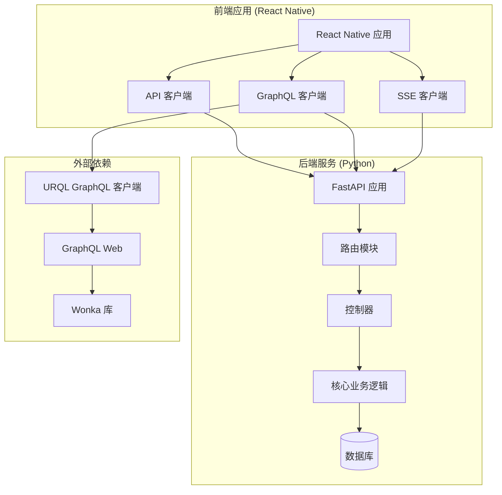
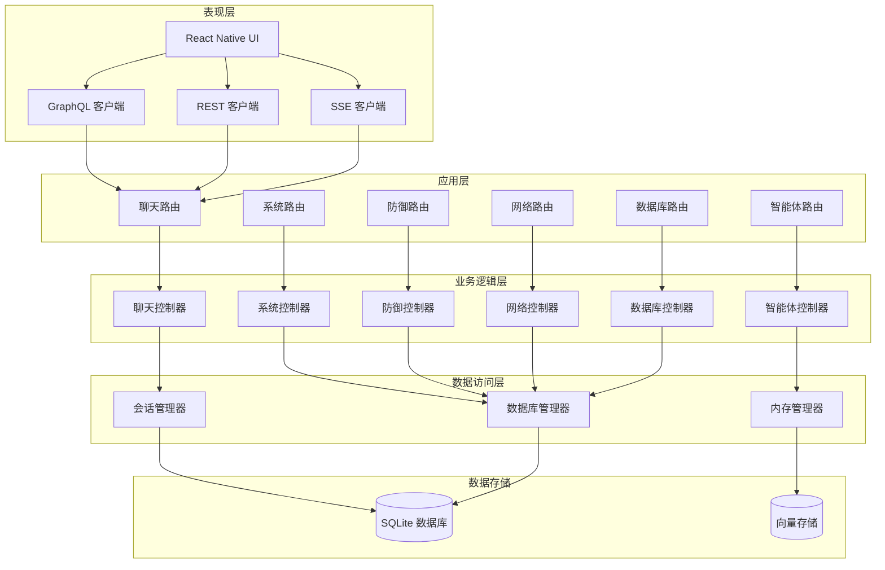
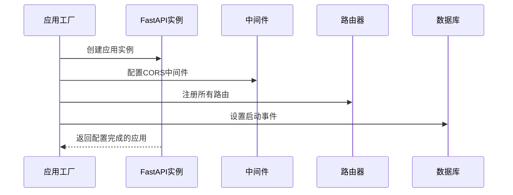
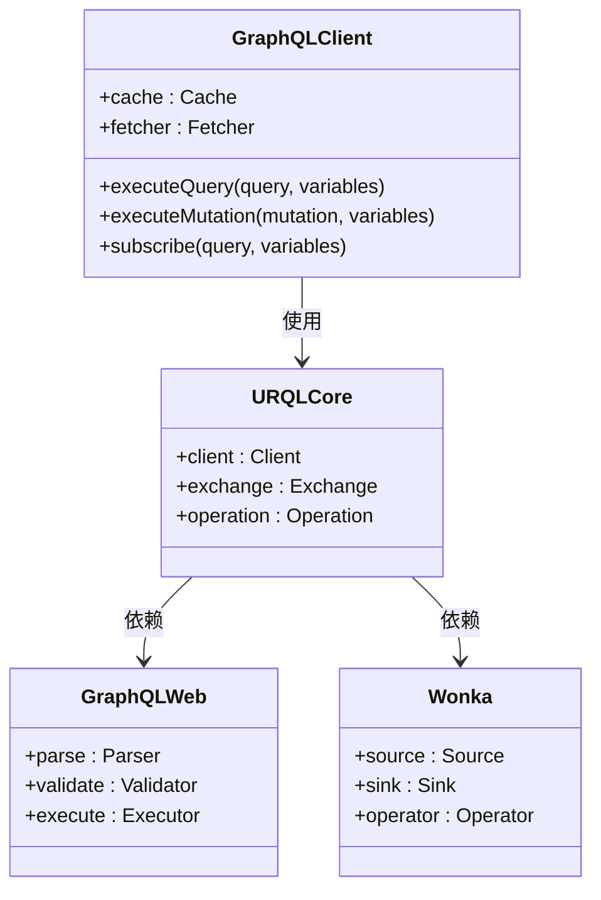
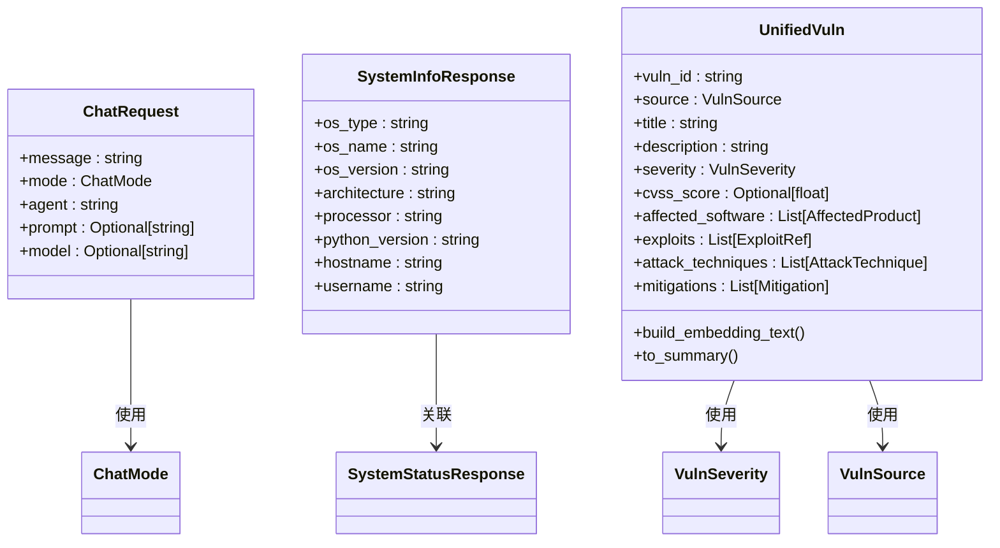
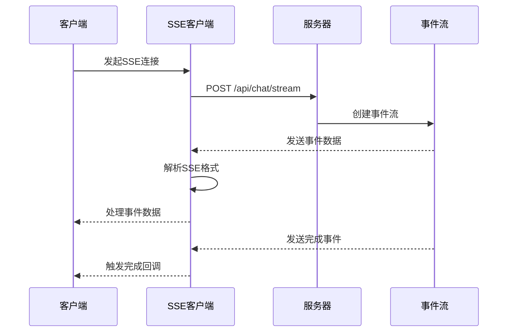
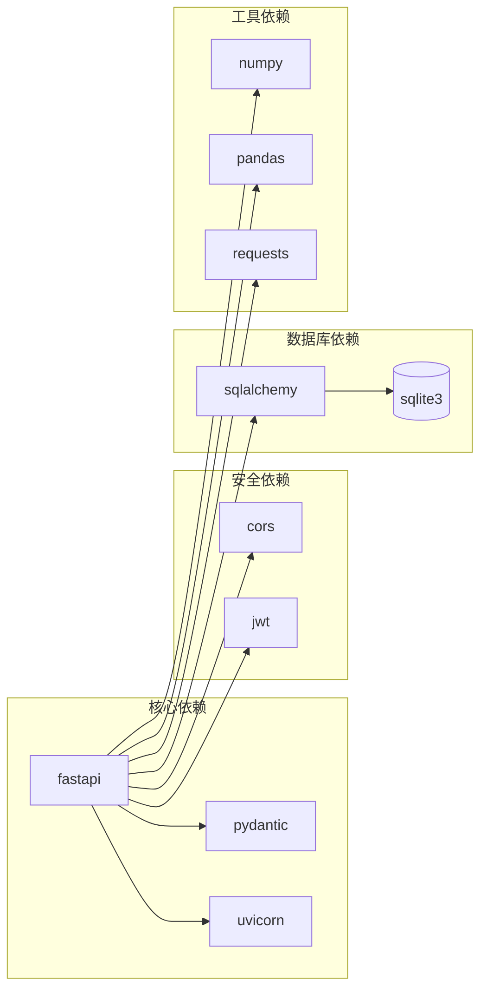

# GraphQL API实现

<cite>
**本文档引用的文件**
- [router/main.py](file://router/main.py)
- [router/schemas.py](file://router/schemas.py)
- [app/src/api/client.ts](file://app/src/api/client.ts)
- [app/src/api/config.ts](file://app/src/api/config.ts)
- [app/src/api/endpoints.ts](file://app/src/api/endpoints.ts)
- [app/src/api/sse.ts](file://app/src/api/sse.ts)
- [core/vuln_db/schema.py](file://core/vuln_db/schema.py)
- [app/package-lock.json](file://app/package-lock.json)
</cite>

## 目录
1. [简介](#简介)
2. [项目结构](#项目结构)
3. [核心组件](#核心组件)
4. [架构概览](#架构概览)
5. [详细组件分析](#详细组件分析)
6. [依赖关系分析](#依赖关系分析)
7. [性能考虑](#性能考虑)
8. [故障排除指南](#故障排除指南)
9. [结论](#结论)

## 简介

本文档详细分析了SecBot项目中的GraphQL API实现。SecBot是一个基于Python和React Native的AI安全测试机器人，该项目实现了完整的后端REST API服务，同时在前端应用中集成了GraphQL客户端功能。

该项目的核心特点包括：
- 基于FastAPI的REST API服务
- React Native前端应用的GraphQL客户端
- 实时通信支持（SSE）
- 安全测试和防御功能
- 漏洞数据库管理

## 项目结构

SecBot项目采用模块化架构设计，主要分为以下几个核心部分：



**图表来源**
- [router/main.py:19-67](file://router/main.py#L19-L67)
- [app/package-lock.json:3124-3146](file://app/package-lock.json#L3124-L3146)

**章节来源**
- [router/main.py:1-101](file://router/main.py#L1-L101)
- [app/package-lock.json:1-3150](file://app/package-lock.json#L1-L3150)

## 核心组件

### 后端API架构

后端采用FastAPI框架构建，提供了RESTful API接口，支持以下主要功能模块：

1. **聊天机器人接口** - 支持同步和异步对话
2. **智能体管理** - 智能体列表和内存清理
3. **系统信息** - 系统状态和配置查询
4. **安全防护** - 防御扫描和状态监控
5. **网络安全** - 网络发现和主机授权
6. **数据库管理** - 会话历史和统计信息

### 前端GraphQL集成

前端应用集成了URQL GraphQL客户端，通过以下方式实现：

- 使用@0no-co/graphql.web包提供GraphQL运行时支持
- 通过@urql/core进行GraphQL查询管理
- 集成wonka库处理响应式数据流

**章节来源**
- [router/schemas.py:1-311](file://router/schemas.py#L1-L311)
- [app/package-lock.json:29-42](file://app/package-lock.json#L29-L42)

## 架构概览

SecBot采用了分层架构设计，确保了良好的可维护性和扩展性：



**图表来源**
- [router/main.py:8-16](file://router/main.py#L8-L16)
- [router/schemas.py:18-311](file://router/schemas.py#L18-L311)

## 详细组件分析

### FastAPI应用工厂

应用工厂模式创建了中心化的FastAPI实例，负责配置中间件、注册路由和启动事件处理：



**图表来源**
- [router/main.py:19-67](file://router/main.py#L19-L67)

### GraphQL客户端架构

前端应用集成了完整的GraphQL客户端栈，支持现代Web开发需求：



**图表来源**
- [app/package-lock.json:3124-3146](file://app/package-lock.json#L3124-L3146)

### API端点设计

系统提供了丰富的API端点，覆盖了安全测试的各个方面：

| 功能模块 | 端点路径 | 方法 | 描述 |
|---------|----------|------|------|
| 聊天 | `/api/chat/sync` | POST | 同步聊天接口 |
| 智能体 | `/api/agents` | GET | 获取智能体列表 |
| 系统 | `/api/system/info` | GET | 获取系统信息 |
| 防御 | `/api/defense/scan` | POST | 防御扫描 |
| 网络 | `/api/network/discover` | POST | 网络发现 |
| 数据库 | `/api/db/stats` | GET | 数据库统计 |

**章节来源**
- [app/src/api/endpoints.ts:23-111](file://app/src/api/endpoints.ts#L23-L111)

### 数据模型架构

系统使用Pydantic定义了严格的数据模型，确保API数据的一致性和验证：



**图表来源**
- [router/schemas.py:18-89](file://router/schemas.py#L18-L89)
- [core/vuln_db/schema.py:68-132](file://core/vuln_db/schema.py#L68-L132)

**章节来源**
- [router/schemas.py:18-181](file://router/schemas.py#L18-L181)
- [core/vuln_db/schema.py:68-140](file://core/vuln_db/schema.py#L68-L140)

### 实时通信机制

系统支持多种实时通信方式，包括SSE（Server-Sent Events）和WebSocket：



**图表来源**
- [app/src/api/sse.ts:50-163](file://app/src/api/sse.ts#L50-L163)

**章节来源**
- [app/src/api/sse.ts:15-164](file://app/src/api/sse.ts#L15-L164)

## 依赖关系分析

### 后端依赖关系

后端服务依赖关系清晰，遵循单一职责原则：



**图表来源**
- [router/main.py:5-16](file://router/main.py#L5-L16)

### 前端依赖关系

前端应用的GraphQL客户端依赖关系如下：

```mermaid
graph TD
subgraph "GraphQL客户端"
URQL[urql/core]
GraphQLWeb[@0no-co/graphql.web]
Wonka[wonka]
end
subgraph "React Native"
React[react]
RN[react-native]
Expo[expo]
end
subgraph "类型定义"
Typescript[typescript]
ReactTypes[@types/react]
end
URQL --> GraphQLWeb
URQL --> Wonka
React --> URQL
RN --> React
Expo --> RN
Typescript --> ReactTypes
```

**图表来源**
- [app/package-lock.json:3124-3146](file://app/package-lock.json#L3124-L3146)

**章节来源**
- [app/package-lock.json:29-42](file://app/package-lock.json#L29-L42)

## 性能考虑

### API性能优化

系统在设计时考虑了多个性能优化方面：

1. **CORS配置优化** - 开发环境允许所有来源，生产环境应限制特定域名
2. **数据库连接池** - 启动时初始化数据库连接
3. **缓存策略** - 使用向量存储加速漏洞检索
4. **流式处理** - SSE支持大数据量的渐进式传输

### 前端性能优化

前端应用采用了多项性能优化技术：

1. **GraphQL查询优化** - 使用URQL的查询缓存机制
2. **懒加载** - 按需加载组件和数据
3. **内存管理** - 合理的组件生命周期管理
4. **网络优化** - 自适应的重试机制和超时处理

## 故障排除指南

### 常见问题诊断

1. **连接问题**
   - 检查后端是否在0.0.0.0:8000监听
   - 验证防火墙设置和端口占用情况
   - 确认移动设备使用正确的局域网IP

2. **GraphQL查询失败**
   - 检查@0no-co/graphql.web版本兼容性
   - 验证URQL客户端配置
   - 确认网络连接稳定

3. **SSE连接超时**
   - 检查后端健康检查端点
   - 验证CORS配置
   - 确认服务器资源充足

**章节来源**
- [router/main.py:74-97](file://router/main.py#L74-L97)
- [app/src/api/sse.ts:115-119](file://app/src/api/sse.ts#L115-L119)

### 调试建议

1. **启用详细日志**
   - 后端设置DEBUG级别日志
   - 前端启用GraphQL调试模式
   - 使用浏览器开发者工具监控网络请求

2. **性能监控**
   - 监控API响应时间和错误率
   - 跟踪GraphQL查询执行时间
   - 分析SSE连接稳定性

## 结论

SecBot项目的GraphQL API实现展现了现代Web应用开发的最佳实践。通过采用FastAPI构建高性能的后端服务，结合React Native的前端架构，以及URQL GraphQL客户端的集成，该项目成功实现了：

1. **模块化设计** - 清晰的分层架构和职责分离
2. **实时通信** - 支持SSE和GraphQL订阅的双向数据流
3. **类型安全** - 使用Pydantic和TypeScript确保数据完整性
4. **可扩展性** - 灵活的路由系统和插件架构
5. **性能优化** - 多层次的缓存和连接管理策略

该实现为AI安全测试领域提供了一个强大而灵活的技术平台，既满足了当前的功能需求，又为未来的扩展奠定了坚实的基础。