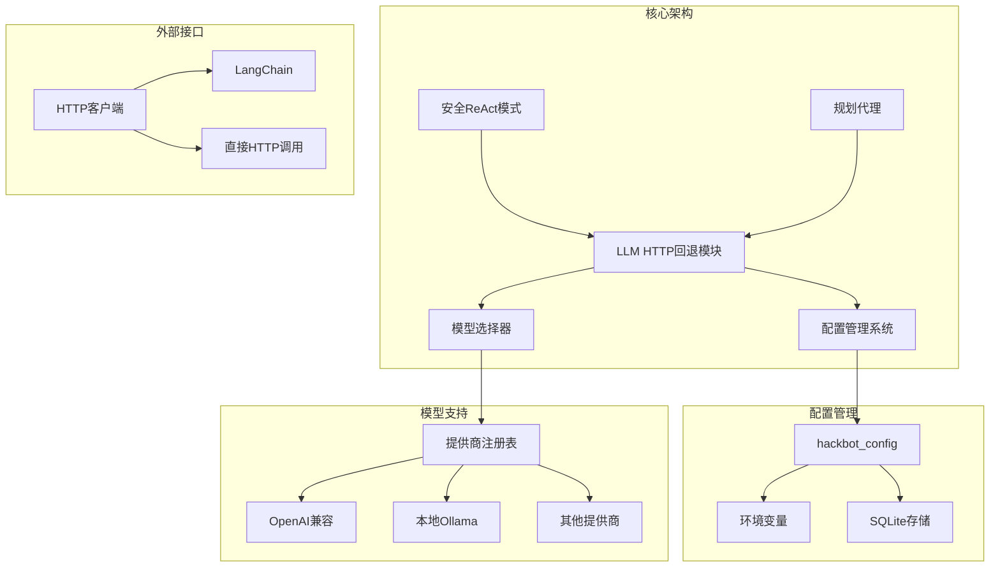
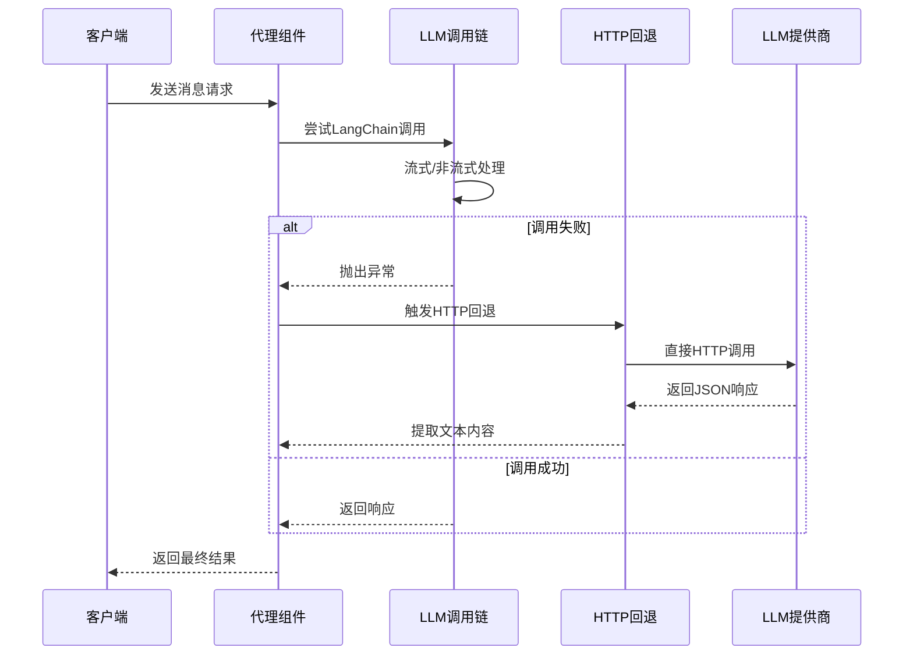
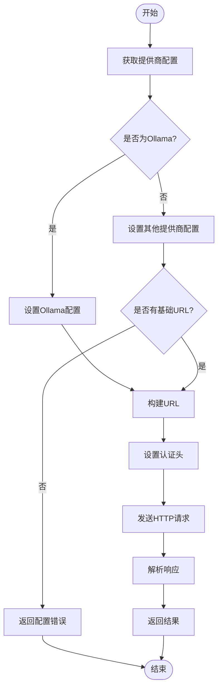
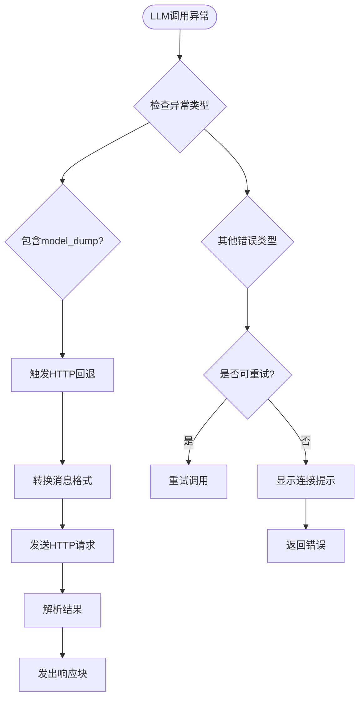
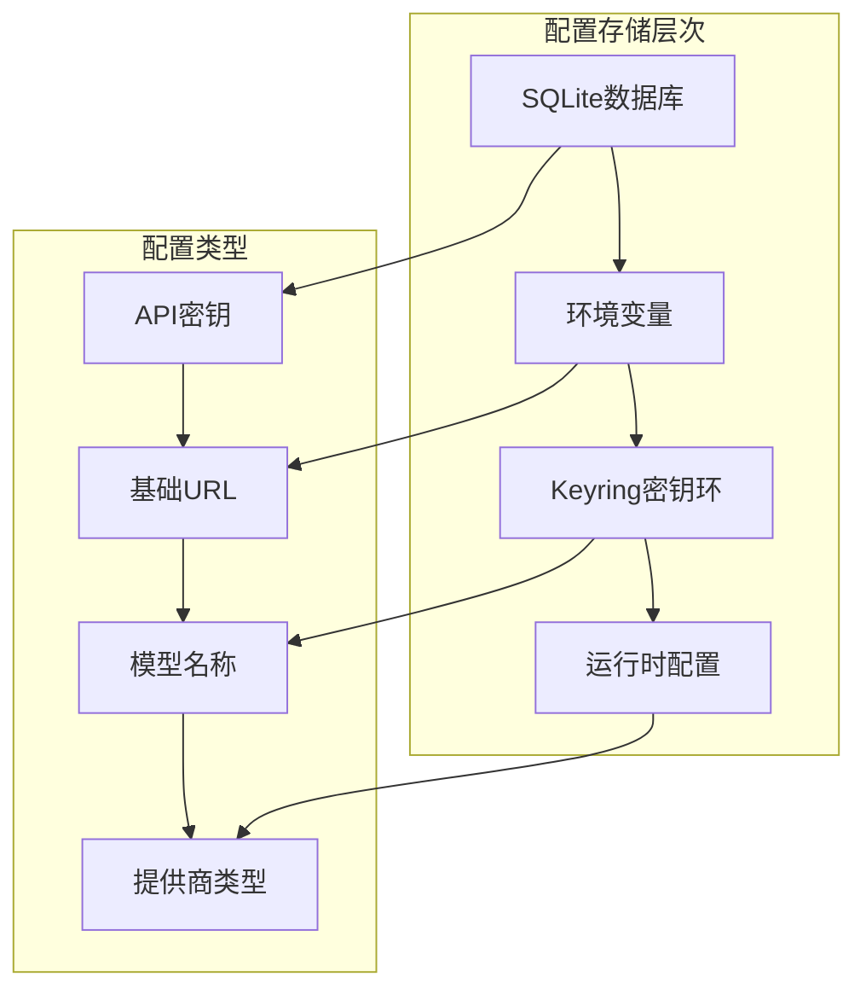
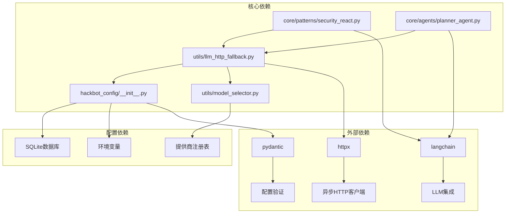

# LLM HTTP回退机制

<cite>
**本文档引用的文件**
- [llm_http_fallback.py](file://utils/llm_http_fallback.py)
- [security_react.py](file://core/patterns/security_react.py)
- [planner_agent.py](file://core/agents/planner_agent.py)
- [model_selector.py](file://utils/model_selector.py)
- [__init__.py](file://hackbot_config/__init__.py)
- [api_client_tool.py](file://tools/web_research/api_client_tool.py)
- [client.ts](file://app/src/api/client.ts)
- [pyproject.toml](file://pyproject.toml)
</cite>

## 目录
1. [简介](#简介)
2. [项目结构](#项目结构)
3. [核心组件](#核心组件)
4. [架构概览](#架构概览)
5. [详细组件分析](#详细组件分析)
6. [依赖关系分析](#依赖关系分析)
7. [性能考虑](#性能考虑)
8. [故障排除指南](#故障排除指南)
9. [结论](#结论)

## 简介

LLM HTTP回退机制是SecBot项目中一个重要的容错设计，旨在解决LangChain流式/非流式调用过程中由于API返回格式问题（如model_dump、无generation chunks）导致的失败情况。该机制通过直接发送HTTP POST请求到OpenAI兼容的/chat/completions端点，绕过LangChain的复杂序列化过程，提供了一种可靠的替代方案。

该机制支持多种LLM提供商，包括Ollama、DeepSeek、OpenAI、Anthropic、Google等，以及任意OpenAI API兼容的中转服务。通过这种设计，系统能够在主调用链路失败时自动切换到HTTP直连模式，确保系统的稳定性和可靠性。

## 项目结构

SecBot项目的整体架构采用模块化设计，LLM HTTP回退机制主要分布在以下几个关键位置：

**图表来源**
- [llm_http_fallback.py:1-108](file://utils/llm_http_fallback.py#L1-L108)
- [security_react.py:420-450](file://core/patterns/security_react.py#L420-L450)
- [model_selector.py:29-289](file://utils/model_selector.py#L29-L289)

**章节来源**
- [llm_http_fallback.py:1-108](file://utils/llm_http_fallback.py#L1-L108)
- [pyproject.toml:29-69](file://pyproject.toml#L29-L69)

## 核心组件

### LLM HTTP回退模块

LLM HTTP回退模块是整个机制的核心实现，提供了直接的HTTP调用能力。其主要功能包括：

- **OpenAI兼容API调用**：支持标准的/chat/completions端点
- **多提供商支持**：适配Ollama、DeepSeek、OpenAI等多种LLM提供商
- **自动配置发现**：从配置系统中获取API密钥、基础URL和模型信息
- **错误处理**：提供详细的错误信息和回退策略

### 配置管理系统

配置管理系统负责管理各种LLM提供商的配置信息，包括API密钥、基础URL、模型名称等。它支持多种配置源：

- **SQLite数据库**：持久化存储用户配置
- **环境变量**：支持传统配置方式
- **Keyring**：安全存储敏感信息

### 模型选择器

模型选择器提供了丰富的LLM提供商支持，目前支持超过30个不同的提供商，包括：

- **国际提供商**：OpenAI、Anthropic、Google、Groq等
- **国内提供商**：DeepSeek、通义千问、智谱、月之暗面等
- **开源本地**：Ollama等本地部署选项

**章节来源**
- [llm_http_fallback.py:11-83](file://utils/llm_http_fallback.py#L11-L83)
- [__init__.py:128-160](file://hackbot_config/__init__.py#L128-L160)
- [model_selector.py:29-289](file://utils/model_selector.py#L29-L289)

## 架构概览

LLM HTTP回退机制的整体架构采用了多层次的设计，确保在不同场景下都能提供可靠的LLM服务：

**图表来源**
- [security_react.py:424-439](file://core/patterns/security_react.py#L424-L439)
- [planner_agent.py:427-436](file://core/agents/planner_agent.py#L427-L436)
- [llm_http_fallback.py:22-82](file://utils/llm_http_fallback.py#L22-L82)

该架构的关键特点包括：

1. **自动检测机制**：系统能够自动检测调用失败的原因
2. **无缝切换**：从LangChain调用无缝切换到HTTP直连
3. **配置透明**：所有配置信息对用户透明，无需手动干预
4. **错误恢复**：提供详细的错误信息帮助诊断问题

## 详细组件分析

### HTTP回退实现

HTTP回退机制的核心实现位于`utils/llm_http_fallback.py`文件中，提供了完整的HTTP调用逻辑：

#### 主要功能特性

1. **动态提供商检测**：根据配置自动选择合适的提供商
2. **URL智能构建**：根据不同提供商的API规范构建正确的URL
3. **认证头处理**：自动处理不同提供商的认证方式
4. **响应解析**：统一解析不同格式的API响应

#### 配置处理流程

**图表来源**
- [llm_http_fallback.py:31-82](file://utils/llm_http_fallback.py#L31-L82)

#### 错误处理机制

HTTP回退模块实现了完善的错误处理机制，包括：

- **配置验证**：检查提供商的基础URL和API密钥
- **网络错误处理**：处理连接超时、拒绝等网络问题
- **API错误处理**：解析不同类型的API错误并提供用户友好的提示
- **回退策略**：在主调用链失败时自动触发HTTP回退

**章节来源**
- [llm_http_fallback.py:11-108](file://utils/llm_http_fallback.py#L11-L108)

### 安全ReAct模式集成

安全ReAct模式是LLM HTTP回退机制的重要集成点，负责在ReAct框架中实现自动回退：

#### 回退触发条件

**图表来源**
- [security_react.py:424-450](file://core/patterns/security_react.py#L424-L450)

#### 消息格式转换

为了兼容HTTP回退机制，系统提供了消息格式转换功能：

- **LangChain消息格式**：支持SystemMessage、HumanMessage、AIMessage
- **OpenAI兼容格式**：转换为{"role": "...", "content": "..."}格式
- **多模态内容处理**：支持文本、图像等多种内容类型

**章节来源**
- [security_react.py:420-452](file://core/patterns/security_react.py#L420-L452)

### 规划代理集成

规划代理是另一个重要的集成点，负责在任务规划过程中提供回退支持：

#### 集成策略

规划代理在以下场景中使用HTTP回退机制：

- **规划LLM调用失败**：当生成结构化JSON计划失败时
- **超时处理**：处理长时间无响应的情况
- **错误恢复**：提供简单的规划回退方案

#### 回退规划策略

当LLM不可用时，规划代理会生成基于关键词匹配的简单规划：

- **端口扫描**：识别网络扫描相关关键词
- **漏洞检测**：识别漏洞相关关键词  
- **系统信息**：识别系统信息相关关键词
- **网页爬取**：识别爬取相关关键词

**章节来源**
- [planner_agent.py:425-438](file://core/agents/planner_agent.py#L425-L438)

### 配置管理系统

配置管理系统为LLM HTTP回退机制提供了强大的配置支持：

#### 配置存储层次

**图表来源**
- [__init__.py:47-121](file://hackbot_config/__init__.py#L47-L121)

#### 配置获取流程

配置系统实现了智能的配置获取流程：

1. **优先级检查**：按照SQLite → 环境变量 → 默认值的顺序检查
2. **类型转换**：自动进行必要的类型转换
3. **缓存机制**：减少重复的配置查询
4. **错误处理**：提供详细的配置错误信息

**章节来源**
- [__init__.py:128-160](file://hackbot_config/__init__.py#L128-L160)

### HTTP客户端工具

HTTP客户端工具为LLM HTTP回退机制提供了底层的HTTP通信支持：

#### 客户端特性

- **异步支持**：使用httpx库提供异步HTTP客户端
- **重试机制**：内置重试逻辑处理临时性网络错误
- **超时控制**：灵活的超时配置
- **错误分类**：详细的错误类型分类

#### 错误处理策略

HTTP客户端工具实现了全面的错误处理策略：

- **连接错误**：处理连接超时、连接拒绝等问题
- **HTTP状态错误**：处理4xx、5xx等HTTP状态码
- **解析错误**：处理JSON解析等格式问题
- **重定向处理**：自动跟随重定向并限制重定向次数

**章节来源**
- [api_client_tool.py:264-467](file://tools/web_research/api_client_tool.py#L264-L467)

## 依赖关系分析

LLM HTTP回退机制涉及多个模块之间的复杂依赖关系：

**图表来源**
- [pyproject.toml:29-69](file://pyproject.toml#L29-L69)
- [llm_http_fallback.py:23-29](file://utils/llm_http_fallback.py#L23-L29)

### 关键依赖关系

1. **配置依赖**：HTTP回退模块依赖配置管理系统获取提供商信息
2. **LLM集成**：通过LangChain集成实现主要的LLM调用
3. **HTTP客户端**：使用httpx库提供底层HTTP通信支持
4. **模型选择**：通过模型选择器确定支持的提供商列表

### 循环依赖避免

系统通过以下方式避免循环依赖：

- **延迟导入**：在函数内部导入依赖模块
- **接口抽象**：通过抽象接口减少直接依赖
- **配置注入**：通过配置参数传递依赖关系

**章节来源**
- [pyproject.toml:29-69](file://pyproject.toml#L29-L69)

## 性能考虑

LLM HTTP回退机制在设计时充分考虑了性能因素：

### 异步处理

- **异步HTTP客户端**：使用httpx的异步特性提高并发性能
- **非阻塞调用**：避免阻塞主线程影响用户体验
- **连接池管理**：合理管理HTTP连接提高复用效率

### 超时配置

- **可配置超时**：支持自定义超时时间适应不同场景
- **分级超时**：根据调用类型设置不同的超时策略
- **优雅降级**：超时后自动触发回退机制

### 缓存策略

- **配置缓存**：缓存提供商配置减少查询开销
- **模型列表缓存**：缓存Ollama模型列表提高响应速度
- **连接复用**：复用HTTP连接减少建立连接的开销

## 故障排除指南

### 常见问题诊断

#### LLM调用失败

**症状**：LLM调用抛出异常，包含"model_dump"关键字

**解决方案**：
1. 检查提供商配置是否正确
2. 验证API密钥有效性
3. 确认网络连接正常
4. 查看日志获取详细错误信息

#### HTTP回退失败

**症状**：HTTP回退机制无法正常工作

**排查步骤**：
1. 验证提供商基础URL配置
2. 检查API密钥权限设置
3. 确认目标服务器可达性
4. 查看HTTP响应状态码

#### 配置问题

**症状**：LLM配置无法正确加载

**解决方法**：
1. 检查SQLite数据库连接
2. 验证环境变量设置
3. 确认Keyring密钥环访问权限
4. 重启应用使配置生效

### 日志分析

系统提供了详细的日志记录机制：

- **错误级别日志**：记录详细的错误信息和堆栈跟踪
- **调试级别日志**：提供调用链路的详细信息
- **性能日志**：记录调用耗时和性能指标

**章节来源**
- [security_react.py:441-450](file://core/patterns/security_react.py#L441-L450)
- [llm_http_fallback.py:81-82](file://utils/llm_http_fallback.py#L81-L82)

## 结论

LLM HTTP回退机制是SecBot项目中一个精心设计的容错系统，它通过以下关键特性确保了系统的稳定性和可靠性：

1. **多层次容错**：从配置验证到HTTP回退的完整保护链
2. **智能切换**：自动检测调用失败原因并触发相应的回退策略
3. **广泛兼容**：支持30+个LLM提供商，满足不同用户需求
4. **透明配置**：通过配置管理系统提供无缝的配置体验
5. **性能优化**：异步处理和缓存策略确保高效运行

该机制不仅提高了系统的稳定性，还为用户提供了更好的使用体验。通过自动化的错误处理和配置管理，用户可以专注于安全任务本身，而不必担心底层技术细节。

未来的发展方向包括进一步优化性能、扩展更多LLM提供商支持，以及增强智能化的故障诊断能力。这些改进将进一步提升SecBot作为AI驱动安全测试助手的价值和实用性。