# LLM提供商支持

<cite>
**本文档引用的文件**
- [LLM_PROVIDERS.md](file://docs/LLM_PROVIDERS.md)
- [model_selector.py](file://utils/model_selector.py)
- [hackbot_config/__init__.py](file://hackbot_config/__init__.py)
- [security_react.py](file://core/patterns/security_react.py)
- [cli.py](file://hackbot/cli.py)
- [system.py](file://router/system.py)
- [ModelConfigDialog.tsx](file://terminal-ui/src/components/ModelConfigDialog.tsx)
- [llm_http_fallback.py](file://utils/llm_http_fallback.py)
- [OLLAMA_SETUP.md](file://docs/OLLAMA_SETUP.md)
</cite>

## 目录
1. [简介](#简介)
2. [项目结构](#项目结构)
3. [核心组件](#核心组件)
4. [架构概览](#架构概览)
5. [详细组件分析](#详细组件分析)
6. [依赖关系分析](#依赖关系分析)
7. [性能考虑](#性能考虑)
8. [故障排除指南](#故障排除指南)
9. [结论](#结论)

## 简介

Secbot是一个开源的自动化安全测试助手，支持多种LLM提供商。本文档详细介绍了Secbot的LLM提供商支持体系，包括支持的厂商、配置方法、切换机制以及相关的技术实现。

## 项目结构

Secbot的LLM提供商支持分布在多个模块中：

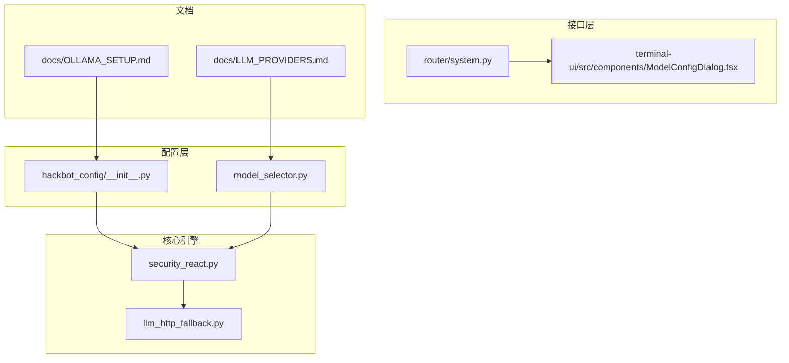

**图表来源**
- [hackbot_config/__init__.py:183-275](file://hackbot_config/__init__.py#L183-L275)
- [model_selector.py:29-289](file://utils/model_selector.py#L29-L289)
- [security_react.py:49-142](file://core/patterns/security_react.py#L49-L142)

## 核心组件

### 厂商注册表

Secbot维护了一个全面的LLM厂商注册表，支持以下类型的提供商：

- **本地提供商**: Ollama
- **国际OpenAI兼容提供商**: Groq、OpenRouter、DeepSeek、OpenAI、Google、Mistral、Cohere、xAI、Azure OpenAI、Together AI、Fireworks AI等
- **国内OpenAI兼容提供商**: 智谱、通义千问、月之暗面、百川、零一万物、中国超算互联网、腾讯混元、字节豆包、讯飞星火、百度文心、阶跃星辰、MiniMax、澜舟、面壁等
- **原生提供商**: Anthropic Claude、Google Gemini

每个厂商配置包含：
- 厂商ID和名称
- 类型标识（ollama、openai_compatible、anthropic、google）
- 默认Base URL
- 默认模型列表
- API Key需求标识
- Base URL需求标识

**章节来源**
- [model_selector.py:29-289](file://utils/model_selector.py#L29-L289)

### 配置管理系统

配置系统采用多层优先级策略：

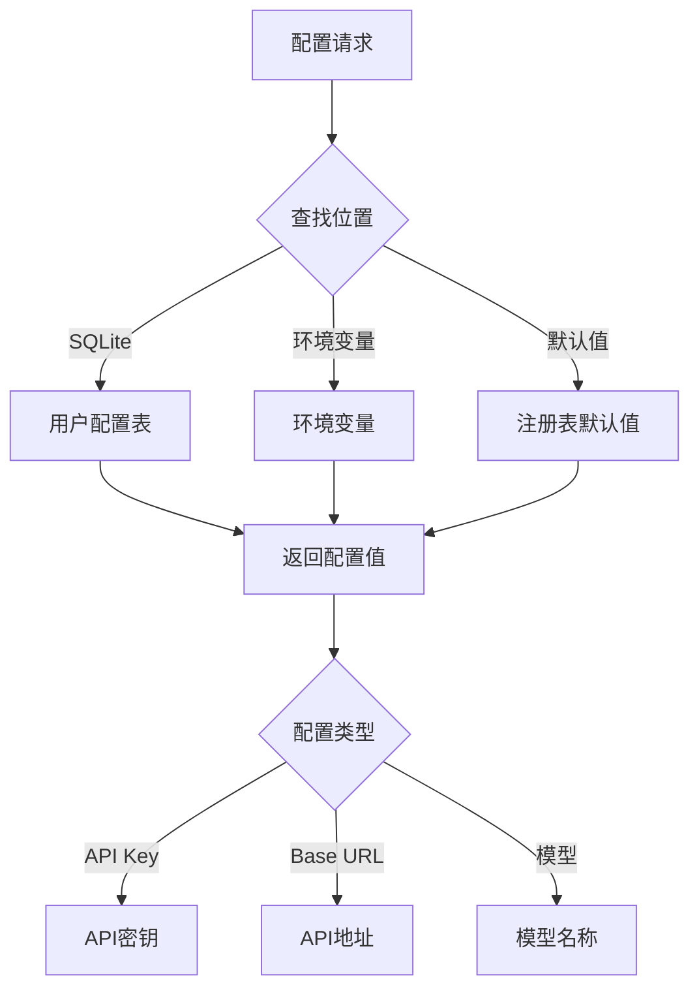

**图表来源**
- [hackbot_config/__init__.py:128-160](file://hackbot_config/__init__.py#L128-L160)

**章节来源**
- [hackbot_config/__init__.py:128-181](file://hackbot_config/__init__.py#L128-L181)

## 架构概览

Secbot的LLM提供商支持采用分层架构设计：

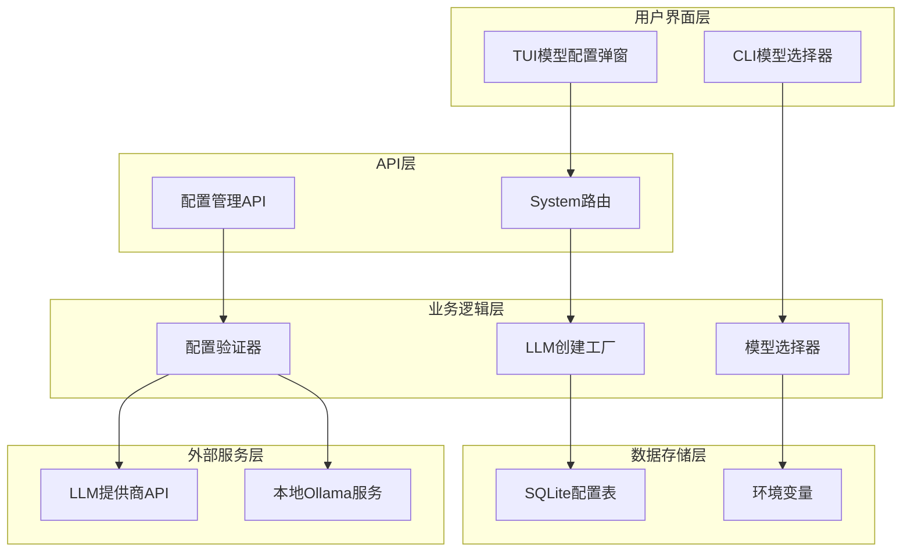

**图表来源**
- [system.py:53-77](file://router/system.py#L53-L77)
- [security_react.py:49-142](file://core/patterns/security_react.py#L49-L142)

## 详细组件分析

### LLM创建工厂

LLM创建工厂负责根据配置动态创建不同提供商的LLM实例：

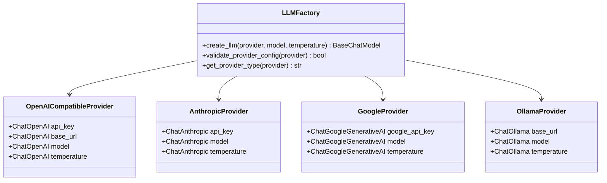

**图表来源**
- [security_react.py:49-142](file://core/patterns/security_react.py#L49-L142)

**章节来源**
- [security_react.py:49-142](file://core/patterns/security_react.py#L49-L142)

### 模型选择器

模型选择器提供交互式的选择界面，支持以下功能：

- 展示所有支持的LLM提供商
- 检查提供商的配置状态
- 选择默认模型
- 配置API Key和Base URL
- 保存配置到SQLite

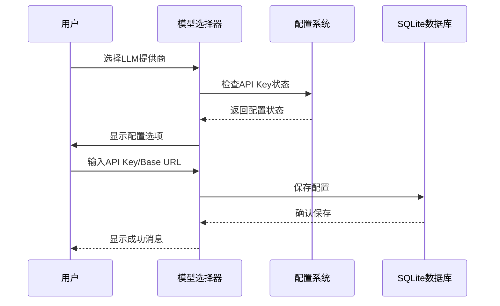

**图表来源**
- [model_selector.py:517-639](file://utils/model_selector.py#L517-L639)

**章节来源**
- [model_selector.py:517-639](file://utils/model_selector.py#L517-L639)

### TUI模型配置弹窗

TUI提供了图形化的模型配置界面：

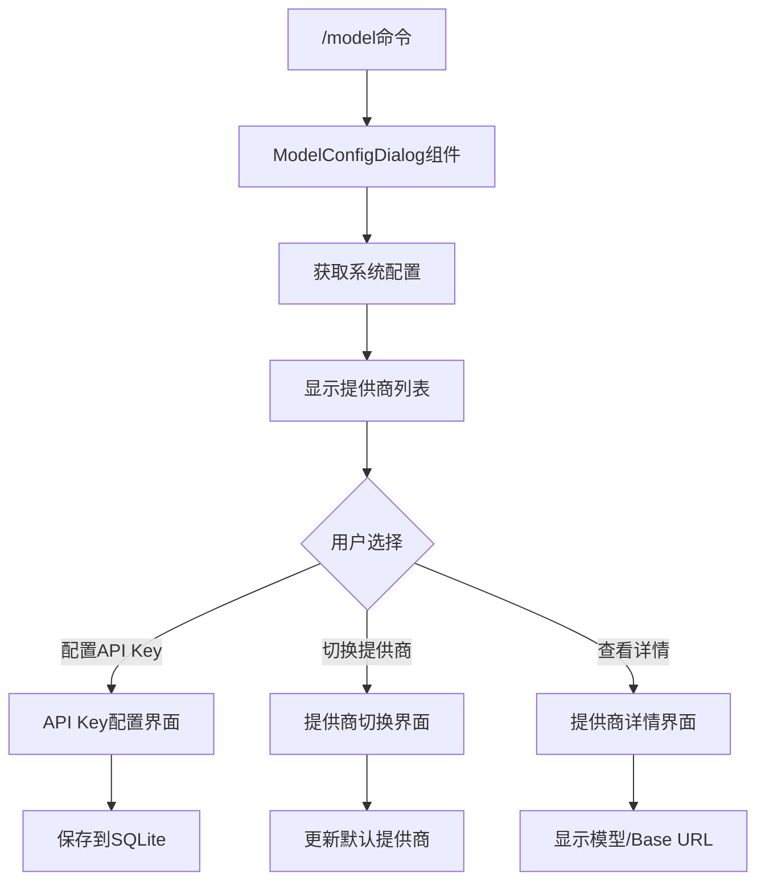

**图表来源**
- [ModelConfigDialog.tsx:39-102](file://terminal-ui/src/components/ModelConfigDialog.tsx#L39-L102)

**章节来源**
- [ModelConfigDialog.tsx:39-102](file://terminal-ui/src/components/ModelConfigDialog.tsx#L39-L102)

### HTTP回退机制

当LangChain调用出现问题时，系统提供HTTP直连回退：

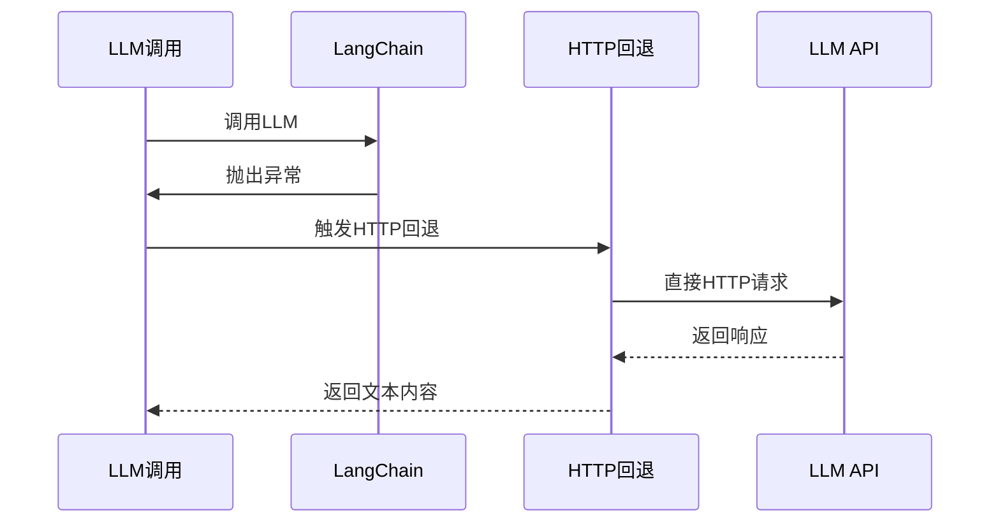

**图表来源**
- [security_react.py:426-452](file://core/patterns/security_react.py#L426-L452)

**章节来源**
- [security_react.py:426-452](file://core/patterns/security_react.py#L426-L452)

## 依赖关系分析

### 外部依赖

Secbot的LLM提供商支持依赖以下外部库：

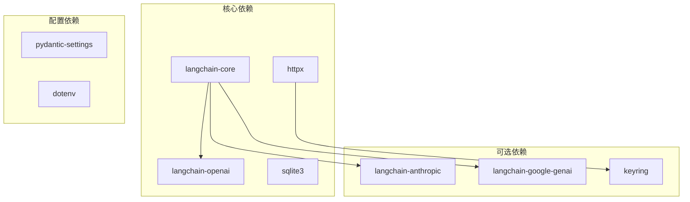

**图表来源**
- [security_react.py:21-46](file://core/patterns/security_react.py#L21-L46)

### 内部依赖

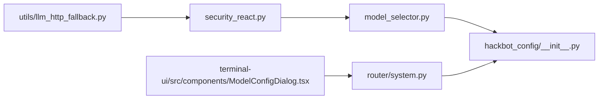

**图表来源**
- [model_selector.py:17-24](file://utils/model_selector.py#L17-L24)
- [security_react.py:45-46](file://core/patterns/security_react.py#L45-L46)

**章节来源**
- [model_selector.py:17-24](file://utils/model_selector.py#L17-L24)
- [security_react.py:45-46](file://core/patterns/security_react.py#L45-L46)

## 性能考虑

### 连接池管理

系统实现了智能的连接池管理，避免重复创建LLM实例：

- **延迟初始化**: LLM实例在首次需要时创建
- **缓存机制**: 已创建的LLM实例会被缓存
- **并发控制**: 使用异步锁确保线程安全

### 错误处理策略

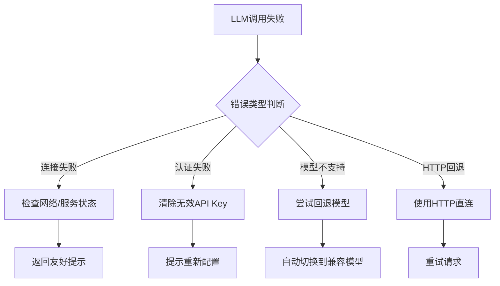

**图表来源**
- [security_react.py:326-340](file://core/patterns/security_react.py#L326-L340)

**章节来源**
- [security_react.py:326-340](file://core/patterns/security_react.py#L326-L340)

## 故障排除指南

### 常见问题及解决方案

#### 1. Ollama连接失败

**症状**: 提示无法连接Ollama服务

**诊断步骤**:
1. 检查Ollama服务是否运行
2. 验证端口11434是否被占用
3. 确认配置的Base URL正确

**解决方法**:
```bash
# 启动Ollama服务
ollama serve

# 检查服务状态
ollama list

# 验证连接
curl http://localhost:11434/api/tags
```

#### 2. API Key认证失败

**症状**: 显示API认证失败错误

**解决步骤**:
1. 清除无效的API Key
2. 重新配置正确的API Key
3. 验证API Key权限

**章节来源**
- [model_selector.py:492-511](file://utils/model_selector.py#L492-L511)

#### 3. 模型不支持工具调用

**症状**: 模型不支持工具调用功能

**解决方法**:
1. 检查`LLM_TOOLS_SUPPORTED`环境变量
2. 切换到支持工具调用的模型
3. 使用提示词方式进行工具调用

**章节来源**
- [hackbot_config/__init__.py:201-205](file://hackbot_config/__init__.py#L201-L205)

### 配置验证

系统提供了多种配置验证机制：

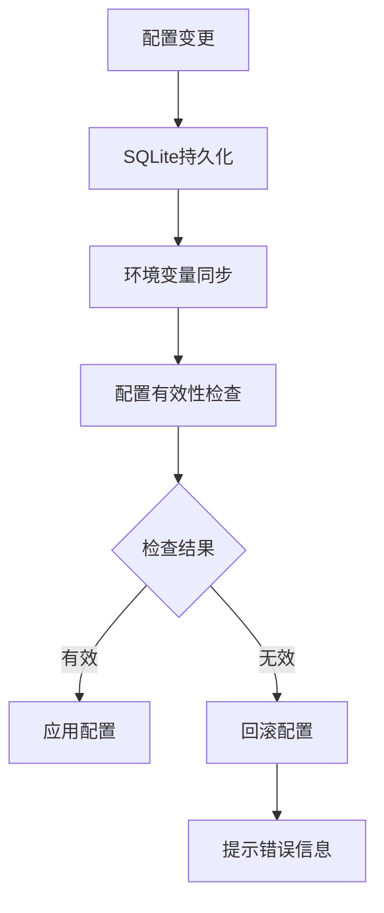

**图表来源**
- [hackbot_config/__init__.py:66-94](file://hackbot_config/__init__.py#L66-L94)

**章节来源**
- [hackbot_config/__init__.py:66-94](file://hackbot_config/__init__.py#L66-L94)

## 结论

Secbot的LLM提供商支持体系具有以下特点：

1. **全面的厂商支持**: 支持超过30个LLM提供商，涵盖国内外主流服务
2. **灵活的配置管理**: 多层配置优先级，支持SQLite持久化和环境变量
3. **友好的用户界面**: 提供CLI和TUI两种配置方式
4. **健壮的错误处理**: 包含HTTP回退机制和详细的错误提示
5. **可扩展的设计**: 基于注册表的架构，易于添加新的LLM提供商

该体系为用户提供了无缝的LLM切换体验，无论是本地部署还是云端服务，都能获得一致的使用体验。