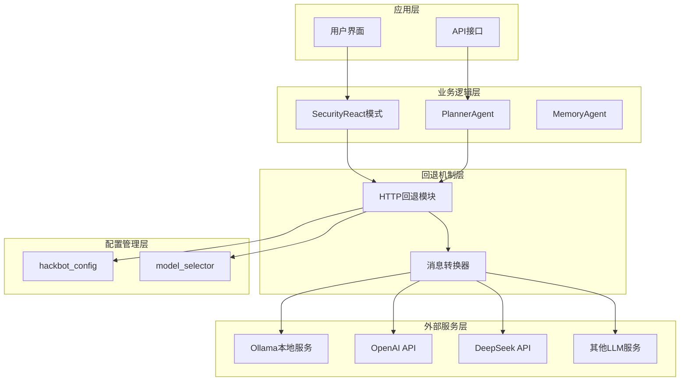
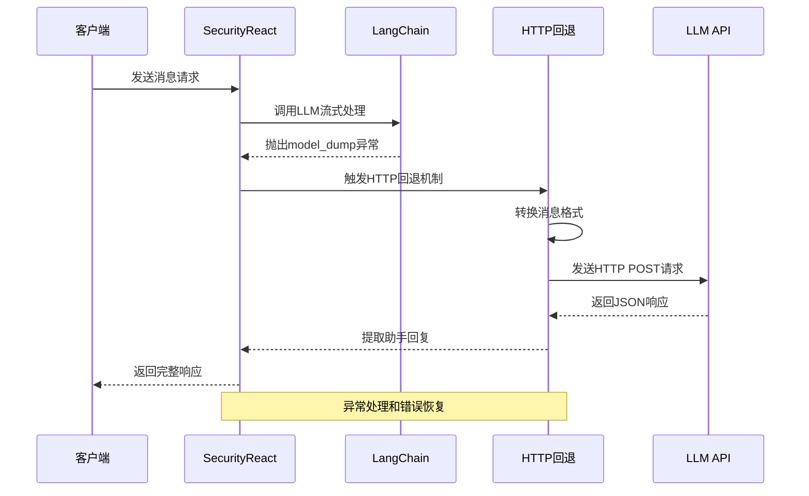
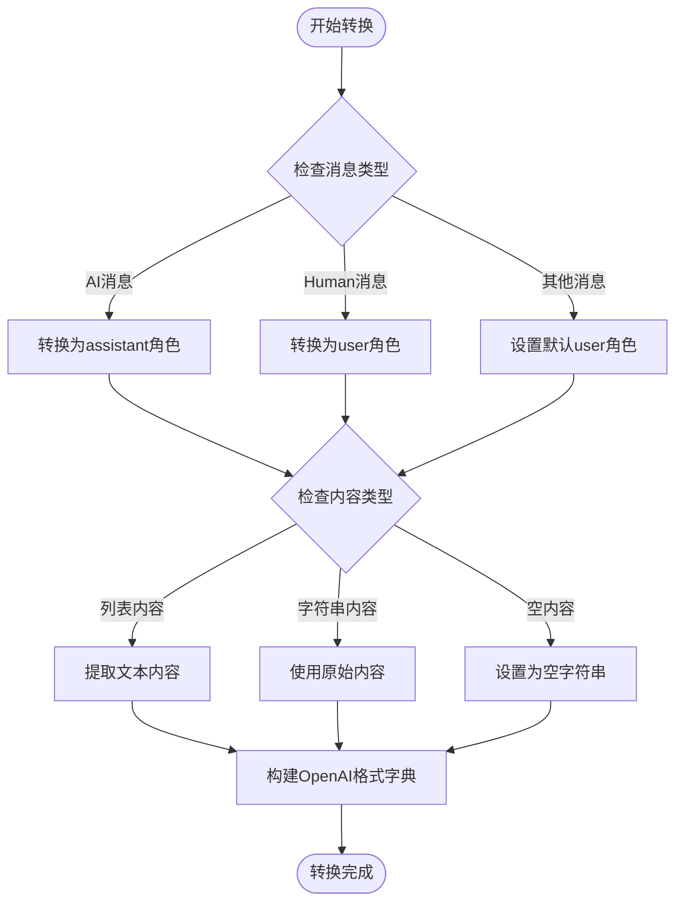
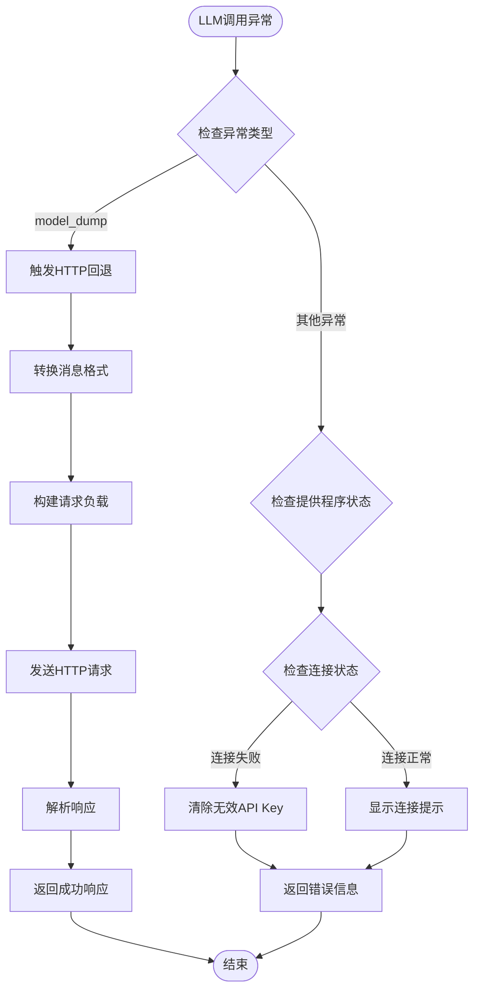
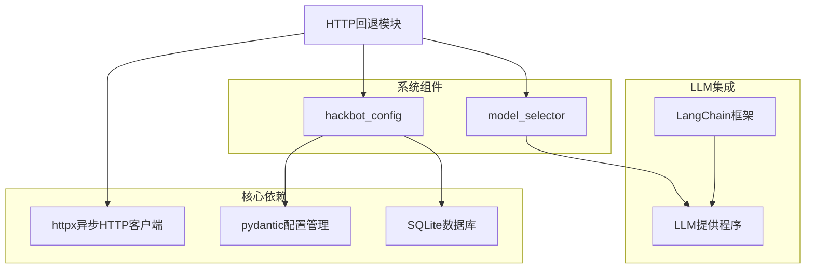

# LLM提供程序HTTP回退机制

<cite>
**本文档引用的文件**
- [llm_http_fallback.py](file://utils/llm_http_fallback.py)
- [LLM_PROVIDERS.md](file://docs/LLM_PROVIDERS.md)
- [security_react.py](file://core/patterns/security_react.py)
- [__init__.py](file://hackbot_config/__init__.py)
- [model_selector.py](file://utils/model_selector.py)
- [planner_agent.py](file://core/agents/planner_agent.py)
- [pyproject.toml](file://pyproject.toml)
</cite>

## 目录
1. [简介](#简介)
2. [系统架构](#系统架构)
3. [核心组件](#核心组件)
4. [架构概览](#架构概览)
5. [详细组件分析](#详细组件分析)
6. [依赖关系分析](#依赖关系分析)
7. [性能考虑](#性能考虑)
8. [故障排除指南](#故障排除指南)
9. [结论](#结论)

## 简介

LLM提供程序HTTP回退机制是Secbot项目中一个关键的容错和可靠性保障功能。当LangChain流式/非流式调用因API返回格式问题（如model_dump、无generation chunks）失败时，该机制能够自动切换到HTTP直连回退模式，确保系统能够在各种异常情况下仍能获得LLM响应。

该机制支持多种LLM提供程序，包括Ollama本地部署、OpenAI兼容服务、Anthropic Claude、Google Gemini等主流AI服务提供商，并提供了灵活的配置管理和错误处理策略。

## 系统架构

Secbot的LLM回退机制采用分层架构设计，主要包含以下层次：



**图表来源**
- [llm_http_fallback.py:1-108](file://utils/llm_http_fallback.py#L1-L108)
- [security_react.py:420-452](file://core/patterns/security_react.py#L420-L452)
- [model_selector.py:29-289](file://utils/model_selector.py#L29-L289)

## 核心组件

### HTTP回退模块

HTTP回退模块是整个机制的核心，负责直接发起HTTP请求并与LLM服务进行通信。其主要功能包括：

- **消息格式转换**：将LangChain消息格式转换为OpenAI兼容格式
- **动态URL构建**：根据配置动态构建API端点URL
- **认证处理**：支持多种认证方式（Bearer Token、API Key等）
- **错误处理**：提供详细的错误信息和回退策略

### 配置管理系统

配置管理系统负责管理各种LLM提供程序的配置信息，包括：

- **提供程序注册**：维护支持的LLM提供程序列表
- **配置存储**：支持SQLite持久化和环境变量配置
- **动态切换**：支持运行时切换不同的LLM提供程序

### 模型选择器

模型选择器提供了一个交互式的界面来选择和配置LLM提供程序，支持：

- **多厂商支持**：支持超过30个不同的LLM提供程序
- **自动检测**：自动检测本地Ollama服务状态
- **配置验证**：验证配置的有效性和可用性

**章节来源**
- [llm_http_fallback.py:11-108](file://utils/llm_http_fallback.py#L11-L108)
- [model_selector.py:29-289](file://utils/model_selector.py#L29-L289)
- [hackbot_config/__init__.py:128-181](file://hackbot_config/__init__.py#L128-L181)

## 架构概览

LLM回退机制的整体架构采用事件驱动的设计模式，主要包含以下关键流程：



**图表来源**
- [security_react.py:424-439](file://core/patterns/security_react.py#L424-L439)
- [llm_http_fallback.py:11-83](file://utils/llm_http_fallback.py#L11-L83)

## 详细组件分析

### HTTP回退核心实现

HTTP回退模块的核心实现位于`utils/llm_http_fallback.py`文件中，主要包含以下关键功能：

#### 消息格式转换



**图表来源**
- [llm_http_fallback.py:85-108](file://utils/llm_http_fallback.py#L85-L108)

#### 提供程序配置管理

HTTP回退机制支持多种LLM提供程序的配置管理：

| 提供程序 | 类型 | 认证方式 | 默认Base URL |
|---------|------|----------|-------------|
| Ollama | 本地部署 | 无需API Key | http://localhost:11434 |
| DeepSeek | OpenAI兼容 | API Key | https://api.deepseek.com |
| OpenAI | OpenAI兼容 | Bearer Token | https://api.openai.com/v1 |
| Anthropic | 原生 | API Key | https://api.anthropic.com |
| Google | 原生 | API Key | 无默认值 |

**章节来源**
- [llm_http_fallback.py:31-58](file://utils/llm_http_fallback.py#L31-L58)
- [model_selector.py:29-289](file://utils/model_selector.py#L29-L289)

### 错误处理和回退策略

系统实现了多层次的错误处理和回退策略：



**图表来源**
- [security_react.py:424-450](file://core/patterns/security_react.py#L424-L450)
- [model_selector.py:492-511](file://utils/model_selector.py#L492-L511)

**章节来源**
- [security_react.py:420-452](file://core/patterns/security_react.py#L420-L452)
- [model_selector.py:492-511](file://utils/model_selector.py#L492-L511)

### 配置管理机制

配置管理系统提供了灵活的配置管理能力：

#### 配置优先级

系统采用多层配置优先级机制：

1. **SQLite持久化配置**：用户通过CLI/TUI设置的配置
2. **环境变量配置**：系统环境变量设置
3. **默认配置**：内置的默认配置值

#### 提供程序注册表

系统维护了一个完整的LLM提供程序注册表，包含以下关键信息：

- **提供程序ID**：唯一的标识符
- **名称和描述**：用户可见的信息
- **类型**：OpenAI兼容或原生类型
- **默认Base URL**：默认的API端点
- **是否需要API Key**：认证要求

**章节来源**
- [hackbot_config/__init__.py:128-181](file://hackbot_config/__init__.py#L128-L181)
- [model_selector.py:29-289](file://utils/model_selector.py#L29-L289)

## 依赖关系分析

LLM回退机制的依赖关系相对简洁，主要依赖于以下核心组件：



**图表来源**
- [pyproject.toml:29-69](file://pyproject.toml#L29-L69)
- [llm_http_fallback.py:7-8](file://utils/llm_http_fallback.py#L7-L8)

### 外部依赖

系统的主要外部依赖包括：

- **httpx>=0.26.0**：异步HTTP客户端，用于发送HTTP请求
- **pydantic>=2.5.3**：数据验证和配置管理
- **pydantic-settings>=2.1.0**：设置管理
- **langchain>=0.1.0**：LLM集成框架

这些依赖为HTTP回退机制提供了必要的基础设施支持。

**章节来源**
- [pyproject.toml:29-69](file://pyproject.toml#L29-L69)

## 性能考虑

HTTP回退机制在设计时充分考虑了性能优化：

### 异步处理

系统采用异步编程模式，使用`httpx.AsyncClient`进行HTTP请求，避免阻塞主线程：

- **并发处理**：支持多个HTTP请求同时进行
- **超时控制**：每个请求都有明确的超时限制
- **资源管理**：自动管理HTTP连接池

### 缓存策略

虽然HTTP回退机制本身不实现缓存，但系统在其他层面采用了缓存策略：

- **模型列表缓存**：Ollama模型列表的缓存
- **配置缓存**：LLM提供程序配置的缓存
- **响应缓存**：某些工具调用结果的缓存

### 连接优化

系统实现了多种连接优化策略：

- **连接复用**：HTTP连接的复用减少建立连接的开销
- **超时调整**：根据不同场景调整超时时间
- **重试机制**：对临时性错误进行自动重试

## 故障排除指南

### 常见问题诊断

#### LLM调用失败

当出现LLM调用失败时，系统会自动触发HTTP回退机制：

1. **检查异常类型**：确认是否为"model_dump"异常
2. **验证配置**：检查LLM提供程序配置是否正确
3. **网络连接**：确认网络连接状态

#### HTTP回退失败

如果HTTP回退机制也失败，可能的原因包括：

- **API Key无效**：检查API Key是否正确配置
- **Base URL错误**：确认API端点URL是否正确
- **网络连接问题**：检查网络连接状态

#### Ollama服务问题

对于Ollama本地服务，常见问题包括：

- **服务未启动**：确认Ollama服务是否正在运行
- **模型未下载**：检查所需的模型是否已下载
- **端口冲突**：确认11434端口是否被占用

### 调试技巧

#### 启用详细日志

系统提供了详细的日志记录功能，可以通过以下方式启用：

- **设置日志级别**：在环境变量中设置`LOG_LEVEL=DEBUG`
- **检查日志文件**：查看`logs/agent.log`文件中的详细信息
- **监控网络请求**：使用网络调试工具监控HTTP请求

#### 配置验证

使用以下命令验证配置的有效性：

```bash
# 检查当前LLM提供程序
hackbot model

# 验证特定提供程序
hackbot model --provider openai
```

**章节来源**
- [model_selector.py:492-511](file://utils/model_selector.py#L492-L511)
- [hackbot_config/__init__.py:47-121](file://hackbot_config/__init__.py#L47-L121)

## 结论

LLM提供程序HTTP回退机制是Secbot项目中一个重要的容错和可靠性保障功能。通过多层次的错误处理、灵活的配置管理和高效的异步处理，该机制确保了系统在各种异常情况下仍能稳定运行。

### 主要优势

1. **高可靠性**：多重回退机制确保系统稳定性
2. **灵活性**：支持多种LLM提供程序和配置方式
3. **易用性**：提供直观的配置界面和错误提示
4. **性能优化**：异步处理和连接优化提升系统性能

### 未来改进方向

1. **智能回退策略**：根据异常类型选择最优的回退策略
2. **缓存优化**：实现更智能的响应缓存机制
3. **监控增强**：增加更详细的性能监控和告警功能
4. **配置自动化**：实现配置的自动检测和推荐

该机制为Secbot项目提供了坚实的LLM服务基础，确保了系统的稳定性和可靠性。