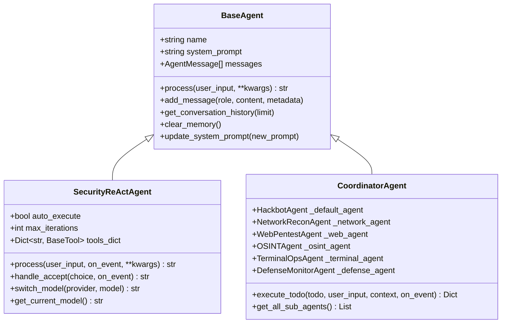
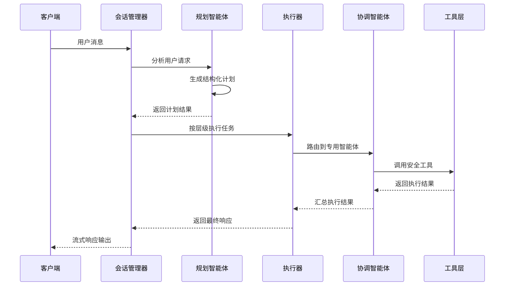
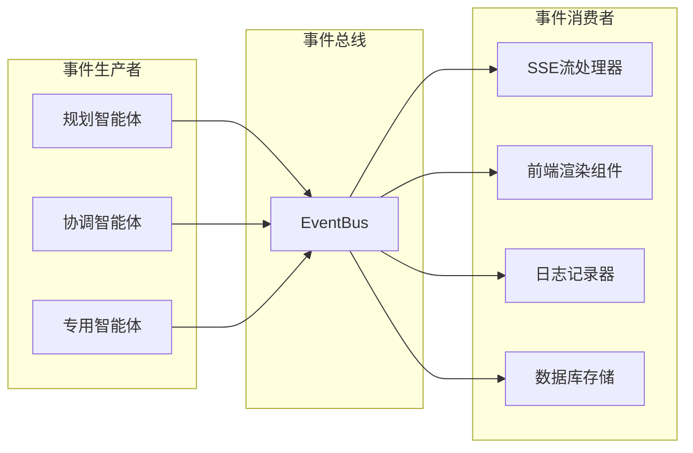
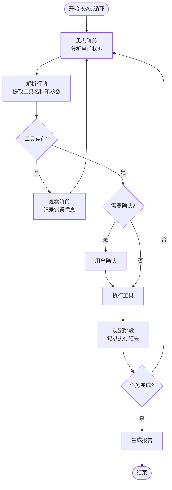
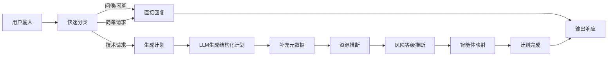
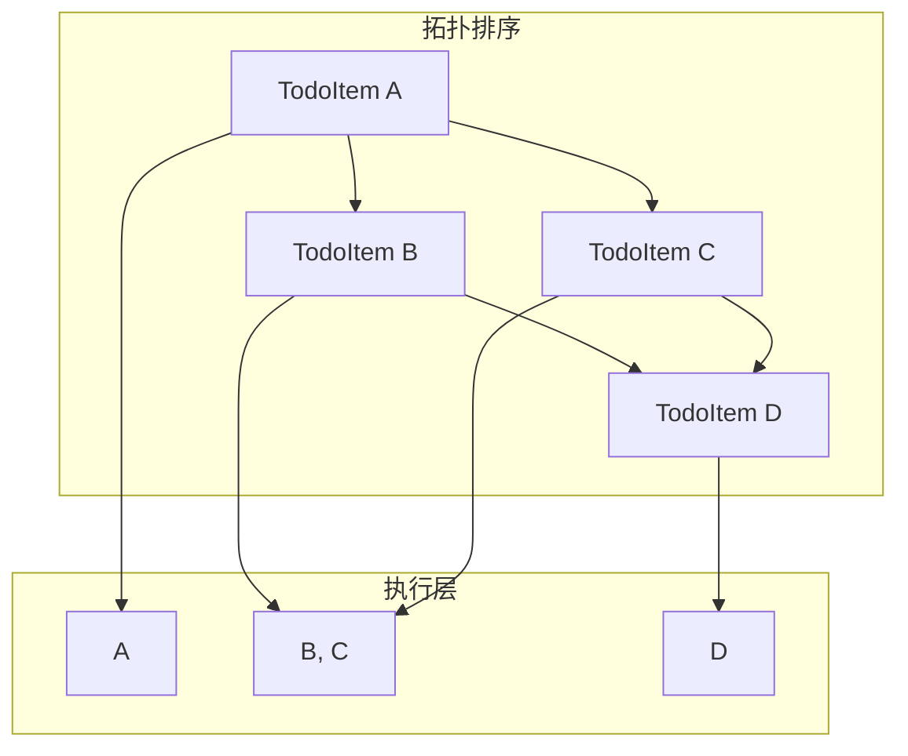
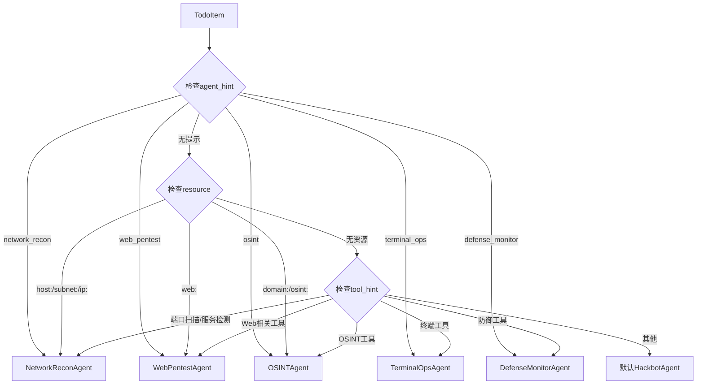
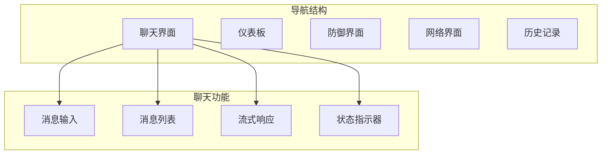
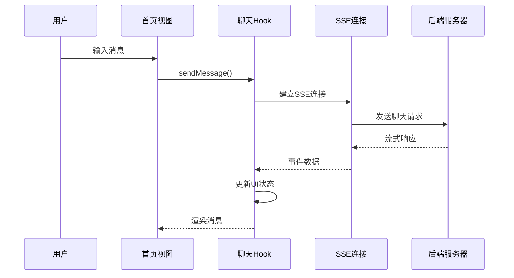
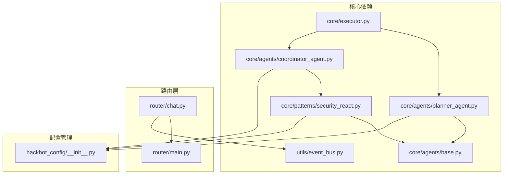

# 安全React代理

<cite>
**本文档引用的文件**
- [README.md](file://README.md)
- [main.py](file://main.py)
- [App.tsx](file://app/App.tsx)
- [App.tsx](file://app/src/screens/ChatScreen.tsx)
- [security_react.py](file://core/patterns/security_react.py)
- [base.py](file://core/agents/base.py)
- [coordinator_agent.py](file://core/agents/coordinator_agent.py)
- [planner_agent.py](file://core/agents/planner_agent.py)
- [executor.py](file://core/executor.py)
- [main.py](file://router/main.py)
- [chat.py](file://router/chat.py)
- [event_bus.py](file://utils/event_bus.py)
- [HomeView.tsx](file://terminal-ui/src/views/HomeView.tsx)
- [useChat.ts](file://terminal-ui/src/useChat.ts)
- [models.py](file://core/models.py)
- [__init__.py](file://hackbot_config/__init__.py)
</cite>

## 目录
1. [简介](#简介)
2. [项目结构](#项目结构)
3. [核心组件](#核心组件)
4. [架构概览](#架构概览)
5. [详细组件分析](#详细组件分析)
6. [依赖关系分析](#依赖关系分析)
7. [性能考虑](#性能考虑)
8. [故障排除指南](#故障排除指南)
9. [结论](#结论)

## 简介

Security React Agent（Secbot）是一个基于人工智能的自动化渗透测试智能体系统。该项目采用多智能体架构，结合ReAct推理模式，为网络安全测试提供智能化解决方案。

### 主要特性

- **多智能体协作**：支持ReAct、Plan-Execute、多智能体协作、工具调用、记忆增强等多种智能体模式
- **AI Web研究**：独立的WebResearchAgent，基于ReAct自动完成联网搜索、网页提取、多页爬取和API调用
- **本地控制界面**：提供简单直观的命令行入口与配置工具
- **持久化终端会话**：智能体专用终端，支持会话内多步命令执行与系统信息收集
- **AI网络爬虫**：实时网络信息捕获和监控
- **操作系统控制**：文件操作、进程管理、系统信息获取

### 系统架构

项目采用分层架构设计，包含前端客户端、后端路由、会话编排、规划执行、多智能体协调、工具层和汇总存储等层次。

```mermaid
graph TB
subgraph "前端客户端"
RN[React Native移动端]
TUI[终端用户界面(Terminal UI)]
Web[Web浏览器]
end
subgraph "后端服务"
API[FastAPI后端服务]
Router[路由层]
Session[会话管理器]
end
subgraph "智能体层"
Planner[规划智能体]
Coordinator[协调智能体]
Agents[专用子智能体]
end
subgraph "工具层"
Tools[安全工具集合]
OS[操作系统工具]
Network[网络工具]
WebTools[Web工具]
end
subgraph "存储层"
DB[(SQLite数据库)]
Memory[内存管理]
end
RN --> API
TUI --> API
Web --> API
API --> Router
Router --> Session
Session --> Planner
Planner --> Coordinator
Coordinator --> Agents
Agents --> Tools
Tools --> OS
Tools --> Network
Tools --> WebTools
Agents --> DB
Session --> Memory
```

**图表来源**
- [README.md:126-210](file://README.md#L126-L210)
- [main.py:1-62](file://main.py#L1-L62)
- [router/main.py:19-71](file://router/main.py#L19-L71)

## 项目结构

项目采用模块化组织结构，主要包含以下核心目录：

### 后端核心模块

- **core/**：核心智能体框架和算法实现
- **router/**：FastAPI路由层，提供REST API接口
- **utils/**：通用工具函数和基础设施
- **hackbot_config/**：配置管理系统

### 前端模块

- **app/**：React Native移动端应用
- **terminal-ui/**：TypeScript终端用户界面
- **api/**：前端API客户端

### 工具和插件

- **tools/**：安全工具集合，包含进攻性和防御性工具
- **skills/**：技能系统和工作流管理
- **scanner/**：扫描引擎和检测工具

**章节来源**
- [README.md:416-439](file://README.md#L416-L439)

## 核心组件

### 智能体基础架构

项目的核心是基于ReAct（Reasoning and Acting）模式的智能体系统。每个智能体都继承自基础抽象类，实现了统一的处理接口。



**图表来源**
- [base.py:17-125](file://core/agents/base.py#L17-L125)
- [security_react.py:147-313](file://core/patterns/security_react.py#L147-L313)
- [coordinator_agent.py:40-97](file://core/agents/coordinator_agent.py#L40-L97)

### 会话管理器

会话管理器是整个系统的核心协调器，负责处理用户消息、编排智能体执行流程、管理事件流。



**图表来源**
- [planner_agent.py:88-130](file://core/agents/planner_agent.py#L88-L130)
- [executor.py:46-151](file://core/executor.py#L46-L151)
- [coordinator_agent.py:130-181](file://core/agents/coordinator_agent.py#L130-L181)

**章节来源**
- [base.py:17-125](file://core/agents/base.py#L17-L125)
- [security_react.py:147-800](file://core/patterns/security_react.py#L147-L800)
- [coordinator_agent.py:40-336](file://core/agents/coordinator_agent.py#L40-L336)

## 架构概览

### 系统分层设计

项目采用清晰的分层架构，每层都有明确的职责和边界：

| 层级 | 模块 | 职责 |
|------|------|------|
| **前端层** | React Native、终端UI、Web界面 | 用户交互、消息展示、事件处理 |
| **路由层** | FastAPI路由、SSE流 | REST API接口、事件流传输、会话管理 |
| **编排层** | 会话管理器、事件总线 | 请求路由、流程编排、状态管理 |
| **智能体层** | 规划智能体、协调智能体、专用智能体 | AI推理、任务规划、工具调用 |
| **工具层** | 安全工具集合 | 网络扫描、漏洞检测、系统控制 |
| **存储层** | SQLite数据库、内存管理 | 数据持久化、会话存储、配置管理 |

### 事件驱动架构

系统采用事件驱动的设计模式，通过事件总线实现松耦合的组件通信。



**图表来源**
- [event_bus.py:15-53](file://utils/event_bus.py#L15-L53)
- [chat.py:134-263](file://router/chat.py#L134-L263)

**章节来源**
- [README.md:126-210](file://README.md#L126-L210)
- [event_bus.py:68-187](file://utils/event_bus.py#L68-L187)
- [chat.py:29-131](file://router/chat.py#L29-L131)

## 详细组件分析

### 安全ReAct智能体

SecurityReActAgent是系统的核心智能体，实现了ReAct推理模式，支持自动执行和专家模式两种操作模式。

#### ReAct推理循环

智能体的推理过程遵循标准的ReAct循环：

1. **思考阶段**：分析当前状态和目标
2. **行动阶段**：选择并执行适当的工具
3. **观察阶段**：记录工具执行结果
4. **决策阶段**：根据结果决定下一步行动



**图表来源**
- [security_react.py:465-707](file://core/patterns/security_react.py#L465-L707)

#### 模型切换机制

智能体支持动态切换不同的大语言模型提供商：

| 模型提供商 | 支持的模型 | 特殊配置 |
|------------|------------|----------|
| Ollama | gemma3:1b, gemma3:3b | 本地推理，支持自定义端点 |
| DeepSeek | deepseek-reasoner, deepseek-chat | 支持推理模型 |
| OpenAI | gpt-3.5-turbo, gpt-4 | 标准OpenAI API |
| Anthropic | claude-3-opus | Claude系列模型 |
| Google | gemini-pro | Gemini系列模型 |

**章节来源**
- [security_react.py:49-144](file://core/patterns/security_react.py#L49-L144)
- [security_react.py:289-313](file://core/patterns/security_react.py#L289-L313)

### 规划智能体

PlannerAgent负责将用户请求转换为结构化的任务计划，支持复杂的依赖关系和并发控制。

#### 任务规划流程



**图表来源**
- [planner_agent.py:88-130](file://core/agents/planner_agent.py#L88-L130)
- [planner_agent.py:462-521](file://core/agents/planner_agent.py#L462-L521)

#### 并发执行策略

系统支持智能体级别的并发控制，确保任务的正确执行顺序：



**图表来源**
- [planner_agent.py:182-250](file://core/agents/planner_agent.py#L182-L250)
- [executor.py:64-151](file://core/executor.py#L64-L151)

**章节来源**
- [planner_agent.py:20-82](file://core/agents/planner_agent.py#L20-L82)
- [planner_agent.py:182-250](file://core/agents/planner_agent.py#L182-L250)
- [executor.py:17-197](file://core/executor.py#L17-L197)

### 协调智能体

CoordinatorAgent作为多智能体系统的协调中心，负责将任务路由到最适合的专用智能体。

#### 智能体路由策略



**图表来源**
- [coordinator_agent.py:242-331](file://core/agents/coordinator_agent.py#L242-L331)

**章节来源**
- [coordinator_agent.py:40-336](file://core/agents/coordinator_agent.py#L40-L336)

### 前端界面架构

系统提供多种前端界面，包括React Native移动端、终端用户界面和Web界面。

#### React Native移动端

移动端采用React Navigation实现标签页导航，支持完整的聊天功能。



**图表来源**
- [App.tsx:28-109](file://app/App.tsx#L28-L109)
- [ChatScreen.tsx:61-753](file://app/src/screens/ChatScreen.tsx#L61-L753)

#### 终端用户界面

终端UI提供类似命令行的交互体验，支持斜杠命令和键盘快捷键。



**图表来源**
- [HomeView.tsx:76-99](file://terminal-ui/src/views/HomeView.tsx#L76-L99)
- [useChat.ts:153-358](file://terminal-ui/src/useChat.ts#L153-L358)

**章节来源**
- [App.tsx:28-109](file://app/App.tsx#L28-L109)
- [ChatScreen.tsx:61-753](file://app/src/screens/ChatScreen.tsx#L61-L753)
- [HomeView.tsx:30-200](file://terminal-ui/src/views/HomeView.tsx#L30-L200)
- [useChat.ts:67-398](file://terminal-ui/src/useChat.ts#L67-L398)

## 依赖关系分析

### 核心依赖关系

项目采用模块化设计，各组件之间的依赖关系清晰明确：



**图表来源**
- [security_react.py:13-46](file://core/patterns/security_react.py#L13-L46)
- [coordinator_agent.py:26-37](file://core/agents/coordinator_agent.py#L26-L37)
- [planner_agent.py:15-17](file://core/agents/planner_agent.py#L15-L17)
- [executor.py:12-14](file://core/executor.py#L12-L14)
- [chat.py:15-25](file://router/chat.py#L15-L25)
- [__init__.py:183-275](file://hackbot_config/__init__.py#L183-L275)

### 第三方依赖

系统使用多个第三方库来实现核心功能：

| 依赖库 | 版本 | 用途 |
|--------|------|------|
| langchain | 0.1+ | LLM集成和提示词管理 |
| langgraph | 0.2+ | 多智能体编排和状态管理 |
| fastapi | 0.109+ | Web API框架 |
| sqlite3 | 内置 | 数据持久化 |
| uv | 最新 | Python包管理器 |
| ink | 4.4+ | 终端UI组件 |

**章节来源**
- [README.md:27-44](file://README.md#L27-L44)
- [main.py:1-62](file://main.py#L1-L62)

## 性能考虑

### 并发执行优化

系统采用多层并发策略来提高执行效率：

1. **智能体级别并发**：每个智能体内部的任务串行执行，不同智能体之间并行
2. **任务级别并发**：同一层内的多个任务可以并行执行
3. **工具级别并发**：工具执行支持异步调用

### 内存管理

系统实现了高效的内存管理策略：

- **会话上下文限制**：限制会话摘要的最大字符数，防止内存泄漏
- **工具结果聚合**：按智能体维度聚合工具执行结果，便于后续分析
- **事件流控制**：通过事件总线控制内存中的事件数量

### 网络优化

- **SSE流式传输**：使用Server-Sent Events实现实时响应
- **连接池管理**：合理管理LLM API连接
- **超时控制**：为所有网络请求设置合理的超时时间

## 故障排除指南

### 常见问题诊断

#### LLM连接问题

当遇到LLM连接失败时，系统会自动尝试以下回退机制：

1. **HTTP直连回退**：当模型调用触发model_dump时，使用HTTP请求
2. **连接提示生成**：根据错误类型生成具体的连接问题提示
3. **模型切换**：自动切换到备用模型

#### 事件流问题

如果前端无法接收到事件流，检查以下方面：

- **CORS配置**：确保后端允许前端域名访问
- **SSE连接状态**：确认连接已建立且保持活跃
- **事件总线订阅**：验证事件处理器正确注册

#### 模型配置问题

当模型配置出现问题时：

- **检查API密钥**：确认LLM提供商API密钥正确配置
- **验证模型可用性**：确认所选模型在提供商处可用
- **检查网络连接**：确保能够访问LLM提供商的服务

**章节来源**
- [security_react.py:434-461](file://core/patterns/security_react.py#L434-L461)
- [chat.py:172-188](file://router/chat.py#L172-L188)
- [__init__.py:128-139](file://hackbot_config/__init__.py#L128-L139)

## 结论

Security React Agent是一个功能强大、架构清晰的AI驱动安全测试智能体系统。其主要优势包括：

### 技术优势

1. **模块化设计**：清晰的分层架构使得系统易于维护和扩展
2. **事件驱动**：松耦合的组件通信机制提高了系统的灵活性
3. **多智能体协作**：通过专业化分工实现更高效的威胁检测和响应
4. **多前端支持**：提供多种用户界面选择，适应不同使用场景

### 应用价值

- **安全测试自动化**：大幅减少手动安全测试的工作量
- **威胁检测**：提供持续的网络威胁监控能力
- **响应速度**：快速识别和响应安全事件
- **成本效益**：相比传统安全测试方法具有更高的性价比

### 发展方向

未来可以考虑的功能增强：

1. **增强学习集成**：引入强化学习算法提高智能体的学习能力
2. **云原生支持**：更好的容器化和微服务架构支持
3. **多租户架构**：支持企业级多租户部署
4. **可视化分析**：增强安全数据的可视化和分析能力

该项目为网络安全领域提供了一个强大的技术平台，有助于推动AI在安全测试和威胁检测方面的应用发展。