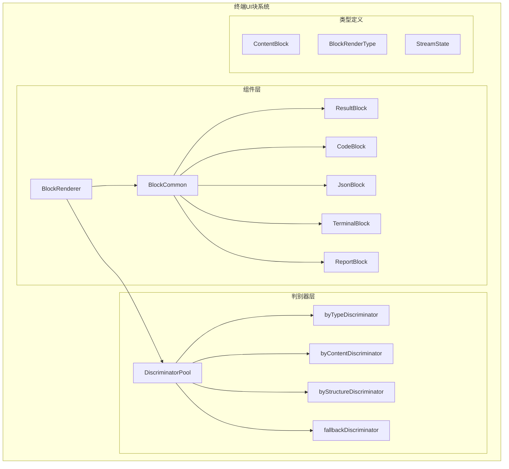
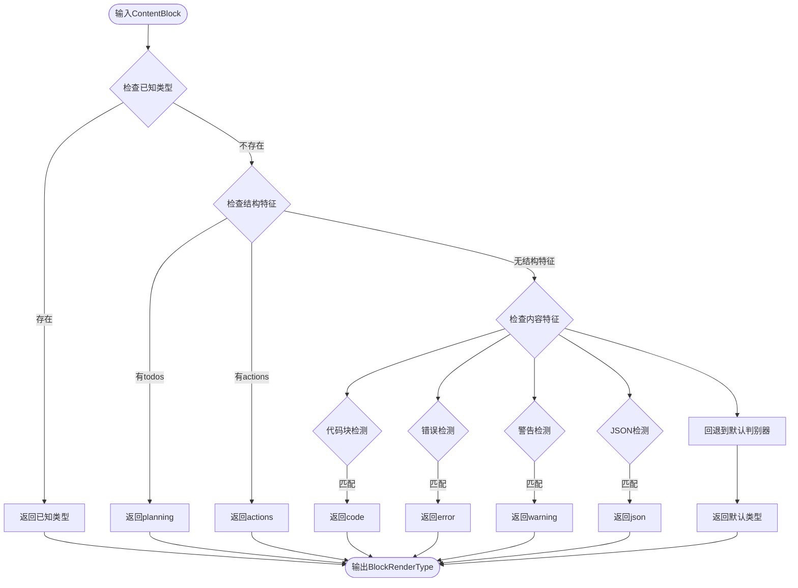
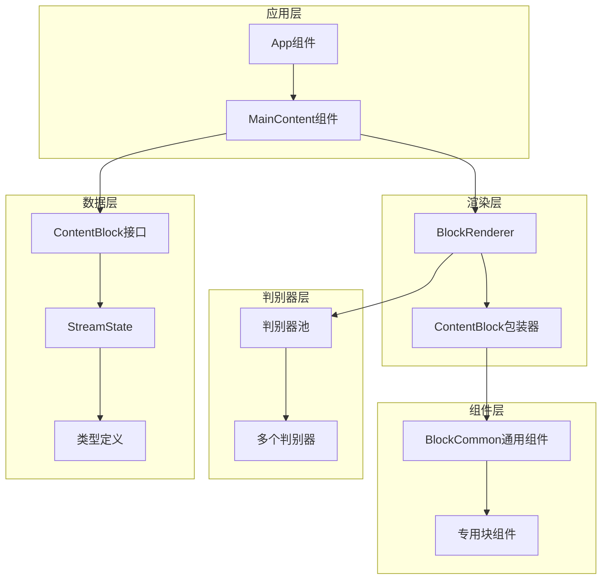
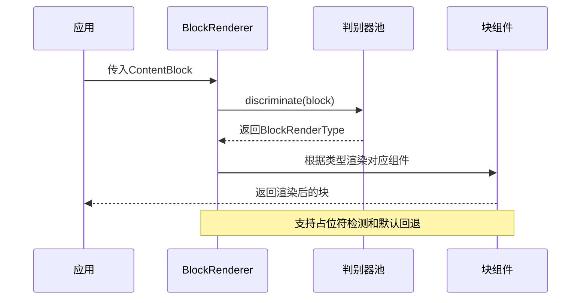
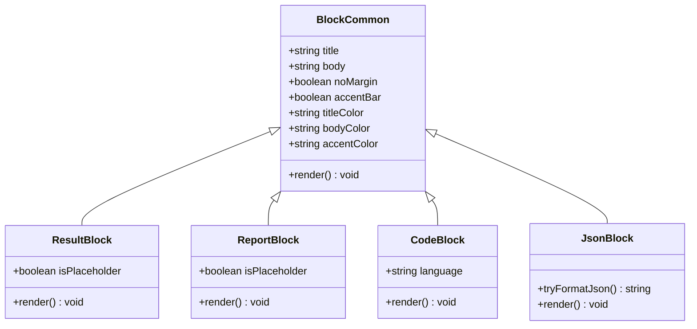
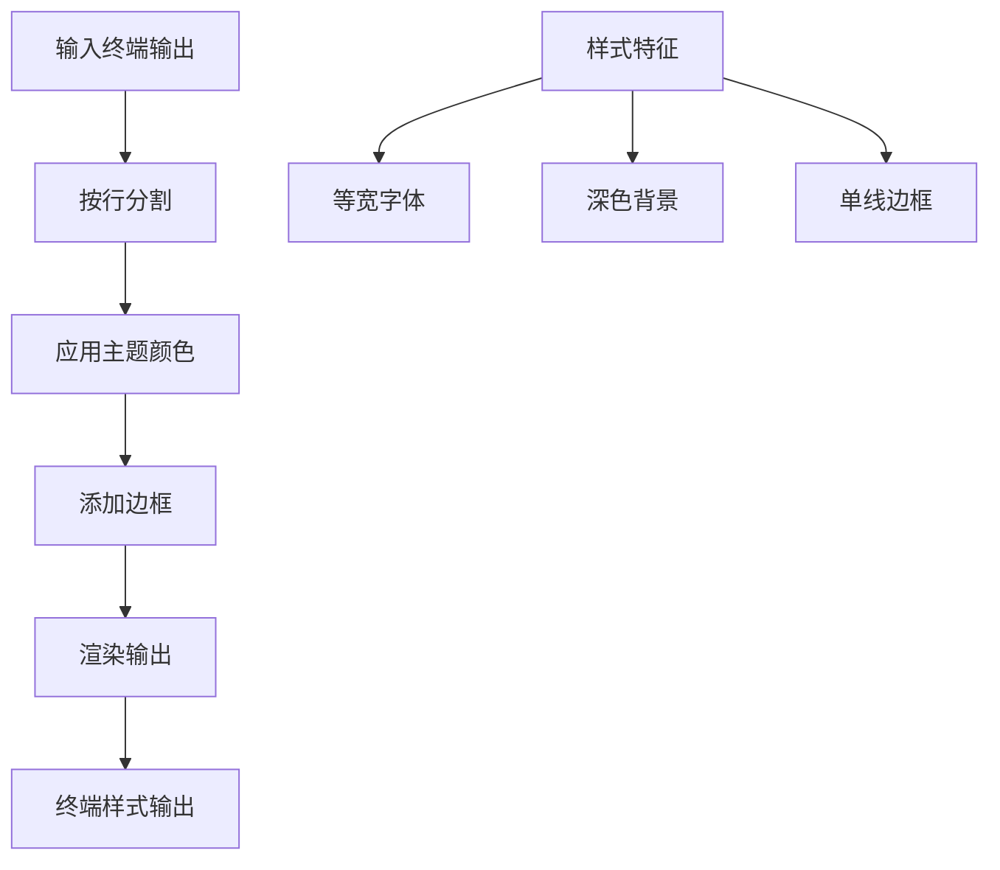
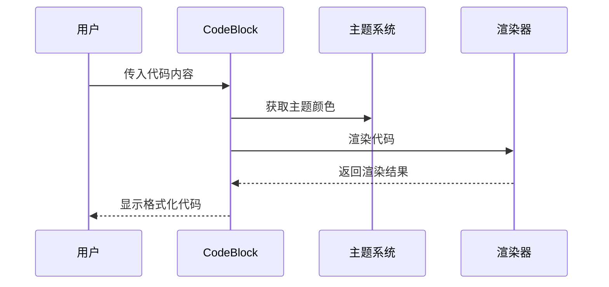
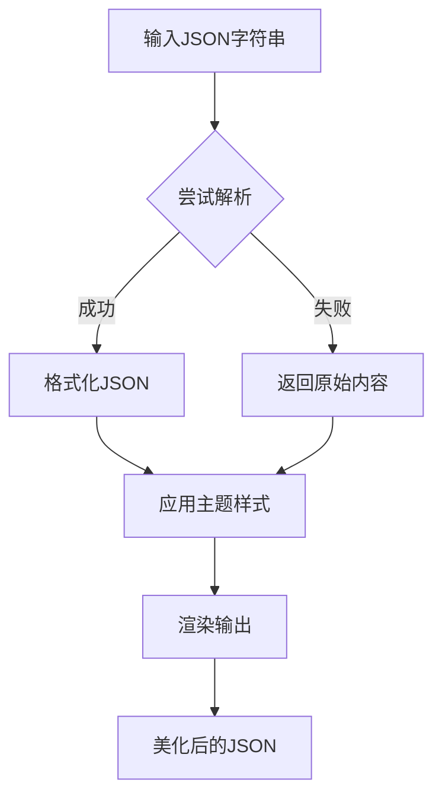
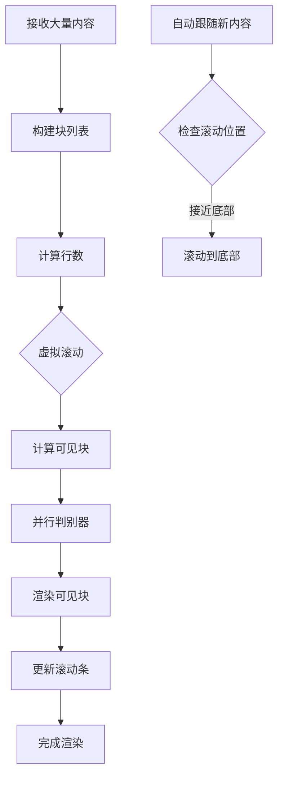
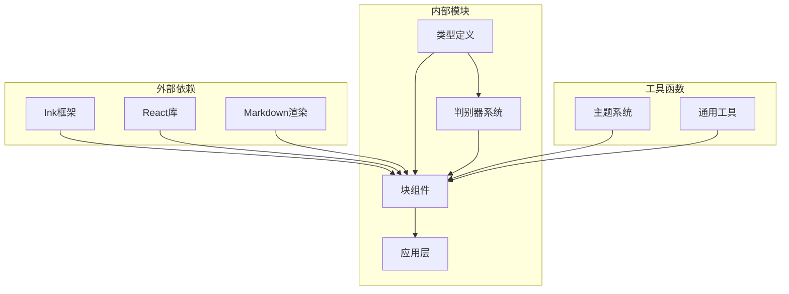

# 终端UI块

<cite>
**本文档引用的文件**
- [terminal-ui/src/components/blocks/index.ts](file://terminal-ui/src/components/blocks/index.ts)
- [terminal-ui/src/components/blocks/BlockRenderer.tsx](file://terminal-ui/src/components/blocks/BlockRenderer.tsx)
- [terminal-ui/src/blockDiscriminators/discriminators.ts](file://terminal-ui/src/blockDiscriminators/discriminators.ts)
- [terminal-ui/src/blockDiscriminators/pool.ts](file://terminal-ui/src/blockDiscriminators/pool.ts)
- [terminal-ui/src/blockDiscriminators/types.ts](file://terminal-ui/src/blockDiscriminators/types.ts)
- [terminal-ui/src/times.ts](file://terminal-ui/src/times.ts)
- [terminal-ui/src/types.ts](file://terminal-ui/src/types.ts)
- [terminal-ui/package.json](file://terminal-ui/package.json)
- [terminal-ui/src/components/blocks/TerminalBlock.tsx](file://terminal-ui/src/components/blocks/TerminalBlock.tsx)
- [terminal-ui/src/components/blocks/CodeBlock.tsx](file://terminal-ui/src/components/blocks/CodeBlock.tsx)
- [terminal-ui/src/components/blocks/JsonBlock.tsx](file://terminal-ui/src/components/blocks/JsonBlock.tsx)
- [terminal-ui/src/components/blocks/BlockCommon.tsx](file://terminal-ui/src/components/blocks/BlockCommon.tsx)
- [terminal-ui/src/components/blocks/ResultBlock.tsx](file://terminal-ui/src/components/blocks/ResultBlock.tsx)
- [terminal-ui/src/components/blocks/ReportBlock.tsx](file://terminal-ui/src/components/blocks/ReportBlock.tsx)
- [terminal-ui/src/App.tsx](file://terminal-ui/src/App.tsx)
- [terminal-ui/src/MainContent.tsx](file://terminal-ui/src/MainContent.tsx)
</cite>

## 目录
1. [简介](#简介)
2. [项目结构](#项目结构)
3. [核心组件](#核心组件)
4. [架构概览](#架构概览)
5. [详细组件分析](#详细组件分析)
6. [依赖关系分析](#依赖关系分析)
7. [性能考虑](#性能考虑)
8. [故障排除指南](#故障排除指南)
9. [结论](#结论)

## 简介

Terminal UI Blocks 是一个专为 Secbot 安全机器人设计的终端用户界面系统。该系统基于 React 和 Ink 框架构建，提供了丰富的消息块组件来展示不同类型的安全相关信息，包括代码输出、JSON 数据、表格、报告等。

该系统的核心特点是：
- **类型化渲染**：通过判别器系统自动识别内容类型并选择合适的渲染组件
- **虚拟滚动**：支持大量内容的高效渲染和滚动
- **主题化设计**：提供统一的视觉风格和颜色方案
- **响应式布局**：适配不同终端尺寸和分辨率

## 项目结构

终端UI块系统位于 `terminal-ui` 目录下，采用模块化的组件架构：

**图表来源**
- [terminal-ui/src/components/blocks/BlockRenderer.tsx:1-250](file://terminal-ui/src/components/blocks/BlockRenderer.tsx#L1-L250)
- [terminal-ui/src/blockDiscriminators/pool.ts:1-50](file://terminal-ui/src/blockDiscriminators/pool.ts#L1-L50)
- [terminal-ui/src/types.ts:56-124](file://terminal-ui/src/types.ts#L56-L124)

**章节来源**
- [terminal-ui/src/components/blocks/index.ts:1-40](file://terminal-ui/src/components/blocks/index.ts#L1-L40)
- [terminal-ui/src/App.tsx:1-212](file://terminal-ui/src/App.tsx#L1-L212)
- [terminal-ui/src/MainContent.tsx:1-389](file://terminal-ui/src/MainContent.tsx#L1-L389)

## 核心组件

### 内容块类型系统

系统定义了完整的块类型枚举，涵盖了安全应用中的各种输出场景：

| 块类型 | 描述 | 典型用途 |
|--------|------|----------|
| `api` | API调用结果 | REST API响应展示 |
| `phase` | 任务阶段 | 攻击链阶段状态 |
| `error` | 错误信息 | 异常和错误处理 |
| `planning` | 规划任务 | 待办事项列表 |
| `thought` | 思考过程 | AI推理中间结果 |
| `actions` | 工具执行 | 安全工具调用结果 |
| `content` | 通用内容 | 标准文本输出 |
| `report` | 安全报告 | 扫描和分析报告 |
| `response` | 完整响应 | 最终AI回复 |
| `user_message` | 用户消息 | 用户输入内容 |
| `warning` | 警告信息 | 安全警告提示 |
| `summary` | 摘要信息 | 内容总结 |
| `code` | 代码块 | 编程代码展示 |
| `json` | JSON数据 | 结构化数据输出 |
| `table` | 表格 | 数据表格展示 |
| `bullet` | 项目符号 | 列表内容 |
| `numbered` | 编号列表 | 步骤说明 |
| `quote` | 引用块 | 引用文本 |
| `heading` | 标题 | 文档标题 |
| `divider` | 分隔线 | 内容分隔 |
| `link` | 链接 | URL链接展示 |
| `key_value` | 键值对 | 配置信息 |
| `diff` | 差异对比 | 文件变更对比 |
| `terminal` | 终端输出 | 命令行输出 |
| `security` | 安全相关 | 安全威胁信息 |
| `tool_result` | 工具结果 | 安全工具输出 |
| `exception` | 异常信息 | 程序异常 |
| `suggestion` | 建议 | 安全建议 |
| `success` | 成功信息 | 操作成功 |

**章节来源**
- [terminal-ui/src/types.ts:56-87](file://terminal-ui/src/types.ts#L56-L87)

### 判别器系统

判别器系统是类型识别的核心，采用多策略组合的方式：

**图表来源**
- [terminal-ui/src/blockDiscriminators/discriminators.ts:1-63](file://terminal-ui/src/blockDiscriminators/discriminators.ts#L1-L63)
- [terminal-ui/src/blockDiscriminators/pool.ts:1-50](file://terminal-ui/src/blockDiscriminators/pool.ts#L1-L50)

**章节来源**
- [terminal-ui/src/blockDiscriminators/discriminators.ts:1-63](file://terminal-ui/src/blockDiscriminators/discriminators.ts#L1-L63)
- [terminal-ui/src/blockDiscriminators/pool.ts:1-50](file://terminal-ui/src/blockDiscriminators/pool.ts#L1-L50)

## 架构概览

终端UI块系统采用分层架构设计，确保了良好的可维护性和扩展性：

**图表来源**
- [terminal-ui/src/App.tsx:1-212](file://terminal-ui/src/App.tsx#L1-L212)
- [terminal-ui/src/MainContent.tsx:1-389](file://terminal-ui/src/MainContent.tsx#L1-L389)
- [terminal-ui/src/components/blocks/BlockRenderer.tsx:1-250](file://terminal-ui/src/components/blocks/BlockRenderer.tsx#L1-L250)

系统的主要特点：
- **解耦设计**：各层职责明确，便于独立测试和维护
- **可扩展性**：新增块类型只需实现相应组件和判别器
- **性能优化**：虚拟滚动和并行判别器提升大内容渲染效率
- **主题一致性**：统一的颜色和样式系统

## 详细组件分析

### BlockRenderer 组件

BlockRenderer 是整个系统的入口点，负责根据内容类型选择合适的渲染组件：

**图表来源**
- [terminal-ui/src/components/blocks/BlockRenderer.tsx:49-249](file://terminal-ui/src/components/blocks/BlockRenderer.tsx#L49-L249)
- [terminal-ui/src/blockDiscriminators/pool.ts:28-40](file://terminal-ui/src/blockDiscriminators/pool.ts#L28-L40)

BlockRenderer 的关键功能：
- **类型判别**：使用判别器池确定渲染类型
- **占位符处理**：识别并处理折叠占位符
- **默认回退**：当无法识别时使用默认渲染
- **参数传递**：向具体组件传递必要的属性

**章节来源**
- [terminal-ui/src/components/blocks/BlockRenderer.tsx:1-250](file://terminal-ui/src/components/blocks/BlockRenderer.tsx#L1-L250)

### 通用块组件 BlockCommon

BlockCommon 提供了所有块组件的基础功能：

**图表来源**
- [terminal-ui/src/components/blocks/BlockCommon.tsx:1-69](file://terminal-ui/src/components/blocks/BlockCommon.tsx#L1-L69)
- [terminal-ui/src/components/blocks/ResultBlock.tsx:1-68](file://terminal-ui/src/components/blocks/ResultBlock.tsx#L1-L68)
- [terminal-ui/src/components/blocks/ReportBlock.tsx:1-29](file://terminal-ui/src/components/blocks/ReportBlock.tsx#L1-L29)
- [terminal-ui/src/components/blocks/CodeBlock.tsx:1-37](file://terminal-ui/src/components/blocks/CodeBlock.tsx#L1-L37)
- [terminal-ui/src/components/blocks/JsonBlock.tsx:1-39](file://terminal-ui/src/components/blocks/JsonBlock.tsx#L1-L39)

BlockCommon 的核心特性：
- **统一布局**：提供一致的标题和内容区域布局
- **装饰选项**：支持左侧竖线装饰和无装饰两种模式
- **主题集成**：自动使用当前主题颜色
- **Markdown支持**：内置Markdown渲染功能

**章节来源**
- [terminal-ui/src/components/blocks/BlockCommon.tsx:1-69](file://terminal-ui/src/components/blocks/BlockCommon.tsx#L1-L69)

### 专用块组件

#### 终端块 TerminalBlock

TerminalBlock 专门用于展示终端输出：

**图表来源**
- [terminal-ui/src/components/blocks/TerminalBlock.tsx:1-28](file://terminal-ui/src/components/blocks/TerminalBlock.tsx#L1-L28)

TerminalBlock 的特点：
- **等宽字体**：适合显示代码和命令行输出
- **主题集成**：自动适应当前主题
- **边框装饰**：提供清晰的视觉边界
- **标题支持**：可选的标题显示

**章节来源**
- [terminal-ui/src/components/blocks/TerminalBlock.tsx:1-28](file://terminal-ui/src/components/blocks/TerminalBlock.tsx#L1-L28)

#### 代码块 CodeBlock

CodeBlock 提供代码高亮和格式化功能：

**图表来源**
- [terminal-ui/src/components/blocks/CodeBlock.tsx:17-36](file://terminal-ui/src/components/blocks/CodeBlock.tsx#L17-L36)

CodeBlock 的功能：
- **语言标识**：支持显示代码语言
- **主题适配**：自动使用合适的颜色方案
- **行号支持**：可选的行号显示
- **边框装饰**：提供代码块的视觉边界

**章节来源**
- [terminal-ui/src/components/blocks/CodeBlock.tsx:1-37](file://terminal-ui/src/components/blocks/CodeBlock.tsx#L1-L37)

#### JSON块 JsonBlock

JsonBlock 专门处理结构化数据的展示：

**图表来源**
- [terminal-ui/src/components/blocks/JsonBlock.tsx:15-38](file://terminal-ui/src/components/blocks/JsonBlock.tsx#L15-L38)

JsonBlock 的特性：
- **自动格式化**：尝试解析并格式化JSON数据
- **错误处理**：解析失败时回退到原始内容
- **主题集成**：使用强调色突出显示
- **边框装饰**：提供专业的数据展示外观

**章节来源**
- [terminal-ui/src/components/blocks/JsonBlock.tsx:1-39](file://terminal-ui/src/components/blocks/JsonBlock.tsx#L1-L39)

### MainContent 虚拟滚动系统

MainContent 实现了高效的虚拟滚动功能：

**图表来源**
- [terminal-ui/src/MainContent.tsx:134-266](file://terminal-ui/src/MainContent.tsx#L134-L266)

虚拟滚动的关键优化：
- **行计数缓存**：避免重复计算块的高度
- **并行判别器**：使用多个判别器池并行处理
- **可见性裁剪**：只渲染屏幕可见的块
- **自动跟随**：新内容到达时自动滚动到底部

**章节来源**
- [terminal-ui/src/MainContent.tsx:1-389](file://terminal-ui/src/MainContent.tsx#L1-L389)

## 依赖关系分析

终端UI块系统的依赖关系清晰且模块化：

**图表来源**
- [terminal-ui/package.json:17-24](file://terminal-ui/package.json#L17-L24)
- [terminal-ui/src/types.ts:1-124](file://terminal-ui/src/types.ts#L1-L124)

主要依赖关系：
- **Ink 和 React**：提供基础的终端UI渲染能力
- **Markdown渲染**：支持富文本内容展示
- **主题系统**：提供统一的视觉风格
- **类型系统**：确保类型安全和开发体验

**章节来源**
- [terminal-ui/package.json:1-35](file://terminal-ui/package.json#L1-L35)

## 性能考虑

### 并行处理优化

系统采用了多种并行处理技术来提升性能：

1. **判别器并行化**：使用多个判别器池同时处理不同的块
2. **虚拟滚动**：只渲染可见区域的内容
3. **行计数缓存**：避免重复计算块的高度

### 内存管理

- **块生命周期**：及时清理已完成的瞬时工具
- **滚动缓冲**：限制滚动历史的最大长度
- **渲染优化**：使用React.memo避免不必要的重渲染

### 网络优化

- **增量渲染**：支持流式内容的增量渲染
- **占位符机制**：大内容使用占位符减少初始负载
- **懒加载**：非关键内容按需加载

## 故障排除指南

### 常见问题及解决方案

#### 内容类型识别问题

**问题**：某些内容没有被正确识别为预期类型
**解决方案**：
1. 检查内容是否符合判别器的正则表达式
2. 验证 ContentBlock 的结构完整性
3. 在必要时手动指定 resolvedType

#### 渲染性能问题

**问题**：大量内容渲染缓慢
**解决方案**：
1. 检查虚拟滚动配置
2. 确认判别器池的大小设置合理
3. 避免在同一时间渲染过多复杂块

#### 主题显示问题

**问题**：颜色显示不符合预期
**解决方案**：
1. 检查主题配置文件
2. 验证终端颜色支持
3. 确认主题变量的正确使用

**章节来源**
- [terminal-ui/src/blockDiscriminators/discriminators.ts:20-49](file://terminal-ui/src/blockDiscriminators/discriminators.ts#L20-L49)
- [terminal-ui/src/MainContent.tsx:255-266](file://terminal-ui/src/MainContent.tsx#L255-L266)

## 结论

Terminal UI Blocks 系统是一个设计精良的终端用户界面解决方案，具有以下优势：

**设计优势**：
- **模块化架构**：清晰的层次结构便于维护和扩展
- **类型安全**：完整的TypeScript类型定义确保开发质量
- **性能优化**：虚拟滚动和并行处理提升用户体验
- **主题一致性**：统一的视觉风格增强可用性

**扩展性**：
- 新增块类型只需实现相应的组件和判别器
- 支持自定义主题和样式
- 可扩展的判别器系统适应新的内容类型

**适用场景**：
- 安全工具的终端界面
- 开发者工具的命令行界面
- 数据可视化和报告展示
- 实时日志和监控界面

该系统为Secbot项目提供了强大而灵活的终端UI基础，能够有效支持各种安全应用场景的需求。