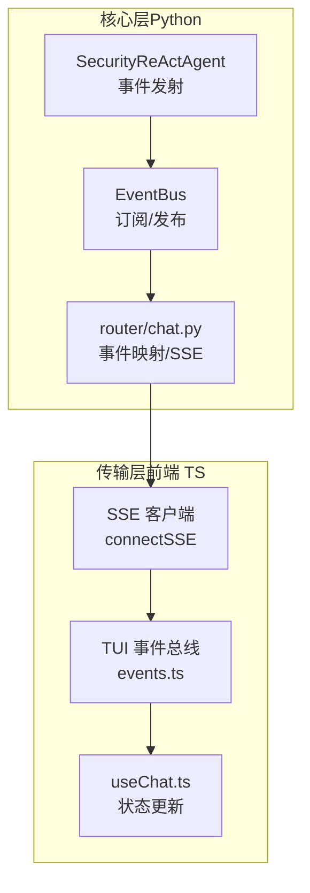
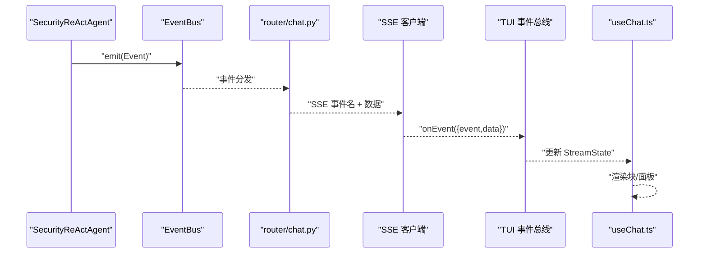
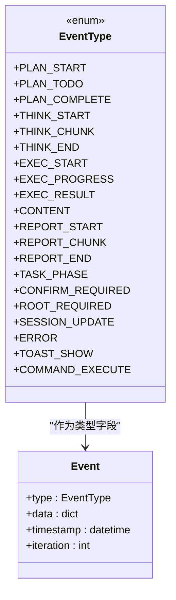
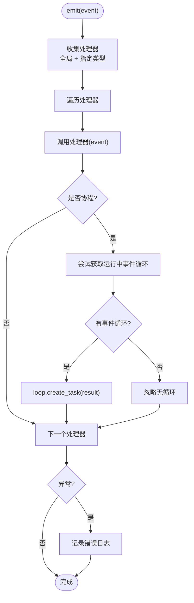
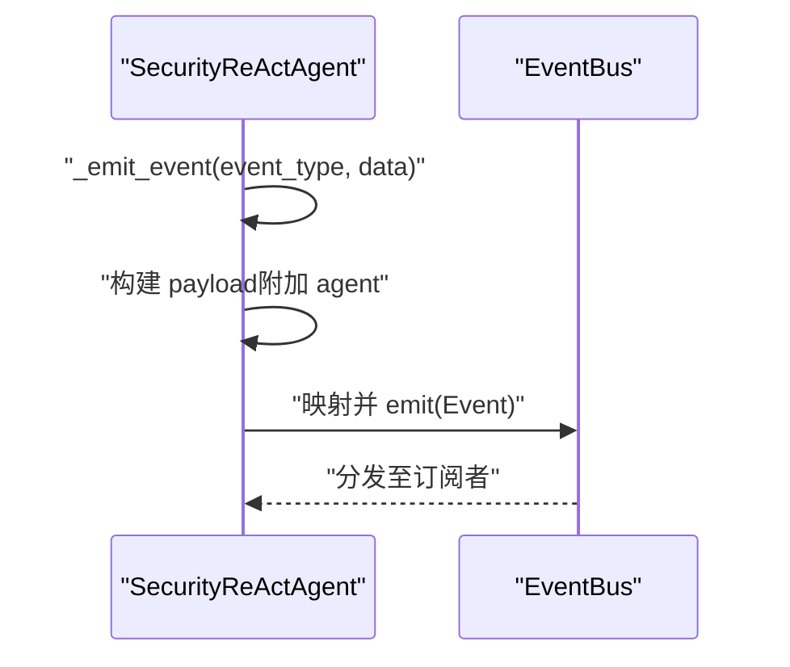
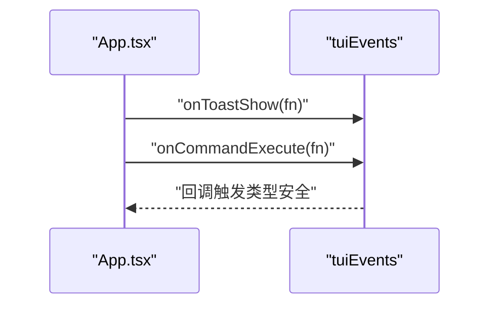
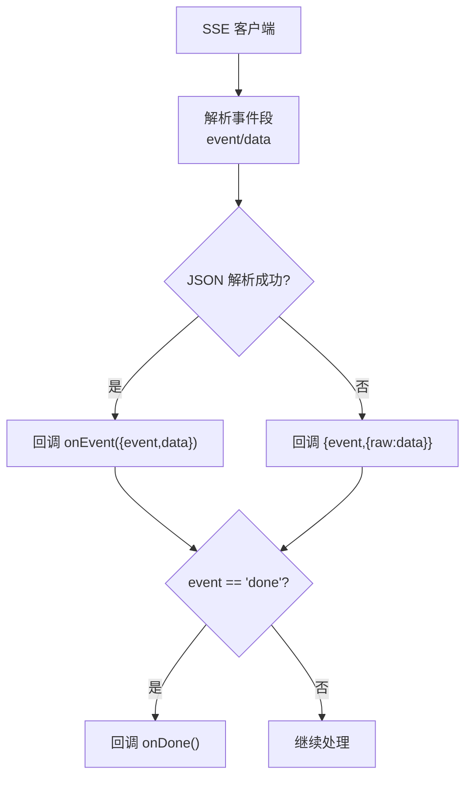
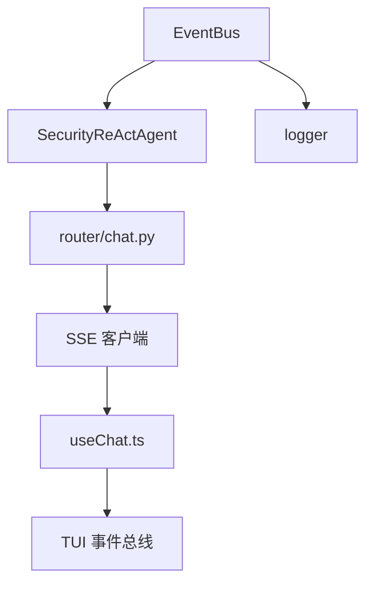

# 事件总线系统

<cite>
**本文档引用的文件**
- [utils/event_bus.py](file://utils/event_bus.py)
- [core/patterns/security_react.py](file://core/patterns/security_react.py)
- [terminal-ui/src/events.ts](file://terminal-ui/src/events.ts)
- [terminal-ui/src/sse.ts](file://terminal-ui/src/sse.ts)
- [terminal-ui/src/useChat.ts](file://terminal-ui/src/useChat.ts)
- [terminal-ui/src/types.ts](file://terminal-ui/src/types.ts)
- [router/chat.py](file://router/chat.py)
- [docs/design-paradigms/session-and-events.md](file://docs/design-paradigms/session-and-events.md)
- [terminal-ui/src/App.tsx](file://terminal-ui/src/App.tsx)
- [utils/logger.py](file://utils/logger.py)
</cite>

## 目录
1. [简介](#简介)
2. [项目结构](#项目结构)
3. [核心组件](#核心组件)
4. [架构总览](#架构总览)
5. [详细组件分析](#详细组件分析)
6. [依赖分析](#依赖分析)
7. [性能考量](#性能考量)
8. [故障排查指南](#故障排查指南)
9. [结论](#结论)
10. [附录](#附录)

## 简介
本文件系统性梳理 Secbot 的事件总线体系，涵盖事件类型定义、订阅与发布机制、异步处理流程、事件路由与分发、序列化与传输协议、性能优化策略、扩展指导以及调试与监控最佳实践。目标是帮助开发者快速理解并高效扩展事件系统。

## 项目结构
事件总线涉及三层协同：
- 核心层（Python）：事件类型与事件总线实现，以及智能体在推理与执行过程中发射事件。
- 传输层（前端 TypeScript）：SSE 客户端解析后桥接至 UI 事件总线，驱动终端 UI 的实时渲染。
- 路由层（Python）：将核心层事件映射为 SSE 事件名，统一输出给前端。

图表来源
- [utils/event_bus.py](file://utils/event_bus.py#L68-L186)
- [core/patterns/security_react.py](file://core/patterns/security_react.py#L227-L277)
- [router/chat.py](file://router/chat.py#L85-L131)
- [terminal-ui/src/sse.ts](file://terminal-ui/src/sse.ts#L33-L133)
- [terminal-ui/src/events.ts](file://terminal-ui/src/events.ts#L49-L91)
- [terminal-ui/src/useChat.ts](file://terminal-ui/src/useChat.ts#L31-L196)

章节来源
- [utils/event_bus.py](file://utils/event_bus.py#L1-L187)
- [core/patterns/security_react.py](file://core/patterns/security_react.py#L142-L279)
- [router/chat.py](file://router/chat.py#L85-L131)
- [terminal-ui/src/sse.ts](file://terminal-ui/src/sse.ts#L1-L134)
- [terminal-ui/src/events.ts](file://terminal-ui/src/events.ts#L1-L92)
- [terminal-ui/src/useChat.ts](file://terminal-ui/src/useChat.ts#L1-L219)

## 核心组件
- 事件类型枚举（EventType）：定义规划、推理、执行、内容、报告、任务阶段、交互控制、UI 反馈等事件类别。
- 事件载体（Event）：包含类型、载荷、时间戳、迭代序号。
- 事件总线（EventBus）：支持同步/异步订阅与发射，内置全局处理器，具备便捷发射方法。
- 事件发射点（SecurityReActAgent）：在规划、推理、执行、观察、报告、错误等节点发射事件。
- 前端事件总线（TuiEvent）：类型安全的事件定义与监听器注册，负责 UI 侧的事件消费。
- SSE 客户端（connectSSE）：解析服务端推送的事件与数据，桥接到前端事件总线。
- 事件映射（router/chat.py）：将核心层事件类型映射为 SSE 事件名，统一输出。

章节来源
- [utils/event_bus.py](file://utils/event_bus.py#L15-L65)
- [core/patterns/security_react.py](file://core/patterns/security_react.py#L227-L277)
- [terminal-ui/src/events.ts](file://terminal-ui/src/events.ts#L18-L52)
- [terminal-ui/src/sse.ts](file://terminal-ui/src/sse.ts#L14-L107)
- [router/chat.py](file://router/chat.py#L85-L131)

## 架构总览
事件从核心智能体产生，经事件总线汇聚，再由路由层映射为 SSE 事件，前端通过 SSE 客户端解析并注入到 TUI 事件总线，最终驱动 UI 组件更新。

图表来源
- [core/patterns/security_react.py](file://core/patterns/security_react.py#L269-L275)
- [utils/event_bus.py](file://utils/event_bus.py#L121-L155)
- [router/chat.py](file://router/chat.py#L85-L131)
- [terminal-ui/src/sse.ts](file://terminal-ui/src/sse.ts#L66-L103)
- [terminal-ui/src/events.ts](file://terminal-ui/src/events.ts#L57-L80)
- [terminal-ui/src/useChat.ts](file://terminal-ui/src/useChat.ts#L78-L184)

## 详细组件分析

### 事件类型与事件载体
- EventType：涵盖规划、推理、执行、内容、报告、任务阶段、交互控制、错误、UI 反馈等。
- Event：统一结构，包含类型、数据字典、时间戳、迭代序号，便于订阅者按类型过滤与处理。

图表来源
- [utils/event_bus.py](file://utils/event_bus.py#L15-L65)

章节来源
- [utils/event_bus.py](file://utils/event_bus.py#L15-L65)

### 事件总线（订阅/发布/异步）
- 订阅：支持按事件类型订阅与全局订阅；支持取消订阅。
- 发射（同步）：依次调用处理器，若处理器返回协程则尝试在当前事件循环中调度。
- 发射（异步）：依次调用处理器，若处理器返回协程则 await。
- 便捷方法：emit_simple / emit_simple_async，简化常用发射场景。
- 错误处理：捕获处理器异常并记录日志，避免中断其他处理器执行。

图表来源
- [utils/event_bus.py](file://utils/event_bus.py#L121-L138)

章节来源
- [utils/event_bus.py](file://utils/event_bus.py#L68-L186)

### 事件发射点（SecurityReActAgent）
- 在规划、推理、执行、观察、报告、错误等关键节点发射事件。
- 事件类型映射：将内部事件类型映射为核心层 EventType，确保前后端一致性。
- 附加信息：自动为事件附加 agent 标识，便于 UI 识别来源。

图表来源
- [core/patterns/security_react.py](file://core/patterns/security_react.py#L227-L277)

章节来源
- [core/patterns/security_react.py](file://core/patterns/security_react.py#L227-L277)

### 前端事件总线与 UI 集成
- TuiEvent：定义类型安全的事件与载荷校验函数，提供 onXxx 与 emitXxx 方法。
- tuiEvents：封装订阅与发布，内部进行载荷解析与异常吞吐，保证健壮性。
- App.tsx：在应用启动时订阅 toast/show 与 command/execute 事件，驱动 UI 交互。

图表来源
- [terminal-ui/src/events.ts](file://terminal-ui/src/events.ts#L57-L80)
- [terminal-ui/src/App.tsx](file://terminal-ui/src/App.tsx#L57-L66)

章节来源
- [terminal-ui/src/events.ts](file://terminal-ui/src/events.ts#L1-L92)
- [terminal-ui/src/App.tsx](file://terminal-ui/src/App.tsx#L1-L200)

### SSE 客户端与事件映射
- connectSSE：解析服务端推送的事件段，将数据 JSON 解析后回调 onEvent；支持 done 事件与连接超时。
- useChat：基于 SSE 事件更新 StreamState，驱动 UI 渲染（规划、思考、执行、内容、报告、阶段、错误、响应等）。
- router/chat.py：将核心层 EventType 映射为 SSE 事件名（如 planning/content/thought/action_* 等），并携带 agent 标识。

图表来源
- [terminal-ui/src/sse.ts](file://terminal-ui/src/sse.ts#L14-L107)
- [terminal-ui/src/useChat.ts](file://terminal-ui/src/useChat.ts#L78-L184)
- [router/chat.py](file://router/chat.py#L85-L131)

章节来源
- [terminal-ui/src/sse.ts](file://terminal-ui/src/sse.ts#L1-L134)
- [terminal-ui/src/useChat.ts](file://terminal-ui/src/useChat.ts#L1-L219)
- [router/chat.py](file://router/chat.py#L85-L131)

## 依赖分析
- 核心层依赖：EventBus 与 EventType 是事件系统的核心，SecurityReActAgent 通过事件总线与 UI 解耦。
- 传输层依赖：SSE 客户端依赖前端 fetch 与 ReadableStream，useChat 依赖 SSE 事件更新状态。
- 路由层依赖：router/chat.py 将核心层事件映射为 SSE 事件名，确保前后端契约一致。
- 日志依赖：EventBus 在处理器异常时记录日志，便于问题定位。

图表来源
- [utils/event_bus.py](file://utils/event_bus.py#L121-L155)
- [core/patterns/security_react.py](file://core/patterns/security_react.py#L269-L275)
- [router/chat.py](file://router/chat.py#L85-L131)
- [terminal-ui/src/sse.ts](file://terminal-ui/src/sse.ts#L33-L133)
- [terminal-ui/src/useChat.ts](file://terminal-ui/src/useChat.ts#L31-L196)
- [utils/logger.py](file://utils/logger.py#L1-L50)

章节来源
- [utils/event_bus.py](file://utils/event_bus.py#L1-L187)
- [core/patterns/security_react.py](file://core/patterns/security_react.py#L142-L279)
- [router/chat.py](file://router/chat.py#L85-L131)
- [terminal-ui/src/sse.ts](file://terminal-ui/src/sse.ts#L1-L134)
- [terminal-ui/src/useChat.ts](file://terminal-ui/src/useChat.ts#L1-L219)
- [utils/logger.py](file://utils/logger.py#L1-L50)

## 性能考量
- 异步处理：EventBus 在同步发射时检测协程并尝试调度，避免阻塞主流程；异步发射时 await 协程，确保顺序与一致性。
- 事件过滤：按事件类型订阅，减少无关事件处理开销；全局处理器用于日志与监控，避免在业务处理器中重复处理。
- SSE 流式解析：前端按段解析，及时回调，降低内存占用；done 事件用于结束信号，避免资源泄漏。
- 日志级别：日志模块在初始化阶段限制控制台级别，避免大量日志影响性能，文件日志持续记录便于事后分析。

章节来源
- [utils/event_bus.py](file://utils/event_bus.py#L121-L155)
- [terminal-ui/src/sse.ts](file://terminal-ui/src/sse.ts#L96-L123)
- [utils/logger.py](file://utils/logger.py#L13-L31)

## 故障排查指南
- 处理器异常：EventBus 捕获处理器异常并记录日志，不影响其他处理器执行。检查日志以定位具体异常事件类型。
- SSE 连接问题：connectSSE 提供连接超时与错误回调，检查后端服务状态与 SECBOT_API_URL 配置。
- 事件映射不一致：核对 router/chat.py 的事件映射表，确保核心层 EventType 与 SSE 事件名一致。
- UI 事件未触发：确认前端 TuiEvent 的定义与 onXxx 订阅是否正确，检查载荷校验逻辑。
- 事件丢失：检查 EventBus 的订阅与取消订阅逻辑，避免重复取消或遗漏订阅。

章节来源
- [utils/event_bus.py](file://utils/event_bus.py#L137-L138)
- [terminal-ui/src/sse.ts](file://terminal-ui/src/sse.ts#L84-L129)
- [router/chat.py](file://router/chat.py#L85-L131)
- [terminal-ui/src/events.ts](file://terminal-ui/src/events.ts#L57-L80)

## 结论
Secbot 的事件总线通过核心层事件类型与 EventBus、路由层事件映射、前端 SSE 客户端与 TUI 事件总线形成闭环，实现了核心逻辑与 UI 的彻底解耦。系统支持同步与异步处理器，具备良好的扩展性与可观测性。遵循本文档的扩展与调试建议，可进一步提升事件系统的稳定性与性能。

## 附录

### 事件类型与映射速查
- 规划：planning -> content
- 推理：thought_start/thought_chunk/thought_end -> think_start/think_chunk/think_end
- 执行：action_start/action_result -> exec_start/exec_result
- 观察：observation/content -> content
- 报告：report -> report_end
- 错误：error -> error

章节来源
- [core/patterns/security_react.py](file://core/patterns/security_react.py#L253-L265)
- [router/chat.py](file://router/chat.py#L85-L131)

### 扩展指导
- 自定义事件类型：在 EventType 中新增枚举值，并在 SecurityReActAgent 中按需发射；在 router/chat.py 中添加映射。
- 自定义事件处理器：在 EventBus 中订阅相应事件类型；若为异步任务，确保返回协程并在 emit_async 中 await。
- 自定义事件中间件：通过全局处理器（subscribe_all）实现横切关注点（如日志、指标、限流），注意异常处理与性能影响。

章节来源
- [utils/event_bus.py](file://utils/event_bus.py#L96-L98)
- [docs/design-paradigms/session-and-events.md](file://docs/design-paradigms/session-and-events.md#L16-L22)