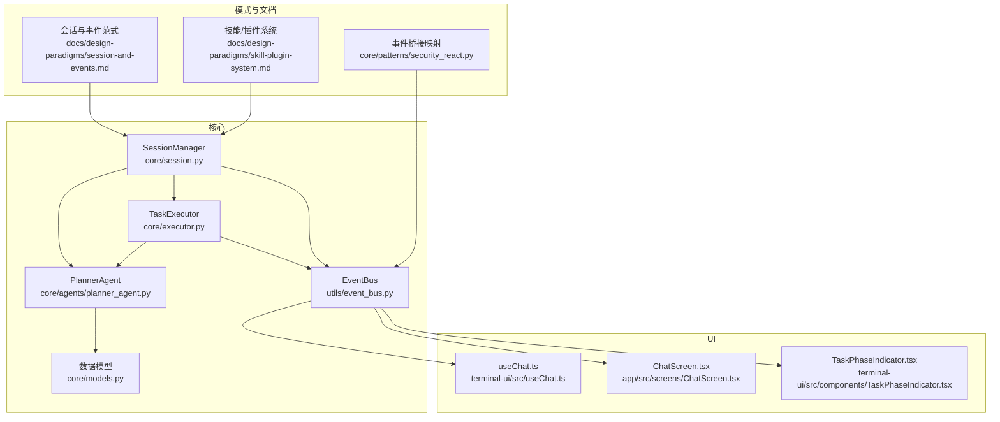
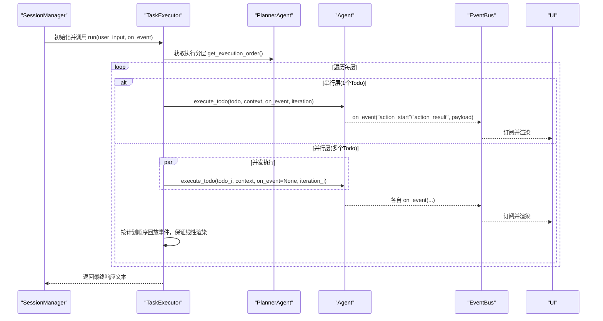
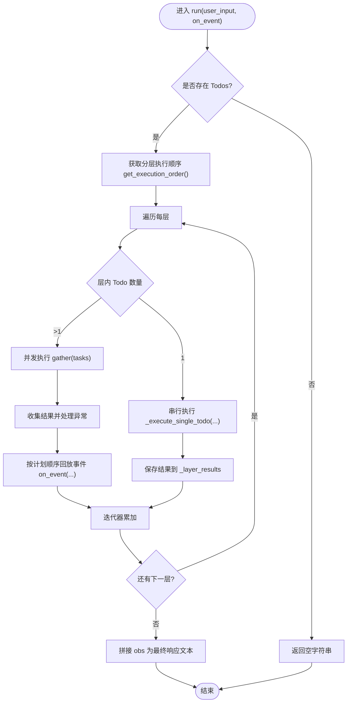
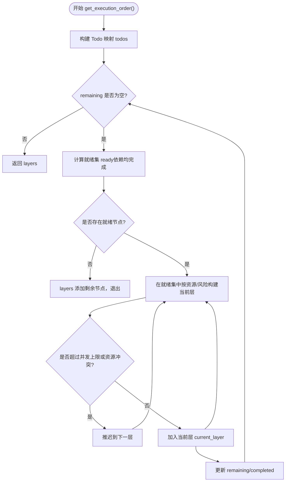
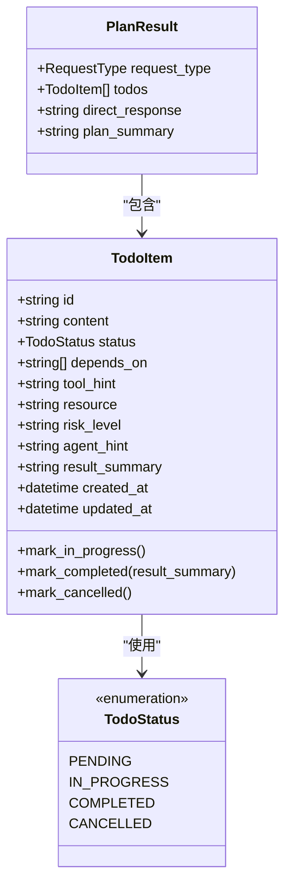
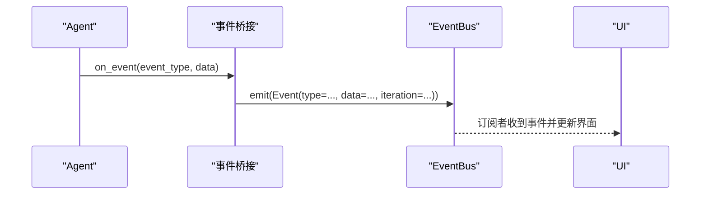
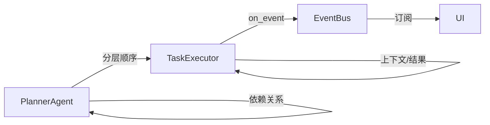

# 任务执行器

<cite>
**本文档引用的文件**
- [core/executor.py](file://core/executor.py)
- [core/models.py](file://core/models.py)
- [core/agents/planner_agent.py](file://core/agents/planner_agent.py)
- [utils/event_bus.py](file://utils/event_bus.py)
- [core/session.py](file://core/session.py)
- [docs/design-paradigms/session-and-events.md](file://docs/design-paradigms/session-and-events.md)
- [docs/design-paradigms/skill-plugin-system.md](file://docs/design-paradigms/skill-plugin-system.md)
- [core/patterns/security_react.py](file://core/patterns/security_react.py)
- [terminal-ui/src/components/TaskPhaseIndicator.tsx](file://terminal-ui/src/components/TaskPhaseIndicator.tsx)
- [terminal-ui/src/useChat.ts](file://terminal-ui/src/useChat.ts)
- [app/src/screens/ChatScreen.tsx](file://app/src/screens/ChatScreen.tsx)
</cite>

## 目录
1. [引言](#引言)
2. [项目结构](#项目结构)
3. [核心组件](#核心组件)
4. [架构总览](#架构总览)
5. [详细组件分析](#详细组件分析)
6. [依赖关系分析](#依赖关系分析)
7. [性能考虑](#性能考虑)
8. [故障排查指南](#故障排查指南)
9. [结论](#结论)
10. [附录](#附录)

## 引言
本文件面向开发者与运维人员，系统化阐述任务执行器 TaskExecutor 的设计理念、执行策略与工程实践，覆盖任务调度算法、并行/串行控制、生命周期管理、依赖关系处理、性能优化、安全控制以及扩展指引。文档以代码为依据，结合 UI 事件驱动设计，帮助读者正确使用与扩展任务执行功能。

## 项目结构
围绕任务执行的关键模块与文件如下：
- 核心执行器：core/executor.py
- 数据模型：core/models.py（包含 TodoItem、PlanResult 等）
- 规划器与依赖分层：core/agents/planner_agent.py
- 事件总线：utils/event_bus.py
- 会话编排入口：core/session.py
- UI 事件映射与展示：terminal-ui/src/useChat.ts、app/src/screens/ChatScreen.tsx、terminal-ui/src/components/TaskPhaseIndicator.tsx
- 设计范式参考：docs/design-paradigms/session-and-events.md、docs/design-paradigms/skill-plugin-system.md
- 事件桥接与映射：core/patterns/security_react.py

图表来源
- [core/executor.py](file://core/executor.py#L1-L179)
- [core/models.py](file://core/models.py#L1-L137)
- [core/agents/planner_agent.py](file://core/agents/planner_agent.py#L1-L837)
- [utils/event_bus.py](file://utils/event_bus.py#L1-L187)
- [core/session.py](file://core/session.py#L312-L399)
- [docs/design-paradigms/session-and-events.md](file://docs/design-paradigms/session-and-events.md#L16-L28)
- [docs/design-paradigms/skill-plugin-system.md](file://docs/design-paradigms/skill-plugin-system.md#L1-L42)
- [core/patterns/security_react.py](file://core/patterns/security_react.py#L253-L279)
- [terminal-ui/src/useChat.ts](file://terminal-ui/src/useChat.ts#L145-L179)
- [app/src/screens/ChatScreen.tsx](file://app/src/screens/ChatScreen.tsx#L101-L142)
- [terminal-ui/src/components/TaskPhaseIndicator.tsx](file://terminal-ui/src/components/TaskPhaseIndicator.tsx#L42-L95)

章节来源
- [core/executor.py](file://core/executor.py#L1-L179)
- [core/models.py](file://core/models.py#L1-L137)
- [core/agents/planner_agent.py](file://core/agents/planner_agent.py#L1-L837)
- [utils/event_bus.py](file://utils/event_bus.py#L1-L187)
- [core/session.py](file://core/session.py#L312-L399)
- [docs/design-paradigms/session-and-events.md](file://docs/design-paradigms/session-and-events.md#L16-L28)
- [docs/design-paradigms/skill-plugin-system.md](file://docs/design-paradigms/skill-plugin-system.md#L1-L42)
- [core/patterns/security_react.py](file://core/patterns/security_react.py#L253-L279)
- [terminal-ui/src/useChat.ts](file://terminal-ui/src/useChat.ts#L145-L179)
- [app/src/screens/ChatScreen.tsx](file://app/src/screens/ChatScreen.tsx#L101-L142)
- [terminal-ui/src/components/TaskPhaseIndicator.tsx](file://terminal-ui/src/components/TaskPhaseIndicator.tsx#L42-L95)

## 核心组件
- 任务执行器 TaskExecutor：按 PlannerAgent 的分层执行顺序，逐层串行或并行执行 Todo，聚合结果并推送事件，支持线性流式渲染。
- 规划器 PlannerAgent：根据依赖关系与资源/风险约束生成分层执行序列，兼顾安全并发与全局并发上限。
- 数据模型：TodoItem、PlanResult 等，承载任务元数据、状态与依赖关系。
- 事件总线 EventBus：统一事件类型与结构，解耦核心与 UI，支持同步/异步发射与全局订阅。
- 会话编排 SessionManager：在有计划步骤且 Agent 支持 execute_todo 时，使用 TaskExecutor；否则回退到 ReAct 流程；并提供并发锁保护。
- UI 事件映射与展示：将底层事件映射为 UI 可感知的任务阶段、内容流与错误反馈。

章节来源
- [core/executor.py](file://core/executor.py#L17-L179)
- [core/agents/planner_agent.py](file://core/agents/planner_agent.py#L180-L248)
- [core/models.py](file://core/models.py#L23-L80)
- [utils/event_bus.py](file://utils/event_bus.py#L68-L187)
- [core/session.py](file://core/session.py#L335-L399)
- [core/patterns/security_react.py](file://core/patterns/security_react.py#L253-L279)

## 架构总览
任务执行的端到端流程：
- SessionManager 根据 Agent 能力选择 TaskExecutor 或 ReAct 流程。
- TaskExecutor 从 PlannerAgent 获取分层执行顺序，逐层执行 Todo。
- 执行期间通过 on_event 回调桥接至 EventBus，UI 订阅事件并渲染。
- 执行完成后聚合结果，返回最终响应文本。

图表来源
- [core/session.py](file://core/session.py#L355-L387)
- [core/executor.py](file://core/executor.py#L46-L133)
- [core/agents/planner_agent.py](file://core/agents/planner_agent.py#L180-L248)
- [utils/event_bus.py](file://utils/event_bus.py#L121-L181)
- [core/patterns/security_react.py](file://core/patterns/security_react.py#L253-L279)

## 详细组件分析

### 任务执行器 TaskExecutor
- 设计理念
  - 分层执行：依据 PlannerAgent 的分层顺序，单 Todo 串行、多 Todo 并行，兼顾安全性与吞吐。
  - 事件驱动：每完成一个任务即推送事件，支持线性流式渲染与 UI 即时反馈。
  - 上下文聚合：按 todo_id 与资源维度聚合历史结果，供后续步骤引用。
- 关键流程
  - run(user_input, on_event)：遍历分层，串行或并行执行；并行时使用 asyncio.gather 收集结果并按计划顺序回放事件。
  - _execute_single_todo(todo, user_input, iteration, on_event, emit_events)：构造上下文（by_todo 与 _by_resource_），调用 Agent.execute_todo 并返回标准化结果。
- 并发控制
  - 串行层：单任务顺序执行，确保状态一致性。
  - 并行层：使用 gather 并发执行，但通过 on_event 的回放顺序保证 UI 渲染线性。
- 安全与健壮性
  - 异常捕获：并行 gather 中对异常进行包装与记录，保证整体执行不中断。
  - 事件回放：即使并发完成，也按计划顺序回放事件，避免 UI 乱序。
- 生命周期与结果聚合
  - 每层结果保存在 _layer_results 中，按 todo.id 聚合，便于后续步骤使用。
  - 最终将各任务的 obs 拼接为响应文本返回。

图表来源
- [core/executor.py](file://core/executor.py#L46-L133)
- [core/executor.py](file://core/executor.py#L135-L179)

章节来源
- [core/executor.py](file://core/executor.py#L17-L179)

### 规划器 PlannerAgent 与依赖分层
- 依赖图与拓扑排序
  - 通过计算“就绪集”（依赖均已完成的节点集合），实现拓扑分层。
  - 若出现环或非法依赖，退化为一次性取出剩余节点，保证执行不阻塞。
- 并发安全控制
  - 在同一层内，同一资源上的高风险任务（risk_level="high"）强制串行，避免对同一资源的高危并发操作。
  - 全局并发上限由 max_parallel_per_layer 控制，防止过度并发。
- 输出
  - 返回分层列表，内层元素为可并行的 Todo id 列表。

图表来源
- [core/agents/planner_agent.py](file://core/agents/planner_agent.py#L180-L248)

章节来源
- [core/agents/planner_agent.py](file://core/agents/planner_agent.py#L180-L248)

### 数据模型与任务生命周期
- TodoItem
  - 字段：id、content、status、depends_on、tool_hint、resource、risk_level、agent_hint、result_summary 等。
  - 方法：状态变更（进行中/完成/取消）与时间戳更新。
- PlanResult
  - 字段：request_type、todos、direct_response、plan_summary。
- 生命周期管理
  - 创建：由 PlannerAgent 生成并填充元数据（resource、risk_level、agent_hint）。
  - 状态跟踪：PlannerAgent.update_todo 与 Agent.execute_todo 配合，实时更新状态与摘要。
  - 进度监控：通过 on_event 与 EventBus 推送执行阶段与结果，UI 订阅渲染。
  - 结果聚合：TaskExecutor 聚合 by_todo 与 _by_resource_，供后续步骤按资产维度引用。

图表来源
- [core/models.py](file://core/models.py#L23-L80)

章节来源
- [core/models.py](file://core/models.py#L15-L137)

### 事件总线 EventBus 与 UI 映射
- 事件类型
  - 规划、推理、执行、内容、报告、任务阶段、交互控制、UI 反馈等。
- 发射方式
  - 同步 emit 与异步 emit_async，支持同步/异步处理器。
- UI 映射
  - 通过事件桥接将 Agent 的 on_event 映射为 EventBus 事件，UI 订阅并渲染。
  - 任务阶段（task_phase）与内容流（content、report、error）由 UI 组件消费。

图表来源
- [utils/event_bus.py](file://utils/event_bus.py#L121-L181)
- [core/patterns/security_react.py](file://core/patterns/security_react.py#L253-L279)
- [terminal-ui/src/useChat.ts](file://terminal-ui/src/useChat.ts#L145-L179)
- [app/src/screens/ChatScreen.tsx](file://app/src/screens/ChatScreen.tsx#L131-L179)

章节来源
- [utils/event_bus.py](file://utils/event_bus.py#L15-L187)
- [core/patterns/security_react.py](file://core/patterns/security_react.py#L253-L279)
- [terminal-ui/src/useChat.ts](file://terminal-ui/src/useChat.ts#L145-L179)
- [app/src/screens/ChatScreen.tsx](file://app/src/screens/ChatScreen.tsx#L101-L179)

### 会话编排与并发保护
- 选择策略
  - 若存在计划步骤且 Agent 支持 execute_todo，则使用 TaskExecutor；否则回退到 ReAct 流程。
- 并发保护
  - 若 Agent 定义了并发锁（_concurrency_lock），则在锁内串行执行整个任务，避免多个请求并发打在同一个 Agent 上。
- 事件桥接
  - 将 Agent 的 on_event 回调转发到 EventBus，并自动更新当前工具结果与 Todo 状态。

章节来源
- [core/session.py](file://core/session.py#L335-L399)

## 依赖关系分析
- 组件耦合
  - TaskExecutor 依赖 PlannerAgent 的分层顺序与 PlannerAgent 依赖 TodoItem 的依赖关系。
  - 事件桥接贯穿 Agent、EventBus 与 UI，形成松耦合的观察者模式。
- 外部依赖
  - asyncio.gather 用于并行执行；EventBus 支持异步处理器。
- 潜在循环依赖
  - 通过 on_event 的回放顺序避免 UI 侧的循环依赖；规划器的退化逻辑避免拓扑环导致的死循环。

图表来源
- [core/agents/planner_agent.py](file://core/agents/planner_agent.py#L180-L248)
- [core/executor.py](file://core/executor.py#L46-L133)
- [utils/event_bus.py](file://utils/event_bus.py#L68-L187)

章节来源
- [core/agents/planner_agent.py](file://core/agents/planner_agent.py#L180-L248)
- [core/executor.py](file://core/executor.py#L46-L133)
- [utils/event_bus.py](file://utils/event_bus.py#L68-L187)

## 性能考虑
- 并发控制
  - 使用 max_parallel_per_layer 控制每层最大并发，避免资源争用与过载。
  - 高风险任务在同一资源上强制串行，降低失败概率与资源竞争。
- 资源分配
  - 按资源维度聚合结果（_by_resource_），减少跨资源重复查询。
- 负载均衡
  - 通过拓扑分层与资源/风险约束，使任务在时间轴上更均匀分布。
- I/O 与事件开销
  - 并行执行时注意事件回放的顺序成本，确保 UI 渲染线性的同时尽量减少不必要的事件风暴。

[本节为通用性能建议，无需特定文件引用]

## 故障排查指南
- 并行异常处理
  - 并行 gather 中的异常会被包装为结果，记录错误日志并返回标准化错误对象，避免整体执行中断。
- 循环依赖与非法依赖
  - 规划器在找不到就绪节点时退化为一次性取出剩余节点，保证执行继续。
- 事件丢失或乱序
  - TaskExecutor 在并行完成后按计划顺序回放事件，确保 UI 渲染线性。
- UI 无反馈
  - 检查 EventBus 订阅与事件桥接映射是否正确，确认 UI 组件订阅了相应事件类型。

章节来源
- [core/executor.py](file://core/executor.py#L90-L131)
- [core/agents/planner_agent.py](file://core/agents/planner_agent.py#L210-L213)
- [core/patterns/security_react.py](file://core/patterns/security_react.py#L253-L279)

## 结论
TaskExecutor 以分层思想为核心，结合 PlannerAgent 的拓扑分层与安全并发控制，实现了高效、可控、可观测的任务执行体系。通过 EventBus 的事件驱动设计，前端 UI 能够实时感知任务阶段与结果，提升用户体验。在性能方面，通过并发上限与资源维度聚合，平衡吞吐与稳定性；在安全方面，高风险任务的串行化与异常处理保障了执行的可靠性。扩展层面，可通过自定义 Agent 的 execute_todo、增加新的事件类型与 UI 组件，进一步丰富执行器能力。

[本节为总结性内容，无需特定文件引用]

## 附录

### 使用示例与最佳实践
- 使用 TaskExecutor 的典型流程
  - 会话编排：SessionManager 在具备计划步骤且 Agent 支持 execute_todo 时，创建 TaskExecutor 并调用 run。
  - 事件桥接：通过 on_event 将 Agent 的执行事件映射到 EventBus，UI 订阅渲染。
  - 并发保护：若 Agent 定义并发锁，使用锁内串行执行，避免资源竞争。
- 最佳实践
  - 在 TodoItem 中合理设置 depends_on、resource、risk_level，确保规划器能生成安全的分层顺序。
  - 在 Agent.execute_todo 中规范返回结构化结果（success、obs、result、tool、params），便于 UI 与聚合。
  - 为高风险任务设置高风险等级，避免与同类任务在同一层并发执行。
  - 使用 EventBus 的异步发射能力，确保 UI 无阻塞更新。

章节来源
- [core/session.py](file://core/session.py#L355-L399)
- [core/executor.py](file://core/executor.py#L135-L179)
- [utils/event_bus.py](file://utils/event_bus.py#L144-L181)

### 扩展指导
- 自定义执行策略
  - 在 Agent 中实现 execute_todo 接口，遵循 TaskExecutor 的回调签名，确保 on_event 与 iteration 参数正确传递。
  - 如需全局串行化，可在 Agent 上定义并发锁属性，由 SessionManager 在执行时自动加锁。
- 任务类型扩展
  - 在 TodoItem 中新增字段（如自定义元数据），并在 PlannerAgent 的元数据推断逻辑中补充映射。
- 执行器插件开发
  - 参考技能/插件系统范式，通过钩子在 Agent 处理前后注入增强逻辑，不侵入核心执行流程。
- UI 事件扩展
  - 在 EventBus 中新增事件类型，UI 组件订阅并渲染新事件；或在事件桥接层映射新的事件类型。

章节来源
- [docs/design-paradigms/skill-plugin-system.md](file://docs/design-paradigms/skill-plugin-system.md#L30-L42)
- [core/session.py](file://core/session.py#L351-L354)
- [utils/event_bus.py](file://utils/event_bus.py#L15-L53)