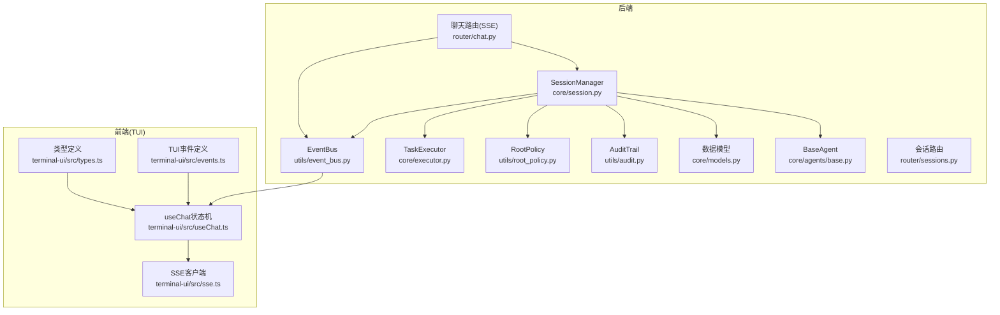
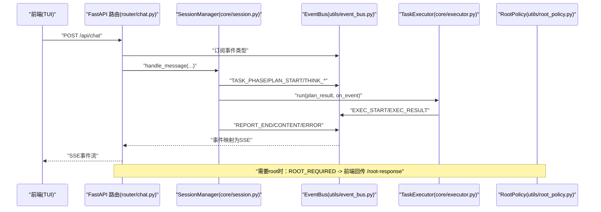
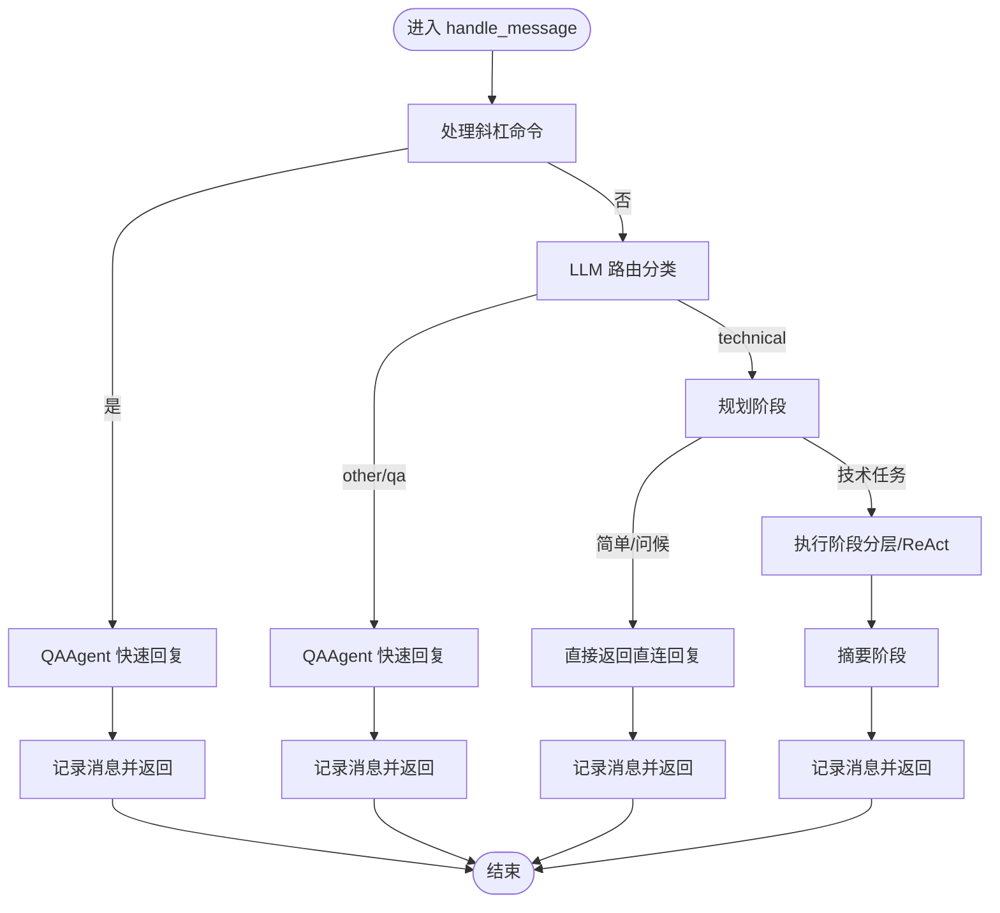
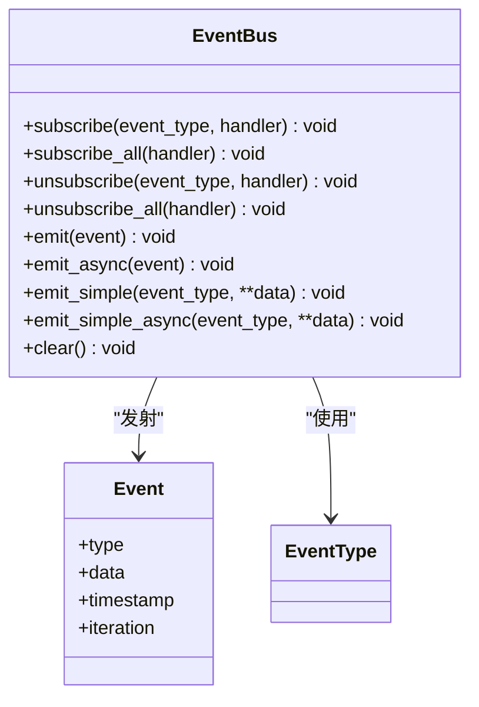
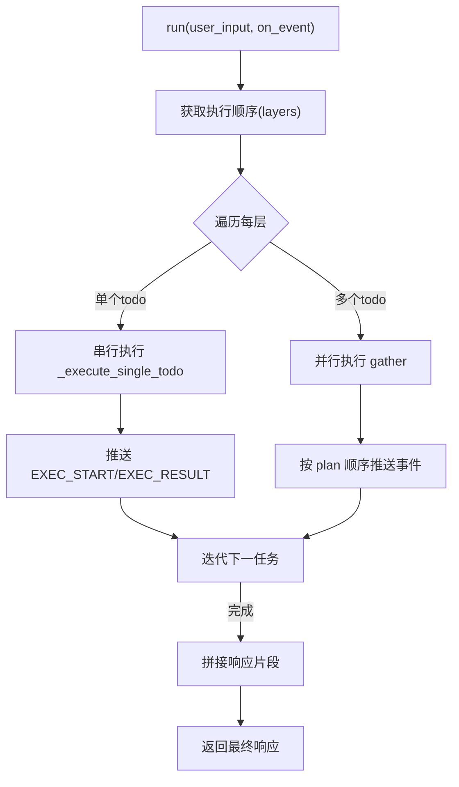
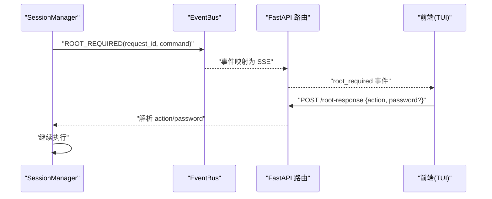
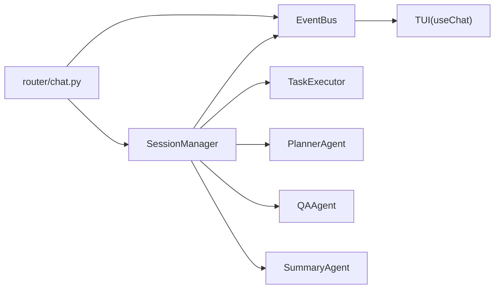

# 会话与事件系统

<cite>
**本文引用的文件**
- [core/session.py](file://core/session.py)
- [utils/event_bus.py](file://utils/event_bus.py)
- [core/executor.py](file://core/executor.py)
- [utils/root_policy.py](file://utils/root_policy.py)
- [utils/audit.py](file://utils/audit.py)
- [router/chat.py](file://router/chat.py)
- [router/sessions.py](file://router/sessions.py)
- [terminal-ui/src/events.ts](file://terminal-ui/src/events.ts)
- [terminal-ui/src/types.ts](file://terminal-ui/src/types.ts)
- [terminal-ui/src/useChat.ts](file://terminal-ui/src/useChat.ts)
- [terminal-ui/src/sse.ts](file://terminal-ui/src/sse.ts)
- [core/models.py](file://core/models.py)
- [core/agents/base.py](file://core/agents/base.py)
</cite>

## 目录
1. [引言](#引言)
2. [项目结构](#项目结构)
3. [核心组件](#核心组件)
4. [架构总览](#架构总览)
5. [详细组件分析](#详细组件分析)
6. [依赖分析](#依赖分析)
7. [性能考虑](#性能考虑)
8. [故障排除指南](#故障排除指南)
9. [结论](#结论)
10. [附录](#附录)

## 引言
本文件系统性阐述 Secbot 的会话与事件系统，涵盖会话管理、消息历史、状态持久化策略；事件总线的事件类型、订阅与发布、异步事件处理；任务执行器的分层调度与并行控制；根权限策略与安全控制；以及扩展与优化实践。文档同时提供可视化图示与分层讲解，兼顾技术深度与可读性。

## 项目结构
围绕会话与事件系统的关键模块分布如下：
- 后端核心
  - 会话编排与交互：core/session.py
  - 事件总线：utils/event_bus.py
  - 任务执行器：core/executor.py
  - 根权限策略：utils/root_policy.py
  - 审计留痕：utils/audit.py
  - 数据模型：core/models.py
  - 基础智能体：core/agents/base.py
- 路由与接口
  - 聊天 SSE 接口：router/chat.py
  - 会话列表接口：router/sessions.py
- 终端 UI（TUI）
  - 事件定义与总线：terminal-ui/src/events.ts
  - 类型定义：terminal-ui/src/types.ts
  - SSE 连接与状态管理：terminal-ui/src/useChat.ts、terminal-ui/src/sse.ts

图表来源
- [core/session.py](file://core/session.py#L32-L422)
- [utils/event_bus.py](file://utils/event_bus.py#L68-L186)
- [core/executor.py](file://core/executor.py#L17-L179)
- [utils/root_policy.py](file://utils/root_policy.py#L18-L54)
- [utils/audit.py](file://utils/audit.py#L12-L105)
- [router/chat.py](file://router/chat.py#L27-L329)
- [router/sessions.py](file://router/sessions.py#L12-L21)
- [terminal-ui/src/events.ts](file://terminal-ui/src/events.ts#L18-L92)
- [terminal-ui/src/types.ts](file://terminal-ui/src/types.ts#L4-L75)
- [terminal-ui/src/useChat.ts](file://terminal-ui/src/useChat.ts#L31-L219)
- [terminal-ui/src/sse.ts](file://terminal-ui/src/sse.ts#L49-L85)

章节来源
- [core/session.py](file://core/session.py#L32-L422)
- [utils/event_bus.py](file://utils/event_bus.py#L68-L186)
- [core/executor.py](file://core/executor.py#L17-L179)
- [utils/root_policy.py](file://utils/root_policy.py#L18-L54)
- [utils/audit.py](file://utils/audit.py#L12-L105)
- [router/chat.py](file://router/chat.py#L27-L329)
- [router/sessions.py](file://router/sessions.py#L12-L21)
- [terminal-ui/src/events.ts](file://terminal-ui/src/events.ts#L18-L92)
- [terminal-ui/src/types.ts](file://terminal-ui/src/types.ts#L4-L75)
- [terminal-ui/src/useChat.ts](file://terminal-ui/src/useChat.ts#L31-L219)
- [terminal-ui/src/sse.ts](file://terminal-ui/src/sse.ts#L49-L85)

## 核心组件
- 会话管理器（SessionManager）
  - 职责：创建/切换/列举会话；路由与 QA 快速通道；规划-执行-摘要三阶段编排；事件桥接与 UI 通知；消息历史维护。
  - 关键点：支持强制 QA、强制 Agent 流程、仅规划模式；事件桥接将 Agent 的 on_event 转发到 EventBus，并自动更新 Todo 状态。
- 事件总线（EventBus）
  - 职责：事件类型枚举、订阅/取消订阅、同步/异步发射、全局处理器；支撑前端 TUI 的实时渲染。
  - 关键点：提供 emit_simple/emit_simple_async 便捷方法；支持协程处理器的异步调度。
- 任务执行器（TaskExecutor）
  - 职责：按 Planner 的执行顺序分层调度；串行层与并行层混合执行；结果聚合与事件推送；保证线性渲染。
- 根权限策略（RootPolicy）
  - 职责：持久化 root 策略（ask/always_allow）与命令前缀（默认 sudo）；在需要 root 时暂停并等待用户确认。
- 审计留痕（AuditTrail）
  - 职责：记录 ReAct 步骤（thought/action/observation/confirm/reject/result）到内存缓存与数据库；导出 Markdown 报告。
- 路由与接口
  - 聊天 SSE 接口：将 EventBus 事件映射为 SSE 事件，驱动前端流式渲染；支持 root_required 交互。
  - 会话路由：当前后端为无状态，会话由 TUI 本地管理，接口返回空列表说明。
- 终端 UI（TUI）
  - 事件定义与类型安全；SSE 客户端解析与状态机；useChat 管理流状态、历史快照与中断。

章节来源
- [core/session.py](file://core/session.py#L32-L422)
- [utils/event_bus.py](file://utils/event_bus.py#L15-L186)
- [core/executor.py](file://core/executor.py#L17-L179)
- [utils/root_policy.py](file://utils/root_policy.py#L18-L54)
- [utils/audit.py](file://utils/audit.py#L12-L105)
- [router/chat.py](file://router/chat.py#L27-L329)
- [router/sessions.py](file://router/sessions.py#L12-L21)
- [terminal-ui/src/events.ts](file://terminal-ui/src/events.ts#L18-L92)
- [terminal-ui/src/types.ts](file://terminal-ui/src/types.ts#L4-L75)
- [terminal-ui/src/useChat.ts](file://terminal-ui/src/useChat.ts#L31-L219)
- [terminal-ui/src/sse.ts](file://terminal-ui/src/sse.ts#L49-L85)

## 架构总览
整体交互链路：前端通过 SSE 连接后端聊天接口，后端在 SessionManager 中完成消息编排，期间通过 EventBus 将规划、推理、执行、内容、报告、任务阶段、错误等事件推送到前端；当需要 root 权限时，后端发出 root_required，前端弹窗并回传选择与密码，后端继续执行。

图表来源
- [router/chat.py](file://router/chat.py#L134-L271)
- [core/session.py](file://core/session.py#L139-L422)
- [utils/event_bus.py](file://utils/event_bus.py#L68-L186)
- [core/executor.py](file://core/executor.py#L46-L179)
- [utils/root_policy.py](file://utils/root_policy.py#L18-L54)

## 详细组件分析

### 会话管理器（SessionManager）
- 设计理念
  - 以“路由-规划-执行-摘要”为主线的交互编排，支持 QA 快速通道与技术链路；通过 EventBus 解耦 UI 与 Agent。
  - 会话生命周期管理：创建、切换、列举；消息历史维护；当前轮次工具结果聚合供摘要阶段使用。
- 关键流程
  - 消息处理主流程：统一处理斜杠命令；路由分类（other/qa/technical）；规划阶段；执行阶段（分层执行器或 ReAct 循环）；摘要阶段。
  - 事件桥接：将 Agent 的 on_event 转发为 EventBus 事件，自动更新 Todo 状态；格式化脚本信息；映射工具名到阶段标签。
- 并发与锁
  - 若 Agent 定义并发锁，则在锁内串行执行，避免并发打在同一个 Agent 上。
- 摘要与上下文
  - 汇总 ReAct 历史与工具结果，生成结构化摘要；将摘要写入 Agent 的会话上下文，供后续任务参考。

图表来源
- [core/session.py](file://core/session.py#L139-L422)

章节来源
- [core/session.py](file://core/session.py#L32-L422)

### 事件总线（EventBus）
- 事件类型
  - 规划：PLAN_START、PLAN_TODO、PLAN_COMPLETE
  - 推理：THINK_START、THINK_CHUNK、THINK_END
  - 执行：EXEC_START、EXEC_PROGRESS、EXEC_RESULT
  - 内容：CONTENT
  - 报告：REPORT_START、REPORT_CHUNK、REPORT_END
  - 任务状态：TASK_PHASE
  - 交互控制：CONFIRM_REQUIRED、ROOT_REQUIRED、SESSION_UPDATE、ERROR
  - UI 反馈：TOAST_SHOW、COMMAND_EXECUTE
- 订阅与发布
  - 支持同步与异步处理器；emit_async 保证协程处理器正确 await；emit 支持在当前循环调度协程。
  - 提供 emit_simple/emit_simple_async 便捷方法，减少样板代码。
- 与前端对接
  - 路由层将 EventBus 事件映射为 SSE 事件名，驱动前端实时渲染。

图表来源
- [utils/event_bus.py](file://utils/event_bus.py#L68-L186)

章节来源
- [utils/event_bus.py](file://utils/event_bus.py#L15-L186)
- [router/chat.py](file://router/chat.py#L33-L131)

### 任务执行器（TaskExecutor）
- 设计原理
  - 依据 Planner 的执行顺序（layers）分层执行：单 todo 串行层；多 todo 并行层（asyncio.gather）。
  - 每完成一个任务向 EventBus 推送 EXEC_START/EXEC_RESULT，支持线性流式渲染。
- 执行上下文
  - 聚合 by_todo 与 by_resource 结果，向下游步骤提供跨资源引用；异常捕获并记录为错误结果。
- 结果聚合
  - 按 plan 顺序向队列推送事件，保证前端从上至下的线性渲染。

图表来源
- [core/executor.py](file://core/executor.py#L46-L179)

章节来源
- [core/executor.py](file://core/executor.py#L17-L179)

### 根权限策略与安全控制
- 策略持久化
  - 读取/保存 root 策略（ask/always_allow）与 root 命令（默认 sudo），写入用户家目录配置文件。
- 交互流程
  - 需要 root 时，后端发出 ROOT_REQUIRED 事件，携带 request_id 与 command；前端弹窗等待用户选择“执行一次/总是允许/拒绝”，可输入密码；后端通过 /root-response 接收并继续执行。
- 审计与合规
  - 审计留痕模块记录 ReAct 步骤与元数据，支持导出 Markdown 报告，满足可追溯性要求。

图表来源
- [router/chat.py](file://router/chat.py#L172-L294)
- [utils/root_policy.py](file://utils/root_policy.py#L18-L54)
- [utils/audit.py](file://utils/audit.py#L12-L105)

章节来源
- [utils/root_policy.py](file://utils/root_policy.py#L18-L54)
- [router/chat.py](file://router/chat.py#L172-L294)
- [utils/audit.py](file://utils/audit.py#L12-L105)

### 会话与事件系统的扩展指导
- 新增事件类型
  - 在 EventType 中新增枚举值；在路由层（router/chat.py）的事件映射函数中添加映射；在前端（terminal-ui）对应位置增加事件监听与状态更新。
- 自定义执行器
  - 在 Agent 中实现 execute_todo 接口，并在 SessionManager 中启用分层执行器；通过并发锁控制同一 Agent 的串行执行。
- 会话状态扩展
  - 在 Session/SessionMessage 中扩展字段；在 SessionManager 的消息记录处补充元数据；在前端类型定义中同步扩展。

章节来源
- [utils/event_bus.py](file://utils/event_bus.py#L15-L53)
- [router/chat.py](file://router/chat.py#L33-L131)
- [core/session.py](file://core/session.py#L139-L422)
- [terminal-ui/src/types.ts](file://terminal-ui/src/types.ts#L4-L75)

## 依赖分析
- 组件耦合
  - SessionManager 依赖 EventBus、PlannerAgent、QAAgent、SummaryAgent、TaskExecutor；通过事件桥接与 UI 解耦。
  - TaskExecutor 依赖 Planner 的执行顺序与 Agent 的 execute_todo；通过 EventBus 推送执行结果。
  - 路由层依赖 SessionManager 与 EventBus，负责事件到 SSE 的映射与 root_required 交互。
- 外部依赖
  - 前端 TUI 通过 SSE 与后端通信；事件定义与类型安全由前端自身保障。

图表来源
- [core/session.py](file://core/session.py#L32-L422)
- [core/executor.py](file://core/executor.py#L17-L179)
- [router/chat.py](file://router/chat.py#L27-L329)
- [utils/event_bus.py](file://utils/event_bus.py#L68-L186)

章节来源
- [core/session.py](file://core/session.py#L32-L422)
- [core/executor.py](file://core/executor.py#L17-L179)
- [router/chat.py](file://router/chat.py#L27-L329)
- [utils/event_bus.py](file://utils/event_bus.py#L68-L186)

## 性能考虑
- 并行执行
  - TaskExecutor 在多 todo 层采用 asyncio.gather 并行执行，显著提升吞吐；注意资源竞争与速率限制。
- 事件流式推送
  - EventBus emit_simple_async 与路由层的事件映射确保前端低延迟渲染；避免一次性大包推送。
- 并发控制
  - Agent 的并发锁保证同一实例的任务串行，防止资源争用；对高并发场景可在 Agent 层引入队列或令牌桶。
- 审计与日志
  - 审计留痕写入数据库可能成为瓶颈，建议批量写入或异步队列；日志级别按环境调整。

[本节为通用性能建议，无需特定文件引用]

## 故障排除指南
- 事件未到达前端
  - 检查路由层事件映射是否覆盖相应 EventType；确认 EventBus 订阅是否正确；排查 emit_async 协程调度。
- 执行器未触发
  - 确认 Planner 的执行顺序是否为空；Agent 是否实现 execute_todo；SessionManager 是否启用分层执行器。
- root_required 无法继续
  - 检查 /root-response 是否正确接收 request_id；确认 action 与密码参数；超时时间（默认 300 秒）是否足够。
- 审计记录缺失
  - 检查数据库连接与表结构；确认审计模块写入异常日志；必要时回退到内存缓存读取。
- 会话列表为空
  - 当前后端为无状态，会话由 TUI 本地管理；接口返回空列表属预期行为。

章节来源
- [router/chat.py](file://router/chat.py#L33-L131)
- [core/executor.py](file://core/executor.py#L46-L179)
- [utils/root_policy.py](file://utils/root_policy.py#L18-L54)
- [utils/audit.py](file://utils/audit.py#L12-L105)
- [router/sessions.py](file://router/sessions.py#L12-L21)

## 结论
Secbot 的会话与事件系统通过 SessionManager 统一编排、EventBus 解耦事件、TaskExecutor 并行执行、RootPolicy 与审计留痕强化安全与合规，形成一套可观测、可扩展、可审计的自动化安全测试与交互框架。前端 TUI 通过 SSE 实时渲染，实现流畅的用户体验。建议在生产环境中结合并发锁、批量写入与速率限制等策略进一步优化性能与稳定性。

[本节为总结性内容，无需特定文件引用]

## 附录
- 数据模型要点
  - TodoItem/TodoStatus：待办项与状态；PlanResult：规划结果；InteractionSummary：交互摘要；Session/SessionMessage：会话与消息。
- 基础智能体
  - BaseAgent 提供系统提示词、消息历史与内存管理接口，支持扩展与替换。

章节来源
- [core/models.py](file://core/models.py#L15-L137)
- [core/agents/base.py](file://core/agents/base.py#L17-L125)