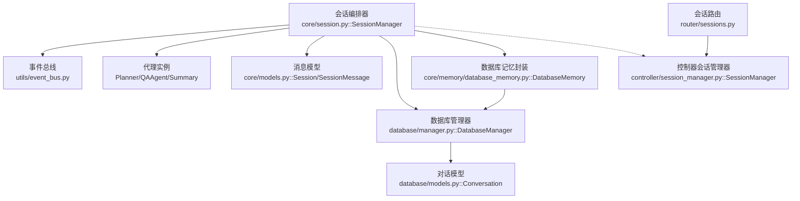
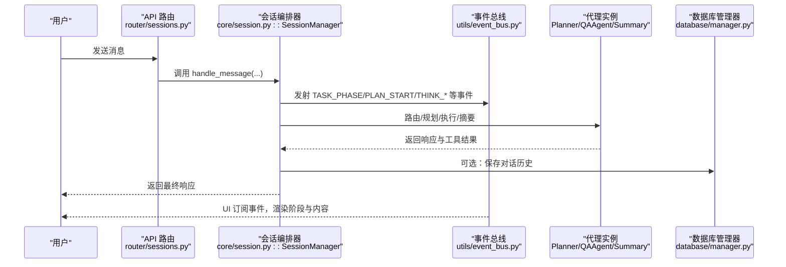
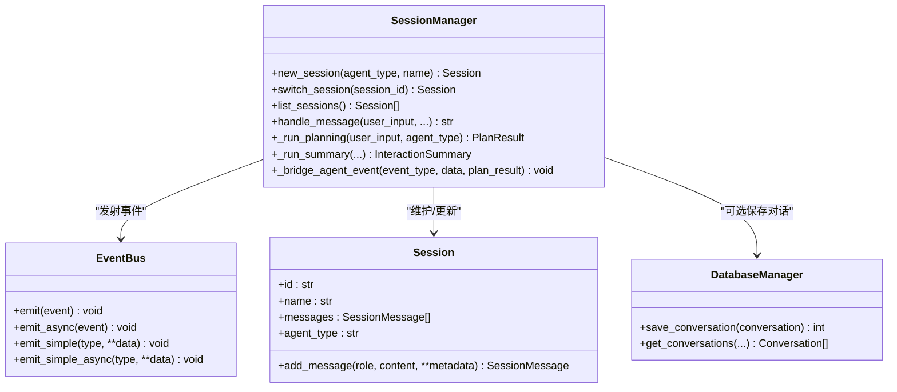
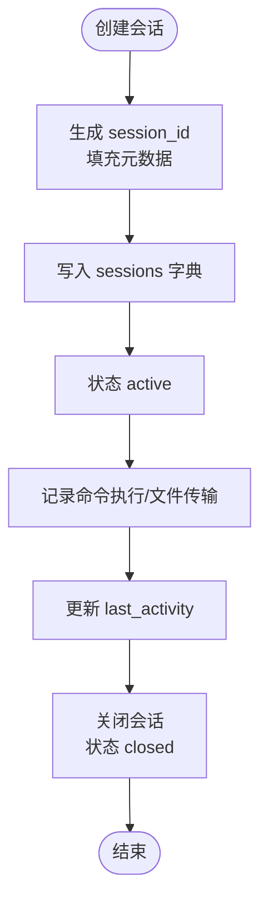
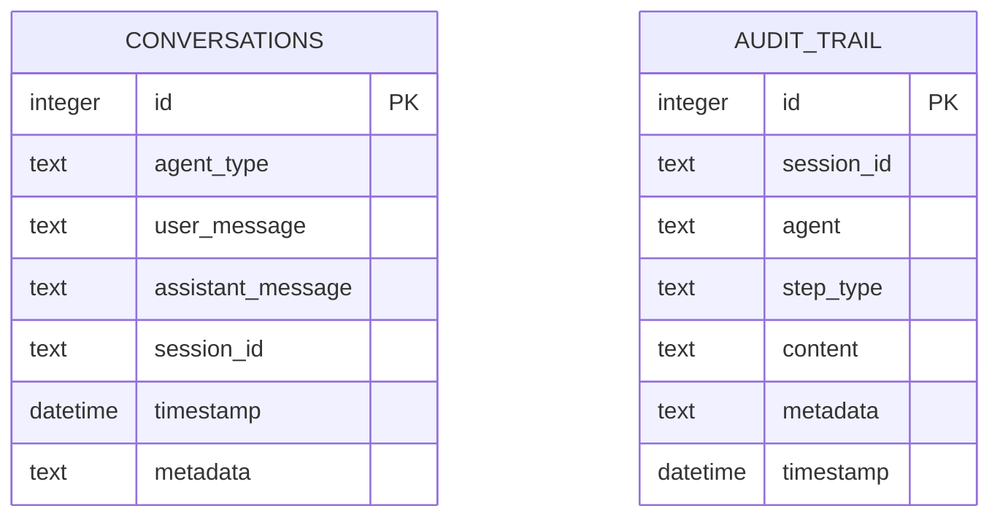
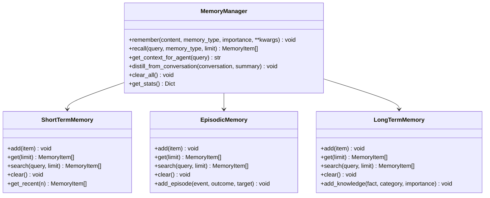
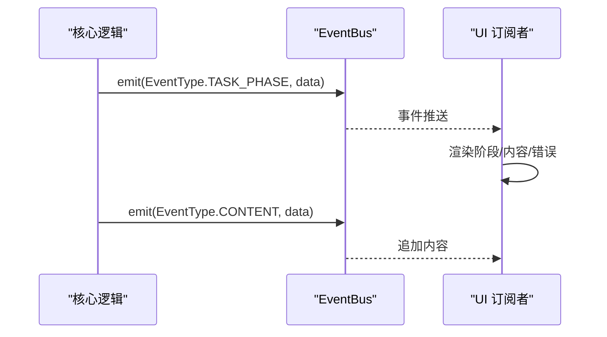
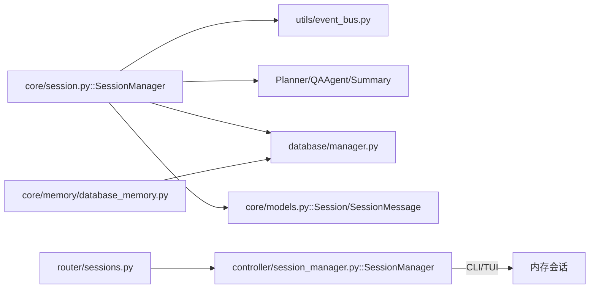

# 会话管理

<cite>
**本文引用的文件**
- [controller/session_manager.py](file://controller/session_manager.py)
- [core/session.py](file://core/session.py)
- [router/sessions.py](file://router/sessions.py)
- [core/models.py](file://core/models.py)
- [core/memory/manager.py](file://core/memory/manager.py)
- [core/memory/database_memory.py](file://core/memory/database_memory.py)
- [database/manager.py](file://database/manager.py)
- [database/models.py](file://database/models.py)
- [utils/event_bus.py](file://utils/event_bus.py)
- [docs/design-paradigms/session-and-events.md](file://docs/design-paradigms/session-and-events.md)
- [docs/DATABASE_GUIDE.md](file://docs/DATABASE_GUIDE.md)
</cite>

## 目录
1. [简介](#简介)
2. [项目结构](#项目结构)
3. [核心组件](#核心组件)
4. [架构总览](#架构总览)
5. [组件详解](#组件详解)
6. [依赖关系分析](#依赖关系分析)
7. [性能考量](#性能考量)
8. [故障排查指南](#故障排查指南)
9. [结论](#结论)
10. [附录](#附录)

## 简介
本文件面向开发者与运维人员，系统化阐述 Secbot 的会话管理系统，重点围绕以下主题：
- SessionManager 类的设计理念与实现机制：会话的创建、切换、恢复与销毁
- 消息历史管理：存储、检索与持久化策略
- 会话状态维护与同步：上下文保存与恢复
- 生命周期管理最佳实践：内存优化与资源清理
- 扩展指导：自定义会话类型、状态扩展与迁移机制
- 实际使用模式与示例路径，帮助快速落地

## 项目结构
会话管理涉及后端核心编排、事件总线、消息模型、记忆系统与数据库层，形成“编排-事件-模型-记忆-持久化”的分层架构。

图表来源
- [core/session.py](file://core/session.py#L32-L136)
- [utils/event_bus.py](file://utils/event_bus.py#L68-L187)
- [core/models.py](file://core/models.py#L122-L136)
- [database/manager.py](file://database/manager.py#L26-L719)
- [database/models.py](file://database/models.py#L9-L18)
- [core/memory/database_memory.py](file://core/memory/database_memory.py#L14-L37)
- [controller/session_manager.py](file://controller/session_manager.py#L9-L90)
- [router/sessions.py](file://router/sessions.py#L1-L21)

章节来源
- [core/session.py](file://core/session.py#L32-L136)
- [utils/event_bus.py](file://utils/event_bus.py#L68-L187)
- [core/models.py](file://core/models.py#L122-L136)
- [database/manager.py](file://database/manager.py#L26-L719)
- [database/models.py](file://database/models.py#L9-L18)
- [core/memory/database_memory.py](file://core/memory/database_memory.py#L14-L37)
- [controller/session_manager.py](file://controller/session_manager.py#L9-L90)
- [router/sessions.py](file://router/sessions.py#L1-L21)

## 核心组件
- 会话编排器：负责会话生命周期、消息编排、事件桥接与摘要生成
- 事件总线：统一事件类型与结构，解耦核心逻辑与 UI
- 消息模型：会话消息与会话实体，支撑上下文与历史
- 记忆系统：短期/情节/长期三层记忆，支持检索与蒸馏
- 数据库存储：SQLite 对话表、审计留痕与统计
- 控制器会话管理器：面向控制面的会话（如终端会话）管理

章节来源
- [core/session.py](file://core/session.py#L32-L136)
- [utils/event_bus.py](file://utils/event_bus.py#L15-L53)
- [core/models.py](file://core/models.py#L122-L136)
- [core/memory/manager.py](file://core/memory/manager.py#L223-L325)
- [database/manager.py](file://database/manager.py#L26-L203)
- [controller/session_manager.py](file://controller/session_manager.py#L9-L90)

## 架构总览
会话编排器作为中枢，接收用户输入，依据路由决定走问答或规划-执行-摘要链路；期间通过事件总线向 UI 推送阶段与内容事件；同时维护消息历史与上下文，并可持久化到数据库。

图表来源
- [router/sessions.py](file://router/sessions.py#L12-L20)
- [core/session.py](file://core/session.py#L139-L422)
- [utils/event_bus.py](file://utils/event_bus.py#L117-L182)
- [database/manager.py](file://database/manager.py#L207-L228)

## 组件详解

### 会话编排器（SessionManager）
- 职责
  - 管理会话创建、切换、列表与当前会话指针
  - 消息编排：问答路由、规划、执行、摘要
  - 事件桥接：将代理事件转换为 UI 友好的事件并自动更新待办状态
  - 上下文维护：将摘要结果写入会话上下文供后续回合使用
- 关键流程
  - 新建会话：生成唯一 ID，加入会话集合，触发 SESSION_UPDATE
  - 切换会话：更新 current_session 并广播 SESSION_UPDATE
  - 处理消息：路由判断、QA 快速回复、规划链路、执行与摘要
  - 事件桥接：根据事件类型映射到统一的 EventType 并发射
- 数据结构
  - 会话字典：id -> Session
  - 当前会话：current_session
  - 临时状态：_current_tool_results（用于摘要）

图表来源
- [core/session.py](file://core/session.py#L81-L136)
- [core/models.py](file://core/models.py#L122-L136)
- [utils/event_bus.py](file://utils/event_bus.py#L68-L187)
- [database/manager.py](file://database/manager.py#L207-L228)

章节来源
- [core/session.py](file://core/session.py#L81-L136)
- [core/session.py](file://core/session.py#L139-L422)
- [core/session.py](file://core/session.py#L532-L722)
- [core/models.py](file://core/models.py#L122-L136)
- [utils/event_bus.py](file://utils/event_bus.py#L68-L187)

### 控制器会话管理器（controller/session_manager.py）
- 面向控制面的会话（如远程终端会话）管理
- 能力
  - 创建会话（含目标 IP、连接类型、认证信息）
  - 记录命令执行与文件传输
  - 更新活动时间、关闭会话
  - 列表查询与按目标筛选
- 特点
  - 内存字典存储，非持久化
  - 适用于 CLI/TUI 场景的短生命周期会话

图表来源
- [controller/session_manager.py](file://controller/session_manager.py#L15-L76)

章节来源
- [controller/session_manager.py](file://controller/session_manager.py#L9-L90)

### 消息历史与持久化
- 消息模型
  - SessionMessage：角色、内容、时间戳、元数据
  - Session：会话 ID、名称、消息列表、代理类型、时间戳
- 数据库存储
  - Conversation：对话记录，支持按 agent_type、session_id、时间排序查询
  - 提供保存、查询、删除（按会话或时间）等接口
- 数据库记忆封装
  - DatabaseMemory：将一轮对话保存为 Conversation 并委托 DatabaseManager

图表来源
- [database/manager.py](file://database/manager.py#L80-L203)
- [database/models.py](file://database/models.py#L9-L18)

章节来源
- [core/models.py](file://core/models.py#L113-L136)
- [database/manager.py](file://database/manager.py#L207-L306)
- [database/models.py](file://database/models.py#L9-L18)
- [core/memory/database_memory.py](file://core/memory/database_memory.py#L14-L37)

### 记忆系统（三层记忆）
- 短期记忆：会话内上下文，限制轮次
- 情节记忆：跨会话事件与经验，持久化到 JSON 文件
- 长期记忆：持久化知识，支持检索
- 统一记忆管理器：提供 remember/recall/get_context_for_agent/distill_from_conversation/clear_all/stats

图表来源
- [core/memory/manager.py](file://core/memory/manager.py#L223-L325)
- [core/memory/manager.py](file://core/memory/manager.py#L51-L84)
- [core/memory/manager.py](file://core/memory/manager.py#L86-L152)
- [core/memory/manager.py](file://core/memory/manager.py#L154-L221)

章节来源
- [core/memory/manager.py](file://core/memory/manager.py#L223-L325)

### 事件总线与 UI 同步
- 事件类型：规划、推理、执行、内容、报告、任务阶段、会话更新、错误等
- 事件结构：统一 Event(data, timestamp, iteration)
- 发射方式：同步 emit 与异步 emit_async，支持全局处理器
- UI 解耦：核心只发射事件，UI 订阅并渲染

图表来源
- [utils/event_bus.py](file://utils/event_bus.py#L15-L53)
- [utils/event_bus.py](file://utils/event_bus.py#L117-L182)
- [docs/design-paradigms/session-and-events.md](file://docs/design-paradigms/session-and-events.md#L16-L36)

章节来源
- [utils/event_bus.py](file://utils/event_bus.py#L68-L187)
- [docs/design-paradigms/session-and-events.md](file://docs/design-paradigms/session-and-events.md#L1-L36)

### 会话路由与 API
- 会话列表路由：当前后端为无状态，会话由 TUI 本地管理，接口返回空列表与说明
- 会话编排器：对外仅支持 ask 与 agent 两种模式，内部保留 plan_only/plan_override 以供 API 层扩展

章节来源
- [router/sessions.py](file://router/sessions.py#L1-L21)
- [core/session.py](file://core/session.py#L139-L166)

## 依赖关系分析
- 会话编排器依赖事件总线进行 UI 同步，依赖代理实例执行规划与摘要，可选依赖数据库保存对话
- 记忆系统与数据库层相互独立，均可被会话编排器或代理使用
- 控制器会话管理器与核心会话编排器职责分离，分别服务于不同场景

图表来源
- [core/session.py](file://core/session.py#L32-L136)
- [utils/event_bus.py](file://utils/event_bus.py#L68-L187)
- [database/manager.py](file://database/manager.py#L26-L719)
- [core/memory/database_memory.py](file://core/memory/database_memory.py#L14-L37)
- [controller/session_manager.py](file://controller/session_manager.py#L9-L90)
- [router/sessions.py](file://router/sessions.py#L1-L21)

章节来源
- [core/session.py](file://core/session.py#L32-L136)
- [utils/event_bus.py](file://utils/event_bus.py#L68-L187)
- [database/manager.py](file://database/manager.py#L26-L719)
- [core/memory/database_memory.py](file://core/memory/database_memory.py#L14-L37)
- [controller/session_manager.py](file://controller/session_manager.py#L9-L90)
- [router/sessions.py](file://router/sessions.py#L1-L21)

## 性能考量
- 会话消息与事件流式推送：通过事件总线分阶段推送，避免一次性渲染大块内容
- 短期记忆轮次限制：控制上下文长度，降低 LLM 输入成本
- 数据库索引：按 session_id、timestamp 建立索引，加速查询
- 异步事件处理：支持异步处理器，避免阻塞主流程
- 会话清理：定期清理旧对话与空闲会话，释放内存与磁盘空间

章节来源
- [core/memory/manager.py](file://core/memory/manager.py#L51-L84)
- [database/manager.py](file://database/manager.py#L176-L201)
- [utils/event_bus.py](file://utils/event_bus.py#L144-L156)

## 故障排查指南
- 会话无法切换
  - 检查 session_id 是否存在于会话集合
  - 确认 SESSION_UPDATE 事件是否正常发射
- 事件未到达 UI
  - 确认 EventBus 订阅是否正确
  - 检查 emit/emit_async 使用是否匹配处理器类型
- 对话历史缺失
  - 确认 DatabaseMemory.save_conversation 是否被调用
  - 检查 DatabaseManager.save_conversation 的 SQL 插入是否成功
- 记忆检索为空
  - 短期记忆轮次限制导致被截断
  - 情节/长期记忆文件路径与权限
- 会话清理
  - 使用数据库清理接口按会话或时间删除历史
  - 控制器会话管理器支持关闭会话，释放内存

章节来源
- [core/session.py](file://core/session.py#L101-L111)
- [utils/event_bus.py](file://utils/event_bus.py#L117-L182)
- [core/memory/database_memory.py](file://core/memory/database_memory.py#L28-L37)
- [database/manager.py](file://database/manager.py#L207-L228)
- [docs/DATABASE_GUIDE.md](file://docs/DATABASE_GUIDE.md#L175-L198)
- [controller/session_manager.py](file://controller/session_manager.py#L71-L76)

## 结论
本会话管理体系以“编排-事件-模型-记忆-持久化”为核心，通过事件总线实现核心与 UI 的解耦，通过三层记忆与数据库持久化保障上下文与历史的可用性。控制器会话管理器补充了控制面的短生命周期会话能力。建议在生产环境中结合异步事件、索引优化与定期清理策略，确保性能与稳定性。

## 附录

### 会话生命周期最佳实践
- 创建
  - 为会话分配唯一 ID，记录创建时间与代理类型
  - 在 UI 订阅 SESSION_UPDATE，及时刷新界面
- 切换
  - 切换时广播 SESSION_UPDATE，确保 UI 状态一致
- 恢复
  - 通过消息模型与数据库历史重建上下文
  - 可结合记忆系统提供检索增强
- 销毁
  - 关闭会话并清理临时状态
  - 定期清理旧对话与空闲会话

章节来源
- [core/session.py](file://core/session.py#L81-L111)
- [core/models.py](file://core/models.py#L122-L136)
- [docs/design-paradigms/session-and-events.md](file://docs/design-paradigms/session-and-events.md#L24-L36)

### 扩展指导
- 自定义会话类型
  - 在 SessionManager 构造注入自定义代理实例或通过 resolve_agent 延迟解析
  - 通过 agent_type 参数在 handle_message 中切换
- 会话状态扩展
  - 在 Session 中增加自定义字段，或通过消息元数据承载上下文
  - 使用记忆系统蒸馏关键经验，形成长期知识
- 会话迁移机制
  - 将 Session 与 Conversation 同步，导出/导入历史
  - 使用数据库备份与恢复策略，保障迁移一致性

章节来源
- [core/session.py](file://core/session.py#L123-L133)
- [core/session.py](file://core/session.py#L398-L421)
- [docs/DATABASE_GUIDE.md](file://docs/DATABASE_GUIDE.md#L163-L198)

### 实际使用模式与示例路径
- 会话编排与事件桥接
  - 示例路径：[handle_message 主流程](file://core/session.py#L139-L422)
  - 示例路径：[事件桥接与 todo 自动更新](file://core/session.py#L532-L722)
- 数据库存储与检索
  - 示例路径：[保存对话](file://database/manager.py#L207-L228)
  - 示例路径：[获取对话历史](file://database/manager.py#L230-L278)
  - 示例路径：[数据库记忆封装](file://core/memory/database_memory.py#L28-L37)
- 记忆系统使用
  - 示例路径：[记忆管理器](file://core/memory/manager.py#L223-L325)
- 控制器会话管理
  - 示例路径：[创建/关闭/记录命令](file://controller/session_manager.py#L15-L76)
- 会话路由
  - 示例路径：[会话列表路由](file://router/sessions.py#L12-L20)