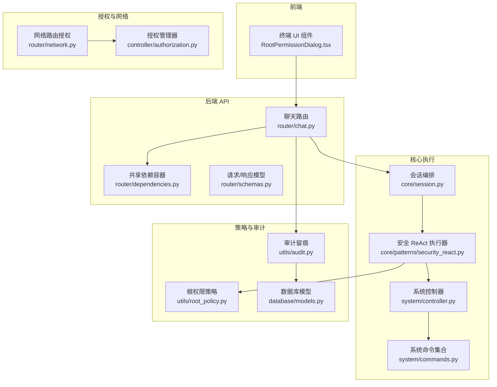
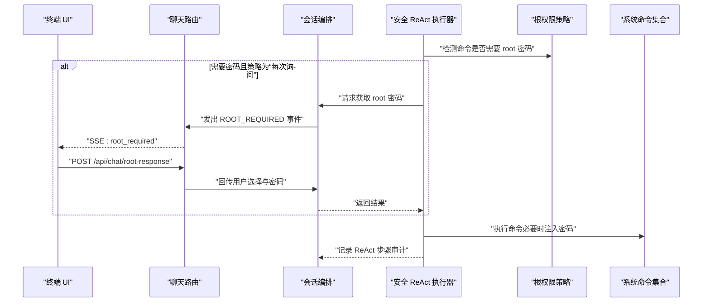
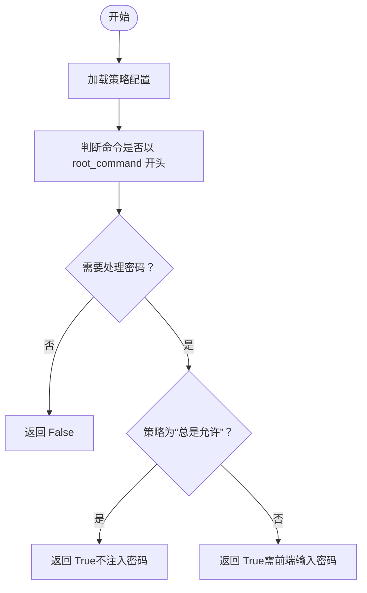
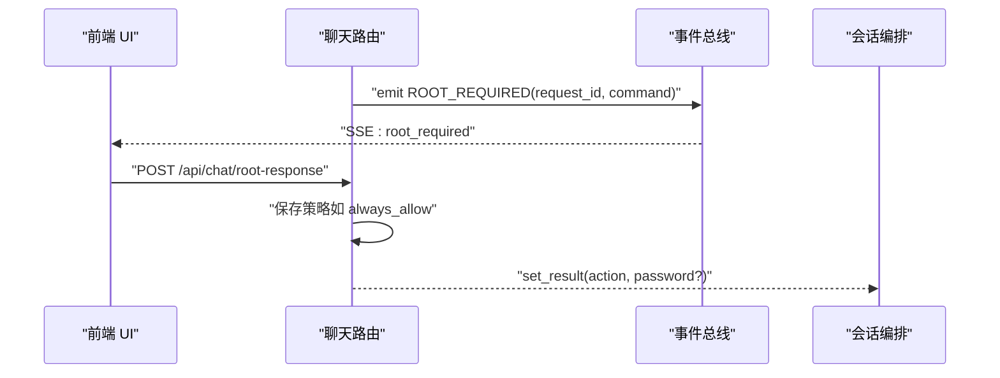
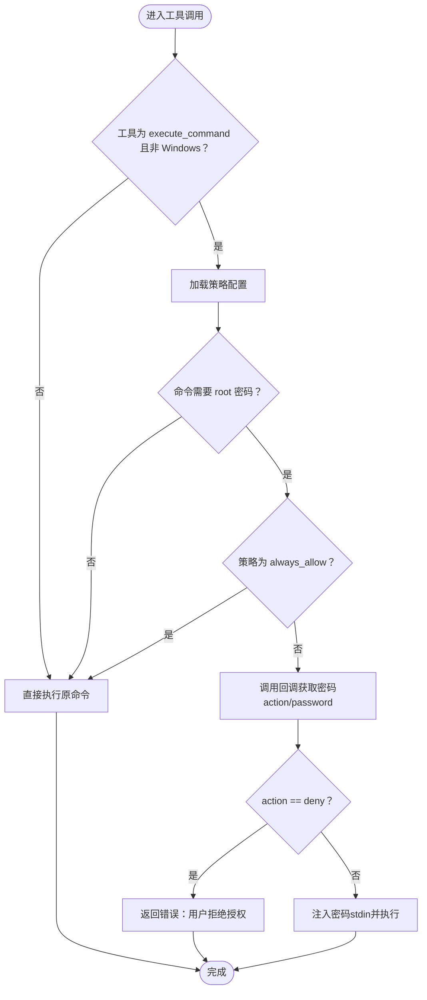
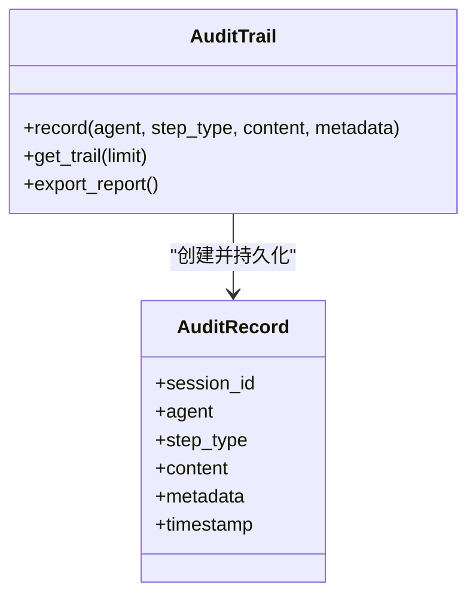
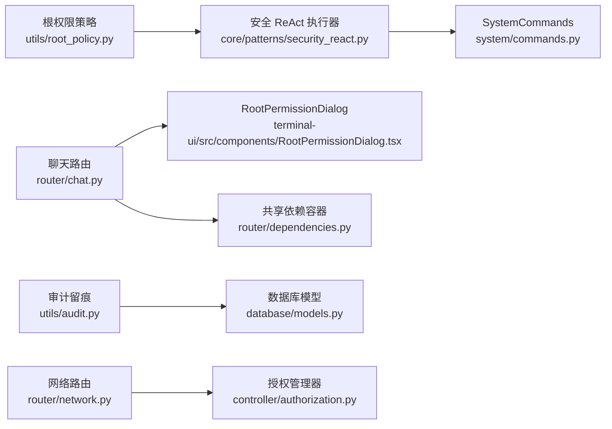

# 根权限策略

<cite>
**本文引用的文件**
- [utils/root_policy.py](file://utils/root_policy.py)
- [router/chat.py](file://router/chat.py)
- [terminal-ui/src/components/RootPermissionDialog.tsx](file://terminal-ui/src/components/RootPermissionDialog.tsx)
- [core/patterns/security_react.py](file://core/patterns/security_react.py)
- [system/controller.py](file://system/controller.py)
- [system/commands.py](file://system/commands.py)
- [utils/audit.py](file://utils/audit.py)
- [database/models.py](file://database/models.py)
- [router/dependencies.py](file://router/dependencies.py)
- [router/network.py](file://router/network.py)
- [controller/authorization.py](file://controller/authorization.py)
- [router/schemas.py](file://router/schemas.py)
- [core/session.py](file://core/session.py)
</cite>

## 目录
1. [引言](#引言)
2. [项目结构](#项目结构)
3. [核心组件](#核心组件)
4. [架构总览](#架构总览)
5. [详细组件分析](#详细组件分析)
6. [依赖关系分析](#依赖关系分析)
7. [性能考量](#性能考量)
8. [故障排查指南](#故障排查指南)
9. [结论](#结论)
10. [附录](#附录)

## 引言
本文件围绕“根权限策略系统”的设计与实现进行系统化技术文档整理，重点覆盖以下方面：
- 权限验证与控制：如何识别需要提权的命令、如何在不同策略下处理密码输入与执行。
- 操作审计与合规：如何记录 ReAct 思考、行动、观察、确认、结果等关键步骤，形成可追溯的审计留痕。
- 安全策略配置与管理：如何持久化根权限策略、如何在运行时动态调整策略并影响工具调用行为。
- 扩展与最佳实践：如何扩展自定义权限类型、审计规则与安全策略；如何遵循最小权限、权限分离与安全监控。

## 项目结构
根权限策略系统横跨后端 API、会话编排、工具执行、系统命令与审计模块等多个层次，采用“策略配置 + 事件驱动 + 审计留痕”的协作方式，确保在需要 root 权限时具备可控、可观测、可追溯的能力。

图表来源
- [terminal-ui/src/components/RootPermissionDialog.tsx](file://terminal-ui/src/components/RootPermissionDialog.tsx#L1-L149)
- [router/chat.py](file://router/chat.py#L1-L329)
- [router/dependencies.py](file://router/dependencies.py#L1-L194)
- [core/session.py](file://core/session.py#L1-L800)
- [core/patterns/security_react.py](file://core/patterns/security_react.py#L1101-L1156)
- [system/controller.py](file://system/controller.py#L1-L127)
- [system/commands.py](file://system/commands.py#L1-L386)
- [utils/root_policy.py](file://utils/root_policy.py#L1-L54)
- [utils/audit.py](file://utils/audit.py#L1-L105)
- [database/models.py](file://database/models.py#L1-L90)
- [router/network.py](file://router/network.py#L1-L200)
- [controller/authorization.py](file://controller/authorization.py#L1-L120)
- [router/schemas.py](file://router/schemas.py#L1-L290)

章节来源
- [router/chat.py](file://router/chat.py#L1-L329)
- [utils/root_policy.py](file://utils/root_policy.py#L1-L54)
- [utils/audit.py](file://utils/audit.py#L1-L105)
- [system/controller.py](file://system/controller.py#L1-L127)
- [system/commands.py](file://system/commands.py#L1-L386)
- [router/dependencies.py](file://router/dependencies.py#L1-L194)
- [router/network.py](file://router/network.py#L1-L200)
- [controller/authorization.py](file://controller/authorization.py#L1-L120)
- [router/schemas.py](file://router/schemas.py#L1-L290)
- [core/session.py](file://core/session.py#L1-L800)

## 核心组件
- 根权限策略模块：负责策略的持久化、加载与判断命令是否需要处理密码。
- 聊天与会话编排：在需要 root 权限时通过事件与 SSE 通知前端弹窗，等待用户选择与密码。
- 安全 ReAct 执行器：在工具调用阶段拦截包含提权命令的执行，按策略注入密码或直接执行。
- 系统控制器与命令集合：封装系统命令执行，支持跨平台命令执行与环境变量、进程、文件等操作。
- 审计留痕模块：记录 ReAct 关键步骤，持久化到数据库，支持导出报告。
- 授权管理器与网络路由：管理目标主机授权，保障在授权范围内执行。

章节来源
- [utils/root_policy.py](file://utils/root_policy.py#L1-L54)
- [router/chat.py](file://router/chat.py#L1-L329)
- [core/patterns/security_react.py](file://core/patterns/security_react.py#L1101-L1156)
- [system/controller.py](file://system/controller.py#L1-L127)
- [system/commands.py](file://system/commands.py#L1-L386)
- [utils/audit.py](file://utils/audit.py#L1-L105)
- [router/network.py](file://router/network.py#L1-L200)
- [controller/authorization.py](file://controller/authorization.py#L1-L120)

## 架构总览
根权限策略系统的关键交互流程如下：
- 当工具调用需要执行带提权命令时，安全 ReAct 执行器检测命令并查询策略。
- 若策略为“每次询问”，则通过会话编排向前端发送 root_required 事件，等待用户在 UI 中选择“执行一次/总是允许/拒绝”，并可输入密码。
- 用户提交后，后端保存策略（如“总是允许”），并将结果回传给执行器，执行器以安全方式注入密码或直接执行。
- 整个过程被审计模块记录，形成可追溯的留痕。

图表来源
- [core/patterns/security_react.py](file://core/patterns/security_react.py#L1101-L1156)
- [router/chat.py](file://router/chat.py#L118-L188)
- [terminal-ui/src/components/RootPermissionDialog.tsx](file://terminal-ui/src/components/RootPermissionDialog.tsx#L1-L149)
- [utils/root_policy.py](file://utils/root_policy.py#L1-L54)
- [system/commands.py](file://system/commands.py#L276-L334)
- [utils/audit.py](file://utils/audit.py#L1-L105)

## 详细组件分析

### 根权限策略模块
- 策略类型与默认值：支持“每次询问”和“总是允许”两种策略，默认为“每次询问”，默认提权命令为“sudo”。
- 配置持久化：策略存储在用户家目录下的专用配置文件，包含 root_command 与 root_policy 字段。
- 命令识别：判断命令是否以 root_command 开头，从而决定是否需要按策略处理密码。

图表来源
- [utils/root_policy.py](file://utils/root_policy.py#L18-L54)

章节来源
- [utils/root_policy.py](file://utils/root_policy.py#L1-L54)

### 聊天与会话编排（SSE 与事件）
- 事件映射：将内部事件类型映射为前端可消费的 SSE 事件，包括 root_required。
- 根权限等待：当检测到需要 root 权限时，生成 request_id 并等待前端 POST /api/chat/root-response。
- 结果回传：前端提交后，后端保存策略（如“总是允许”），并把 action 与密码回传给执行器。

图表来源
- [router/chat.py](file://router/chat.py#L118-L188)
- [router/chat.py](file://router/chat.py#L274-L294)

章节来源
- [router/chat.py](file://router/chat.py#L1-L329)

### 终端 UI 弹窗组件
- 交互流程：提供“执行一次/总是允许/拒绝”三种选项；首次允许时可输入本机账户或 root 密码。
- 行为约束：拒绝则中断执行；总是允许会保存策略并在后续不再询问；执行一次会在本次执行后恢复默认策略。

章节来源
- [terminal-ui/src/components/RootPermissionDialog.tsx](file://terminal-ui/src/components/RootPermissionDialog.tsx#L1-L149)

### 安全 ReAct 执行器（工具调用拦截）
- 命令拦截：在执行工具名为“execute_command”且非 Windows 平台时，检测命令是否需要 root 密码。
- 策略处理：
  - 策略为“每次询问”：通过回调获取密码，支持返回字符串（密码）或字典（action 与 password）。
  - 策略为“总是允许”：直接执行原命令，不注入密码。
  - 注入密码：使用标准输入注入，避免密码出现在命令行中。
- 错误处理：未提供密码或用户拒绝时，返回明确的错误信息。

图表来源
- [core/patterns/security_react.py](file://core/patterns/security_react.py#L1101-L1156)
- [utils/root_policy.py](file://utils/root_policy.py#L18-L54)

章节来源
- [core/patterns/security_react.py](file://core/patterns/security_react.py#L1101-L1156)

### 系统控制器与命令集合
- 统一接口：OSController 提供统一的系统操作接口，将文件、进程、系统信息、命令执行、环境变量、路径等操作抽象为可调用的动作。
- 跨平台执行：根据系统类型选择合适的 shell 与执行方式，支持超时控制与异常处理。
- 与命令执行工具结合：在安全 ReAct 执行器中，命令执行通过 SystemCommands.execute_command 完成。

章节来源
- [system/controller.py](file://system/controller.py#L1-L127)
- [system/commands.py](file://system/commands.py#L276-L334)

### 审计留痕与数据库模型
- 审计记录：AuditTrail 记录 ReAct 的每个关键步骤（思考、行动、观察、确认、拒绝、结果），并持久化到数据库。
- 报告导出：支持导出 Markdown 格式的审计报告，便于合规与审查。
- 数据模型：数据库模型中包含审计记录表，字段覆盖会话 ID、智能体、步骤类型、内容与元数据等。

图表来源
- [utils/audit.py](file://utils/audit.py#L1-L105)
- [database/models.py](file://database/models.py#L80-L89)

章节来源
- [utils/audit.py](file://utils/audit.py#L1-L105)
- [database/models.py](file://database/models.py#L1-L90)

### 授权管理与网络路由
- 授权管理器：管理目标主机的授权，支持添加、撤销、查询、更新凭据与过期时间。
- 网络路由：提供授权目标主机、列出授权与撤销授权的 API，确保在授权范围内执行远程操作。

章节来源
- [controller/authorization.py](file://controller/authorization.py#L1-L120)
- [router/network.py](file://router/network.py#L78-L148)

## 依赖关系分析
- 低耦合高内聚：策略模块独立于执行器与 UI，通过接口与事件进行交互。
- 事件驱动：会话编排通过事件总线与前端交互，避免阻塞式等待。
- 依赖注入：共享依赖容器集中管理数据库、提示词、审计、智能体、控制器等单例，便于测试与替换。

图表来源
- [utils/root_policy.py](file://utils/root_policy.py#L1-L54)
- [core/patterns/security_react.py](file://core/patterns/security_react.py#L1101-L1156)
- [router/chat.py](file://router/chat.py#L1-L329)
- [terminal-ui/src/components/RootPermissionDialog.tsx](file://terminal-ui/src/components/RootPermissionDialog.tsx#L1-L149)
- [router/dependencies.py](file://router/dependencies.py#L1-L194)
- [system/commands.py](file://system/commands.py#L1-L386)
- [utils/audit.py](file://utils/audit.py#L1-L105)
- [database/models.py](file://database/models.py#L1-L90)
- [router/network.py](file://router/network.py#L1-L200)
- [controller/authorization.py](file://controller/authorization.py#L1-L120)

章节来源
- [router/dependencies.py](file://router/dependencies.py#L1-L194)
- [router/chat.py](file://router/chat.py#L1-L329)

## 性能考量
- 异步事件与 SSE：通过异步事件与 SSE 推送，避免阻塞主线程，提升交互体验。
- 策略缓存：策略加载为轻量 JSON 读取，建议在进程内缓存以减少 IO。
- 命令执行超时：系统命令执行设置超时，防止长时间阻塞导致资源占用。
- 审计落库批量化：审计记录写入数据库时应考虑批量写入与异常降级，避免影响主流程。

## 故障排查指南
- 前端未弹窗或无 root_required 事件
  - 检查会话编排是否正确发出 ROOT_REQUIRED 事件。
  - 确认前端 SSE 连接与事件监听正常。
- 用户选择后无响应
  - 检查 /api/chat/root-response 是否收到请求并保存策略。
  - 确认 request_id 未过期或未被清理。
- 执行器未注入密码
  - 确认策略为“每次询问”，且回调返回了 action 与 password。
  - 检查命令是否以 root_command 开头，以及是否为非 Windows 平台。
- 审计记录缺失
  - 检查数据库连接与表结构是否正确。
  - 确认审计模块在执行器中被正确调用。

章节来源
- [router/chat.py](file://router/chat.py#L118-L188)
- [router/chat.py](file://router/chat.py#L274-L294)
- [core/patterns/security_react.py](file://core/patterns/security_react.py#L1101-L1156)
- [utils/audit.py](file://utils/audit.py#L1-L105)

## 结论
根权限策略系统通过“策略配置 + 事件驱动 + 审计留痕”的设计，在保证安全性的同时兼顾了可操作性与可观测性。它能够：
- 在需要 root 权限时进行可控的人机交互，避免静默提权带来的风险。
- 将 ReAct 关键步骤纳入审计体系，满足合规与溯源需求。
- 以模块化与事件化的架构支撑后续扩展与策略演进。

## 附录

### 权限检查流程与策略
- 权限级别定义：策略分为“每次询问”和“总是允许”，默认“每次询问”。
- 权限继承与组合：策略通过配置文件持久化，可在会话期间动态调整；工具调用时按策略组合行为。
- 权限组合规则：当策略为“总是允许”时，不注入密码；当策略为“每次询问”时，按用户选择与密码注入规则执行。

章节来源
- [utils/root_policy.py](file://utils/root_policy.py#L1-L54)
- [router/chat.py](file://router/chat.py#L274-L294)
- [core/patterns/security_react.py](file://core/patterns/security_react.py#L1101-L1156)

### 操作审计机制
- 审计日志记录：记录 ReAct 的每个关键步骤，包含智能体、步骤类型、内容与元数据。
- 敏感操作追踪：通过审计留痕可追踪命令执行、工具调用与结果。
- 合规性检查：支持导出 Markdown 报告，便于合规审查与问题回溯。

章节来源
- [utils/audit.py](file://utils/audit.py#L1-L105)
- [database/models.py](file://database/models.py#L80-L89)

### 安全策略的配置与管理
- 策略定义：root_command 与 root_policy 两个字段构成策略定义。
- 动态调整：通过前端弹窗与 API 接口动态调整策略，如将策略设为“总是允许”。
- 策略评估：结合授权管理器与网络路由，确保在授权范围内执行策略。

章节来源
- [utils/root_policy.py](file://utils/root_policy.py#L1-L54)
- [router/chat.py](file://router/chat.py#L274-L294)
- [router/network.py](file://router/network.py#L78-L148)
- [controller/authorization.py](file://controller/authorization.py#L1-L120)

### 扩展指导
- 自定义权限类型：可在策略模块扩展新的策略类型，并在执行器中增加对应分支。
- 审计规则：可在审计模块中扩展新的审计事件类型与元数据字段。
- 安全策略：可在授权管理器中扩展授权类型与有效期策略，结合网络路由进行统一管理。

章节来源
- [utils/root_policy.py](file://utils/root_policy.py#L1-L54)
- [utils/audit.py](file://utils/audit.py#L1-L105)
- [controller/authorization.py](file://controller/authorization.py#L1-L120)
- [router/network.py](file://router/network.py#L78-L148)

### 最佳实践
- 最小权限原则：默认使用“每次询问”，仅在必要时选择“总是允许”。
- 权限分离：将提权命令与普通命令分离，避免在非必要场景下使用 root。
- 安全监控：启用审计留痕并定期导出报告，建立安全事件的监控与告警机制。

### 实际安全场景与防护
- 提权命令注入：通过策略与 UI 交互，避免静默提权；使用标准输入注入密码，降低泄露风险。
- 授权范围控制：在网络路由与授权管理器中严格限制授权范围，防止越权执行。
- 审计与合规：将关键操作纳入审计留痕，满足合规要求并支持事后追溯。