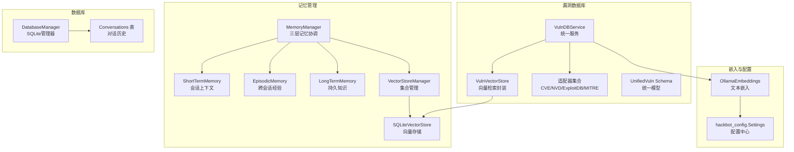
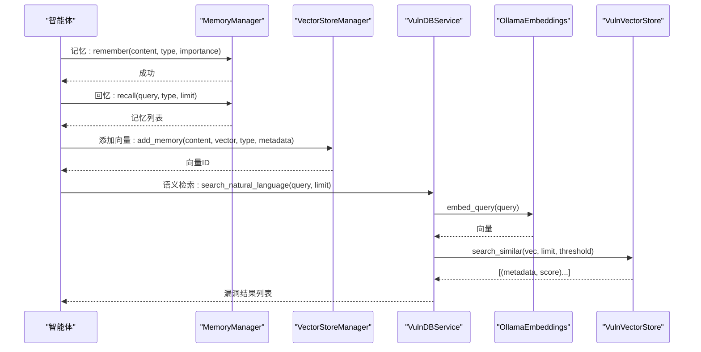
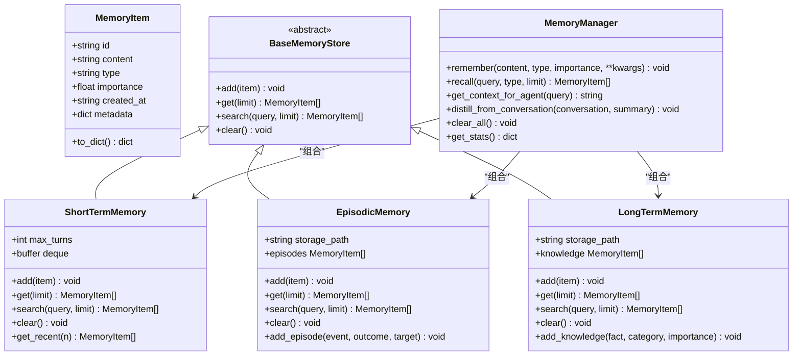
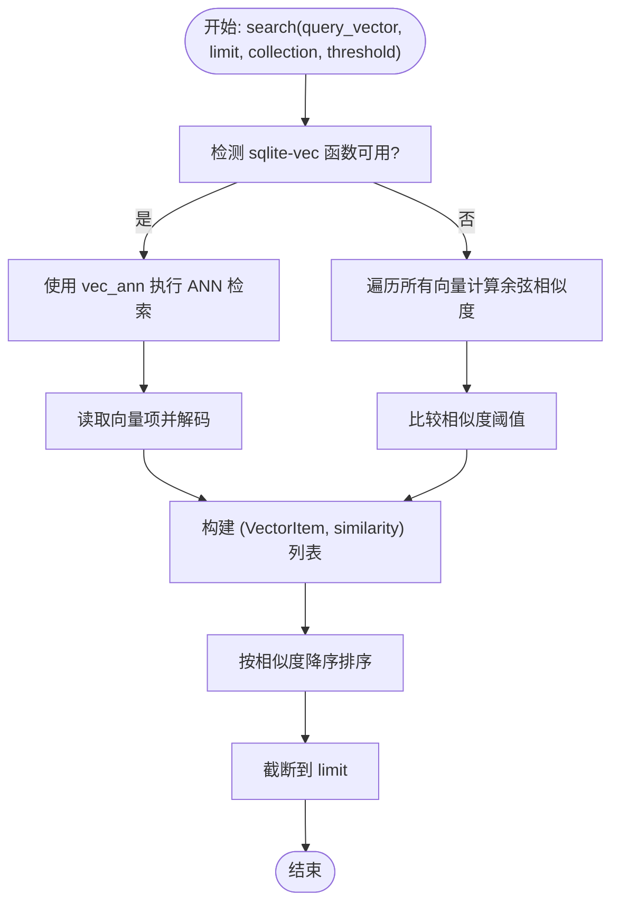
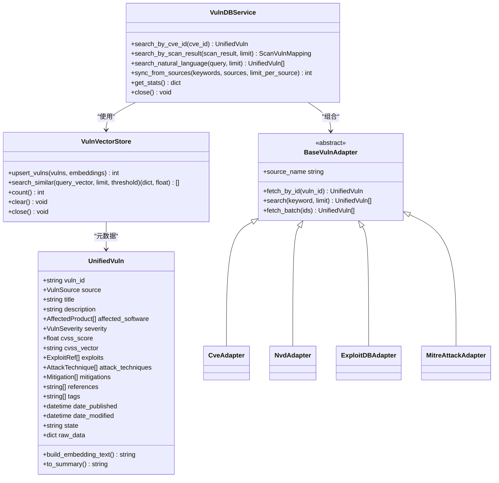
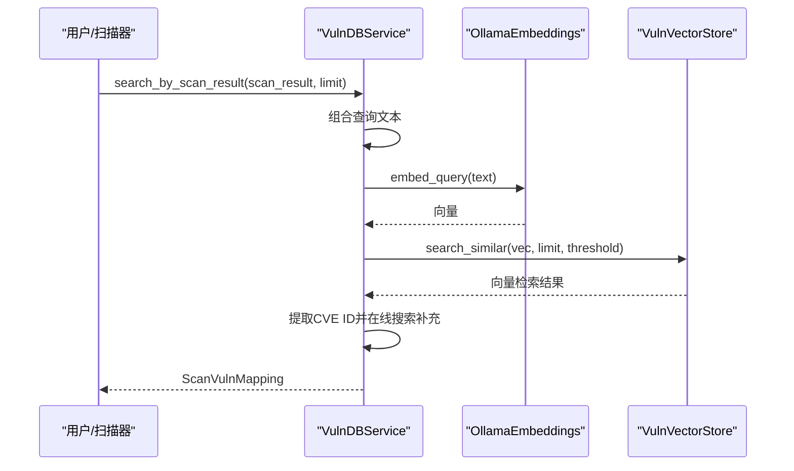
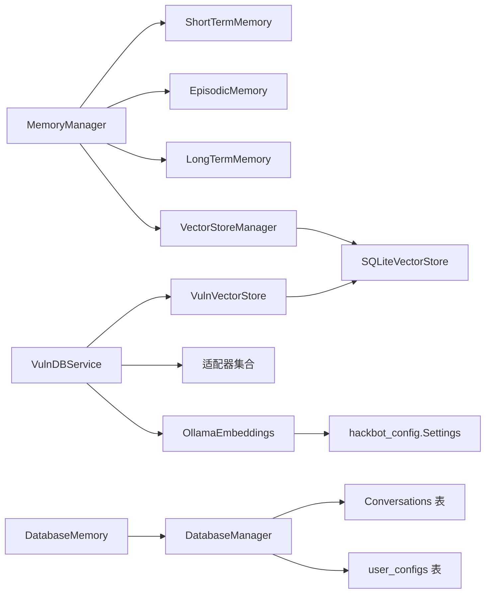

# 内存与知识管理

<cite>
**本文引用的文件**
- [core/memory/manager.py](file://core/memory/manager.py)
- [core/memory/vector_store.py](file://core/memory/vector_store.py)
- [core/memory/database_memory.py](file://core/memory/database_memory.py)
- [core/vuln_db/vuln_db_service.py](file://core/vuln_db/vuln_db_service.py)
- [core/vuln_db/schema.py](file://core/vuln_db/schema.py)
- [core/vuln_db/adapters/base_adapter.py](file://core/vuln_db/adapters/base_adapter.py)
- [core/vuln_db/adapters/cve_adapter.py](file://core/vuln_db/adapters/cve_adapter.py)
- [core/vuln_db/adapters/nvd_adapter.py](file://core/vuln_db/adapters/nvd_adapter.py)
- [core/vuln_db/adapters/exploit_db_adapter.py](file://core/vuln_db/adapters/exploit_db_adapter.py)
- [core/vuln_db/adapters/mitre_adapter.py](file://core/vuln_db/adapters/mitre_adapter.py)
- [core/vuln_db/vuln_vector_store.py](file://core/vuln_db/vuln_vector_store.py)
- [utils/embeddings.py](file://utils/embeddings.py)
- [database/models.py](file://database/models.py)
- [database/manager.py](file://database/manager.py)
- [hackbot_config/__init__.py](file://hackbot_config/__init__.py)
- [docs/内存与技能系统.md](file://docs/内存与技能系统.md)
</cite>

## 目录
1. [简介](#简介)
2. [项目结构](#项目结构)
3. [核心组件](#核心组件)
4. [架构总览](#架构总览)
5. [详细组件分析](#详细组件分析)
6. [依赖关系分析](#依赖关系分析)
7. [性能考量](#性能考量)
8. [故障排查指南](#故障排查指南)
9. [结论](#结论)
10. [附录](#附录)

## 简介
本文件面向Secbot的“内存与知识管理系统”，系统性阐述三层记忆架构（短期、情节、长期）、向量存储与嵌入检索、漏洞数据库的多源适配与统一检索、以及知识检索与推理机制。文档同时提供扩展与优化建议，帮助在不同规模与场景下稳定、高效地运行该系统。

## 项目结构
围绕“内存与知识管理”的核心代码主要分布在以下模块：
- 记忆管理：core/memory（三层记忆、向量存储、数据库记忆封装）
- 漏洞数据库：core/vuln_db（统一Schema、适配器、向量检索）
- 嵌入与模型：utils/embeddings（Ollama嵌入）
- 数据库：database（SQLite模型与管理器）
- 配置：hackbot_config（全局设置与数据库路径解析）

图表来源
- [core/memory/manager.py](file://core/memory/manager.py#L223-L325)
- [core/memory/vector_store.py](file://core/memory/vector_store.py#L30-L297)
- [core/vuln_db/vuln_db_service.py](file://core/vuln_db/vuln_db_service.py#L27-L275)
- [core/vuln_db/vuln_vector_store.py](file://core/vuln_db/vuln_vector_store.py#L18-L107)
- [core/vuln_db/adapters/base_adapter.py](file://core/vuln_db/adapters/base_adapter.py#L8-L33)
- [utils/embeddings.py](file://utils/embeddings.py#L11-L80)
- [database/manager.py](file://database/manager.py#L26-L203)

章节来源
- [core/memory/manager.py](file://core/memory/manager.py#L1-L325)
- [core/memory/vector_store.py](file://core/memory/vector_store.py#L1-L297)
- [core/vuln_db/vuln_db_service.py](file://core/vuln_db/vuln_db_service.py#L1-L275)
- [core/vuln_db/vuln_vector_store.py](file://core/vuln_db/vuln_vector_store.py#L1-L107)
- [core/vuln_db/adapters/base_adapter.py](file://core/vuln_db/adapters/base_adapter.py#L1-L33)
- [utils/embeddings.py](file://utils/embeddings.py#L1-L80)
- [database/manager.py](file://database/manager.py#L1-L719)
- [hackbot_config/__init__.py](file://hackbot_config/__init__.py#L1-L250)

## 核心组件
- 三层记忆架构：MemoryManager协调ShortTermMemory、EpisodicMemory、LongTermMemory，分别承担会话上下文、跨会话经验与持久知识的存储与检索。
- 向量存储系统：SQLiteVectorStore基于sqlite-vec/sqlite-vss实现向量索引与相似度检索；VectorStoreManager统一管理多集合。
- 漏洞数据库：VulnDBService整合多数据源适配器（CVE/NVD/ExploitDB/MITRE），通过OllamaEmbeddings生成嵌入，并使用VulnVectorStore进行语义检索。
- 数据库记忆封装：DatabaseMemory将对话持久化到SQLite，便于后续检索与审计。

章节来源
- [core/memory/manager.py](file://core/memory/manager.py#L223-L325)
- [core/memory/vector_store.py](file://core/memory/vector_store.py#L30-L297)
- [core/memory/database_memory.py](file://core/memory/database_memory.py#L14-L38)
- [core/vuln_db/vuln_db_service.py](file://core/vuln_db/vuln_db_service.py#L27-L275)
- [core/vuln_db/vuln_vector_store.py](file://core/vuln_db/vuln_vector_store.py#L18-L107)

## 架构总览
本系统采用“三层记忆 + 向量检索 + 多源漏洞数据库”的混合架构。记忆层负责上下文与经验沉淀，向量层提供语义检索能力，漏洞数据库层提供标准化的漏洞知识与多源融合。

图表来源
- [core/memory/manager.py](file://core/memory/manager.py#L231-L298)
- [core/memory/vector_store.py](file://core/memory/vector_store.py#L239-L297)
- [core/vuln_db/vuln_db_service.py](file://core/vuln_db/vuln_db_service.py#L147-L184)
- [core/vuln_db/vuln_vector_store.py](file://core/vuln_db/vuln_vector_store.py#L72-L93)
- [utils/embeddings.py](file://utils/embeddings.py#L18-L71)

## 详细组件分析

### 三层记忆架构
- MemoryItem：统一的记忆单元，包含内容、类型、重要度、元数据与时间戳。
- ShortTermMemory：基于双端队列，限制最大回合数，适合会话内上下文。
- EpisodicMemory：跨会话的经验存储，使用JSON文件持久化。
- LongTermMemory：长期知识库，同样以JSON文件持久化。
- MemoryManager：统一入口，支持按类型检索与聚合检索，并能生成适合注入智能体的上下文字符串。

图表来源
- [core/memory/manager.py](file://core/memory/manager.py#L16-L325)

章节来源
- [core/memory/manager.py](file://core/memory/manager.py#L16-L325)

### 向量存储系统
- VectorItem：向量存储的基本单元，包含ID、内容、向量、元数据与时间戳。
- SQLiteVectorStore：基于SQLite的向量存储，支持BLOB向量序列化、集合表、sqlite-vec函数检测与回退纯量计算、ANN索引与相似度检索。
- VectorStoreManager：按集合与维度管理多个SQLiteVectorStore实例，提供统一的添加与搜索接口。

图表来源
- [core/memory/vector_store.py](file://core/memory/vector_store.py#L124-L175)

章节来源
- [core/memory/vector_store.py](file://core/memory/vector_store.py#L15-L297)

### 漏洞数据库设计与实现
- UnifiedVuln：统一漏洞数据模型，涵盖漏洞ID、来源、标题、描述、受影响软件、严重性、CVSS、Exploit引用、ATT&CK技术、缓解措施、标签、引用、时间戳与原始数据。
- 适配器模式：BaseVulnAdapter定义抽象接口，具体适配器（CVE/NVD/ExploitDB/MITRE）负责从各数据源抓取并归一化为UnifiedVuln。
- VulnDBService：统一服务层，负责嵌入生成、向量入库、语义检索、关键词检索与在线补充、多源同步。
- VulnVectorStore：对SQLiteVectorStore的业务封装，负责漏洞向量的upsert与相似度检索。

图表来源
- [core/vuln_db/schema.py](file://core/vuln_db/schema.py#L68-L140)
- [core/vuln_db/vuln_db_service.py](file://core/vuln_db/vuln_db_service.py#L27-L275)
- [core/vuln_db/vuln_vector_store.py](file://core/vuln_db/vuln_vector_store.py#L18-L107)
- [core/vuln_db/adapters/base_adapter.py](file://core/vuln_db/adapters/base_adapter.py#L8-L33)
- [core/vuln_db/adapters/cve_adapter.py](file://core/vuln_db/adapters/cve_adapter.py#L36-L155)
- [core/vuln_db/adapters/nvd_adapter.py](file://core/vuln_db/adapters/nvd_adapter.py#L37-L214)
- [core/vuln_db/adapters/exploit_db_adapter.py](file://core/vuln_db/adapters/exploit_db_adapter.py#L24-L117)
- [core/vuln_db/adapters/mitre_adapter.py](file://core/vuln_db/adapters/mitre_adapter.py#L27-L151)

章节来源
- [core/vuln_db/schema.py](file://core/vuln_db/schema.py#L1-L140)
- [core/vuln_db/adapters/base_adapter.py](file://core/vuln_db/adapters/base_adapter.py#L1-L33)
- [core/vuln_db/adapters/cve_adapter.py](file://core/vuln_db/adapters/cve_adapter.py#L1-L155)
- [core/vuln_db/adapters/nvd_adapter.py](file://core/vuln_db/adapters/nvd_adapter.py#L1-L214)
- [core/vuln_db/adapters/exploit_db_adapter.py](file://core/vuln_db/adapters/exploit_db_adapter.py#L1-L117)
- [core/vuln_db/adapters/mitre_adapter.py](file://core/vuln_db/adapters/mitre_adapter.py#L1-L151)
- [core/vuln_db/vuln_db_service.py](file://core/vuln_db/vuln_db_service.py#L1-L275)
- [core/vuln_db/vuln_vector_store.py](file://core/vuln_db/vuln_vector_store.py#L1-L107)

### 知识检索与推理机制
- 语义搜索：VulnDBService在有向量库数据时，先对查询进行嵌入，再通过VulnVectorStore进行相似度检索；若不足则提取CVE ID并在线补充。
- 上下文相关性：MemoryManager的get_context_for_agent将短期、情节、长期记忆按类型组织，形成结构化上下文，便于注入智能体。
- 智能推荐：结合扫描结果与向量相似度，VulnDBService返回匹配的漏洞条目及最佳分数，辅助决策与推荐。

图表来源
- [core/vuln_db/vuln_db_service.py](file://core/vuln_db/vuln_db_service.py#L90-L146)
- [core/vuln_db/vuln_vector_store.py](file://core/vuln_db/vuln_vector_store.py#L72-L93)
- [utils/embeddings.py](file://utils/embeddings.py#L18-L71)

章节来源
- [core/vuln_db/vuln_db_service.py](file://core/vuln_db/vuln_db_service.py#L90-L184)
- [core/memory/manager.py](file://core/memory/manager.py#L270-L298)

### 数据持久化方案
- 记忆持久化：EpisodicMemory与LongTermMemory分别以JSON文件形式持久化，具备加载与保存逻辑。
- 对话历史：DatabaseManager提供SQLite表结构与操作接口，DatabaseMemory封装对话保存。
- 配置持久化：hackbot_config通过SQLite user_configs表保存API Key与模型配置，支持从环境变量与keyring回退。

章节来源
- [core/memory/manager.py](file://core/memory/manager.py#L86-L209)
- [core/memory/database_memory.py](file://core/memory/database_memory.py#L14-L38)
- [database/manager.py](file://database/manager.py#L75-L203)
- [hackbot_config/__init__.py](file://hackbot_config/__init__.py#L46-L121)

## 依赖关系分析
- 记忆管理依赖：MemoryManager依赖三层记忆实现；VectorStoreManager依赖SQLiteVectorStore。
- 漏洞数据库依赖：VulnDBService依赖适配器集合与VulnVectorStore；VulnVectorStore依赖SQLiteVectorStore与UnifiedVuln。
- 嵌入依赖：VulnDBService通过OllamaEmbeddings生成嵌入；OllamaEmbeddings依赖hackbot_config.settings。
- 数据库依赖：DatabaseManager负责SQLite表初始化与CRUD；DatabaseMemory依赖DatabaseManager与Conversation模型。

图表来源
- [core/memory/manager.py](file://core/memory/manager.py#L223-L325)
- [core/memory/vector_store.py](file://core/memory/vector_store.py#L239-L297)
- [core/vuln_db/vuln_db_service.py](file://core/vuln_db/vuln_db_service.py#L27-L74)
- [core/vuln_db/vuln_vector_store.py](file://core/vuln_db/vuln_vector_store.py#L18-L67)
- [utils/embeddings.py](file://utils/embeddings.py#L11-L80)
- [database/manager.py](file://database/manager.py#L26-L203)
- [core/memory/database_memory.py](file://core/memory/database_memory.py#L14-L38)

章节来源
- [core/memory/manager.py](file://core/memory/manager.py#L1-L325)
- [core/memory/vector_store.py](file://core/memory/vector_store.py#L1-L297)
- [core/vuln_db/vuln_db_service.py](file://core/vuln_db/vuln_db_service.py#L1-L275)
- [core/vuln_db/vuln_vector_store.py](file://core/vuln_db/vuln_vector_store.py#L1-L107)
- [utils/embeddings.py](file://utils/embeddings.py#L1-L80)
- [database/manager.py](file://database/manager.py#L1-L719)
- [core/memory/database_memory.py](file://core/memory/database_memory.py#L1-L38)

## 性能考量
- 向量检索性能
  - sqlite-vec可用时优先使用ANN索引；不可用时采用纯量计算，复杂度为O(N·D)，建议控制集合规模或启用ANN。
  - 相似度阈值与limit直接影响召回质量与性能，建议根据业务场景调整。
- 嵌入性能
  - OllamaEmbeddings为异步HTTP客户端，超时默认300秒；网络不稳定时建议增加重试与降级策略。
  - 批量嵌入优于单条嵌入，VulnDBService内部已批量处理。
- 存储与I/O
  - JSON文件（情节/长期记忆）适合中小规模；大规模场景建议迁移到SQLite或外部向量数据库。
  - SQLiteVectorStore使用BLOB存储向量，注意磁盘空间与索引维护成本。
- 漏洞同步
  - sync_from_sources按关键词与源并行拉取，建议限制并发与限速，避免触发外部API限流。
- 内存与会话
  - ShortTermMemory使用固定长度队列，避免无限增长；EpisodicMemory/LongTermMemory应定期清理与压缩。

[本节为通用性能建议，不直接分析具体文件]

## 故障排查指南
- 向量检索异常
  - sqlite-vec未安装：系统会回退纯量计算，但性能下降明显；建议安装sqlite-vec扩展或切换到外部向量引擎。
  - 相似度阈值过高导致无结果：适当降低阈值或扩大limit。
- 嵌入失败
  - Ollama服务不可达：检查Ollama服务状态与URL配置；确认模型名称正确。
  - 返回空向量：检查输入文本编码与长度，必要时进行清洗。
- 数据库问题
  - DATABASE_URL路径解析异常：确认环境变量与相对路径基准；确保目录存在。
  - 索引缺失：首次运行会自动创建索引；若缺失可手动重建。
- 适配器失败
  - CVE/NVD/ExploitDB/MITRE请求失败：检查网络连通性与API密钥；对NVD可配置API Key提升配额。
- 记忆与对话
  - JSON文件损坏：检查文件权限与编码；必要时备份与恢复。
  - 对话历史缺失：确认DatabaseMemory.save_conversation调用与参数完整性。

章节来源
- [core/memory/vector_store.py](file://core/memory/vector_store.py#L80-L88)
- [utils/embeddings.py](file://utils/embeddings.py#L63-L70)
- [database/manager.py](file://database/manager.py#L38-L58)
- [core/vuln_db/adapters/nvd_adapter.py](file://core/vuln_db/adapters/nvd_adapter.py#L97-L103)
- [core/vuln_db/adapters/exploit_db_adapter.py](file://core/vuln_db/adapters/exploit_db_adapter.py#L57-L73)
- [core/memory/manager.py](file://core/memory/manager.py#L94-L120)

## 结论
本系统通过“三层记忆 + 向量检索 + 多源漏洞数据库”的组合，实现了从会话上下文到跨会话经验再到持久知识的完整知识闭环，并以统一Schema与适配器模式整合外部权威数据源。配合SQLite与JSON的轻量持久化方案，既保证易用性也兼顾可扩展性。建议在生产环境中逐步引入ANN索引、外部向量数据库与更完善的缓存策略，以进一步提升性能与稳定性。

[本节为总结性内容，不直接分析具体文件]

## 附录
- 使用示例与集成参考：可参考文档中的“内存系统”与“技能与记忆系统”说明，了解如何在智能体中集成记忆与技能。
- 配置要点：确保DATABASE_URL、OLLAMA相关配置正确；必要时通过hackbot_config的SQLite user_configs表保存敏感配置。

章节来源
- [docs/内存与技能系统.md](file://docs/内存与技能系统.md#L64-L141)
- [hackbot_config/__init__.py](file://hackbot_config/__init__.py#L223-L250)