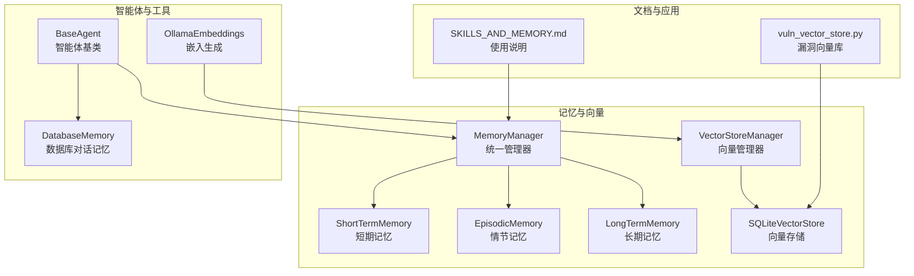
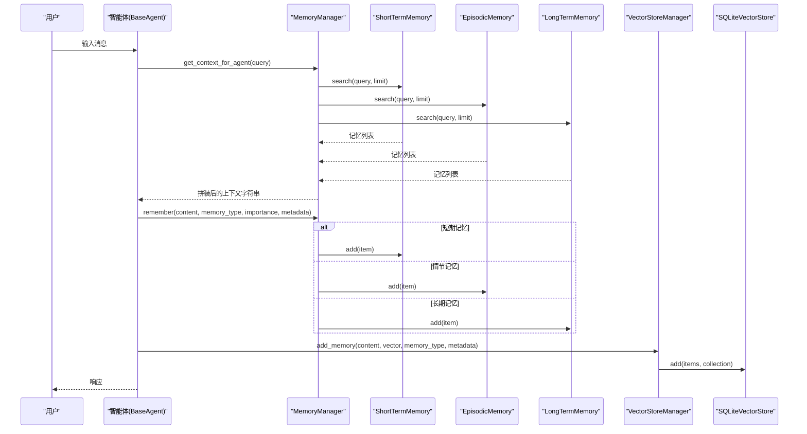
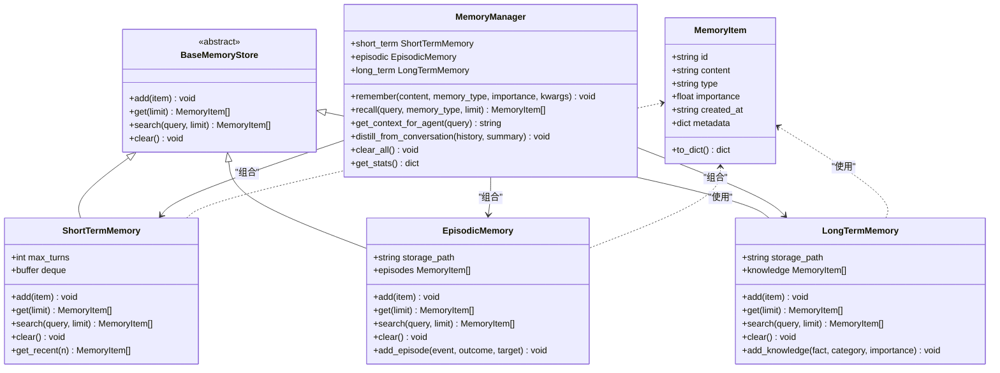
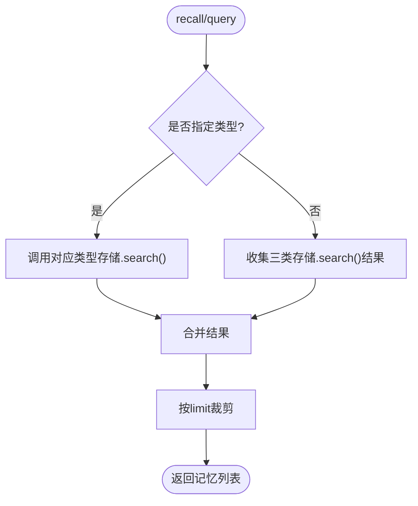
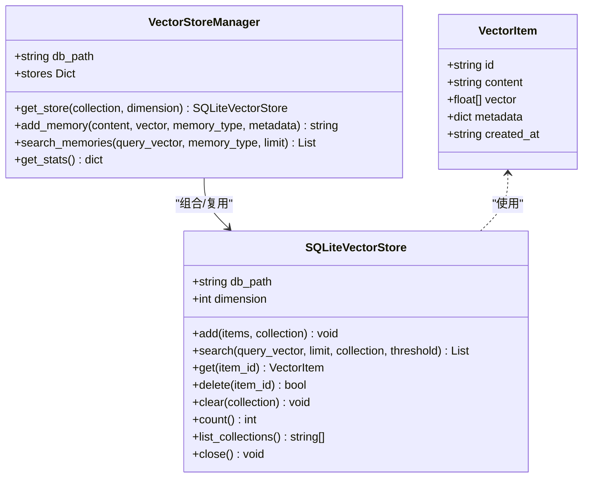
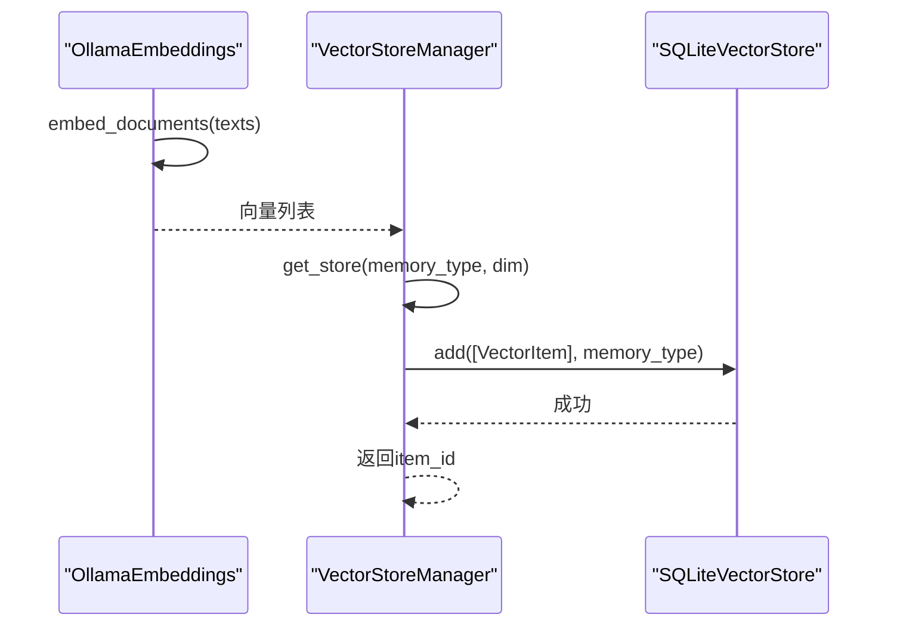
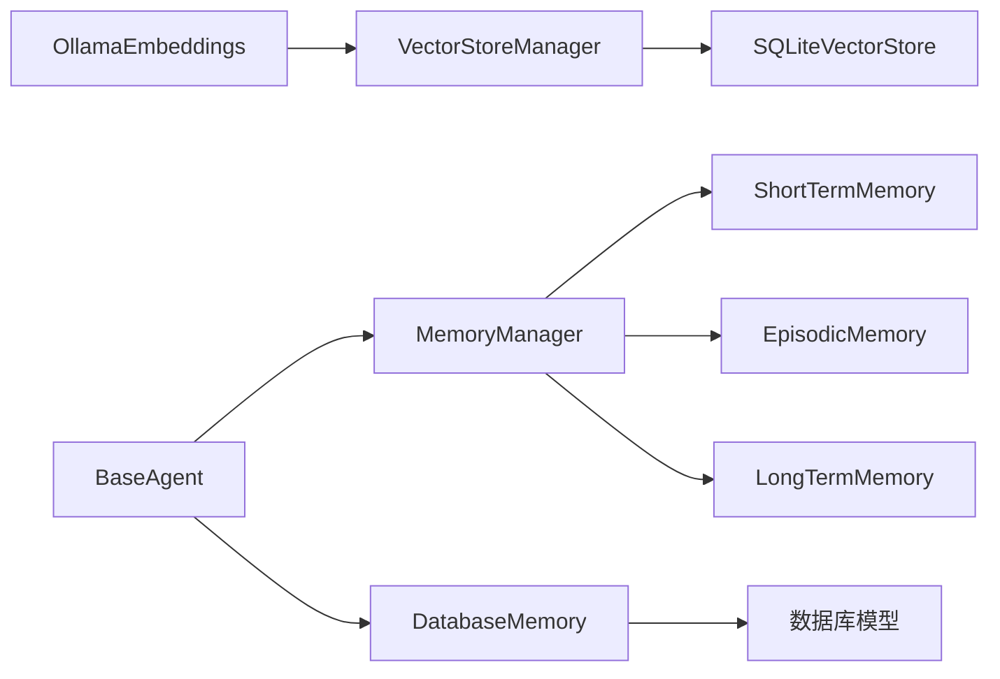

# 内存管理架构

<cite>
**本文引用的文件**
- [core/memory/__init__.py](file://core/memory/__init__.py)
- [core/memory/manager.py](file://core/memory/manager.py)
- [core/memory/vector_store.py](file://core/memory/vector_store.py)
- [core/memory/database_memory.py](file://core/memory/database_memory.py)
- [docs/SKILLS_AND_MEMORY.md](file://docs/SKILLS_AND_MEMORY.md)
- [core/agents/base.py](file://core/agents/base.py)
- [utils/embeddings.py](file://utils/embeddings.py)
- [core/vuln_db/vuln_vector_store.py](file://core/vuln_db/vuln_vector_store.py)
</cite>

## 目录
1. [简介](#简介)
2. [项目结构](#项目结构)
3. [核心组件](#核心组件)
4. [架构总览](#架构总览)
5. [组件详解](#组件详解)
6. [依赖关系分析](#依赖关系分析)
7. [性能考量](#性能考量)
8. [故障排查指南](#故障排查指南)
9. [结论](#结论)
10. [附录](#附录)

## 简介
本文件系统性阐述Secbot的三层记忆架构与统一管理器设计，覆盖短期记忆（ShortTermMemory）、情节记忆（EpisodicMemory）、长期记忆（LongTermMemory）的实现原理、数据结构、检索策略与使用场景；同时解析MemoryManager统一管理器的接口契约、检索算法与上下文拼装逻辑，并补充向量存储（SQLiteVectorStore/VectorStoreManager）在“三层记忆+向量检索”的混合架构中的角色与集成方式。最后提供内存管理的最佳实践，包括性能优化、内存泄漏防护与容量规划建议。

## 项目结构
围绕内存管理的相关模块分布如下：
- 核心记忆系统导出与聚合：core/memory/__init__.py
- 三层记忆与统一管理器：core/memory/manager.py
- 向量存储与管理器：core/memory/vector_store.py
- 数据库存储封装（对话记忆）：core/memory/database_memory.py
- 文档与使用示例：docs/SKILLS_AND_MEMORY.md
- 智能体基类与记忆集成点：core/agents/base.py
- 嵌入向量生成（Ollama）：utils/embeddings.py
- 漏洞向量库（向量存储的实际应用）：core/vuln_db/vuln_vector_store.py

**图示来源**
- [core/memory/__init__.py](file://core/memory/__init__.py#L6-L29)
- [core/memory/manager.py](file://core/memory/manager.py#L223-L325)
- [core/memory/vector_store.py](file://core/memory/vector_store.py#L30-L297)
- [core/memory/database_memory.py](file://core/memory/database_memory.py#L14-L38)
- [docs/SKILLS_AND_MEMORY.md](file://docs/SKILLS_AND_MEMORY.md#L64-L141)
- [core/agents/base.py](file://core/agents/base.py#L17-L125)
- [utils/embeddings.py](file://utils/embeddings.py#L11-L80)
- [core/vuln_db/vuln_vector_store.py](file://core/vuln_db/vuln_vector_store.py#L43-L80)

**章节来源**
- [core/memory/__init__.py](file://core/memory/__init__.py#L1-L30)
- [docs/SKILLS_AND_MEMORY.md](file://docs/SKILLS_AND_MEMORY.md#L64-L141)

## 核心组件
- MemoryItem：记忆条目数据结构，包含唯一ID、内容、类型（short_term/episodic/long_term）、重要度、创建时间与元数据。
- BaseMemoryStore：抽象存储接口，定义add/get/search/clear四个异步方法。
- ShortTermMemory：基于双端队列的短期记忆，支持最大轮次限制与最近N条访问。
- EpisodicMemory：跨会话事件记忆，采用JSON文件持久化，支持增删查清与事件片段便捷添加。
- LongTermMemory：持久化知识记忆，采用JSON文件持久化，支持知识条目添加与检索。
- MemoryManager：统一管理器，聚合三类记忆，提供remember/recall/get_context_for_agent/distill_from_conversation/clear_all/stats等能力。
- VectorItem/SQLiteVectorStore/VectorStoreManager：向量存储与管理器，支持向量入库、向量检索、集合管理与统计。
- DatabaseMemory：将对话保存至数据库，供智能体使用。

**章节来源**
- [core/memory/manager.py](file://core/memory/manager.py#L16-L49)
- [core/memory/manager.py](file://core/memory/manager.py#L51-L84)
- [core/memory/manager.py](file://core/memory/manager.py#L86-L152)
- [core/memory/manager.py](file://core/memory/manager.py#L154-L221)
- [core/memory/manager.py](file://core/memory/manager.py#L223-L325)
- [core/memory/vector_store.py](file://core/memory/vector_store.py#L15-L29)
- [core/memory/vector_store.py](file://core/memory/vector_store.py#L30-L237)
- [core/memory/vector_store.py](file://core/memory/vector_store.py#L239-L297)
- [core/memory/database_memory.py](file://core/memory/database_memory.py#L14-L38)

## 架构总览
三层记忆架构与向量检索的协同工作流如下：

**图示来源**
- [core/memory/manager.py](file://core/memory/manager.py#L223-L325)
- [core/memory/vector_store.py](file://core/memory/vector_store.py#L239-L297)

## 组件详解

### 三层记忆架构与存储策略
- 短期记忆（ShortTermMemory）
  - 存储介质：内存中的双端队列（deque），自动按最大轮次截断。
  - 特点：高吞吐、低延迟，适合当前会话上下文；提供最近N条访问方法。
  - 关键方法：add/get/search/clear/get_recent。
- 情节记忆（EpisodicMemory）
  - 存储介质：JSON文件（默认路径），每次新增后立即落盘。
  - 特点：跨会话保留事件与经验；提供事件片段便捷添加接口。
  - 关键方法：add/get/search/clear/add_episode。
- 长期记忆（LongTermMemory）
  - 存储介质：JSON文件（默认路径），每次新增后立即落盘。
  - 特点：持久化知识库；提供知识条目便捷添加接口。
  - 关键方法：add/get/search/clear/add_knowledge。

**图示来源**
- [core/memory/manager.py](file://core/memory/manager.py#L16-L325)

**章节来源**
- [core/memory/manager.py](file://core/memory/manager.py#L51-L84)
- [core/memory/manager.py](file://core/memory/manager.py#L86-L152)
- [core/memory/manager.py](file://core/memory/manager.py#L154-L221)
- [core/memory/manager.py](file://core/memory/manager.py#L223-L325)

### 统一管理器（MemoryManager）设计与检索算法
- 记忆存储接口：BaseMemoryStore定义了统一的异步接口，保证短期/情节/长期三类记忆的一致性。
- 记忆检索算法：
  - recall支持按类型检索或全量检索，分别调用对应存储的search。
  - get_context_for_agent将检索结果按类型分组，限制每类数量，拼装成结构化上下文字符串，便于注入到智能体提示词。
- 记忆蒸馏：distill_from_conversation将对话摘要以情节记忆形式保存，形成经验沉淀。
- 统计与清理：get_stats返回各类记忆数量；clear_all清空三类记忆。

**图示来源**
- [core/memory/manager.py](file://core/memory/manager.py#L250-L268)

**章节来源**
- [core/memory/manager.py](file://core/memory/manager.py#L250-L297)

### 向量存储与检索（SQLiteVectorStore/VectorStoreManager）
- VectorItem：向量项的数据结构，包含ID、内容、向量、元数据与创建时间。
- SQLiteVectorStore：
  - 使用SQLite存储向量，支持BLOB序列化与反序列化。
  - 若sqlite-vec可用则创建ANN虚拟表以加速检索；否则回退为纯量计算（余弦相似度）。
  - 提供add/search/get/delete/clear/count/list_collections等操作。
- VectorStoreManager：
  - 统一管理多个集合（collection），按集合名与维度创建或复用存储实例。
  - 提供add_memory与search_memories，支持按类型检索或全量聚合排序。

**图示来源**
- [core/memory/vector_store.py](file://core/memory/vector_store.py#L15-L297)

**章节来源**
- [core/memory/vector_store.py](file://core/memory/vector_store.py#L30-L237)
- [core/memory/vector_store.py](file://core/memory/vector_store.py#L239-L297)

### 与嵌入与漏洞向量库的集成
- 嵌入生成：OllamaEmbeddings提供异步向量生成接口，支持批量与单条生成。
- 漏洞向量库：vuln_vector_store将漏洞实体转换为VectorItem并写入向量存储，支持相似度检索并返回元数据与相似度分数。

**图示来源**
- [utils/embeddings.py](file://utils/embeddings.py#L11-L80)
- [core/memory/vector_store.py](file://core/memory/vector_store.py#L239-L297)
- [core/vuln_db/vuln_vector_store.py](file://core/vuln_db/vuln_vector_store.py#L43-L80)

**章节来源**
- [utils/embeddings.py](file://utils/embeddings.py#L11-L80)
- [core/vuln_db/vuln_vector_store.py](file://core/vuln_db/vuln_vector_store.py#L43-L80)

### 数据库存储封装（DatabaseMemory）
- DatabaseMemory将一轮对话保存到数据库模型Conversation，便于后续审计与回放。
- 与MemoryManager解耦，适合需要持久化对话历史的场景。

**章节来源**
- [core/memory/database_memory.py](file://core/memory/database_memory.py#L14-L38)

## 依赖关系分析
- MemoryManager聚合三类记忆存储，统一对外提供remember/recall等接口。
- VectorStoreManager按集合与维度管理SQLiteVectorStore，避免重复连接与配置开销。
- OllamaEmbeddings与VectorStoreManager配合，形成“文本→向量→检索”的闭环。
- DatabaseMemory与MemoryManager并行存在，分别服务于对话历史与知识记忆两类需求。
- BaseAgent持有对话历史与可选的MemoryManager实例，支持清空记忆与更新系统提示词。

**图示来源**
- [core/memory/manager.py](file://core/memory/manager.py#L223-L325)
- [core/memory/vector_store.py](file://core/memory/vector_store.py#L239-L297)
- [utils/embeddings.py](file://utils/embeddings.py#L11-L80)
- [core/memory/database_memory.py](file://core/memory/database_memory.py#L14-L38)
- [core/agents/base.py](file://core/agents/base.py#L17-L125)

**章节来源**
- [core/memory/manager.py](file://core/memory/manager.py#L223-L325)
- [core/memory/vector_store.py](file://core/memory/vector_store.py#L239-L297)
- [utils/embeddings.py](file://utils/embeddings.py#L11-L80)
- [core/memory/database_memory.py](file://core/memory/database_memory.py#L14-L38)
- [core/agents/base.py](file://core/agents/base.py#L17-L125)

## 性能考量
- 短期记忆
  - 使用deque自动截断，避免无限增长；max_turns可根据会话复杂度调整。
  - 搜索为线性过滤，建议limit控制在较小范围（如5-10）。
- 情节与长期记忆
  - JSON文件I/O成本随条目增多上升；建议定期归档不常用条目或拆分集合。
  - 搜索为全文小写包含匹配，复杂查询可结合向量检索。
- 向量检索
  - sqlite-vec可用时优先使用ANN索引；不可用时采用余弦相似度，复杂度较高。
  - 合理设置阈值与limit，避免全表扫描；批量插入与事务提交减少I/O次数。
- 内存与磁盘
  - 向量存储使用BLOB序列化，注意内存占用；建议按需加载与及时释放。
  - JSON文件建议定期备份与压缩，避免单文件过大影响读写。

[本节为通用性能指导，不直接分析具体文件]

## 故障排查指南
- 加载/保存失败
  - 情节与长期记忆在加载/保存JSON时捕获异常并记录告警/错误日志；检查存储路径权限与磁盘空间。
- 向量检索异常
  - sqlite-vec函数不存在时会回退为纯量计算；确认SQLite扩展是否正确安装。
  - 向量维度不匹配会导致序列化/反序列化异常；确保嵌入维度与存储维度一致。
- 记忆清理无效
  - MemoryManager.clear_all为异步清理，确保调用方等待完成；持久化记忆需显式触发清理。
- 智能体记忆清空
  - BaseAgent.clear_memory仅清空对话历史；如需清空持久化记忆，请调用MemoryManager.clear_all或相应存储的clear。

**章节来源**
- [core/memory/manager.py](file://core/memory/manager.py#L94-L119)
- [core/memory/manager.py](file://core/memory/manager.py#L162-L187)
- [core/memory/vector_store.py](file://core/memory/vector_store.py#L80-L88)
- [core/agents/base.py](file://core/agents/base.py#L103-L109)

## 结论
Secbot的内存管理采用“三层记忆+向量检索”的混合架构：短期记忆负责会话上下文，情节与长期记忆负责经验与知识沉淀，向量存储提供高效的语义检索能力。MemoryManager统一抽象了三层记忆的接口与检索流程，VectorStoreManager提供了灵活的集合与维度管理，DatabaseMemory补充了对话历史的持久化能力。通过合理的容量规划、阈值设置与清理策略，可在保证性能的同时维持良好的可维护性与可扩展性。

[本节为总结性内容，不直接分析具体文件]

## 附录
- 使用示例与最佳实践可参考文档：docs/SKILLS_AND_MEMORY.md
- 三层记忆的典型使用场景与接口说明见该文档的Usage与Memory Types部分。

**章节来源**
- [docs/SKILLS_AND_MEMORY.md](file://docs/SKILLS_AND_MEMORY.md#L77-L141)