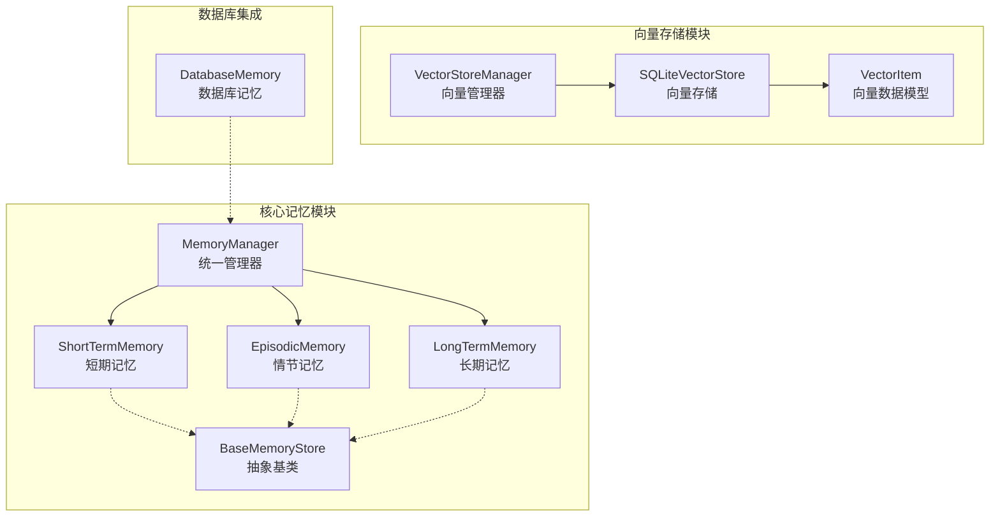
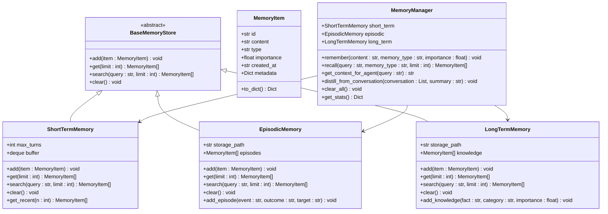
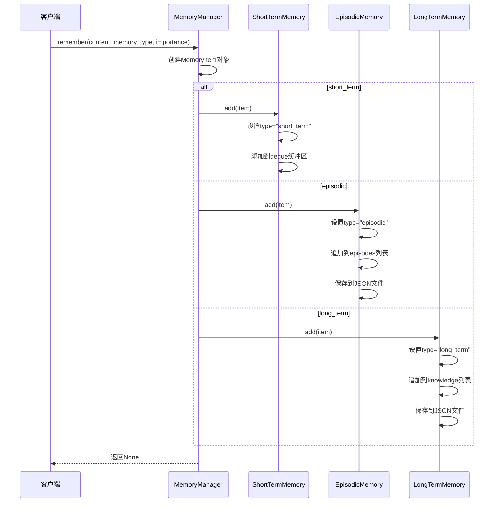
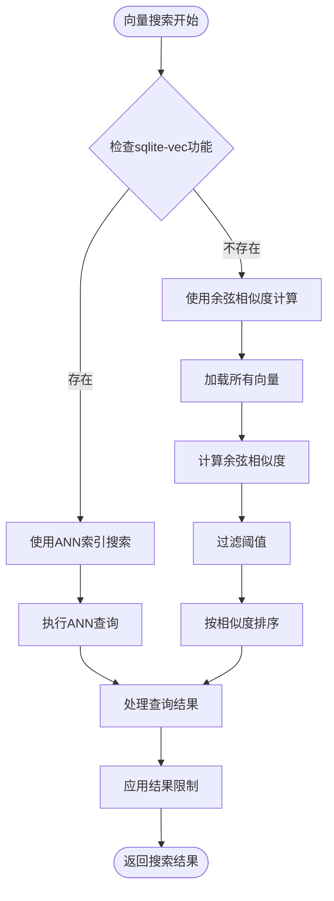
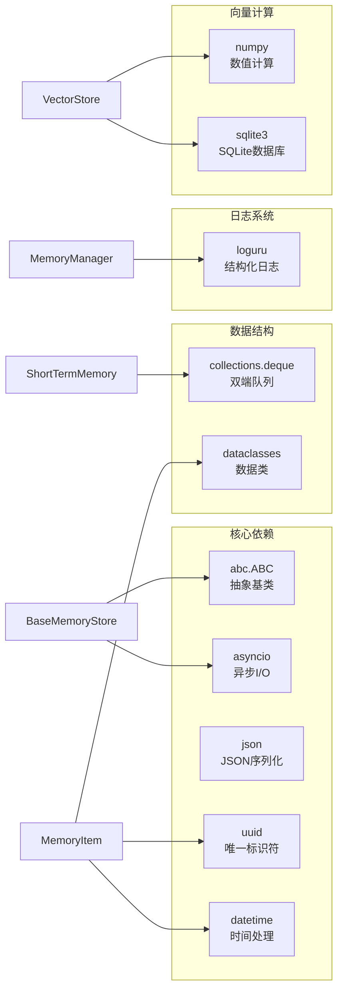
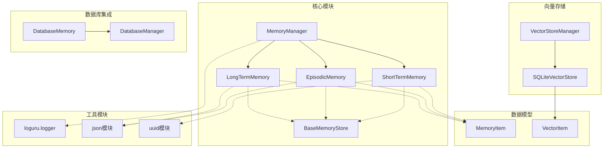

# 基础记忆存储接口

<cite>
**本文档引用的文件**
- [core/memory/manager.py](file://core/memory/manager.py)
- [core/memory/vector_store.py](file://core/memory/vector_store.py)
- [core/memory/database_memory.py](file://core/memory/database_memory.py)
- [core/memory/__init__.py](file://core/memory/__init__.py)
- [docs/SKILLS_AND_MEMORY.md](file://docs/SKILLS_AND_MEMORY.md)
- [pyproject.toml](file://pyproject.toml)
</cite>

## 目录
1. [简介](#简介)
2. [项目结构](#项目结构)
3. [核心组件](#核心组件)
4. [架构概览](#架构概览)
5. [详细组件分析](#详细组件分析)
6. [依赖关系分析](#依赖关系分析)
7. [性能考虑](#性能考虑)
8. [故障排除指南](#故障排除指南)
9. [结论](#结论)

## 简介

Secbot的基础记忆存储接口是一个基于Python抽象基类设计的统一记忆管理框架。该系统采用三层记忆架构，结合传统文本检索和现代向量相似度搜索，为AI代理提供完整的上下文记忆能力。本文档深入解析BaseMemoryStore抽象基类的设计理念、接口规范以及其实现模式，为开发者提供扩展和定制记忆存储功能的完整指南。

## 项目结构

Secbot的记忆系统主要位于`core/memory/`目录下，包含以下关键组件：

**图表来源**
- [core/memory/manager.py](file://core/memory/manager.py#L31-L49)
- [core/memory/vector_store.py](file://core/memory/vector_store.py#L30-L38)
- [core/memory/database_memory.py](file://core/memory/database_memory.py#L14-L27)

**章节来源**
- [core/memory/manager.py](file://core/memory/manager.py#L1-L325)
- [core/memory/vector_store.py](file://core/memory/vector_store.py#L1-L297)
- [core/memory/database_memory.py](file://core/memory/database_memory.py#L1-L38)

## 核心组件

### BaseMemoryStore抽象基类

BaseMemoryStore是整个记忆存储系统的核心抽象基类，定义了统一的记忆操作接口。该类采用Python的ABC（Abstract Base Class）机制，确保所有具体实现都必须提供完整的接口实现。

#### 接口规范

BaseMemoryStore定义了四个核心抽象方法：

1. **add()方法** - 添加记忆项
   - 异步实现要求：必须使用`async def`关键字
   - 参数：`item: MemoryItem` - 要添加的记忆项
   - 返回值：`None` - 异步操作完成时返回空值
   - 异常处理：需要适当的错误处理和日志记录

2. **get()方法** - 获取记忆项
   - 异步实现要求：必须使用`async def`关键字
   - 参数：`limit: int = None` - 可选的限制参数
   - 返回值：`List[MemoryItem]` - 记忆项列表
   - 性能考虑：应考虑内存使用和查询效率

3. **search()方法** - 搜索记忆
   - 异步实现要求：必须使用`async def`关键字
   - 参数：`query: str` - 搜索查询字符串，`limit: int = 5` - 结果限制
   - 返回值：`List[MemoryItem]` - 匹配的记忆项列表
   - 实现模式：通常基于内容匹配或向量相似度

4. **clear()方法** - 清空存储
   - 异步实现要求：必须使用`async def`关键字
   - 参数：无
   - 返回值：`None` - 清空操作完成时返回空值

#### 设计模式应用

BaseMemoryStore采用了以下设计模式：

- **模板方法模式**：定义算法骨架，允许子类实现具体步骤
- **策略模式**：不同存储类型可以采用不同的存储策略
- **工厂模式**：MemoryManager作为工厂负责创建和管理各种记忆存储实例

**章节来源**
- [core/memory/manager.py](file://core/memory/manager.py#L31-L49)

## 架构概览

Secbot的记忆系统采用分层架构设计，实现了从抽象接口到具体实现的完整层次：

**图表来源**
- [core/memory/manager.py](file://core/memory/manager.py#L16-L29)
- [core/memory/manager.py](file://core/memory/manager.py#L31-L49)
- [core/memory/manager.py](file://core/memory/manager.py#L51-L84)
- [core/memory/manager.py](file://core/memory/manager.py#L86-L152)
- [core/memory/manager.py](file://core/memory/manager.py#L154-L221)
- [core/memory/manager.py](file://core/memory/manager.py#L223-L325)

## 详细组件分析

### MemoryManager统一管理器

MemoryManager是记忆系统的协调中心，负责管理三种不同类型的记忆存储，并提供统一的API接口。

#### 核心功能

1. **记忆添加** (`remember()`方法)
   - 支持三种记忆类型：short_term、episodic、long_term
   - 自动设置记忆类型和重要性级别
   - 提供灵活的元数据支持

2. **记忆召回** (`recall()`方法)
   - 支持按类型召回或全局召回
   - 提供多类型记忆的综合搜索
   - 支持查询过滤和结果限制

3. **上下文生成** (`get_context_for_agent()`方法)
   - 为AI代理生成结构化上下文
   - 按记忆类型组织内容
   - 提供格式化的记忆摘要

#### 内存管理策略

**图表来源**
- [core/memory/manager.py](file://core/memory/manager.py#L231-L249)
- [core/memory/manager.py](file://core/memory/manager.py#L58-L61)
- [core/memory/manager.py](file://core/memory/manager.py#L121-L125)
- [core/memory/manager.py](file://core/memory/manager.py#L189-L193)

**章节来源**
- [core/memory/manager.py](file://core/memory/manager.py#L223-L325)

### ShortTermMemory短期记忆

短期记忆实现了一个基于双端队列(deque)的内存存储，专门用于会话内的上下文管理。

#### 特点与优势

1. **内存高效**：使用deque的固定大小特性，自动管理内存使用
2. **快速访问**：支持O(1)时间复杂度的两端操作
3. **自动清理**：超出容量时自动移除最旧的条目
4. **实时性**：适合存储当前会话的最新交互历史

#### 实现细节

- **容量控制**：通过`maxlen`参数限制最大存储条目数
- **类型标记**：自动将添加的记忆标记为"short_term"
- **日志记录**：提供详细的内存状态日志
- **最近访问**：额外提供`get_recent()`方法获取最新条目

**章节来源**
- [core/memory/manager.py](file://core/memory/manager.py#L51-L84)

### EpisodicMemory情节记忆

情节记忆提供了跨会话的记忆持久化功能，使用JSON文件存储历史事件和经验。

#### 存储机制

1. **文件存储**：使用JSON格式将记忆序列化到文件
2. **自动加载**：初始化时自动从文件加载现有记忆
3. **增量保存**：每次添加新记忆时立即保存到文件
4. **路径管理**：自动创建必要的目录结构

#### 扩展功能

- **事件片段**：提供`add_episode()`方法专门用于添加事件
- **经验提取**：支持从对话中蒸馏出经验片段
- **元数据丰富**：支持存储事件的结果和目标信息

**章节来源**
- [core/memory/manager.py](file://core/memory/manager.py#L86-L152)

### LongTermMemory长期记忆

长期记忆专注于持久化知识库，为AI代理提供稳定的背景知识。

#### 知识管理

1. **知识分类**：支持按类别组织知识内容
2. **重要性评估**：基于重要性分数进行排序和筛选
3. **知识蒸馏**：从经验中提取和总结知识
4. **持久存储**：确保知识在重启后仍然可用

#### 高级功能

- **专用添加**：提供`add_knowledge()`方法专门用于知识添加
- **分类管理**：支持按主题或领域分类知识
- **重要性权重**：可根据知识的重要性调整检索权重

**章节来源**
- [core/memory/manager.py](file://core/memory/manager.py#L154-L221)

### SQLiteVectorStore向量存储

向量存储模块提供了基于SQLite的向量相似度搜索功能，支持高效的语义检索。

#### 技术架构

**图表来源**
- [core/memory/vector_store.py](file://core/memory/vector_store.py#L135-L175)

#### 功能特性

1. **双模式搜索**：自动检测并利用sqlite-vec功能
2. **相似度计算**：支持向量间的余弦相似度计算
3. **阈值过滤**：可配置相似度阈值过滤结果
4. **集合管理**：支持多集合向量存储和管理

**章节来源**
- [core/memory/vector_store.py](file://core/memory/vector_store.py#L30-L297)

### DatabaseMemory数据库集成

DatabaseMemory提供了与数据库系统的集成接口，专门用于保存对话历史。

#### 集成特点

1. **类型安全**：使用强类型的Conversation模型
2. **会话关联**：支持按会话ID组织对话历史
3. **代理类型**：区分不同类型的AI代理
4. **时间戳**：自动记录对话时间

**章节来源**
- [core/memory/database_memory.py](file://core/memory/database_memory.py#L14-L38)

## 依赖关系分析

### 外部依赖

Secbot的记忆系统依赖以下关键外部库：

**图表来源**
- [core/memory/manager.py](file://core/memory/manager.py#L6-L13)
- [core/memory/vector_store.py](file://core/memory/vector_store.py#L6-L12)
- [pyproject.toml](file://pyproject.toml#L29-L69)

### 内部依赖关系

**图表来源**
- [core/memory/manager.py](file://core/memory/manager.py#L1-L325)
- [core/memory/vector_store.py](file://core/memory/vector_store.py#L1-L297)
- [core/memory/database_memory.py](file://core/memory/database_memory.py#L1-L38)

**章节来源**
- [pyproject.toml](file://pyproject.toml#L29-L69)

## 性能考虑

### 内存优化策略

1. **短期记忆优化**
   - 使用固定大小的deque避免内存无限增长
   - 自动清理最旧的条目，保持最佳性能
   - 支持动态调整最大容量

2. **文件存储优化**
   - 采用增量保存策略，减少磁盘I/O
   - 使用缓冲机制批量写入
   - 异常安全的文件操作

3. **向量搜索优化**
   - sqlite-vec功能检测和降级处理
   - ANN索引的条件使用
   - 相似度计算的缓存策略

### 异步性能设计

1. **非阻塞操作**：所有存储操作都是异步的
2. **并发安全**：使用适当的锁机制保护共享资源
3. **资源管理**：及时释放数据库连接和文件句柄

### 扩展性考虑

1. **插件架构**：支持自定义存储后端
2. **配置驱动**：通过配置文件调整性能参数
3. **监控集成**：提供详细的性能指标和日志

## 故障排除指南

### 常见问题及解决方案

#### 记忆存储异常

1. **文件权限问题**
   - 症状：EpisodicMemory和LongTermMemory保存失败
   - 解决方案：检查数据目录的读写权限
   - 预防措施：启动时自动创建目录结构

2. **JSON序列化错误**
   - 症状：MemoryItem转换为字典时失败
   - 解决方案：检查元数据的可序列化性
   - 预防措施：使用简单的数据类型

3. **数据库连接问题**
   - 症状：向量存储无法建立数据库连接
   - 解决方案：检查数据库文件路径和权限
   - 预防措施：使用相对路径和自动创建

#### 性能问题诊断

1. **内存使用过高**
   - 检查短期记忆的最大容量设置
   - 监控长期记忆的增长趋势
   - 考虑启用自动清理机制

2. **搜索性能下降**
   - 检查向量维度和相似度阈值
   - 验证sqlite-vec功能是否正常
   - 考虑重建ANN索引

#### 异步操作问题

1. **协程死锁**
   - 症状：异步操作长时间挂起
   - 解决方案：检查事件循环状态
   - 预防措施：使用适当的超时机制

2. **异常传播问题**
   - 症状：异常没有正确处理
   - 解决方案：添加适当的异常捕获和日志记录
   - 预防措施：使用try-except-finally结构

**章节来源**
- [core/memory/manager.py](file://core/memory/manager.py#L94-L104)
- [core/memory/manager.py](file://core/memory/manager.py#L162-L173)
- [core/memory/vector_store.py](file://core/memory/vector_store.py#L80-L89)

## 结论

Secbot的基础记忆存储接口通过精心设计的抽象基类和多种具体实现，为AI代理提供了强大而灵活的记忆管理能力。BaseMemoryStore抽象基类定义了统一的接口规范，确保了不同存储类型的兼容性和互换性。

### 主要优势

1. **统一接口**：通过抽象基类确保所有存储实现的一致性
2. **灵活扩展**：支持自定义存储后端的开发
3. **性能优化**：针对不同场景提供了专门的优化策略
4. **可靠性保证**：完善的异常处理和错误恢复机制

### 最佳实践建议

1. **接口实现**：遵循BaseMemoryStore的异步接口规范
2. **错误处理**：实现适当的异常处理和日志记录
3. **性能监控**：定期监控内存使用和查询性能
4. **数据备份**：对重要的持久化存储实施备份策略

### 发展方向

1. **分布式存储**：支持分布式内存存储方案
2. **云原生集成**：提供云存储后端的支持
3. **机器学习增强**：集成更高级的检索和推荐算法
4. **实时同步**：支持多实例间的数据同步

通过遵循本文档提供的设计原则和最佳实践，开发者可以成功扩展和定制Secbot的记忆存储功能，满足各种复杂的AI应用场景需求。