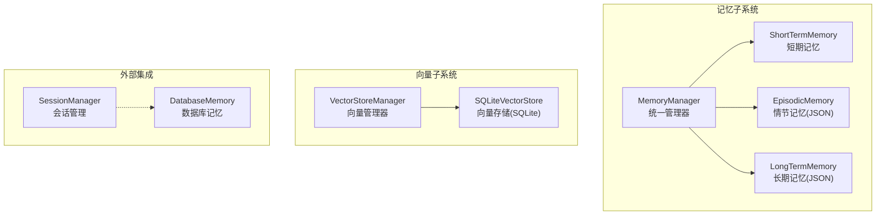
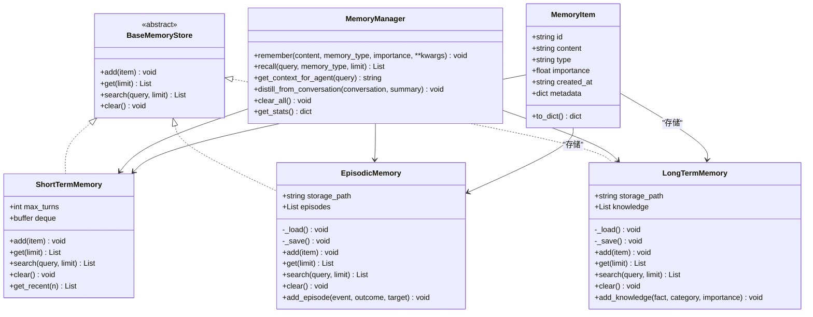
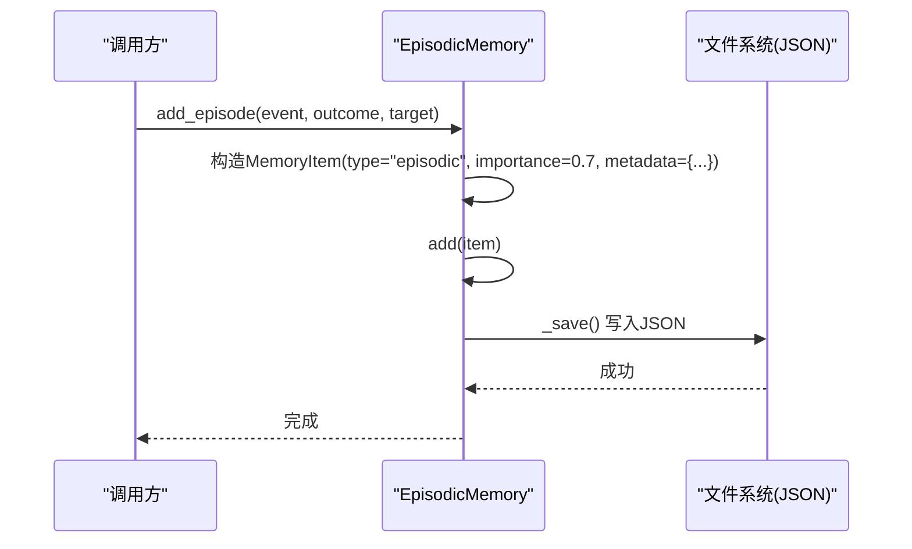
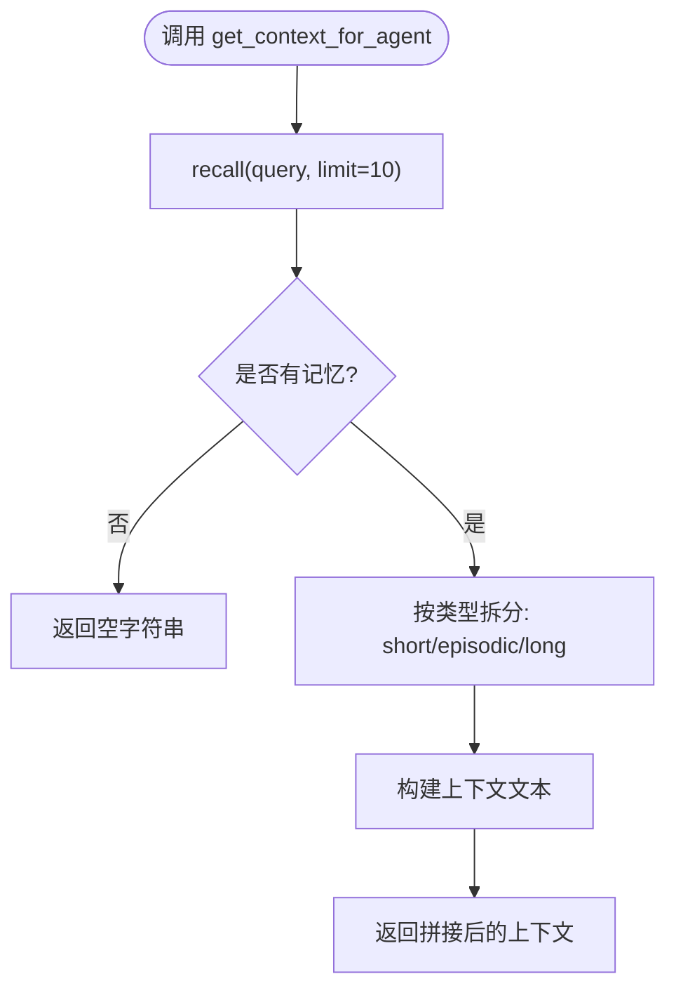
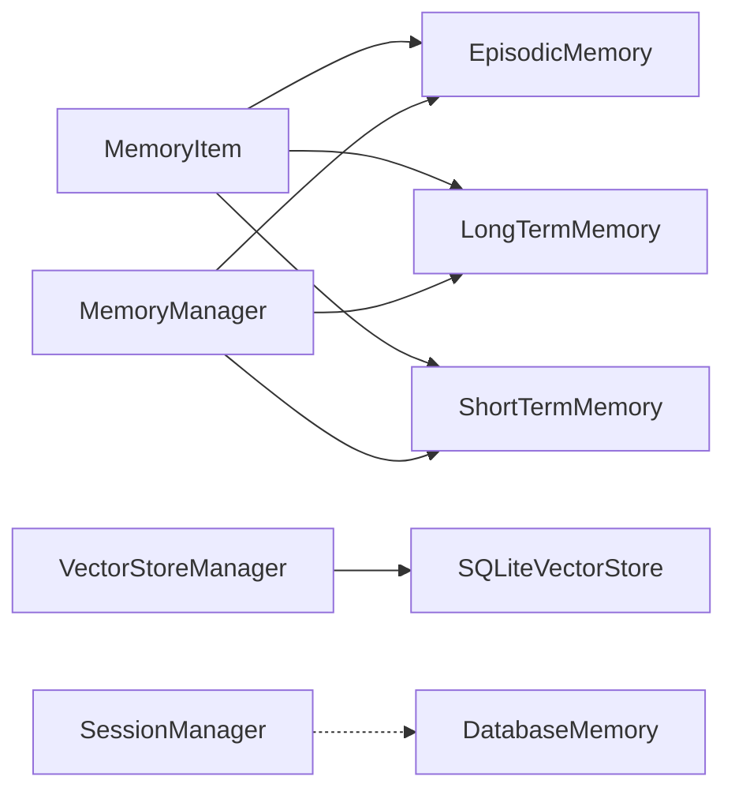

# 情节记忆系统

<cite>
**本文引用的文件列表**
- [manager.py](file://core/memory/manager.py)
- [__init__.py](file://core/memory/__init__.py)
- [SKILLS_AND_MEMORY.md](file://docs/SKILLS_AND_MEMORY.md)
- [vector_store.py](file://core/memory/vector_store.py)
- [database_memory.py](file://core/memory/database_memory.py)
- [session_manager.py](file://controller/session_manager.py)
</cite>

## 目录
1. [简介](#简介)
2. [项目结构](#项目结构)
3. [核心组件](#核心组件)
4. [架构总览](#架构总览)
5. [详细组件分析](#详细组件分析)
6. [依赖关系分析](#依赖关系分析)
7. [性能考量](#性能考量)
8. [故障排查指南](#故障排查指南)
9. [结论](#结论)
10. [附录](#附录)

## 简介
本文件面向Secbot的情节记忆系统（EpisodicMemory），系统性阐述其设计理念与实现原理，重点覆盖：
- JSON文件持久化存储与跨会话记忆保持策略
- 事件片段管理机制与“事件-结果-目标”等元数据字段
- _add_episode()与_add_knowledge()方法的实现逻辑
- 文件存储路径配置、数据序列化与反序列化细节
- 实际应用场景：渗透测试过程记录、攻击链执行历史、经验总结等

## 项目结构
情节记忆系统位于core/memory目录，采用三层记忆架构（短期、情节、长期）并辅以向量检索能力。与会话管理、数据库记忆等模块协同工作，支撑智能体在多轮交互与跨会话中的上下文与经验复用。

图表来源
- [manager.py](file://core/memory/manager.py#L223-L324)
- [vector_store.py](file://core/memory/vector_store.py#L30-L297)
- [database_memory.py](file://core/memory/database_memory.py#L14-L38)
- [session_manager.py](file://controller/session_manager.py#L9-L91)

章节来源
- [manager.py](file://core/memory/manager.py#L1-L325)
- [__init__.py](file://core/memory/__init__.py#L1-L30)

## 核心组件
- MemoryItem：记忆单元的数据结构，包含唯一ID、内容、类型、重要度、创建时间与元数据字典，并提供to_dict序列化方法。
- BaseMemoryStore：抽象基类，定义add/get/search/clear接口。
- ShortTermMemory：基于双端队列的短期记忆，自动截断，适合会话上下文。
- EpisodicMemory：跨会话情节记忆，基于JSON文件持久化，支持事件片段添加与检索。
- LongTermMemory：长期知识记忆，同样基于JSON文件持久化，支持知识条目添加与检索。
- MemoryManager：统一管理器，协调三类记忆，提供recall、get_context_for_agent、distill_from_conversation等高级能力。
- SQLiteVectorStore/VectorStoreManager：可选的向量检索能力，用于语义相似度检索（非情节记忆的默认实现）。
- DatabaseMemory：将对话持久化至数据库，与记忆系统互补。

章节来源
- [manager.py](file://core/memory/manager.py#L16-L49)
- [manager.py](file://core/memory/manager.py#L51-L84)
- [manager.py](file://core/memory/manager.py#L86-L152)
- [manager.py](file://core/memory/manager.py#L154-L221)
- [manager.py](file://core/memory/manager.py#L223-L324)
- [vector_store.py](file://core/memory/vector_store.py#L15-L297)
- [database_memory.py](file://core/memory/database_memory.py#L14-L38)

## 架构总览
情节记忆系统遵循三层记忆架构，其中EpisodicMemory负责跨会话事件与经验的持久化存储，通过JSON文件实现简单可靠的数据持久化；同时提供便捷的方法用于添加事件片段与知识条目，并支持基于内容的检索。

图表来源
- [manager.py](file://core/memory/manager.py#L16-L324)

## 详细组件分析

### EpisodicMemory：跨会话情节记忆
- 存储介质：JSON文件，默认路径为“./data/episodic_memory.json”，启动时自动加载，写入时自动保存。
- 数据结构：内部维护MemoryItem列表，每个条目包含content、type、importance、metadata等字段。
- 关键方法：
  - add(item)：设置type为“episodic”，追加到列表并立即保存。
  - get(limit)：返回最近limit条或全部。
  - search(query, limit)：大小写不敏感的内容匹配，返回最近limit条。
  - clear()：清空并保存。
  - add_episode(event, outcome, target)：便捷方法，构造带元数据的MemoryItem并调用add。
- 元数据字段：
  - outcome：事件结果描述
  - target：事件目标标识
  - importance：默认0.7，表示该事件的重要性权重

图表来源
- [manager.py](file://core/memory/manager.py#L143-L151)
- [manager.py](file://core/memory/manager.py#L121-L125)
- [manager.py](file://core/memory/manager.py#L106-L119)

章节来源
- [manager.py](file://core/memory/manager.py#L86-L152)

### MemoryItem：记忆单元数据模型
- 字段说明：
  - id：UUID生成的唯一标识
  - content：记忆内容文本
  - type：记忆类型（short_term/episodic/long_term）
  - importance：重要度（0~1）
  - created_at：UTC时间戳
  - metadata：任意字典，用于扩展元数据
- 序列化：to_dict()输出可用于JSON序列化

章节来源
- [manager.py](file://core/memory/manager.py#L16-L29)

### MemoryManager：统一记忆管理器
- remember(content, memory_type, importance, **kwargs)：根据类型分发到对应存储。
- recall(query, memory_type, limit)：可指定类型检索或全量检索。
- get_context_for_agent(query)：组装适合注入智能体的上下文字符串，包含recent context、past experiences、knowledge三部分。
- distill_from_conversation(conversation, summary)：从对话摘要生成情节记忆条目，便于后续检索与复用。
- clear_all()：清空三类记忆。
- get_stats()：返回各类记忆数量统计。

图表来源
- [manager.py](file://core/memory/manager.py#L270-L297)

章节来源
- [manager.py](file://core/memory/manager.py#L223-L324)

### 长期记忆（对比参考）
- LongTermMemory与EpisodicMemory类似，但默认存储路径为“./data/long_term_memory.json”，主要用于持久化知识与模式。
- add_knowledge(fact, category, importance)：便捷方法，构造带category元数据的MemoryItem并保存。

章节来源
- [manager.py](file://core/memory/manager.py#L154-L221)

### 向量检索（可选增强）
- SQLiteVectorStore/VectorStoreManager提供基于sqlite-vec/sqlite-vss的向量检索能力，适合需要语义相似度检索的场景。
- 与情节记忆的JSON存储互为补充，可在需要时启用。

章节来源
- [vector_store.py](file://core/memory/vector_store.py#L30-L297)

### 数据库记忆（会话持久化）
- DatabaseMemory将每轮对话保存到数据库，与记忆系统的JSON文件形成互补，便于审计与回放。

章节来源
- [database_memory.py](file://core/memory/database_memory.py#L14-L38)

## 依赖关系分析
- EpisodicMemory依赖MemoryItem进行数据建模与序列化；依赖文件系统进行JSON读写。
- MemoryManager聚合三类记忆，提供统一入口；与会话管理、数据库模块存在协作关系。
- 向量检索模块独立，可按需启用。

图表来源
- [manager.py](file://core/memory/manager.py#L16-L324)
- [vector_store.py](file://core/memory/vector_store.py#L30-L297)
- [database_memory.py](file://core/memory/database_memory.py#L14-L38)
- [session_manager.py](file://controller/session_manager.py#L9-L91)

章节来源
- [manager.py](file://core/memory/manager.py#L1-L325)
- [__init__.py](file://core/memory/__init__.py#L1-L30)

## 性能考量
- JSON文件I/O：每次add都会触发写盘，频繁写入可能影响性能。建议批量写入或合并写入策略（当前实现逐条即时写入）。
- 检索复杂度：search为线性扫描，O(N)；当数据量增大时可考虑引入向量检索或索引优化。
- 内存占用：短期记忆使用固定长度队列，避免无限增长；情节与长期记忆在加载时一次性载入，注意大文件带来的内存压力。
- 并发安全：当前实现未显式加锁，多进程或多线程并发写入需谨慎。

## 故障排查指南
- 加载失败：检查存储路径是否存在、权限是否足够、JSON格式是否正确。
- 保存失败：确认目录可写、磁盘空间充足、编码问题（ensure_ascii=False）。
- 检索无结果：确认query大小写不敏感匹配逻辑，或考虑引入向量检索提升召回质量。
- 跨会话丢失：确保storage_path配置一致且持久化目录未被清理。

章节来源
- [manager.py](file://core/memory/manager.py#L94-L119)
- [manager.py](file://core/memory/manager.py#L131-L136)

## 结论
EpisodicMemory通过简洁可靠的JSON文件持久化，实现了跨会话事件与经验的稳定存储与检索。结合MemoryManager的上下文组装与蒸馏能力，能够有效支撑智能体在渗透测试、攻击链执行与经验总结等场景中的上下文复用与知识沉淀。对于大规模数据与高并发需求，可结合向量检索与数据库记忆进一步增强。

## 附录

### 文件存储路径与序列化细节
- 默认路径
  - 情节记忆：./data/episodic_memory.json
  - 长期记忆：./data/long_term_memory.json
  - 向量存储：./data/vectors.db
- 序列化
  - 写入：将MemoryItem列表转换为字典列表后写入JSON，缩进2空格，UTF-8编码，ensure_ascii=False
  - 读取：从JSON读取后重建MemoryItem对象列表
- 自动创建目录：写入前确保父目录存在

章节来源
- [manager.py](file://core/memory/manager.py#L89-L119)
- [manager.py](file://core/memory/manager.py#L157-L187)
- [vector_store.py](file://core/memory/vector_store.py#L33-L78)

### 方法实现要点
- add_episode(event, outcome, target)
  - 设置type为“episodic”
  - importance设为0.7
  - metadata包含outcome与target
  - 调用add并触发保存
- add_knowledge(fact, category, importance)
  - 设置type为“long_term”
  - metadata包含category
  - 调用add并触发保存

章节来源
- [manager.py](file://core/memory/manager.py#L143-L151)
- [manager.py](file://core/memory/manager.py#L210-L220)

### 使用场景示例（基于现有API）
- 渗透测试过程记录
  - 使用remember(content=..., memory_type="episodic", importance=0.7, target=...)
  - 或直接调用add_episode(event, outcome, target)
- 攻击链执行历史
  - 在执行阶段调用distill_from_conversation(conversation, summary)，将对话摘要转化为情节记忆
- 经验总结
  - 使用add_knowledge(fact, category="exploitation", importance=0.8)将经验固化为长期知识

章节来源
- [SKILLS_AND_MEMORY.md](file://docs/SKILLS_AND_MEMORY.md#L77-L103)
- [manager.py](file://core/memory/manager.py#L299-L309)
- [manager.py](file://core/memory/manager.py#L210-L220)