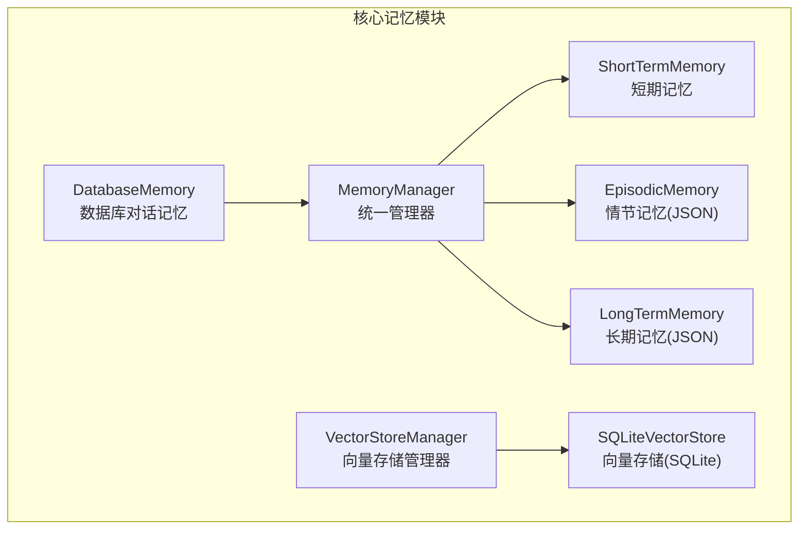
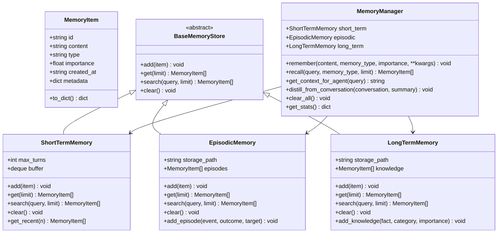
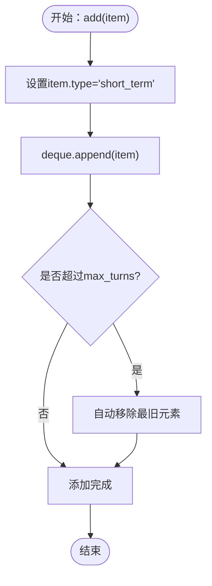
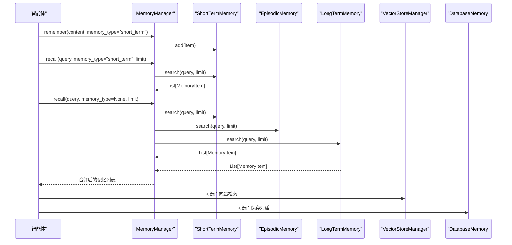
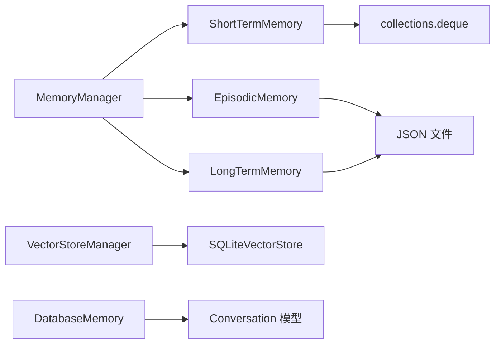

# 短期记忆系统

<cite>
**本文引用的文件**
- [core/memory/manager.py](file://core/memory/manager.py)
- [core/memory/__init__.py](file://core/memory/__init__.py)
- [core/memory/vector_store.py](file://core/memory/vector_store.py)
- [core/memory/database_memory.py](file://core/memory/database_memory.py)
- [core/session.py](file://core/session.py)
- [docs/SKILLS_AND_MEMORY.md](file://docs/SKILLS_AND_MEMORY.md)
- [router/sessions.py](file://router/sessions.py)
</cite>

## 目录
1. [简介](#简介)
2. [项目结构](#项目结构)
3. [核心组件](#核心组件)
4. [架构概览](#架构概览)
5. [详细组件分析](#详细组件分析)
6. [依赖关系分析](#依赖关系分析)
7. [性能考量](#性能考量)
8. [故障排查指南](#故障排查指南)
9. [结论](#结论)
10. [附录](#附录)

## 简介
本文件面向Secbot的短期记忆系统，聚焦ShortTermMemory的设计理念与实现细节，包括：
- 基于双端队列(deque)的循环缓冲区设计与max_turns参数的配置与限制机制
- 生命周期管理：自动清理、内存使用控制与性能优化策略
- 在会话上下文中的应用场景：对话历史管理、最近交互记录、临时信息存储
- 使用示例：add()、get()、search()、clear()等方法的最佳实践
- 与其它记忆类型的协作关系与数据流转过程

## 项目结构
短期记忆系统位于核心记忆模块中，采用三层记忆架构（短期、情节、长期）。短期记忆作为会话内的上下文容器，使用deque实现固定容量的循环缓冲区，确保在有限内存内维持最新的交互上下文。

图表来源
- [core/memory/manager.py](file://core/memory/manager.py#L223-L325)
- [core/memory/vector_store.py](file://core/memory/vector_store.py#L239-L297)
- [core/memory/database_memory.py](file://core/memory/database_memory.py#L14-L38)

章节来源
- [core/memory/manager.py](file://core/memory/manager.py#L1-L325)
- [core/memory/__init__.py](file://core/memory/__init__.py#L1-L30)

## 核心组件
- MemoryItem：记忆项的数据结构，包含内容、类型、重要度、时间戳与元数据
- BaseMemoryStore：抽象基类，定义add/get/search/clear接口
- ShortTermMemory：短期记忆，基于deque的循环缓冲区，受max_turns限制
- EpisodicMemory：情节记忆，跨会话事件与经验，持久化到JSON
- LongTermMemory：长期记忆，持久化知识，JSON存储
- MemoryManager：统一管理器，协调三类记忆的添加、召回与上下文拼装
- VectorStoreManager/SQLiteVectorStore：可选的向量检索能力（非短期记忆核心）
- DatabaseMemory：将对话保存到数据库，供智能体使用

章节来源
- [core/memory/manager.py](file://core/memory/manager.py#L16-L325)
- [core/memory/vector_store.py](file://core/memory/vector_store.py#L15-L297)
- [core/memory/database_memory.py](file://core/memory/database_memory.py#L14-L38)

## 架构概览
短期记忆在三层记忆架构中的定位是“会话上下文”。它与情节记忆、长期记忆协同工作，共同为智能体提供丰富的上下文信息。短期记忆通过MemoryManager对外暴露统一接口，同时支持向量检索与数据库对话记忆的扩展。

图表来源
- [core/memory/manager.py](file://core/memory/manager.py#L16-L325)

## 详细组件分析

### ShortTermMemory：基于deque的循环缓冲区
- 设计理念
  - 会话内上下文：短期记忆承载当前会话的最新交互，随对话轮次增长而滚动
  - 固定容量：通过deque的maxlen参数实现自动裁剪，避免无限增长
  - 最近优先：支持按最近n条检索，满足智能体对上下文顺序的敏感需求
- 关键实现要点
  - 初始化：接收max_turns参数，默认10，作为deque的maxlen
  - 添加：统一标记type为short_term，追加到buffer末尾
  - 获取：支持limit参数，返回最近limit条；get_recent提供便捷访问
  - 搜索：大小写不敏感的子串匹配，返回前limit条
  - 清空：清空buffer并记录日志
- 生命周期管理
  - 自动清理：当buffer达到maxlen时，新元素追加会自动移除最旧元素
  - 内存控制：deque在maxlen下占用常数级额外空间，内存使用与max_turns线性相关
  - 性能优化：append操作为O(1)，search为O(n)；n为当前buffer长度
- 与会话上下文的协作
  - 会话管理器在每次交互后将消息加入会话，短期记忆用于提供最近上下文
  - MemoryManager的get_context_for_agent会优先拼装短期记忆，作为智能体的上下文提示

图表来源
- [core/memory/manager.py](file://core/memory/manager.py#L58-L61)

章节来源
- [core/memory/manager.py](file://core/memory/manager.py#L51-L84)

### max_turns参数：配置与限制机制
- 配置方式
  - MemoryManager构造时创建ShortTermMemory实例，传入max_turns，默认10
  - 可在实例化时调整max_turns以适配不同场景（如长对话、短问答）
- 限制机制
  - deque的maxlen确保buffer长度不会超过max_turns
  - 新增元素时，超出部分自动丢弃，保证内存与性能稳定
- 最佳实践
  - 长对话场景：适当增大max_turns，但需考虑内存占用
  - 短问答场景：较小max_turns可减少冗余上下文
  - 与get_context_for_agent结合：通过limit参数进一步裁剪输出

章节来源
- [core/memory/manager.py](file://core/memory/manager.py#L227-L227)

### 生命周期管理：自动清理、内存控制与性能优化
- 自动清理
  - deque的maxlen实现自动裁剪，无需手动干预
  - clear()方法可显式清空短期记忆
- 内存使用控制
  - deque在maxlen下内存占用稳定，与max_turns成正比
  - 单个MemoryItem包含字符串与字典，建议控制content长度与metadata复杂度
- 性能优化策略
  - add/get/search均为O(1)/O(n)；n为当前buffer长度
  - 对高频调用场景，建议批量处理或合并查询
  - 与MemoryManager的recall组合使用，避免重复检索

章节来源
- [core/memory/manager.py](file://core/memory/manager.py#L58-L84)

### 应用场景：会话上下文中的短期记忆
- 对话历史管理
  - 会话管理器在每次交互后将消息加入会话，短期记忆提供最近上下文
  - MemoryManager.get_context_for_agent会优先拼装短期记忆
- 最近交互记录
  - get_recent(n)返回最近n条，适合需要强调时序的场景
- 临时信息存储
  - 作为智能体推理过程中的临时上下文，不持久化到磁盘

章节来源
- [core/session.py](file://core/session.py#L139-L422)
- [core/memory/manager.py](file://core/memory/manager.py#L270-L297)

### 使用示例：add()/get()/search()/clear()最佳实践
- 添加短期记忆
  - 通过MemoryManager.remember(content="...", memory_type="short_term")添加
  - 可附加metadata与importance，便于后续召回与排序
- 获取最近上下文
  - 使用MemoryManager.recall(query="", memory_type="short_term", limit=n)获取
  - 或直接调用short_term.get(limit)或get_recent(n)
- 搜索上下文
  - search(query, limit)进行大小写不敏感的子串匹配
  - 适合关键词检索与快速定位
- 清空短期记忆
  - clear_all()或short_term.clear()清空短期记忆
  - 适用于会话切换或长时间无交互后的清理

章节来源
- [docs/SKILLS_AND_MEMORY.md](file://docs/SKILLS_AND_MEMORY.md#L77-L103)
- [core/memory/manager.py](file://core/memory/manager.py#L231-L268)

### 与其他记忆类型的协作关系与数据流转
- 与情节记忆协作
  - distill_from_conversation(conversation, summary)将对话摘要写入情节记忆
  - recall时可同时检索短期、情节与长期记忆，形成综合上下文
- 与长期记忆协作
  - add_knowledge(fact, category, importance)将知识持久化
  - get_context_for_agent按类型拼装，短期优先，其次情节，最后长期
- 与向量存储协作
  - VectorStoreManager/SQLiteVectorStore提供向量检索能力
  - 可与短期记忆结合，实现语义相似度检索与上下文增强
- 与数据库对话记忆协作
  - DatabaseMemory.save_conversation将对话保存到数据库
  - 与短期记忆互补：短期负责实时上下文，数据库负责持久化历史

图表来源
- [core/memory/manager.py](file://core/memory/manager.py#L231-L268)
- [core/memory/vector_store.py](file://core/memory/vector_store.py#L255-L286)
- [core/memory/database_memory.py](file://core/memory/database_memory.py#L28-L37)

章节来源
- [core/memory/manager.py](file://core/memory/manager.py#L223-L325)
- [core/memory/vector_store.py](file://core/memory/vector_store.py#L239-L297)
- [core/memory/database_memory.py](file://core/memory/database_memory.py#L14-L38)

## 依赖关系分析
- 组件耦合
  - MemoryManager聚合ShortTermMemory、EpisodicMemory、LongTermMemory
  - ShortTermMemory依赖collections.deque，实现固定容量的循环缓冲区
  - EpisodicMemory/LongTermMemory依赖JSON文件持久化
- 外部依赖
  - loguru用于日志记录
  - dataclasses用于MemoryItem结构化
  - sqlite-vec/sqlite-vss用于向量检索（可选）

图表来源
- [core/memory/manager.py](file://core/memory/manager.py#L223-L325)
- [core/memory/vector_store.py](file://core/memory/vector_store.py#L30-L78)
- [core/memory/database_memory.py](file://core/memory/database_memory.py#L8-L37)

章节来源
- [core/memory/manager.py](file://core/memory/manager.py#L1-L325)
- [core/memory/vector_store.py](file://core/memory/vector_store.py#L1-L297)
- [core/memory/database_memory.py](file://core/memory/database_memory.py#L1-L38)

## 性能考量
- 时间复杂度
  - add(): O(1)
  - get(): O(n)，n为当前buffer长度
  - search(): O(n)，n为当前buffer长度
- 空间复杂度
  - deque在maxlen下为O(max_turns)
  - 单个MemoryItem包含字符串与字典，建议控制content长度与metadata复杂度
- 优化建议
  - 合理设置max_turns，平衡上下文质量与内存占用
  - 对高频调用场景，考虑批量处理或合并查询
  - 与向量检索结合时，注意向量维度与索引构建成本

## 故障排查指南
- 症状：短期记忆无法添加
  - 检查MemoryManager是否正确初始化
  - 确认传入的memory_type为"short_term"
- 症状：检索不到预期结果
  - 确认query大小写不敏感，使用search而非get
  - 检查limit参数是否过小
- 症状：内存占用异常
  - 检查max_turns设置是否过大
  - 确认content与metadata是否过大
- 症状：会话上下文缺失
  - 确认会话管理器是否正确将消息加入会话
  - 检查MemoryManager.get_context_for_agent的调用时机

章节来源
- [core/memory/manager.py](file://core/memory/manager.py#L58-L84)
- [core/session.py](file://core/session.py#L139-L422)

## 结论
短期记忆系统通过deque的循环缓冲区设计，实现了会话内上下文的高效管理。max_turns参数提供了灵活的容量控制，结合MemoryManager的统一接口，使得短期记忆能够与情节记忆、长期记忆协同工作，为智能体提供丰富的上下文信息。在实际应用中，应根据对话场景合理配置max_turns，并注意内存与性能的平衡。

## 附录
- 会话路由：当前后端为无状态，会话由TUI本地管理，API会话列表接口返回空列表与说明
- 文档示例：SKILLS_AND_MEMORY.md提供了短期记忆的使用示例与最佳实践

章节来源
- [router/sessions.py](file://router/sessions.py#L12-L20)
- [docs/SKILLS_AND_MEMORY.md](file://docs/SKILLS_AND_MEMORY.md#L77-L103)