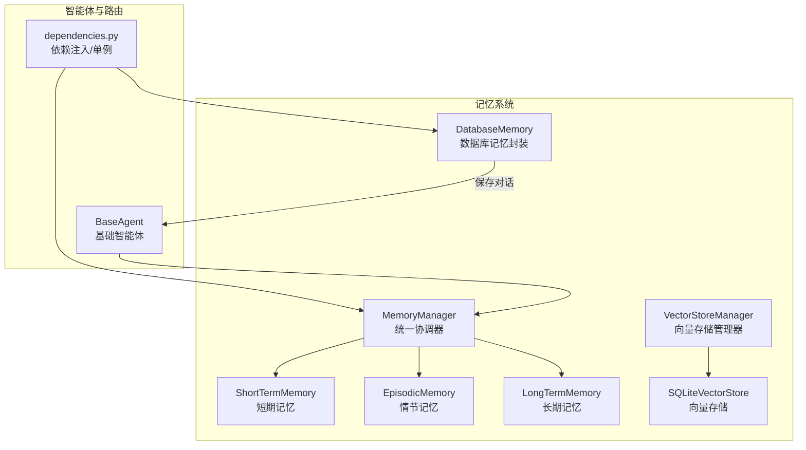
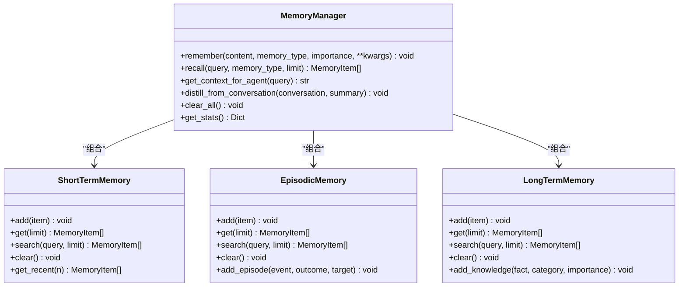
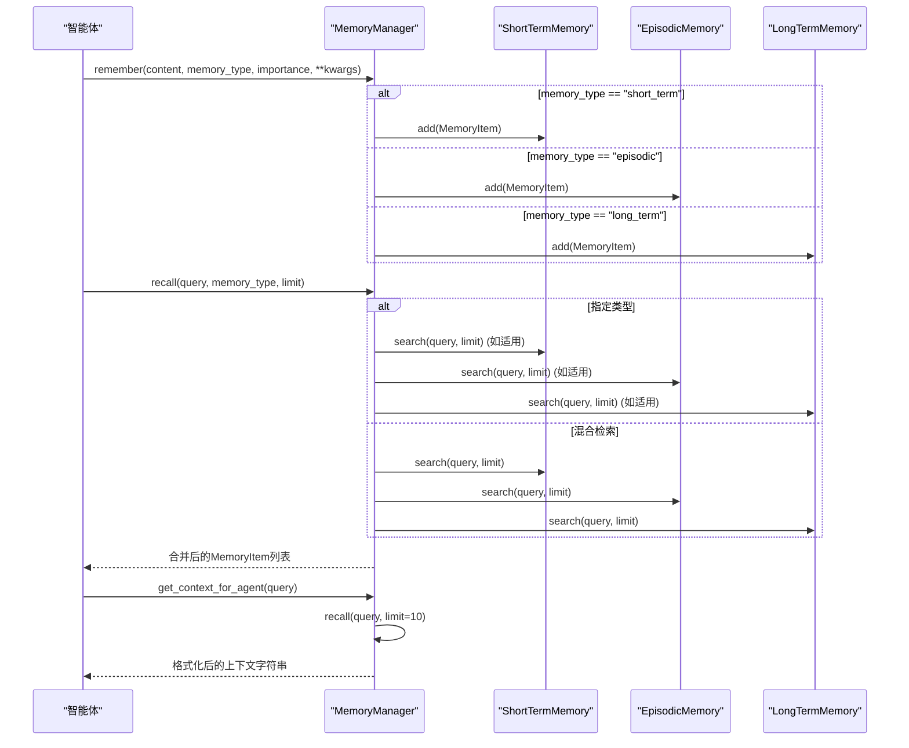
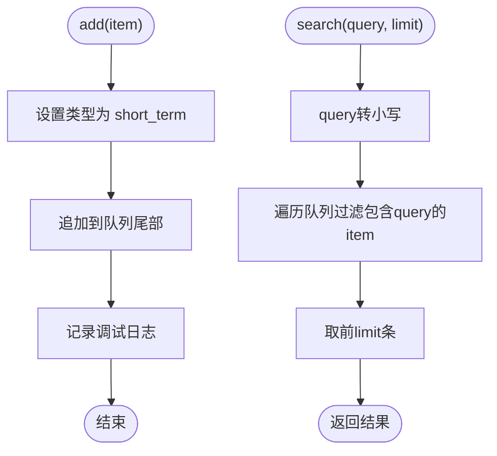
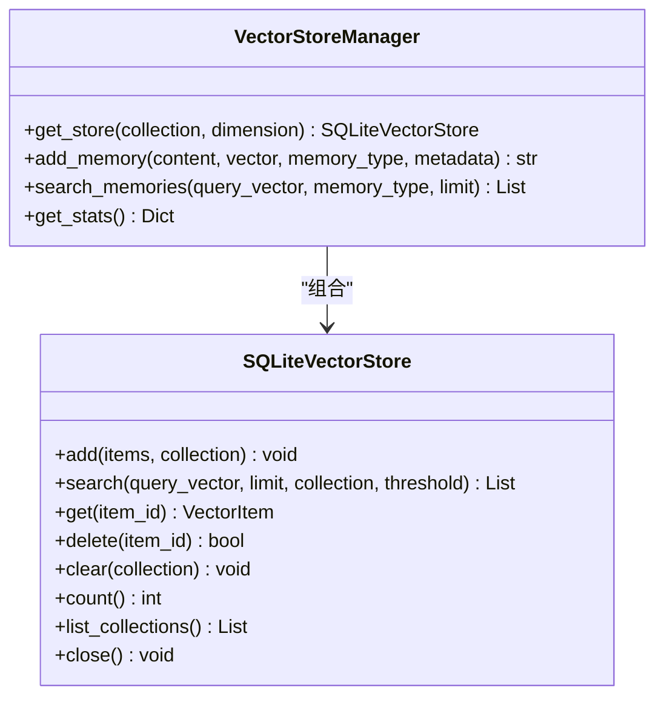
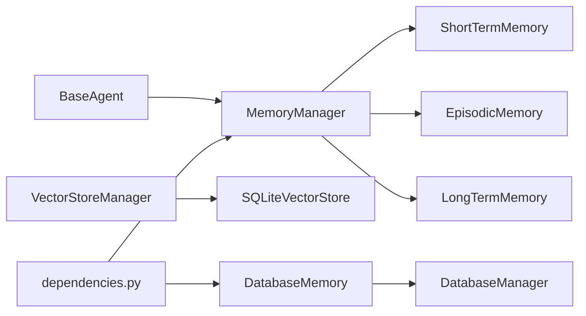

# 记忆管理协调器

<cite>
**本文引用的文件**
- [core/memory/manager.py](file://core/memory/manager.py)
- [core/memory/__init__.py](file://core/memory/__init__.py)
- [core/memory/vector_store.py](file://core/memory/vector_store.py)
- [core/memory/database_memory.py](file://core/memory/database_memory.py)
- [docs/SKILLS_AND_MEMORY.md](file://docs/SKILLS_AND_MEMORY.md)
- [core/agents/base.py](file://core/agents/base.py)
- [router/dependencies.py](file://router/dependencies.py)
</cite>

## 目录
1. [简介](#简介)
2. [项目结构](#项目结构)
3. [核心组件](#核心组件)
4. [架构总览](#架构总览)
5. [详细组件分析](#详细组件分析)
6. [依赖分析](#依赖分析)
7. [性能考量](#性能考量)
8. [故障排查指南](#故障排查指南)
9. [结论](#结论)
10. [附录](#附录)

## 简介
本文件为Secbot的记忆管理协调器提供系统化技术文档，聚焦MemoryManager统一管理器的设计与协调机制。文档覆盖三层记忆子系统的初始化、配置与生命周期管理，深入解析remember()统一记忆添加接口（含类型路由、参数校验与异常处理）、recall()混合检索接口（多类型联合查询、排序与去重策略），以及get_context_for_agent()智能体上下文生成逻辑（类型优先级、内容格式化与长度控制）。同时阐明记忆管理器在整体系统架构中的角色与与其他组件的交互关系。

## 项目结构
围绕记忆管理的核心文件位于core/memory目录，包含统一管理器、三层记忆子系统、向量存储与数据库记忆封装。相关文档与集成示例位于docs与router等位置。

**图示来源**
- [core/memory/manager.py](file://core/memory/manager.py#L223-L325)
- [core/memory/vector_store.py](file://core/memory/vector_store.py#L239-L297)
- [core/memory/database_memory.py](file://core/memory/database_memory.py#L14-L38)
- [core/agents/base.py](file://core/agents/base.py#L17-L34)
- [router/dependencies.py](file://router/dependencies.py#L34-L36)

**章节来源**
- [core/memory/manager.py](file://core/memory/manager.py#L1-L325)
- [core/memory/__init__.py](file://core/memory/__init__.py#L1-L30)
- [docs/SKILLS_AND_MEMORY.md](file://docs/SKILLS_AND_MEMORY.md#L64-L141)

## 核心组件
- MemoryManager：统一协调器，负责短、中、长期记忆的初始化、路由与聚合检索，提供记忆蒸馏与统计接口。
- 三层记忆子系统：
  - ShortTermMemory：会话内上下文，基于队列自动截断，支持最近N条访问。
  - EpisodicMemory：跨会话事件与经验，基于JSON文件持久化。
  - LongTermMemory：持久化知识库，基于JSON文件持久化。
- VectorStoreManager/SQLiteVectorStore：可选的向量存储方案，用于扩展检索能力（与统一管理器并行存在）。
- DatabaseMemory：将对话保存至数据库，供智能体使用。

**章节来源**
- [core/memory/manager.py](file://core/memory/manager.py#L223-L325)
- [core/memory/vector_store.py](file://core/memory/vector_store.py#L239-L297)
- [core/memory/database_memory.py](file://core/memory/database_memory.py#L14-L38)

## 架构总览
MemoryManager采用“统一协调器 + 三层记忆子系统”的架构，遵循OpenAI Agents SDK与CrewAI的设计理念。其核心职责包括：
- 初始化与装配：在构造函数中创建短期、情节与长期记忆实例。
- 统一接口：remember()/recall()/get_context_for_agent()等方法作为对外唯一入口。
- 生命周期管理：提供clear_all()与统计接口，便于运维与调试。
- 与智能体协作：通过BaseAgent的memory字段或直接注入，为智能体构建上下文。

**图示来源**
- [core/memory/manager.py](file://core/memory/manager.py#L223-L325)

## 详细组件分析

### MemoryManager统一协调器
- 初始化与装配
  - 在构造函数中分别创建短期、情节与长期记忆实例，完成三层记忆的装配。
- remember()统一记忆添加接口
  - 参数：content、memory_type、importance、metadata等。
  - 类型路由：根据memory_type将MemoryItem分发至对应子系统。
  - 异常处理：各子系统内部捕获IO异常并记录日志，保证调用方稳定性。
- recall()混合记忆检索接口
  - 单类型检索：当memory_type非空时，仅在该类型内搜索。
  - 混合检索：当memory_type为空时，对三类记忆分别检索并拼接返回。
  - 结果组织：按子系统顺序拼接，未做显式去重与全局排序。
- get_context_for_agent()智能体上下文生成
  - 限制返回数量：limit=10，避免上下文过长。
  - 类型优先级：短期记忆优先展示最近若干条，随后情节记忆与长期知识。
  - 内容格式化：使用固定标题分组与简单列表格式，便于后续注入到智能体prompt。
  - 长度控制：通过切片与分组控制最终字符串长度，满足LLM上下文窗口约束。
- 其他能力
  - distill_from_conversation()：从对话摘要蒸馏为情节记忆。
  - clear_all()：清空所有记忆子系统。
  - get_stats()：返回各类记忆数量统计。

**图示来源**
- [core/memory/manager.py](file://core/memory/manager.py#L231-L297)

**章节来源**
- [core/memory/manager.py](file://core/memory/manager.py#L223-L325)
- [docs/SKILLS_AND_MEMORY.md](file://docs/SKILLS_AND_MEMORY.md#L77-L141)

### 三层记忆子系统

#### ShortTermMemory（短期记忆）
- 存储介质：内存队列，自动截断，保留最近N轮对话。
- 关键方法：add/get/search/clear/get_recent。
- 特性：适合当前会话上下文，容量有限，查询为线性匹配。

**图示来源**
- [core/memory/manager.py](file://core/memory/manager.py#L51-L84)

**章节来源**
- [core/memory/manager.py](file://core/memory/manager.py#L51-L84)

#### EpisodicMemory（情节记忆）
- 存储介质：JSON文件，跨会话持久化。
- 关键方法：add/get/search/clear/_load/_save。
- 特性：支持add_episode()便捷添加事件片段；加载/保存时捕获异常并记录告警。

**章节来源**
- [core/memory/manager.py](file://core/memory/manager.py#L86-L152)

#### LongTermMemory（长期记忆）
- 存储介质：JSON文件，持久化知识库。
- 关键方法：add/get/search/clear/_load/_save/add_knowledge。
- 特性：支持add_knowledge()添加知识项；加载/保存时捕获异常并记录错误。

**章节来源**
- [core/memory/manager.py](file://core/memory/manager.py#L154-L221)

### 向量存储（可选扩展）
- VectorStoreManager：统一管理多个集合，按集合名与维度创建/复用SQLiteVectorStore。
- SQLiteVectorStore：基于sqlite-vec/sqlite-vss的向量存储，支持ANN索引与纯量相似度计算。
- 用途：为记忆检索提供向量相似度能力，与传统文本检索互补。

**图示来源**
- [core/memory/vector_store.py](file://core/memory/vector_store.py#L239-L297)

**章节来源**
- [core/memory/vector_store.py](file://core/memory/vector_store.py#L1-L297)

### 数据库存储封装（DatabaseMemory）
- 作用：将智能体对话保存到数据库，供后续检索与审计。
- 关键点：构造时接收DatabaseManager与agent_type/session_id，提供save_conversation()异步保存。

**章节来源**
- [core/memory/database_memory.py](file://core/memory/database_memory.py#L14-L38)

## 依赖分析
- 组件耦合
  - MemoryManager与三层记忆子系统为组合关系，低耦合、高内聚。
  - VectorStoreManager与SQLiteVectorStore为组合关系，可独立启用。
  - DatabaseMemory与DatabaseManager为依赖关系，用于对话持久化。
- 外部依赖
  - 日志：loguru，用于记录加载/保存/清空等关键操作。
  - 时间：datetime+timezone，用于生成UTC时间戳。
  - JSON：用于持久化三层记忆的数据序列化。
- 与智能体的交互
  - BaseAgent定义了memory字段，可被替换为MemoryManager实例，用于上下文注入。
  - 路由层通过依赖注入容器提供MemoryManager单例，供API与业务逻辑使用。

**图示来源**
- [core/memory/manager.py](file://core/memory/manager.py#L223-L325)
- [core/memory/vector_store.py](file://core/memory/vector_store.py#L239-L297)
- [core/memory/database_memory.py](file://core/memory/database_memory.py#L14-L38)
- [core/agents/base.py](file://core/agents/base.py#L17-L34)
- [router/dependencies.py](file://router/dependencies.py#L34-L36)

**章节来源**
- [core/memory/manager.py](file://core/memory/manager.py#L223-L325)
- [core/memory/vector_store.py](file://core/memory/vector_store.py#L239-L297)
- [core/memory/database_memory.py](file://core/memory/database_memory.py#L14-L38)
- [core/agents/base.py](file://core/agents/base.py#L17-L34)
- [router/dependencies.py](file://router/dependencies.py#L34-L36)

## 性能考量
- 短期记忆（队列）：add/search/clear均为O(n)或O(1)，受max_turns限制，空间占用可控。
- 情节/长期记忆（JSON）：读写文件，I/O开销随数据量增长；建议定期清理与归档。
- 搜索复杂度：当前实现为线性过滤，未引入索引；在大规模数据下建议结合向量存储或建立倒排索引。
- 上下文生成：get_context_for_agent()对结果进行切片与分组，避免超长上下文；建议根据模型上下文窗口动态调整limit与切片策略。
- 异常处理：加载/保存时捕获异常并记录日志，避免影响主线程；建议在生产环境增加重试与降级策略。

[本节为通用性能讨论，不直接分析具体文件，故无“章节来源”]

## 故障排查指南
- 记忆无法加载/保存
  - 检查JSON文件路径权限与目录是否存在；查看日志中关于加载/保存失败的告警。
- 记忆检索结果为空
  - 确认query大小写与内容是否匹配；检查limit参数是否过小。
- 上下文过长导致模型拒绝
  - 调整get_context_for_agent()中的切片策略或减少每类记忆的数量。
- 清空记忆无效
  - 确认调用的是MemoryManager.clear_all()而非仅清空对话历史；持久化记忆需要调用对应clear()。

**章节来源**
- [core/memory/manager.py](file://core/memory/manager.py#L94-L119)
- [core/memory/manager.py](file://core/memory/manager.py#L162-L187)
- [core/memory/manager.py](file://core/memory/manager.py#L270-L297)

## 结论
MemoryManager以统一协调器的形式，将短期、情节与长期记忆整合为一致的接口，既满足会话上下文管理，又支持跨会话经验与持久知识的沉淀。配合VectorStoreManager与DatabaseMemory，可进一步扩展向量检索与对话持久化能力。在系统中，它通过依赖注入与智能体集成，成为上下文构建与知识复用的关键枢纽。

[本节为总结性内容，不直接分析具体文件，故无“章节来源”]

## 附录

### API与使用示例
- 统一接口
  - remember(content, memory_type, importance, **kwargs)
  - recall(query, memory_type=None, limit=5)
  - get_context_for_agent(query)
  - distill_from_conversation(conversation, summary)
  - clear_all(), get_stats()
- 示例参见文档中的使用片段与集成示例。

**章节来源**
- [docs/SKILLS_AND_MEMORY.md](file://docs/SKILLS_AND_MEMORY.md#L77-L141)