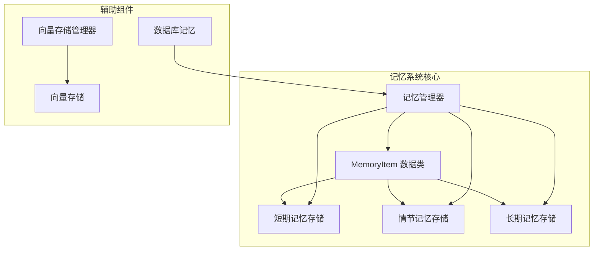
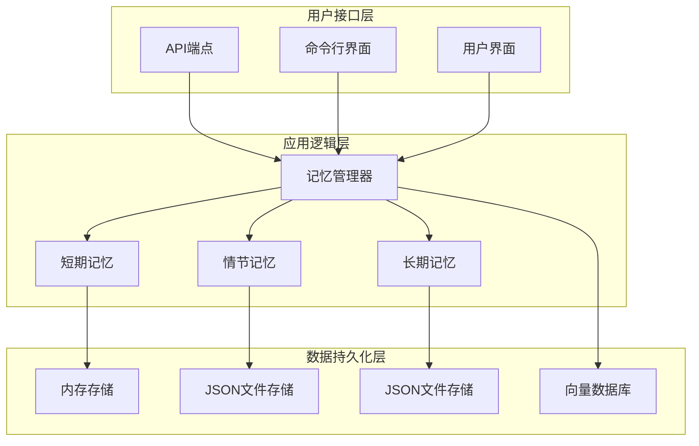
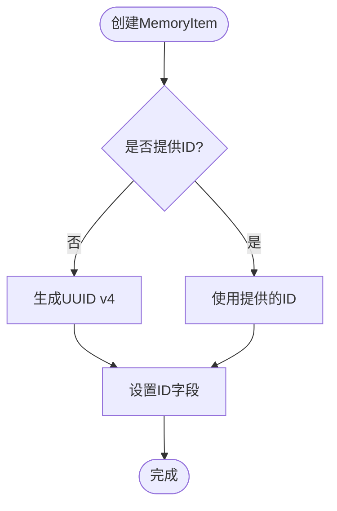
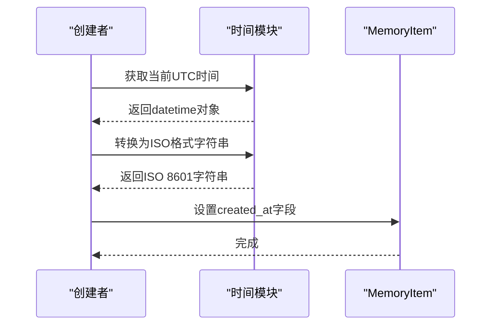
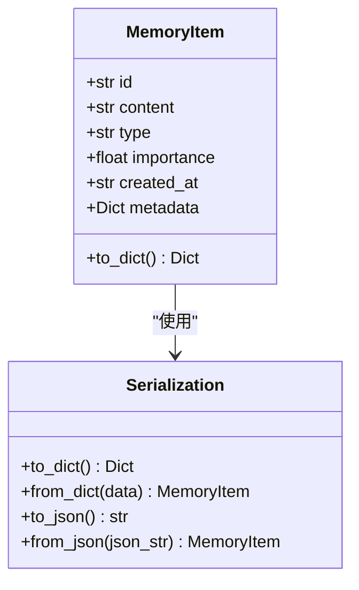
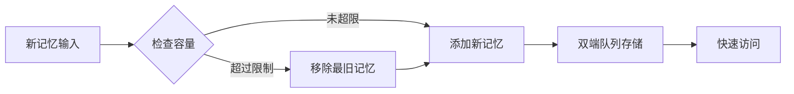
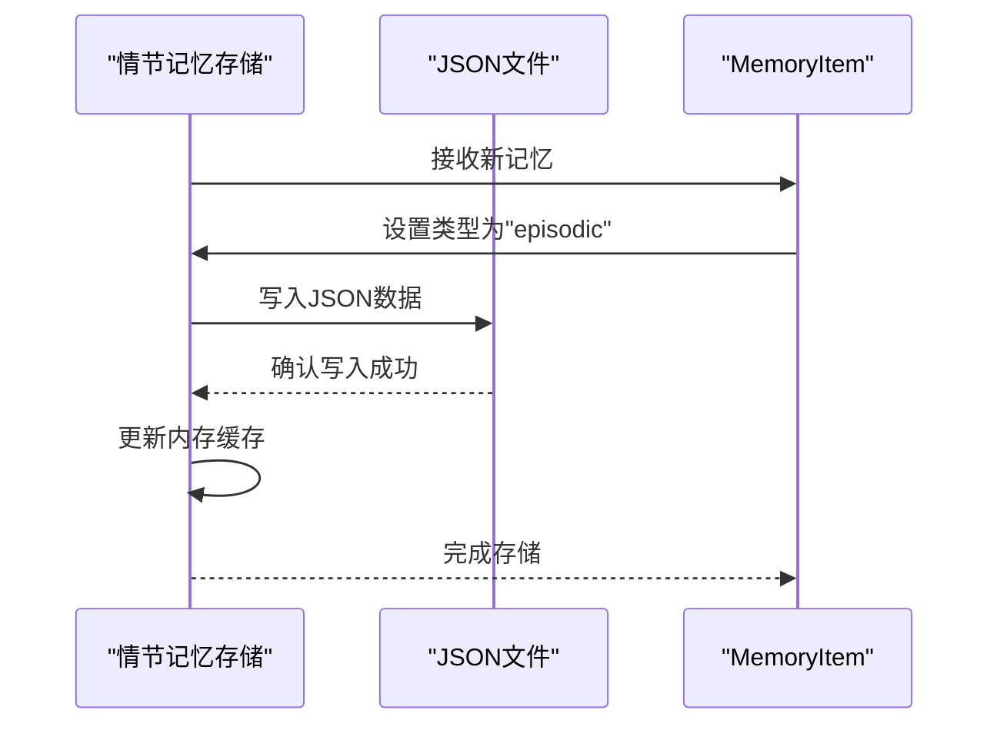
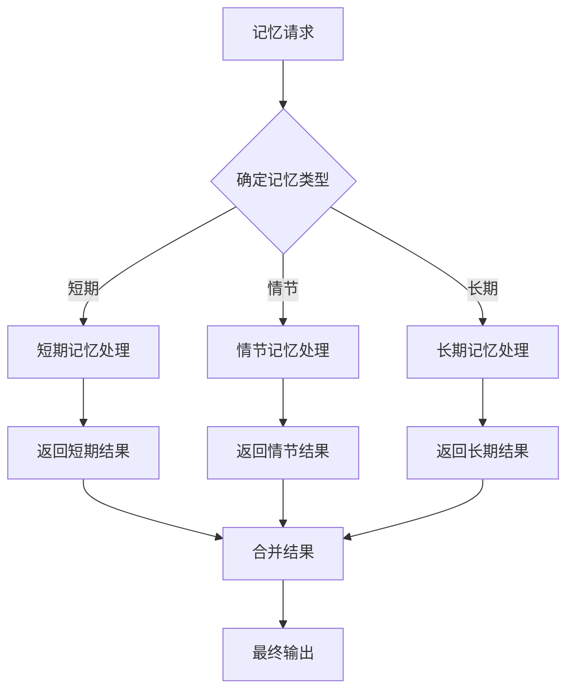
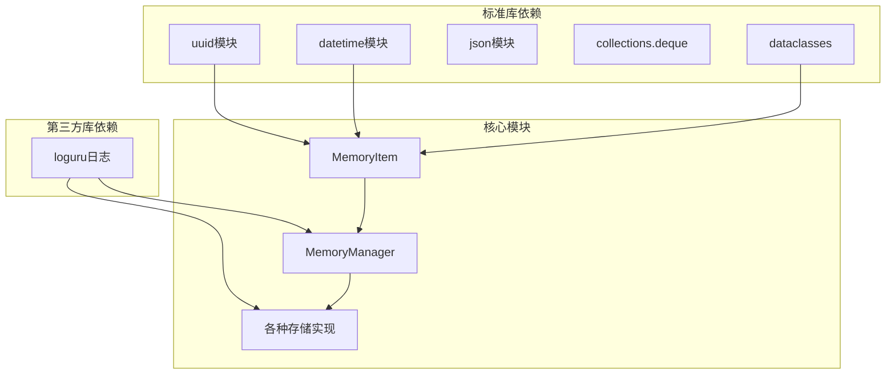

# 记忆项目数据模型

<cite>
**本文档引用的文件**
- [core/memory/manager.py](file://core/memory/manager.py)
- [core/memory/__init__.py](file://core/memory/__init__.py)
- [docs/SKILLS_AND_MEMORY.md](file://docs/SKILLS_AND_MEMORY.md)
</cite>

## 目录
1. [简介](#简介)
2. [项目结构](#项目结构)
3. [核心组件](#核心组件)
4. [架构概览](#架构概览)
5. [详细组件分析](#详细组件分析)
6. [依赖关系分析](#依赖关系分析)
7. [性能考虑](#性能考虑)
8. [故障排除指南](#故障排除指南)
9. [结论](#结论)

## 简介

本文档深入解析Secbot项目中的记忆项目数据模型，重点介绍MemoryItem数据类的设计架构和实现细节。MemoryItem是Secbot三层记忆系统的核心数据结构，负责存储和管理不同类型的记忆信息，包括短期记忆、情节记忆和长期记忆。

该数据模型采用Python数据类（dataclass）实现，具有以下关键特性：
- 自动化的唯一ID生成机制
- 多层次的记忆类型支持
- 重要性评分系统
- UTC时间戳管理
- 元数据扩展能力
- 序列化和反序列化功能

## 项目结构

Secbot的记忆系统位于核心模块中，主要文件组织如下：

**图表来源**
- [core/memory/manager.py](file://core/memory/manager.py#L16-L29)
- [core/memory/__init__.py](file://core/memory/__init__.py#L6-L29)

**章节来源**
- [core/memory/manager.py](file://core/memory/manager.py#L1-L325)
- [core/memory/__init__.py](file://core/memory/__init__.py#L1-L30)

## 核心组件

MemoryItem数据类是整个记忆系统的基础，它定义了记忆数据的标准结构和行为。该类采用Python数据类装饰器，提供了自动化的字段定义和方法生成。

### 主要字段定义

MemoryItem类包含以下核心字段：

| 字段名 | 类型 | 默认值 | 描述 | 约束条件 |
|--------|------|--------|------|----------|
| id | str | 自动生成 | 唯一标识符 | UUID v4格式，自动生成 |
| content | str | "" | 记忆内容文本 | UTF-8编码，任意长度 |
| type | str | "" | 记忆类型标识 | short_term, episodic, long_term |
| importance | float | 0.5 | 重要性评分 | 0.0-1.0范围，数值越高越重要 |
| created_at | str | UTC时间 | 创建时间戳 | ISO 8601格式，UTC时区 |
| metadata | Dict | {} | 元数据字典 | 键值对结构，任意内容 |

### 字段约束和验证

每个字段都遵循特定的约束规则：

- **ID字段**：使用UUID v4算法生成，确保全局唯一性
- **类型字段**：严格限制为三种预定义类型之一
- **重要性字段**：必须在0.0到1.0范围内
- **时间戳字段**：始终使用UTC时区，ISO 8601格式存储
- **元数据字段**：支持任意键值对结构，便于扩展

**章节来源**
- [core/memory/manager.py](file://core/memory/manager.py#L16-L28)

## 架构概览

Secbot的记忆系统采用三层架构设计，每层都有特定的功能和存储机制：

**图表来源**
- [core/memory/manager.py](file://core/memory/manager.py#L223-L325)
- [core/memory/manager.py](file://core/memory/manager.py#L51-L84)
- [core/memory/manager.py](file://core/memory/manager.py#L86-L152)
- [core/memory/manager.py](file://core/memory/manager.py#L154-L221)

### 记忆类型详解

系统支持三种不同类型的记忆，每种都有其特定的用途和特征：

#### 短期记忆（Short-term Memory）
- **存储位置**：内存中的双端队列
- **容量限制**：默认最多10个条目
- **生命周期**：会话内有效，自动清理
- **用途**：当前对话上下文和最近交互

#### 情节记忆（Episodic Memory）
- **存储位置**：JSON文件
- **容量限制**：无限制
- **生命周期**：跨会话持久化
- **用途**：过去的事件和经验记录

#### 长期记忆（Long-term Memory）
- **存储位置**：JSON文件
- **容量限制**：无限制
- **生命周期**：永久持久化
- **用途**：知识库和模式识别

**章节来源**
- [core/memory/manager.py](file://core/memory/manager.py#L51-L84)
- [core/memory/manager.py](file://core/memory/manager.py#L86-L152)
- [core/memory/manager.py](file://core/memory/manager.py#L154-L221)

## 详细组件分析

### MemoryItem数据类设计

MemoryItem类采用Python数据类装饰器实现，提供了以下核心功能：

#### 唯一ID生成机制

**图表来源**
- [core/memory/manager.py](file://core/memory/manager.py#L18)

#### 时间戳管理

时间戳使用UTC时区，确保全球一致性：

**图表来源**
- [core/memory/manager.py](file://core/memory/manager.py#L22-L24)

#### 序列化和反序列化

MemoryItem提供了完整的序列化支持：

**图表来源**
- [core/memory/manager.py](file://core/memory/manager.py#L16-L28)

### 存储实现分析

#### 短期记忆存储

短期记忆使用双端队列实现，具有自动容量管理和快速访问特性：

**图表来源**
- [core/memory/manager.py](file://core/memory/manager.py#L54-L61)

#### 情节记忆存储

情节记忆使用JSON文件持久化，支持完整的CRUD操作：

**图表来源**
- [core/memory/manager.py](file://core/memory/manager.py#L121-L125)

#### 长期记忆存储

长期记忆与情节记忆类似，但专注于知识库的持久化：

**章节来源**
- [core/memory/manager.py](file://core/memory/manager.py#L154-L221)

### 记忆管理器功能

MemoryManager作为统一入口，协调三个记忆层的工作：

**图表来源**
- [core/memory/manager.py](file://core/memory/manager.py#L231-L268)

**章节来源**
- [core/memory/manager.py](file://core/memory/manager.py#L223-L325)

## 依赖关系分析

记忆系统的依赖关系相对简单，主要依赖于标准库和第三方库：

**图表来源**
- [core/memory/manager.py](file://core/memory/manager.py#L6-L13)

### 外部依赖

- **uuid**: 用于生成唯一标识符
- **datetime**: 用于时间戳管理
- **json**: 用于数据序列化
- **collections.deque**: 用于短期记忆的高效存储
- **dataclasses**: 用于简化数据类定义
- **loguru**: 用于结构化日志记录

**章节来源**
- [core/memory/manager.py](file://core/memory/manager.py#L6-L13)

## 性能考虑

### 内存使用优化

短期记忆使用双端队列，具有以下性能特点：
- O(1)时间复杂度的头部和尾部操作
- 自动容量限制，防止内存无限增长
- 快速的搜索和过滤操作

### I/O性能优化

情节记忆和长期记忆使用JSON文件存储：
- 批量写入操作，减少磁盘I/O
- 缓存机制，避免频繁文件读取
- 异步操作支持，提高并发性能

### 序列化性能

MemoryItem的序列化采用asdict()函数：
- 高效的数据转换
- 支持嵌套数据结构
- 内存友好的处理方式

## 故障排除指南

### 常见问题和解决方案

#### ID生成冲突
- **问题**：极少数情况下可能出现ID冲突
- **解决方案**：系统自动重试生成新的UUID

#### 文件权限问题
- **问题**：JSON文件写入权限不足
- **解决方案**：检查数据目录权限，确保可写

#### 内存溢出
- **问题**：短期记忆过多导致内存占用过高
- **解决方案**：调整max_turns参数，合理控制记忆数量

#### 时间戳格式错误
- **问题**：时间戳格式不符合预期
- **解决方案**：确保使用UTC时区，遵循ISO 8601格式

**章节来源**
- [core/memory/manager.py](file://core/memory/manager.py#L94-L104)
- [core/memory/manager.py](file://core/memory/manager.py#L162-L172)

## 结论

Secbot的记忆项目数据模型展现了现代AI系统中记忆管理的最佳实践。MemoryItem数据类通过精心设计的字段结构、严格的约束机制和高效的存储策略，为整个系统提供了可靠的记忆基础。

该设计的主要优势包括：
- **清晰的架构分离**：三层记忆系统各司其职
- **强大的扩展性**：元数据支持任意扩展
- **高效的性能**：针对不同场景优化存储策略
- **可靠的持久化**：多种存储方案确保数据安全

通过合理的使用和配置，开发者可以充分利用MemoryItem的强大功能，构建更加智能和高效的安全机器人系统。