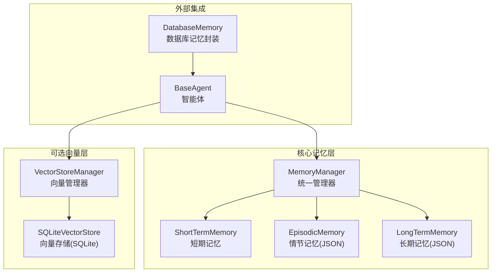
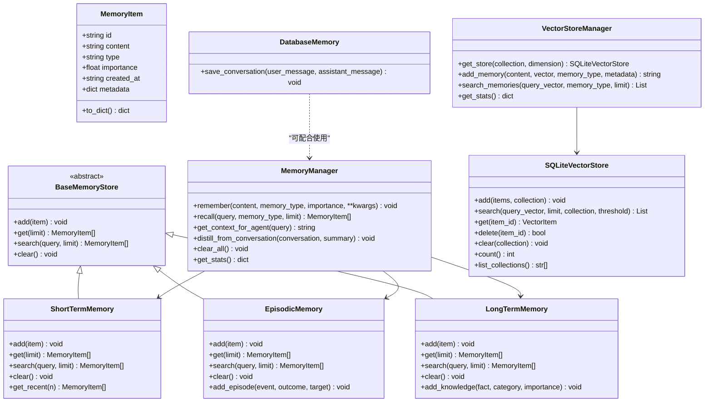
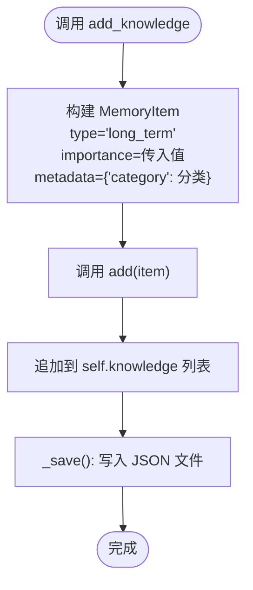
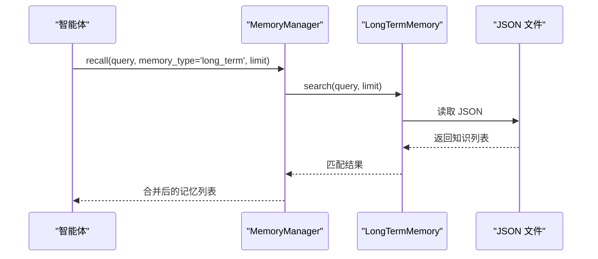
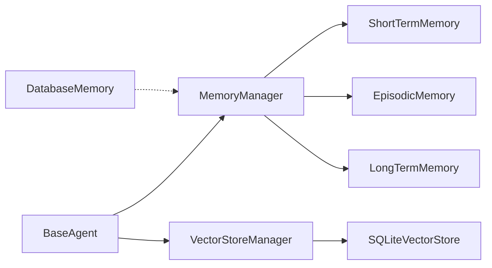

# 长期记忆系统

<cite>
**本文引用的文件**
- [core/memory/manager.py](file://core/memory/manager.py)
- [core/memory/vector_store.py](file://core/memory/vector_store.py)
- [core/memory/database_memory.py](file://core/memory/database_memory.py)
- [docs/SKILLS_AND_MEMORY.md](file://docs/SKILLS_AND_MEMORY.md)
- [docs/DATABASE_GUIDE.md](file://docs/DATABASE_GUIDE.md)
- [docs/SQLITE_SETUP.md](file://docs/SQLITE_SETUP.md)
- [core/agents/base.py](file://core/agents/base.py)
- [main.py](file://main.py)
</cite>

## 目录
1. [简介](#简介)
2. [项目结构](#项目结构)
3. [核心组件](#核心组件)
4. [架构总览](#架构总览)
5. [组件详解](#组件详解)
6. [依赖关系分析](#依赖关系分析)
7. [性能与扩展性](#性能与扩展性)
8. [故障排查指南](#故障排查指南)
9. [结论](#结论)
10. [附录](#附录)

## 简介
本文件聚焦 Secbot 的长期记忆系统（LongTermMemory），系统性阐述其设计理念、实现原理与工程实践，涵盖：
- JSON 文件持久化存储与知识条目管理
- 知识分类体系、重要性评分机制与检索算法
- add_knowledge() 方法的知识添加流程与元数据管理
- 文件存储策略、备份与恢复机制
- 在智能体学习与经验积累中的作用，包括模式识别、知识复用与决策支持

## 项目结构
长期记忆系统位于 core/memory 子模块，采用三层记忆架构（短期、情节、长期）与可选向量存储增强检索能力。核心文件如下：
- 记忆管理与存储：core/memory/manager.py
- 向量存储（可选增强）：core/memory/vector_store.py
- 数据库存储封装：core/memory/database_memory.py
- 文档与使用示例：docs/SKILLS_AND_MEMORY.md、docs/DATABASE_GUIDE.md、docs/SQLITE_SETUP.md
- 智能体集成：core/agents/base.py
- 应用入口：main.py

图表来源
- [core/memory/manager.py](file://core/memory/manager.py#L223-L325)
- [core/memory/vector_store.py](file://core/memory/vector_store.py#L30-L297)
- [core/memory/database_memory.py](file://core/memory/database_memory.py#L14-L37)
- [core/agents/base.py](file://core/agents/base.py#L17-L125)

章节来源
- [core/memory/manager.py](file://core/memory/manager.py#L1-L325)
- [docs/SKILLS_AND_MEMORY.md](file://docs/SKILLS_AND_MEMORY.md#L64-L141)

## 核心组件
- MemoryItem：记忆条目的统一数据结构，包含内容、类型、重要性、创建时间与元数据。
- BaseMemoryStore：抽象基类，定义 add/get/search/clear 四大接口。
- ShortTermMemory：会话内短期记忆，基于队列自动裁剪。
- EpisodicMemory：跨会话情节记忆，基于 JSON 文件持久化。
- LongTermMemory：长期记忆，基于 JSON 文件持久化，提供 add_knowledge() 等高级接口。
- MemoryManager：统一管理器，协调三类记忆的添加、召回与上下文拼装。
- SQLiteVectorStore/VectorStoreManager：可选向量存储，支持向量相似度检索与集合管理。
- DatabaseMemory：将对话保存到数据库，供智能体使用。

章节来源
- [core/memory/manager.py](file://core/memory/manager.py#L16-L325)
- [core/memory/vector_store.py](file://core/memory/vector_store.py#L15-L297)
- [core/memory/database_memory.py](file://core/memory/database_memory.py#L14-L37)

## 架构总览
长期记忆系统采用“三层记忆 + 可选向量增强”的架构：
- 三层记忆用于不同粒度与生命周期的记忆管理；
- JSON 文件作为长期与情节记忆的持久化介质；
- 向量存储用于语义检索增强（可选）；
- DatabaseMemory 提供数据库层面的对话持久化能力。

图表来源
- [core/memory/manager.py](file://core/memory/manager.py#L16-L325)
- [core/memory/vector_store.py](file://core/memory/vector_store.py#L15-L297)
- [core/memory/database_memory.py](file://core/memory/database_memory.py#L14-L37)

## 组件详解

### 长期记忆（LongTermMemory）
- 设计理念
  - 持久化知识与模式，支持跨会话复用与长期积累。
  - 通过 JSON 文件存储，便于备份、迁移与人工审阅。
- 关键特性
  - JSON 持久化：构造时尝试加载已有知识，保存时写入 JSON 文件。
  - add_knowledge()：便捷添加知识，设置 type=long_term，并将分类信息写入 metadata。
  - 检索：大小写不敏感的字符串匹配，支持限制返回条数。
- 元数据管理
  - category：知识分类标签，便于后续检索与组织。
  - importance：重要性评分（0-1），可用于排序或过滤。
  - created_at：UTC 时间戳，便于时间线管理。
- 与情节记忆的区别
  - 情节记忆关注“事件+结果”，长期记忆关注“事实+分类”。
  - 情节记忆通常用于经验沉淀，长期记忆用于知识库构建。

图表来源
- [core/memory/manager.py](file://core/memory/manager.py#L210-L221)
- [core/memory/manager.py](file://core/memory/manager.py#L189-L192)
- [core/memory/manager.py](file://core/memory/manager.py#L174-L187)

章节来源
- [core/memory/manager.py](file://core/memory/manager.py#L154-L221)

### 知识分类系统与重要性评分
- 分类标签（metadata.category）
  - 通过 add_knowledge() 设置，便于后续按类别检索与聚合。
- 重要性评分（importance）
  - 0-1 浮点数，用于排序与筛选；在上下文拼装时可作为权重参考。
- 元数据扩展
  - 可在 add_knowledge() 中扩展更多字段，如来源、作者、关联 ID 等，提升检索与溯源能力。

章节来源
- [core/memory/manager.py](file://core/memory/manager.py#L210-L221)

### 知识检索算法
- 情节/长期记忆检索
  - 基于字符串包含匹配（忽略大小写），返回最近 limit 条。
  - 适用于关键词检索与快速召回。
- 向量检索（可选）
  - 使用 SQLite 向量存储，支持向量相似度检索。
  - 当 sqlite-vec 可用时优先使用 ANN；否则退化为纯量计算。
  - 支持阈值过滤与集合管理，便于多领域知识检索。

图表来源
- [core/memory/manager.py](file://core/memory/manager.py#L250-L268)
- [core/memory/manager.py](file://core/memory/manager.py#L198-L203)
- [core/memory/manager.py](file://core/memory/manager.py#L162-L172)

章节来源
- [core/memory/manager.py](file://core/memory/manager.py#L198-L203)
- [core/memory/vector_store.py](file://core/memory/vector_store.py#L124-L175)

### 文件存储策略、备份与恢复
- 存储路径
  - 长期记忆：./data/long_term_memory.json
  - 情节记忆：./data/episodic_memory.json
- 备份与恢复
  - JSON 文件可直接复制备份与恢复。
  - 数据库（Conversation 表）可通过 SQLite 文件备份与恢复。
- 备份示例
  - JSON：cp data/long_term_memory.json backup/long_term_memory.bak
  - SQLite：cp data/m_bot.db backup/m_bot.db.backup

章节来源
- [core/memory/manager.py](file://core/memory/manager.py#L157-L187)
- [docs/DATABASE_GUIDE.md](file://docs/DATABASE_GUIDE.md#L163-L173)
- [docs/SQLITE_SETUP.md](file://docs/SQLITE_SETUP.md#L120-L140)

### 长期记忆在智能体学习与经验积累中的作用
- 模式识别
  - 通过长期记忆中的分类标签与重要性评分，辅助识别常见攻击模式、漏洞特征与处置流程。
- 知识复用
  - 在新任务中优先召回相关知识，减少重复思考与试错成本。
- 决策支持
  - 将长期知识与短期上下文、情节经验组合，形成更全面的上下文，提升决策质量。
- 集成方式
  - 智能体通过 MemoryManager.get_context_for_agent() 获取上下文，结合技能系统与向量检索，构建高质量提示。

章节来源
- [core/memory/manager.py](file://core/memory/manager.py#L270-L297)
- [docs/SKILLS_AND_MEMORY.md](file://docs/SKILLS_AND_MEMORY.md#L115-L141)
- [core/agents/base.py](file://core/agents/base.py#L17-L125)

## 依赖关系分析
- 组件耦合
  - MemoryManager 聚合三类记忆，提供统一接口；LongTermMemory 与 EpisodicMemory 共享 BaseMemoryStore 抽象。
  - VectorStoreManager 与 SQLiteVectorStore 解耦集合与存储细节。
  - DatabaseMemory 与 MemoryManager 解耦，可按需组合使用。
- 外部依赖
  - JSON 文件读写用于持久化；
  - SQLite 向量扩展（sqlite-vec/sqlite-vss）用于向量检索增强；
  - 日志框架用于错误与状态记录。

图表来源
- [core/memory/manager.py](file://core/memory/manager.py#L223-L325)
- [core/memory/vector_store.py](file://core/memory/vector_store.py#L239-L297)
- [core/memory/database_memory.py](file://core/memory/database_memory.py#L14-L37)
- [core/agents/base.py](file://core/agents/base.py#L17-L125)

章节来源
- [core/memory/manager.py](file://core/memory/manager.py#L223-L325)
- [core/memory/vector_store.py](file://core/memory/vector_store.py#L239-L297)
- [core/memory/database_memory.py](file://core/memory/database_memory.py#L14-L37)

## 性能与扩展性
- 检索性能
  - JSON 文件检索为线性匹配，适合中小规模知识库；大规模场景建议启用向量检索。
- 存储开销
  - JSON 文件体积随知识增长而增大，建议定期清理与归档。
- 向量检索优势
  - 支持语义相似度检索，提升召回质量；ANN 加速与阈值过滤降低无效匹配。
- 并发与一致性
  - JSON 文件写入为顺序写，注意避免并发写冲突；必要时引入锁或序列化写入。

[本节为通用性能讨论，不直接分析具体文件]

## 故障排查指南
- JSON 文件读写失败
  - 检查 data 目录权限与磁盘空间；确认文件路径正确。
- 向量检索不可用
  - 确认 sqlite-vec 扩展是否安装；未安装时将退化为纯量计算。
- 数据库备份/恢复
  - 使用文档提供的备份与恢复命令，确保文件完整拷贝。
- 智能体上下文为空
  - 检查 MemoryManager.recall 与 get_context_for_agent 的调用参数与返回值。

章节来源
- [core/memory/manager.py](file://core/memory/manager.py#L162-L172)
- [core/memory/manager.py](file://core/memory/manager.py#L174-L187)
- [docs/DATABASE_GUIDE.md](file://docs/DATABASE_GUIDE.md#L163-L173)
- [docs/SQLITE_SETUP.md](file://docs/SQLITE_SETUP.md#L120-L140)

## 结论
Secbot 的长期记忆系统以简洁可靠的 JSON 文件持久化为基础，结合三层记忆架构与可选向量检索，实现了知识的长期积累与高效复用。通过 add_knowledge() 的分类与重要性管理，以及 MemoryManager 的统一接口，长期记忆在智能体学习、经验沉淀与决策支持方面发挥关键作用。建议在生产环境中配合数据库备份、定期归档与向量检索增强，持续提升系统稳定性与检索效果。

[本节为总结性内容，不直接分析具体文件]

## 附录
- 使用示例与集成参考
  - 参考文档中的使用示例与集成示例，了解如何在智能体中调用记忆系统。
- 应用入口
  - main.py 提供应用入口与错误处理，便于定位与调试。

章节来源
- [docs/SKILLS_AND_MEMORY.md](file://docs/SKILLS_AND_MEMORY.md#L77-L141)
- [main.py](file://main.py#L44-L62)