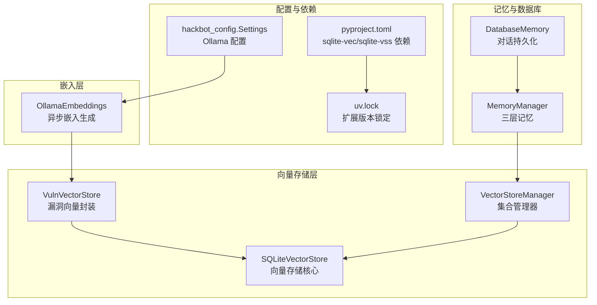
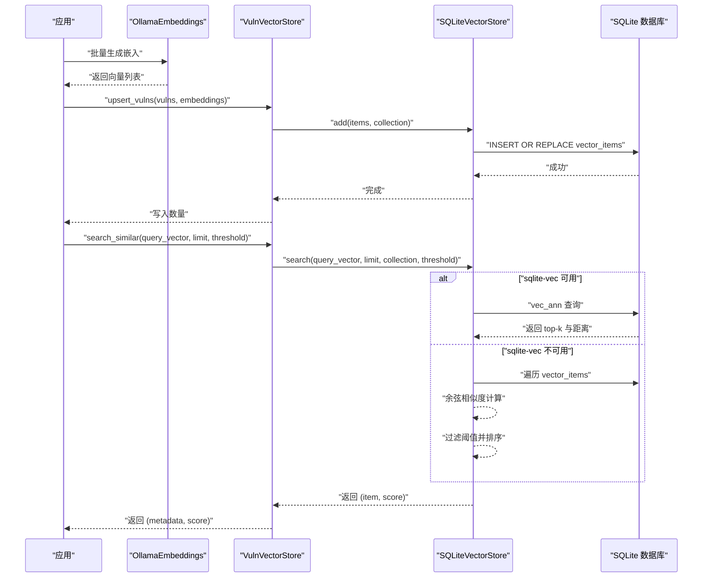
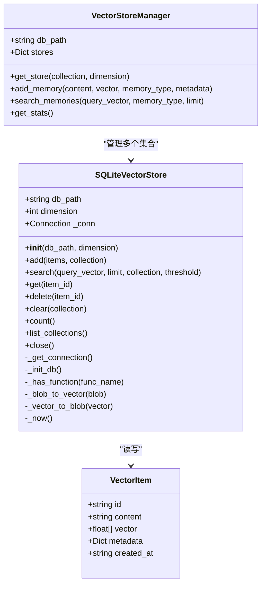
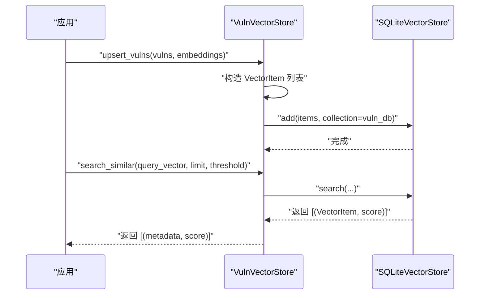
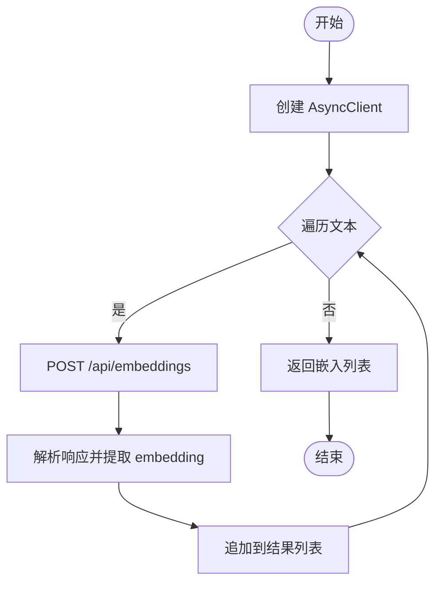
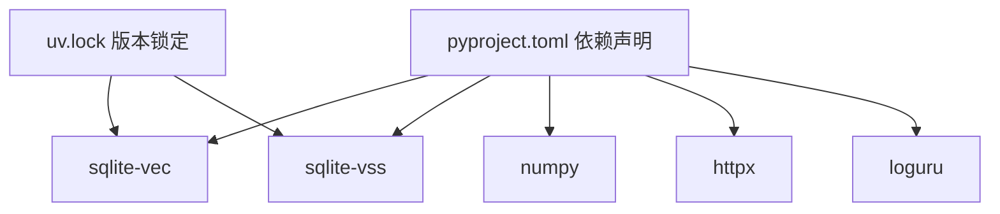

# 向量存储系统

<cite>
**本文引用的文件**
- [core/memory/vector_store.py](file://core/memory/vector_store.py)
- [core/vuln_db/vuln_vector_store.py](file://core/vuln_db/vuln_vector_store.py)
- [utils/embeddings.py](file://utils/embeddings.py)
- [hackbot_config/__init__.py](file://hackbot_config/__init__.py)
- [pyproject.toml](file://pyproject.toml)
- [uv.lock](file://uv.lock)
- [core/memory/manager.py](file://core/memory/manager.py)
- [core/memory/database_memory.py](file://core/memory/database_memory.py)
- [docs/VIRTUAL_TEST_ENVIRONMENT.md](file://docs/VIRTUAL_TEST_ENVIRONMENT.md)
- [docs/SQLITE_SETUP.md](file://docs/SQLITE_SETUP.md)
</cite>

## 目录
1. [简介](#简介)
2. [项目结构](#项目结构)
3. [核心组件](#核心组件)
4. [架构总览](#架构总览)
5. [详细组件分析](#详细组件分析)
6. [依赖分析](#依赖分析)
7. [性能考虑](#性能考虑)
8. [故障排查指南](#故障排查指南)
9. [结论](#结论)
10. [附录](#附录)

## 简介
本文件为 Secbot 的向量存储系统提供深入技术文档，聚焦于基于 SQLite 的向量检索实现，涵盖 sqlite-vec/sqlite-vss 扩展的使用、向量嵌入生成与存储、相似度搜索算法、索引构建与查询优化、批量插入与更新机制，以及在知识检索中的应用场景（语义搜索、上下文相关性分析、智能推荐）。同时提供性能调优指南与常见问题排查方法。

## 项目结构
向量存储系统主要由以下模块构成：
- SQLite 向量存储核心：负责向量表、集合表、ANN 虚拟表的创建与管理，提供增删改查与统计接口。
- 漏洞向量存储封装：在核心之上封装漏洞条目与嵌入的写入与相似度检索。
- 嵌入生成：通过 Ollama 提供异步嵌入生成能力。
- 配置与依赖：通过 pyproject.toml 与 uv.lock 明确 sqlite-vec/sqlite-vss 的依赖与平台差异。
- 记忆与数据库集成：与 MemoryManager、DatabaseMemory 等模块协同，支撑上下文与对话持久化。

图表来源
- [core/memory/vector_store.py](file://core/memory/vector_store.py#L30-L236)
- [core/vuln_db/vuln_vector_store.py](file://core/vuln_db/vuln_vector_store.py#L18-L106)
- [utils/embeddings.py](file://utils/embeddings.py#L11-L80)
- [hackbot_config/__init__.py](file://hackbot_config/__init__.py#L162-L246)
- [pyproject.toml](file://pyproject.toml#L50-L51)
- [uv.lock](file://uv.lock#L3631-L3649)
- [core/memory/manager.py](file://core/memory/manager.py#L223-L324)
- [core/memory/database_memory.py](file://core/memory/database_memory.py#L14-L37)

章节来源
- [core/memory/vector_store.py](file://core/memory/vector_store.py#L1-L297)
- [core/vuln_db/vuln_vector_store.py](file://core/vuln_db/vuln_vector_store.py#L1-L107)
- [utils/embeddings.py](file://utils/embeddings.py#L1-L80)
- [hackbot_config/__init__.py](file://hackbot_config/__init__.py#L162-L246)
- [pyproject.toml](file://pyproject.toml#L50-L51)
- [uv.lock](file://uv.lock#L3631-L3649)
- [core/memory/manager.py](file://core/memory/manager.py#L223-L324)
- [core/memory/database_memory.py](file://core/memory/database_memory.py#L14-L37)

## 核心组件
- VectorItem：向量项的数据结构，包含 id、content、vector、metadata、created_at。
- SQLiteVectorStore：核心向量存储，提供初始化、连接管理、表与 ANN 虚拟表创建、增删改查、统计与集合管理。
- VectorStoreManager：多集合管理器，按集合与维度缓存与复用存储实例，支持跨集合检索与统计。
- VulnVectorStore：漏洞向量封装，负责将漏洞实体与嵌入写入向量库，并提供相似度检索返回元数据与相似度分数。
- OllamaEmbeddings：异步嵌入生成器，支持单文本与批量嵌入，对接 Ollama 服务。

章节来源
- [core/memory/vector_store.py](file://core/memory/vector_store.py#L15-L236)
- [core/vuln_db/vuln_vector_store.py](file://core/vuln_db/vuln_vector_store.py#L18-L106)
- [utils/embeddings.py](file://utils/embeddings.py#L11-L80)

## 架构总览
向量存储系统采用“核心存储 + 业务封装 + 嵌入生成”的分层设计：
- 存储层：SQLite + sqlite-vec/sqlite-vss 扩展，支持 ANN 近似最近邻检索与纯量计算回退。
- 应用层：VulnVectorStore 与 VectorStoreManager 提供业务语义检索能力。
- 生成层：OllamaEmbeddings 提供异步嵌入生成，配置来源于 hackbot_config.Settings。
- 集成层：MemoryManager 与 DatabaseMemory 提供上下文与对话持久化，支撑语义检索的上下文相关性分析。

图表来源
- [core/vuln_db/vuln_vector_store.py](file://core/vuln_db/vuln_vector_store.py#L35-L93)
- [core/memory/vector_store.py](file://core/memory/vector_store.py#L98-L175)
- [utils/embeddings.py](file://utils/embeddings.py#L30-L70)

## 详细组件分析

### SQLiteVectorStore 分析
- 初始化与连接
  - 创建 vector_items 表与 collections 表，确保父目录存在。
  - 检测 sqlite-vec 扩展函数是否存在，存在则创建 vec0 ANN 虚拟表，否则回退到纯量计算。
- 数据结构与序列化
  - 向量以 BLOB 存储，使用 numpy.float32 编解码；metadata 以 JSON 文本存储。
- 写入与更新
  - add 支持批量插入，使用 INSERT OR REPLACE，按集合名维护集合元信息。
- 查询与相似度
  - search 支持两种路径：
    - 使用 vec_ann：通过 k 参数限制返回数量，返回距离并转换为相似度。
    - 纯量计算：遍历向量表，计算余弦相似度，按阈值过滤与降序排序。
- 其他能力
  - get/delete/clear/count/list_collections/close 等辅助接口。

图表来源
- [core/memory/vector_store.py](file://core/memory/vector_store.py#L15-L236)

章节来源
- [core/memory/vector_store.py](file://core/memory/vector_store.py#L30-L236)

### VulnVectorStore 分析
- 业务封装
  - 将漏洞对象与嵌入转换为 VectorItem 并写入指定集合（默认 vuln_db）。
  - 提供 search_similar 返回 (metadata_dict, similarity_score)，便于上层直接消费。
- 写入流程
  - 校验漏洞与嵌入数量一致，构造 metadata 字段（含漏洞标识、来源、严重性、CVSS、标题、摘要、标签等）。
- 检索流程
  - 委托 SQLiteVectorStore.search，再将 VectorItem 的 metadata 与内容补充到结果中。

图表来源
- [core/vuln_db/vuln_vector_store.py](file://core/vuln_db/vuln_vector_store.py#L35-L93)
- [core/memory/vector_store.py](file://core/memory/vector_store.py#L98-L175)

章节来源
- [core/vuln_db/vuln_vector_store.py](file://core/vuln_db/vuln_vector_store.py#L18-L106)

### OllamaEmbeddings 分析
- 异步嵌入生成
  - 支持单文本与批量文本嵌入，通过 httpx 异步请求 Ollama 服务的 /api/embeddings 接口。
  - 校验返回向量非空，记录调试日志。
- 配置来源
  - 从 hackbot_config.Settings 读取 Ollama 基础地址与嵌入模型名。
- 维度处理
  - get_embedding_dimension 为占位返回，实际维度取决于所选模型。

图表来源
- [utils/embeddings.py](file://utils/embeddings.py#L30-L70)

章节来源
- [utils/embeddings.py](file://utils/embeddings.py#L11-L80)
- [hackbot_config/__init__.py](file://hackbot_config/__init__.py#L168-L173)

### 记忆与数据库集成
- MemoryManager 提供短期、情节与长期记忆三层架构，支持按类型检索与上下文拼装。
- DatabaseMemory 将对话持久化到数据库，与向量存储共同支撑上下文相关性分析与智能推荐。

章节来源
- [core/memory/manager.py](file://core/memory/manager.py#L223-L324)
- [core/memory/database_memory.py](file://core/memory/database_memory.py#L14-L37)

## 依赖分析
- sqlite-vec 与 sqlite-vss
  - 在 pyproject.toml 中声明为依赖，且在非 Windows 平台启用；uv.lock 锁定具体版本。
- numpy
  - 用于向量与矩阵运算（BLOB 编解码、余弦相似度计算）。
- httpx
  - 用于异步调用 Ollama 嵌入服务。
- loguru
  - 统一日志输出，包含 sqlite-vec 扩展缺失的警告。

图表来源
- [pyproject.toml](file://pyproject.toml#L50-L51)
- [uv.lock](file://uv.lock#L3631-L3649)

章节来源
- [pyproject.toml](file://pyproject.toml#L50-L51)
- [uv.lock](file://uv.lock#L3631-L3649)

## 性能考虑
- ANN 近似检索优先
  - 当 sqlite-vec 可用时，优先使用 vec_ann 虚拟表进行 kNN 检索，显著优于纯量计算的线性扫描。
- 索引与表结构
  - vector_items 表以 BLOB 存储向量，metadata 以 JSON 文本存储；collections 表用于集合元信息。
  - 建议在高维向量场景下确保 sqlite-vec 扩展可用，并保持维度与建表一致。
- 批量写入
  - add 使用 INSERT OR REPLACE 批量写入，减少事务开销；建议按集合分批写入以控制内存峰值。
- 相似度计算
  - 纯量计算路径使用余弦相似度，注意阈值与排序成本；在大规模数据下应优先启用 ANN。
- 存储空间与清理
  - 定期清理不再使用的集合与过期数据，避免 metadata 与向量占用膨胀。
- 并发与连接
  - SQLite 默认多读单写，建议在应用层控制并发写入节奏，避免数据库锁定。

章节来源
- [core/memory/vector_store.py](file://core/memory/vector_store.py#L61-L67)
- [core/memory/vector_store.py](file://core/memory/vector_store.py#L135-L175)
- [docs/SQLITE_SETUP.md](file://docs/SQLITE_SETUP.md#L146-L147)

## 故障排查指南
- sqlite-vec 未安装
  - 现象：初始化时出现 sqlite-vec 未安装警告，查询走纯量计算。
  - 处理：在非 Windows 平台安装 sqlite-vec 与 sqlite-vss，确保扩展可用。
- Ollama 连接失败
  - 现象：嵌入生成抛出连接错误或超时。
  - 处理：检查 Ollama 服务状态与基础 URL、模型名配置；确认网络连通性。
- 数据库文件锁定
  - 现象：SQLite 报错 database is locked。
  - 处理：确保所有连接正确关闭，避免长时间持有事务；检查是否有其他进程占用数据库文件。
- 维度不匹配
  - 现象：向量维度与建表不一致导致查询异常。
  - 处理：确保写入与查询时使用相同维度；必要时重建 ANN 虚拟表。
- 查询性能差
  - 现象：纯量计算路径下查询缓慢。
  - 处理：启用 sqlite-vec 扩展；合理设置阈值与 limit；对高频查询建立集合分片。

章节来源
- [core/memory/vector_store.py](file://core/memory/vector_store.py#L66-L67)
- [utils/embeddings.py](file://utils/embeddings.py#L63-L70)
- [docs/SQLITE_SETUP.md](file://docs/SQLITE_SETUP.md#L153-L167)

## 结论
Secbot 的向量存储系统以 SQLite 为核心，结合 sqlite-vec/sqlite-vss 扩展，在保证轻量部署的同时提供了近似最近邻检索能力。通过 OllamaEmbeddings 实现异步嵌入生成，配合 VulnVectorStore 的业务封装，能够高效支撑漏洞知识库的语义检索与智能推荐。在实际使用中，建议优先启用 ANN 检索、合理设置阈值与维度、定期清理与备份数据，并关注 Ollama 服务的稳定性与网络连通性。

## 附录
- 配置项参考
  - Ollama 基础 URL 与嵌入模型名来自 hackbot_config.Settings。
- 测试与验证
  - 可参考虚拟测试环境文档进行端到端验证，确保嵌入与检索链路可用。

章节来源
- [hackbot_config/__init__.py](file://hackbot_config/__init__.py#L168-L173)
- [docs/VIRTUAL_TEST_ENVIRONMENT.md](file://docs/VIRTUAL_TEST_ENVIRONMENT.md#L1-L218)