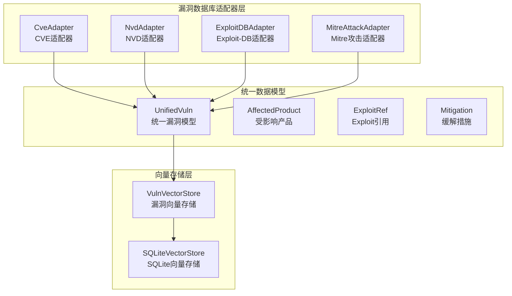
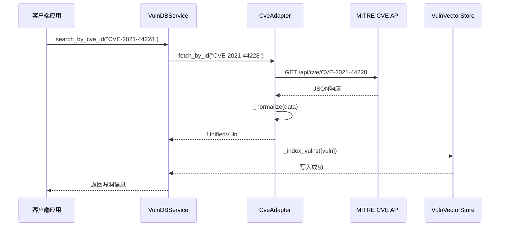
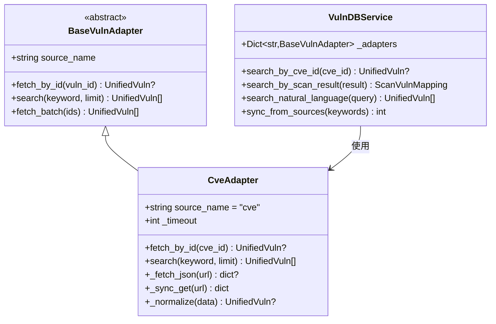
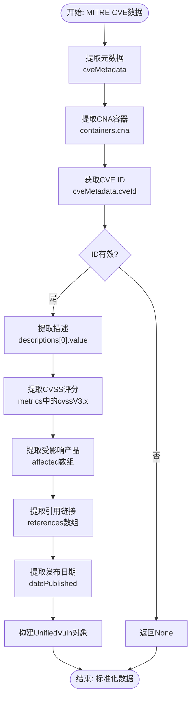
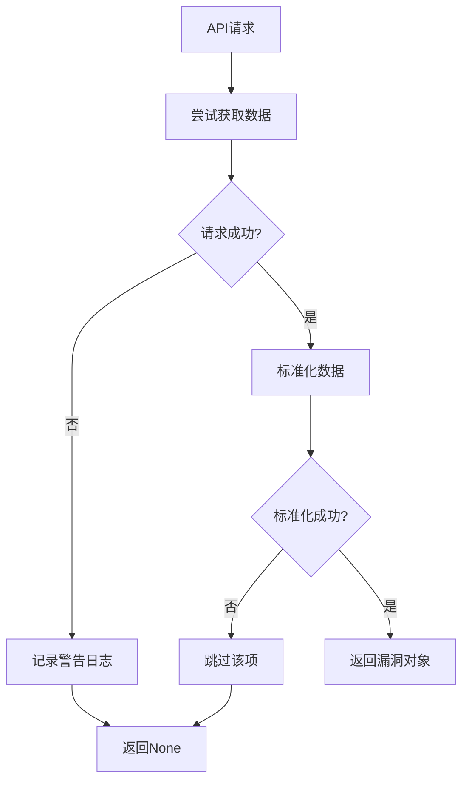
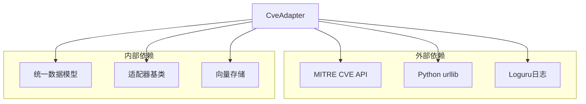

# CVE适配器

<cite>
**本文档引用的文件**
- [cve_adapter.py](file://core/vuln_db/adapters/cve_adapter.py)
- [schema.py](file://core/vuln_db/schema.py)
- [vuln_db_service.py](file://core/vuln_db/vuln_db_service.py)
- [base_adapter.py](file://core/vuln_db/adapters/base_adapter.py)
- [nvd_adapter.py](file://core/vuln_db/adapters/nvd_adapter.py)
- [vuln_vector_store.py](file://core/vuln_db/vuln_vector_store.py)
- [vector_store.py](file://core/memory/vector_store.py)
- [cve_lookup_tool.py](file://tools/utility/cve_lookup_tool.py)
</cite>

## 目录
1. [简介](#简介)
2. [项目结构](#项目结构)
3. [核心组件](#核心组件)
4. [架构概览](#架构概览)
5. [详细组件分析](#详细组件分析)
6. [依赖关系分析](#依赖关系分析)
7. [性能考虑](#性能考虑)
8. [故障排除指南](#故障排除指南)
9. [结论](#结论)

## 简介

CVE适配器是Secbot漏洞管理系统中的关键组件，负责处理MITRE发布的CVE数据格式。该适配器基于MITRE CVE API (cveawg.mitre.org) 获取漏洞信息，并将其归一化为统一的漏洞数据模型。本文档将详细介绍CVE适配器如何处理CVE数据格式、字段映射和数据标准化流程，以及其在整体漏洞管理系统中的作用。

## 项目结构

CVE适配器位于漏洞数据库适配器模块中，与NVD适配器、Exploit-DB适配器和Mitre攻击适配器共同工作，形成完整的漏洞数据处理生态系统。

**图表来源**
- [cve_adapter.py](file://core/vuln_db/adapters/cve_adapter.py#L36-L50)
- [schema.py](file://core/vuln_db/schema.py#L68-L115)
- [vuln_vector_store.py](file://core/vuln_db/vuln_vector_store.py#L18-L30)

**章节来源**
- [cve_adapter.py](file://core/vuln_db/adapters/cve_adapter.py#L1-L155)
- [schema.py](file://core/vuln_db/schema.py#L1-L140)

## 核心组件

CVE适配器的核心功能包括：

### 主要特性
- **异步API调用**：使用asyncio进行非阻塞网络请求
- **数据标准化**：将MITRE CVE格式转换为统一模型
- **错误处理**：完善的异常捕获和日志记录
- **性能优化**：批量处理和缓存机制

### 关键接口
- `fetch_by_id(cve_id)`: 按CVE ID精确查询
- `search(keyword, limit)`: 关键词搜索
- `_normalize(data)`: 数据标准化处理

**章节来源**
- [cve_adapter.py](file://core/vuln_db/adapters/cve_adapter.py#L45-L73)
- [base_adapter.py](file://core/vuln_db/adapters/base_adapter.py#L13-L21)

## 架构概览

CVE适配器在整个漏洞管理系统中扮演着数据源适配器的角色，与统一服务层协同工作。

**图表来源**
- [vuln_db_service.py](file://core/vuln_db/vuln_db_service.py#L79-L88)
- [cve_adapter.py](file://core/vuln_db/adapters/cve_adapter.py#L45-L50)
- [vuln_vector_store.py](file://core/vuln_db/vuln_vector_store.py#L35-L66)

## 详细组件分析

### CVE适配器类结构

**图表来源**
- [base_adapter.py](file://core/vuln_db/adapters/base_adapter.py#L8-L32)
- [cve_adapter.py](file://core/vuln_db/adapters/cve_adapter.py#L36-L43)
- [vuln_db_service.py](file://core/vuln_db/vuln_db_service.py#L27-L44)

### 数据标准化流程

CVE适配器的核心在于将MITRE CVE API的数据格式标准化为统一模型：

**图表来源**
- [cve_adapter.py](file://core/vuln_db/adapters/cve_adapter.py#L91-L154)

### 字段映射和数据转换

CVE适配器将MITRE CVE数据的关键字段映射到统一模型：

| MITRE CVE字段 | 统一模型字段 | 映射逻辑 |
|---------------|--------------|----------|
| `cveMetadata.cveId` | `vuln_id` | 直接映射 |
| `cveMetadata.datePublished` | `date_published` | ISO格式转换 |
| `cveMetadata.state` | `state` | 直接映射 |
| `containers.cna.descriptions[0].value` | `description` | 文本截断至2000字符 |
| `containers.cna.metrics` | `cvss_score`, `cvss_vector`, `severity` | 优先级: V3.1 > V3.0 > V2.0 |
| `containers.cna.affected` | `affected_software` | 产品信息列表 |
| `containers.cna.references` | `references` | URL列表 |

**章节来源**
- [cve_adapter.py](file://core/vuln_db/adapters/cve_adapter.py#L91-L154)
- [schema.py](file://core/vuln_db/schema.py#L68-L115)

### 错误处理和重试机制

CVE适配器实现了多层次的错误处理：

**图表来源**
- [cve_adapter.py](file://core/vuln_db/adapters/cve_adapter.py#L76-L82)
- [cve_adapter.py](file://core/vuln_db/adapters/cve_adapter.py#L66-L73)

**章节来源**
- [cve_adapter.py](file://core/vuln_db/adapters/cve_adapter.py#L76-L82)

### 性能优化措施

CVE适配器采用了多种性能优化策略：

1. **异步I/O操作**：使用`asyncio`进行非阻塞网络请求
2. **批量处理**：支持批量获取和搜索操作
3. **数据截断**：对长文本进行合理截断，减少内存占用
4. **限制数量**：对受影响产品和引用链接进行数量限制

**章节来源**
- [cve_adapter.py](file://core/vuln_db/adapters/cve_adapter.py#L52-L73)
- [cve_adapter.py](file://core/vuln_db/adapters/cve_adapter.py#L118-L130)

## 依赖关系分析

CVE适配器与其他组件的依赖关系如下：

**图表来源**
- [cve_adapter.py](file://core/vuln_db/adapters/cve_adapter.py#L5-L23)
- [vuln_db_service.py](file://core/vuln_db/vuln_db_service.py#L16-L22)

**章节来源**
- [cve_adapter.py](file://core/vuln_db/adapters/cve_adapter.py#L1-L23)
- [vuln_db_service.py](file://core/vuln_db/vuln_db_service.py#L16-L22)

## 性能考虑

### 网络请求优化

CVE适配器通过以下方式优化网络请求性能：

1. **超时控制**：默认15秒超时，避免长时间阻塞
2. **并发处理**：使用异步模式处理多个请求
3. **错误恢复**：网络异常时优雅降级，不影响整体系统

### 内存使用优化

1. **数据截断**：对描述文本和产品版本进行长度限制
2. **数量限制**：限制受影响产品和引用链接的数量
3. **延迟加载**：原始数据按需保留，减少内存占用

### 缓存策略

虽然CVE适配器本身没有实现本地缓存，但通过以下机制实现缓存效果：

1. **向量存储缓存**：标准化后的数据存储在向量数据库中
2. **批量处理**：减少重复的API调用
3. **去重机制**：避免重复处理相同的数据

**章节来源**
- [cve_adapter.py](file://core/vuln_db/adapters/cve_adapter.py#L41-L42)
- [vuln_vector_store.py](file://core/vuln_db/vuln_vector_store.py#L35-L66)

## 故障排除指南

### 常见问题及解决方案

1. **API请求失败**
   - 检查网络连接和API可用性
   - 查看日志中的具体错误信息
   - 调整超时设置

2. **数据解析错误**
   - 验证输入的CVE ID格式
   - 检查API响应格式是否符合预期
   - 查看标准化过程中的异常日志

3. **性能问题**
   - 检查向量存储的性能指标
   - 优化批量处理的大小
   - 调整并发请求的数量

### 调试技巧

1. **启用详细日志**：查看详细的API调用和数据处理过程
2. **监控内存使用**：确保数据截断和限制机制正常工作
3. **测试API响应**：直接调用MITRE API验证响应格式

**章节来源**
- [cve_adapter.py](file://core/vuln_db/adapters/cve_adapter.py#L80-L82)
- [cve_adapter.py](file://core/vuln_db/adapters/cve_adapter.py#L71-L72)

## 结论

CVE适配器作为Secbot漏洞管理系统的重要组成部分，成功地将MITRE CVE API的数据格式标准化为统一的漏洞数据模型。通过异步处理、错误处理和性能优化等机制，该适配器为整个系统提供了可靠的数据源支持。

主要优势包括：
- **标准化程度高**：统一的数据模型便于后续处理
- **错误处理完善**：健壮的异常处理机制
- **性能优化**：异步处理和合理的数据限制
- **扩展性强**：基于适配器模式，易于添加新的数据源

未来可以考虑的改进方向：
- 实现本地缓存机制
- 添加数据验证和校验功能
- 优化批量处理的性能
- 增加更多的错误恢复策略