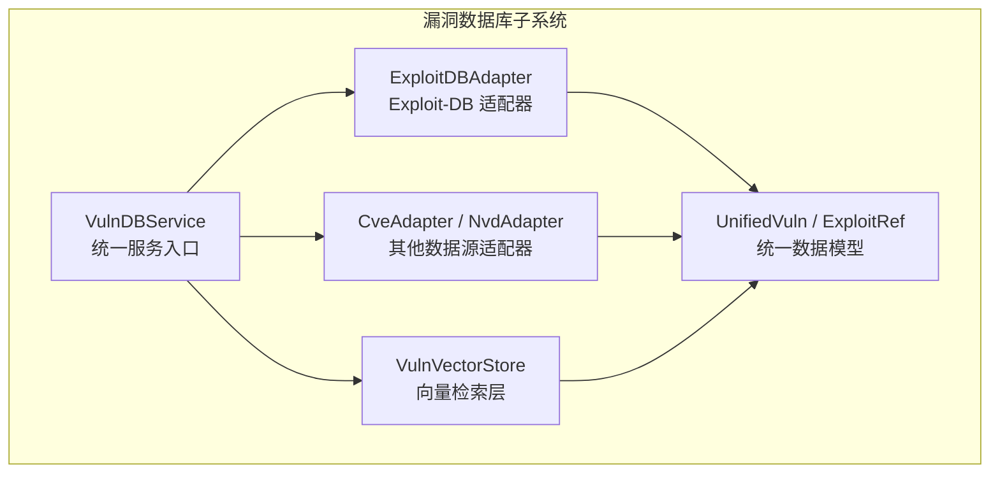
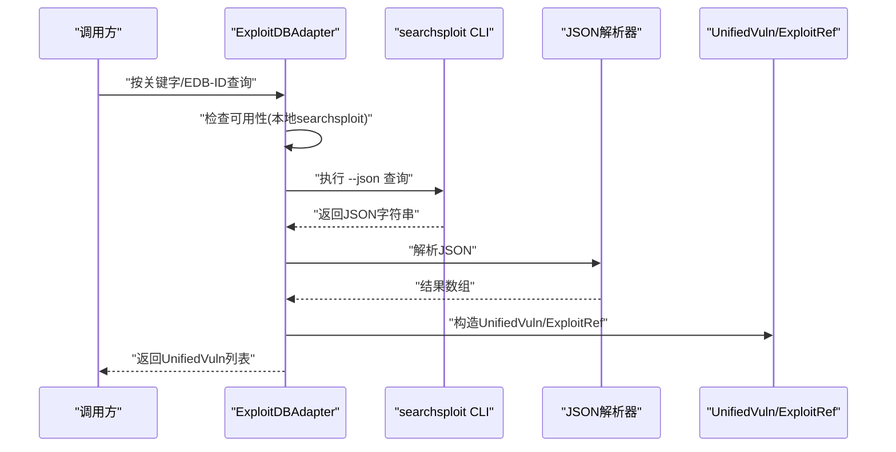
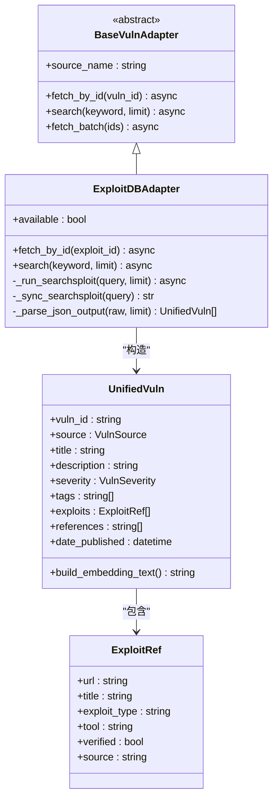
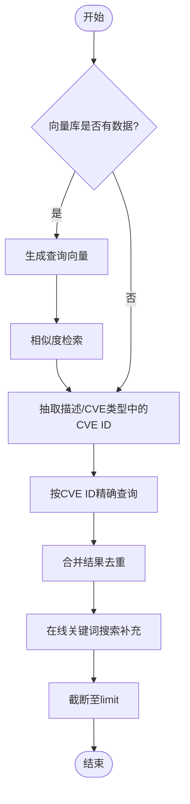
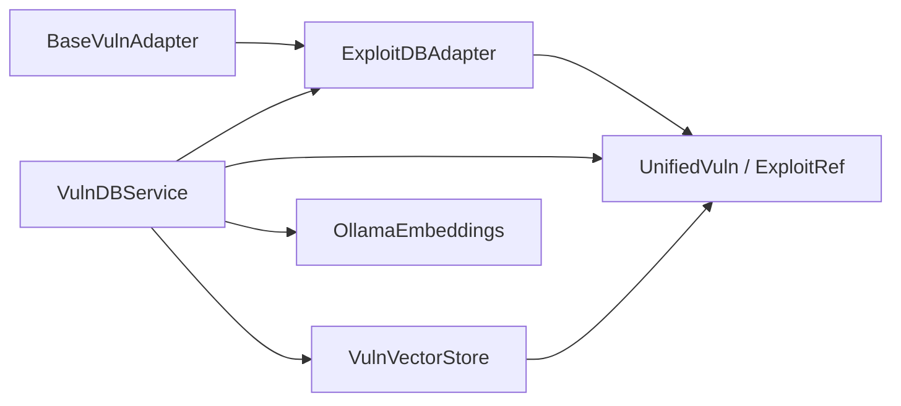

# ExploitDB适配器

<cite>
**本文引用的文件**
- [core/vuln_db/adapters/exploit_db_adapter.py](file://core/vuln_db/adapters/exploit_db_adapter.py)
- [core/vuln_db/schema.py](file://core/vuln_db/schema.py)
- [core/vuln_db/vuln_db_service.py](file://core/vuln_db/vuln_db_service.py)
- [core/vuln_db/adapters/base_adapter.py](file://core/vuln_db/adapters/base_adapter.py)
- [core/vuln_db/adapters/cve_adapter.py](file://core/vuln_db/adapters/cve_adapter.py)
- [core/vuln_db/adapters/nvd_adapter.py](file://core/vuln_db/adapters/nvd_adapter.py)
- [core/vuln_db/vuln_vector_store.py](file://core/vuln_db/vuln_vector_store.py)
- [utils/embeddings.py](file://utils/embeddings.py)
- [hackbot_config/__init__.py](file://hackbot_config/__init__.py)
- [core/attack_chain/attack_chain.py](file://core/attack_chain/attack_chain.py)
- [tools/pentest/security/exploit_tool.py](file://tools/pentest/security/exploit_tool.py)
</cite>

## 目录
1. [简介](#简介)
2. [项目结构](#项目结构)
3. [核心组件](#核心组件)
4. [架构总览](#架构总览)
5. [组件详解](#组件详解)
6. [依赖关系分析](#依赖关系分析)
7. [性能与可用性](#性能与可用性)
8. [故障排查指南](#故障排查指南)
9. [结论](#结论)
10. [附录](#附录)

## 简介
本文件面向Secbot的ExploitDB漏洞利用数据适配器，系统性阐述其在漏洞情报体系中的定位、与Exploit-DB数据库的交互方式、数据提取与格式标准化流程、与CVE的关联映射思路、语言识别与分类机制、版本兼容性与有效性验证策略，以及漏洞利用代码的下载、缓存与更新策略（含离线与在线同步方案）。文档同时给出关键流程的可视化图示，并提供可操作的排障建议与最佳实践。

## 项目结构
ExploitDB适配器位于漏洞数据库子系统中，作为统一漏洞服务的一个数据源适配器，负责将本地searchsploit命令行工具的输出转换为统一的数据模型，供上层检索与攻击链构建使用。

图表来源
- [core/vuln_db/vuln_db_service.py](file://core/vuln_db/vuln_db_service.py#L27-L44)
- [core/vuln_db/adapters/exploit_db_adapter.py](file://core/vuln_db/adapters/exploit_db_adapter.py#L24-L34)
- [core/vuln_db/adapters/cve_adapter.py](file://core/vuln_db/adapters/cve_adapter.py#L36-L43)
- [core/vuln_db/adapters/nvd_adapter.py](file://core/vuln_db/adapters/nvd_adapter.py#L37-L44)
- [core/vuln_db/vuln_vector_store.py](file://core/vuln_db/vuln_vector_store.py#L18-L30)
- [core/vuln_db/schema.py](file://core/vuln_db/schema.py#L68-L94)

章节来源
- [core/vuln_db/vuln_db_service.py](file://core/vuln_db/vuln_db_service.py#L27-L44)
- [core/vuln_db/adapters/exploit_db_adapter.py](file://core/vuln_db/adapters/exploit_db_adapter.py#L24-L34)

## 核心组件
- ExploitDBAdapter：基于本地searchsploit命令行工具的Exploit-DB适配器，负责执行查询、解析JSON输出并标准化为UnifiedVuln。
- VulnDBService：统一服务入口，聚合多数据源适配器，提供按CVE精确查询、扫描结果匹配、自然语言检索与多源同步能力。
- UnifiedVuln/ExploitRef：统一数据模型，承载漏洞元信息、受影响软件、可利用项、标签、引用、日期等字段。
- VulnVectorStore：向量检索层，负责将漏洞文本向量化并提供相似度检索。
- OllamaEmbeddings：向量嵌入提供者，为统一服务生成embedding。
- 配置系统：hackbot_config.settings提供Ollama相关配置，影响向量维度与服务地址。

章节来源
- [core/vuln_db/adapters/exploit_db_adapter.py](file://core/vuln_db/adapters/exploit_db_adapter.py#L24-L117)
- [core/vuln_db/schema.py](file://core/vuln_db/schema.py#L68-L116)
- [core/vuln_db/vuln_db_service.py](file://core/vuln_db/vuln_db_service.py#L27-L184)
- [core/vuln_db/vuln_vector_store.py](file://core/vuln_db/vuln_vector_store.py#L18-L107)
- [utils/embeddings.py](file://utils/embeddings.py#L11-L80)
- [hackbot_config/__init__.py](file://hackbot_config/__init__.py#L162-L181)

## 架构总览
ExploitDB适配器在系统中的职责是“本地CLI → 统一模型”的桥接器。它通过异步执行searchsploit命令，捕获其JSON输出，解析并构造ExploitRef与UnifiedVuln对象，再由VulnDBService写入向量库或直接返回给调用方。

图表来源
- [core/vuln_db/adapters/exploit_db_adapter.py](file://core/vuln_db/adapters/exploit_db_adapter.py#L37-L73)
- [core/vuln_db/adapters/exploit_db_adapter.py](file://core/vuln_db/adapters/exploit_db_adapter.py#L75-L116)

## 组件详解

### ExploitDBAdapter：本地searchsploit适配器
- 可用性检测：通过系统PATH查找searchsploit命令，若不存在则跳过查询。
- 查询入口：
  - 按EDB-ID查询：去除前缀后传入--edb参数。
  - 关键词搜索：将关键字原样传递给searchsploit。
- 执行机制：使用事件循环线程池在同步进程中执行subprocess调用，限制超时，捕获异常并降级返回空列表。
- 输出解析：解析searchsploit --json输出，提取EDB-ID、标题、平台、类型、发布日期、验证标记等字段，构造ExploitRef与UnifiedVuln。
- 标准化字段：
  - vuln_id：EDB-前缀拼接
  - source：EXPLOIT_DB
  - description：标题+平台+类型组合
  - tags：平台、类型
  - exploits：包含URL、标题、类型、来源、验证标记
  - references：指向Exploit-DB页面的链接

图表来源
- [core/vuln_db/adapters/base_adapter.py](file://core/vuln_db/adapters/base_adapter.py#L8-L33)
- [core/vuln_db/adapters/exploit_db_adapter.py](file://core/vuln_db/adapters/exploit_db_adapter.py#L24-L117)
- [core/vuln_db/schema.py](file://core/vuln_db/schema.py#L68-L116)

章节来源
- [core/vuln_db/adapters/exploit_db_adapter.py](file://core/vuln_db/adapters/exploit_db_adapter.py#L24-L117)
- [core/vuln_db/schema.py](file://core/vuln_db/schema.py#L42-L50)
- [core/vuln_db/schema.py](file://core/vuln_db/schema.py#L68-L94)

### 数据模型与标准化
- UnifiedVuln：统一漏洞实体，包含漏洞标识、来源、标题、描述、受影响软件、严重性、CVSS、可利用项、ATT&CK技术、缓解措施、引用、标签、日期、状态、原始数据等。
- ExploitRef：可利用项引用，包含URL、标题、类型、工具、验证标记与来源。
- VulnSource/VulnSeverity：枚举型常量，保证跨数据源一致性。

章节来源
- [core/vuln_db/schema.py](file://core/vuln_db/schema.py#L15-L32)
- [core/vuln_db/schema.py](file://core/vuln_db/schema.py#L42-L50)
- [core/vuln_db/schema.py](file://core/vuln_db/schema.py#L68-L116)

### 与CVE的关联映射与检索
- VulnDBService提供按CVE ID精确查询、扫描结果匹配、自然语言检索与在线关键词补充等能力。
- 对于扫描结果匹配，先进行向量检索，再抽取描述/CVE类型中的CVE ID进行精确查询，最后在线关键词搜索补充。
- 对于自然语言检索，同样结合向量检索与在线CVE ID抽取与补充。

图表来源
- [core/vuln_db/vuln_db_service.py](file://core/vuln_db/vuln_db_service.py#L90-L145)
- [core/vuln_db/vuln_db_service.py](file://core/vuln_db/vuln_db_service.py#L147-L184)
- [core/vuln_db/vuln_db_service.py](file://core/vuln_db/vuln_db_service.py#L237-L261)

章节来源
- [core/vuln_db/vuln_db_service.py](file://core/vuln_db/vuln_db_service.py#L79-L184)

### 语言识别与分类机制
- 平台与类型：来自searchsploit输出的Platform与Type字段，分别进入UnifiedVuln.tags与ExploitRef.exploit_type。
- 语言识别：当前实现未对漏洞利用代码内容进行语言识别；如需扩展，可在解析阶段增加对文件扩展名或头部特征的判断，并将识别结果写入ExploitRef或UnifiedVuln的附加字段。
- 分类策略：以平台/类型为主，未来可引入多标签分类器或规则引擎，将exploit类型细化为poc、exploit、metasploit_module、nuclei_template等。

章节来源
- [core/vuln_db/adapters/exploit_db_adapter.py](file://core/vuln_db/adapters/exploit_db_adapter.py#L86-L114)
- [core/vuln_db/schema.py](file://core/vuln_db/schema.py#L42-L50)

### 版本兼容性检查与有效性验证
- 版本兼容性：searchsploit命令行输出格式变化可能导致解析失败。当前实现对空输出与JSON解析异常进行降级处理，返回空列表。
- 有效性验证：
  - Verified字段：来自searchsploit输出的验证标记，映射到ExploitRef.verified。
  - URL有效性：统一模型仅保存URL，不主动校验可达性；可在上层消费侧增加HTTP HEAD/GET探测。
  - 结果去重：VulnDBService在多源同步时使用vuln_id集合去重，避免重复入库。

章节来源
- [core/vuln_db/adapters/exploit_db_adapter.py](file://core/vuln_db/adapters/exploit_db_adapter.py#L75-L81)
- [core/vuln_db/adapters/exploit_db_adapter.py](file://core/vuln_db/adapters/exploit_db_adapter.py#L105-L108)
- [core/vuln_db/vuln_db_service.py](file://core/vuln_db/vuln_db_service.py#L200-L222)

### 下载、缓存与更新策略
- 离线使用（推荐）：依赖本地searchsploit数据库，无需网络即可查询。适用于内网或受限环境。
- 在线同步（补充）：VulnDBService支持按关键词从NVD/CVE等在线源同步，增强向量库覆盖度。
- 缓存与持久化：向量库采用SQLite向量存储，支持持续增量写入与相似度检索。
- 更新策略建议：
  - 定期执行searchsploit数据库更新（系统包管理器维护）。
  - 增量同步：按产品/平台/类型关键词定期拉取，控制limit_per_source。
  - 热点补全：对扫描结果与自然语言查询中出现的CVE进行精确同步。

章节来源
- [core/vuln_db/vuln_db_service.py](file://core/vuln_db/vuln_db_service.py#L190-L222)
- [core/vuln_db/vuln_vector_store.py](file://core/vuln_db/vuln_vector_store.py#L35-L66)

### 与攻击链的集成
- 攻击链构建：在漏洞丰富化阶段，将ExploitDB中的可利用项映射为攻击节点数据，驱动后续利用执行。
- 工具集成：ExploitTool作为高敏感度工具，接收来自漏洞库的exploits信息，按类型与目标执行利用。

章节来源
- [core/attack_chain/attack_chain.py](file://core/attack_chain/attack_chain.py#L106-L133)
- [tools/pentest/security/exploit_tool.py](file://tools/pentest/security/exploit_tool.py#L6-L36)

## 依赖关系分析
ExploitDB适配器依赖统一数据模型与适配器基类，被统一服务调用，最终写入向量库并参与检索与攻击链构建。

图表来源
- [core/vuln_db/adapters/base_adapter.py](file://core/vuln_db/adapters/base_adapter.py#L8-L33)
- [core/vuln_db/adapters/exploit_db_adapter.py](file://core/vuln_db/adapters/exploit_db_adapter.py#L24-L34)
- [core/vuln_db/schema.py](file://core/vuln_db/schema.py#L68-L116)
- [core/vuln_db/vuln_db_service.py](file://core/vuln_db/vuln_db_service.py#L27-L44)
- [core/vuln_db/vuln_vector_store.py](file://core/vuln_db/vuln_vector_store.py#L18-L30)
- [utils/embeddings.py](file://utils/embeddings.py#L11-L80)

章节来源
- [core/vuln_db/adapters/exploit_db_adapter.py](file://core/vuln_db/adapters/exploit_db_adapter.py#L24-L34)
- [core/vuln_db/vuln_db_service.py](file://core/vuln_db/vuln_db_service.py#L27-L44)

## 性能与可用性
- 异步执行：通过线程池执行subprocess，避免阻塞事件循环。
- 超时控制：searchsploit调用设置超时，防止长时间卡死。
- 降级策略：JSON解析失败或空输出时返回空列表，保证系统稳定性。
- 向量化性能：向量维度与Ollama模型配置可通过hackbot_config.settings调整，建议根据硬件能力选择合适模型与维度。

章节来源
- [core/vuln_db/adapters/exploit_db_adapter.py](file://core/vuln_db/adapters/exploit_db_adapter.py#L54-L73)
- [utils/embeddings.py](file://utils/embeddings.py#L11-L80)
- [hackbot_config/__init__.py](file://hackbot_config/__init__.py#L162-L181)

## 故障排查指南
- searchsploit不可用：检查系统PATH中是否存在searchsploit命令；若不存在，适配器会跳过查询并记录调试日志。
- JSON解析失败：检查searchsploit输出格式是否发生变化；当前实现对解析异常进行降级处理。
- 向量生成失败：检查Ollama服务连通性与模型可用性；确认OLLAMA_BASE_URL与OLLAMA_EMBEDDING_MODEL配置正确。
- 结果为空：确认关键词是否有效，或尝试切换到在线源（NVD/CVE）进行补充检索。

章节来源
- [core/vuln_db/adapters/exploit_db_adapter.py](file://core/vuln_db/adapters/exploit_db_adapter.py#L39-L41)
- [core/vuln_db/adapters/exploit_db_adapter.py](file://core/vuln_db/adapters/exploit_db_adapter.py#L79-L81)
- [utils/embeddings.py](file://utils/embeddings.py#L63-L70)
- [hackbot_config/__init__.py](file://hackbot_config/__init__.py#L169-L173)

## 结论
ExploitDB适配器通过本地searchsploit命令实现了对Exploit-DB开源漏洞利用与PoC的快速检索与标准化，配合VulnDBService的多源融合与向量检索能力，为Secbot提供了从扫描结果到漏洞库再到攻击链的完整闭环。建议在生产环境中优先使用离线searchsploit，同时结合在线源进行增量同步，以平衡离线可用性与覆盖面。

## 附录
- 配置项参考（来自hackbot_config.settings）：
  - OLLAMA_BASE_URL：向量服务地址
  - OLLAMA_EMBEDDING_MODEL：嵌入模型名称
  - LOG_LEVEL：日志级别
- 相关工具：
  - ExploitTool：高敏感度利用执行工具
  - VulnScanTool：漏洞扫描工具

章节来源
- [hackbot_config/__init__.py](file://hackbot_config/__init__.py#L162-L181)
- [tools/pentest/security/exploit_tool.py](file://tools/pentest/security/exploit_tool.py#L6-L36)
- [tools/pentest/security/vuln_scan_tool.py](file://tools/pentest/security/vuln_scan_tool.py#L6-L39)