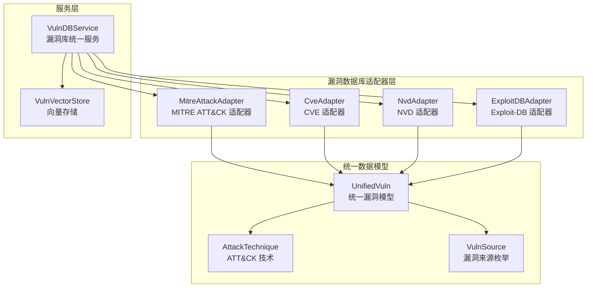
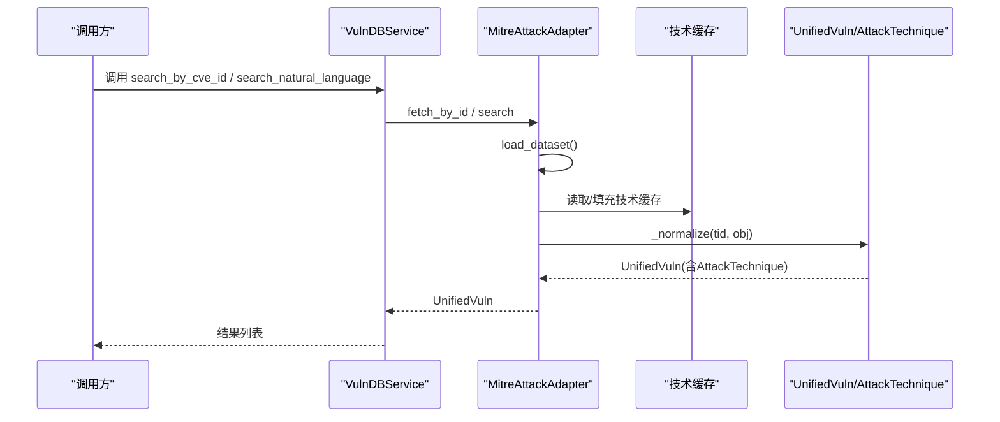
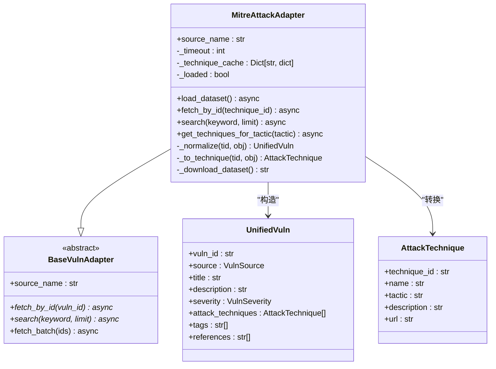
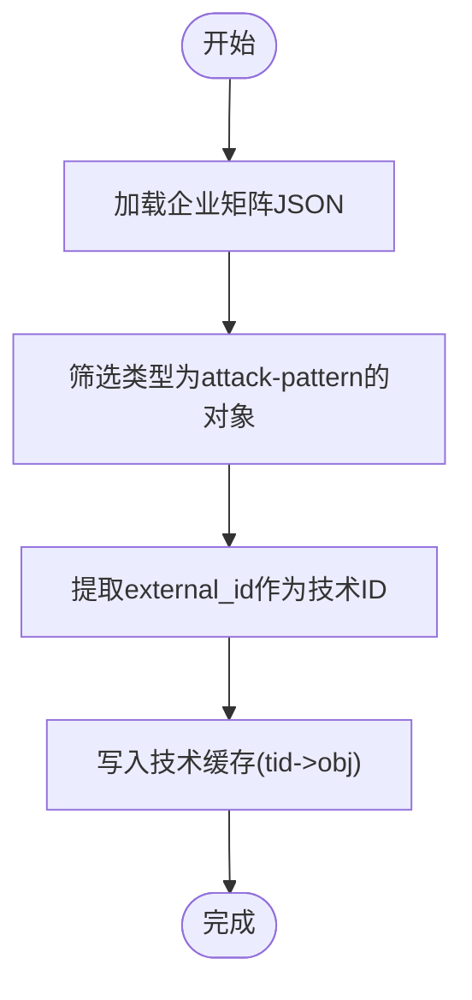
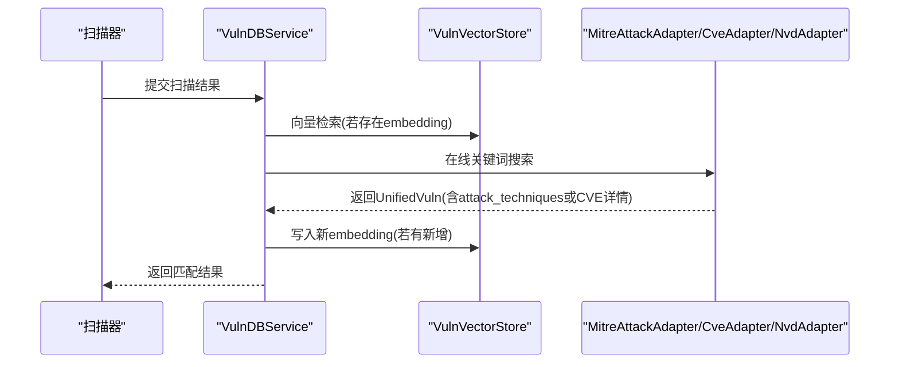
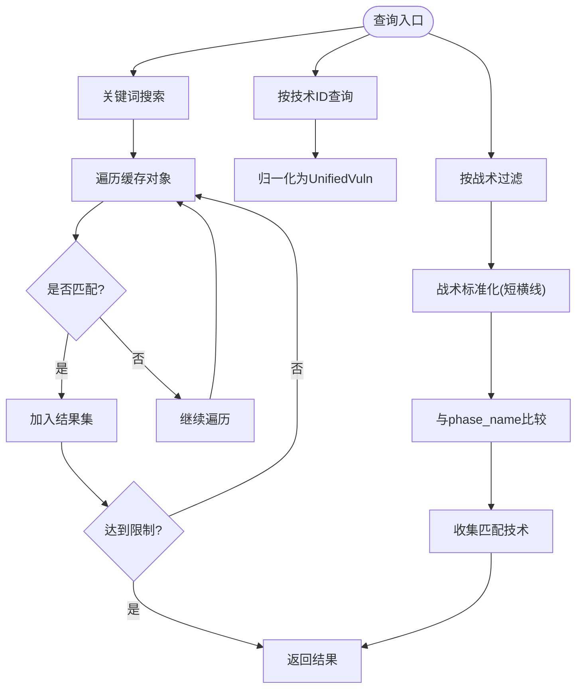
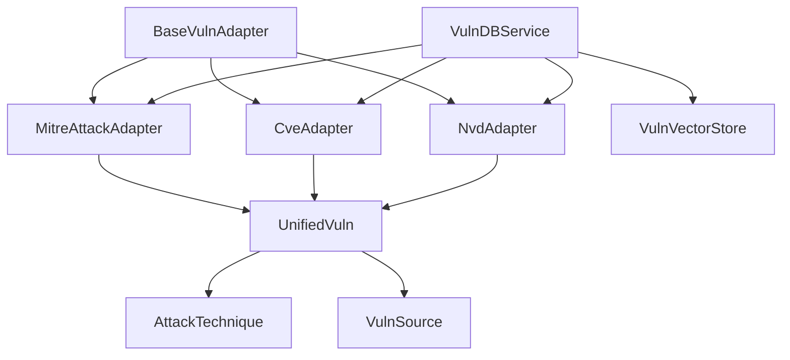

# MITRE适配器

<cite>
**本文档引用的文件**
- [mitre_adapter.py](file://core/vuln_db/adapters/mitre_adapter.py)
- [schema.py](file://core/vuln_db/schema.py)
- [vuln_db_service.py](file://core/vuln_db/vuln_db_service.py)
- [base_adapter.py](file://core/vuln_db/adapters/base_adapter.py)
- [cve_adapter.py](file://core/vuln_db/adapters/cve_adapter.py)
- [nvd_adapter.py](file://core/vuln_db/adapters/nvd_adapter.py)
- [vuln_vector_store.py](file://core/vuln_db/vuln_vector_store.py)
</cite>

## 目录
1. [简介](#简介)
2. [项目结构](#项目结构)
3. [核心组件](#核心组件)
4. [架构总览](#架构总览)
5. [详细组件分析](#详细组件分析)
6. [依赖关系分析](#依赖关系分析)
7. [性能考量](#性能考量)
8. [故障排除指南](#故障排除指南)
9. [结论](#结论)

## 简介
本文件面向Secbot项目的MITRE ATT&CK数据适配器，系统性阐述其如何集成ATT&CK企业版框架数据，解析ATT&CK矩阵的层级结构、技术ID映射与关系建立，并说明如何将ATT&CK技术与CVE漏洞进行关联，以及战术、技术和过程(TTPs)的提取与标准化。同时，文档提供ATT&CK数据的查询接口与过滤机制，涵盖按技术类别、攻击者行为等维度的筛选能力。

## 项目结构
MITRE适配器位于漏洞数据库子系统的适配器层，与CVE、NVD、Exploit-DB等适配器共同构成统一的漏洞数据源接入层。适配器通过统一的数据模型进行归一化输出，供上层服务进行向量检索、自然语言查询与扫描结果匹配。

图表来源
- [mitre_adapter.py](file://core/vuln_db/adapters/mitre_adapter.py#L27-L151)
- [cve_adapter.py](file://core/vuln_db/adapters/cve_adapter.py#L36-L155)
- [nvd_adapter.py](file://core/vuln_db/adapters/nvd_adapter.py#L37-L214)
- [schema.py](file://core/vuln_db/schema.py#L52-L132)
- [vuln_db_service.py](file://core/vuln_db/vuln_db_service.py#L27-L275)
- [vuln_vector_store.py](file://core/vuln_db/vuln_vector_store.py#L18-L107)

章节来源
- [mitre_adapter.py](file://core/vuln_db/adapters/mitre_adapter.py#L1-L151)
- [schema.py](file://core/vuln_db/schema.py#L1-L140)
- [vuln_db_service.py](file://core/vuln_db/vuln_db_service.py#L1-L275)

## 核心组件
- MITRE ATT&CK 适配器：负责下载并解析ATT&CK企业矩阵JSON，构建技术缓存，提供按ID查询、关键词搜索与战术过滤能力。
- 统一漏洞模型：定义了跨数据源的统一结构，包含ATT&CK技术字段、来源标识、标签、参考链接等。
- 漏洞库统一服务：聚合多个适配器，提供向量检索、自然语言查询、扫描结果匹配与数据同步能力。
- 向量存储：对SQLite向量存储进行封装，支持embedding写入与相似度检索。

章节来源
- [mitre_adapter.py](file://core/vuln_db/adapters/mitre_adapter.py#L27-L151)
- [schema.py](file://core/vuln_db/schema.py#L68-L132)
- [vuln_db_service.py](file://core/vuln_db/vuln_db_service.py#L27-L275)
- [vuln_vector_store.py](file://core/vuln_db/vuln_vector_store.py#L18-L107)

## 架构总览
MITRE适配器通过异步加载ATT&CK企业矩阵JSON，建立技术ID到对象的缓存；对外提供按ID查询、关键词搜索与战术过滤接口；内部将ATT&CK对象归一化为统一漏洞模型，其中ATT&CK技术被序列化为AttackTechnique列表。该模型随后可被向量存储与统一服务使用，支撑后续的语义检索与扫描结果匹配。

图表来源
- [vuln_db_service.py](file://core/vuln_db/vuln_db_service.py#L79-L184)
- [mitre_adapter.py](file://core/vuln_db/adapters/mitre_adapter.py#L38-L92)
- [schema.py](file://core/vuln_db/schema.py#L68-L132)

## 详细组件分析

### MITRE ATT&CK 适配器
- 数据源与加载
  - 使用企业矩阵JSON作为数据源，通过异步线程池下载并解析，仅保留类型为attack-pattern的对象。
  - 从external_references中提取ATT&CK技术ID，建立tid到对象的内存缓存，避免重复网络请求。
- 查询接口
  - 按技术ID查询：先确保缓存已加载，再根据大写的TID查找对象并归一化。
  - 关键词搜索：遍历缓存中的技术名称、描述与ID，支持大小写不敏感匹配与限制返回数量。
  - 按战术过滤：将输入战术转换为“短横线”形式并与kill_chain_phases中的phase_name比较，返回匹配技术列表。
- 归一化逻辑
  - 将ATT&CK对象转换为AttackTechnique，提取名称、战术、描述与URL。
  - 构造UnifiedVuln时，设置来源为MITRE_ATTACK，严重性为UNKNOWN，攻击技术列表仅包含该技术，标签包含平台与战术，引用取前若干URL。

图表来源
- [mitre_adapter.py](file://core/vuln_db/adapters/mitre_adapter.py#L27-L151)
- [base_adapter.py](file://core/vuln_db/adapters/base_adapter.py#L8-L33)
- [schema.py](file://core/vuln_db/schema.py#L52-L132)

章节来源
- [mitre_adapter.py](file://core/vuln_db/adapters/mitre_adapter.py#L27-L151)

### ATT&CK矩阵层级结构解析与技术ID映射
- 技术层级
  - ATT&CK企业矩阵采用kill_chain_phases表示战术阶段，适配器读取phase_name作为战术标识。
  - 技术ID通过external_references中的external_id提取，作为缓存键与vuln_id。
- 关系建立
  - 每个attack-pattern对象映射为一个AttackTechnique，包含技术ID、名称、战术、描述与URL。
  - 归一化时将该技术放入attack_techniques列表，便于后续检索与展示。

图表来源
- [mitre_adapter.py](file://core/vuln_db/adapters/mitre_adapter.py#L38-L58)

章节来源
- [mitre_adapter.py](file://core/vuln_db/adapters/mitre_adapter.py#L38-L58)

### ATT&CK技术与CVE漏洞的关联
- 关联策略
  - 通过统一漏洞模型的build_embedding_text方法，将攻击技术ID、名称、战术纳入向量化文本，使ATT&CK技术与CVE描述、EXPLOITS等特征在同一向量空间中可被检索。
  - VulnDBService在自然语言检索与扫描结果匹配过程中，会优先使用向量检索，其次进行在线关键词搜索，从而将ATT&CK技术与CVE信息进行语义关联。
- 实现要点
  - UnifiedVuln中attack_techniques字段保存ATT&CK技术，tags字段包含平台与战术，便于过滤与排序。
  - VulnVectorStore将UnifiedVuln的embedding文本与元数据一起写入向量库，支持相似度检索。

图表来源
- [vuln_db_service.py](file://core/vuln_db/vuln_db_service.py#L90-L145)
- [vuln_db_service.py](file://core/vuln_db/vuln_db_service.py#L147-L184)
- [vuln_db_service.py](file://core/vuln_db/vuln_db_service.py#L237-L261)
- [vuln_vector_store.py](file://core/vuln_db/vuln_vector_store.py#L35-L66)
- [mitre_adapter.py](file://core/vuln_db/adapters/mitre_adapter.py#L77-L92)
- [cve_adapter.py](file://core/vuln_db/adapters/cve_adapter.py#L52-L73)
- [nvd_adapter.py](file://core/vuln_db/adapters/nvd_adapter.py#L57-L86)

章节来源
- [vuln_db_service.py](file://core/vuln_db/vuln_db_service.py#L90-L184)
- [vuln_db_service.py](file://core/vuln_db/vuln_db_service.py#L237-L261)
- [vuln_vector_store.py](file://core/vuln_db/vuln_vector_store.py#L35-L66)
- [schema.py](file://core/vuln_db/schema.py#L95-L115)

### 战术、技术与过程(TTPs)的提取与标准化
- 战术提取
  - 从kill_chain_phases中提取phase_name作为战术名称，用于战术过滤与标签。
- 技术标准化
  - AttackTechnique包含technique_id、name、tactic、description、url，统一了不同来源技术的表达方式。
- 过程建模
  - 通过tags字段同时包含平台与战术，形成TTPs的轻量索引，便于后续按平台或战术维度进行筛选。

章节来源
- [mitre_adapter.py](file://core/vuln_db/adapters/mitre_adapter.py#L94-L107)
- [mitre_adapter.py](file://core/vuln_db/adapters/mitre_adapter.py#L110-L133)
- [mitre_adapter.py](file://core/vuln_db/adapters/mitre_adapter.py#L135-L150)
- [schema.py](file://core/vuln_db/schema.py#L52-L58)

### ATT&CK数据的查询接口与过滤机制
- 接口能力
  - 按技术ID查询：fetch_by_id，适用于已知ATT&CK技术ID的场景。
  - 关键词搜索：search，支持名称、描述、ID的模糊匹配，限制返回数量。
  - 按战术过滤：get_techniques_for_tactic，将输入战术标准化为“短横线”形式后与phase_name比对。
- 过滤维度
  - 按战术：战术名称（如initial-access、execution、persistence等）。
  - 按平台：x_mitre_platforms字段映射到tags，可用于平台维度过滤。
  - 按关键词：名称/描述/ID的组合检索。

图表来源
- [mitre_adapter.py](file://core/vuln_db/adapters/mitre_adapter.py#L67-L92)
- [mitre_adapter.py](file://core/vuln_db/adapters/mitre_adapter.py#L94-L107)

章节来源
- [mitre_adapter.py](file://core/vuln_db/adapters/mitre_adapter.py#L67-L107)

## 依赖关系分析
- 适配器层
  - MitreAttackAdapter继承BaseVulnAdapter，遵循统一的fetch_by_id与search接口约定。
  - 与其他适配器（CveAdapter、NvdAdapter）共享同一服务层，由VulnDBService统一调度。
- 数据模型层
  - UnifiedVuln与AttackTechnique定义了跨数据源的统一结构，ATT&CK技术被嵌入到attack_techniques字段。
- 存储与检索
  - VulnVectorStore封装向量检索，VulnDBService负责embedding生成与写入，形成“向量检索+在线搜索”的混合检索策略。

图表来源
- [base_adapter.py](file://core/vuln_db/adapters/base_adapter.py#L8-L33)
- [mitre_adapter.py](file://core/vuln_db/adapters/mitre_adapter.py#L27-L151)
- [cve_adapter.py](file://core/vuln_db/adapters/cve_adapter.py#L36-L155)
- [nvd_adapter.py](file://core/vuln_db/adapters/nvd_adapter.py#L37-L214)
- [schema.py](file://core/vuln_db/schema.py#L25-L132)
- [vuln_db_service.py](file://core/vuln_db/vuln_db_service.py#L27-L47)
- [vuln_vector_store.py](file://core/vuln_db/vuln_vector_store.py#L18-L107)

章节来源
- [base_adapter.py](file://core/vuln_db/adapters/base_adapter.py#L8-L33)
- [schema.py](file://core/vuln_db/schema.py#L25-L132)
- [vuln_db_service.py](file://core/vuln_db/vuln_db_service.py#L27-L47)

## 性能考量
- 缓存策略
  - 技术缓存避免重复下载与解析，建议在应用启动时预热缓存，减少首次查询延迟。
- 异步与并发
  - 适配器使用异步I/O与线程池执行网络请求，提高并发吞吐；建议在高并发场景下合理设置超时与重试。
- 向量检索阈值
  - VulnDBService在向量检索中设置了阈值与限制，避免过多无关结果；可根据业务需求调整阈值与返回数量。
- 数据规模
  - 企业矩阵JSON约15MB，建议在资源受限环境下谨慎启用预加载；可通过按需加载与缓存结合降低内存占用。

## 故障排除指南
- MITRE数据加载失败
  - 现象：日志提示MITRE ATT&CK数据集加载失败。
  - 排查：检查网络连通性、代理设置与超时配置；确认GitHub访问正常。
- 技术ID未命中
  - 现象：按ID查询返回空。
  - 排查：确认技术ID格式（大写TXXXX），检查缓存是否已加载；验证外部引用中是否存在mitre-attack来源。
- 搜索结果为空
  - 现象：关键词搜索无结果。
  - 排查：确认关键字与技术名称/描述/ID的匹配度；适当放宽限制或调整关键词。
- 向量检索异常
  - 现象：向量检索失败或返回空。
  - 排查：确认embedding生成成功且向量库中有数据；检查阈值与维度配置；必要时重建向量库。

章节来源
- [mitre_adapter.py](file://core/vuln_db/adapters/mitre_adapter.py#L57-L58)
- [mitre_adapter.py](file://core/vuln_db/adapters/mitre_adapter.py#L71-L75)
- [vuln_db_service.py](file://core/vuln_db/vuln_db_service.py#L60-L73)
- [vuln_db_service.py](file://core/vuln_db/vuln_db_service.py#L110-L113)
- [vuln_db_service.py](file://core/vuln_db/vuln_db_service.py#L157-L159)

## 结论
MITRE适配器通过异步加载ATT&CK企业矩阵、建立技术缓存与标准化归一化流程，实现了对ATT&CK技术的高效查询与过滤。结合统一漏洞模型与向量检索机制，系统能够将ATT&CK战术、技术和过程(TTPs)与CVE等漏洞信息进行语义关联，为安全分析与自动化渗透测试提供坚实的数据基础。建议在生产环境中启用缓存预热、合理设置检索阈值，并持续维护MITRE数据源的可用性与准确性。