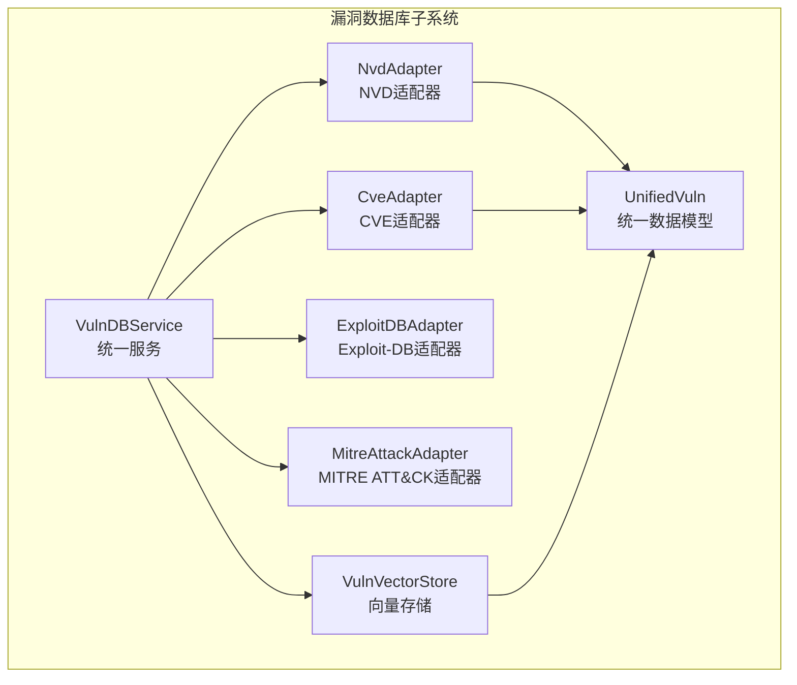
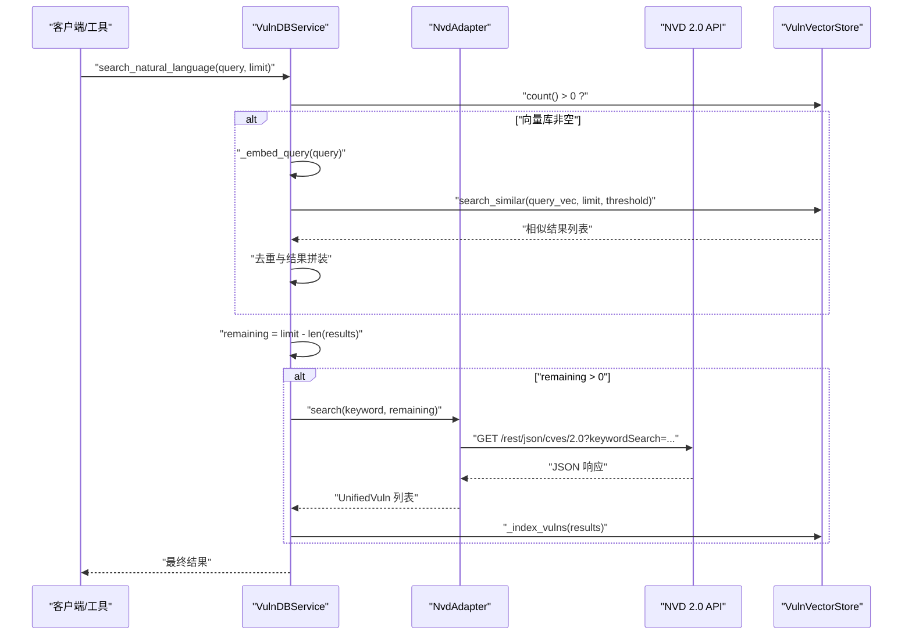
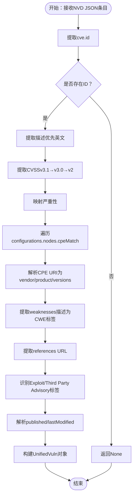
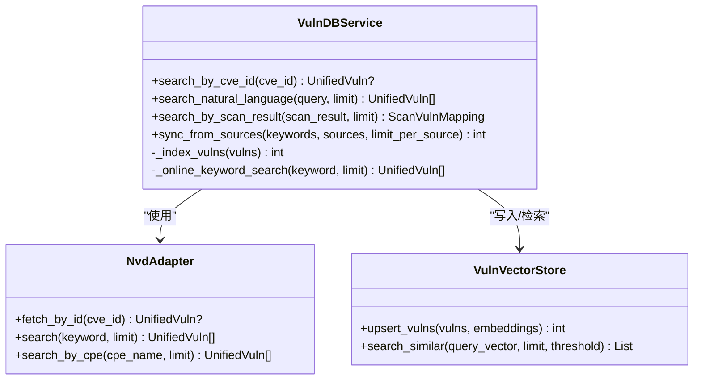
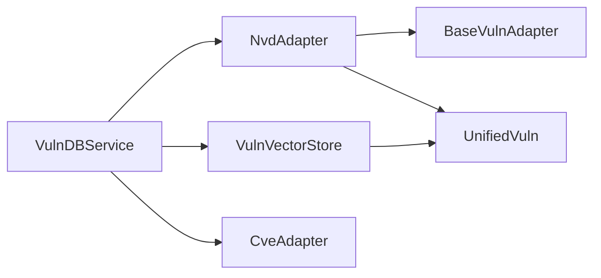

# NVD适配器

<cite>
**本文档引用的文件**
- [nvd_adapter.py](file://core/vuln_db/adapters/nvd_adapter.py)
- [schema.py](file://core/vuln_db/schema.py)
- [vuln_db_service.py](file://core/vuln_db/vuln_db_service.py)
- [base_adapter.py](file://core/vuln_db/adapters/base_adapter.py)
- [cve_adapter.py](file://core/vuln_db/adapters/cve_adapter.py)
- [vuln_vector_store.py](file://core/vuln_db/vuln_vector_store.py)
- [cve_lookup_tool.py](file://tools/utility/cve_lookup_tool.py)
- [hackbot_config.py](file://hackbot_config/__init__.py)
</cite>

## 目录
1. [简介](#简介)
2. [项目结构](#项目结构)
3. [核心组件](#核心组件)
4. [架构总览](#架构总览)
5. [详细组件分析](#详细组件分析)
6. [依赖关系分析](#依赖关系分析)
7. [性能考虑](#性能考虑)
8. [故障排除指南](#故障排除指南)
9. [结论](#结论)

## 简介
本文件面向Secbot项目的NVD（美国国家标准与技术研究院）官方漏洞数据库适配器，系统性阐述其对接NVD 2.0 REST API的数据获取、JSON格式解析、字段映射与数据完整性校验机制，并说明增量更新策略、版本管理与历史数据追踪方案。同时提供查询接口与高级搜索能力（按CVSS评分、受影响产品、时间范围等条件的精确检索），帮助读者全面理解该适配器的设计与实现。

## 项目结构
NVD适配器位于漏洞数据库子系统中，采用“适配器模式 + 统一数据模型”的架构设计，与CVE、Exploit-DB、MITRE ATT&CK等其他数据源并列，通过统一的服务层进行编排与检索。

图表来源
- [vuln_db_service.py](file://core/vuln_db/vuln_db_service.py#L27-L44)
- [nvd_adapter.py](file://core/vuln_db/adapters/nvd_adapter.py#L37-L44)
- [cve_adapter.py](file://core/vuln_db/adapters/cve_adapter.py#L36-L42)
- [schema.py](file://core/vuln_db/schema.py#L68-L94)
- [vuln_vector_store.py](file://core/vuln_db/vuln_vector_store.py#L18-L29)

章节来源
- [vuln_db_service.py](file://core/vuln_db/vuln_db_service.py#L27-L44)
- [nvd_adapter.py](file://core/vuln_db/adapters/nvd_adapter.py#L37-L44)
- [schema.py](file://core/vuln_db/schema.py#L68-L94)
- [vuln_vector_store.py](file://core/vuln_db/vuln_vector_store.py#L18-L29)

## 核心组件
- NvdAdapter：对接NVD 2.0 REST API，支持按CVE ID精确查询、关键词搜索、按CPE名称搜索，并将NVD JSON归一化为统一数据模型。
- VulnDBService：统一服务层，负责多数据源适配器编排、向量检索、自然语言语义搜索、在线关键词搜索补充与向量库写入。
- UnifiedVuln：统一漏洞数据模型，包含漏洞标识、来源、标题、描述、受影响软件、严重性、CVSS评分与向量、引用、标签、发布时间与修改时间、状态等字段。
- VulnVectorStore：基于SQLite的向量存储封装，提供embedding写入与相似度检索能力。
- BaseVulnAdapter：适配器抽象基类，定义fetch_by_id、search等统一接口。

章节来源
- [nvd_adapter.py](file://core/vuln_db/adapters/nvd_adapter.py#L37-L44)
- [vuln_db_service.py](file://core/vuln_db/vuln_db_service.py#L27-L44)
- [schema.py](file://core/vuln_db/schema.py#L68-L94)
- [vuln_vector_store.py](file://core/vuln_db/vuln_vector_store.py#L18-L29)
- [base_adapter.py](file://core/vuln_db/adapters/base_adapter.py#L8-L33)

## 架构总览
NVD适配器通过异步HTTP请求访问NVD 2.0 REST API，解析JSON响应并映射到统一数据模型。服务层在向量库为空时进行在线关键词搜索补充，在向量库有数据时优先进行语义检索，最后再进行在线补充，形成“向量检索 + 在线搜索”的混合检索策略。

图表来源
- [vuln_db_service.py](file://core/vuln_db/vuln_db_service.py#L147-L184)
- [nvd_adapter.py](file://core/vuln_db/adapters/nvd_adapter.py#L57-L72)
- [vuln_vector_store.py](file://core/vuln_db/vuln_vector_store.py#L72-L93)

章节来源
- [vuln_db_service.py](file://core/vuln_db/vuln_db_service.py#L147-L184)
- [nvd_adapter.py](file://core/vuln_db/adapters/nvd_adapter.py#L57-L72)
- [vuln_vector_store.py](file://core/vuln_db/vuln_vector_store.py#L72-L93)

## 详细组件分析

### NvdAdapter：NVD 2.0 API适配器
- 接口职责
  - fetch_by_id：按CVE ID精确查询单条漏洞。
  - search：关键词搜索，支持关键字与结果数量限制。
  - search_by_cpe：按CPE名称搜索受影响的漏洞。
  - _fetch_json/_sync_get：异步包装同步HTTP请求，设置User-Agent与可选apiKey头。
  - _normalize：将NVD JSON归一化为UnifiedVuln对象。
- 数据解析与字段映射
  - 漏洞ID：来自cve.id。
  - 描述：优先取英文描述，否则取第一条描述。
  - CVSS：按cvssMetricV31 → cvssMetricV30 → cvssMetricV2顺序查找，提取baseScore、vectorString与baseSeverity映射为严重性枚举。
  - 受影响产品：遍历configurations → nodes → cpeMatch，解析CPE URI为vendor、product、versions。
  - CWE：从weaknesses中提取描述值，去重后作为标签。
  - 引用与Exploit标记：从references提取URL，若标签包含“Exploit”或“Third Party Advisory”，则构建ExploitRef。
  - 时间：解析published与lastModified为UTC时间。
  - 其他：vulnStatus映射为state。
- 错误处理
  - API请求异常记录警告并返回None。
  - 归一化过程异常跳过该条目并记录调试日志。
- 限制与边界
  - 结果数量限制：search/search_by_cpe最多返回100条（NVD API限制）。
  - 描述截断：描述最大长度限制为2000字符。
  - 受影响软件截断：最多保留20个受影响产品。
  - 引用截断：最多保留10个引用链接。

图表来源
- [nvd_adapter.py](file://core/vuln_db/adapters/nvd_adapter.py#L106-L204)

章节来源
- [nvd_adapter.py](file://core/vuln_db/adapters/nvd_adapter.py#L47-L86)
- [nvd_adapter.py](file://core/vuln_db/adapters/nvd_adapter.py#L89-L103)
- [nvd_adapter.py](file://core/vuln_db/adapters/nvd_adapter.py#L106-L204)

### VulnDBService：统一服务层
- 初始化与适配器注册
  - 注册NvdAdapter（支持传入NVD API Key）、CveAdapter、ExploitDBAdapter、MitreAttackAdapter。
- 查询接口
  - search_by_cve_id：优先NVD/CVE源精确查询，命中后写入向量库。
  - search_natural_language：向量检索 + 在线关键词搜索补充。
  - search_by_scan_result：扫描结果匹配，结合向量与关键词在线搜索。
- 在线关键词搜索
  - 依次尝试NVD/CVE源，去重后写入向量库。
- 同步与索引
  - sync_from_sources：按关键词从指定源批量拉取并写入向量库。
  - _index_vulns：对漏洞集合生成embedding并写入向量库。

图表来源
- [vuln_db_service.py](file://core/vuln_db/vuln_db_service.py#L27-L44)
- [nvd_adapter.py](file://core/vuln_db/adapters/nvd_adapter.py#L37-L44)
- [vuln_vector_store.py](file://core/vuln_db/vuln_vector_store.py#L18-L29)

章节来源
- [vuln_db_service.py](file://core/vuln_db/vuln_db_service.py#L79-L88)
- [vuln_db_service.py](file://core/vuln_db/vuln_db_service.py#L147-L184)
- [vuln_db_service.py](file://core/vuln_db/vuln_db_service.py#L190-L222)
- [vuln_db_service.py](file://core/vuln_db/vuln_db_service.py#L237-L261)

### UnifiedVuln：统一数据模型
- 字段构成
  - 基础信息：vuln_id、source、title、description。
  - 影响范围：affected_software（包含vendor、product、versions、cpe）。
  - 安全评估：severity、cvss_score、cvss_vector。
  - 资源引用：references、exploits、attack_techniques、mitigations。
  - 元数据：tags、date_published、date_modified、state、raw_data。
  - 向量化辅助：build_embedding_text用于生成embedding文本。
- 复杂度分析
  - build_embedding_text时间复杂度：O(k)，k为受影响产品、exploits、攻击技术、标签数量与严重性、CVSS分数等常数项的线性组合。
  - to_summary生成摘要：O(k)，k为受影响产品数量与引用数量的线性组合。

章节来源
- [schema.py](file://core/vuln_db/schema.py#L68-L131)

### VulnVectorStore：向量存储
- 写入流程
  - upsert_vulns：将每个漏洞转换为VectorItem，写入metadata（含vuln_id、source、severity、cvss_score、title、description、tags），并持久化embedding。
- 检索流程
  - search_similar：基于查询向量进行相似度检索，返回元数据与相似度分数列表。
- 性能特性
  - 基于SQLite的向量存储，适合中小规模数据集；阈值与limit控制召回质量与性能。

章节来源
- [vuln_vector_store.py](file://core/vuln_db/vuln_vector_store.py#L35-L66)
- [vuln_vector_store.py](file://core/vuln_db/vuln_vector_store.py#L72-L93)

### BaseVulnAdapter：适配器基类
- 抽象接口
  - fetch_by_id：按漏洞ID获取。
  - search：关键词搜索。
  - fetch_batch：默认逐条调用fetch_by_id，子类可覆盖优化。
- 设计意义
  - 统一不同数据源的调用方式，便于扩展新数据源。

章节来源
- [base_adapter.py](file://core/vuln_db/adapters/base_adapter.py#L8-L33)

### 与其他适配器的关系
- 与CveAdapter对比
  - API基础URL与JSON结构不同，CveAdapter使用Mitre CVE API，字段映射逻辑相应调整。
  - 两者均继承BaseVulnAdapter，遵循统一接口。
- 与ExploitDB/MitreAttack适配器
  - 同属多数据源适配器体系，由VulnDBService统一编排。

章节来源
- [cve_adapter.py](file://core/vuln_db/adapters/cve_adapter.py#L36-L42)
- [vuln_db_service.py](file://core/vuln_db/vuln_db_service.py#L39-L44)

## 依赖关系分析
- 组件耦合
  - NvdAdapter依赖BaseVulnAdapter与UnifiedVuln模型，内部仅依赖标准库与loguru。
  - VulnDBService聚合多个适配器与向量存储，承担编排职责。
  - VulnVectorStore依赖SQLiteVectorStore与UnifiedVuln。
- 外部依赖
  - NVD 2.0 REST API（HTTPS）。
  - 可选NVD API Key（apiKey头）。
  - Ollama嵌入模型（用于向量检索）。

图表来源
- [nvd_adapter.py](file://core/vuln_db/adapters/nvd_adapter.py#L24-L24)
- [base_adapter.py](file://core/vuln_db/adapters/base_adapter.py#L5-L6)
- [schema.py](file://core/vuln_db/schema.py#L68-L94)
- [vuln_db_service.py](file://core/vuln_db/vuln_db_service.py#L18-L22)
- [vuln_vector_store.py](file://core/vuln_db/vuln_vector_store.py#L14-L15)

章节来源
- [nvd_adapter.py](file://core/vuln_db/adapters/nvd_adapter.py#L24-L24)
- [base_adapter.py](file://core/vuln_db/adapters/base_adapter.py#L5-L6)
- [schema.py](file://core/vuln_db/schema.py#L68-L94)
- [vuln_db_service.py](file://core/vuln_db/vuln_db_service.py#L18-L22)
- [vuln_vector_store.py](file://core/vuln_db/vuln_vector_store.py#L14-L15)

## 性能考虑
- 并发与阻塞
  - NVD请求通过run_in_executor在事件循环外执行同步HTTP请求，避免阻塞异步事件循环。
- 结果限制
  - NVD搜索结果每页最多100条，避免一次性拉取过多数据。
- 向量检索阈值
  - VulnDBService在向量检索时设置阈值与limit，平衡召回率与性能。
- 嵌入失败回退
  - 当嵌入模型不可用时，VulnDBService回退为空向量，保证系统可用性。

章节来源
- [nvd_adapter.py](file://core/vuln_db/adapters/nvd_adapter.py#L89-L95)
- [vuln_db_service.py](file://core/vuln_db/vuln_db_service.py#L58-L73)
- [vuln_db_service.py](file://core/vuln_db/vuln_db_service.py#L110-L113)
- [vuln_db_service.py](file://core/vuln_db/vuln_db_service.py#L60-L64)

## 故障排除指南
- NVD API请求失败
  - 现象：日志出现“NVD API 请求失败”警告。
  - 排查：检查网络连通性、NVD服务状态、API Key配置（如启用）。
  - 参考：NvdAdapter._fetch_json与_nvd_sync_get的异常捕获。
- 归一化异常
  - 现象：日志出现“NVD normalize 跳过”调试信息。
  - 排查：检查NVD JSON结构变化或字段缺失，确认cve.id是否存在。
- 嵌入失败
  - 现象：日志出现“Embedding 失败，回退为空向量”警告。
  - 排查：检查Ollama服务状态与模型可用性，确认维度配置正确。
- 配置NVD API Key
  - 方式：通过环境变量或配置管理模块保存，确保请求头包含apiKey。
  - 参考：NvdAdapter构造函数与请求头设置。

章节来源
- [nvd_adapter.py](file://core/vuln_db/adapters/nvd_adapter.py#L94-L95)
- [nvd_adapter.py](file://core/vuln_db/adapters/nvd_adapter.py#L70-L71)
- [vuln_db_service.py](file://core/vuln_db/vuln_db_service.py#L62-L64)
- [nvd_adapter.py](file://core/vuln_db/adapters/nvd_adapter.py#L100-L101)
- [hackbot_config.py](file://hackbot_config/__init__.py#L127-L137)

## 结论
NVD适配器通过清晰的接口设计与严格的JSON解析流程，实现了对NVD 2.0 REST API的稳定对接。配合统一数据模型与向量检索服务，形成了“精确查询 + 语义检索 + 在线补充”的综合查询能力。在性能方面，采用异步并发与结果限制策略，兼顾吞吐与稳定性。建议在生产环境中启用NVD API Key以提升配额，并结合向量库定期同步关键关键词，以获得更高质量的检索效果。