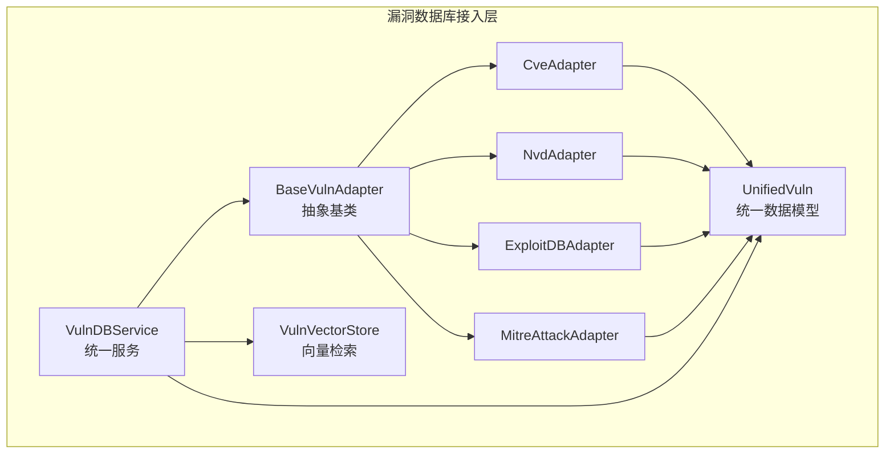
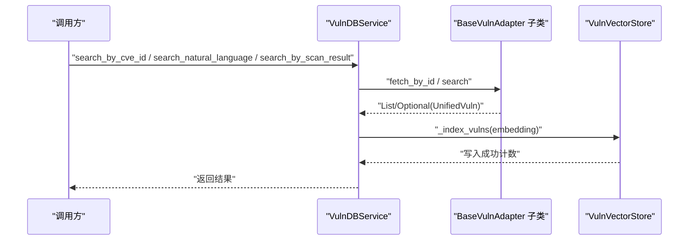
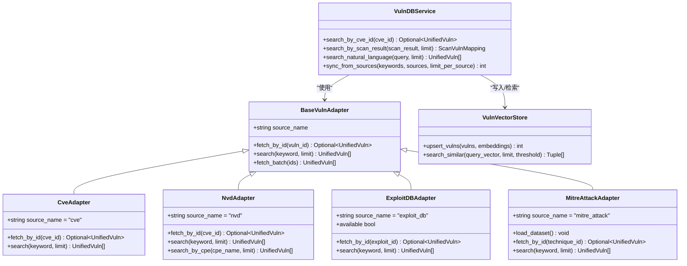
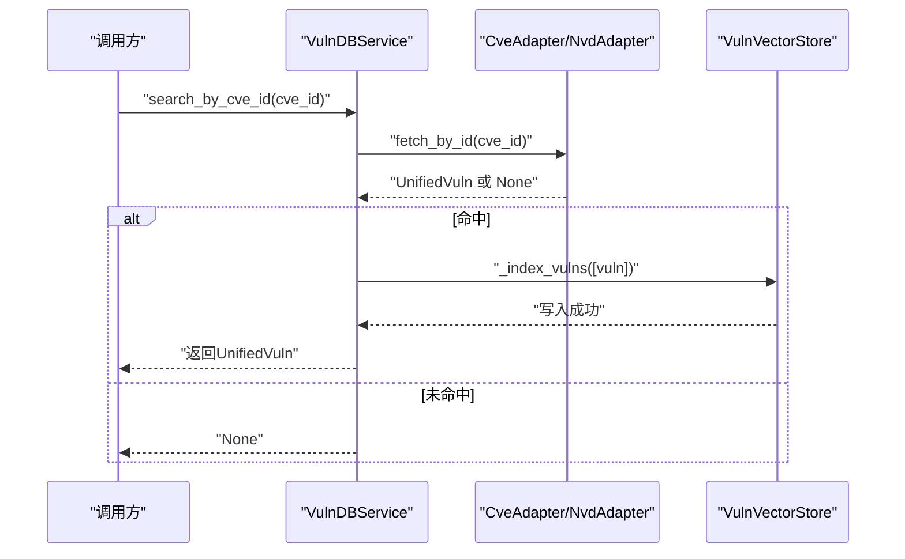
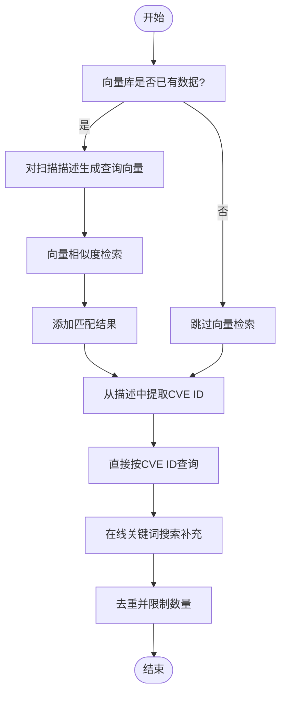
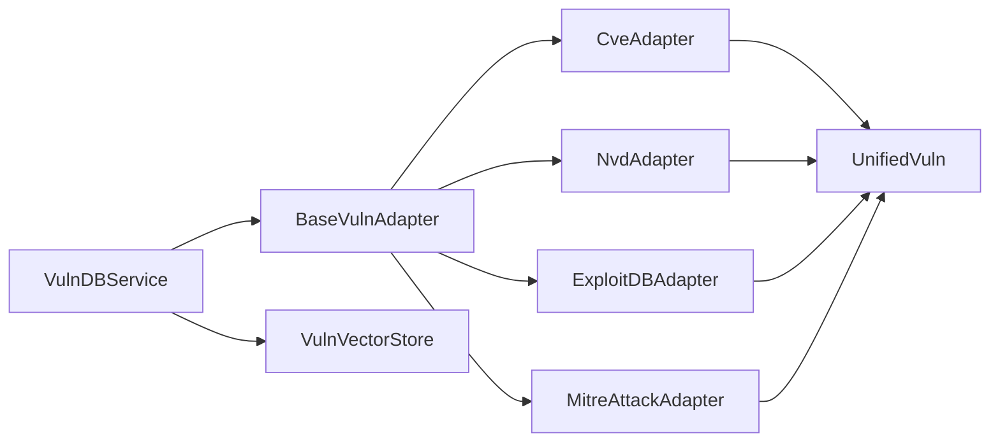

# 基础适配器类

<cite>
**本文引用的文件列表**
- [core/vuln_db/adapters/base_adapter.py](file://core/vuln_db/adapters/base_adapter.py)
- [core/vuln_db/schema.py](file://core/vuln_db/schema.py)
- [core/vuln_db/vuln_db_service.py](file://core/vuln_db/vuln_db_service.py)
- [core/vuln_db/adapters/cve_adapter.py](file://core/vuln_db/adapters/cve_adapter.py)
- [core/vuln_db/adapters/nvd_adapter.py](file://core/vuln_db/adapters/nvd_adapter.py)
- [core/vuln_db/adapters/exploit_db_adapter.py](file://core/vuln_db/adapters/exploit_db_adapter.py)
- [core/vuln_db/adapters/mitre_adapter.py](file://core/vuln_db/adapters/mitre_adapter.py)
- [core/vuln_db/vuln_vector_store.py](file://core/vuln_db/vuln_vector_store.py)
</cite>

## 目录
1. [简介](#简介)
2. [项目结构](#项目结构)
3. [核心组件](#核心组件)
4. [架构总览](#架构总览)
5. [组件详解](#组件详解)
6. [依赖关系分析](#依赖关系分析)
7. [性能考量](#性能考量)
8. [故障排查指南](#故障排查指南)
9. [结论](#结论)

## 简介
本文面向Secbot的“基础漏洞数据适配器类”BaseVulnAdapter，系统阐述其设计理念、接口定义、异步实现模式、返回值格式，以及如何正确继承与扩展。同时结合统一漏洞数据模型UnifiedVuln与服务层VulnDBService，给出最佳实践与实现指南，帮助开发者快速构建新的漏洞数据源适配器。

## 项目结构
围绕漏洞数据库接入层，相关代码主要位于core/vuln_db目录，包含：
- 适配器基类与具体适配器：base_adapter.py及cve_adapter.py、nvd_adapter.py、exploit_db_adapter.py、mitre_adapter.py
- 统一数据模型：schema.py
- 服务层：vuln_db_service.py
- 向量检索：vuln_vector_store.py

图表来源
- [core/vuln_db/adapters/base_adapter.py](file://core/vuln_db/adapters/base_adapter.py#L8-L33)
- [core/vuln_db/adapters/cve_adapter.py](file://core/vuln_db/adapters/cve_adapter.py#L36-L155)
- [core/vuln_db/adapters/nvd_adapter.py](file://core/vuln_db/adapters/nvd_adapter.py#L37-L214)
- [core/vuln_db/adapters/exploit_db_adapter.py](file://core/vuln_db/adapters/exploit_db_adapter.py#L24-L117)
- [core/vuln_db/adapters/mitre_adapter.py](file://core/vuln_db/adapters/mitre_adapter.py#L27-L151)
- [core/vuln_db/schema.py](file://core/vuln_db/schema.py#L68-L140)
- [core/vuln_db/vuln_db_service.py](file://core/vuln_db/vuln_db_service.py#L27-L275)
- [core/vuln_db/vuln_vector_store.py](file://core/vuln_db/vuln_vector_store.py#L18-L107)

章节来源
- [core/vuln_db/adapters/base_adapter.py](file://core/vuln_db/adapters/base_adapter.py#L1-L33)
- [core/vuln_db/schema.py](file://core/vuln_db/schema.py#L1-L140)
- [core/vuln_db/vuln_db_service.py](file://core/vuln_db/vuln_db_service.py#L1-L275)
- [core/vuln_db/vuln_vector_store.py](file://core/vuln_db/vuln_vector_store.py#L1-L107)

## 核心组件
- BaseVulnAdapter：定义了统一的异步接口，约束所有漏洞数据源适配器必须实现的方法族，确保上层服务层与数据源解耦。
- UnifiedVuln：统一的漏洞数据模型，承载跨数据源的标准化字段，支持向量化与自然语言检索。
- VulnDBService：统一服务层，负责多适配器调度、向量检索、自然语言搜索、扫描结果匹配与数据同步。
- VulnVectorStore：向量检索封装，负责embedding写入与相似度检索。

章节来源
- [core/vuln_db/adapters/base_adapter.py](file://core/vuln_db/adapters/base_adapter.py#L8-L33)
- [core/vuln_db/schema.py](file://core/vuln_db/schema.py#L68-L140)
- [core/vuln_db/vuln_db_service.py](file://core/vuln_db/vuln_db_service.py#L27-L275)
- [core/vuln_db/vuln_vector_store.py](file://core/vuln_db/vuln_vector_store.py#L18-L107)

## 架构总览
下图展示服务层如何通过适配器访问不同数据源，并将结果进行向量化与检索。

图表来源
- [core/vuln_db/vuln_db_service.py](file://core/vuln_db/vuln_db_service.py#L79-L184)
- [core/vuln_db/adapters/base_adapter.py](file://core/vuln_db/adapters/base_adapter.py#L13-L32)
- [core/vuln_db/vuln_vector_store.py](file://core/vuln_db/vuln_vector_store.py#L35-L66)

## 组件详解

### BaseVulnAdapter 抽象基类
- 设计理念
  - 通过抽象方法约束：fetch_by_id、search、fetch_batch，保证所有适配器对外行为一致。
  - source_name作为标识符，用于区分不同数据源，便于日志、统计与路由。
  - fetch_batch默认实现采用顺序调用fetch_by_id，子类可覆盖以实现批量优化（如HTTP批请求、数据库批量查询）。
- 接口定义
  - 属性
    - source_name: str = "unknown
  - 方法
    - fetch_by_id(vuln_id: str) -> Optional[UnifiedVuln]: 按ID获取单条漏洞详情
    - search(keyword: str, limit: int = 20) -> List[UnifiedVuln]: 关键词搜索
    - fetch_batch(ids: List[str]) -> List[UnifiedVuln]: 默认逐条调用fetch_by_id，子类可覆盖
- 异步实现模式
  - 所有方法均为async def，内部可使用事件循环与线程池执行阻塞IO（如HTTP请求），避免阻塞事件循环。
  - 返回值格式
    - fetch_by_id：Optional[UnifiedVuln]，未命中返回None
    - search：List[UnifiedVuln]，空列表表示无结果
    - fetch_batch：List[UnifiedVuln]，过滤掉None项后返回

章节来源
- [core/vuln_db/adapters/base_adapter.py](file://core/vuln_db/adapters/base_adapter.py#L8-L33)

### UnifiedVuln 统一数据模型
- 字段概览
  - 基本信息：vuln_id、source、title、description
  - 影响范围：affected_software(List[AffectedProduct])
  - 严重性与评分：severity(VulnSeverity)、cvss_score、cvss_vector
  - 可利用信息：exploits(List[ExploitRef])
  - 攻击技术：attack_techniques(List[AttackTechnique])
  - 缓解措施：mitigations(List[Mitigation])
  - 元数据：references(List[str])、tags(List[str])、date_published/date_modified、state
  - 原始数据：raw_data(Optional[dict])
- 文本向量化
  - build_embedding_text：拼接vuln_id、title、description、受影响软件、exploit标题、ATT&CK技术、严重性、CVSS分数、标签等，形成可用于embedding的文本
  - to_summary：生成人类可读摘要
- 枚举
  - VulnSeverity：critical/high/medium/low/info/unknown
  - VulnSource：cve/nvd/exploit_db/mitre_attack/scan

章节来源
- [core/vuln_db/schema.py](file://core/vuln_db/schema.py#L15-L140)

### VulnDBService 统一服务层
- 职责
  - 管理多个适配器实例，按需调用fetch_by_id/search
  - 将结果进行向量化并写入VulnVectorStore
  - 提供自然语言检索、扫描结果匹配、按CVE ID精确查询、多源同步等功能
- 关键流程
  - search_by_cve_id：优先尝试nvd/cve适配器，命中后写入向量库
  - search_by_scan_result：先向量检索，再提取描述中的CVE ID，最后在线关键词搜索补充
  - search_natural_language：向量检索+在线关键词搜索
  - sync_from_sources：按关键词从指定数据源批量拉取并入库
- 异常处理
  - 适配器调用失败时记录warning并继续流程
  - 向量嵌入失败时回退为空向量

章节来源
- [core/vuln_db/vuln_db_service.py](file://core/vuln_db/vuln_db_service.py#L27-L275)

### 具体适配器实现要点
- CveAdapter
  - 使用MITRE CVE API，source_name="cve"
  - fetch_by_id：按CVE ID请求API并归一化
  - search：关键词搜索，限制返回条数
  - _fetch_json：通过线程池执行阻塞HTTP请求
  - _normalize：将API响应映射到UnifiedVuln
- NvdAdapter
  - 使用NVD 2.0 REST API，source_name="nvd"
  - fetch_by_id：按CVE ID查询
  - search：关键词搜索
  - search_by_cpe：按CPE名称检索
  - _normalize：处理多版本CVSS与CWE标签
- ExploitDBAdapter
  - 依赖本地searchsploit命令，source_name="exploit_db"
  - fetch_by_id：按EDB-ID查询
  - search：关键词搜索
  - _run_searchsploit：通过线程池执行子进程
  - _parse_json_output：解析JSON输出并构造UnifiedVuln
- MitreAttackAdapter
  - 从GitHub下载MITRE ATT&CK JSON，source_name="mitre_attack"
  - load_dataset：预加载技术缓存
  - fetch_by_id：按TID获取
  - search：按名称/描述/ID模糊匹配
  - _normalize/_to_technique：将ATT&CK对象映射到UnifiedVuln与AttackTechnique

章节来源
- [core/vuln_db/adapters/cve_adapter.py](file://core/vuln_db/adapters/cve_adapter.py#L36-L155)
- [core/vuln_db/adapters/nvd_adapter.py](file://core/vuln_db/adapters/nvd_adapter.py#L37-L214)
- [core/vuln_db/adapters/exploit_db_adapter.py](file://core/vuln_db/adapters/exploit_db_adapter.py#L24-L117)
- [core/vuln_db/adapters/mitre_adapter.py](file://core/vuln_db/adapters/mitre_adapter.py#L27-L151)

### 类关系图

图表来源
- [core/vuln_db/adapters/base_adapter.py](file://core/vuln_db/adapters/base_adapter.py#L8-L33)
- [core/vuln_db/adapters/cve_adapter.py](file://core/vuln_db/adapters/cve_adapter.py#L36-L155)
- [core/vuln_db/adapters/nvd_adapter.py](file://core/vuln_db/adapters/nvd_adapter.py#L37-L214)
- [core/vuln_db/adapters/exploit_db_adapter.py](file://core/vuln_db/adapters/exploit_db_adapter.py#L24-L117)
- [core/vuln_db/adapters/mitre_adapter.py](file://core/vuln_db/adapters/mitre_adapter.py#L27-L151)
- [core/vuln_db/vuln_db_service.py](file://core/vuln_db/vuln_db_service.py#L27-L275)
- [core/vuln_db/vuln_vector_store.py](file://core/vuln_db/vuln_vector_store.py#L18-L107)

### 关键流程时序图

#### 按CVE ID精确查询

图表来源
- [core/vuln_db/vuln_db_service.py](file://core/vuln_db/vuln_db_service.py#L79-L88)
- [core/vuln_db/adapters/cve_adapter.py](file://core/vuln_db/adapters/cve_adapter.py#L45-L50)
- [core/vuln_db/adapters/nvd_adapter.py](file://core/vuln_db/adapters/nvd_adapter.py#L47-L55)
- [core/vuln_db/vuln_vector_store.py](file://core/vuln_db/vuln_vector_store.py#L35-L66)

#### 扫描结果匹配流程

图表来源
- [core/vuln_db/vuln_db_service.py](file://core/vuln_db/vuln_db_service.py#L90-L145)

## 依赖关系分析
- 适配器依赖
  - 所有适配器均继承自BaseVulnAdapter，遵循统一接口
  - 适配器内部依赖网络请求或本地CLI工具，通过线程池避免阻塞
- 服务层依赖
  - VulnDBService聚合多个适配器实例，按需调用
  - 依赖VulnVectorStore进行embedding写入与检索
- 数据模型依赖
  - 所有适配器输出统一为UnifiedVuln，确保上层逻辑一致性

图表来源
- [core/vuln_db/adapters/base_adapter.py](file://core/vuln_db/adapters/base_adapter.py#L8-L33)
- [core/vuln_db/adapters/cve_adapter.py](file://core/vuln_db/adapters/cve_adapter.py#L36-L155)
- [core/vuln_db/adapters/nvd_adapter.py](file://core/vuln_db/adapters/nvd_adapter.py#L37-L214)
- [core/vuln_db/adapters/exploit_db_adapter.py](file://core/vuln_db/adapters/exploit_db_adapter.py#L24-L117)
- [core/vuln_db/adapters/mitre_adapter.py](file://core/vuln_db/adapters/mitre_adapter.py#L27-L151)
- [core/vuln_db/vuln_db_service.py](file://core/vuln_db/vuln_db_service.py#L27-L275)
- [core/vuln_db/vuln_vector_store.py](file://core/vuln_db/vuln_vector_store.py#L18-L107)
- [core/vuln_db/schema.py](file://core/vuln_db/schema.py#L68-L140)

## 性能考量
- 异步与并发
  - 适配器方法均为async，内部通过线程池执行阻塞IO，避免事件循环被阻塞
  - fetch_batch默认逐条fetch_by_id，建议在子类中实现批量优化（如HTTP批请求、数据库批量查询）
- 向量检索
  - 仅当向量库非空时才进行向量检索，减少无效计算
  - embedding失败时回退为空向量，保证流程稳定性
- 限流与超时
  - 各适配器设置合理超时时间，避免长时间等待
  - 搜索limit限制返回数量，控制资源消耗

[本节为通用性能建议，无需特定文件引用]

## 故障排查指南
- 适配器不可用
  - ExploitDBAdapter需要本地searchsploit命令，若未安装则返回空结果或None
- 网络请求失败
  - 适配器内部捕获异常并记录warning，不影响整体流程
  - NVD可配置API Key，缺失时可能受限
- 向量检索异常
  - embedding失败会回退为空向量，不影响后续流程
- 结果为空
  - fetch_by_id未命中返回None；search返回空列表；检查关键词与CVE ID格式

章节来源
- [core/vuln_db/adapters/exploit_db_adapter.py](file://core/vuln_db/adapters/exploit_db_adapter.py#L32-L51)
- [core/vuln_db/adapters/nvd_adapter.py](file://core/vuln_db/adapters/nvd_adapter.py#L97-L103)
- [core/vuln_db/vuln_db_service.py](file://core/vuln_db/vuln_db_service.py#L52-L74)

## 结论
BaseVulnAdapter通过统一的异步接口与明确的数据模型，为Secbot提供了可扩展的漏洞数据源接入能力。结合VulnDBService与VulnVectorStore，实现了从多源数据到统一检索与匹配的完整链路。遵循本文的最佳实践，开发者可以快速实现新的适配器，并在保持系统稳定性的前提下提升性能与可用性。