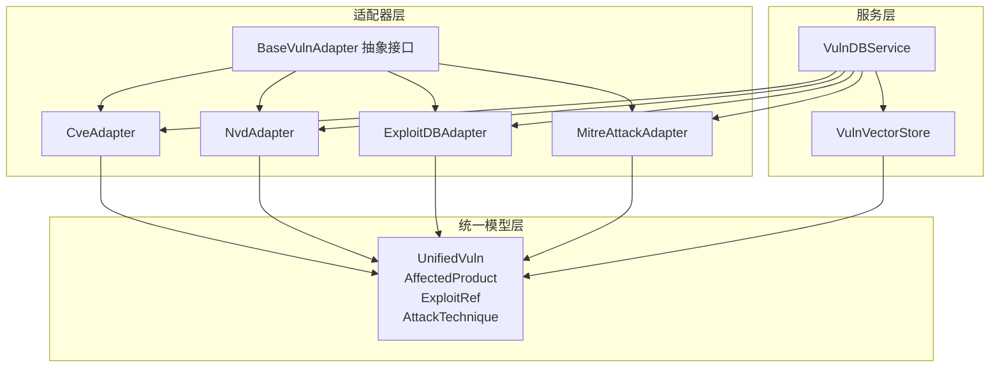
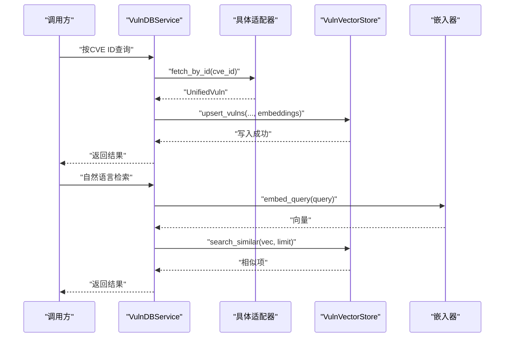
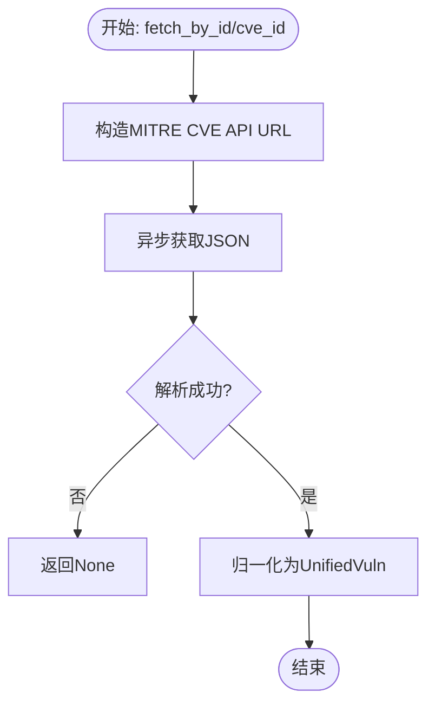
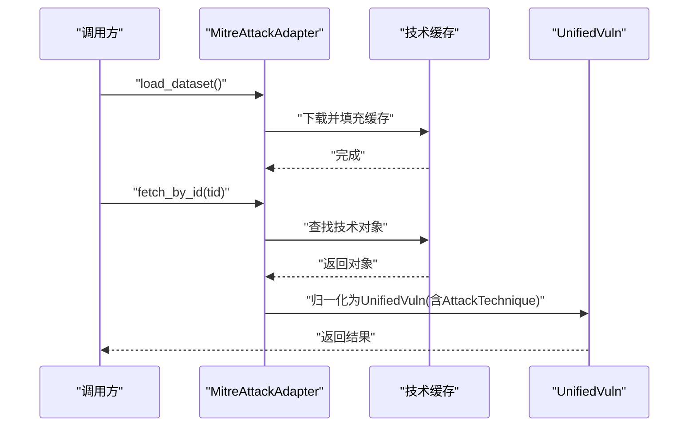
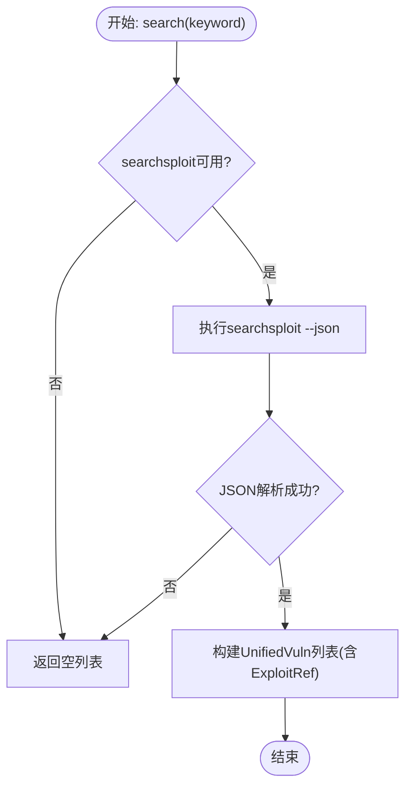
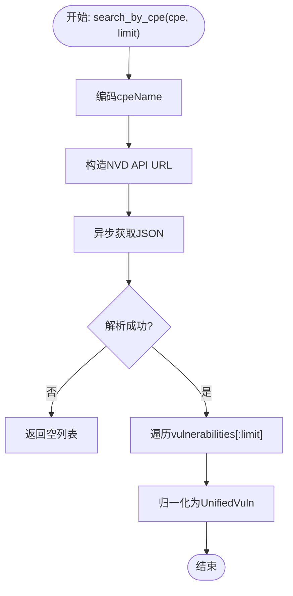
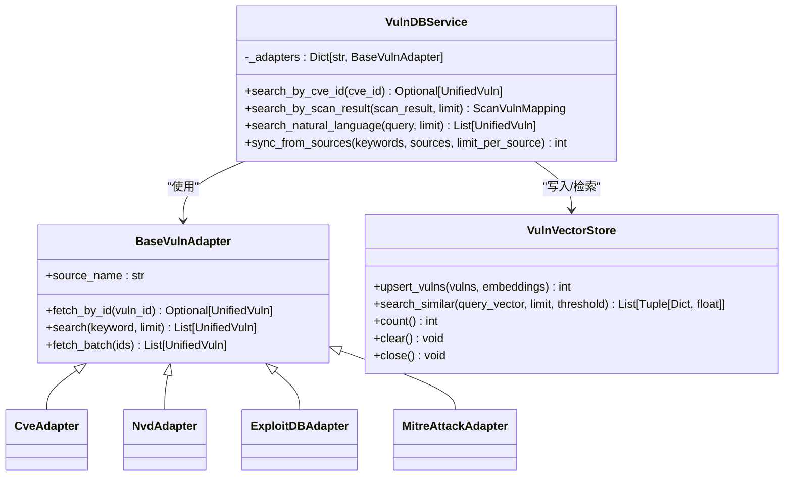

# 数据适配器系统

<cite>
**本文档引用的文件**
- [core/vuln_db/adapters/base_adapter.py](file://core/vuln_db/adapters/base_adapter.py)
- [core/vuln_db/adapters/cve_adapter.py](file://core/vuln_db/adapters/cve_adapter.py)
- [core/vuln_db/adapters/mitre_adapter.py](file://core/vuln_db/adapters/mitre_adapter.py)
- [core/vuln_db/adapters/exploit_db_adapter.py](file://core/vuln_db/adapters/exploit_db_adapter.py)
- [core/vuln_db/adapters/nvd_adapter.py](file://core/vuln_db/adapters/nvd_adapter.py)
- [core/vuln_db/adapters/__init__.py](file://core/vuln_db/adapters/__init__.py)
- [core/vuln_db/schema.py](file://core/vuln_db/schema.py)
- [core/vuln_db/vuln_db_service.py](file://core/vuln_db/vuln_db_service.py)
- [core/vuln_db/vuln_vector_store.py](file://core/vuln_db/vuln_vector_store.py)
- [scanner/vulnerability_scanner.py](file://scanner/vulnerability_scanner.py)
</cite>

## 目录
1. [简介](#简介)
2. [项目结构](#项目结构)
3. [核心组件](#核心组件)
4. [架构总览](#架构总览)
5. [详细组件分析](#详细组件分析)
6. [依赖关系分析](#依赖关系分析)
7. [性能考量](#性能考量)
8. [故障排查指南](#故障排查指南)
9. [结论](#结论)
10. [附录：新适配器开发指南](#附录新适配器开发指南)

## 简介
本文件面向Secbot的漏洞数据适配器系统，系统性阐述适配器模式的设计理念与实现架构，涵盖统一接口设计、异常处理与数据质量保障策略，并深入解析各具体适配器（CVE、MITRE ATT&CK、Exploit-DB、NVD）的功能与实现细节。同时提供新适配器的开发指南与最佳实践，帮助开发者快速扩展与维护漏洞数据源。

## 项目结构
漏洞数据适配器系统位于core/vuln_db目录下，采用“适配器+统一模型+向量检索”的分层架构：
- 适配器层：定义统一抽象接口，各具体适配器负责对接不同漏洞数据源
- 统一模型层：定义UnifiedVuln及关联数据结构，确保多源数据归一化
- 服务层：整合适配器与向量检索，提供统一查询与匹配能力
- 向量存储层：封装SQLite向量库，支持embedding写入与相似度检索

图表来源
- [core/vuln_db/adapters/base_adapter.py](file://core/vuln_db/adapters/base_adapter.py#L8-L32)
- [core/vuln_db/adapters/cve_adapter.py](file://core/vuln_db/adapters/cve_adapter.py#L36-L155)
- [core/vuln_db/adapters/nvd_adapter.py](file://core/vuln_db/adapters/nvd_adapter.py#L37-L214)
- [core/vuln_db/adapters/exploit_db_adapter.py](file://core/vuln_db/adapters/exploit_db_adapter.py#L24-L117)
- [core/vuln_db/adapters/mitre_adapter.py](file://core/vuln_db/adapters/mitre_adapter.py#L27-L151)
- [core/vuln_db/schema.py](file://core/vuln_db/schema.py#L68-L140)
- [core/vuln_db/vuln_db_service.py](file://core/vuln_db/vuln_db_service.py#L27-L275)
- [core/vuln_db/vuln_vector_store.py](file://core/vuln_db/vuln_vector_store.py#L18-L107)

章节来源
- [core/vuln_db/adapters/__init__.py](file://core/vuln_db/adapters/__init__.py#L1-L15)
- [core/vuln_db/schema.py](file://core/vuln_db/schema.py#L1-L140)
- [core/vuln_db/vuln_db_service.py](file://core/vuln_db/vuln_db_service.py#L1-L275)
- [core/vuln_db/vuln_vector_store.py](file://core/vuln_db/vuln_vector_store.py#L1-L107)

## 核心组件
- 适配器基类：定义统一接口，包括按ID获取、关键词搜索、批量获取等方法，确保多源一致性
- 统一模型：UnifiedVuln作为归一化载体，包含漏洞标识、来源、描述、受影响软件、严重性、CVSS评分、引用、标签、时间戳等字段，并提供构建embedding文本与摘要的方法
- 服务层：VulnDBService整合多适配器与向量检索，提供按CVE ID精确查询、扫描结果匹配、自然语言语义检索、多源同步等功能
- 向量存储：VulnVectorStore封装SQLite向量库，支持embedding写入、相似度检索、统计与清理

章节来源
- [core/vuln_db/adapters/base_adapter.py](file://core/vuln_db/adapters/base_adapter.py#L8-L32)
- [core/vuln_db/schema.py](file://core/vuln_db/schema.py#L68-L140)
- [core/vuln_db/vuln_db_service.py](file://core/vuln_db/vuln_db_service.py#L27-L275)
- [core/vuln_db/vuln_vector_store.py](file://core/vuln_db/vuln_vector_store.py#L18-L107)

## 架构总览
适配器系统遵循“适配器模式 + 统一模型 + 向量检索”的架构，通过抽象接口屏蔽不同数据源差异，统一输出结构化数据；服务层负责编排与调度，向量存储提供高效检索能力。

图表来源
- [core/vuln_db/vuln_db_service.py](file://core/vuln_db/vuln_db_service.py#L79-L184)
- [core/vuln_db/vuln_vector_store.py](file://core/vuln_db/vuln_vector_store.py#L72-L93)
- [core/vuln_db/adapters/base_adapter.py](file://core/vuln_db/adapters/base_adapter.py#L13-L21)

## 详细组件分析

### 基础适配器类（BaseVulnAdapter）
- 设计理念：通过抽象接口约束所有适配器必须实现按ID获取与关键词搜索两个核心方法；提供批量获取默认实现，子类可覆盖以优化性能
- 关键方法
  - fetch_by_id(vuln_id): 异步按ID获取漏洞详情
  - search(keyword, limit): 异步关键词搜索，返回统一模型列表
  - fetch_batch(ids): 默认逐条调用fetch_by_id，子类可重写以并发优化
- 统一属性：source_name用于标识数据源名称

章节来源
- [core/vuln_db/adapters/base_adapter.py](file://core/vuln_db/adapters/base_adapter.py#L8-L32)

### CVE适配器（CveAdapter）
- 数据源：MITRE CVE API（cveawg.mitre.org）
- 功能要点
  - 按CVE ID获取：构造URL并调用异步JSON获取，解析后归一化为UnifiedVuln
  - 关键词搜索：支持编码关键字与限制返回数量，遍历结果并逐条归一化
  - 归一化流程：提取元数据、描述、CVSS评分与向量、受影响产品、引用、发布日期、状态等
  - 异常处理：网络请求失败与解析异常均进行日志记录并返回None/空列表
- 性能特性：使用线程池执行阻塞HTTP请求，避免阻塞事件循环

图表来源
- [core/vuln_db/adapters/cve_adapter.py](file://core/vuln_db/adapters/cve_adapter.py#L45-L50)
- [core/vuln_db/adapters/cve_adapter.py](file://core/vuln_db/adapters/cve_adapter.py#L76-L82)
- [core/vuln_db/adapters/cve_adapter.py](file://core/vuln_db/adapters/cve_adapter.py#L91-L155)

章节来源
- [core/vuln_db/adapters/cve_adapter.py](file://core/vuln_db/adapters/cve_adapter.py#L1-L155)

### MITRE适配器（MitreAttackAdapter）
- 数据源：MITRE ATT&CK Enterprise矩阵（GitHub仓库JSON）
- 功能要点
  - 预加载：首次使用时下载并缓存Enterprise矩阵，建立技术ID到对象的映射
  - 按技术ID获取：直接从缓存中查找并归一化为包含AttackTechnique的UnifiedVuln
  - 关键词搜索：遍历缓存，匹配名称、描述与技术ID
  - 技术查询：按战术获取技术列表，便于后续映射
  - 归一化流程：提取名称、描述、平台与战术标签、外部引用链接、ATT&CK技术对象
- 性能特性：缓存机制减少重复下载，搜索阶段避免在线请求

图表来源
- [core/vuln_db/adapters/mitre_adapter.py](file://core/vuln_db/adapters/mitre_adapter.py#L38-L58)
- [core/vuln_db/adapters/mitre_adapter.py](file://core/vuln_db/adapters/mitre_adapter.py#L67-L75)
- [core/vuln_db/adapters/mitre_adapter.py](file://core/vuln_db/adapters/mitre_adapter.py#L110-L133)

章节来源
- [core/vuln_db/adapters/mitre_adapter.py](file://core/vuln_db/adapters/mitre_adapter.py#L1-L151)

### Exploit-DB适配器（ExploitDBAdapter）
- 数据源：本地searchsploit命令（需安装exploitdb包）或在线API/GitLab CSV（注释说明）
- 功能要点
  - 可用性检测：通过系统PATH检测searchsploit是否存在
  - 按EDB-ID获取：调用searchsploit --json --edb <id>，解析输出为UnifiedVuln
  - 关键词搜索：调用searchsploit --json <keyword>，解析并构建ExploitRef列表
  - 归一化流程：提取标题、发布日期、平台、类型、验证标记、引用链接等
  - 异常处理：执行失败或JSON解析失败时记录警告并返回空结果
- 性能特性：通过子进程执行searchsploit，超时控制与错误捕获

图表来源
- [core/vuln_db/adapters/exploit_db_adapter.py](file://core/vuln_db/adapters/exploit_db_adapter.py#L47-L51)
- [core/vuln_db/adapters/exploit_db_adapter.py](file://core/vuln_db/adapters/exploit_db_adapter.py#L54-L73)
- [core/vuln_db/adapters/exploit_db_adapter.py](file://core/vuln_db/adapters/exploit_db_adapter.py#L75-L117)

章节来源
- [core/vuln_db/adapters/exploit_db_adapter.py](file://core/vuln_db/adapters/exploit_db_adapter.py#L1-L117)

### NVD适配器（NvdAdapter）
- 数据源：NVD 2.0 REST API（支持API Key）
- 功能要点
  - 按CVE ID获取：构造带cveId参数的URL，解析vulnerabilities数组并归一化
  - 关键词搜索：支持keywordSearch与cpeName检索，限制每页数量
  - 归一化流程：提取英文描述、多版本CVSS评分、受影响CPE产品、CWE标签、引用、Exploit标记、发布时间与修改时间
  - 异常处理：网络请求失败与解析异常均记录警告并返回None/空列表
- 性能特性：支持API Key认证，线程池执行阻塞HTTP请求

图表来源
- [core/vuln_db/adapters/nvd_adapter.py](file://core/vuln_db/adapters/nvd_adapter.py#L74-L86)
- [core/vuln_db/adapters/nvd_adapter.py](file://core/vuln_db/adapters/nvd_adapter.py#L89-L95)
- [core/vuln_db/adapters/nvd_adapter.py](file://core/vuln_db/adapters/nvd_adapter.py#L106-L204)

章节来源
- [core/vuln_db/adapters/nvd_adapter.py](file://core/vuln_db/adapters/nvd_adapter.py#L1-L214)

### 统一模型（UnifiedVuln）
- 数据结构：包含漏洞标识、来源、标题、描述、受影响软件、严重性、CVSS评分与向量、可利用引用、ATT&CK技术、缓解措施、引用、标签、时间戳、原始数据等
- 关键方法
  - build_embedding_text：拼接用于向量化的文本，包含ID、标题、描述、受影响软件、Exploit标题、ATT&CK技术、严重性、CVSS分数、标签等
  - to_summary：生成人类可读摘要，便于展示
- 作用：作为多数据源归一化后的标准载体，支撑向量检索与上层应用

章节来源
- [core/vuln_db/schema.py](file://core/vuln_db/schema.py#L68-L140)

### 服务层（VulnDBService）
- 职责：整合多适配器与向量检索，提供统一查询与匹配能力
- 核心功能
  - 按CVE ID精确查询：优先尝试NVD/CVE适配器，命中后写入向量库
  - 扫描结果匹配：结合向量检索、正则提取CVE ID、在线关键词搜索，返回匹配结果与最高相似度
  - 自然语言检索：向量检索+在线补充，支持CVE ID提取增强
  - 多源同步：按关键词从指定数据源批量拉取并写入向量库
- 异常处理：适配器调用异常与嵌入器失败均记录警告并回退为空向量
- 生命周期：提供统计信息与关闭资源

章节来源
- [core/vuln_db/vuln_db_service.py](file://core/vuln_db/vuln_db_service.py#L27-L275)

### 向量存储层（VulnVectorStore）
- 职责：封装SQLite向量库，提供漏洞embedding写入与相似度检索
- 核心能力
  - upsert_vulns：将漏洞与对应embedding写入向量库，返回写入数量
  - search_similar：向量相似度检索，返回元数据与相似度分数
  - 统计与清理：提供计数、清空集合、关闭连接等辅助方法

章节来源
- [core/vuln_db/vuln_vector_store.py](file://core/vuln_db/vuln_vector_store.py#L18-L107)

## 依赖关系分析
- 适配器依赖关系：所有具体适配器继承自BaseVulnAdapter，统一实现按ID获取与关键词搜索
- 服务层依赖关系：VulnDBService聚合多种适配器实例，依赖向量存储与嵌入器
- 统一模型依赖关系：适配器输出与服务层输入均为UnifiedVuln及其子结构
- 外部依赖：HTTP请求、JSON解析、子进程执行searchsploit、嵌入器（OllamaEmbeddings）

图表来源
- [core/vuln_db/adapters/base_adapter.py](file://core/vuln_db/adapters/base_adapter.py#L8-L32)
- [core/vuln_db/adapters/cve_adapter.py](file://core/vuln_db/adapters/cve_adapter.py#L36-L155)
- [core/vuln_db/adapters/nvd_adapter.py](file://core/vuln_db/adapters/nvd_adapter.py#L37-L214)
- [core/vuln_db/adapters/exploit_db_adapter.py](file://core/vuln_db/adapters/exploit_db_adapter.py#L24-L117)
- [core/vuln_db/adapters/mitre_adapter.py](file://core/vuln_db/adapters/mitre_adapter.py#L27-L151)
- [core/vuln_db/vuln_db_service.py](file://core/vuln_db/vuln_db_service.py#L27-L275)
- [core/vuln_db/vuln_vector_store.py](file://core/vuln_db/vuln_vector_store.py#L18-L107)

章节来源
- [core/vuln_db/adapters/__init__.py](file://core/vuln_db/adapters/__init__.py#L1-L15)
- [core/vuln_db/schema.py](file://core/vuln_db/schema.py#L1-L140)
- [core/vuln_db/vuln_db_service.py](file://core/vuln_db/vuln_db_service.py#L1-L275)
- [core/vuln_db/vuln_vector_store.py](file://core/vuln_db/vuln_vector_store.py#L1-L107)

## 性能考量
- 并发与阻塞：适配器普遍使用线程池执行阻塞HTTP请求，避免阻塞事件循环，提升吞吐
- 缓存策略：MITRE适配器预加载Enterprise矩阵，显著降低重复下载成本
- 向量检索：服务层在向量库存在时优先进行相似度检索，减少在线请求次数
- 限流与超时：各适配器设置合理超时，防止长时间阻塞
- 回退机制：嵌入器失败时回退为空向量，保证系统稳定性

[本节为通用性能讨论，无需列出具体文件来源]

## 故障排查指南
- CVE适配器
  - 现象：按ID获取返回None或搜索为空
  - 排查：检查网络连通性、MITRE API可达性、日志中的警告信息
  - 参考路径：[core/vuln_db/adapters/cve_adapter.py](file://core/vuln_db/adapters/cve_adapter.py#L76-L82)
- NVD适配器
  - 现象：请求失败或解析异常
  - 排查：确认API Key配置、网络超时设置、日志警告
  - 参考路径：[core/vuln_db/adapters/nvd_adapter.py](file://core/vuln_db/adapters/nvd_adapter.py#L89-L95)
- Exploit-DB适配器
  - 现象：searchsploit不可用或执行失败
  - 排查：确认searchsploit已安装且在PATH中、执行权限、超时设置
  - 参考路径：[core/vuln_db/adapters/exploit_db_adapter.py](file://core/vuln_db/adapters/exploit_db_adapter.py#L29-L34)
- MITRE适配器
  - 现象：预加载失败或缓存为空
  - 排查：检查GitHub网络、JSON解析、缓存状态
  - 参考路径：[core/vuln_db/adapters/mitre_adapter.py](file://core/vuln_db/adapters/mitre_adapter.py#L38-L58)
- 服务层
  - 现象：嵌入器失败或向量检索无结果
  - 排查：检查嵌入器初始化、日志警告、向量库状态
  - 参考路径：[core/vuln_db/vuln_db_service.py](file://core/vuln_db/vuln_db_service.py#L52-L74)

章节来源
- [core/vuln_db/adapters/cve_adapter.py](file://core/vuln_db/adapters/cve_adapter.py#L76-L82)
- [core/vuln_db/adapters/nvd_adapter.py](file://core/vuln_db/adapters/nvd_adapter.py#L89-L95)
- [core/vuln_db/adapters/exploit_db_adapter.py](file://core/vuln_db/adapters/exploit_db_adapter.py#L29-L34)
- [core/vuln_db/adapters/mitre_adapter.py](file://core/vuln_db/adapters/mitre_adapter.py#L38-L58)
- [core/vuln_db/vuln_db_service.py](file://core/vuln_db/vuln_db_service.py#L52-L74)

## 结论
Secbot的漏洞数据适配器系统通过统一接口与归一化模型，有效屏蔽了不同数据源的差异，结合向量检索实现了高效的漏洞查询与匹配能力。各适配器在异常处理与性能优化方面均有明确策略，服务层提供了灵活的编排能力。整体架构清晰、扩展性强，适合持续演进与新数据源接入。

[本节为总结性内容，无需列出具体文件来源]

## 附录：新适配器开发指南
- 设计原则
  - 继承BaseVulnAdapter，实现fetch_by_id与search方法
  - 输出统一为UnifiedVuln，确保字段完整性与可选字段的合理处理
  - 使用线程池执行阻塞I/O，避免阻塞事件循环
  - 明确异常处理与日志记录，提供合理的超时与重试策略
- 开发步骤
  - 定义适配器类与source_name
  - 实现fetch_by_id：构造URL、获取JSON、解析并归一化
  - 实现search：支持关键词搜索，限制返回数量，逐条归一化
  - 可选：实现fetch_batch以优化批量获取性能
  - 注册到适配器导出清单与服务层适配器字典
- 最佳实践
  - 缓存静态数据（如MITRE矩阵），减少重复下载
  - 控制请求频率与并发度，遵守数据源速率限制
  - 保持归一化逻辑健壮，对缺失字段进行默认值处理
  - 提供可用性检测与降级策略（如searchsploit不可用时的提示）
  - 单元测试与集成测试覆盖关键路径与异常分支

章节来源
- [core/vuln_db/adapters/base_adapter.py](file://core/vuln_db/adapters/base_adapter.py#L8-L32)
- [core/vuln_db/adapters/__init__.py](file://core/vuln_db/adapters/__init__.py#L1-L15)
- [core/vuln_db/vuln_db_service.py](file://core/vuln_db/vuln_db_service.py#L39-L44)