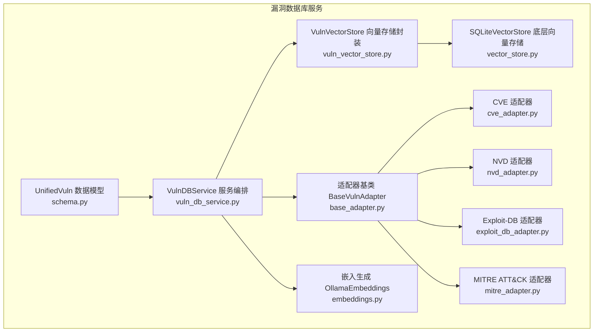
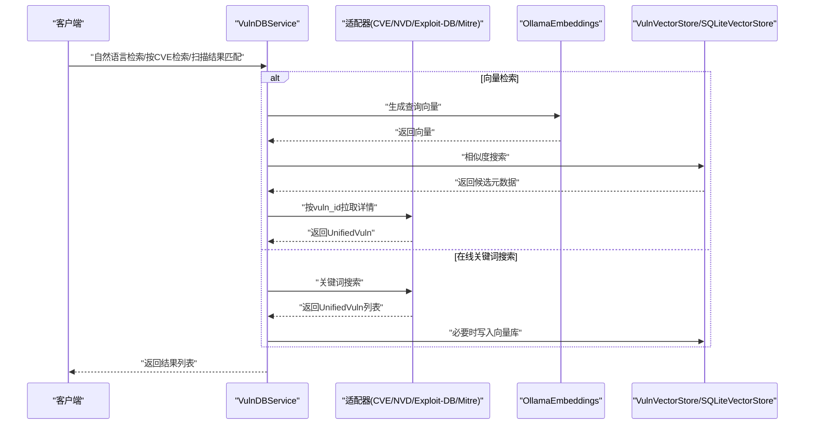
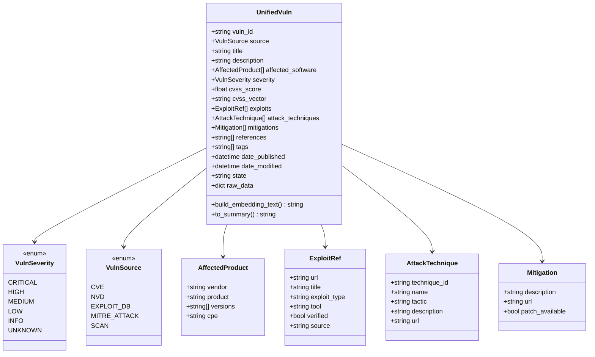
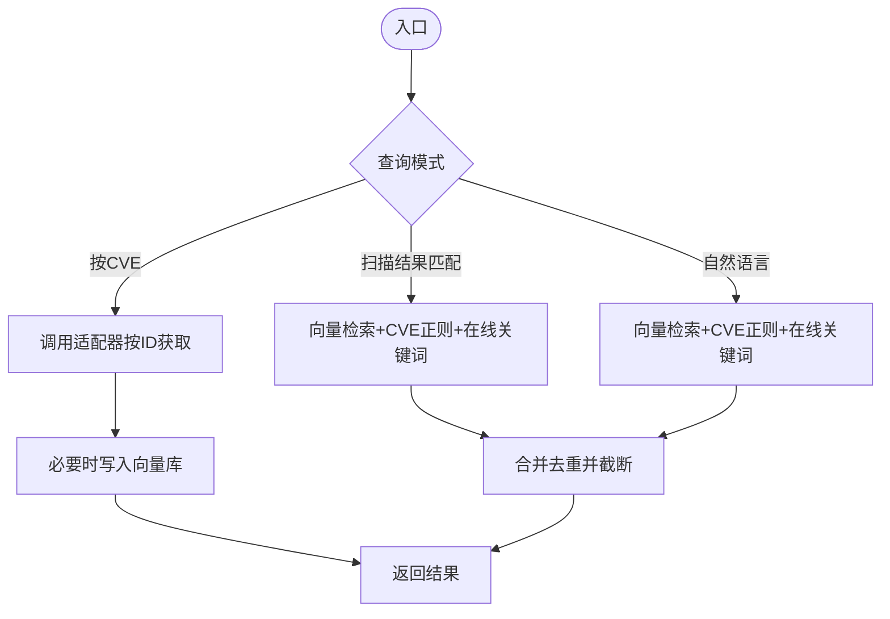
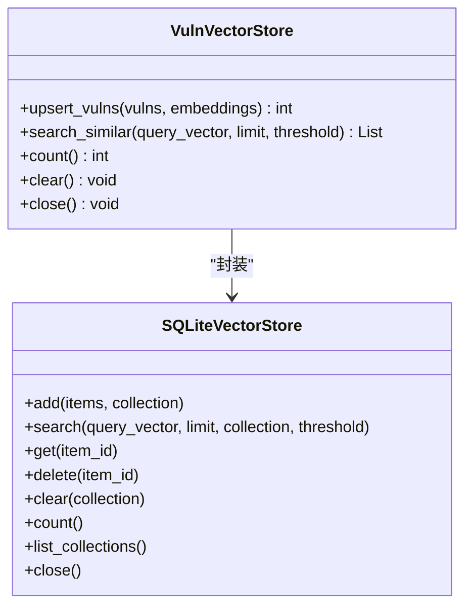
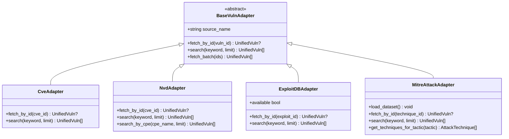
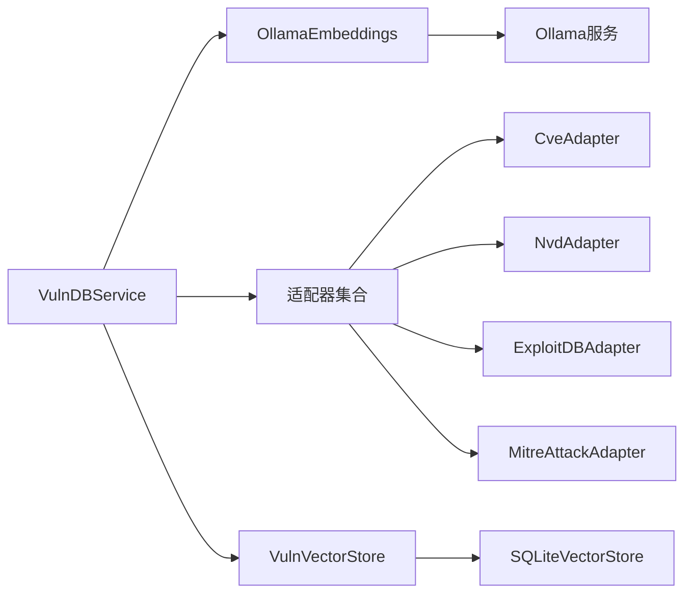

# 漏洞数据库服务

<cite>
**本文引用的文件**
- [schema.py](file://core/vuln_db/schema.py)
- [vuln_db_service.py](file://core/vuln_db/vuln_db_service.py)
- [vuln_vector_store.py](file://core/vuln_db/vuln_vector_store.py)
- [base_adapter.py](file://core/vuln_db/adapters/base_adapter.py)
- [cve_adapter.py](file://core/vuln_db/adapters/cve_adapter.py)
- [nvd_adapter.py](file://core/vuln_db/adapters/nvd_adapter.py)
- [exploit_db_adapter.py](file://core/vuln_db/adapters/exploit_db_adapter.py)
- [mitre_adapter.py](file://core/vuln_db/adapters/mitre_adapter.py)
- [vector_store.py](file://core/memory/vector_store.py)
- [embeddings.py](file://utils/embeddings.py)
- [database.py](file://router/database.py)
- [models.py](file://database/models.py)
- [__init__.py](file://hackbot_config/__init__.py)
</cite>

## 目录
1. [简介](#简介)
2. [项目结构](#项目结构)
3. [核心组件](#核心组件)
4. [架构总览](#架构总览)
5. [详细组件分析](#详细组件分析)
6. [依赖分析](#依赖分析)
7. [性能考虑](#性能考虑)
8. [故障排查指南](#故障排查指南)
9. [结论](#结论)
10. [附录](#附录)

## 简介
本文件面向Secbot的漏洞数据库服务，系统性阐述其核心功能与实现细节，包括：
- 数据的增删改查与批量导入导出能力
- 多源数据同步与增量更新机制
- 查询接口设计：关键词搜索、条件过滤、排序与分页
- 数据缓存策略、并发控制与事务管理
- 性能优化建议：索引优化、查询优化与内存管理
- 实际使用示例与API调用方法

该服务以统一的数据模型为核心，集成多数据源适配器，并通过向量检索提供自然语言语义搜索能力，支撑扫描结果自动匹配与知识增强。

## 项目结构
漏洞数据库服务位于core/vuln_db目录，围绕统一数据模型、适配器、向量存储与服务编排展开；底层向量检索由core/memory/vector_store提供的SQLite向量存储实现。

图表来源
- [schema.py](file://core/vuln_db/schema.py#L68-L140)
- [vuln_db_service.py](file://core/vuln_db/vuln_db_service.py#L27-L275)
- [vuln_vector_store.py](file://core/vuln_db/vuln_vector_store.py#L18-L107)
- [vector_store.py](file://core/memory/vector_store.py#L30-L297)
- [base_adapter.py](file://core/vuln_db/adapters/base_adapter.py#L8-L33)
- [cve_adapter.py](file://core/vuln_db/adapters/cve_adapter.py#L36-L155)
- [nvd_adapter.py](file://core/vuln_db/adapters/nvd_adapter.py#L37-L214)
- [exploit_db_adapter.py](file://core/vuln_db/adapters/exploit_db_adapter.py#L24-L117)
- [mitre_adapter.py](file://core/vuln_db/adapters/mitre_adapter.py#L27-L151)
- [embeddings.py](file://utils/embeddings.py#L11-L80)

章节来源
- [schema.py](file://core/vuln_db/schema.py#L1-L140)
- [vuln_db_service.py](file://core/vuln_db/vuln_db_service.py#L1-L275)
- [vuln_vector_store.py](file://core/vuln_db/vuln_vector_store.py#L1-L107)
- [vector_store.py](file://core/memory/vector_store.py#L1-L297)
- [base_adapter.py](file://core/vuln_db/adapters/base_adapter.py#L1-L33)
- [cve_adapter.py](file://core/vuln_db/adapters/cve_adapter.py#L1-L155)
- [nvd_adapter.py](file://core/vuln_db/adapters/nvd_adapter.py#L1-L214)
- [exploit_db_adapter.py](file://core/vuln_db/adapters/exploit_db_adapter.py#L1-L117)
- [mitre_adapter.py](file://core/vuln_db/adapters/mitre_adapter.py#L1-L151)
- [embeddings.py](file://utils/embeddings.py#L1-L80)

## 核心组件
- 统一数据模型：定义漏洞实体、严重性、来源、受影响产品、Exploit引用、MITRE技术、缓解措施等字段，并提供构建embedding文本与摘要的方法。
- 服务编排：VulnDBService负责适配器注册、嵌入生成、向量检索、多源同步、扫描结果匹配与自然语言检索。
- 向量存储：VulnVectorStore对SQLiteVectorStore进行业务封装，提供upsert、相似度检索、统计与清理。
- 适配器：BaseVulnAdapter定义抽象接口，具体适配器实现CVE、NVD、Exploit-DB、MITRE ATT&CK的数据拉取与归一化。
- 嵌入生成：OllamaEmbeddings通过HTTP客户端调用Ollama服务生成文本向量。
- 路由与模型：FastAPI路由提供数据库统计与历史接口；数据库模型定义对话、任务等结构。

章节来源
- [schema.py](file://core/vuln_db/schema.py#L68-L140)
- [vuln_db_service.py](file://core/vuln_db/vuln_db_service.py#L27-L275)
- [vuln_vector_store.py](file://core/vuln_db/vuln_vector_store.py#L18-L107)
- [base_adapter.py](file://core/vuln_db/adapters/base_adapter.py#L8-L33)
- [embeddings.py](file://utils/embeddings.py#L11-L80)
- [database.py](file://router/database.py#L1-L91)
- [models.py](file://database/models.py#L1-L90)

## 架构总览
服务采用“适配器+向量检索”的双通道架构：
- 多源适配器负责从公开数据源抓取并归一化为统一模型；
- 向量检索层负责将统一模型文本向量化并建立ANN索引，支持语义相似度检索；
- 服务编排层协调两者，提供精确查询、扫描结果匹配、自然语言检索与多源同步。

图表来源
- [vuln_db_service.py](file://core/vuln_db/vuln_db_service.py#L79-L184)
- [embeddings.py](file://utils/embeddings.py#L18-L70)
- [vuln_vector_store.py](file://core/vuln_db/vuln_vector_store.py#L72-L93)
- [vector_store.py](file://core/memory/vector_store.py#L124-L175)
- [cve_adapter.py](file://core/vuln_db/adapters/cve_adapter.py#L52-L73)
- [nvd_adapter.py](file://core/vuln_db/adapters/nvd_adapter.py#L57-L86)
- [exploit_db_adapter.py](file://core/vuln_db/adapters/exploit_db_adapter.py#L47-L51)
- [mitre_adapter.py](file://core/vuln_db/adapters/mitre_adapter.py#L77-L92)

## 详细组件分析

### 统一数据模型（UnifiedVuln）
- 字段覆盖：标识、来源、标题、描述、受影响软件、严重性、CVSS分数/向量、Exploit引用、MITRE技术、缓解措施、引用链接、标签、发布时间/修改时间、状态、原始数据等。
- 能力：
  - 构建embedding文本：聚合关键字段形成可向量化文本。
  - 生成摘要：面向人类可读的简要信息。
- 设计要点：通过枚举类型约束严重性与来源，保证跨数据源一致性。

图表来源
- [schema.py](file://core/vuln_db/schema.py#L15-L140)

章节来源
- [schema.py](file://core/vuln_db/schema.py#L1-L140)

### 服务编排（VulnDBService）
- 初始化：注册适配器（CVE、NVD、Exploit-DB、MITRE），延迟初始化嵌入器，配置向量存储。
- 查询接口：
  - 按CVE ID精确查询：优先NVD/CVE适配器，命中后写入向量库。
  - 扫描结果匹配：先向量检索，再提取描述中的CVE，最后在线关键词搜索补充。
  - 自然语言检索：向量检索+在线关键词搜索+按CVE正则召回。
- 同步与更新：按关键词从目标数据源批量抓取，去重后写入向量库。
- 统计与生命周期：统计向量数量、适配器列表，关闭向量存储连接。

图表来源
- [vuln_db_service.py](file://core/vuln_db/vuln_db_service.py#L79-L184)
- [vuln_db_service.py](file://core/vuln_db/vuln_db_service.py#L190-L222)
- [vuln_db_service.py](file://core/vuln_db/vuln_db_service.py#L228-L261)

章节来源
- [vuln_db_service.py](file://core/vuln_db/vuln_db_service.py#L1-L275)

### 向量存储（VulnVectorStore 与 SQLiteVectorStore）
- VulnVectorStore：
  - upsert_vulns：将漏洞与向量写入，元数据包含vuln_id、source、severity、cvss_score、title、description片段、tags等。
  - search_similar：基于ANN或余弦相似度检索，返回元数据与相似度。
  - count/clear/close：统计、清空集合、关闭连接。
- SQLiteVectorStore：
  - 基于sqlite-vec/sqlite-vss实现ANN索引；若不可用则回退为纯量计算（余弦相似度）。
  - 支持add/search/get/delete/clear/count/list_collections等基础操作。

图表来源
- [vuln_vector_store.py](file://core/vuln_db/vuln_vector_store.py#L18-L107)
- [vector_store.py](file://core/memory/vector_store.py#L30-L297)

章节来源
- [vuln_vector_store.py](file://core/vuln_db/vuln_vector_store.py#L1-L107)
- [vector_store.py](file://core/memory/vector_store.py#L1-L297)

### 适配器（BaseVulnAdapter 及其实现）
- BaseVulnAdapter：定义fetch_by_id、search抽象方法，提供默认的批量获取实现。
- CVE适配器：对接MITRE CVE API，解析并归一化为UnifiedVuln。
- NVD适配器：对接NVD 2.0 API，支持按关键字、CPE名称检索，解析CVSS与CWE。
- Exploit-DB适配器：通过本地searchsploit命令行工具获取Exploit-DB条目。
- MITRE ATT&CK适配器：下载Enterprise Attack JSON，构建攻击技术映射。

图表来源
- [base_adapter.py](file://core/vuln_db/adapters/base_adapter.py#L8-L33)
- [cve_adapter.py](file://core/vuln_db/adapters/cve_adapter.py#L36-L155)
- [nvd_adapter.py](file://core/vuln_db/adapters/nvd_adapter.py#L37-L214)
- [exploit_db_adapter.py](file://core/vuln_db/adapters/exploit_db_adapter.py#L24-L117)
- [mitre_adapter.py](file://core/vuln_db/adapters/mitre_adapter.py#L27-L151)

章节来源
- [base_adapter.py](file://core/vuln_db/adapters/base_adapter.py#L1-L33)
- [cve_adapter.py](file://core/vuln_db/adapters/cve_adapter.py#L1-L155)
- [nvd_adapter.py](file://core/vuln_db/adapters/nvd_adapter.py#L1-L214)
- [exploit_db_adapter.py](file://core/vuln_db/adapters/exploit_db_adapter.py#L1-L117)
- [mitre_adapter.py](file://core/vuln_db/adapters/mitre_adapter.py#L1-L151)

### 嵌入生成（OllamaEmbeddings）
- 通过HTTP客户端调用Ollama服务生成文本向量，支持单条与批量。
- 错误处理：连接异常与空向量返回时抛出异常或回退为空向量（在服务层体现）。

章节来源
- [embeddings.py](file://utils/embeddings.py#L1-L80)

### 路由与模型（数据库统计与历史）
- FastAPI路由提供数据库统计与对话历史接口，便于前端展示与运维监控。
- 数据库模型定义对话、任务、审计等结构，支撑系统运行与审计留痕。

章节来源
- [database.py](file://router/database.py#L1-L91)
- [models.py](file://database/models.py#L1-L90)

## 依赖分析
- 低耦合高内聚：适配器通过统一接口与服务编排解耦；向量存储对上层屏蔽底层实现差异。
- 外部依赖：
  - Ollama服务：用于文本向量化。
  - 公开API：CVE、NVD、MITRE ATT&CK等。
  - 本地工具：Exploit-DB的searchsploit命令行工具。
- 配置管理：通过hackbot_config.settings集中管理Ollama地址、模型等参数。

图表来源
- [vuln_db_service.py](file://core/vuln_db/vuln_db_service.py#L27-L47)
- [embeddings.py](file://utils/embeddings.py#L14-L16)
- [vuln_vector_store.py](file://core/vuln_db/vuln_vector_store.py#L23-L29)
- [vector_store.py](file://core/memory/vector_store.py#L33-L37)
- [cve_adapter.py](file://core/vuln_db/adapters/cve_adapter.py#L36-L42)
- [nvd_adapter.py](file://core/vuln_db/adapters/nvd_adapter.py#L37-L44)
- [exploit_db_adapter.py](file://core/vuln_db/adapters/exploit_db_adapter.py#L24-L31)
- [mitre_adapter.py](file://core/vuln_db/adapters/mitre_adapter.py#L27-L35)

章节来源
- [__init__.py](file://hackbot_config/__init__.py#L162-L246)

## 性能考虑
- 向量检索性能
  - ANN索引：优先启用sqlite-vec/sqlite-vss；若不可用则回退纯量计算，性能下降明显。
  - 相似度阈值与limit：根据业务需求调整阈值与返回数量，减少下游处理压力。
- 文本向量化
  - 批量嵌入：服务层批量生成向量，降低网络往返次数。
  - 回退策略：嵌入失败时使用零向量，保障流程可用性但可能影响检索质量。
- 数据同步与去重
  - 同步阶段使用集合去重，避免重复入库与向量化。
  - 分批限制每源抓取数量，平衡吞吐与新鲜度。
- I/O与索引
  - SQLite写入使用OR REPLACE，注意磁盘IO；建议在空闲时段进行大批量同步。
  - 若频繁写入，可考虑拆分集合或定期重建索引。
- 并发与事务
  - SQLite为文件型数据库，适合单进程写入；多进程写入需外部锁或队列串行化。
  - 建议在服务层对批量写入加互斥，避免竞态。
- 内存管理
  - 控制批量大小与向量维度，避免峰值内存过高。
  - 对超长描述与标签做截断，减少序列化与传输开销。

[本节为通用性能建议，不直接分析具体代码文件]

## 故障排查指南
- 嵌入服务不可达
  - 现象：向量化失败，日志出现连接错误。
  - 排查：确认Ollama服务地址与模型配置正确；检查网络连通性。
- 向量检索性能差
  - 现象：相似度检索耗时较长。
  - 排查：确认sqlite-vec已安装；检查向量维度与阈值设置。
- Exploit-DB不可用
  - 现象：searchsploit未安装导致查询为空。
  - 排查：安装exploitdb包并确保searchsploit命令可用。
- NVD API受限
  - 现象：NVD请求失败或返回空。
  - 排查：配置NVD API Key；检查请求频率与关键字编码。
- 数据库统计与历史接口异常
  - 现象：/api/db/stats 或 /api/db/history 返回500。
  - 排查：检查数据库连接、权限与表结构；查看后端日志定位异常。

章节来源
- [embeddings.py](file://utils/embeddings.py#L63-L70)
- [vector_store.py](file://core/memory/vector_store.py#L80-L89)
- [exploit_db_adapter.py](file://core/vuln_db/adapters/exploit_db_adapter.py#L32-L34)
- [nvd_adapter.py](file://core/vuln_db/adapters/nvd_adapter.py#L89-L95)
- [database.py](file://router/database.py#L34-L35)

## 结论
漏洞数据库服务通过统一数据模型与多源适配器，结合向量检索实现了从公开数据源到结构化知识的高效转换与检索。服务层提供了灵活的查询与同步能力，配合向量存储的ANN索引与回退策略，在性能与可用性之间取得平衡。建议在生产环境中完善并发控制、索引维护与监控告警，持续优化嵌入模型与阈值配置，以获得更佳的检索效果与稳定性。

[本节为总结性内容，不直接分析具体代码文件]

## 附录

### 查询接口与使用示例
- 按CVE ID精确查询
  - 方法：调用服务的按CVE ID查询接口，内部优先NVD/CVE适配器，命中后写入向量库。
  - 示例路径：[按CVE查询](file://core/vuln_db/vuln_db_service.py#L79-L88)
- 扫描结果匹配
  - 方法：传入扫描结果字典（包含type、description、severity），返回匹配的漏洞列表与最佳匹配分。
  - 示例路径：[扫描结果匹配](file://core/vuln_db/vuln_db_service.py#L90-L145)
- 自然语言检索
  - 方法：输入自然语言查询，返回相似度排序的漏洞列表。
  - 示例路径：[自然语言检索](file://core/vuln_db/vuln_db_service.py#L147-L184)
- 多源同步
  - 方法：按关键词从目标数据源批量抓取并写入向量库。
  - 示例路径：[多源同步](file://core/vuln_db/vuln_db_service.py#L190-L222)

### API调用方法（后端路由）
- 数据库统计
  - GET /api/db/stats
  - 返回各表记录统计
  - 示例路径：[数据库统计路由](file://router/database.py#L20-L35)
- 对话历史
  - GET /api/db/history
  - 参数：agent、limit、session_id
  - 示例路径：[对话历史路由](file://router/database.py#L38-L71)
- 清空对话历史
  - DELETE /api/db/history
  - 参数：agent、session_id
  - 示例路径：[清空历史路由](file://router/database.py#L74-L90)

### 配置说明
- Ollama相关配置
  - ollama_base_url、ollama_embedding_model等
  - 示例路径：[配置类](file://hackbot_config/__init__.py#L162-L174)
- 数据库路径
  - DATABASE_URL解析为SQLite文件路径
  - 示例路径：[数据库路径解析](file://hackbot_config/__init__.py#L35-L43)