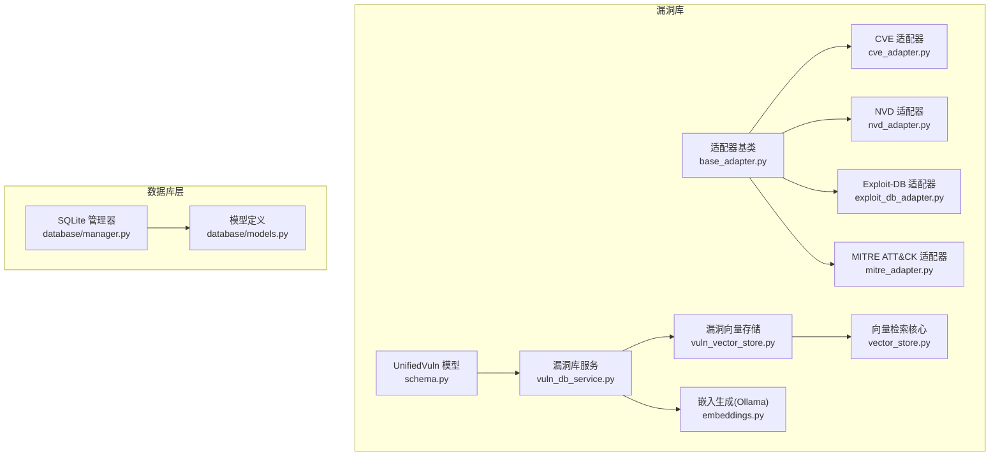
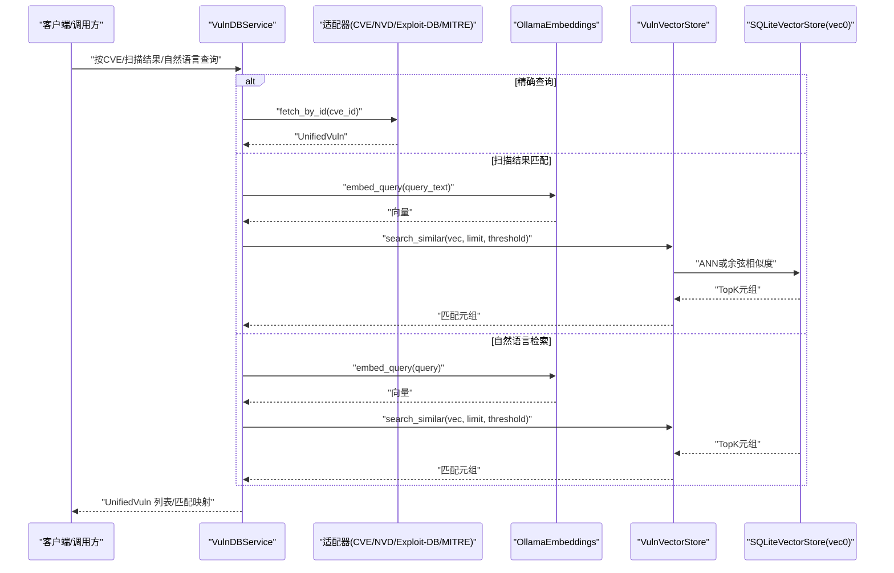
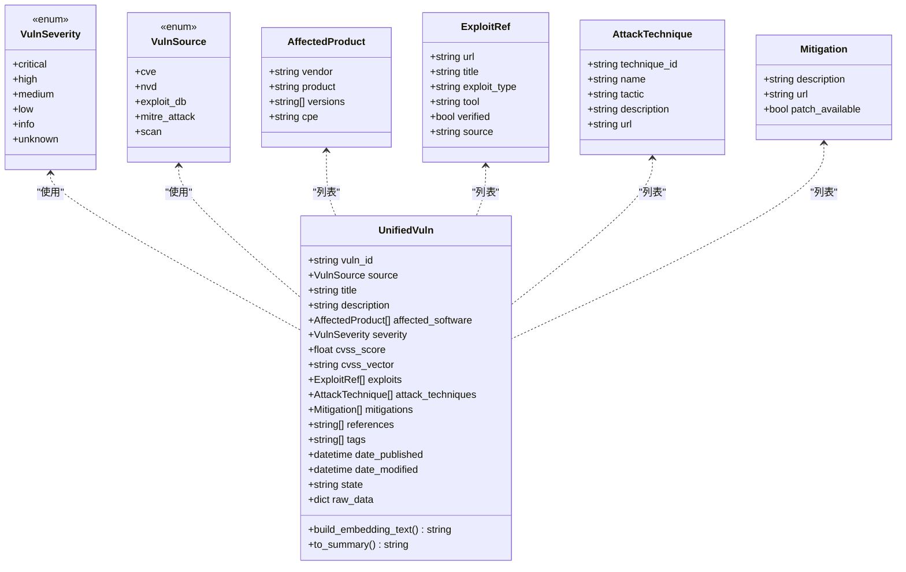
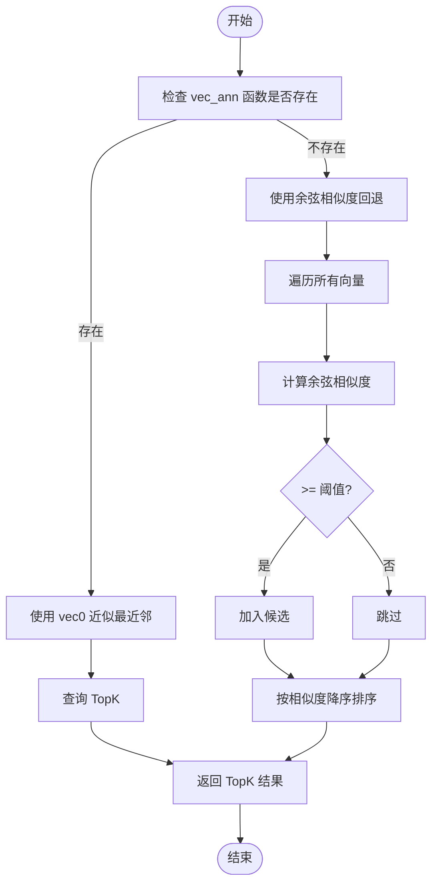
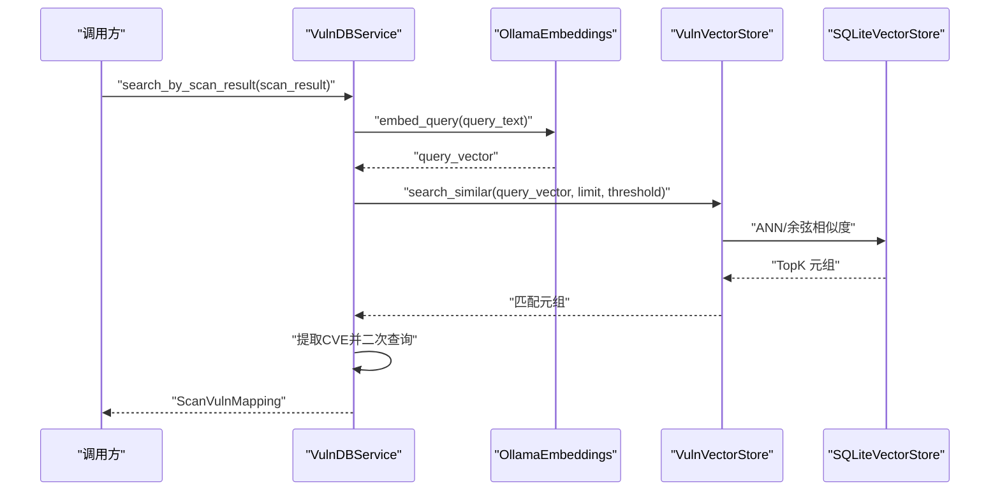
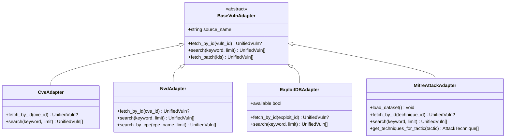
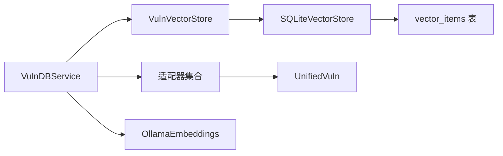

# 漏洞数据库架构与模式

<cite>
**本文引用的文件**
- [schema.py](file://core/vuln_db/schema.py)
- [vuln_vector_store.py](file://core/vuln_db/vuln_vector_store.py)
- [vuln_db_service.py](file://core/vuln_db/vuln_db_service.py)
- [vector_store.py](file://core/memory/vector_store.py)
- [embeddings.py](file://utils/embeddings.py)
- [base_adapter.py](file://core/vuln_db/adapters/base_adapter.py)
- [cve_adapter.py](file://core/vuln_db/adapters/cve_adapter.py)
- [nvd_adapter.py](file://core/vuln_db/adapters/nvd_adapter.py)
- [exploit_db_adapter.py](file://core/vuln_db/adapters/exploit_db_adapter.py)
- [mitre_adapter.py](file://core/vuln_db/adapters/mitre_adapter.py)
- [models.py](file://database/models.py)
- [manager.py](file://database/manager.py)
- [DATABASE_GUIDE.md](file://docs/DATABASE_GUIDE.md)
- [SQLITE_SETUP.md](file://docs/SQLITE_SETUP.md)
</cite>

## 目录
1. [简介](#简介)
2. [项目结构](#项目结构)
3. [核心组件](#核心组件)
4. [架构总览](#架构总览)
5. [详细组件分析](#详细组件分析)
6. [依赖关系分析](#依赖关系分析)
7. [性能考量](#性能考量)
8. [故障排查指南](#故障排查指南)
9. [结论](#结论)
10. [附录](#附录)

## 简介
本文件面向Secbot的漏洞数据库架构与模式，系统性阐述：
- 漏洞数据的统一模型与表结构设计
- SQLite向量存储的实现原理、嵌入向量的存储机制、相似度搜索算法与性能优化策略
- 漏洞数据的索引设计、查询优化与缓存机制
- 数据模型扩展指南（新增字段、迁移策略与向后兼容）

## 项目结构
围绕漏洞数据库的关键模块如下：
- 数据模型与适配器：统一漏洞模型、多源适配器（CVE/NVD/Exploit-DB/MITRE ATT&CK）
- 向量存储层：基于SQLite的向量检索（sqlite-vec/sqlite-vss）
- 服务层：统一服务封装（嵌入生成、检索、同步、统计）
- 数据库层：SQLite持久化（对话、任务、审计等，与漏洞库分离）

**图表来源**
- [schema.py](file://core/vuln_db/schema.py#L68-L140)
- [base_adapter.py](file://core/vuln_db/adapters/base_adapter.py#L8-L33)
- [cve_adapter.py](file://core/vuln_db/adapters/cve_adapter.py#L36-L155)
- [nvd_adapter.py](file://core/vuln_db/adapters/nvd_adapter.py#L37-L214)
- [exploit_db_adapter.py](file://core/vuln_db/adapters/exploit_db_adapter.py#L24-L117)
- [mitre_adapter.py](file://core/vuln_db/adapters/mitre_adapter.py#L27-L151)
- [vuln_vector_store.py](file://core/vuln_db/vuln_vector_store.py#L18-L107)
- [vector_store.py](file://core/memory/vector_store.py#L30-L297)
- [embeddings.py](file://utils/embeddings.py#L11-L80)
- [vuln_db_service.py](file://core/vuln_db/vuln_db_service.py#L27-L275)
- [manager.py](file://database/manager.py#L26-L719)
- [models.py](file://database/models.py#L9-L90)

**章节来源**
- [schema.py](file://core/vuln_db/schema.py#L1-L140)
- [vuln_db_service.py](file://core/vuln_db/vuln_db_service.py#L1-L275)
- [vuln_vector_store.py](file://core/vuln_db/vuln_vector_store.py#L1-L107)
- [vector_store.py](file://core/memory/vector_store.py#L1-L297)
- [embeddings.py](file://utils/embeddings.py#L1-L80)
- [base_adapter.py](file://core/vuln_db/adapters/base_adapter.py#L1-L33)
- [cve_adapter.py](file://core/vuln_db/adapters/cve_adapter.py#L1-L155)
- [nvd_adapter.py](file://core/vuln_db/adapters/nvd_adapter.py#L1-L214)
- [exploit_db_adapter.py](file://core/vuln_db/adapters/exploit_db_adapter.py#L1-L117)
- [mitre_adapter.py](file://core/vuln_db/adapters/mitre_adapter.py#L1-L151)
- [manager.py](file://database/manager.py#L26-L719)
- [models.py](file://database/models.py#L1-L90)

## 核心组件
- 统一漏洞模型：将多源数据归一化为统一结构，支持向量化文本拼接与摘要生成
- 适配器体系：抽象多源（CVE/NVD/Exploit-DB/MITRE ATT&CK）的数据获取与标准化
- 向量存储：基于SQLite的向量检索，支持ANN近似最近邻与纯量计算回退
- 嵌入服务：通过Ollama生成文本嵌入，提供批量与单条查询接口
- 服务编排：统一检索（精确/CVE/自然语言）、扫描结果匹配、增量同步与统计

**章节来源**
- [schema.py](file://core/vuln_db/schema.py#L68-L140)
- [base_adapter.py](file://core/vuln_db/adapters/base_adapter.py#L8-L33)
- [vector_store.py](file://core/memory/vector_store.py#L30-L297)
- [embeddings.py](file://utils/embeddings.py#L11-L80)
- [vuln_db_service.py](file://core/vuln_db/vuln_db_service.py#L27-L275)

## 架构总览

**图表来源**
- [vuln_db_service.py](file://core/vuln_db/vuln_db_service.py#L79-L184)
- [cve_adapter.py](file://core/vuln_db/adapters/cve_adapter.py#L45-L73)
- [nvd_adapter.py](file://core/vuln_db/adapters/nvd_adapter.py#L47-L72)
- [exploit_db_adapter.py](file://core/vuln_db/adapters/exploit_db_adapter.py#L37-L51)
- [mitre_adapter.py](file://core/vuln_db/adapters/mitre_adapter.py#L67-L92)
- [embeddings.py](file://utils/embeddings.py#L18-L70)
- [vuln_vector_store.py](file://core/vuln_db/vuln_vector_store.py#L72-L93)
- [vector_store.py](file://core/memory/vector_store.py#L124-L175)

## 详细组件分析

### 统一漏洞数据模型（UnifiedVuln）
- 设计要点
  - 统一字段：ID、来源、标题、描述、严重性、CVSS分数/向量、标签、发布时间/修改时间、状态、原始数据
  - 关联实体：受影响软件（厂商/产品/版本/CPE）、可利用引用（URL/类型/工具/验证）、MITRE ATT&CK技术、缓解措施、参考链接
  - 文本向量化：build_embedding_text将关键字段拼接为向量输入文本
  - 可读摘要：to_summary生成人类可读摘要
- 字段与约束
  - vuln_id：主键（字符串）
  - source：枚举（CVE/NVD/Exploit-DB/MITRE_ATTACK/SCAN）
  - affected_software/exploits/attack_techniques/mitigations/references/tags：列表字段，长度限制在适配器/服务层控制
  - date_published/date_modified：可空日期
  - raw_data：可选原始JSON
- 复杂度与性能
  - build_embedding_text线性复杂度O(n)，n为实体数量
  - 建议在入库前做字段裁剪（如描述截断、标签截断）

**图表来源**
- [schema.py](file://core/vuln_db/schema.py#L15-L140)

**章节来源**
- [schema.py](file://core/vuln_db/schema.py#L68-L140)

### SQLite向量存储与相似度搜索
- 存储结构
  - vector_items：id（主键）、content、vector（BLOB，float32）、metadata（JSON）、created_at
  - collections：name（主键）、description、config
  - 若sqlite-vec可用，使用vec0虚拟表进行ANN索引；否则回退纯量计算
- 相似度算法
  - ANN：使用vec_ann函数进行近似最近邻检索
  - 回退：余弦相似度计算，阈值过滤
- 写入与检索
  - upsert_vulns：将UnifiedVuln转换为VectorItem，写入metadata（含vuln_id/source/severity/cvss_score/title/description/tags）
  - search_similar：返回(元数据字典, 相似度)列表
- 性能优化
  - 启用sqlite-vec可显著提升大规模检索性能
  - 控制阈值与limit，减少无效匹配
  - 合理的维度与向量压缩（由嵌入模型决定）

**图表来源**
- [vector_store.py](file://core/memory/vector_store.py#L124-L175)

**章节来源**
- [vector_store.py](file://core/memory/vector_store.py#L30-L297)
- [vuln_vector_store.py](file://core/vuln_db/vuln_vector_store.py#L18-L107)

### 嵌入生成与服务编排
- 嵌入生成
  - OllamaEmbeddings：异步调用Ollama API，支持单条与批量生成
  - 失败回退：异常时返回零向量，保证检索可用性
- 服务编排
  - 精确查询：优先NVD/CVE，命中后写入向量库
  - 扫描结果匹配：向量检索 + 关键词CVE抽取 + 在线关键词搜索补充
  - 自然语言检索：向量检索 + 关键词CVE抽取 + 在线关键词搜索补充
  - 同步：按关键词从多源拉取，去重后批量嵌入并写入向量库
  - 统计：向量条目数、适配器列表

**图表来源**
- [vuln_db_service.py](file://core/vuln_db/vuln_db_service.py#L90-L145)
- [embeddings.py](file://utils/embeddings.py#L18-L70)
- [vuln_vector_store.py](file://core/vuln_db/vuln_vector_store.py#L72-L93)
- [vector_store.py](file://core/memory/vector_store.py#L124-L175)

**章节来源**
- [vuln_db_service.py](file://core/vuln_db/vuln_db_service.py#L27-L275)
- [embeddings.py](file://utils/embeddings.py#L1-L80)

### 数据源适配器
- 适配器基类：定义fetch_by_id/search/fetch_batch接口
- CVE适配器：MITRE CVE API，标准化CVSS、受影响产品、引用、日期
- NVD适配器：NVD 2.0 API，支持按CPE检索，标准化CWE标签、Exploit标记
- Exploit-DB适配器：searchsploit CLI，解析JSON输出为UnifiedVuln
- MITRE ATT&CK适配器：下载enterprise-attack.json，构建攻击技术映射

**图表来源**
- [base_adapter.py](file://core/vuln_db/adapters/base_adapter.py#L8-L33)
- [cve_adapter.py](file://core/vuln_db/adapters/cve_adapter.py#L36-L155)
- [nvd_adapter.py](file://core/vuln_db/adapters/nvd_adapter.py#L37-L214)
- [exploit_db_adapter.py](file://core/vuln_db/adapters/exploit_db_adapter.py#L24-L117)
- [mitre_adapter.py](file://core/vuln_db/adapters/mitre_adapter.py#L27-L151)

**章节来源**
- [base_adapter.py](file://core/vuln_db/adapters/base_adapter.py#L1-L33)
- [cve_adapter.py](file://core/vuln_db/adapters/cve_adapter.py#L1-L155)
- [nvd_adapter.py](file://core/vuln_db/adapters/nvd_adapter.py#L1-L214)
- [exploit_db_adapter.py](file://core/vuln_db/adapters/exploit_db_adapter.py#L1-L117)
- [mitre_adapter.py](file://core/vuln_db/adapters/mitre_adapter.py#L1-L151)

### 数据库层（与漏洞库分离）
- 表结构概览（来自文档与模型定义）
  - conversations、prompt_chains、user_configs、crawler_tasks、attack_tasks、scan_results、audit_trail
  - 已创建索引：会话ID、时间戳、状态等
- 编程式接口：保存/查询/统计/清理
- 与漏洞库的关系：SQLite向量库独立文件（./data/vuln_vectors.db），与对话/任务等共存

**章节来源**
- [models.py](file://database/models.py#L9-L90)
- [manager.py](file://database/manager.py#L75-L203)
- [DATABASE_GUIDE.md](file://docs/DATABASE_GUIDE.md#L18-L213)
- [SQLITE_SETUP.md](file://docs/SQLITE_SETUP.md#L44-L170)

## 依赖关系分析
- 组件耦合
  - VulnDBService依赖适配器、向量存储、嵌入服务
  - VulnVectorStore封装SQLiteVectorStore，提供漏洞专用接口
  - 适配器与统一模型强耦合，向量存储与适配器弱耦合（仅通过文本）
- 外部依赖
  - Ollama服务（嵌入生成）
  - sqlite-vec/sqlite-vss（向量索引）
  - 多源API（CVE/NVD/Exploit-DB/MITRE ATT&CK）

**图表来源**
- [vuln_db_service.py](file://core/vuln_db/vuln_db_service.py#L39-L44)
- [vuln_vector_store.py](file://core/vuln_db/vuln_vector_store.py#L23-L29)
- [vector_store.py](file://core/memory/vector_store.py#L33-L37)
- [embeddings.py](file://utils/embeddings.py#L14-L16)
- [schema.py](file://core/vuln_db/schema.py#L68-L94)

**章节来源**
- [vuln_db_service.py](file://core/vuln_db/vuln_db_service.py#L27-L74)
- [vuln_vector_store.py](file://core/vuln_db/vuln_vector_store.py#L18-L67)
- [vector_store.py](file://core/memory/vector_store.py#L30-L97)
- [embeddings.py](file://utils/embeddings.py#L11-L80)

## 性能考量
- 向量检索
  - 优先启用sqlite-vec，使用vec0近似最近邻；无插件时采用余弦相似度回退
  - 合理设置阈值与limit，避免全表扫描
- 嵌入生成
  - 批量嵌入优于单条嵌入；失败时以零向量回退，保证可用性
- 数据库
  - SQLite向量库独立文件，避免与对话/任务表竞争
  - 适当索引（如按vuln_id/source/severity等）可提升检索效率
- 网络与外部API
  - 适配器请求超时与异常处理，避免阻塞主线程
  - MITRE ATT&CK数据集可预加载至内存缓存

[本节为通用性能指导，无需特定文件引用]

## 故障排查指南
- Ollama连接失败
  - 现象：嵌入生成异常，抛出连接错误
  - 排查：确认Ollama服务运行、base_url/model配置正确
- sqlite-vec不可用
  - 现象：向量检索回退到纯量计算，性能下降
  - 排查：安装sqlite-vec扩展或接受回退方案
- CVE/NVD/Exploit-DB/MITRE ATT&CK请求失败
  - 现象：适配器请求超时或返回空数据
  - 排查：检查网络、API密钥（NVD）、searchsploit安装状态、MITRE数据集可达性
- 向量库为空
  - 现象：自然语言/扫描结果匹配无结果
  - 排查：确认已执行同步或精确查询并写入向量库

**章节来源**
- [embeddings.py](file://utils/embeddings.py#L63-L70)
- [vector_store.py](file://core/memory/vector_store.py#L80-L88)
- [cve_adapter.py](file://core/vuln_db/adapters/cve_adapter.py#L76-L82)
- [nvd_adapter.py](file://core/vuln_db/adapters/nvd_adapter.py#L89-L95)
- [exploit_db_adapter.py](file://core/vuln_db/adapters/exploit_db_adapter.py#L39-L41)
- [mitre_adapter.py](file://core/vuln_db/adapters/mitre_adapter.py#L57-L58)

## 结论
Secbot的漏洞数据库以“统一模型 + 多源适配 + 向量检索”为核心，实现了从多源数据到本地向量库的闭环。通过合理的索引与阈值控制、嵌入回退与预加载策略，系统在易用性与性能之间取得平衡。建议在生产环境中：
- 部署sqlite-vec以获得更好的检索性能
- 为向量库建立定期同步与清理策略
- 为关键字段（如vuln_id/source）建立索引
- 为适配器增加重试与熔断机制

[本节为总结性内容，无需特定文件引用]

## 附录

### 数据模型扩展指南
- 新增字段步骤
  - 在UnifiedVuln中添加字段与默认值
  - 在适配器的_normalize中填充该字段
  - 在build_embedding_text中决定是否纳入向量化文本
  - 在VulnVectorStore.metadata中补充写入
- 数据迁移策略
  - 增量迁移：在适配器/_normalize中为新字段提供默认值
  - 批量回填：对既有向量库执行重新嵌入与写入
- 向后兼容性
  - 保持字段可空与默认值
  - 在向量检索返回的元数据中兼容旧字段
  - 保留raw_data以便未来反序列化

**章节来源**
- [schema.py](file://core/vuln_db/schema.py#L68-L116)
- [vuln_vector_store.py](file://core/vuln_db/vuln_vector_store.py#L44-L62)
- [cve_adapter.py](file://core/vuln_db/adapters/cve_adapter.py#L91-L154)
- [nvd_adapter.py](file://core/vuln_db/adapters/nvd_adapter.py#L106-L204)