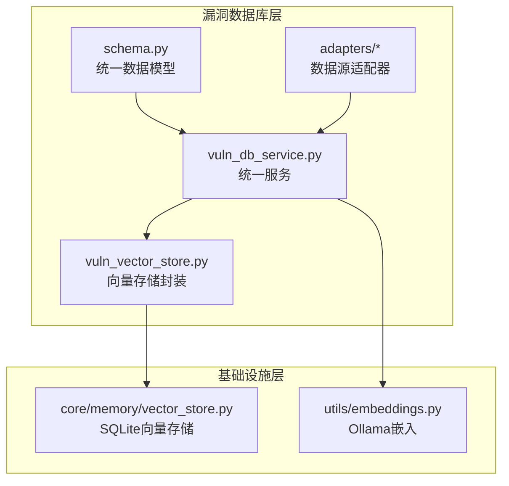
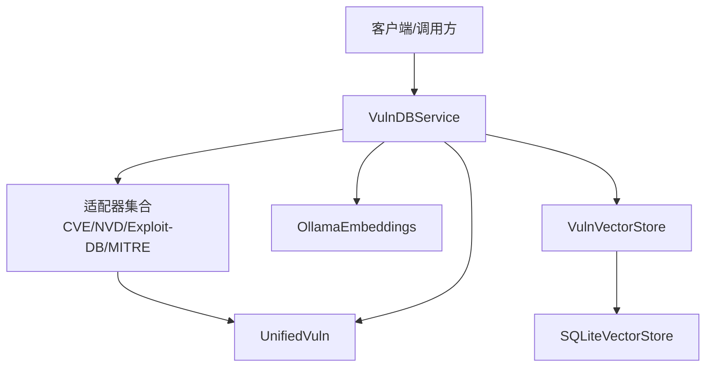
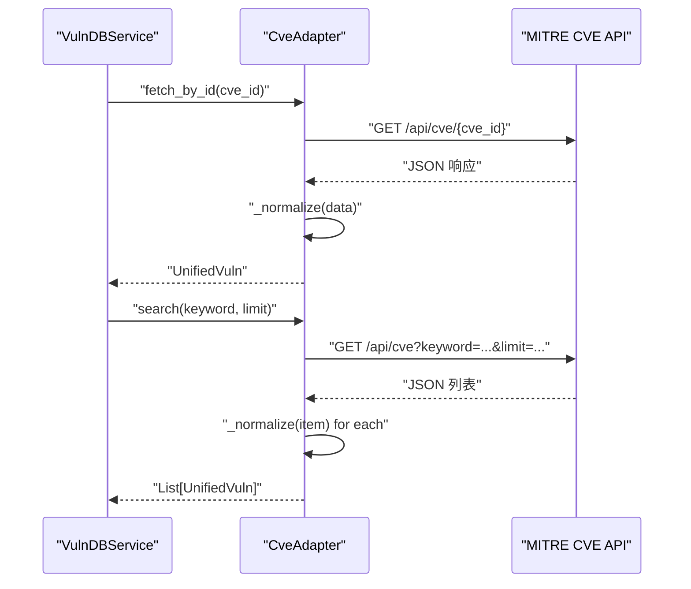
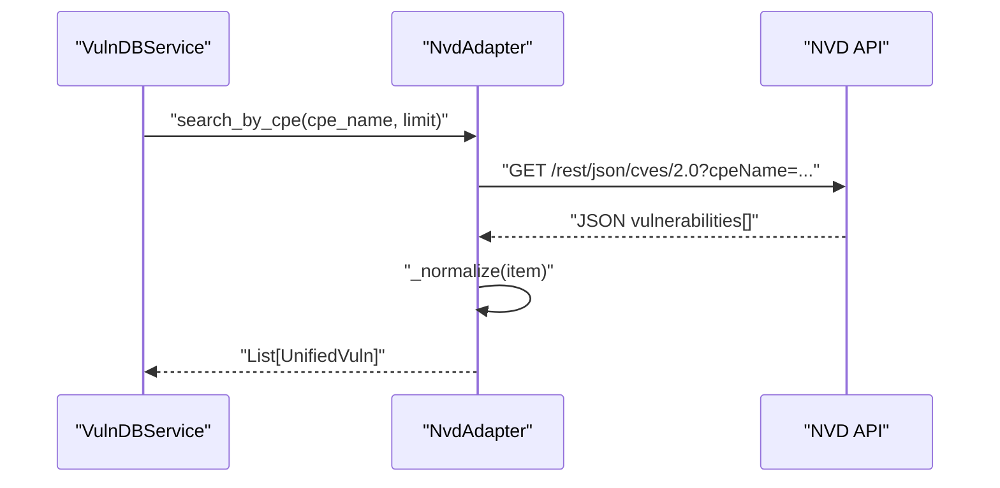
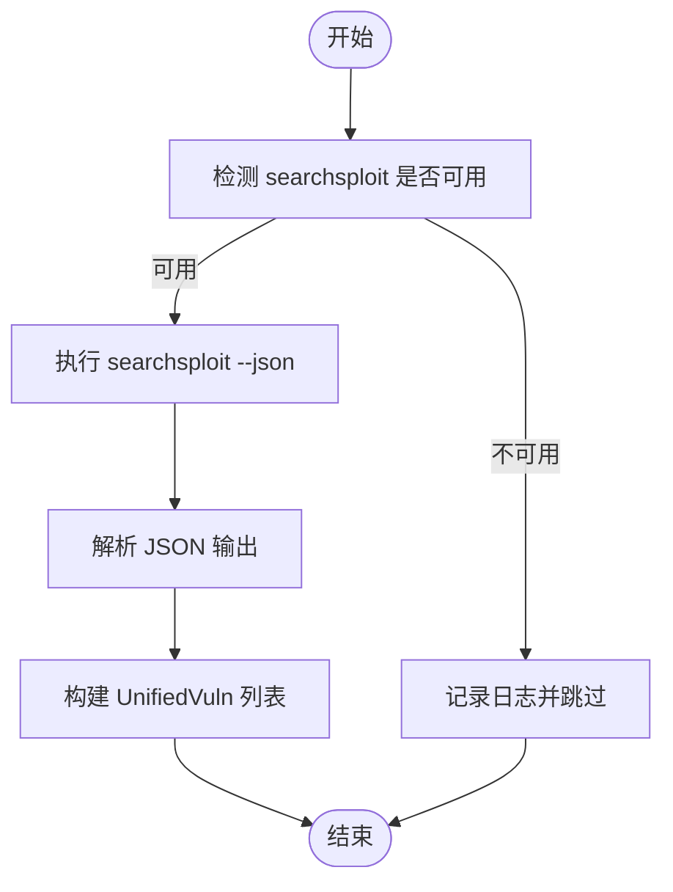
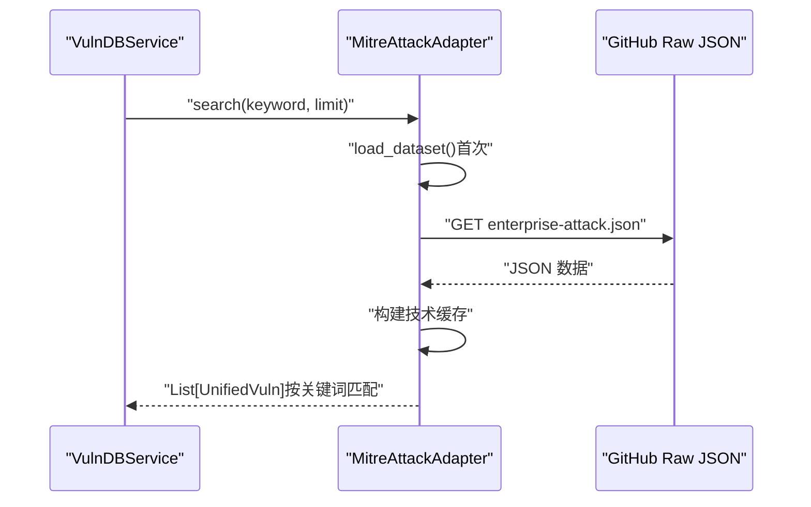
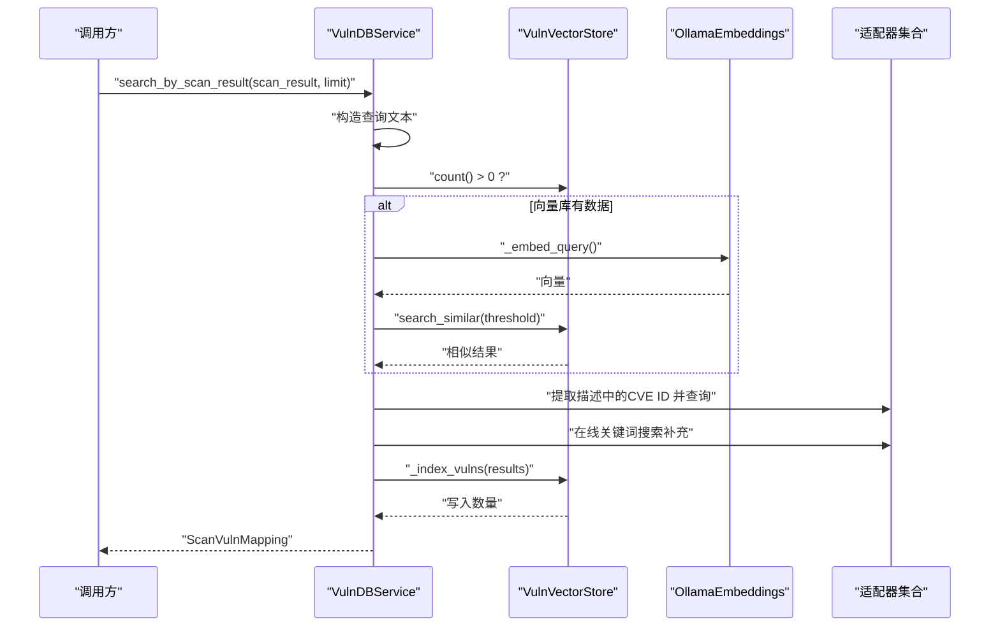
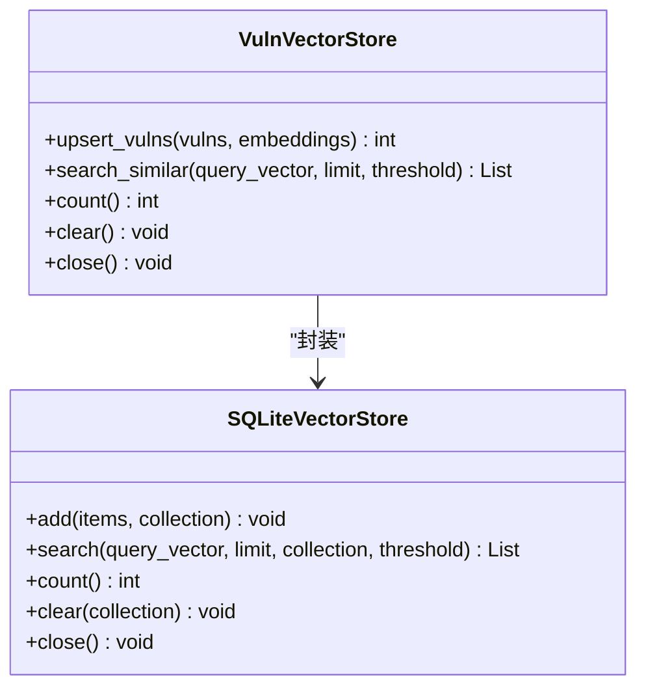
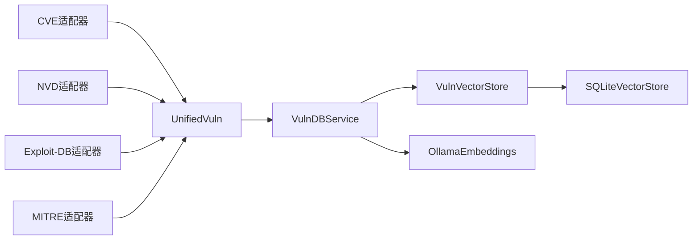

# 漏洞数据库系统

<cite>
**本文引用的文件**
- [core/vuln_db/__init__.py](file://core/vuln_db/__init__.py)
- [core/vuln_db/schema.py](file://core/vuln_db/schema.py)
- [core/vuln_db/vuln_db_service.py](file://core/vuln_db/vuln_db_service.py)
- [core/vuln_db/vuln_vector_store.py](file://core/vuln_db/vuln_vector_store.py)
- [core/vuln_db/adapters/base_adapter.py](file://core/vuln_db/adapters/base_adapter.py)
- [core/vuln_db/adapters/cve_adapter.py](file://core/vuln_db/adapters/cve_adapter.py)
- [core/vuln_db/adapters/nvd_adapter.py](file://core/vuln_db/adapters/nvd_adapter.py)
- [core/vuln_db/adapters/exploit_db_adapter.py](file://core/vuln_db/adapters/exploit_db_adapter.py)
- [core/vuln_db/adapters/mitre_adapter.py](file://core/vuln_db/adapters/mitre_adapter.py)
- [core/memory/vector_store.py](file://core/memory/vector_store.py)
- [utils/embeddings.py](file://utils/embeddings.py)
- [docs/OLLAMA_SETUP.md](file://docs/OLLAMA_SETUP.md)
- [tests/test_db_connection.py](file://tests/test_db_connection.py)
</cite>

## 目录
1. [简介](#简介)
2. [项目结构](#项目结构)
3. [核心组件](#核心组件)
4. [架构总览](#架构总览)
5. [组件详解](#组件详解)
6. [依赖关系分析](#依赖关系分析)
7. [性能考量](#性能考量)
8. [故障排查指南](#故障排查指南)
9. [结论](#结论)
10. [附录](#附录)

## 简介
本文件面向Secbot的漏洞数据库系统，提供从架构设计到实现细节的完整技术文档。系统采用数据适配器模式对接多种公开漏洞数据源（CVE、NVD、Exploit-DB、MITRE ATT&CK），通过统一数据模型进行归一化，并结合向量检索与自然语言语义搜索，实现对扫描结果的自动匹配、按ID精确查询以及关键词/语义检索。系统还提供增量同步与去重机制，确保数据一致性与性能。

## 项目结构
围绕漏洞数据库的关键目录与文件如下：
- 数据模型与适配器层：统一数据模型与各数据源适配器
- 服务层：统一服务编排、向量化与检索、同步与查询
- 向量存储层：基于SQLite的向量检索封装
- 嵌入层：基于Ollama的服务化向量化
- 文档与测试：环境与模型设置说明、数据库连通性测试

图表来源
- [core/vuln_db/schema.py](file://core/vuln_db/schema.py#L68-L140)
- [core/vuln_db/adapters/base_adapter.py](file://core/vuln_db/adapters/base_adapter.py#L8-L33)
- [core/vuln_db/vuln_db_service.py](file://core/vuln_db/vuln_db_service.py#L27-L275)
- [core/vuln_db/vuln_vector_store.py](file://core/vuln_db/vuln_vector_store.py#L18-L107)
- [core/memory/vector_store.py](file://core/memory/vector_store.py#L30-L297)
- [utils/embeddings.py](file://utils/embeddings.py#L11-L80)

章节来源
- [core/vuln_db/__init__.py](file://core/vuln_db/__init__.py#L1-L21)
- [core/vuln_db/schema.py](file://core/vuln_db/schema.py#L1-L140)
- [core/vuln_db/vuln_db_service.py](file://core/vuln_db/vuln_db_service.py#L1-L275)
- [core/vuln_db/vuln_vector_store.py](file://core/vuln_db/vuln_vector_store.py#L1-L107)
- [core/memory/vector_store.py](file://core/memory/vector_store.py#L1-L297)
- [utils/embeddings.py](file://utils/embeddings.py#L1-L80)

## 核心组件
- 统一数据模型：定义漏洞实体、严重性等级、来源枚举、受影响产品、Exploit引用、MITRE攻击技术、缓解措施等字段，并提供向量化文本拼接与摘要生成能力。
- 数据适配器：抽象基类定义统一接口；具体适配器负责对接不同数据源，完成数据抓取、解析与归一化。
- 统一服务：编排适配器、向量嵌入、向量检索、关键词/语义检索、扫描结果匹配与增量同步。
- 向量存储：对SQLite向量存储的业务封装，支持upsert、相似度检索、统计与清理。
- 嵌入服务：基于Ollama的异步嵌入接口，支持批量与单条嵌入。

章节来源
- [core/vuln_db/schema.py](file://core/vuln_db/schema.py#L15-L140)
- [core/vuln_db/adapters/base_adapter.py](file://core/vuln_db/adapters/base_adapter.py#L8-L33)
- [core/vuln_db/vuln_db_service.py](file://core/vuln_db/vuln_db_service.py#L27-L275)
- [core/vuln_db/vuln_vector_store.py](file://core/vuln_db/vuln_vector_store.py#L18-L107)
- [utils/embeddings.py](file://utils/embeddings.py#L11-L80)

## 架构总览
系统采用“适配器 + 统一服务 + 向量检索”的三层架构：
- 适配器层：面向多数据源，负责抓取与归一化
- 服务层：统一调度、嵌入、检索、匹配与同步
- 存储层：SQLite向量存储，支持ANN与回退相似度计算

图表来源
- [core/vuln_db/vuln_db_service.py](file://core/vuln_db/vuln_db_service.py#L27-L275)
- [core/vuln_db/adapters/base_adapter.py](file://core/vuln_db/adapters/base_adapter.py#L8-L33)
- [core/vuln_db/vuln_vector_store.py](file://core/vuln_db/vuln_vector_store.py#L18-L107)
- [core/memory/vector_store.py](file://core/memory/vector_store.py#L30-L297)
- [utils/embeddings.py](file://utils/embeddings.py#L11-L80)
- [core/vuln_db/schema.py](file://core/vuln_db/schema.py#L68-L140)

## 组件详解

### 统一数据模型（UnifiedVuln）
- 字段覆盖：ID、来源、标题、描述、受影响软件、严重性、CVSS分数/向量、Exploit引用、ATT&CK技术、缓解措施、参考链接、标签、发布时间/修改时间、状态、原始数据等。
- 能力：
  - 构建向量化文本：拼接ID、标题、描述、受影响软件厂商/产品/版本、Exploit标题/URL、ATT&CK技术标识/名称/战术、严重性、CVSS分数、标签等。
  - 生成人类可读摘要：包含ID、标题、严重性、CVSS、前几项受影响软件、Exploit数量等。
- 设计要点：通过统一字段与可选字段，兼容多源差异；向量化文本拼接兼顾召回与精度。

章节来源
- [core/vuln_db/schema.py](file://core/vuln_db/schema.py#L68-L140)

### 数据适配器基类（BaseVulnAdapter）
- 规范接口：按ID获取、关键词搜索、批量获取（默认逐条，子类可覆盖）。
- 设计要点：统一生命周期与错误处理策略，便于扩展新数据源。

章节来源
- [core/vuln_db/adapters/base_adapter.py](file://core/vuln_db/adapters/base_adapter.py#L8-L33)

### CVE适配器（CveAdapter）
- 数据源：MITRE CVE API（cveawg.mitre.org）。
- 功能：
  - 按ID获取与关键词搜索。
  - 解析元数据、描述、CVSS、受影响产品、参考链接、发布/修改时间等。
  - 归一化为UnifiedVuln。
- 错误处理：请求异常与解析异常均记录日志并返回None/空列表。

图表来源
- [core/vuln_db/adapters/cve_adapter.py](file://core/vuln_db/adapters/cve_adapter.py#L36-L155)
- [core/vuln_db/vuln_db_service.py](file://core/vuln_db/vuln_db_service.py#L79-L90)

章节来源
- [core/vuln_db/adapters/cve_adapter.py](file://core/vuln_db/adapters/cve_adapter.py#L1-L155)

### NVD适配器（NvdAdapter）
- 数据源：NVD 2.0 REST API。
- 功能：
  - 按ID、关键词、CPE名称检索。
  - 解析英文描述、CVSS v3.1/v3.0/v2.0、受影响CPE、CWE标签、Exploit标记、参考链接、发布/修改时间等。
  - 归一化为UnifiedVuln。
- 错误处理：请求异常记录警告并返回None/空列表。

图表来源
- [core/vuln_db/adapters/nvd_adapter.py](file://core/vuln_db/adapters/nvd_adapter.py#L74-L87)
- [core/vuln_db/vuln_db_service.py](file://core/vuln_db/vuln_db_service.py#L190-L223)

章节来源
- [core/vuln_db/adapters/nvd_adapter.py](file://core/vuln_db/adapters/nvd_adapter.py#L1-L214)

### Exploit-DB适配器（ExploitDBAdapter）
- 数据源：本地searchsploit命令（需安装exploitdb包）。
- 功能：
  - 按EDB-ID获取与关键词搜索。
  - 解析EDB JSON输出，构造UnifiedVuln，填充ExploitRef与标签（平台、类型、验证状态）。
- 可用性检测：若未安装searchsploit则跳过该数据源。

图表来源
- [core/vuln_db/adapters/exploit_db_adapter.py](file://core/vuln_db/adapters/exploit_db_adapter.py#L24-L117)

章节来源
- [core/vuln_db/adapters/exploit_db_adapter.py](file://core/vuln_db/adapters/exploit_db_adapter.py#L1-L117)

### MITRE ATT&CK适配器（MitreAttackAdapter）
- 数据源：Enterprise Attack JSON（GitHub仓库）。
- 功能：
  - 预加载并缓存ATT&CK技术，支持按ID获取与关键词搜索。
  - 将技术映射为UnifiedVuln的attack_techniques字段，填充标签（平台、战术）与参考链接。
- 缓存策略：首次使用时下载并缓存，后续复用以提升性能。

图表来源
- [core/vuln_db/adapters/mitre_adapter.py](file://core/vuln_db/adapters/mitre_adapter.py#L37-L93)
- [core/vuln_db/vuln_db_service.py](file://core/vuln_db/vuln_db_service.py#L147-L185)

章节来源
- [core/vuln_db/adapters/mitre_adapter.py](file://core/vuln_db/adapters/mitre_adapter.py#L1-L151)

### 统一服务（VulnDBService）
- 职责：
  - 初始化向量存储、适配器集合与嵌入器。
  - 提供按CVE ID精确查询、扫描结果匹配、自然语言语义检索。
  - 支持按关键词从多源同步数据，内置去重与增量入库。
- 关键流程：
  - 精确查询：优先NVD/CVE，命中后写入向量库。
  - 扫描结果匹配：向量检索 + 提取描述中的CVE ID + 在线关键词搜索补充。
  - 语义检索：向量检索 + 在线关键词搜索补充。
  - 同步：遍历目标数据源与关键词，去重后批量嵌入并入库。

图表来源
- [core/vuln_db/vuln_db_service.py](file://core/vuln_db/vuln_db_service.py#L90-L146)
- [core/vuln_db/vuln_vector_store.py](file://core/vuln_db/vuln_vector_store.py#L72-L94)
- [utils/embeddings.py](file://utils/embeddings.py#L18-L70)

章节来源
- [core/vuln_db/vuln_db_service.py](file://core/vuln_db/vuln_db_service.py#L1-L275)

### 向量存储封装（VulnVectorStore）
- 职责：将漏洞与其向量嵌入写入SQLite向量存储，支持相似度检索、统计与清理。
- 元数据：保存vuln_id、source、severity、cvss_score、title、description片段、tags等，便于检索后快速还原。
- 写入校验：确保vulns与embeddings数量一致。

图表来源
- [core/vuln_db/vuln_vector_store.py](file://core/vuln_db/vuln_vector_store.py#L18-L107)
- [core/memory/vector_store.py](file://core/memory/vector_store.py#L30-L297)

章节来源
- [core/vuln_db/vuln_vector_store.py](file://core/vuln_db/vuln_vector_store.py#L1-L107)
- [core/memory/vector_store.py](file://core/memory/vector_store.py#L1-L297)

### 嵌入服务（OllamaEmbeddings）
- 职责：异步生成文本向量嵌入，支持单条与批量；在连接失败或模型不可用时抛出明确异常。
- 配置：通过hackbot_config.settings读取基础URL与模型名；可在构造时覆盖。
- 性能：超时较长（300秒），适合批量嵌入；单次嵌入返回首元素。

章节来源
- [utils/embeddings.py](file://utils/embeddings.py#L11-L80)
- [docs/OLLAMA_SETUP.md](file://docs/OLLAMA_SETUP.md#L1-L96)

## 依赖关系分析
- 低耦合高内聚：适配器仅依赖统一模型与基类接口；服务层通过依赖注入管理适配器集合。
- 外部依赖：
  - 网络API：CVE、NVD、MITRE ATT&CK。
  - 本地CLI：Exploit-DB（searchsploit）。
  - 向量服务：Ollama。
- 数据流：
  - 适配器 → 统一模型 → 向量嵌入 → 向量存储 → 检索/匹配。
  - 同步流程：关键词 → 适配器搜索 → 去重 → 批量嵌入 → 写入向量库。

图表来源
- [core/vuln_db/adapters/cve_adapter.py](file://core/vuln_db/adapters/cve_adapter.py#L36-L155)
- [core/vuln_db/adapters/nvd_adapter.py](file://core/vuln_db/adapters/nvd_adapter.py#L37-L214)
- [core/vuln_db/adapters/exploit_db_adapter.py](file://core/vuln_db/adapters/exploit_db_adapter.py#L24-L117)
- [core/vuln_db/adapters/mitre_adapter.py](file://core/vuln_db/adapters/mitre_adapter.py#L27-L151)
- [core/vuln_db/schema.py](file://core/vuln_db/schema.py#L68-L140)
- [core/vuln_db/vuln_db_service.py](file://core/vuln_db/vuln_db_service.py#L27-L275)
- [core/vuln_db/vuln_vector_store.py](file://core/vuln_db/vuln_vector_store.py#L18-L107)
- [core/memory/vector_store.py](file://core/memory/vector_store.py#L30-L297)
- [utils/embeddings.py](file://utils/embeddings.py#L11-L80)

## 性能考量
- 向量检索路径：
  - 当向量库非空时优先使用向量检索；若未安装sqlite-vec，则回退为余弦相似度计算，性能下降但功能可用。
- 嵌入性能：
  - 批量嵌入优于单条嵌入；建议在同步阶段合并文本批量生成向量。
  - 嵌入超时较长，注意控制并发与队列长度。
- 同步策略：
  - 去重策略：以vuln_id为键，避免重复入库。
  - 限制每源每关键词的抓取数量，防止资源争用。
- 缓存与预加载：
  - MITRE ATT&CK数据集首次加载后缓存，减少重复下载与解析开销。
- I/O与存储：
  - SQLite向量存储无需外部服务，部署简单；大量写入时建议合理分批与事务化写入。

章节来源
- [core/memory/vector_store.py](file://core/memory/vector_store.py#L61-L88)
- [core/vuln_db/vuln_db_service.py](file://core/vuln_db/vuln_db_service.py#L190-L223)
- [core/vuln_db/adapters/mitre_adapter.py](file://core/vuln_db/adapters/mitre_adapter.py#L37-L59)

## 故障排查指南
- Ollama连接失败
  - 现象：嵌入接口抛出连接错误或超时。
  - 排查：确认Ollama服务运行、端口未被占用、配置正确；确保已下载嵌入模型。
  - 参考：Ollama设置指南。
- Exploit-DB不可用
  - 现象：searchsploit未安装导致查询跳过。
  - 排查：安装exploitdb并确保searchsploit命令可用。
- NVD API受限
  - 现象：请求失败或返回空数据。
  - 排查：检查API Key配置、网络连通性与限速策略。
- SQLite连通性
  - 现象：向量存储初始化失败或查询报错。
  - 排查：使用数据库连通性测试脚本验证SQLite连接与权限。

章节来源
- [utils/embeddings.py](file://utils/embeddings.py#L63-L70)
- [docs/OLLAMA_SETUP.md](file://docs/OLLAMA_SETUP.md#L71-L95)
- [tests/test_db_connection.py](file://tests/test_db_connection.py#L23-L43)

## 结论
本漏洞数据库系统通过数据适配器模式实现了对多源数据的统一接入与归一化，结合向量检索与自然语言语义搜索，满足了从扫描结果匹配到关键词/语义检索的多样化需求。系统具备清晰的扩展边界（新增适配器）、良好的去重与同步机制，以及对本地CLI与远程API的灵活支持。建议在生产环境中完善监控与告警、优化嵌入模型与阈值、并考虑对大规模数据进行分片与增量索引维护。

## 附录

### 数据标准化与去重机制
- 标准化：
  - 统一字段与枚举（严重性、来源）。
  - 归一化CVSS版本与分数，提取受影响软件与CPE信息，抽取Exploit与参考链接，提取ATT&CK标签。
- 去重：
  - 以vuln_id为键进行集合去重，避免重复入库与重复匹配。
- 写入元数据：
  - 保存关键检索字段，便于检索后快速还原。

章节来源
- [core/vuln_db/schema.py](file://core/vuln_db/schema.py#L68-L140)
- [core/vuln_db/vuln_db_service.py](file://core/vuln_db/vuln_db_service.py#L200-L222)
- [core/vuln_db/vuln_vector_store.py](file://core/vuln_db/vuln_vector_store.py#L44-L66)

### 新数据源接入指南
- 实现步骤：
  - 继承BaseVulnAdapter，实现fetch_by_id与search方法。
  - 在VulnDBService的适配器字典中注册新适配器实例。
  - 在schema中定义必要的字段（如新的ExploitRef/AttackTechnique），并在normalize中映射。
  - 如需向量检索，确保build_embedding_text包含相关字段。
- 质量保证：
  - 单元测试：针对fetch_by_id与search编写测试用例。
  - 日志与异常：捕获并记录网络/解析异常，避免中断整体流程。
  - 去重与限流：遵循现有去重与limit策略。
- 性能优化建议：
  - 批量接口优先；必要时使用缓存（如MITRE ATT&CK）。
  - 合理设置阈值与limit，平衡召回与性能。

章节来源
- [core/vuln_db/adapters/base_adapter.py](file://core/vuln_db/adapters/base_adapter.py#L8-L33)
- [core/vuln_db/vuln_db_service.py](file://core/vuln_db/vuln_db_service.py#L39-L44)
- [core/vuln_db/schema.py](file://core/vuln_db/schema.py#L95-L116)