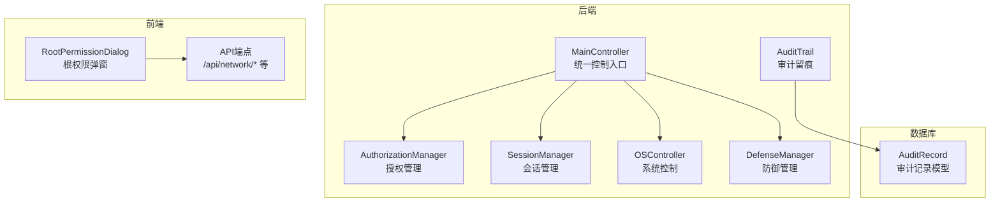
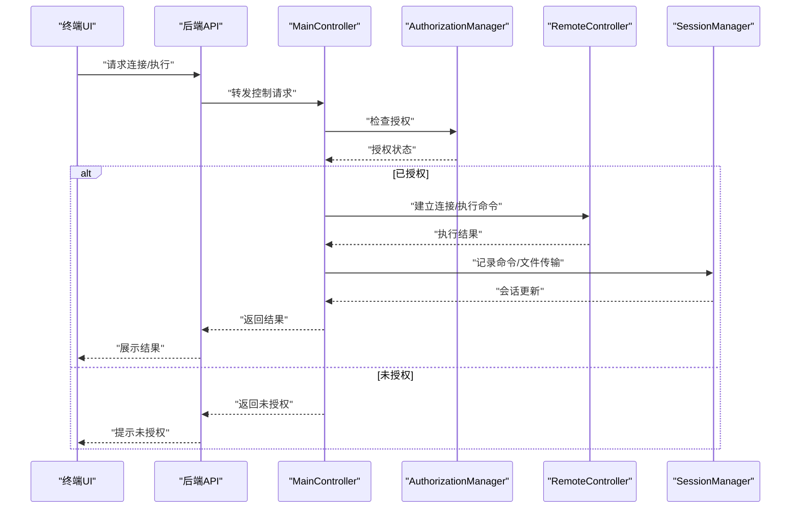
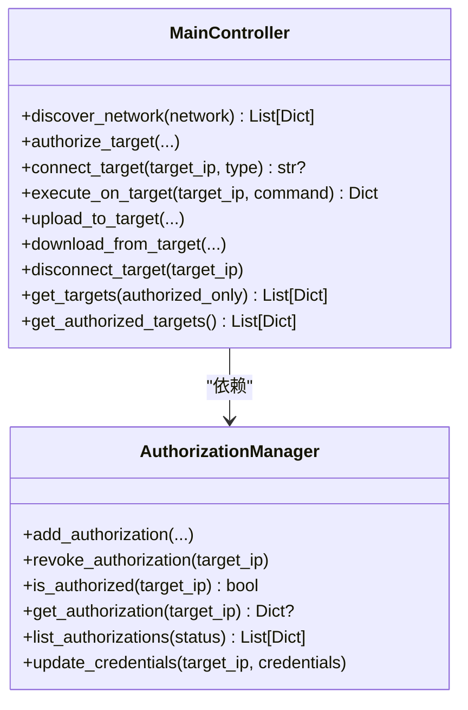
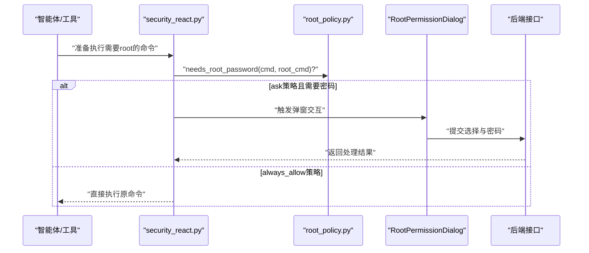
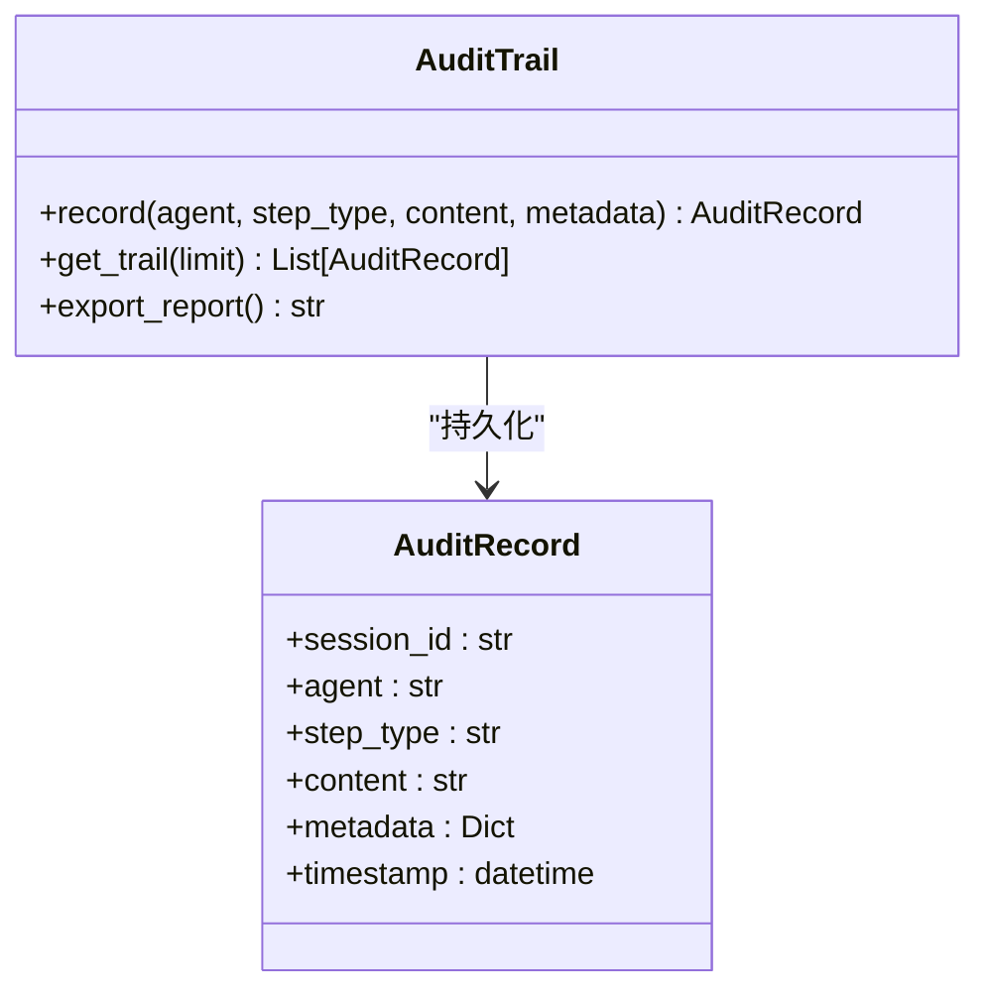
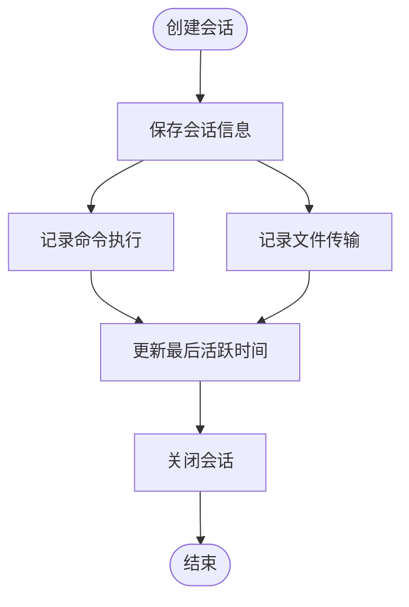
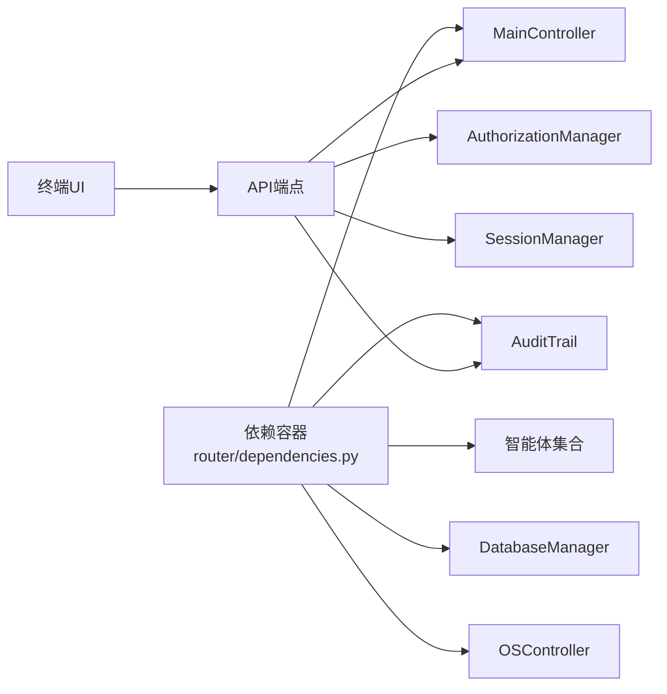

# 安全与权限

<cite>
**本文引用的文件**
- [authorization.py](file://controller/authorization.py)
- [root_policy.py](file://utils/root_policy.py)
- [audit.py](file://utils/audit.py)
- [dependencies.py](file://router/dependencies.py)
- [controller.py](file://controller/controller.py)
- [models.py](file://database/models.py)
- [session_manager.py](file://controller/session_manager.py)
- [controller.py](file://system/controller.py)
- [SECURITY_WARNING.md](file://docs/SECURITY_WARNING.md)
- [DOCKER_SETUP.md](file://docs/DOCKER_SETUP.md)
- [APP.md](file://docs/APP.md)
- [RootPermissionDialog.tsx](file://terminal-ui/src/components/RootPermissionDialog.tsx)
- [security_react.py](file://core/patterns/security_react.py)
- [countermeasure.py](file://defense/countermeasure.py)
- [endpoints.ts](file://app/src/api/endpoints.ts)
</cite>

## 目录
1. [引言](#引言)
2. [项目结构](#项目结构)
3. [核心组件](#核心组件)
4. [架构总览](#架构总览)
5. [组件详解](#组件详解)
6. [依赖关系分析](#依赖关系分析)
7. [性能考量](#性能考量)
8. [故障排查指南](#故障排查指南)
9. [结论](#结论)
10. [附录](#附录)

## 引言
本文件聚焦Secbot的安全与权限系统，围绕“根权限策略”“操作审计机制”“授权与访问控制”“安全策略实施”“合规与法律风险”“安全配置与部署”“事件处置与应急响应”“安全开发最佳实践”等方面展开，既面向技术读者，也兼顾非技术读者的理解需求。文档严格基于仓库现有实现与文档进行分析与总结。

## 项目结构
Secbot采用前后端分离与多模块协作的架构：Python后端提供核心控制器、授权与审计、系统控制、防御与扫描等功能；终端UI通过REST/SSE与后端交互；数据库模型与会话管理支撑审计与操作留痕；安全策略通过根权限配置与前端弹窗交互落地。

**图表来源**
- [controller.py](file://controller/controller.py#L14-L245)
- [authorization.py](file://controller/authorization.py#L11-L120)
- [audit.py](file://utils/audit.py#L12-L105)
- [session_manager.py](file://controller/session_manager.py#L9-L91)
- [models.py](file://database/models.py#L80-L90)
- [controller.py](file://system/controller.py#L10-L127)
- [RootPermissionDialog.tsx](file://terminal-ui/src/components/RootPermissionDialog.tsx#L18-L149)
- [endpoints.ts](file://app/src/api/endpoints.ts#L47-L93)

**章节来源**
- [controller.py](file://controller/controller.py#L14-L245)
- [authorization.py](file://controller/authorization.py#L11-L120)
- [audit.py](file://utils/audit.py#L12-L105)
- [session_manager.py](file://controller/session_manager.py#L9-L91)
- [models.py](file://database/models.py#L80-L90)
- [controller.py](file://system/controller.py#L10-L127)
- [RootPermissionDialog.tsx](file://terminal-ui/src/components/RootPermissionDialog.tsx#L18-L149)
- [endpoints.ts](file://app/src/api/endpoints.ts#L47-L93)

## 核心组件
- 授权管理：集中维护目标主机授权状态、凭据与有效期，贯穿网络发现、连接与执行流程。
- 根权限策略：持久化存储root命令与策略（询问/始终允许），在命令执行前进行策略判定与交互。
- 审计留痕：记录ReAct各阶段（思考/行动/观察/确认/拒绝/结果）与元数据，支持导出报告。
- 会话管理：跟踪目标连接会话、命令执行与文件传输，便于审计与溯源。
- 系统控制：统一抽象本机系统操作接口，提供文件、进程、网络、环境变量等能力。
- 防御与响应：自动封禁、速率限制、连接关闭与管理员告警，形成闭环响应。

**章节来源**
- [authorization.py](file://controller/authorization.py#L11-L120)
- [root_policy.py](file://utils/root_policy.py#L18-L54)
- [audit.py](file://utils/audit.py#L12-L105)
- [session_manager.py](file://controller/session_manager.py#L9-L91)
- [controller.py](file://system/controller.py#L10-L127)
- [countermeasure.py](file://defense/countermeasure.py#L147-L215)

## 架构总览
后端通过MainController统一编排网络发现、授权、远程控制与会话管理；审计通过全局单例注入到智能体与系统操作中；根权限策略在命令执行前触发前端弹窗交互，确保最小权限与可追溯。

**图表来源**
- [controller.py](file://controller/controller.py#L25-L221)
- [authorization.py](file://controller/authorization.py#L76-L95)
- [session_manager.py](file://controller/session_manager.py#L49-L69)

**章节来源**
- [controller.py](file://controller/controller.py#L25-L221)
- [authorization.py](file://controller/authorization.py#L76-L95)
- [session_manager.py](file://controller/session_manager.py#L49-L69)

## 组件详解

### 授权与访问控制
- 授权实体包含目标IP、授权类型（全量/受限/只读）、凭据、创建/过期时间、状态与描述。
- 授权检查在连接与执行前进行，过期自动标记为失效。
- 支持凭据增量更新与授权列表筛选，便于运维与审计。

**图表来源**
- [authorization.py](file://controller/authorization.py#L11-L120)
- [controller.py](file://controller/controller.py#L14-L245)

**章节来源**
- [authorization.py](file://controller/authorization.py#L41-L120)
- [controller.py](file://controller/controller.py#L36-L243)

### 根权限策略与交互
- 策略持久化：root命令与策略（询问/始终允许）保存在用户主目录配置文件中。
- 命令判定：当命令以root命令开头时，依据策略决定是否需要交互与密码注入。
- 前端弹窗：终端UI提供“执行一次/总是允许/拒绝”的交互，支持输入密码并提交至后端。

**图表来源**
- [security_react.py](file://core/patterns/security_react.py#L1112-L1156)
- [root_policy.py](file://utils/root_policy.py#L18-L54)
- [RootPermissionDialog.tsx](file://terminal-ui/src/components/RootPermissionDialog.tsx#L18-L81)

**章节来源**
- [root_policy.py](file://utils/root_policy.py#L18-L54)
- [RootPermissionDialog.tsx](file://terminal-ui/src/components/RootPermissionDialog.tsx#L18-L149)
- [security_react.py](file://core/patterns/security_react.py#L1112-L1156)

### 操作审计机制
- 审计留痕覆盖ReAct各阶段，记录会话ID、智能体、步骤类型、内容与元数据。
- 支持内存缓存与数据库持久化，提供Markdown格式审计报告导出。
- 审计记录模型与数据库层解耦，便于扩展与迁移。

**图表来源**
- [audit.py](file://utils/audit.py#L12-L105)
- [models.py](file://database/models.py#L80-L90)

**章节来源**
- [audit.py](file://utils/audit.py#L21-L105)
- [models.py](file://database/models.py#L80-L90)

### 会话与操作追踪
- 会话创建包含目标IP、连接类型、授权信息与活动时间戳。
- 记录命令执行与文件传输，支持按目标检索与状态过滤。
- 会话生命周期管理（创建/活跃更新/关闭）与审计联动。

**图表来源**
- [session_manager.py](file://controller/session_manager.py#L15-L76)

**章节来源**
- [session_manager.py](file://controller/session_manager.py#L15-L91)

### 系统控制与最小权限
- 统一抽象系统操作接口，涵盖文件、进程、网络、环境变量与路径操作。
- 执行过程捕获异常并返回结构化结果，避免直接暴露系统细节。
- 与根权限策略配合，确保高危操作受控。

**章节来源**
- [controller.py](file://system/controller.py#L24-L127)

### 防御与自动响应
- 针对暴力破解、DoS、端口扫描等攻击类型，采取封禁IP、速率限制、关闭连接与管理员告警。
- 响应动作纳入历史记录，便于审计与复盘。

**章节来源**
- [countermeasure.py](file://defense/countermeasure.py#L147-L215)

## 依赖关系分析
- 全局依赖容器通过单例延迟初始化核心服务，避免导入时重模块加载。
- 审计留痕贯穿智能体与系统控制，形成统一的审计入口。
- 前端通过API端点与后端交互，授权与网络发现等关键接口均在前端有对应调用封装。

**图表来源**
- [dependencies.py](file://router/dependencies.py#L34-L135)
- [endpoints.ts](file://app/src/api/endpoints.ts#L47-L93)

**章节来源**
- [dependencies.py](file://router/dependencies.py#L34-L194)
- [endpoints.ts](file://app/src/api/endpoints.ts#L47-L93)

## 性能考量
- 延迟初始化单例：减少启动时重模块加载，提升冷启动效率。
- 内存缓存审计记录：降低数据库压力，提高实时展示性能。
- 会话活动时间戳：便于清理长时间无活动会话，释放资源。
- 建议：对大规模网络发现与扫描场景，结合分批处理与并发控制，避免阻塞主线程。

[本节为一般性建议，不直接分析具体文件]

## 故障排查指南
- 授权相关
  - 现象：连接/执行返回未授权
  - 排查：确认目标是否已授权、状态是否有效、凭据是否正确
  - 参考：授权检查与状态更新逻辑
- 审计相关
  - 现象：审计记录未落库或导出为空
  - 排查：检查数据库连接、表结构与写入异常日志
  - 参考：审计写入与导出流程
- 根权限相关
  - 现象：命令执行被拒绝或密码输入无效
  - 排查：确认策略配置、前端弹窗交互是否成功提交、密码注入方式
  - 参考：根权限策略与前端弹窗交互
- 会话相关
  - 现象：命令未记录或文件传输未统计
  - 排查：确认会话ID、活动更新与记录写入
  - 参考：会话管理与记录方法

**章节来源**
- [authorization.py](file://controller/authorization.py#L76-L95)
- [audit.py](file://utils/audit.py#L46-L50)
- [root_policy.py](file://utils/root_policy.py#L18-L54)
- [RootPermissionDialog.tsx](file://terminal-ui/src/components/RootPermissionDialog.tsx#L68-L81)
- [session_manager.py](file://controller/session_manager.py#L49-L69)

## 结论
Secbot的安全与权限体系以“最小权限、全程留痕、可追溯、可响应”为核心设计原则：通过授权管理与根权限策略实现访问控制与提权约束；通过审计留痕与会话追踪实现操作可审计；通过防御与自动响应形成闭环。结合合规警示与部署文档，可为生产环境提供较为完整且可落地的安全基线。

[本节为总结性内容，不直接分析具体文件]

## 附录

### 合规与法律风险
- 使用须知：仅在获得明确授权的范围内进行安全测试，遵守法律法规。
- 记录与报告：所有测试操作会被记录，发现漏洞应及时上报。
- 免责声明：开发者不对未经授权或违规使用造成的后果负责。

**章节来源**
- [SECURITY_WARNING.md](file://docs/SECURITY_WARNING.md#L1-L73)

### 安全配置与部署
- 数据库：默认使用SQLite，无需外部数据库容器。
- 前端应用：跨平台移动应用通过REST/SSE与后端通信，生产建议使用HTTPS。
- 部署：提供构建与发布脚本，支持打包与安装。

**章节来源**
- [DOCKER_SETUP.md](file://docs/DOCKER_SETUP.md#L1-L14)
- [APP.md](file://docs/APP.md#L1-L309)

### 安全事件处理与应急响应
- 建议流程：发现异常→封禁/限流→告警→调查→修复→复盘→审计报告。
- 工具支持：防御模块提供封禁、速率限制、连接关闭与告警能力。
- 审计支撑：审计留痕与会话记录为事件调查提供证据链。

**章节来源**
- [countermeasure.py](file://defense/countermeasure.py#L147-L215)
- [audit.py](file://utils/audit.py#L58-L105)
- [session_manager.py](file://controller/session_manager.py#L49-L69)

### 安全开发最佳实践
- 输入验证：对所有外部输入进行白名单与长度限制。
- 权限控制：最小权限原则，严格区分授权范围与执行范围。
- 数据加密：使用标准加密库（如cryptography）进行敏感数据处理。
- 日志审计：统一审计入口，避免敏感信息泄露。
- 依赖安全：定期更新依赖，修复已知漏洞。

**章节来源**
- [uv.lock](file://uv.lock#L581-L592)
- [APP.md](file://docs/APP.md#L282-L288)