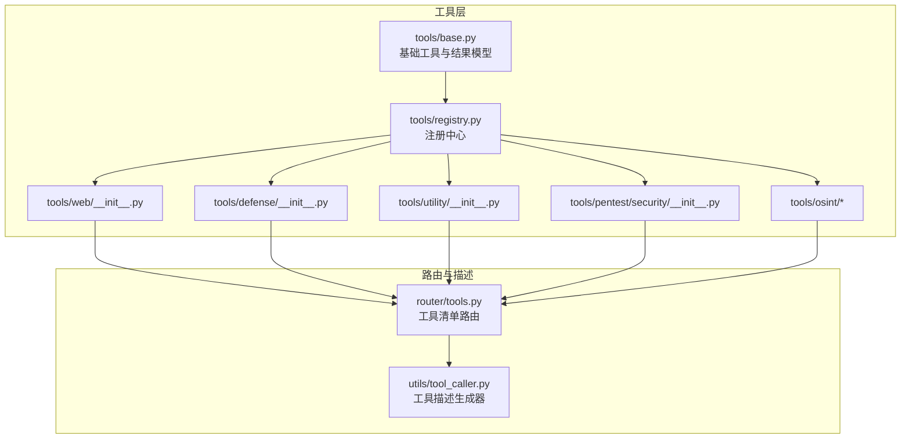
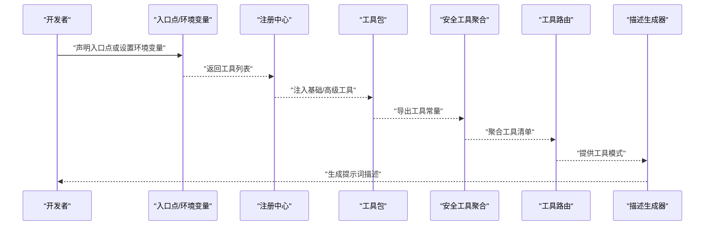
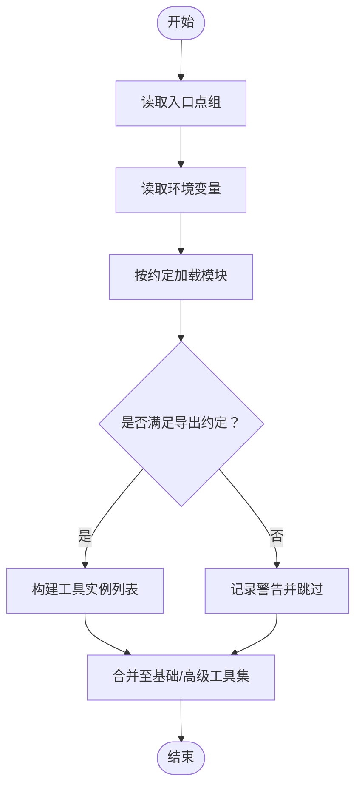
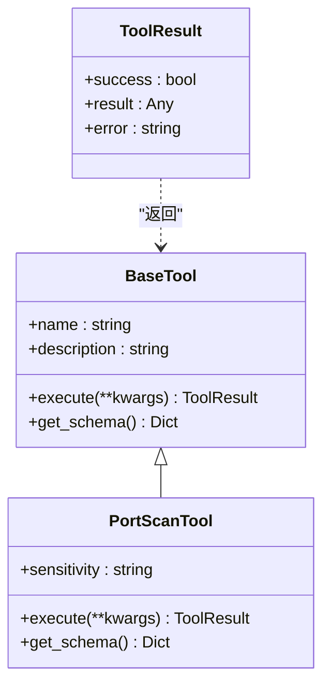
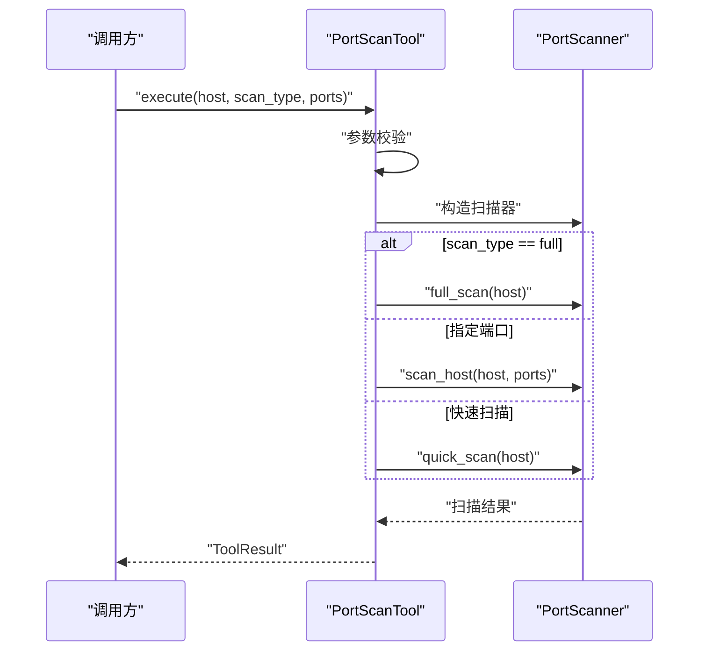
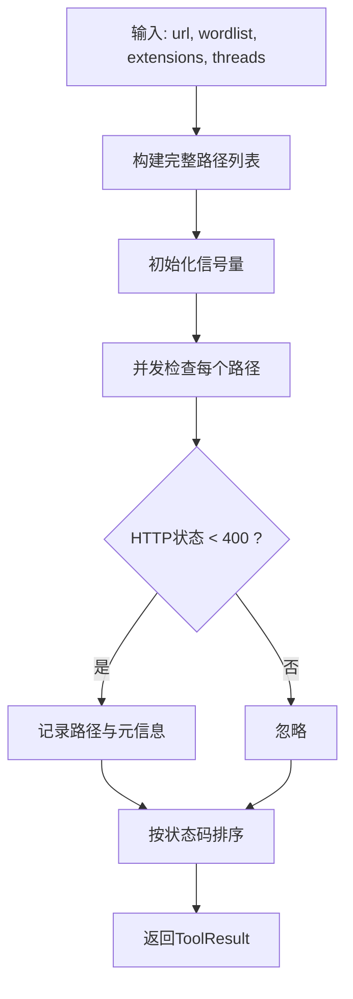
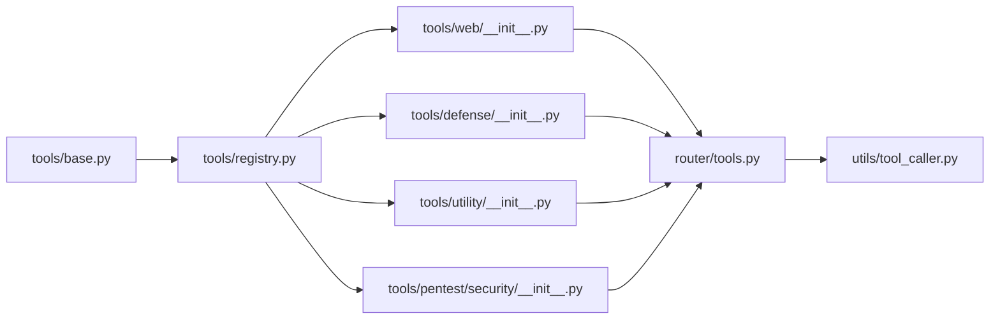

# 工具系统

<cite>
**本文引用的文件**
- [tools/base.py](file://tools/base.py)
- [tools/registry.py](file://tools/registry.py)
- [router/tools.py](file://router/tools.py)
- [utils/tool_caller.py](file://utils/tool_caller.py)
- [tools/pentest/security/__init__.py](file://tools/pentest/security/__init__.py)
- [tools/web/__init__.py](file://tools/web/__init__.py)
- [tools/defense/__init__.py](file://tools/defense/__init__.py)
- [tools/utility/__init__.py](file://tools/utility/__init__.py)
- [docs/TOOL_EXTENSION.md](file://docs/TOOL_EXTENSION.md)
- [tools/pentest/security/port_scan_tool.py](file://tools/pentest/security/port_scan_tool.py)
- [tools/web/dir_bruteforce_tool.py](file://tools/web/dir_bruteforce_tool.py)
- [tools/defense/system_info_tool.py](file://tools/defense/system_info_tool.py)
- [tools/utility/cve_lookup_tool.py](file://tools/utility/cve_lookup_tool.py)
- [tools/osint/cert_transparency_tool.py](file://tools/osint/cert_transparency_tool.py)
</cite>

## 目录
1. [简介](#简介)
2. [项目结构](#项目结构)
3. [核心组件](#核心组件)
4. [架构总览](#架构总览)
5. [详细组件分析](#详细组件分析)
6. [依赖分析](#依赖分析)
7. [性能考虑](#性能考虑)
8. [故障排查指南](#故障排查指南)
9. [结论](#结论)
10. [附录](#附录)

## 简介
本文件面向Secbot工具系统，提供从架构到实现细节的完整技术文档。内容涵盖工具注册机制、工具接口设计、参数校验与处理流程，并对网络工具、Web工具、攻击工具、防御工具、OSINT工具、实用工具、协议工具与工具扩展机制进行系统性梳理。同时给出最佳实践与安全注意事项，帮助开发者快速上手并安全地扩展工具生态。

## 项目结构
Secbot采用“模块化工具包 + 注册中心 + 路由聚合”的组织方式：
- 工具基类与结果模型位于 tools/base.py
- 工具注册中心位于 tools/registry.py，支持入口点与环境变量两种扩展方式
- 各类工具包在 tools/* 下按功能域划分（如 web、defense、utility、osint 等）
- 工具路由聚合位于 router/tools.py，统一对外暴露工具清单
- 工具描述生成器位于 utils/tool_caller.py，为Agent提供提示词级工具描述

图表来源
- [tools/base.py](file://tools/base.py#L1-L36)
- [tools/registry.py](file://tools/registry.py#L1-L142)
- [tools/web/__init__.py](file://tools/web/__init__.py#L1-L31)
- [tools/defense/__init__.py](file://tools/defense/__init__.py#L1-L23)
- [tools/utility/__init__.py](file://tools/utility/__init__.py#L1-L36)
- [tools/pentest/security/__init__.py](file://tools/pentest/security/__init__.py#L1-L86)
- [router/tools.py](file://router/tools.py#L1-L75)
- [utils/tool_caller.py](file://utils/tool_caller.py#L1-L119)

章节来源
- [tools/base.py](file://tools/base.py#L1-L36)
- [tools/registry.py](file://tools/registry.py#L1-L142)
- [router/tools.py](file://router/tools.py#L1-L75)

## 核心组件
- 基础工具类与结果模型
  - 工具基类提供统一的异步执行接口与模式描述能力；工具结果模型封装成功标志、结果数据与错误信息，便于上层统一处理。
- 工具注册中心
  - 支持两类扩展来源：setuptools入口点与环境变量；自动发现工具列表，兼容多种导出约定（常量列表、工厂函数、类实例化）。
- 工具包聚合
  - 各功能域工具包以常量列表形式导出，统一纳入安全工具包，再由路由聚合输出。
- 工具描述生成器
  - 将工具模式转换为自然语言或Markdown格式，供Agent提示词使用，提升工具可见性与可调用性。

章节来源
- [tools/base.py](file://tools/base.py#L9-L36)
- [tools/registry.py](file://tools/registry.py#L28-L142)
- [tools/pentest/security/__init__.py](file://tools/pentest/security/__init__.py#L33-L72)
- [utils/tool_caller.py](file://utils/tool_caller.py#L10-L119)

## 架构总览
下图展示工具系统从注册到路由再到描述生成的整体流程：

图表来源
- [tools/registry.py](file://tools/registry.py#L67-L125)
- [tools/pentest/security/__init__.py](file://tools/pentest/security/__init__.py#L44-L72)
- [router/tools.py](file://router/tools.py#L43-L74)
- [utils/tool_caller.py](file://utils/tool_caller.py#L23-L109)

## 详细组件分析

### 工具注册机制与扩展
- 扩展方式
  - 入口点：在扩展包的配置中声明 secbot.tools.basic 或 secbot.tools.advanced，指向模块中的工具列表或工厂函数。
  - 环境变量：通过 SECBOT_TOOL_MODULES 和 SECBOT_TOOL_MODULES_ADVANCED 动态注入模块路径，模块需满足若干导出约定之一。
- 自动发现策略
  - 优先查找常量属性（TOOLS 或以 _TOOLS 结尾的集合），其次查找工厂函数 get_tools，最后扫描继承自 BaseTool 的类并自动实例化。
- 敏感度标注
  - 工具可选标注 sensitivity 字段，用于区分基础与高级工具，高级工具在特定模式下需要用户确认。

图表来源
- [tools/registry.py](file://tools/registry.py#L28-L103)
- [docs/TOOL_EXTENSION.md](file://docs/TOOL_EXTENSION.md#L5-L59)

章节来源
- [tools/registry.py](file://tools/registry.py#L1-L142)
- [docs/TOOL_EXTENSION.md](file://docs/TOOL_EXTENSION.md#L1-L59)

### 工具接口设计与参数校验
- 接口规范
  - 工具必须继承基础工具类，实现异步执行方法与模式描述方法；模式描述包含名称、描述与参数Schema。
  - 工具结果模型统一返回成功标志、结果数据与错误信息，便于上层统一处理。
- 参数校验与处理
  - 在工具内部进行参数校验与默认值处理；异常捕获并封装为工具结果模型，避免上抛未处理异常。
  - 对外部依赖（如网络请求）采用异步执行与超时控制，确保稳定性。

图表来源
- [tools/base.py](file://tools/base.py#L16-L36)
- [tools/pentest/security/port_scan_tool.py](file://tools/pentest/security/port_scan_tool.py#L6-L49)

章节来源
- [tools/base.py](file://tools/base.py#L9-L36)
- [tools/pentest/security/port_scan_tool.py](file://tools/pentest/security/port_scan_tool.py#L17-L37)

### 工具分类与功能概览
- 网络工具
  - 端口扫描、服务检测、ARP扫描、Ping Sweep、Traceroute、DNS查询、Whois查询、Banner抓取、SSL分析、子域枚举等。
- Web工具
  - 目录暴力破解、WAF检测、技术栈识别、安全头分析、CORS检测、JWT分析、参数Fuzzer、SSRF检测等。
- 攻击工具
  - 渗透测试、漏洞扫描、服务检测、端口扫描、利用工具等（部分工具需用户确认）。
- 防御工具
  - 自检扫描、漏洞扫描、网络分析、入侵检测、系统信息收集等。
- OSINT工具
  - 证书透明度查询、凭据泄露检测、Shodan查询、VirusTotal查询等。
- 实用工具
  - 哈希计算、编码解码、IP地理定位、文件分析、CVE查询、日志分析、密码审计、敏感信息扫描、依赖审计、Payload生成等。
- 协议工具
  - MySQL探测、Redis探测、SMB枚举、SNMP查询等。
- 报告与云安全
  - 报告生成、云资源信息收集等。

章节来源
- [router/tools.py](file://router/tools.py#L27-L40)
- [tools/web/__init__.py](file://tools/web/__init__.py#L1-L31)
- [tools/defense/__init__.py](file://tools/defense/__init__.py#L1-L23)
- [tools/utility/__init__.py](file://tools/utility/__init__.py#L1-L36)
- [tools/pentest/security/__init__.py](file://tools/pentest/security/__init__.py#L33-L72)

### 典型工具实现解析

#### 网络工具：端口扫描
- 功能要点
  - 支持快速扫描、全端口扫描与指定端口扫描；根据输入参数选择不同扫描策略。
  - 参数校验严格，缺失必要参数时直接返回错误；异常捕获并封装为工具结果。
- 处理流程
  - 解析参数 → 选择扫描器 → 执行扫描 → 汇总结果 → 返回工具结果。

图表来源
- [tools/pentest/security/port_scan_tool.py](file://tools/pentest/security/port_scan_tool.py#L17-L37)

章节来源
- [tools/pentest/security/port_scan_tool.py](file://tools/pentest/security/port_scan_tool.py#L1-L50)

#### Web工具：目录暴力破解
- 功能要点
  - 支持内置常见路径字典与自定义扩展名组合；通过信号量控制并发，避免过度占用资源。
  - 对HTTP响应进行过滤与排序，输出命中路径与元信息。
- 处理流程
  - 构造路径列表 → 并发请求 → 过滤响应 → 排序汇总 → 返回结果。

图表来源
- [tools/web/dir_bruteforce_tool.py](file://tools/web/dir_bruteforce_tool.py#L53-L115)

章节来源
- [tools/web/dir_bruteforce_tool.py](file://tools/web/dir_bruteforce_tool.py#L1-L131)

#### 防御工具：系统信息收集
- 功能要点
  - 支持按类别收集系统、网络、进程、用户信息；对各子任务分别捕获异常，避免整体失败。
- 处理流程
  - 解析类别参数 → 逐项采集 → 汇总结果与部分错误 → 返回工具结果。

章节来源
- [tools/defense/system_info_tool.py](file://tools/defense/system_info_tool.py#L17-L52)

#### 实用工具：CVE查询
- 功能要点
  - 支持按CVE编号查询与关键词/产品搜索；解析CVSS评分、受影响产品与参考链接等字段。
- 处理流程
  - 解析参数 → 选择查询路径 → 异步拉取数据 → 结构化结果 → 返回工具结果。

章节来源
- [tools/utility/cve_lookup_tool.py](file://tools/utility/cve_lookup_tool.py#L19-L37)

#### OSINT工具：证书透明度查询
- 功能要点
  - 通过证书透明度日志查询域名相关证书，提取唯一子域名与近期证书摘要。
- 处理流程
  - 参数校验 → 构造请求 → 异步获取JSON → 去重与排序 → 返回工具结果。

章节来源
- [tools/osint/cert_transparency_tool.py](file://tools/osint/cert_transparency_tool.py#L24-L73)

### 工具描述生成器
- 能力概述
  - 将工具模式转换为纯文本或Markdown格式，支持摘要、优化提示词格式等多形态输出。
  - 为Agent提示词提供清晰的工具清单与参数说明，降低调用门槛。
- 输出形态
  - 文本描述：简洁罗列工具名称与描述，附带参数Schema。
  - Markdown描述：标题+描述+参数表格，适合文档化展示。
  - 优化提示词：面向Agent的系统提示词风格，强调参数类型、必填与默认值。

章节来源
- [utils/tool_caller.py](file://utils/tool_caller.py#L23-L109)

## 依赖分析
- 组件耦合
  - 工具基类与结果模型提供低耦合抽象，具体工具实现仅依赖该抽象。
  - 注册中心与工具包之间通过约定解耦，新增工具无需修改现有聚合逻辑。
  - 路由聚合依赖工具包导出常量，保持稳定的对外接口。
- 外部依赖
  - 工具实现可能依赖扫描器、网络库、外部API等；建议在工具内部进行超时与异常处理。
- 循环依赖
  - 当前结构未见循环导入；注册中心与工具包通过约定解耦，避免相互依赖。

图表来源
- [tools/base.py](file://tools/base.py#L16-L36)
- [tools/registry.py](file://tools/registry.py#L106-L134)
- [tools/web/__init__.py](file://tools/web/__init__.py#L14-L23)
- [tools/defense/__init__.py](file://tools/defense/__init__.py#L10-L16)
- [tools/utility/__init__.py](file://tools/utility/__init__.py#L16-L27)
- [tools/pentest/security/__init__.py](file://tools/pentest/security/__init__.py#L44-L72)
- [router/tools.py](file://router/tools.py#L43-L74)
- [utils/tool_caller.py](file://utils/tool_caller.py#L13-L21)

章节来源
- [tools/registry.py](file://tools/registry.py#L106-L134)
- [router/tools.py](file://router/tools.py#L27-L40)

## 性能考虑
- 并发控制
  - 对高并发场景（如目录暴力破解）使用信号量限制并发度，避免触发目标防护或自身资源耗尽。
- 异步执行
  - 网络请求与外部API调用采用异步执行与线程池配合，减少阻塞时间。
- 超时与重试
  - 为外部请求设置合理超时；对可重试的错误进行有限重试，避免长时间挂起。
- 结果缓存
  - 对重复查询（如CVE、证书透明度）可考虑本地缓存，降低重复请求成本。
- 资源释放
  - 在工具内部确保连接、句柄等资源及时释放，避免泄漏。

## 故障排查指南
- 工具无法被发现
  - 检查入口点声明与环境变量设置是否正确；确认模块导出符合约定（常量列表、工厂函数、类实例化）。
- 工具参数错误
  - 查看工具Schema与调用参数是否匹配；关注必填参数与默认值。
- 执行异常
  - 捕获异常并返回工具结果模型；查看错误信息定位问题来源（网络、权限、超时等）。
- 性能问题
  - 调整并发度、增加超时阈值、启用缓存；对高频工具进行限流或队列化。

章节来源
- [tools/registry.py](file://tools/registry.py#L28-L103)
- [tools/web/dir_bruteforce_tool.py](file://tools/web/dir_bruteforce_tool.py#L73-L102)
- [tools/utility/cve_lookup_tool.py](file://tools/utility/cve_lookup_tool.py#L89-L92)

## 结论
Secbot工具系统通过统一的基类抽象、灵活的注册机制与清晰的工具包划分，实现了高度可扩展的安全工具生态。结合路由聚合与描述生成器，系统既保证了工具的易用性，也为Agent提供了良好的上下文支持。遵循本文的最佳实践与安全注意事项，可在保障稳定性的前提下快速扩展工具能力。

## 附录
- 自定义开发指导
  - 继承基础工具类，实现异步执行与模式描述；在工具Schema中明确参数类型、必填与默认值。
  - 通过入口点或环境变量注册工具，无需修改现有聚合逻辑。
  - 对外部依赖进行超时与异常处理，必要时引入并发控制与缓存策略。
- 最佳实践
  - 明确工具敏感度，对高风险工具在高级模式下要求用户确认。
  - 为Agent提供清晰的工具描述与参数说明，提升可解释性。
  - 对高频工具进行限流与去重，避免对目标系统造成压力。
- 安全注意事项
  - 严格遵守目标授权范围，避免越权扫描或探测。
  - 对外部API请求设置合理的User-Agent与速率限制，尊重服务端策略。
  - 对工具输出进行脱敏处理，避免泄露敏感信息。

章节来源
- [docs/TOOL_EXTENSION.md](file://docs/TOOL_EXTENSION.md#L49-L59)
- [tools/pentest/security/port_scan_tool.py](file://tools/pentest/security/port_scan_tool.py#L9-L15)
- [tools/web/dir_bruteforce_tool.py](file://tools/web/dir_bruteforce_tool.py#L53-L60)
- [tools/utility/cve_lookup_tool.py](file://tools/utility/cve_lookup_tool.py#L19-L34)