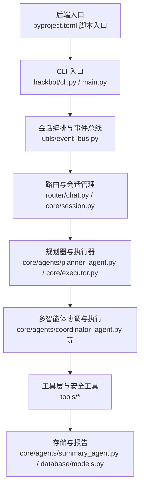
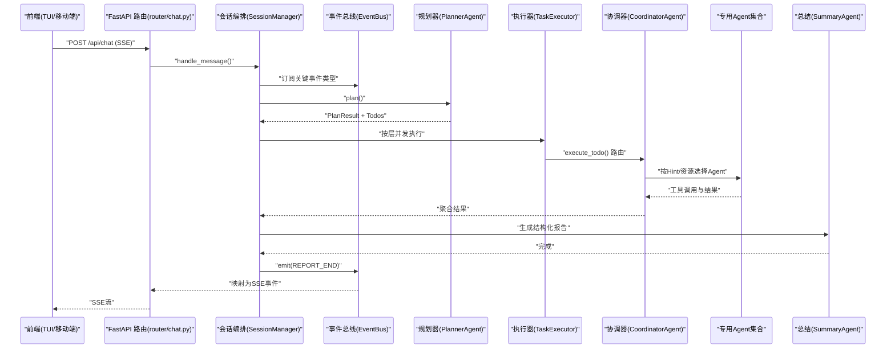
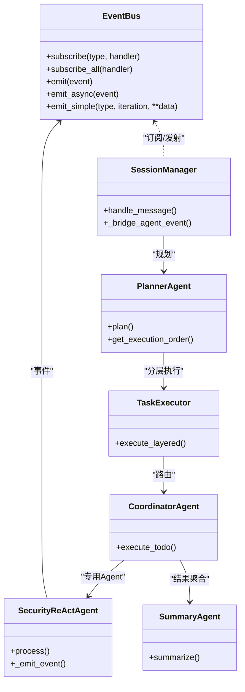
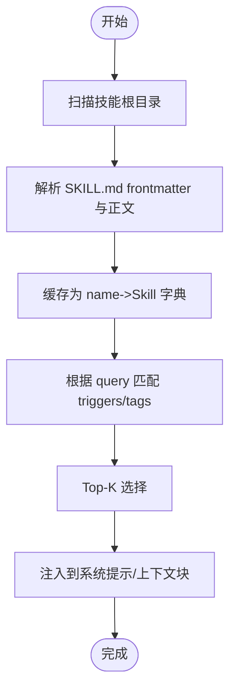
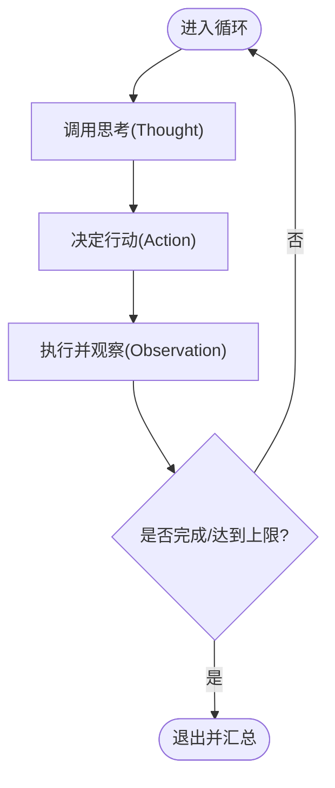
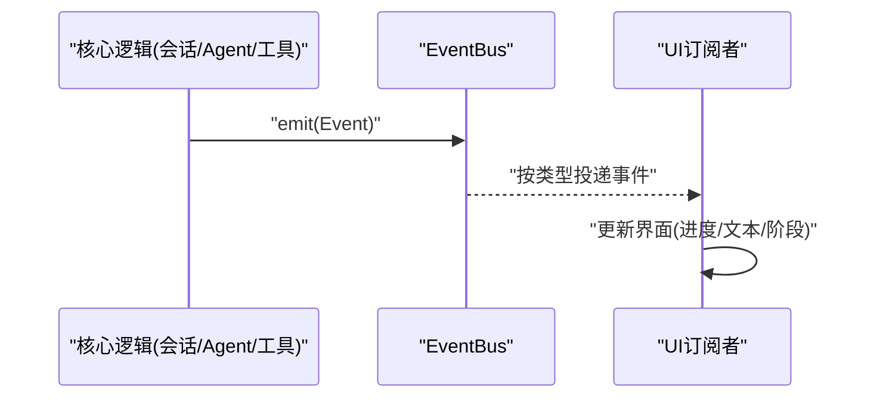
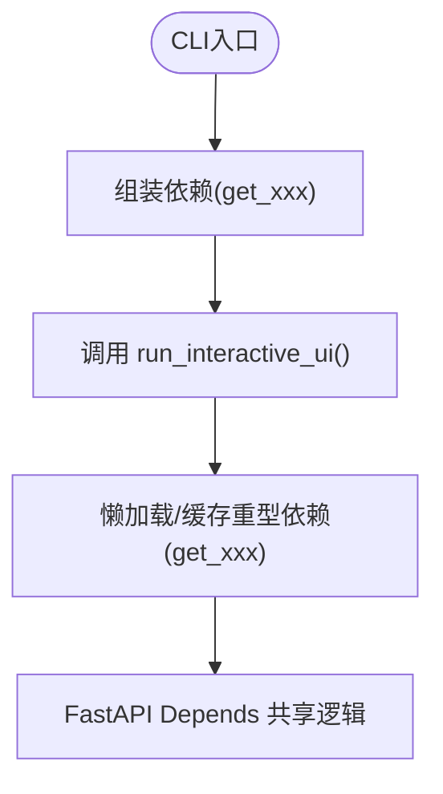
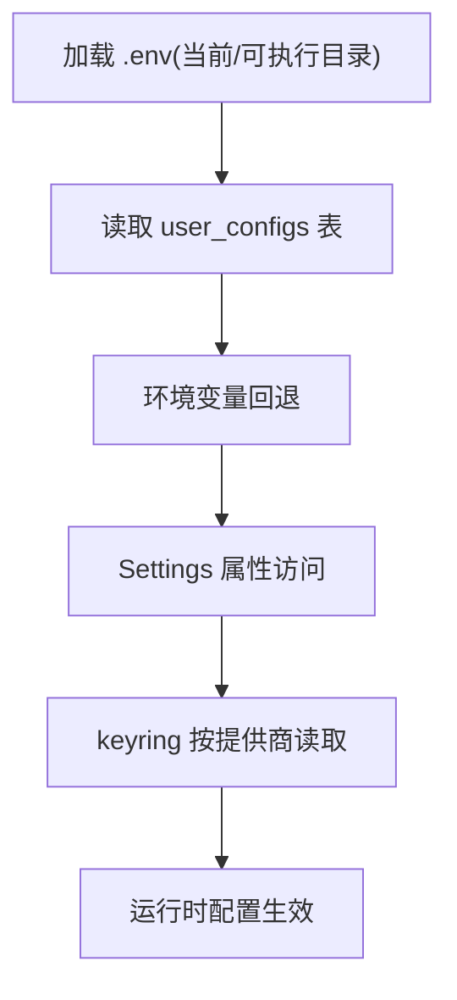
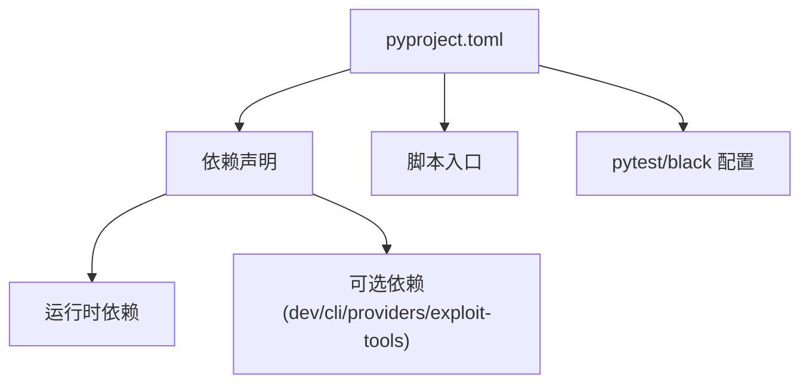

# 代码规范

<cite>
**本文引用的文件**
- [README_EN.md](file://README_EN.md)
- [README_CN.md](file://README_CN.md)
- [pyproject.toml](file://pyproject.toml)
- [main.py](file://main.py)
- [hackbot/cli.py](file://hackbot/cli.py)
- [hackbot_config/__init__.py](file://hackbot_config/__init__.py)
- [utils/config_storage.py](file://utils/config_storage.py)
- [utils/logger.py](file://utils/logger.py)
- [utils/event_bus.py](file://utils/event_bus.py)
- [docs/design-paradigms/commit-conventions.md](file://docs/design-paradigms/commit-conventions.md)
- [docs/design-paradigms/react-and-tool-calling.md](file://docs/design-paradigms/react-and-tool-calling.md)
- [docs/design-paradigms/skill-plugin-system.md](file://docs/design-paradigms/skill-plugin-system.md)
- [docs/design-paradigms/session-and-events.md](file://docs/design-paradigms/session-and-events.md)
- [docs/design-paradigms/cli-and-dependencies.md](file://docs/design-paradigms/cli-and-dependencies.md)
</cite>

## 目录
1. [引言](#引言)
2. [项目结构](#项目结构)
3. [核心组件](#核心组件)
4. [架构总览](#架构总览)
5. [详细组件分析](#详细组件分析)
6. [依赖分析](#依赖分析)
7. [性能考量](#性能考量)
8. [故障排查指南](#故障排查指南)
9. [结论](#结论)
10. [附录](#附录)

## 引言
本文件面向Secbot项目的开发者与贡献者，系统化制定Python与TypeScript代码规范、文档与注释标准，深入阐释多智能体架构设计原则、技能/插件系统开发规范、ReAct与工具调用的实现模式、会话与事件系统的设计理念、CLI入口与依赖管理的最佳实践、配置与环境管理规范，以及提示词管理的约定与最佳实践。文档以仓库现有实现为依据，结合设计范式文档，形成可落地、可复用、可测试的工程规范。

## 项目结构
- 语言与栈
  - 后端：Python 3.10+，FastAPI + Uvicorn，事件总线与会话编排，多智能体与工具链集成。
  - 前端：TypeScript/React Ink终端界面，通过HTTP/SSE与后端通信。
- 包与模块组织
  - 核心领域：core.agents、core.patterns、core.memory、core.vuln_db、core.attack_chain、router、utils、tools、skills、prompts、database、scanner、defense、payloads、system、controller、crawler、hackbot、hackbot_config。
  - 前端与终端UI：terminal-ui、app/src。
- 依赖与入口
  - 依赖管理：pyproject.toml集中声明，支持可选依赖与脚本入口。
  - CLI入口：hackbot/secbot命令与main.py全屏TUI入口，支持--backend/--tui分离调试。
- 文档与设计范式
  - docs/design-paradigms下提供可复用的设计范式，涵盖提交规范、ReAct与工具调用、技能/插件系统、会话与事件、CLI与依赖注入。

**图表来源**
- [pyproject.toml](file://pyproject.toml#L90-L98)
- [hackbot/cli.py](file://hackbot/cli.py#L32-L80)
- [main.py](file://main.py#L44-L62)
- [utils/event_bus.py](file://utils/event_bus.py#L68-L187)

**章节来源**
- [pyproject.toml](file://pyproject.toml#L1-L165)
- [README_EN.md](file://README_EN.md#L203-L294)
- [README_CN.md](file://README_CN.md#L279-L387)

## 核心组件
- 事件总线（EventBus）
  - 事件类型枚举化，统一事件载体，支持同步/异步发射与全局订阅，保障核心逻辑与UI解耦。
- 会话编排器（SessionManager）
  - 路由、规划、执行三阶段编排，桥接Agent回调与事件流，支撑多Agent并行与回退兼容模式。
- 规划器（PlannerAgent）
  - Todo分解与拓扑排序，资源/风险感知的分层并行计划生成。
- 执行器（TaskExecutor）
  - 按层并发执行，上下文聚合（按Todo与按Resource），保证前端展示顺序与规划一致。
- 协调器（CoordinatorAgent）
  - 基于Hint与资源选择专职Agent，路由与结果聚合，不直接运行工具。
- 专用Agent（Network/Web/OSINT/Terminal/Defense）
  - 继承SecurityReActAgent，独立系统提示与工具集，维护会话摘要。
- 总结Agent（SummaryAgent）
  - 多Agent结果汇总，生成结构化报告。
- 配置与环境（hackbot_config/settings）
  - .env加载、SQLite用户配置、keyring敏感信息、日志与路径约定。
- CLI与依赖注入
  - 极简入口、按需实例化、单例容器、FastAPI Depends对齐。

**章节来源**
- [utils/event_bus.py](file://utils/event_bus.py#L15-L53)
- [README_EN.md](file://README_EN.md#L154-L196)
- [README_CN.md](file://README_CN.md#L154-L272)
- [hackbot_config/__init__.py](file://hackbot_config/__init__.py#L162-L246)
- [docs/design-paradigms/cli-and-dependencies.md](file://docs/design-paradigms/cli-and-dependencies.md#L1-L34)

## 架构总览
- 前端（TUI/移动端）通过HTTP/SSE连接后端FastAPI。
- 后端以router/chat.py为入口，封装请求、创建EventBus、订阅关键事件类型，调用SessionManager.handle_message()。
- SessionManager桥接Agent事件，标准化为EventBus事件类型，映射为SSE帧，前端按agent字段区分来源。
- PlannerAgent生成PlanResult与Todos，TaskExecutor按层并发执行，CoordinatorAgent路由到专用Agent，最终由SummaryAgent生成报告并写入存储。

**图表来源**
- [README_EN.md](file://README_EN.md#L154-L196)
- [README_CN.md](file://README_CN.md#L154-L272)
- [utils/event_bus.py](file://utils/event_bus.py#L15-L53)

**章节来源**
- [README_EN.md](file://README_EN.md#L67-L153)
- [README_CN.md](file://README_CN.md#L67-L152)

## 详细组件分析

### 多智能体架构设计原则
- 基类抽象与职责边界
  - SecurityReActAgent作为ReAct循环基类，各专用Agent继承并限定系统提示与工具集，避免“万金油”Agent。
  - CoordinatorAgent仅负责路由与聚合，不直接运行工具，降低耦合并提升可测试性。
- 消息模型与事件流
  - 事件类型枚举化（PLAN_START/THINK_/EXEC_/CONTENT/REPORT_END/ERROR），统一Event载体，前端按agent字段区分来源。
  - EventBus支持同步/异步发射，处理器异常被记录，不影响主流程。
- 路由分发与并行执行
  - PlannerAgent基于依赖与资源/风险约束生成分层计划；TaskExecutor按层并发，层间严格遵循拓扑。
  - CoordinatorAgent依据agent_hint/resource/tool_hint选择专用Agent，实现“窄而深”的ReAct能力。

**图表来源**
- [utils/event_bus.py](file://utils/event_bus.py#L68-L187)
- [README_EN.md](file://README_EN.md#L154-L196)
- [README_CN.md](file://README_CN.md#L154-L272)

**章节来源**
- [utils/event_bus.py](file://utils/event_bus.py#L15-L53)
- [README_EN.md](file://README_EN.md#L154-L196)
- [README_CN.md](file://README_CN.md#L154-L272)

### 技能/插件系统开发规范
- 目录与清单
  - 每个技能一个目录，包含SKILL.md（YAML frontmatter + Markdown正文）；可选scripts/references/assets。
  - 清单字段建议：name、description（必填）、version、author、tags、triggers、prerequisites。
- 加载器职责
  - 扫描技能根目录，解析frontmatter为清单，正文作为instructions；可选加载同目录资源；以name->Skill字典缓存，提供查询接口。
- 按需注入
  - 基于query与triggers/tags匹配Top-K技能，注入到系统提示或上下文块，使用明确分隔标记；可在处理前后记录使用情况。
- 与智能体集成
  - 通过before/after钩子或函数扩展在Agent中集成，不侵入核心process逻辑。

**图表来源**
- [docs/design-paradigms/skill-plugin-system.md](file://docs/design-paradigms/skill-plugin-system.md#L1-L42)

**章节来源**
- [docs/design-paradigms/skill-plugin-system.md](file://docs/design-paradigms/skill-plugin-system.md#L1-L42)

### ReAct与工具调用的代码规范
- ReAct循环骨架
  - Thought → Action → Observation → 判断完成或继续；每轮可追加到response_parts或通过EventBus发出，便于调试与UI展示。
- 工具注册与描述
  - Agent/引擎持有tools列表，每个Tool含name/description/parameters，对接模型时转换为function calling格式，模型返回tool_calls后映射执行。
- 工具执行与观察
  - 执行层统一调度，Observation统一格式化；敏感操作在执行层做白名单/确认/权限检查，与ReAct逻辑解耦。
- 完成条件与迭代上限
  - 在_is_complete(observation)中判断；设置max_iterations防止死循环；达到上限返回当前状态。

**图表来源**
- [docs/design-paradigms/react-and-tool-calling.md](file://docs/design-paradigms/react-and-tool-calling.md#L1-L32)

**章节来源**
- [docs/design-paradigms/react-and-tool-calling.md](file://docs/design-paradigms/react-and-tool-calling.md#L1-L32)

### 会话与事件系统编码规范
- 会话编排器职责
  - 管理会话生命周期、按路由调用Agent、收集当轮结果；通过构造注入EventBus、Console、agents字典、planner/qa/summary实例与可选回调。
- EventBus设计
  - 枚举事件类型、统一Event结构；支持按类型订阅与全局订阅；核心逻辑只emit，UI层订阅更新界面。
- UI与核心解耦
  - 核心不引用UI；UI仅订阅事件；可定义TASK_PHASE事件承载当前阶段名，提升可观测性。

**图表来源**
- [docs/design-paradigms/session-and-events.md](file://docs/design-paradigms/session-and-events.md#L1-L36)
- [utils/event_bus.py](file://utils/event_bus.py#L68-L187)

**章节来源**
- [docs/design-paradigms/session-and-events.md](file://docs/design-paradigms/session-and-events.md#L1-L36)
- [utils/event_bus.py](file://utils/event_bus.py#L68-L187)

### CLI入口与依赖管理规范
- 极简CLI入口
  - 单命令入口，入口函数只做依赖组装与调用单一运行函数；全局轻量对象模块级初始化，重型对象懒加载。
- 按需实例化与缓存
  - 通过get_agent(agent_type)统一获取，未命中则创建并缓存；非法类型打印错误并退出。
- 单例容器与FastAPI Depends对齐
  - 抽象单例容器类，按依赖顺序初始化；API层通过Depends(get_xxx)与CLI共享同一套逻辑，保证一致性。

**图表来源**
- [docs/design-paradigms/cli-and-dependencies.md](file://docs/design-paradigms/cli-and-dependencies.md#L1-L34)

**章节来源**
- [docs/design-paradigms/cli-and-dependencies.md](file://docs/design-paradigms/cli-and-dependencies.md#L1-L34)
- [hackbot/cli.py](file://hackbot/cli.py#L32-L80)
- [main.py](file://main.py#L44-L62)

### 配置与环境管理规范
- .env分层与加载
  - 优先当前目录.env；打包为可执行时从可执行文件所在目录加载；与DatabaseManager使用相同项目根路径解析。
- 敏感信息存储
  - SQLite user_configs表保存API Key/模型/BaseURL等；keyring按提供商存储敏感凭据；删除无效Key时同时清理SQLite与keyring。
- 环境变量与属性访问
  - Settings类统一读取LLM Provider/Ollama/DeepSeek/语音/OSINT/数据库/日志等配置；支持从SQLite/环境变量回退。
- 日志与路径
  - 日志文件始终记录；初始化阶段控制台静默，交互开始后恢复；日志目录确保存在。

**图表来源**
- [hackbot_config/__init__.py](file://hackbot_config/__init__.py#L16-L250)
- [utils/config_storage.py](file://utils/config_storage.py#L1-L61)
- [utils/logger.py](file://utils/logger.py#L1-L51)

**章节来源**
- [hackbot_config/__init__.py](file://hackbot_config/__init__.py#L16-L250)
- [utils/config_storage.py](file://utils/config_storage.py#L1-L61)
- [utils/logger.py](file://utils/logger.py#L1-L51)

### 提示词管理规范与最佳实践
- 提示词链（Prompt Chain）
  - 支持灵活的Agent提示词配置与链式管理，便于在不同任务阶段动态注入上下文。
- 与技能系统协同
  - 技能instructions在Agent处理前注入系统提示或上下文块，避免与主提示混淆。
- 最佳实践
  - 明确分隔标记、最小化变更范围、可回滚与版本化管理、在Agent钩子中集中处理。

**章节来源**
- [README_EN.md](file://README_EN.md#L62-L62)
- [README_CN.md](file://README_CN.md#L62-L62)
- [docs/design-paradigms/skill-plugin-system.md](file://docs/design-paradigms/skill-plugin-system.md#L24-L33)

## 依赖分析
- 依赖管理
  - pyproject.toml集中声明依赖与可选依赖，提供脚本入口（hackbot/secbot/hackbot-server/secbot-server）。
- 包结构与导出
  - setuptools包扫描覆盖core、skills、tools、utils、router等子模块，确保安装后可直接导入。
- 测试与工具
  - pytest配置位于pyproject.toml，black格式化规则统一行宽与目标版本。

**图表来源**
- [pyproject.toml](file://pyproject.toml#L1-L165)

**章节来源**
- [pyproject.toml](file://pyproject.toml#L1-L165)

## 性能考量
- 并发与资源控制
  - PlannerAgent基于依赖与资源/风险约束生成分层计划；TaskExecutor按层并发，避免一次性打爆系统。
- I/O与事件发射
  - EventBus支持异步处理器，避免阻塞主流程；日志文件始终记录，控制台在初始化阶段静默。
- 懒加载与缓存
  - 重型对象按需实例化与缓存，减少重复创建成本；单例容器按依赖顺序初始化，避免循环导入。

**章节来源**
- [README_EN.md](file://README_EN.md#L170-L196)
- [README_CN.md](file://README_CN.md#L170-L272)
- [utils/event_bus.py](file://utils/event_bus.py#L144-L156)
- [utils/logger.py](file://utils/logger.py#L13-L31)
- [docs/design-paradigms/cli-and-dependencies.md](file://docs/design-paradigms/cli-and-dependencies.md#L11-L21)

## 故障排查指南
- CLI错误处理
  - CLI入口与main.py均捕获异常，写入hackbot_error.log并可暂停等待查看；打包运行时双击暂停。
- 事件总线异常
  - 处理器抛出异常会被记录，不影响后续处理器与主流程；可通过日志定位问题。
- 配置与环境
  - 优先从SQLite读取用户配置，其次回退到环境变量；keyring读取失败不影响整体流程。
- 日志级别
  - 初始化阶段控制台静默，交互开始后恢复；文件日志始终按设定级别记录。

**章节来源**
- [main.py](file://main.py#L19-L32)
- [hackbot/cli.py](file://hackbot/cli.py#L12-L29)
- [utils/event_bus.py](file://utils/event_bus.py#L137-L138)
- [hackbot_config/__init__.py](file://hackbot_config/__init__.py#L127-L137)
- [utils/logger.py](file://utils/logger.py#L34-L47)

## 结论
本规范以Secbot现有实现为基础，提炼出可复用的设计范式与工程实践：多智能体分层解耦、事件驱动UI解耦、按需实例化与单例共享、ReAct与工具调用的统一执行层、技能/插件系统与提示词链管理。建议在新增模块与Agent时遵循上述原则，确保系统可维护性、可观测性与可扩展性。

## 附录
- 提交与变更规范
  - 基于Conventional Commits，type/scope/description约定明确；release提交固定格式；细节与列表放body或CHANGELOG。
- 快速参考
  - 后端入口：pyproject.toml脚本入口；CLI入口：hackbot/cli.py与main.py；配置：hackbot_config/settings；事件：utils/event_bus.py；设计范式：docs/design-paradigms/*。

**章节来源**
- [docs/design-paradigms/commit-conventions.md](file://docs/design-paradigms/commit-conventions.md#L1-L82)
- [pyproject.toml](file://pyproject.toml#L90-L98)
- [hackbot/cli.py](file://hackbot/cli.py#L32-L80)
- [main.py](file://main.py#L44-L62)
- [hackbot_config/__init__.py](file://hackbot_config/__init__.py#L162-L246)
- [utils/event_bus.py](file://utils/event_bus.py#L68-L187)
- [docs/design-paradigms/*](file://docs/design-paradigms/session-and-events.md#L1-L36)