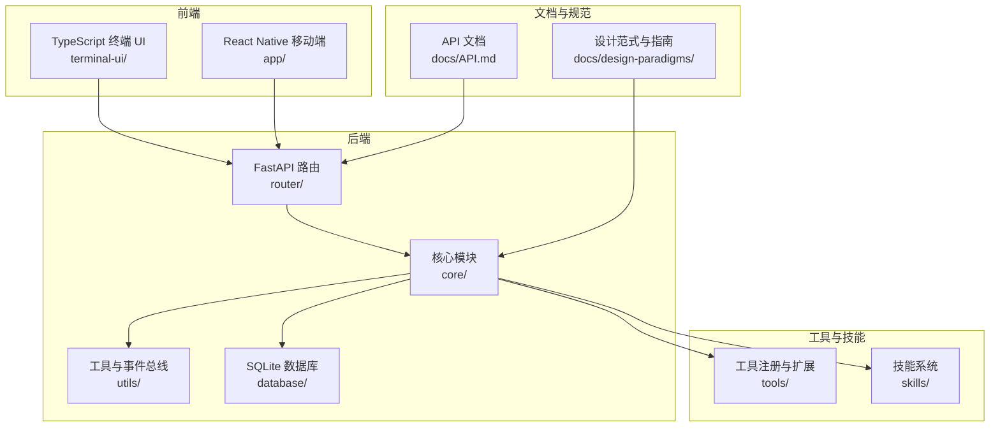
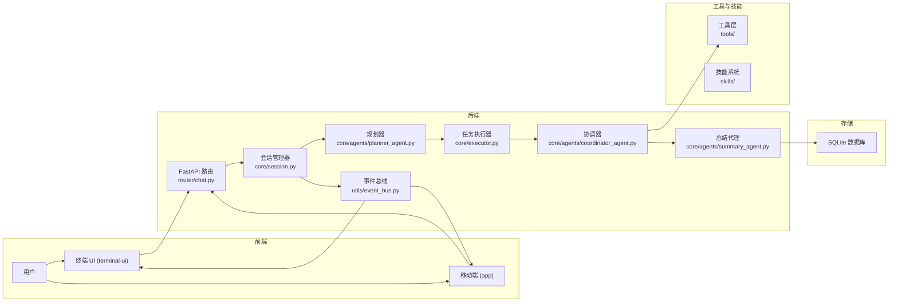
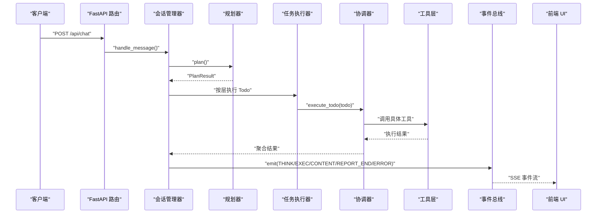
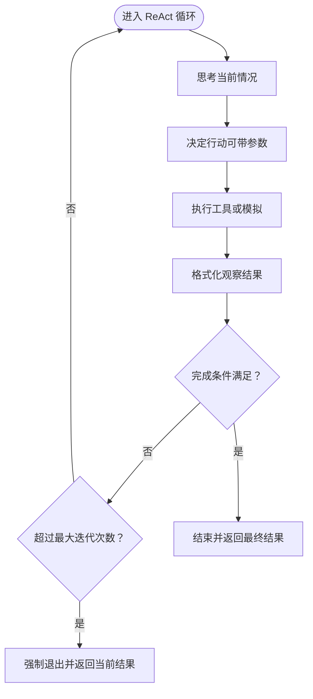
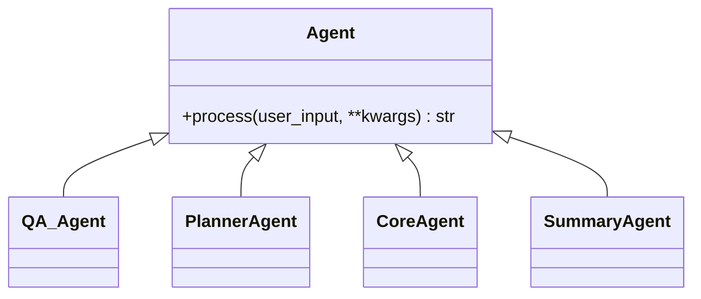
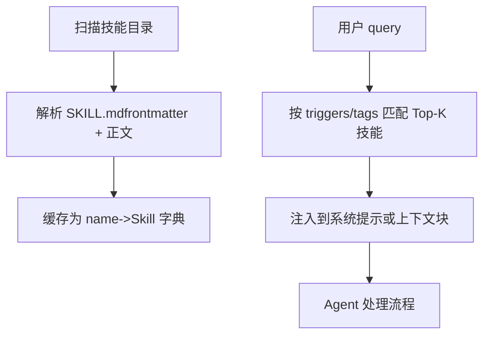
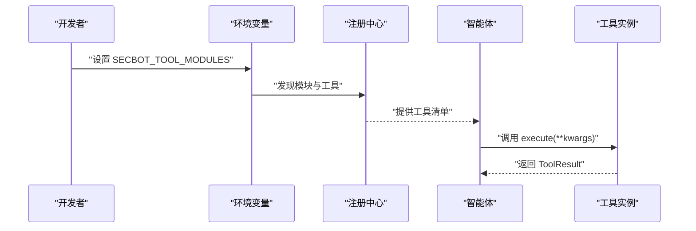
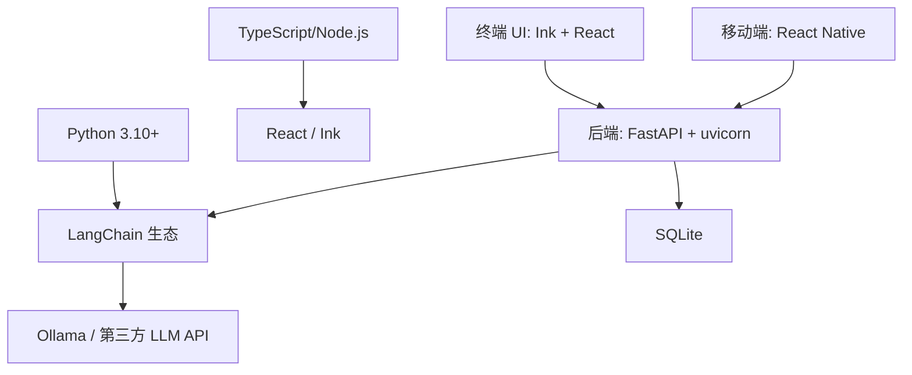

# 开发指南

<cite>
**本文引用的文件**
- [README_EN.md](file://README_EN.md)
- [README_CN.md](file://README_CN.md)
- [pyproject.toml](file://pyproject.toml)
- [app/package.json](file://app/package.json)
- [terminal-ui/package.json](file://terminal-ui/package.json)
- [docs/design-paradigms/commit-conventions.md](file://docs/design-paradigms/commit-conventions.md)
- [docs/design-paradigms/skill-plugin-system.md](file://docs/design-paradigms/skill-plugin-system.md)
- [docs/design-paradigms/react-and-tool-calling.md](file://docs/design-paradigms/react-and-tool-calling.md)
- [docs/design-paradigms/agent-architecture.md](file://docs/design-paradigms/agent-architecture.md)
- [docs/design-paradigms/session-and-events.md](file://docs/design-paradigms/session-and-events.md)
- [docs/design-paradigms/cli-and-dependencies.md](file://docs/design-paradigms/cli-and-dependencies.md)
- [docs/TOOL_EXTENSION.md](file://docs/TOOL_EXTENSION.md)
- [docs/SKILLS_AND_MEMORY.md](file://docs/SKILLS_AND_MEMORY.md)
- [docs/UI-DESIGN-AND-INTERACTION.md](file://docs/UI-DESIGN-AND-INTERACTION.md)
- [docs/API.md](file://docs/API.md)
- [main.py](file://main.py)
</cite>

## 目录
1. [简介](#简介)
2. [项目结构](#项目结构)
3. [核心组件](#核心组件)
4. [架构总览](#架构总览)
5. [详细组件分析](#详细组件分析)
6. [依赖关系分析](#依赖关系分析)
7. [性能考量](#性能考量)
8. [故障排查指南](#故障排查指南)
9. [结论](#结论)
10. [附录](#附录)

## 简介
本开发指南面向贡献者，提供Secbot项目的开发规范、插件与技能系统、贡献流程、开发环境与调试技巧、架构设计原则与扩展点，以及最佳实践与常见问题解决方案。内容基于仓库中的文档与代码组织，帮助你高效参与项目开发。

## 项目结构
Secbot是一个多语言混合项目，包含Python后端（FastAPI、LangChain、SQLite）、TypeScript终端UI（Ink + React）、React Native移动端应用、以及大量安全工具与技能系统。顶层README提供了安装、运行与开发的基本指引；docs目录包含设计范式与API文档；核心模块分布在core、tools、router、utils等目录。

图表来源
- [README_EN.md](file://README_EN.md#L75-L152)
- [docs/API.md](file://docs/API.md#L29-L38)

章节来源
- [README_EN.md](file://README_EN.md#L203-L294)
- [README_CN.md](file://README_CN.md#L279-L386)

## 核心组件
- 路由与会话编排：后端通过FastAPI路由接收请求，封装为会话并分发至Planner与执行器，事件通过EventBus与SSE流式下发到前端。
- 规划与执行：Planner将用户请求拆分为Todo，TaskExecutor按资源与风险安全并行执行；Coordinator将Todo路由到专用子Agent。
- 多智能体协作：Q&A、Planner、Core（Hackbot）、Summary等角色分工明确，通过上下文与事件总线解耦。
- 工具与技能：工具通过entry-point或环境变量动态注册；技能通过Markdown清单与注入器按需增强系统提示。
- UI与交互：TypeScript终端UI采用Ink+React，通过HTTP/SSE与后端通信；移动端基于React Native。

章节来源
- [README_EN.md](file://README_EN.md#L154-L196)
- [docs/design-paradigms/agent-architecture.md](file://docs/design-paradigms/agent-architecture.md#L1-L40)
- [docs/design-paradigms/session-and-events.md](file://docs/design-paradigms/session-and-events.md#L1-L36)
- [docs/design-paradigms/react-and-tool-calling.md](file://docs/design-paradigms/react-and-tool-calling.md#L1-L32)
- [docs/design-paradigms/skill-plugin-system.md](file://docs/design-paradigms/skill-plugin-system.md#L1-L42)

## 架构总览
下图映射README中的高层架构到具体源码模块，展示前后端、路由、会话、规划执行、多智能体、工具层、总结与存储、事件流与UI渲染的关系。

图表来源
- [README_EN.md](file://README_EN.md#L75-L152)
- [router/chat.py](file://router/chat.py)
- [core/session.py](file://core/session.py)
- [utils/event_bus.py](file://utils/event_bus.py)
- [core/agents/planner_agent.py](file://core/agents/planner_agent.py)
- [core/executor.py](file://core/executor.py)
- [core/agents/coordinator_agent.py](file://core/agents/coordinator_agent.py)
- [core/agents/summary_agent.py](file://core/agents/summary_agent.py)

## 详细组件分析

### 会话与事件总线范式
- 会话编排器负责创建/切换/恢复会话，按路由结果调用各Agent并收集当轮结果；依赖通过构造函数注入，支持可选回调。
- EventBus定义事件类型枚举，统一事件结构，按类型订阅；核心逻辑仅发射事件，UI层订阅并更新界面。
- UI与核心解耦：核心不引用UI组件，仅依赖EventBus与Console；UI订阅事件更新界面。

图表来源
- [docs/design-paradigms/session-and-events.md](file://docs/design-paradigms/session-and-events.md#L16-L35)
- [router/chat.py](file://router/chat.py)
- [core/session.py](file://core/session.py)
- [core/executor.py](file://core/executor.py)
- [core/agents/coordinator_agent.py](file://core/agents/coordinator_agent.py)

章节来源
- [docs/design-paradigms/session-and-events.md](file://docs/design-paradigms/session-and-events.md#L1-L36)

### ReAct 与工具调用范式
- ReAct循环：思考→行动→观察→判断是否继续；每轮可记录到响应片段或通过EventBus发出，便于调试与UI展示。
- 工具注册与描述：Agent持有工具列表，每个Tool包含name/description/parameters，对接LLM时转换为function calling格式。
- 执行层：根据action名称找到对应Tool，执行并格式化Observation；敏感操作在执行层做白名单与权限检查。
- 完成条件与迭代上限：在_is_complete中根据observation判断，设置max_iterations防止死循环。

图表来源
- [docs/design-paradigms/react-and-tool-calling.md](file://docs/design-paradigms/react-and-tool-calling.md#L5-L32)

章节来源
- [docs/design-paradigms/react-and-tool-calling.md](file://docs/design-paradigms/react-and-tool-calling.md#L1-L32)

### 多智能体架构范式
- 基类抽象与消息模型：统一process接口，消息模型标准化；历史与记忆分离。
- 路由分发：根据用户输入决定走问答还是技术/执行流；路由结果用明确类型，便于上层分支与测试。
- 多智能体分工：Q&A Agent只做对话；Planner解析意图；Core Agent带工具调用；Summary Agent做摘要。
- 依赖注入与获取智能体：上层持有一个get_agent(agent_type)，内部懒加载并缓存实例；审计、记忆、DB等可注入到Agent构造函数或setter。

图表来源
- [docs/design-paradigms/agent-architecture.md](file://docs/design-paradigms/agent-architecture.md#L5-L40)

章节来源
- [docs/design-paradigms/agent-architecture.md](file://docs/design-paradigms/agent-architecture.md#L1-L40)

### 技能/插件系统范式
- 技能目录约定：每个技能一个目录，至少包含SKILL.md；可选scripts/references/assets。
- SKILL.md与Frontmatter：YAML frontmatter + Markdown正文；建议字段：name、description、version、author、tags、triggers、prerequisites。
- 加载器职责：扫描技能根目录，解析frontmatter与正文，缓存name->Skill；提供按name/tag/trigger查询。
- 注入器：按query匹配技能，Top-K注入到系统提示或上下文块；在Agent的before/after钩子中增强prompt。
- 与智能体集成：通过函数扩展Agent，不侵入核心process逻辑。

图表来源
- [docs/design-paradigms/skill-plugin-system.md](file://docs/design-paradigms/skill-plugin-system.md#L11-L42)
- [docs/SKILLS_AND_MEMORY.md](file://docs/SKILLS_AND_MEMORY.md#L9-L62)

章节来源
- [docs/design-paradigms/skill-plugin-system.md](file://docs/design-paradigms/skill-plugin-system.md#L1-L42)
- [docs/SKILLS_AND_MEMORY.md](file://docs/SKILLS_AND_MEMORY.md#L1-L141)

### 工具扩展机制
- Entry Point（推荐，第三方包）：在扩展包的pyproject.toml中声明secbot.tools.basic或secbot.tools.advanced，指向模块属性或get_tools()。
- 环境变量（临时扩展）：SECBOT_TOOL_MODULES/SECBOT_TOOL_MODULES_ADVANCED，模块需导出TOOLS或*_TOOLS，或提供get_tools()，或导出*Tool类自动实例化。
- 工具类要求：继承tools.base.BaseTool，实现name/description/get_schema()/execute()；可选sensitivity="high"表示敏感操作。

图表来源
- [docs/TOOL_EXTENSION.md](file://docs/TOOL_EXTENSION.md#L5-L59)

章节来源
- [docs/TOOL_EXTENSION.md](file://docs/TOOL_EXTENSION.md#L1-L59)

### 终端UI与交互设计
- 技术栈概览：TypeScript（Ink + React）终端UI，通过HTTP/SSE与Python后端通信；CLI输出使用Python Rich。
- 布局与滚动：固定高度可滚动区域，区域内滚动查看历史；可见滚动条/行号指示；只渲染当前可见范围。
- 自适应布局：监听终端resize事件，动态计算列数/行数，根节点与主内容区高度、侧栏宽度基于当前尺寸计算。
- 交互钩子：useKeyboard、useRenderer、useTerminalDimensions；全局键盘与焦点管理；鼠标选区复制与对话框栈。
- 命令与命令面板：CommandProvider注册命令；支持快捷键、命令面板、Slash命令；DialogSelect通用列表。
- 主题系统：语义token + defs引用 + dark/light变体；支持系统主题跟随。
- 事件总线：类型安全事件定义与订阅，连接后端/MCP与多模块UI。

章节来源
- [docs/UI-DESIGN-AND-INTERACTION.md](file://docs/UI-DESIGN-AND-INTERACTION.md#L1-L242)

### API 设计与交互
- 健康检查：GET /health
- 聊天接口：POST /api/chat（SSE流式）、POST /api/chat/sync（同步）
- 智能体管理：GET /api/agents、POST /api/agents/clear
- 系统信息：GET /api/system/info、GET /api/system/status
- 防御系统：POST /api/defense/scan、GET /api/defense/status、GET /api/defense/blocked、POST /api/defense/unblock、GET /api/defense/report
- 网络管理：POST /api/network/discover、GET /api/network/targets、POST /api/network/authorize、GET /api/network/authorizations、DELETE /api/network/authorize/{target_ip}
- 数据库管理：GET /api/db/stats、GET /api/db/history、DELETE /api/db/history
- 错误处理：HTTP状态码200/400/500；错误响应包含detail字段

章节来源
- [docs/API.md](file://docs/API.md#L1-L512)

## 依赖关系分析
- 语言与运行时：Python 3.10+、TypeScript/Node.js
- 后端与基础设施：FastAPI、sse-starlette、uvicorn、uv、SQLite
- LLM与AI生态：LangChain系列、OpenAI/Anthropic/Google Gemini兼容API、Ollama
- 终端与日志：loguru、prompt_toolkit
- 安全与网络：requests/httpx、pydantic、sqlalchemy、nmap/scapy等
- 前端与移动端：React、React Native、Expo、Ink、React Navigation

图表来源
- [pyproject.toml](file://pyproject.toml#L29-L68)
- [README_EN.md](file://README_EN.md#L358-L366)

章节来源
- [pyproject.toml](file://pyproject.toml#L1-L165)
- [README_EN.md](file://README_EN.md#L358-L366)

## 性能考量
- 并行执行与资源隔离：TaskExecutor按层并行，同一资源高风险步骤强制串行，避免系统过载。
- 事件流与UI渲染：SSE事件流与前端组件解耦，避免UI阻塞；终端UI采用固定高度可滚动区域，仅渲染可见范围。
- 工具执行安全：敏感操作在执行层做白名单与权限检查，减少失败重试与无效调用。
- 依赖懒加载：CLI与API共享依赖注入模块，懒加载重型对象（Agent、DB、审计等），减少内存占用与启动时间。
- 日志与可观测：EventBus统一事件结构，便于监控与调试；UI订阅事件更新界面，提升可观测性。

章节来源
- [docs/design-paradigms/session-and-events.md](file://docs/design-paradigms/session-and-events.md#L24-L36)
- [docs/UI-DESIGN-AND-INTERACTION.md](file://docs/UI-DESIGN-AND-INTERACTION.md#L36-L52)
- [docs/design-paradigms/react-and-tool-calling.md](file://docs/design-paradigms/react-and-tool-calling.md#L16-L21)
- [docs/design-paradigms/cli-and-dependencies.md](file://docs/design-paradigms/cli-and-dependencies.md#L11-L21)

## 故障排查指南
- 后端服务启动与健康检查：使用uvicorn启动router.main:app，访问/health确认服务可用；Swagger UI与ReDoc提供接口文档。
- SSE流式输出监控：使用curl发起POST /api/chat，观察thought_chunk、action_result、content、report等事件流。
- 终端UI调试：通过main.py的--backend/--tui参数分别启动后端或TUI，便于定位问题；TUI采用tsx直接运行源码，确保最新变更生效。
- 错误日志：main.py捕获异常并写入hackbot_error.log，打包运行时暂停以便查看；UI与后端通过EventBus/事件总线上报错误。
- 依赖与环境：确保uv同步依赖；Ollama模型已拉取；.env配置正确；移动端与终端UI的package.json依赖已安装。

章节来源
- [docs/API.md](file://docs/API.md#L3-L26)
- [main.py](file://main.py#L1-L62)
- [README_EN.md](file://README_EN.md#L284-L294)

## 结论
本指南基于Secbot的多智能体架构、事件总线范式、ReAct与工具调用模式、技能/插件系统以及TypeScript终端UI设计，为贡献者提供了从开发规范、插件与技能扩展、贡献流程到调试与性能优化的完整参考。遵循这些原则与流程，有助于在保证系统稳定性的同时高效推进新功能开发与现有功能优化。

## 附录

### 开发环境搭建与调试
- Python后端：使用uv sync安装依赖；启动后端uvicorn router.main:app；运行测试pytest tests/。
- 终端UI：在terminal-ui目录执行npm install && npm run tui；或使用scripts脚本一键启动。
- 移动端：在app目录执行npm install && expo start，支持Android/iOS/Web。
- IDE配置：Python使用Black（line-length=120）；TypeScript使用默认TS配置；VS Code可安装Python/TypeScript扩展。
- 调试工具：SSE流式输出监控、EventBus事件订阅、UI命令面板与快捷键调试。

章节来源
- [README_EN.md](file://README_EN.md#L284-L294)
- [pyproject.toml](file://pyproject.toml#L149-L165)
- [terminal-ui/package.json](file://terminal-ui/package.json#L1-L35)
- [app/package.json](file://app/package.json#L1-L34)

### 贡献流程与协作规范
- 提交规范：采用Conventional Commits风格，type(scope): description；release提交固定格式。
- 分支管理：Fork仓库，feature/分支命名规范；提交后Push并打开PR。
- 代码审查：遵循项目设计范式与模块职责；确保EventBus、ReAct、工具调用与UI解耦。
- 社区参与：Issue讨论、PR评审、文档完善；遵守安全使用与法律合规要求。

章节来源
- [docs/design-paradigms/commit-conventions.md](file://docs/design-paradigms/commit-conventions.md#L1-L82)
- [README_EN.md](file://README_EN.md#L329-L338)

### 架构设计原则与扩展点
- 设计原则：抽象基类与统一接口、消息模型标准化、路由分流、多智能体分工、依赖注入与懒加载、事件驱动解耦。
- 扩展点：工具扩展（entry-point/环境变量）、技能系统（目录+SKILL.md）、UI主题与命令系统、会话与事件总线。
- 系统重构：保持EventBus与SSE接口稳定；Agent与工具接口不变；UI通过事件订阅解耦。

章节来源
- [docs/design-paradigms/agent-architecture.md](file://docs/design-paradigms/agent-architecture.md#L1-L40)
- [docs/design-paradigms/session-and-events.md](file://docs/design-paradigms/session-and-events.md#L1-L36)
- [docs/TOOL_EXTENSION.md](file://docs/TOOL_EXTENSION.md#L1-L59)
- [docs/SKILLS_AND_MEMORY.md](file://docs/SKILLS_AND_MEMORY.md#L1-L141)

### 插件开发指南（工具/智能体/技能/UI）
- 工具扩展：实现BaseTool子类，通过entry-point或环境变量注册；敏感工具设置sensitivity="high"。
- 智能体扩展：继承抽象基类，实现process接口；通过get_agent注入依赖；在before/after钩子中增强prompt。
- 技能开发：创建技能目录与SKILL.md（frontmatter+正文）；加载器按name/tag/trigger查询；注入器按Top-K注入。
- 界面扩展：基于Ink+React组件体系；通过EventBus订阅事件；支持命令面板、快捷键、主题系统。

章节来源
- [docs/TOOL_EXTENSION.md](file://docs/TOOL_EXTENSION.md#L49-L59)
- [docs/design-paradigms/skill-plugin-system.md](file://docs/design-paradigms/skill-plugin-system.md#L17-L42)
- [docs/UI-DESIGN-AND-INTERACTION.md](file://docs/UI-DESIGN-AND-INTERACTION.md#L128-L242)

### 代码规范与注释标准
- Python代码规范：使用Black（line-length=120），类型注解与pyproject.toml中mypy配置；pytest测试命名与asyncio模式。
- TypeScript代码规范：使用默认TS配置，组件与事件类型安全；Ink+React组件结构清晰。
- 文档编写规范：README与docs目录统一风格；设计范式文档模块化；API文档包含SSE事件类型与示例。
- 注释标准：模块顶部描述用途；复杂函数/类提供简要说明；遵循Conventional Commits提交信息格式。

章节来源
- [pyproject.toml](file://pyproject.toml#L149-L165)
- [docs/design-paradigms/commit-conventions.md](file://docs/design-paradigms/commit-conventions.md#L55-L82)
- [docs/API.md](file://docs/API.md#L1-L512)