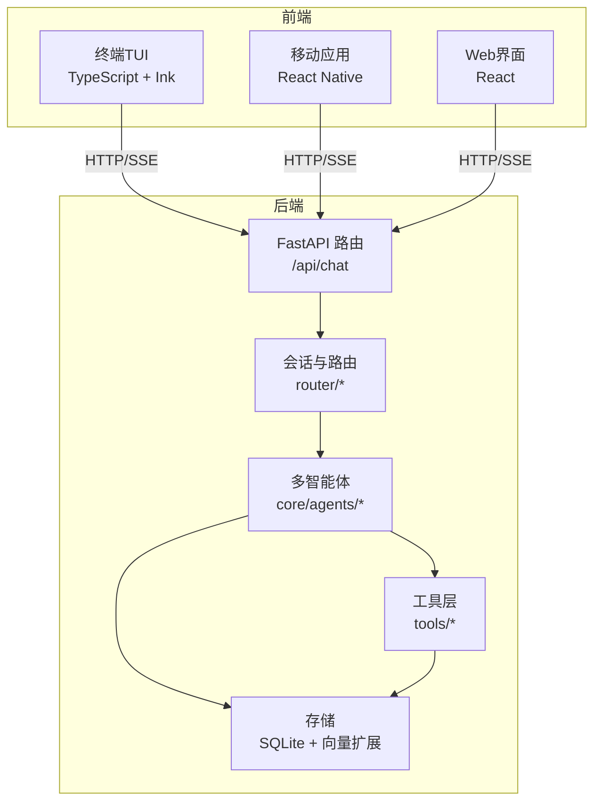
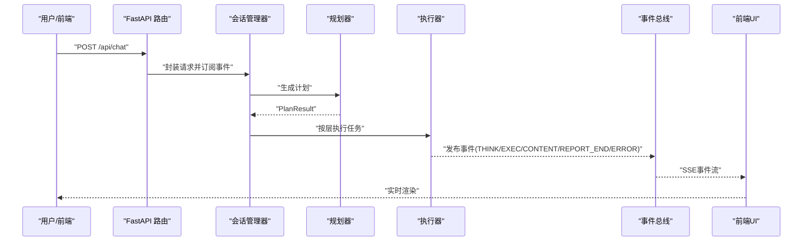
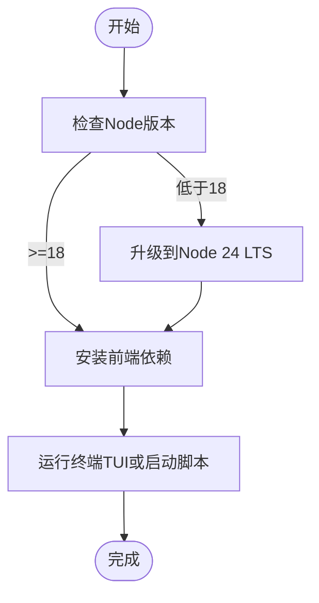
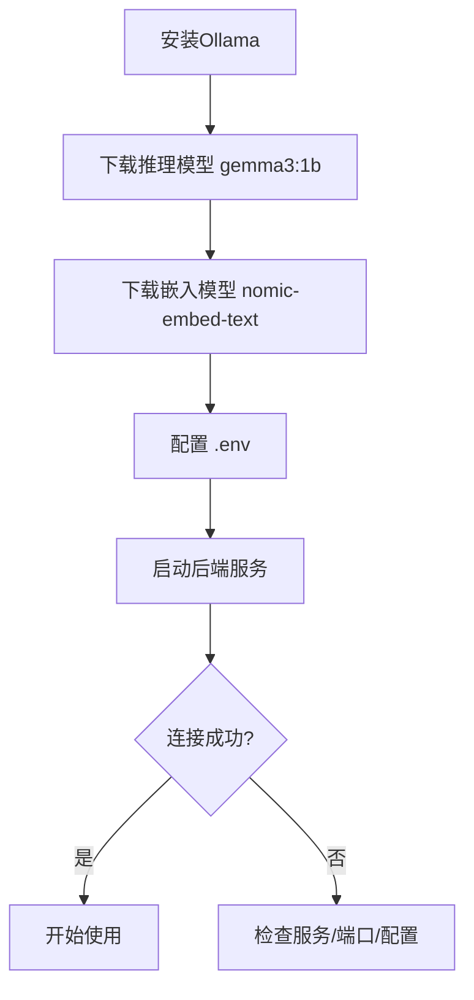
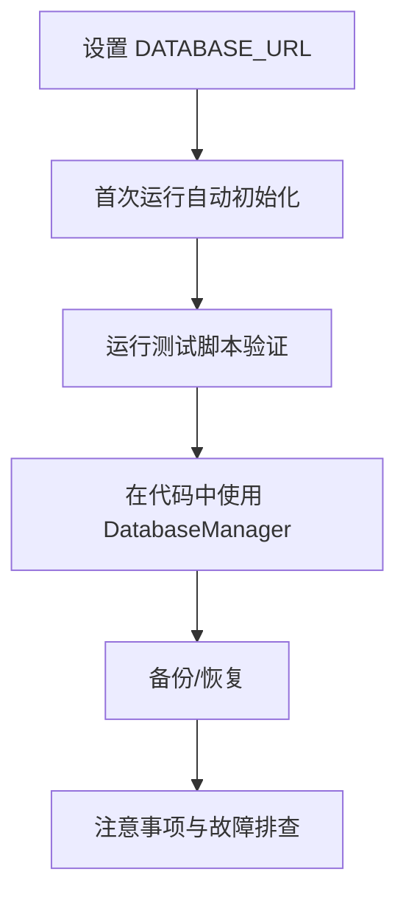
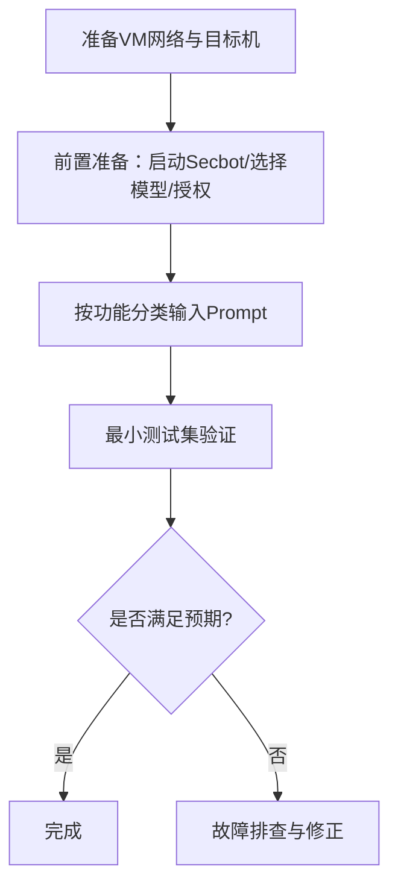
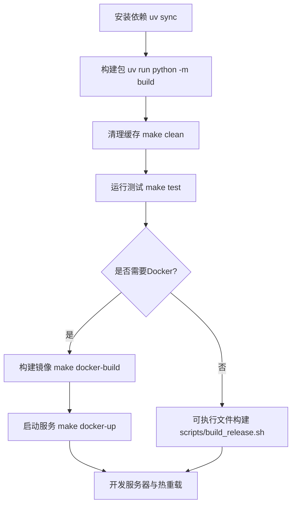
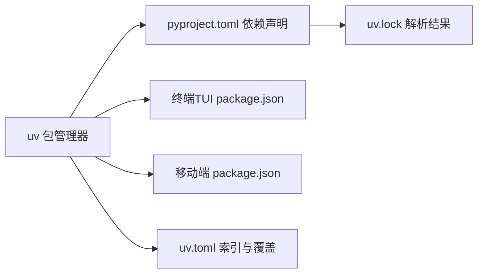

# 开发环境

<cite>
**本文引用的文件**
- [README_EN.md](file://README_EN.md)
- [docs/NODE_SETUP.md](file://docs/NODE_SETUP.md)
- [docs/OLLAMA_SETUP.md](file://docs/OLLAMA_SETUP.md)
- [docs/SQLITE_SETUP.md](file://docs/SQLITE_SETUP.md)
- [docs/VIRTUAL_TEST_ENVIRONMENT.md](file://docs/VIRTUAL_TEST_ENVIRONMENT.md)
- [pyproject.toml](file://pyproject.toml)
- [uv.toml](file://uv.toml)
- [uv.lock](file://uv.lock)
- [Makefile](file://Makefile)
- [scripts/build_release.sh](file://scripts/build_release.sh)
- [scripts/start-ts-tui.sh](file://scripts/start-ts-tui.sh)
- [terminal-ui/package.json](file://terminal-ui/package.json)
- [terminal-ui/tsconfig.json](file://terminal-ui/tsconfig.json)
- [app/package.json](file://app/package.json)
- [app/tsconfig.json](file://app/tsconfig.json)
</cite>

## 目录
1. [简介](#简介)
2. [项目结构](#项目结构)
3. [核心组件](#核心组件)
4. [架构总览](#架构总览)
5. [详细组件分析](#详细组件分析)
6. [依赖关系分析](#依赖关系分析)
7. [性能考虑](#性能考虑)
8. [故障排查指南](#故障排查指南)
9. [结论](#结论)
10. [附录](#附录)

## 简介
本指南面向Secbot项目的开发者，提供从零搭建本地开发环境的完整方案，覆盖Node.js与前端依赖、Ollama本地大模型、SQLite数据库、虚拟测试环境、IDE配置、开发工具使用、构建与打包流程，以及常见问题排查与最佳实践。内容基于仓库内的官方文档与配置文件整理而成，确保可操作性和一致性。

## 项目结构
Secbot采用前后端分离与多语言栈协同的架构：
- 后端：Python（FastAPI + LangChain + LangGraph），提供REST与SSE接口，负责会话、规划、执行与事件流。
- 前端：终端TUI（TypeScript + Ink）、移动端（React Native）、Web（React）。
- 工具层：丰富的渗透测试与安全工具集合，按领域拆分。
- 数据层：SQLite本地数据库，配合向量扩展（Linux/macOS）实现向量检索。

图示来源
- [README_EN.md](file://README_EN.md#L75-L152)

章节来源
- [README_EN.md](file://README_EN.md#L1-L379)

## 核心组件
- 后端服务：FastAPI + uvicorn，提供SSE事件流，承载会话管理、规划与执行。
- 多智能体系统：Planner、Coordinator、Specialist Agents等，支持并行与串行组合。
- 工具层：网络发现、漏洞扫描、Web研究、终端控制、防御监控等工具。
- 存储：SQLite持久化，支持向量扩展（Linux/macOS）。
- 前端：终端TUI（TypeScript）、移动端（React Native）、Web（React）。

章节来源
- [README_EN.md](file://README_EN.md#L67-L196)

## 架构总览
后端通过FastAPI暴露SSE端点，前端通过HTTP与SSE与后端交互；会话管理器协调规划与执行，事件总线驱动UI渲染；工具层封装各类安全能力；SQLite负责数据持久化。

图示来源
- [README_EN.md](file://README_EN.md#L154-L196)

章节来源
- [README_EN.md](file://README_EN.md#L154-L196)

## 详细组件分析

### Node.js 与前端环境配置
- 版本要求：终端TUI要求Node >= 18；推荐使用Node 24 LTS以获得更好的性能与兼容性。
- 在PyCharm中切换Node解释器：可通过“设置”中的“Node.js”条目添加或下载Node 24.x版本。
- 依赖安装：在项目app目录执行npm install，确保依赖与安全漏洞修复（已通过overrides固定markdown-it）。
- 终端TUI运行：在terminal-ui目录执行npm install后，使用npm run tui启动；或使用脚本./scripts/start-ts-tui.sh一键启动后端与TUI。
- TypeScript编译：终端TUI与移动端分别使用各自tsconfig.json，注意模块解析与目标版本。

图示来源
- [docs/NODE_SETUP.md](file://docs/NODE_SETUP.md#L1-L46)
- [terminal-ui/package.json](file://terminal-ui/package.json#L11-L16)
- [terminal-ui/tsconfig.json](file://terminal-ui/tsconfig.json#L1-L20)
- [app/tsconfig.json](file://app/tsconfig.json#L1-L19)
- [scripts/start-ts-tui.sh](file://scripts/start-ts-tui.sh#L1-L13)

章节来源
- [docs/NODE_SETUP.md](file://docs/NODE_SETUP.md#L1-L46)
- [terminal-ui/package.json](file://terminal-ui/package.json#L1-L35)
- [terminal-ui/tsconfig.json](file://terminal-ui/tsconfig.json#L1-L20)
- [app/tsconfig.json](file://app/tsconfig.json#L1-L19)
- [scripts/start-ts-tui.sh](file://scripts/start-ts-tui.sh#L1-L13)

### Ollama 模型配置
- 安装与启动：Windows下载安装后自动启动；Linux/Mac使用curl安装脚本；确保服务监听在默认端口11434。
- 模型下载：推理模型gemma3:1b用于对话；向量嵌入模型nomic-embed-text用于文本向量化；可选all-minilm（384维）。
- 验证：使用ollama list查看模型；ollama run gemma3:1b "你好"测试推理。
- 项目配置：复制.env.example为.env，设置OLLAMA_BASE_URL、OLLAMA_MODEL、OLLAMA_EMBEDDING_MODEL。
- 启动API服务：运行python main.py，后端默认在http://localhost:8000提供服务。
- 性能优化：大模型建议充足内存与GPU加速，必要时调整上下文窗口。

图示来源
- [docs/OLLAMA_SETUP.md](file://docs/OLLAMA_SETUP.md#L1-L96)

章节来源
- [docs/OLLAMA_SETUP.md](file://docs/OLLAMA_SETUP.md#L1-L96)

### SQLite 数据库配置
- 数据库用途：存储对话历史、提示词链、用户配置、爬虫与攻击任务、扫描结果等。
- 路径配置：在.env中设置DATABASE_URL（相对/绝对路径均可，默认data/m_bot.db）。
- 自动初始化：首次运行自动创建并初始化所有表结构。
- 连接测试：运行test_sqlite_connection.py验证数据库功能。
- 使用示例：通过DatabaseManager进行增删改查与统计。
- 备份与恢复：提供简单拷贝命令进行备份与恢复。
- 注意事项：数据库文件加入.gitignore；并发访问建议遵循SQLite多读单写特性；大量数据建议定期清理历史记录。

图示来源
- [docs/SQLITE_SETUP.md](file://docs/SQLITE_SETUP.md#L1-L170)

章节来源
- [docs/SQLITE_SETUP.md](file://docs/SQLITE_SETUP.md#L1-L170)

### 虚拟测试环境设置
- 网络模式：推荐仅主机或NAT，固定网段便于测试；确保宿主机与目标机互通（ping）。
- 目标机准备：Ubuntu 22.04 LTS，建议安装SSH与Web服务（nginx/apache2）；记录目标IP。
- 前置准备：启动Secbot（uv run secbot 或 python main.py）；选择Ollama或DeepSeek等模型；可选对目标进行授权（编辑data/authorizations.json或使用交互命令）。
- 功能验证：提供内网发现、端口与服务识别、漏洞扫描、Web检测、多步任务、报告与审计、专家模式等Prompt示例，便于自检。
- 最小测试集：内网发现→单机端口→漏洞扫描→报告生成，可一次性输入多步任务验证链路。
- 故障排查：网络连通性、未授权、模型无响应等问题的检查清单。

图示来源
- [docs/VIRTUAL_TEST_ENVIRONMENT.md](file://docs/VIRTUAL_TEST_ENVIRONMENT.md#L1-L218)

章节来源
- [docs/VIRTUAL_TEST_ENVIRONMENT.md](file://docs/VIRTUAL_TEST_ENVIRONMENT.md#L1-L218)

### IDE 配置建议（VSCode）
- Python：使用uv作为包管理器，Python解释器选择3.10+；启用pytest集成。
- TypeScript：终端TUI与Web前端使用ES2022目标与NodeNext模块解析；启用严格模式与JSX。
- React Native：移动端使用ESNext与bundler模块解析，启用react-native条件。
- 插件推荐：Python（pytest、black、flake8、mypy）、TypeScript/JavaScript（ESLint、Prettier）、GitLens、Docker、YAML。
- 调试配置：为Python后端（FastAPI）与TypeScript TUI分别配置launch.json；设置断点与环境变量（.env）。
- 代码格式化：统一使用black（Python）与prettier（TypeScript/JS）；在保存时自动格式化。

章节来源
- [pyproject.toml](file://pyproject.toml#L149-L165)
- [terminal-ui/tsconfig.json](file://terminal-ui/tsconfig.json#L1-L20)
- [app/tsconfig.json](file://app/tsconfig.json#L1-L19)

### 开发工具使用指南
- 调试技巧：后端使用uv run python -m debugpy（或vscode内置调试器）；前端TUI使用tsx调试；SSE事件流可在浏览器开发者工具Network中观察。
- 性能分析：Python端可使用cProfile或py-spy；前端可使用React DevTools与Ink调试面板。
- 日志配置：后端使用loguru，结合Python日志级别与格式；前端TUI可输出结构化日志。
- 问题诊断：结合SSE事件字段（agent）定位具体智能体；查看数据库统计与审计命令；核对.env配置与网络连通性。

章节来源
- [README_EN.md](file://README_EN.md#L358-L366)

### 构建与打包流程
- 依赖安装：使用uv sync（Makefile目标install）；或直接uv pip install -r requirements.txt。
- 构建Python包：uv run python -m build（Makefile目标build）。
- 清理：Makefile目标clean清理缓存与构建产物。
- 测试：Makefile目标test运行pytest。
- Docker：Makefile目标docker-build与docker-up；生产镜像基于docker-compose.prod.yml。
- 可执行文件：使用scripts/build_release.sh通过PyInstaller生成单文件可执行程序（dist/hackbot）。
- 开发服务器与热重载：终端TUI使用tsx（dev/tui/start脚本）；移动端使用Expo开发服务器；后端使用uvicorn（FastAPI）。

图示来源
- [Makefile](file://Makefile#L1-L43)
- [scripts/build_release.sh](file://scripts/build_release.sh#L1-L21)
- [terminal-ui/package.json](file://terminal-ui/package.json#L11-L16)

章节来源
- [Makefile](file://Makefile#L1-L43)
- [scripts/build_release.sh](file://scripts/build_release.sh#L1-L21)
- [terminal-ui/package.json](file://terminal-ui/package.json#L1-L35)

## 依赖关系分析
- Python依赖：通过pyproject.toml集中声明，使用uv进行解析与安装；optional-dependencies支持不同提供商与扩展工具。
- 包管理：uv作为首选包管理器与构建工具，提高安装与构建速度；uv.lock固定解析结果。
- 前端依赖：终端TUI与移动端分别维护package.json，确保模块解析与引擎版本匹配。
- 环境索引：uv.toml配置国内镜像源与torch版本覆盖，便于国内网络环境。

图示来源
- [pyproject.toml](file://pyproject.toml#L1-L165)
- [uv.toml](file://uv.toml#L1-L7)
- [uv.lock](file://uv.lock#L1-L485)

章节来源
- [pyproject.toml](file://pyproject.toml#L1-L165)
- [uv.toml](file://uv.toml#L1-L7)
- [uv.lock](file://uv.lock#L1-L485)

## 性能考虑
- Ollama：大模型建议充足内存与GPU加速；合理设置上下文窗口；模型未找到时自动拉取。
- SQLite：多读单写并发模型；大量数据建议定期清理历史记录；向量扩展在Linux/macOS启用。
- 前端：TypeScript目标ES2022，模块解析NodeNext；移动端bundler模式减少打包体积。
- 后端：FastAPI + uvicorn提供高性能异步支持；SSE事件流保证前端实时渲染。

## 故障排查指南
- Ollama连接失败：确认服务运行、端口未被占用、OLLAMA_BASE_URL配置正确。
- 模型未找到：使用ollama list查看；如缺失则ollama pull相应模型。
- 数据库文件锁定：检查是否存在其他进程占用；确保连接正确关闭。
- 权限问题：确保数据库文件所在目录具有写权限。
- 网络连通性：宿主机与目标机需互通（ping）；目标机防火墙放行相应端口。
- 未授权：使用交互命令或编辑data/authorizations.json添加授权。
- 模型无响应：确认已选择后端（/model）；检查Ollama服务与API Key配置。

章节来源
- [docs/OLLAMA_SETUP.md](file://docs/OLLAMA_SETUP.md#L69-L96)
- [docs/SQLITE_SETUP.md](file://docs/SQLITE_SETUP.md#L149-L170)
- [docs/VIRTUAL_TEST_ENVIRONMENT.md](file://docs/VIRTUAL_TEST_ENVIRONMENT.md#L196-L218)

## 结论
通过本指南，开发者可以快速完成Secbot的本地开发环境搭建，涵盖Node.js与前端、Ollama模型、SQLite数据库、虚拟测试环境、IDE配置、开发工具使用与构建打包流程。建议优先完成Node与Ollama配置，随后进行数据库初始化与虚拟测试环境验证，最后完善IDE与开发工具配置，以获得顺畅的开发体验。

## 附录
- 快速命令参考
  - 安装依赖：make install 或 uv sync
  - 构建包：make build 或 uv run python -m build
  - 运行测试：make test 或 uv run pytest tests/
  - 启动后端：python main.py 或 uv run secbot
  - 启动终端TUI：cd terminal-ui && npm run tui 或 ./scripts/start-ts-tui.sh
  - Docker：make docker-build / make docker-up / make docker-down
  - 可执行文件：./scripts/build_release.sh

章节来源
- [Makefile](file://Makefile#L1-L43)
- [scripts/start-ts-tui.sh](file://scripts/start-ts-tui.sh#L1-L13)
- [scripts/build_release.sh](file://scripts/build_release.sh#L1-L21)