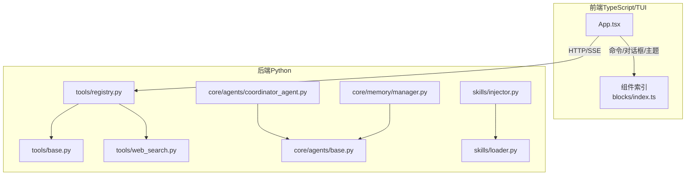
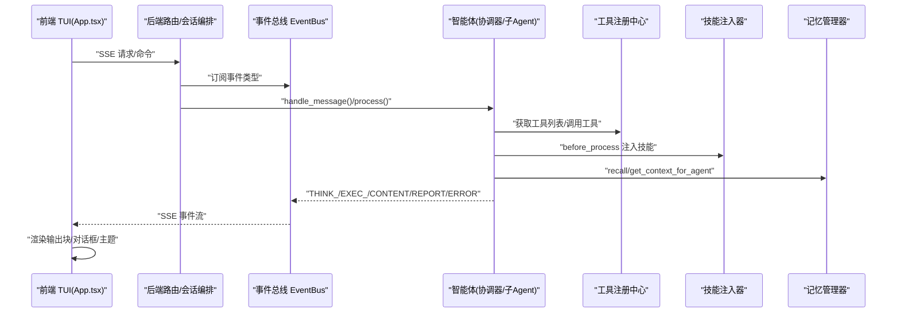
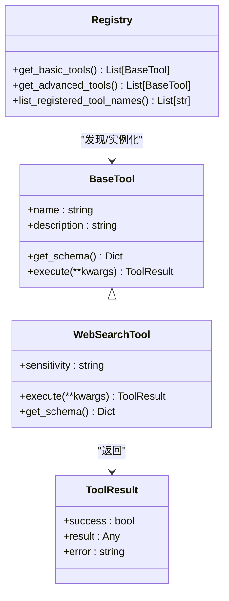
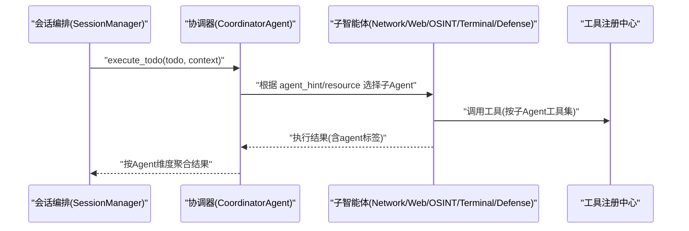
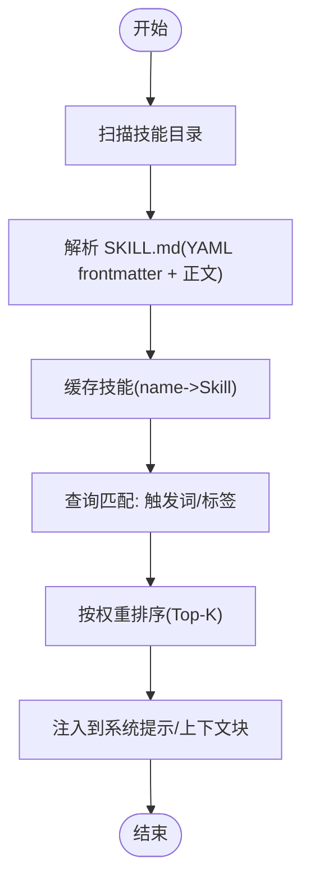
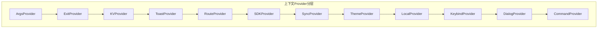
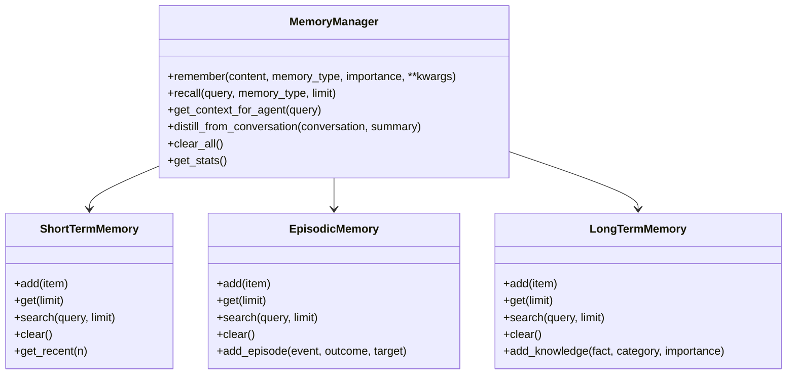
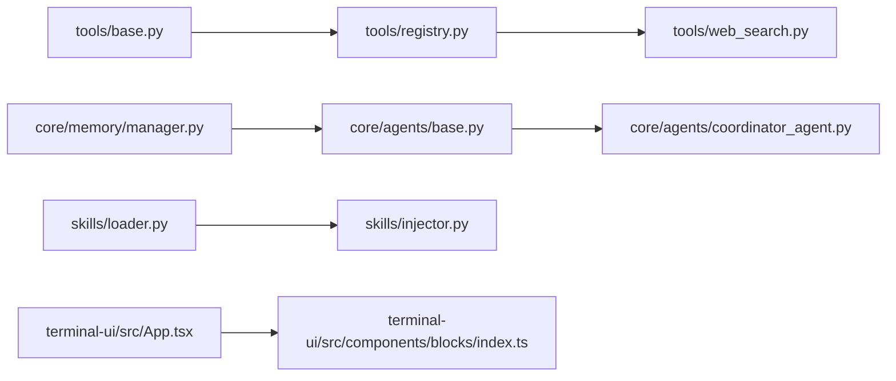

# 插件开发

<cite>
**本文引用的文件**
- [README_CN.md](file://README_CN.md)
- [README_EN.md](file://README_EN.md)
- [docs/TOOL_EXTENSION.md](file://docs/TOOL_EXTENSION.md)
- [docs/SKILLS_AND_MEMORY.md](file://docs/SKILLS_AND_MEMORY.md)
- [docs/UI-DESIGN-AND-INTERACTION.md](file://docs/UI-DESIGN-AND-INTERACTION.md)
- [docs/design-paradigms/skill-plugin-system.md](file://docs/design-paradigms/skill-plugin-system.md)
- [tools/base.py](file://tools/base.py)
- [tools/registry.py](file://tools/registry.py)
- [tools/web_search.py](file://tools/web_search.py)
- [core/agents/base.py](file://core/agents/base.py)
- [core/agents/coordinator_agent.py](file://core/agents/coordinator_agent.py)
- [skills/loader.py](file://skills/loader.py)
- [skills/injector.py](file://skills/injector.py)
- [core/memory/manager.py](file://core/memory/manager.py)
- [terminal-ui/src/App.tsx](file://terminal-ui/src/App.tsx)
- [terminal-ui/src/components/blocks/index.ts](file://terminal-ui/src/components/blocks/index.ts)
</cite>

## 目录
1. [简介](#简介)
2. [项目结构](#项目结构)
3. [核心组件](#核心组件)
4. [架构总览](#架构总览)
5. [详细组件分析](#详细组件分析)
6. [依赖分析](#依赖分析)
7. [性能考量](#性能考量)
8. [故障排查指南](#故障排查指南)
9. [结论](#结论)
10. [附录](#附录)

## 简介
本指南面向开发者，系统讲解 Secbot 的插件开发方法论与实操流程，覆盖工具扩展、智能体扩展、技能系统、界面扩展与内存系统扩展五大方向。文档结合项目源码与官方设计范式文档，提供从基类设计、注册机制、参数校验、消息处理、工具调用集成、生命周期管理，到技能加载与注入、UI 组件设计与状态管理、事件处理与用户体验优化，再到向量存储扩展、知识管理集成与数据持久化策略的完整路线。

## 项目结构
Secbot 采用“后端（Python）+ 前端（TypeScript/TUI）”双栈架构，核心能力通过多智能体协作与工具注册中心实现扩展。工具扩展通过入口点与环境变量自动发现；技能系统基于 Markdown 清单与注入器；内存系统提供三层记忆架构；前端 TUI 通过事件总线与后端交互，提供命令面板、对话框栈、主题系统与自适应布局。

**图表来源**
- [terminal-ui/src/App.tsx](file://terminal-ui/src/App.tsx#L1-L202)
- [terminal-ui/src/components/blocks/index.ts](file://terminal-ui/src/components/blocks/index.ts#L1-L40)
- [tools/base.py](file://tools/base.py#L1-L36)
- [tools/registry.py](file://tools/registry.py#L1-L142)
- [tools/web_search.py](file://tools/web_search.py#L1-L55)
- [core/agents/base.py](file://core/agents/base.py#L1-L125)
- [core/agents/coordinator_agent.py](file://core/agents/coordinator_agent.py#L1-L335)
- [skills/loader.py](file://skills/loader.py#L1-L182)
- [skills/injector.py](file://skills/injector.py#L1-L141)
- [core/memory/manager.py](file://core/memory/manager.py#L1-L325)

**章节来源**
- [README_CN.md](file://README_CN.md#L67-L271)
- [README_EN.md](file://README_EN.md#L67-L196)

## 核心组件
- 工具扩展体系
  - 基类与结果模型：工具基类定义统一接口，工具结果模型标准化返回结构。
  - 注册中心：支持入口点与环境变量两种发现机制，自动加载模块中的工具集合。
- 智能体扩展体系
  - 基类与消息模型：统一的智能体基类与消息模型，支持系统提示词、对话历史与记忆。
  - 协调器：多子智能体路由与结果聚合，兼容旧有流程。
- 技能系统
  - 加载器：扫描目录、解析 frontmatter、缓存技能清单与正文。
  - 注入器：按查询匹配触发词与标签，注入到系统提示或上下文块。
- 内存系统
  - 三层记忆：短期、情节与长期记忆，支持检索、蒸馏与持久化。
- 界面扩展
  - TUI 架构：上下文 Provider 分层、命令面板、对话框栈、主题系统与自适应布局。
  - 组件体系：输出块组件按类型承载不同内容，统一渲染与事件处理。

**章节来源**
- [tools/base.py](file://tools/base.py#L9-L36)
- [tools/registry.py](file://tools/registry.py#L106-L142)
- [core/agents/base.py](file://core/agents/base.py#L10-L125)
- [core/agents/coordinator_agent.py](file://core/agents/coordinator_agent.py#L40-L335)
- [skills/loader.py](file://skills/loader.py#L14-L182)
- [skills/injector.py](file://skills/injector.py#L12-L141)
- [core/memory/manager.py](file://core/memory/manager.py#L223-L325)
- [docs/UI-DESIGN-AND-INTERACTION.md](file://docs/UI-DESIGN-AND-INTERACTION.md#L55-L242)

## 架构总览
后端通过路由与会话编排层将前端请求转换为事件流，经由 EventBus 推送至前端 TUI。工具扩展通过注册中心自动发现并注入到智能体工具集；技能系统在智能体处理前后注入相关技能；内存系统提供上下文与历史检索；界面层通过命令面板、对话框与主题系统优化用户体验。

**图表来源**
- [README_CN.md](file://README_CN.md#L155-L271)
- [README_EN.md](file://README_EN.md#L154-L196)
- [terminal-ui/src/App.tsx](file://terminal-ui/src/App.tsx#L1-L202)
- [core/agents/coordinator_agent.py](file://core/agents/coordinator_agent.py#L118-L182)
- [skills/injector.py](file://skills/injector.py#L86-L141)
- [core/memory/manager.py](file://core/memory/manager.py#L270-L298)

## 详细组件分析

### 工具扩展开发
- 基类设计
  - 工具基类定义统一的异步执行接口与模式描述，工具结果模型标准化返回结构，便于上层统一处理。
- 注册机制
  - 支持入口点与环境变量两种方式：入口点用于第三方包，环境变量用于临时扩展。
  - 注册中心自动发现模块中的工具集合，支持常量、可调用函数与类实例化三种形式。
- 参数验证与处理
  - 工具执行前进行参数校验，缺失参数时返回错误结果；异常捕获并包装为工具结果，保证上层健壮性。
- 开发示例
  - 新增网络搜索工具：继承基类、实现执行逻辑与模式描述，通过环境变量或入口点注册。

**图表来源**
- [tools/base.py](file://tools/base.py#L16-L36)
- [tools/web_search.py](file://tools/web_search.py#L10-L55)
- [tools/registry.py](file://tools/registry.py#L106-L142)

**章节来源**
- [docs/TOOL_EXTENSION.md](file://docs/TOOL_EXTENSION.md#L1-L59)
- [tools/base.py](file://tools/base.py#L9-L36)
- [tools/registry.py](file://tools/registry.py#L28-L142)
- [tools/web_search.py](file://tools/web_search.py#L24-L55)

### 智能体扩展开发
- 基类继承与消息模型
  - 智能体基类提供系统提示词、消息历史与记忆接口，支持更新系统提示词与清理记忆。
- 消息处理机制
  - 统一的消息模型支持角色、内容与元数据；智能体可按需扩展对话历史与会话摘要。
- 工具调用集成
  - 协调器根据 Todo 的提示路由到子智能体，子智能体维护自身工具集与会话摘要，结果按 Agent 维度聚合。
- 生命周期管理
  - 会话开始前清空聚合结果，会话结束时将摘要同步到各子智能体，保证跨轮记忆。

**图表来源**
- [core/agents/coordinator_agent.py](file://core/agents/coordinator_agent.py#L130-L182)
- [core/agents/coordinator_agent.py](file://core/agents/coordinator_agent.py#L242-L331)
- [core/agents/base.py](file://core/agents/base.py#L17-L125)

**章节来源**
- [core/agents/base.py](file://core/agents/base.py#L10-L125)
- [core/agents/coordinator_agent.py](file://core/agents/coordinator_agent.py#L40-L335)

### 技能开发流程
- 目录扫描与清单提取
  - 加载器扫描技能根目录，每个技能目录包含 SKILL.md，解析 YAML frontmatter 与正文，缓存为技能对象。
- Markdown 解析与触发词匹配
  - 注入器根据查询对触发词与标签进行匹配，按权重排序，选择 Top-K 技能。
- 相关技能查找与注入
  - 注入器将技能注入到系统提示词末尾或单独上下文块，避免与主提示混淆；支持在处理前后记录使用情况。

**图表来源**
- [skills/loader.py](file://skills/loader.py#L129-L182)
- [skills/injector.py](file://skills/injector.py#L20-L84)
- [docs/design-paradigms/skill-plugin-system.md](file://docs/design-paradigms/skill-plugin-system.md#L17-L42)

**章节来源**
- [docs/SKILLS_AND_MEMORY.md](file://docs/SKILLS_AND_MEMORY.md#L9-L62)
- [skills/loader.py](file://skills/loader.py#L14-L182)
- [skills/injector.py](file://skills/injector.py#L12-L141)
- [docs/design-paradigms/skill-plugin-system.md](file://docs/design-paradigms/skill-plugin-system.md#L1-L42)

### 界面扩展开发
- 组件设计原则
  - 输出块组件按类型承载不同内容，统一渲染与事件处理；支持区域滚动、可见滚动条与自适应布局。
- 状态管理
  - 上下文 Provider 分层顺序固定，保证依赖顺序；支持主题、路由、命令、对话框、快捷键等能力。
- 事件处理
  - 全局键盘事件、对话框栈、Toast 反馈与命令面板；通过事件总线实现 UI 与后端解耦。
- 用户体验优化
  - 键盘优先、Leader 键、选区复制、自适应终端尺寸、错误边界与降级策略。

**图表来源**
- [docs/UI-DESIGN-AND-INTERACTION.md](file://docs/UI-DESIGN-AND-INTERACTION.md#L57-L91)
- [terminal-ui/src/App.tsx](file://terminal-ui/src/App.tsx#L1-L202)
- [terminal-ui/src/components/blocks/index.ts](file://terminal-ui/src/components/blocks/index.ts#L1-L40)

**章节来源**
- [docs/UI-DESIGN-AND-INTERACTION.md](file://docs/UI-DESIGN-AND-INTERACTION.md#L1-L242)
- [terminal-ui/src/App.tsx](file://terminal-ui/src/App.tsx#L1-L202)
- [terminal-ui/src/components/blocks/index.ts](file://terminal-ui/src/components/blocks/index.ts#L1-L40)

### 内存系统扩展指南
- 三层记忆架构
  - 短期记忆：会话上下文（队列，自动修剪）；情节记忆：跨会话事件与经验（JSON 文件）；长期记忆：持久化知识（JSON 文件）。
- 知识管理集成
  - 支持检索、蒸馏与持久化；可按类型添加知识与事件片段；提供统一上下文拼接方法。
- 数据持久化策略
  - 情节与长期记忆分别保存到独立 JSON 文件，自动创建目录并序列化；异常时记录警告并继续运行。

**图表来源**
- [core/memory/manager.py](file://core/memory/manager.py#L223-L325)
- [core/memory/manager.py](file://core/memory/manager.py#L51-L84)
- [core/memory/manager.py](file://core/memory/manager.py#L86-L153)
- [core/memory/manager.py](file://core/memory/manager.py#L154-L221)

**章节来源**
- [docs/SKILLS_AND_MEMORY.md](file://docs/SKILLS_AND_MEMORY.md#L64-L141)
- [core/memory/manager.py](file://core/memory/manager.py#L16-L325)

## 依赖分析
- 工具扩展依赖
  - 工具基类与结果模型为所有工具提供统一契约；注册中心依赖入口点与环境变量；具体工具实现依赖注册中心提供的工具集合。
- 智能体扩展依赖
  - 协调器依赖子智能体工具集与事件总线；子智能体依赖各自工具集与会话摘要；工具调用通过注册中心完成。
- 技能系统依赖
  - 注入器依赖加载器；加载器依赖目录扫描与 YAML 解析；前端通过命令面板与对话框展示技能列表。
- 内存系统依赖
  - 记忆管理器为智能体提供上下文；短期记忆依赖队列；情节与长期记忆依赖 JSON 文件存储。
- 界面扩展依赖
  - App.tsx 依赖上下文 Provider、命令面板、对话框与主题系统；组件索引统一导出输出块组件。

**图表来源**
- [tools/base.py](file://tools/base.py#L16-L36)
- [tools/registry.py](file://tools/registry.py#L106-L142)
- [tools/web_search.py](file://tools/web_search.py#L10-L55)
- [core/agents/base.py](file://core/agents/base.py#L17-L125)
- [core/agents/coordinator_agent.py](file://core/agents/coordinator_agent.py#L40-L335)
- [skills/loader.py](file://skills/loader.py#L14-L182)
- [skills/injector.py](file://skills/injector.py#L12-L141)
- [core/memory/manager.py](file://core/memory/manager.py#L223-L325)
- [terminal-ui/src/App.tsx](file://terminal-ui/src/App.tsx#L1-L202)
- [terminal-ui/src/components/blocks/index.ts](file://terminal-ui/src/components/blocks/index.ts#L1-L40)

**章节来源**
- [tools/registry.py](file://tools/registry.py#L106-L142)
- [core/agents/coordinator_agent.py](file://core/agents/coordinator_agent.py#L99-L113)
- [skills/injector.py](file://skills/injector.py#L86-L141)
- [core/memory/manager.py](file://core/memory/manager.py#L270-L325)
- [terminal-ui/src/App.tsx](file://terminal-ui/src/App.tsx#L1-L202)

## 性能考量
- 工具调用
  - 使用异步执行与结果模型标准化，减少上层分支判断成本；注册中心按需加载，避免一次性全量扫描。
- 智能体执行
  - 协调器按 Todo 的 agent_hint/resource 路由，子智能体专注领域，降低推理复杂度；按 Agent 维度聚合结果，便于后续汇总。
- 技能注入
  - 触发词匹配与权重排序在 Top-K 范围内完成，避免全量匹配；注入位置明确分隔，减少提示词冗余。
- 内存检索
  - 短期记忆使用队列，情节与长期记忆使用文件存储，检索时按类型分层；蒸馏与持久化异步处理，避免阻塞主线程。
- 界面渲染
  - 固定高度可滚动区域、仅渲染可见窗口、自适应布局与主题 token 化，提升终端渲染性能与可读性。

[本节为通用性能建议，不直接分析具体文件]

## 故障排查指南
- 工具加载失败
  - 检查模块路径与属性命名（TOOLS、*_TOOLS、get_tools、*Tool 类）；查看注册中心日志输出；确认入口点组名与环境变量设置。
- 工具执行异常
  - 参数校验失败时返回错误结果；捕获异常并包装为工具结果；检查工具描述与模式参数是否与调用一致。
- 技能注入无效
  - 确认 SKILL.md frontmatter 完整；触发词与标签大小写不敏感；注入位置与分隔标记一致；查看注入器日志。
- 内存持久化失败
  - 检查存储路径权限与目录创建；JSON 序列化异常时记录警告；必要时手动备份与恢复。
- 界面交互异常
  - 键盘事件匹配与 Leader 键逻辑；对话框栈管理与焦点恢复；Toast 与事件总线订阅；自适应布局尺寸变更。

**章节来源**
- [tools/registry.py](file://tools/registry.py#L28-L104)
- [tools/web_search.py](file://tools/web_search.py#L24-L44)
- [skills/injector.py](file://skills/injector.py#L42-L84)
- [core/memory/manager.py](file://core/memory/manager.py#L106-L141)
- [docs/UI-DESIGN-AND-INTERACTION.md](file://docs/UI-DESIGN-AND-INTERACTION.md#L94-L242)

## 结论
通过工具基类与注册中心、智能体基类与协调器、技能加载与注入、三层记忆与界面组件体系，Secbot 提供了完善的插件扩展能力。开发者可按本文档的流程与最佳实践，快速实现工具、智能体、技能与界面的扩展，并结合内存系统与事件总线，构建高性能、可维护、用户体验优良的安全测试自动化平台。

[本节为总结性内容，不直接分析具体文件]

## 附录
- 最佳实践
  - 工具：统一基类与结果模型，参数校验前置，异常捕获包装；通过入口点或环境变量注册。
  - 智能体：明确系统提示词与消息模型，按领域拆分子智能体，结果按 Agent 维度聚合。
  - 技能：规范 SKILL.md frontmatter，合理设置触发词与标签，注入位置明确分隔。
  - 界面：上下文 Provider 分层、命令面板与对话框统一抽象、主题 token 化、自适应布局。
  - 内存：按类型区分检索与持久化，蒸馏与检索异步处理，提供统一上下文拼接。
- 常见问题
  - 工具未被发现：检查入口点组名与环境变量；确认模块导出规范。
  - 技能未注入：检查 frontmatter 与触发词；确认注入位置与分隔标记。
  - 内存无法持久化：检查存储路径与权限；查看异常日志。
- 开发示例与测试
  - 工具示例：新增网络搜索工具，实现 execute 与 get_schema，通过环境变量注册。
  - 技能示例：编写 SKILL.md，设置触发词与标签，使用注入器在智能体处理前后注入。
  - 界面示例：注册命令、对话框与主题 Provider，实现自适应布局与键盘事件处理。
  - 测试建议：针对工具执行、技能匹配、内存检索与界面交互编写单元测试与集成测试。

**章节来源**
- [docs/TOOL_EXTENSION.md](file://docs/TOOL_EXTENSION.md#L39-L59)
- [docs/SKILLS_AND_MEMORY.md](file://docs/SKILLS_AND_MEMORY.md#L43-L62)
- [docs/UI-DESIGN-AND-INTERACTION.md](file://docs/UI-DESIGN-AND-INTERACTION.md#L222-L242)
- [tools/web_search.py](file://tools/web_search.py#L10-L55)
- [skills/injector.py](file://skills/injector.py#L121-L141)
- [core/memory/manager.py](file://core/memory/manager.py#L270-L325)