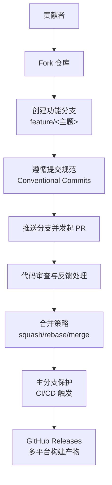
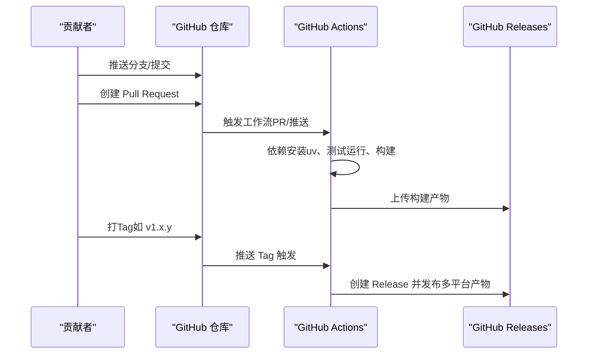
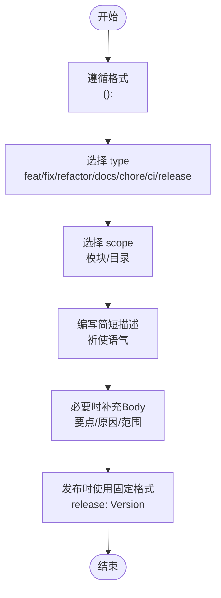
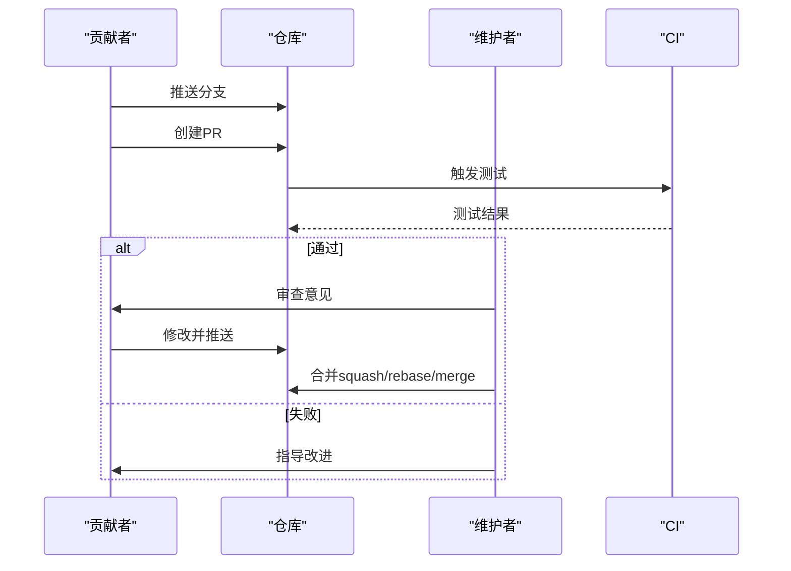
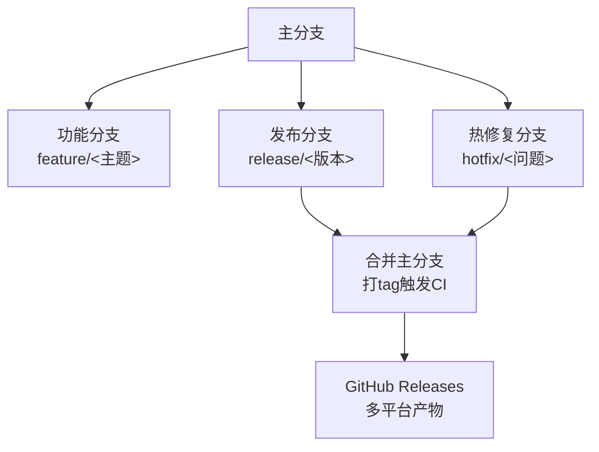
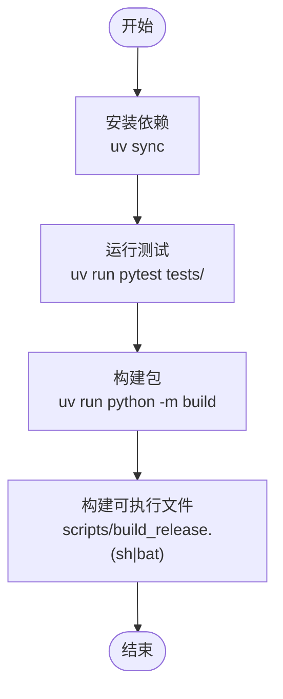
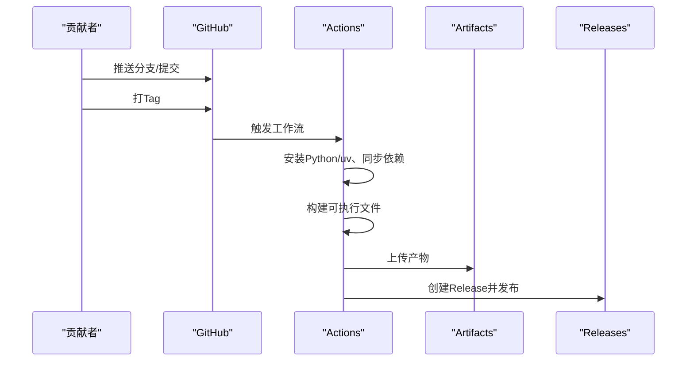
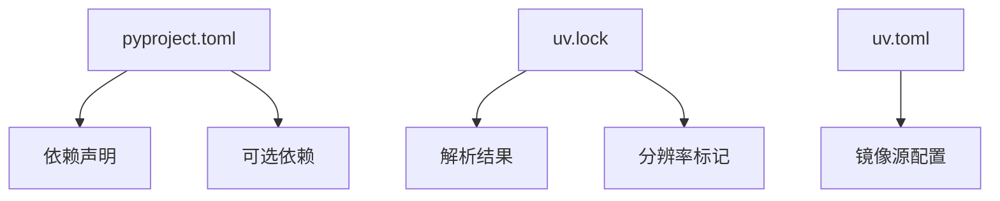

# 贡献流程

<cite>
**本文引用的文件**
- [README_CN.md](file://README_CN.md)
- [README_EN.md](file://README_EN.md)
- [.github/workflows/release.yml](file://.github/workflows/release.yml)
- [docs/RELEASE.md](file://docs/RELEASE.md)
- [docs/design-paradigms/commit-conventions.md](file://docs/design-paradigms/commit-conventions.md)
- [pyproject.toml](file://pyproject.toml)
- [Makefile](file://Makefile)
- [scripts/build_release.sh](file://scripts/build_release.sh)
- [scripts/build_release.bat](file://scripts/build_release.bat)
- [uv.toml](file://uv.toml)
- [uv.lock](file://uv.lock)
- [tests/test_all_tools.py](file://tests/test_all_tools.py)
</cite>

## 目录
1. [简介](#简介)
2. [项目结构](#项目结构)
3. [核心组件](#核心组件)
4. [架构总览](#架构总览)
5. [详细组件分析](#详细组件分析)
6. [依赖分析](#依赖分析)
7. [性能考虑](#性能考虑)
8. [故障排查指南](#故障排查指南)
9. [结论](#结论)
10. [附录](#附录)

## 简介
本文件面向社区贡献者，提供Secbot项目的完整贡献流程指南。内容涵盖提交规范（Conventional Commits、type/scope命名、release格式与提交信息最佳实践）、代码审查流程（PR创建、审查标准、反馈处理与合并策略）、分支管理策略（主分支保护、功能分支命名、发布分支与hotfix流程）、社区参与方式（问题报告、功能请求、讨论参与与文档贡献）、开发环境搭建（本地设置、依赖安装、测试运行与调试配置）、贡献者行为准则与沟通渠道、决策流程，以及CI/CD与自动化测试策略。

## 项目结构
Secbot是一个多语言混合项目，包含Python后端、TypeScript前端与终端UI、以及丰富的工具与测试模块。贡献流程围绕以下关键要素展开：
- 提交规范：统一的Conventional Commits格式与Scope约定，确保变更可追溯与可读。
- CI/CD：GitHub Actions自动化构建与发布，触发条件为打tag。
- 测试：Python测试套件与工具基础执行测试，保障核心功能稳定性。
- 文档：设计范式文档（提交规范）、发布说明与多语言README。

[本图为概念性结构示意，不直接映射具体源码文件，故无图表来源]

**章节来源**
- [README_CN.md](file://README_CN.md#L423-L432)
- [README_EN.md](file://README_EN.md#L329-L338)

## 核心组件
- 提交规范与约定
  - 基本格式：`<type>(<scope>): <description>`
  - 常用type：feat、fix、refactor、docs、chore、ci、release
  - Scope：与模块/目录对应，如core、agents、tools、router、hackbot等
  - Release提交：固定格式`release: Version <x.y.z>`，版本号与pyproject.toml一致
  - 描述与Body：简短、祈使语气；细节与要点放入Body或CHANGELOG
- CI/CD与发布
  - 触发条件：推送tag（如v1.0.0）或手动workflow_dispatch
  - 多平台构建：Linux、Windows、macOS（Apple/Intel芯片）
  - 发布说明：包含API Key配置、下载与运行说明
- 测试与质量
  - Python测试：pytest集中于tests/目录
  - 工具基础执行测试：覆盖Hash、编码解码、文件分析、日志分析、JWT分析、DNS查询、Ping Sweep、Banner Grab、系统信息、网络分析、自检扫描、入侵检测等
- 开发环境
  - 依赖管理：uv（替代requirements.txt），pyproject.toml集中声明
  - 构建与打包：Makefile与脚本支持构建可执行文件（PyInstaller）

**章节来源**
- [docs/design-paradigms/commit-conventions.md](file://docs/design-paradigms/commit-conventions.md#L1-L82)
- [.github/workflows/release.yml](file://.github/workflows/release.yml#L1-L116)
- [docs/RELEASE.md](file://docs/RELEASE.md#L1-L86)
- [tests/test_all_tools.py](file://tests/test_all_tools.py#L1-L313)
- [pyproject.toml](file://pyproject.toml#L1-L165)
- [Makefile](file://Makefile#L1-L43)

## 架构总览
贡献流程与CI/CD在本项目中的落地如下：

**图表来源**
- [.github/workflows/release.yml](file://.github/workflows/release.yml#L7-L11)
- [.github/workflows/release.yml](file://.github/workflows/release.yml#L16-L73)
- [.github/workflows/release.yml](file://.github/workflows/release.yml#L74-L116)

**章节来源**
- [.github/workflows/release.yml](file://.github/workflows/release.yml#L1-L116)
- [docs/RELEASE.md](file://docs/RELEASE.md#L7-L16)

## 详细组件分析

### 提交规范与最佳实践
- 格式与语义
  - type：feat/fix/refactor/docs/chore/ci/release等
  - scope：模块/目录，如core、agents、tools、router、hackbot、config、deps、deploy、ci
  - description：简短、祈使语气；细节放入Body或CHANGELOG
- Release提交
  - 固定格式：`release: Version <x.y.z>`，版本号与pyproject.toml一致
  - 详细变更写在CHANGELOG，不在commit body堆砌
- 示例与约定
  - feat(core): 统一智能体与安全ReAct使用_create_llm
  - refactor(hackbot): CLI与交互流程
  - fix(agents): qa_agent小改动
  - chore(deps): pyproject.toml更新
  - ci: 更新GitHub Actions工作流
  - release: Version 1.2.5

**图表来源**
- [docs/design-paradigms/commit-conventions.md](file://docs/design-paradigms/commit-conventions.md#L5-L21)
- [docs/design-paradigms/commit-conventions.md](file://docs/design-paradigms/commit-conventions.md#L46-L53)

**章节来源**
- [docs/design-paradigms/commit-conventions.md](file://docs/design-paradigms/commit-conventions.md#L1-L82)

### 代码审查流程
- PR创建
  - Fork仓库后创建功能分支（feature/<主题>）
  - 提交符合规范的变更，推送分支并发起PR
- 审查标准
  - 提交信息清晰、遵循Conventional Commits
  - 变更范围明确、有必要的测试覆盖
  - 文档与注释更新（如涉及）
- 反馈处理
  - 针对评论逐一响应与修改
  - 保持提交历史整洁（必要时rebase/squash）
- 合并策略
  - 维护者在CI通过后合并
  - 推荐squash合并以保持主分支历史简洁
  - 合并后关闭关联Issue/PR

**图表来源**
- [README_CN.md](file://README_CN.md#L423-L432)
- [README_EN.md](file://README_EN.md#L329-L338)

**章节来源**
- [README_CN.md](file://README_CN.md#L423-L432)
- [README_EN.md](file://README_EN.md#L329-L338)

### 分支管理策略
- 主分支保护
  - 通过CI检查后方可合并
  - 限制直接推送，强制PR流程
- 功能分支命名
  - 建议使用feature/<主题>，清晰表达意图
- 发布分支与hotfix
  - 发布：在pyproject.toml与__init__.py中更新版本号，提交并打tag触发CI构建与发布
  - hotfix：修复紧急问题时创建hotfix/<问题>分支，修复后合并至主分支并打新tag

**图表来源**
- [docs/RELEASE.md](file://docs/RELEASE.md#L9-L16)
- [pyproject.toml](file://pyproject.toml#L6-L7)

**章节来源**
- [docs/RELEASE.md](file://docs/RELEASE.md#L7-L16)
- [pyproject.toml](file://pyproject.toml#L6-L7)

### 社区参与方式
- 问题报告
  - 使用Issue模板描述问题，包含环境、复现步骤与期望结果
- 功能请求
  - 在Issue中提出需求，说明背景与收益
- 讨论参与
  - 通过PR与Issue进行技术讨论
- 文档贡献
  - 更新README、设计范式文档与发布说明

**章节来源**
- [README_CN.md](file://README_CN.md#L423-L432)
- [README_EN.md](file://README_EN.md#L329-L338)

### 开发环境搭建
- 依赖管理
  - 使用uv替代传统requirements.txt，更快解析与安装
  - 依赖集中在pyproject.toml，支持dev/optional依赖
- 安装与运行
  - 安装：uv sync
  - 运行测试：uv run pytest tests/ 或make test
  - 构建包：uv run python -m build 或make build
- 构建可执行文件
  - Linux/macOS：bash scripts/build_release.sh
  - Windows：scripts\build_release.bat
- 环境变量与镜像
  - uv.toml可配置镜像源（如清华镜像）
  - uv.lock锁定解析结果，确保一致性

**图表来源**
- [Makefile](file://Makefile#L16-L28)
- [scripts/build_release.sh](file://scripts/build_release.sh#L1-L21)
- [scripts/build_release.bat](file://scripts/build_release.bat#L1-L17)
- [uv.toml](file://uv.toml#L1-L7)
- [uv.lock](file://uv.lock#L1-L13)

**章节来源**
- [Makefile](file://Makefile#L1-L43)
- [scripts/build_release.sh](file://scripts/build_release.sh#L1-L21)
- [scripts/build_release.bat](file://scripts/build_release.bat#L1-L17)
- [uv.toml](file://uv.toml#L1-L7)
- [uv.lock](file://uv.lock#L1-L13)

### CI/CD与自动化测试
- 触发条件
  - 推送tag（如v1.0.0）或手动workflow_dispatch
- 任务矩阵
  - Ubuntu、Windows、macOS（Apple/Intel芯片）多平台构建
- 步骤概览
  - 安装Python与uv、同步依赖、安装PyInstaller、构建可执行文件、打包产物、上传Artifacts
  - 下载产物、获取版本号、创建Release并发布
- 测试策略
  - Python测试：pytest集中于tests/目录
  - 工具基础执行测试：覆盖Hash、编码解码、文件分析、日志分析、JWT分析、DNS查询、Ping Sweep、Banner Grab、系统信息、网络分析、自检扫描、入侵检测等

**图表来源**
- [.github/workflows/release.yml](file://.github/workflows/release.yml#L7-L11)
- [.github/workflows/release.yml](file://.github/workflows/release.yml#L16-L73)
- [.github/workflows/release.yml](file://.github/workflows/release.yml#L74-L116)

**章节来源**
- [.github/workflows/release.yml](file://.github/workflows/release.yml#L1-L116)
- [tests/test_all_tools.py](file://tests/test_all_tools.py#L1-L313)

## 依赖分析
- 依赖管理
  - uv作为包管理器，替代requirements.txt，提升安装速度与解析准确性
  - pyproject.toml集中声明依赖与可选依赖（dev、cli、anthropic、google、all-providers、exploit-tools）
- 解析锁定
  - uv.lock记录解析结果与分辨率标记，确保跨平台一致性
- 环境与镜像
  - uv.toml可配置镜像源，解决国内网络问题

**图表来源**
- [pyproject.toml](file://pyproject.toml#L29-L88)
- [uv.lock](file://uv.lock#L1-L13)
- [uv.toml](file://uv.toml#L1-L7)

**章节来源**
- [pyproject.toml](file://pyproject.toml#L1-L165)
- [uv.lock](file://uv.lock#L1-L13)
- [uv.toml](file://uv.toml#L1-L7)

## 性能考虑
- 依赖解析与安装
  - 使用uv替代pip，显著提升依赖解析与安装速度
- 构建与打包
  - 多平台并行构建，减少整体等待时间
- 测试执行
  - pytest异步模式支持，提高测试效率
- 产物体积与加载
  - PyInstaller单文件打包，便于分发与运行

[本节为通用指导，不直接分析具体文件，故无章节来源]

## 故障排查指南
- 依赖安装失败
  - 检查uv.toml镜像源配置，必要时切换为官方源
  - 清理缓存后重试：uv sync --clear
- 构建失败
  - 确认PyInstaller已安装
  - 检查脚本权限（Linux/macOS）与路径
- 测试失败
  - 运行tests/test_all_tools.py进行工具基础执行测试
  - 关注失败统计与失败用例，定位问题范围
- 发布失败
  - 确认tag格式与版本号一致
  - 查看Actions日志与Artifacts上传状态

**章节来源**
- [uv.toml](file://uv.toml#L1-L7)
- [scripts/build_release.sh](file://scripts/build_release.sh#L1-L21)
- [scripts/build_release.bat](file://scripts/build_release.bat#L1-L17)
- [tests/test_all_tools.py](file://tests/test_all_tools.py#L1-L313)
- [.github/workflows/release.yml](file://.github/workflows/release.yml#L74-L116)

## 结论
本贡献流程文档以Conventional Commits为基石，结合CI/CD自动化与完善的测试体系，为社区贡献者提供了清晰、可执行的协作路径。遵循本文规范，可显著提升代码质量、审查效率与发布可靠性。

## 附录
- 行为准则与沟通渠道
  - 遵循项目安全警告与许可条款
  - 通过Issue/PR进行技术讨论，保持尊重与专业
- 决策流程
  - 重大变更通过Issue讨论与PR审查，维护者最终决定
- 发布说明与使用
  - 参考docs/RELEASE.md获取下载、配置与运行说明

**章节来源**
- [README_CN.md](file://README_CN.md#L13-L20)
- [README_EN.md](file://README_EN.md#L13-L19)
- [docs/RELEASE.md](file://docs/RELEASE.md#L1-L86)