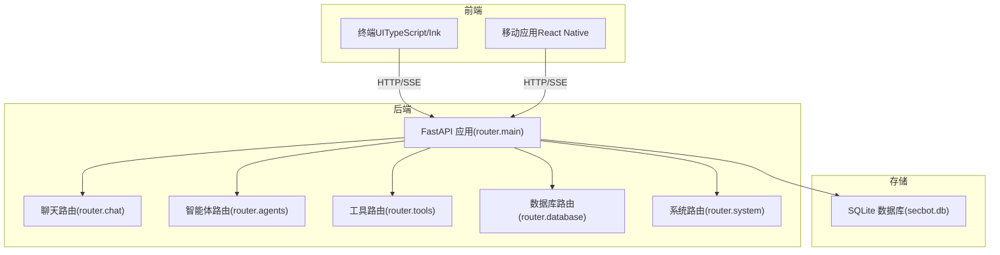
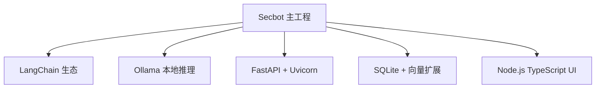

# 快速开始

<cite>
**本文引用的文件**
- [README_EN.md](file://README_EN.md)
- [pyproject.toml](file://pyproject.toml)
- [uv.toml](file://uv.toml)
- [hackbot/cli.py](file://hackbot/cli.py)
- [main.py](file://main.py)
- [router/main.py](file://router/main.py)
- [docs/OLLAMA_SETUP.md](file://docs/OLLAMA_SETUP.md)
- [docs/NODE_SETUP.md](file://docs/NODE_SETUP.md)
- [terminal-ui/scripts/check-connection.mts](file://terminal-ui/scripts/check-connection.mts)
- [terminal-ui/package.json](file://terminal-ui/package.json)
- [scripts/start-cli.ps1](file://scripts/start-cli.ps1)
- [scripts/start-ts-tui.ps1](file://scripts/start-ts-tui.ps1)
- [Makefile](file://Makefile)
- [build.sh](file://build.sh)
- [hackbot_config/__init__.py](file://hackbot_config/__init__.py)
</cite>

## 目录
1. [简介](#简介)
2. [系统要求](#系统要求)
3. [安装与配置](#安装与配置)
4. [运行与使用](#运行与使用)
5. [架构概览](#架构概览)
6. [详细组件分析](#详细组件分析)
7. [依赖关系分析](#依赖关系分析)
8. [性能与资源建议](#性能与资源建议)
9. [故障排查](#故障排查)
10. [结语](#结语)

## 简介
Secbot（原名Hackbot）是一个面向自动化渗透测试与安全巡检的智能体平台，支持多智能体协作、工具链集成、终端会话、语音交互、Web研究与实时爬虫等功能。本文提供从零开始的快速上手指南，覆盖系统要求、安装步骤、环境变量配置、模型下载与初始化、交互模式与终端UI使用、API调用示例，以及常见问题排查。

## 系统要求
- Python 版本：3.10及以上
- 包管理器：uv（推荐，替代pip）
- 大语言模型推理：Ollama（本地推理）
- 可选：Node.js 18+（用于TypeScript终端UI）

章节来源
- file://README_EN.md#L203-L209
- file://docs/NODE_SETUP.md#L31-L39

## 安装与配置

### 1) 克隆仓库与安装依赖
- 使用uv进行依赖同步，推荐使用uv而非传统pip，速度快且确定性强。
- 如需构建发布包，可使用uv或标准构建脚本。

步骤要点
- 克隆仓库后，使用uv同步依赖。
- 如需构建wheel包，可使用uv或shell脚本。

章节来源
- file://README_EN.md#L212-L230
- file://Makefile#L16-L18
- file://build.sh#L29-L37

### 2) 安装并启动Ollama（本地推理）
- 下载并安装Ollama（Windows/Mac/Linux均有官方安装包）。
- 拉取推理模型与嵌入模型（如gemma3:1b、nomic-embed-text）。
- 默认Ollama服务监听本地端口，可在.env中配置基础URL。

章节来源
- file://docs/OLLAMA_SETUP.md#L3-L50
- file://README_EN.md#L231-L242

### 3) 环境变量配置
- 复制示例环境文件为实际使用的.env。
- 关键变量包括：
  - OLLAMA_BASE_URL：Ollama服务地址（默认本地）
  - OLLAMA_MODEL：推理模型名称（默认gemma3:1b）
  - OLLAMA_EMBEDDING_MODEL：嵌入模型名称（默认nomic-embed-text）
- 其他可选变量（如数据库、日志级别、语音引擎等）可在配置模块中查看。

章节来源
- file://README_EN.md#L243-L248
- file://hackbot_config/__init__.py#L156-L235

### 4) 从源码安装与发布版安装
- 源码安装：使用uv同步依赖后，可通过命令行直接运行。
- 发布版安装：构建wheel包后使用uv或pip安装，安装后可直接使用命令进入交互模式。

章节来源
- file://README_EN.md#L253-L264
- file://build.sh#L43-L46
- file://pyproject.toml#L90-L94

## 运行与使用

### 交互模式（终端接管）
- 无参数运行主程序或通过命令进入交互模式。
- 支持自然语言指令与斜杠命令（如列出目标、授权、防御扫描、系统信息、数据库统计、提示词列表等）。
- 退出方式：exit或quit。

章节来源
- file://README_EN.md#L266-L279
- file://main.py#L44-L52

### 终端UI（TypeScript + Ink）
- 后端先行：启动FastAPI服务（默认端口8000）。
- 前端TUI：在terminal-ui目录下安装依赖并启动TUI。
- 可通过脚本一键启动后端并在新窗口启动TUI。
- 连通性检测：可使用提供的脚本验证后端健康与SSE流。

章节来源
- file://README_EN.md#L284-L294
- file://scripts/start-ts-tui.ps1#L1-L10
- file://terminal-ui/scripts/check-connection.mts#L1-L67
- file://terminal-ui/package.json#L11-L16

### API接口调用示例
- 后端服务默认地址：http://localhost:8000
- 常用端点：
  - GET /api/agents：列出可用智能体
  - GET /api/tools：列出已集成的安全测试工具
  - POST /api/chat：流式聊天接口（SSE）
  - POST /api/chat/sync：同步聊天接口
- 可通过脚本检查连通性，验证SSE事件流。

章节来源
- file://hackbot/cli.py#L58-L67
- file://router/main.py#L63-L65
- file://terminal-ui/scripts/check-connection.mts#L5-L25

## 架构概览
Secbot采用前后端分离架构：前端（TUI/移动端）通过HTTP/SSE与后端FastAPI通信；后端负责会话编排、规划执行、多智能体协调与工具层调用；数据持久化使用SQLite。

图表来源
- [router/main.py](file://router/main.py#L19-L71)
- [README_EN.md](file://README_EN.md#L75-L152)

## 详细组件分析

### 后端服务入口（FastAPI）
- 应用工厂创建FastAPI实例，注册CORS与各路由。
- 启动时初始化数据库，提供健康检查端点。
- 提供统一的uvicorn运行入口，支持端口占用检测。

章节来源
- file://router/main.py#L19-L71
- file://router/main.py#L74-L101

### CLI入口与命令分发
- 支持三种运行模式：启动后端+TUI、仅后端、仅TUI。
- 提供帮助信息与核心智能体说明。
- 错误捕获与日志输出，便于定位问题。

章节来源
- file://hackbot/cli.py#L32-L80
- file://main.py#L44-L62

### 环境变量与配置加载
- 通过dotenv加载.env，支持打包场景下的路径修正。
- 提供多种配置项（模型、嵌入、数据库、日志、语音等）。
- 对外部API密钥（如Shodan/VirusTotal）支持keyring存储。

章节来源
- file://hackbot_config/__init__.py#L16-L249

### 终端UI与连通性检测
- TUI通过HTTP/SSE与后端通信，默认读取环境变量中的API地址。
- 提供连通性检测脚本，验证系统信息与SSE事件流。

章节来源
- file://terminal-ui/scripts/check-connection.mts#L5-L61
- file://terminal-ui/package.json#L31-L33

## 依赖关系分析
- 语言与运行时：Python 3.10+、uv、FastAPI、uvicorn、sse-starlette、sqlite-vec/sqlite-vss（非Windows）。
- LLM与AI生态：LangChain系列、Ollama、可选Anthropic/Google等提供商。
- 前端与移动：React、React Native、Ink、Expo。
- 安全与网络工具：nmap、scapy、selenium、playwright等（按需启用）。

图表来源
- [pyproject.toml](file://pyproject.toml#L29-L69)
- [README_EN.md](file://README_EN.md#L358-L364)

章节来源
- file://pyproject.toml#L29-L69

## 性能与资源建议
- Ollama模型选择：根据硬件条件选择合适模型大小；大模型建议充足内存与GPU加速。
- 端口与并发：后端默认端口8000，注意避免端口冲突。
- 依赖镜像：国内用户可调整uv索引源以提升安装速度。

章节来源
- file://docs/OLLAMA_SETUP.md#L89-L96
- file://uv.toml#L1-L7
- file://router/main.py#L83-L97

## 故障排查

常见问题与解决思路
- Ollama连接失败
  - 确认服务已启动、端口未被占用、基础URL配置正确。
- 模型未找到
  - 使用列表命令查看已安装模型，必要时手动拉取。
- 端口占用导致后端无法启动
  - 检查端口占用并释放，或修改端口。
- TUI无法连接后端
  - 使用连通性脚本检查系统信息与SSE事件流。
- Node版本不兼容
  - 确保Node版本满足要求，按文档指引在IDE中切换或使用本机安装。

章节来源
- file://docs/OLLAMA_SETUP.md#L69-L96
- file://router/main.py#L83-L97
- file://terminal-ui/scripts/check-connection.mts#L7-L61
- file://docs/NODE_SETUP.md#L8-L39

## 结语
按照本指南，您可以在几分钟内完成Secbot的安装与配置，并通过交互模式或终端UI体验核心功能。如需进一步扩展（如接入更多LLM提供商、启用特定工具集），可参考项目文档与路由定义逐步深入。